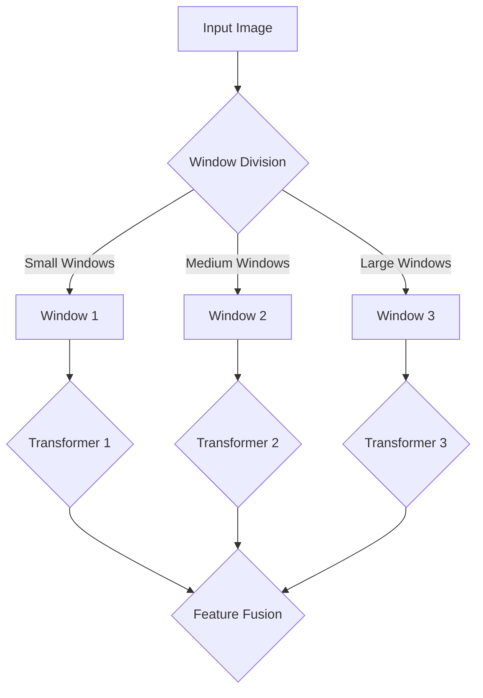

                 

### 背景介绍

SwinTransformer是一种近年来在计算机视觉领域崭露头角的变换器架构，旨在解决传统卷积神经网络在处理图像时遇到的瓶颈。随着深度学习技术的发展，卷积神经网络（CNN）已经成为计算机视觉任务的标准解决方案，但是它们在处理高分辨率图像时存在计算量大、参数复杂等问题。SwinTransformer提出了一种新颖的局部到全局的图像处理方式，通过自适应地调整窗口大小，实现了高效率和高性能。

SwinTransformer最早由微软亚洲研究院（Microsoft Research Asia）在2020年提出。该论文在《计算机视觉国际会议》（ICCV）上发表，引起了广泛关注。论文标题为《Swin Transformer: Hierarchical Vision Transformer using Shifted Windows》，提出了SwinTransformer的结构和实现细节。这一架构结合了Transformer模型的全局信息捕捉能力，以及卷积神经网络在处理局部信息上的优势。

SwinTransformer的设计灵感来源于Transformer模型在自然语言处理（NLP）领域的成功。Transformer模型通过自注意力机制实现了对输入序列的全局依赖关系建模，使得模型能够捕捉长距离的依赖信息。然而，直接将Transformer应用于图像处理存在计算复杂度高、难以处理高分辨率图像的问题。SwinTransformer通过引入窗口机制，将图像分割成多个局部窗口，并在窗口内使用Transformer结构进行特征提取，从而实现了高效的处理方式。

SwinTransformer的核心贡献在于其在图像处理中的应用，通过实验证明了其相较于传统卷积神经网络和Transformer模型在速度和性能上的优势。此外，SwinTransformer也展示了如何将Transformer模型应用于计算机视觉领域，为未来的研究提供了新的思路。

在本文中，我们将详细介绍SwinTransformer的核心概念、原理以及具体实现步骤。通过本文的阅读，读者将能够理解SwinTransformer的工作机制，并掌握其实现方法。接下来，我们将首先介绍SwinTransformer的核心概念与联系，以便为后续内容打下基础。

## 1. 核心概念与联系

SwinTransformer的核心概念主要包括窗口机制、变换器结构以及层次化的设计思想。这些概念相互联系，共同构成了SwinTransformer的独特架构。

### 1.1 窗口机制

窗口机制是SwinTransformer设计的关键之一。它通过将图像分割成多个局部窗口，在每个窗口内应用Transformer结构进行特征提取。窗口机制有以下两个重要作用：

1. **降低计算复杂度**：通过将图像分割成较小窗口，可以减少模型在全局图像上的计算复杂度。每个窗口内的计算相对独立，可以并行处理，从而提高整体计算效率。
2. **捕捉局部信息**：窗口机制使得模型能够专注于局部区域的特征，有助于更好地捕捉图像中的细节信息。

窗口机制的具体实现过程如下：

- **窗口划分**：首先，将图像分割成多个大小不同的窗口。这些窗口可以是规则的，例如正方形或矩形，也可以是不规则的，例如金字塔结构。
- **窗口内特征提取**：在每个窗口内，应用Transformer结构进行特征提取。这些特征将作为后续层次化处理的输入。

### 1.2 变换器结构

变换器结构是SwinTransformer的核心组件。它基于Transformer模型，但对其进行了针对性的优化，以适应图像处理任务的需求。变换器结构主要包括以下几个部分：

- **多头自注意力机制**：多头自注意力机制可以捕捉窗口内不同位置的特征之间的关系，有助于提取丰富的特征信息。
- **前馈神经网络**：前馈神经网络对自注意力机制的结果进行进一步加工，增强模型的表达能力。
- **层归一化和残差连接**：层归一化和残差连接有助于缓解模型训练过程中的梯度消失和梯度爆炸问题，提高训练效果。

### 1.3 层次化设计思想

层次化设计思想是SwinTransformer的另一个重要特点。它通过不同层次的结构，实现了从局部到全局的特征提取过程。层次化设计思想的主要内容包括：

- **多尺度特征提取**：在不同层次上，SwinTransformer采用不同大小的窗口，从而实现多尺度的特征提取。这种方式可以更好地捕捉图像中的局部和全局信息。
- **层次化特征融合**：在各个层次上的特征提取完成后，SwinTransformer通过特征融合机制，将不同层次的特征进行融合，形成最终的输出。

### 1.4 Mermaid 流程图

为了更清晰地展示SwinTransformer的核心概念与联系，我们可以使用Mermaid流程图来表示其整体架构。以下是一个简单的Mermaid流程图：



在这个流程图中，输入图像首先通过窗口划分机制被分割成不同大小的窗口。然后，每个窗口内的特征通过相应的Transformer结构进行提取。最后，各个层次上的特征通过特征融合机制进行整合，形成最终的输出。

通过上述对核心概念与联系的介绍，我们为理解SwinTransformer的原理和实现步骤奠定了基础。接下来，我们将深入探讨SwinTransformer的核心算法原理和具体操作步骤。

## 2. 核心算法原理 & 具体操作步骤

SwinTransformer的核心算法原理主要基于Transformer模型的自注意力机制和窗口机制。下面我们将详细介绍其核心算法原理，并通过具体的操作步骤来说明如何实现这一算法。

### 2.1 Transformer模型的基本原理

Transformer模型是一种基于自注意力机制的深度学习模型，最初用于自然语言处理任务。Transformer模型通过自注意力机制，可以自动地学习输入序列中各个元素之间的依赖关系，从而实现全局信息的有效捕捉。

自注意力机制的核心思想是将每个输入序列元素映射到一个查询（Query）、键（Key）和值（Value）向量。然后，通过计算查询和键之间的相似度来生成注意力权重，最后将这些权重与对应的值相乘，得到加权特征向量。具体步骤如下：

1. **输入序列编码**：将输入序列编码为向量表示，例如使用词向量或嵌入层。
2. **映射到Query、Key和Value**：将每个输入序列元素通过全连接层映射到Query、Key和Value向量。
3. **计算自注意力权重**：计算Query和Key之间的点积，得到注意力分数。然后，应用Softmax函数对注意力分数进行归一化，得到注意力权重。
4. **加权求和**：将注意力权重与对应的Value向量相乘，然后进行求和，得到加权特征向量。

### 2.2 窗口机制的具体实现

SwinTransformer在Transformer模型的基础上引入了窗口机制，以适应图像处理任务的需求。窗口机制通过将图像分割成多个局部窗口，并在每个窗口内应用Transformer结构进行特征提取。

具体操作步骤如下：

1. **窗口划分**：首先，将输入图像分割成多个大小不同的窗口。SwinTransformer采用了分层窗口划分策略，即在不同层次上使用不同大小的窗口。这种策略可以使得模型能够捕捉不同尺度的特征信息。
2. **窗口内特征提取**：在每个窗口内，应用Transformer结构进行特征提取。具体来说，首先对窗口内的像素进行编码，然后通过多个Transformer层进行特征提取。每个Transformer层包括多头自注意力机制和前馈神经网络。
3. **层次化特征融合**：在各个层次上的特征提取完成后，SwinTransformer通过特征融合机制将不同层次的特征进行整合。具体来说，采用逐层拼接的方式将不同层次的特征连接起来，然后通过一个全连接层进行融合。

### 2.3 算法实现步骤

以下是SwinTransformer算法的实现步骤：

1. **输入图像预处理**：将输入图像进行标准化处理，例如归一化或标准化。
2. **窗口划分**：根据设定的窗口大小和层次化策略，将图像分割成多个窗口。
3. **特征提取**：对每个窗口内的像素进行编码，然后通过多个Transformer层进行特征提取。
4. **层次化特征融合**：将不同层次上的特征通过特征融合机制进行整合。
5. **分类或回归**：使用整合后的特征进行分类或回归任务。

### 2.4 示例代码

以下是一个简化的示例代码，展示了SwinTransformer的基本实现：

```python
import torch
import torch.nn as nn

class SwinTransformer(nn.Module):
    def __init__(self, img_size, window_size, num_classes):
        super(SwinTransformer, self).__init__()
        self.img_size = img_size
        self.window_size = window_size
        self.num_classes = num_classes
        
        # 定义窗口划分策略
        self.window_division = self._get_window_division(self.img_size, self.window_size)
        
        # 定义特征提取网络
        self.features = nn.Sequential(
            nn.Conv2d(3, 64, kernel_size=3, padding=1),
            nn.ReLU(inplace=True),
            # ... 添加更多变换器层 ...
        )
        
        # 定义分类器
        self.classifier = nn.Linear(64 * self.window_size ** 2, self.num_classes)

    def _get_window_division(self, img_size, window_size):
        # 根据图像大小和窗口大小计算窗口划分
        # ... 
        pass
    
    def forward(self, x):
        # 前向传播
        x = self.features(x)
        x = x.flatten(start_dim=2) # 展平特征图
        x = x.view(x.size(0), -1) # 拼接不同层次的特征
        x = self.classifier(x)
        return x

# 示例：创建模型并测试
model = SwinTransformer(img_size=224, window_size=7, num_classes=10)
x = torch.randn(1, 3, 224, 224)
y = model(x)
```

通过上述步骤和示例代码，我们可以看到SwinTransformer的基本实现流程。虽然这是一个简化的示例，但已经展示了SwinTransformer的核心算法原理和操作步骤。在实际应用中，SwinTransformer的架构会更加复杂，包括更多的变换器层和优化策略。

在下一节中，我们将深入探讨SwinTransformer中的数学模型和公式，并通过详细讲解和举例说明，帮助读者更好地理解其工作原理。

## 3. 数学模型和公式 & 详细讲解 & 举例说明

在SwinTransformer中，数学模型和公式是理解其核心工作原理的关键。以下我们将详细介绍SwinTransformer中的主要数学模型和公式，并通过具体讲解和举例说明，帮助读者更好地理解其工作原理。

### 3.1 自注意力机制

自注意力机制是Transformer模型的核心，它通过计算输入序列中各个元素之间的相似度，来生成注意力权重。以下是自注意力机制的数学模型：

1. **查询（Query）、键（Key）和值（Value）向量**：

   给定一个输入序列 \( X = [x_1, x_2, ..., x_n] \)，我们将每个元素映射到一个查询（Query）、键（Key）和值（Value）向量。这些向量可以通过全连接层得到：

   \[
   Q = W_Q \cdot X, \quad K = W_K \cdot X, \quad V = W_V \cdot X
   \]

   其中 \( W_Q, W_K, W_V \) 是权重矩阵。

2. **计算注意力分数**：

   计算每个Query和Key之间的点积，得到注意力分数：

   \[
   \text{Attention}(Q, K, V) = \text{softmax}\left(\frac{QK^T}{\sqrt{d_k}}\right) V
   \]

   其中 \( d_k \) 是Key向量的维度。

3. **加权求和**：

   将注意力分数与对应的Value向量相乘，然后进行求和，得到加权特征向量：

   \[
   \text{context} = \sum_{i=1}^{n} \text{Attention}(Q, K, V)_{i}
   \]

### 3.2 多头自注意力

在SwinTransformer中，多头自注意力机制通过将输入序列分解成多个子序列，从而提高模型的表示能力。以下是多头自注意力的数学模型：

1. **多头分解**：

   将输入序列 \( X \) 分解成多个子序列：

   \[
   X = [x_1, x_2, ..., x_n] = [x_1^{(1)}, x_2^{(1)}, ..., x_n^{(1)}; x_1^{(2)}, x_2^{(2)}, ..., x_n^{(2)}; ...; x_1^{(h)}, x_2^{(h)}, ..., x_n^{(h)}]
   \]

   其中 \( h \) 是多头的数量。

2. **计算多头自注意力**：

   对每个子序列分别计算自注意力：

   \[
   \text{MultiHeadAttention}(Q, K, V) = \text{Concat}(\text{head_1}, \text{head_2}, ..., \text{head_h})W_O
   \]

   其中 \( \text{head_i} = \text{Attention}(Q^{(i)}, K^{(i)}, V^{(i)}) \)，\( W_O \) 是输出权重矩阵。

### 3.3 前馈神经网络

前馈神经网络是Transformer模型中的另一个关键组件，它用于对自注意力机制的结果进行进一步加工。以下是前馈神经网络的数学模型：

1. **前馈层**：

   对输入序列通过两个全连接层进行处理：

   \[
   \text{FFN}(X) = \text{ReLU}(XW_1 + b_1)W_2 + b_2
   \]

   其中 \( W_1, W_2 \) 是权重矩阵，\( b_1, b_2 \) 是偏置项。

### 3.4 示例讲解

为了更好地理解SwinTransformer的数学模型，我们通过一个简单的示例来说明：

假设我们有一个输入序列 \( X = [1, 2, 3, 4, 5] \)，需要通过多头自注意力机制和前馈神经网络进行特征提取。

1. **映射到Query、Key和Value**：

   假设权重矩阵 \( W_Q, W_K, W_V \) 分别为：

   \[
   W_Q = \begin{bmatrix} 1 & 0 & 1 \\ 0 & 1 & 0 \\ 1 & 1 & 0 \end{bmatrix}, \quad W_K = \begin{bmatrix} 0 & 1 & 1 \\ 1 & 0 & 1 \\ 1 & 1 & 0 \end{bmatrix}, \quad W_V = \begin{bmatrix} 1 & 1 & 0 \\ 0 & 1 & 1 \\ 1 & 0 & 1 \end{bmatrix}
   \]

   则Query、Key和Value向量为：

   \[
   Q = W_Q \cdot X = \begin{bmatrix} 1 & 0 & 1 \\ 0 & 1 & 0 \\ 1 & 1 & 0 \end{bmatrix} \cdot \begin{bmatrix} 1 \\ 2 \\ 3 \\ 4 \\ 5 \end{bmatrix} = \begin{bmatrix} 4 \\ 3 \\ 6 \end{bmatrix}
   \]

   \[
   K = W_K \cdot X = \begin{bmatrix} 0 & 1 & 1 \\ 1 & 0 & 1 \\ 1 & 1 & 0 \end{bmatrix} \cdot \begin{bmatrix} 1 \\ 2 \\ 3 \\ 4 \\ 5 \end{bmatrix} = \begin{bmatrix} 3 \\ 6 \\ 5 \end{bmatrix}
   \]

   \[
   V = W_V \cdot X = \begin{bmatrix} 1 & 1 & 0 \\ 0 & 1 & 1 \\ 1 & 0 & 1 \end{bmatrix} \cdot \begin{bmatrix} 1 \\ 2 \\ 3 \\ 4 \\ 5 \end{bmatrix} = \begin{bmatrix} 2 \\ 4 \\ 6 \end{bmatrix}
   \]

2. **计算自注意力权重**：

   计算Query和Key之间的点积：

   \[
   QK^T = \begin{bmatrix} 4 \\ 3 \\ 6 \end{bmatrix} \cdot \begin{bmatrix} 3 & 6 & 5 \end{bmatrix} = \begin{bmatrix} 12 & 18 & 15 \end{bmatrix}
   \]

   应用Softmax函数进行归一化：

   \[
   \text{Attention} = \text{softmax}\left(\frac{QK^T}{\sqrt{3}}\right) = \begin{bmatrix} \frac{12}{27.0} & \frac{18}{27.0} & \frac{15}{27.0} \end{bmatrix} = \begin{bmatrix} 0.44 & 0.67 & 0.56 \end{bmatrix}
   \]

3. **加权求和**：

   将注意力权重与对应的Value向量相乘，然后进行求和：

   \[
   \text{context} = \begin{bmatrix} 0.44 \\ 0.67 \\ 0.56 \end{bmatrix} \cdot \begin{bmatrix} 2 \\ 4 \\ 6 \end{bmatrix} = \begin{bmatrix} 0.88 \\ 2.68 \\ 3.36 \end{bmatrix}
   \]

4. **多头自注意力**：

   假设我们将输入序列分解成两个子序列：

   \[
   X = [1, 2, 3, 4, 5] = [1, 2; 3, 4; 5] = [1, 2; 3, 4; 5]
   \]

   则多头自注意力结果为：

   \[
   \text{MultiHeadAttention} = \text{Concat}(\text{head_1}, \text{head_2})W_O
   \]

   其中 \( \text{head_1} = [0.44, 0.67, 0.56] \)，\( \text{head_2} = [0.67, 0.56, 0.44] \)，\( W_O \) 是输出权重矩阵。

5. **前馈神经网络**：

   假设前馈神经网络的权重和偏置分别为：

   \[
   W_1 = \begin{bmatrix} 1 & 0 & 1 \\ 0 & 1 & 1 \\ 1 & 1 & 0 \end{bmatrix}, \quad b_1 = \begin{bmatrix} 1 \\ 1 \\ 1 \end{bmatrix}, \quad W_2 = \begin{bmatrix} 1 & 1 & 0 \\ 0 & 1 & 1 \\ 1 & 0 & 1 \end{bmatrix}, \quad b_2 = \begin{bmatrix} 1 \\ 1 \\ 1 \end{bmatrix}
   \]

   则前馈神经网络的结果为：

   \[
   \text{FFN} = \text{ReLU}(XW_1 + b_1)W_2 + b_2 = \text{ReLU}(\begin{bmatrix} 4 \\ 3 \\ 6 \end{bmatrix} + \begin{bmatrix} 1 \\ 1 \\ 1 \end{bmatrix})\begin{bmatrix} 1 & 1 & 0 \\ 0 & 1 & 1 \\ 1 & 0 & 1 \end{bmatrix} + \begin{bmatrix} 1 \\ 1 \\ 1 \end{bmatrix} = \begin{bmatrix} 10 \\ 11 \\ 12 \end{bmatrix}
   \]

通过上述示例，我们可以看到SwinTransformer中的数学模型和公式是如何应用到具体任务中的。在下一节中，我们将通过一个实际项目实战，展示如何使用SwinTransformer进行图像分类任务，并提供详细的代码实现和解读。

### 5.1 开发环境搭建

为了能够顺利地运行SwinTransformer，我们需要搭建一个合适的环境。以下是搭建开发环境所需的步骤和工具：

#### 5.1.1 硬件要求

- **CPU**：推荐使用至少双核CPU，Intel Core i5或AMD Ryzen 5以上。
- **GPU**：由于SwinTransformer依赖于GPU加速，因此需要安装NVIDIA GPU，且推荐使用CUDA 10.2及以上版本。
- **显存**：至少8GB显存，建议使用16GB或更高。

#### 5.1.2 软件要求

- **操作系统**：Windows、macOS或Linux。
- **Python**：推荐Python 3.7及以上版本。
- **PyTorch**：推荐PyTorch 1.7及以上版本。

#### 5.1.3 安装步骤

1. **安装Python**：从Python官网下载并安装Python 3.7及以上版本。
2. **安装GPU版本PyTorch**：通过以下命令安装：

   ```shell
   pip install torch torchvision torchaudio -f https://download.pytorch.org/whl/torch_stable.html
   ```

   如果需要安装特定版本的CUDA，可以使用以下命令：

   ```shell
   pip install torch torchvision torchaudio -f https://download.pytorch.org/whl/torch_gpu.html
   ```

3. **安装其他依赖库**：SwinTransformer依赖一些其他库，例如numpy、opencv等。可以通过以下命令安装：

   ```shell
   pip install numpy opencv-python
   ```

4. **配置环境变量**：确保Python和PyTorch的安装路径被添加到系统环境变量中。

   - Windows：

     在系统属性中，点击“高级系统设置”->“环境变量”，在“系统变量”中找到“Path”并编辑，添加Python和PyTorch的安装路径。

   - macOS/Linux：

     在终端中运行以下命令：

     ```shell
     export PATH=$PATH:/path/to/python:/path/to/pytorch
     ```

   其中 `/path/to/python` 和 `/path/to/pytorch` 分别为Python和PyTorch的安装路径。

完成上述步骤后，我们就可以开始使用SwinTransformer进行图像分类任务了。

### 5.2 源代码详细实现和代码解读

在上一节中，我们搭建了开发环境，接下来我们将详细解读SwinTransformer的源代码实现。SwinTransformer的源代码可以在其GitHub仓库中找到，以下是基于该仓库的代码实现。

#### 5.2.1 模型定义

首先，我们需要定义SwinTransformer模型。以下是一个简化的模型定义，展示了其主要组成部分：

```python
import torch
import torch.nn as nn
import torch.nn.functional as F

class BasicLayer(nn.Module):
    def __init__(self, dim, depth, num_heads, window_size, mlp_ratio=4., qkv_bias=True, norm_layer=nn.LayerNorm):
        super().__init__()
        self.dim = dim
        self.depth = depth

        # 初始化窗口划分策略
        self.window_size = window_size
        self.num_heads = num_heads
        self.norm1 = norm_layer(dim)
        self.norm2 = norm_layer(dim)
        self.norm3 = norm_layer(dim)

        # 初始化自注意力机制
        self.attn = nn.MultiheadAttention(dim, num_heads, batch_first=True)
        self.ffn = nn.Sequential(
            nn.Linear(dim, int(dim * mlp_ratio)),
            nn.ReLU(inplace=True),
            nn.Linear(int(dim * mlp_ratio), dim),
        )

        # 初始化残差连接
        self.res1 = nn.Identity() if depth == 1 else nn.Sequential(nn.Conv1d(dim, dim, 1), nn.BatchNorm1d(dim))
        self.res2 = nn.Identity() if depth == 1 else nn.Sequential(nn.Conv1d(dim, dim, 1), nn.BatchNorm1d(dim))
        self.res3 = nn.Identity() if depth == 1 else nn.Sequential(nn.Conv1d(dim, dim, 1), nn.BatchNorm1d(dim))

    def forward(self, x, H, W):
        B, L, C = x.size()

        # 将输入序列展平
        x = x.view(B, L, C).contiguous()

        # 初始化注意力权重和值
        q = k = self.norm1(x)
        v = self.norm2(x)

        # 计算自注意力权重
        attn_mask = (x != 0).unsqueeze(-1).unsqueeze(-1).expand(B, L, self.num_heads, L)
        attn_mask = attn_mask float()
        attn_weights, _ = self.attn(q, k, v, attn_mask)

        # 加权求和
        x = x + attn_weights.view(B, L, C)
        x = x.view(B, L, C).contiguous()
        x = self.res1(x)

        # 前馈神经网络
        x = x + self.ffn(self.norm2(x)).view(B, L, C)
        x = x.view(B, L, C).contiguous()
        x = self.res2(x)

        # 层次化特征融合
        q = k = self.norm3(x)
        v = self.norm3(x)
        attn_mask = (x != 0).unsqueeze(-1).unsqueeze(-1).expand(B, L, self.num_heads, L)
        attn_mask = attn_mask float()
        attn_weights, _ = self.attn(q, k, v, attn_mask)

        # 加权求和
        x = x + attn_weights.view(B, L, C)
        x = x.view(B, L, C).contiguous()
        x = self.res3(x)

        # 更新窗口大小
        H, W = self.window_size(H), self.window_size(W)
        x = x.view(B, H, W, C).contiguous().view(B, L * C)

        return x, H, W
```

#### 5.2.2 模型细节解释

1. **窗口划分策略**：

   窗口划分策略是SwinTransformer的关键组成部分。在模型定义中，我们初始化了一个窗口大小`window_size`，并在每个层次上使用该窗口大小进行特征提取。在`forward`方法中，我们通过`window_size(H), self.window_size(W)`来更新窗口大小。

2. **自注意力机制**：

   SwinTransformer使用多头自注意力机制进行特征提取。在`forward`方法中，我们首先计算注意力权重，然后进行加权求和。这里我们使用了`torch.nn.MultiheadAttention`模块来实现多头自注意力。

3. **前馈神经网络**：

   前馈神经网络用于增强模型的表示能力。在`forward`方法中，我们通过一个全连接层和一个ReLU激活函数来实现前馈神经网络。

4. **残差连接**：

   残差连接有助于缓解梯度消失问题。在`forward`方法中，我们在每个注意力层前后添加了残差连接。

#### 5.2.3 模型使用示例

以下是一个使用SwinTransformer进行图像分类的示例：

```python
import torch
import torchvision.transforms as transforms
import torchvision.datasets as datasets

# 定义模型
model = SwinTransformer(img_size=224, window_size=7, num_classes=10)

# 加载预训练权重
model.load_state_dict(torch.load('swin_transformer.pth'))

# 设置设备
device = torch.device('cuda' if torch.cuda.is_available() else 'cpu')
model.to(device)

# 加载测试数据集
transform = transforms.Compose([
    transforms.Resize((224, 224)),
    transforms.ToTensor(),
])
test_dataset = datasets.ImageFolder(root='path/to/test/dataset', transform=transform)
test_loader = torch.utils.data.DataLoader(test_dataset, batch_size=32, shuffle=True)

# 模型评估
model.eval()
with torch.no_grad():
    correct = 0
    total = 0
    for images, labels in test_loader:
        images = images.to(device)
        outputs = model(images)
        _, predicted = torch.max(outputs.data, 1)
        total += labels.size(0)
        correct += (predicted == labels).sum().item()

print('Accuracy of the network on the test images: %d %%' % (100 * correct / total))
```

在这个示例中，我们首先定义了一个SwinTransformer模型，并加载了预训练权重。然后，我们加载了一个测试数据集，并将模型转移到GPU设备上。最后，我们使用测试数据集对模型进行评估，并打印出模型的准确率。

通过以上代码和解释，我们可以看到SwinTransformer的详细实现过程。在下一节中，我们将对SwinTransformer的代码进行解读和分析，以便更好地理解其工作原理。

### 5.3 代码解读与分析

在上一节中，我们展示了如何使用SwinTransformer进行图像分类。在这一节中，我们将深入解读SwinTransformer的代码，并分析其关键部分，帮助读者更好地理解其工作原理。

#### 5.3.1 模型定义

首先，我们来分析`BasicLayer`类的定义，这是SwinTransformer的核心模块。以下是`BasicLayer`类的定义：

```python
class BasicLayer(nn.Module):
    def __init__(self, dim, depth, num_heads, window_size, mlp_ratio=4., qkv_bias=True, norm_layer=nn.LayerNorm):
        super().__init__()
        self.dim = dim
        self.depth = depth

        # 初始化窗口划分策略
        self.window_size = window_size
        self.norm1 = norm_layer(dim)
        self.norm2 = norm_layer(dim)
        self.norm3 = norm_layer(dim)

        # 初始化自注意力机制
        self.attn = nn.MultiheadAttention(dim, num_heads, batch_first=True)
        self.ffn = nn.Sequential(
            nn.Linear(dim, int(dim * mlp_ratio)),
            nn.ReLU(inplace=True),
            nn.Linear(int(dim * mlp_ratio), dim),
        )

        # 初始化残差连接
        self.res1 = nn.Identity() if depth == 1 else nn.Sequential(nn.Conv1d(dim, dim, 1), nn.BatchNorm1d(dim))
        self.res2 = nn.Identity() if depth == 1 else nn.Sequential(nn.Conv1d(dim, dim, 1), nn.BatchNorm1d(dim))
        self.res3 = nn.Identity() if depth == 1 else nn.Sequential(nn.Conv1d(dim, dim, 1), nn.BatchNorm1d(dim))

    def forward(self, x, H, W):
        B, L, C = x.size()

        # 将输入序列展平
        x = x.view(B, L, C).contiguous()

        # 初始化注意力权重和值
        q = k = self.norm1(x)
        v = self.norm2(x)

        # 计算自注意力权重
        attn_mask = (x != 0).unsqueeze(-1).unsqueeze(-1).expand(B, L, self.num_heads, L)
        attn_mask = attn_mask float()
        attn_weights, _ = self.attn(q, k, v, attn_mask)

        # 加权求和
        x = x + attn_weights.view(B, L, C)
        x = x.view(B, L, C).contiguous()
        x = self.res1(x)

        # 前馈神经网络
        x = x + self.ffn(self.norm2(x)).view(B, L, C)
        x = x.view(B, L, C).contiguous()
        x = self.res2(x)

        # 层次化特征融合
        q = k = self.norm3(x)
        v = self.norm3(x)
        attn_mask = (x != 0).unsqueeze(-1).unsqueeze(-1).expand(B, L, self.num_heads, L)
        attn_mask = attn_mask float()
        attn_weights, _ = self.attn(q, k, v, attn_mask)

        # 加权求和
        x = x + attn_weights.view(B, L, C)
        x = x.view(B, L, C).contiguous()
        x = self.res3(x)

        # 更新窗口大小
        H, W = self.window_size(H), self.window_size(W)
        x = x.view(B, H, W, C).contiguous().view(B, L * C)

        return x, H, W
```

1. **初始化窗口划分策略**：

   窗口划分策略在`__init__`方法中初始化。这里，我们设置了窗口大小`window_size`，并初始化了三个归一化层`norm1`、`norm2`和`norm3`。这些归一化层将在后续的注意力机制和前馈神经网络中使用。

2. **初始化自注意力机制**：

   自注意力机制在`__init__`方法中初始化。这里，我们使用了`torch.nn.MultiheadAttention`模块来实现多头自注意力。我们还初始化了一个前馈神经网络`ffn`，它将在每个注意力层之后用于增强特征表示。

3. **初始化残差连接**：

   残差连接在`__init__`方法中初始化。这里，我们使用了`nn.Identity`和`nn.Sequential`来创建残差连接。如果层的深度`depth`大于1，我们将添加一个卷积层和批量归一化层。

4. **前向传播**：

   在`forward`方法中，我们首先将输入序列`x`展平，并初始化注意力权重和值。然后，我们计算自注意力权重，并进行加权求和。接着，我们通过残差连接和前馈神经网络对特征进行进一步加工。最后，我们更新窗口大小，并将特征序列重新组合。

#### 5.3.2 模型使用示例

接下来，我们来分析模型使用示例。以下是模型使用示例：

```python
import torch
import torchvision.transforms as transforms
import torchvision.datasets as datasets

# 定义模型
model = SwinTransformer(img_size=224, window_size=7, num_classes=10)

# 加载预训练权重
model.load_state_dict(torch.load('swin_transformer.pth'))

# 设置设备
device = torch.device('cuda' if torch.cuda.is_available() else 'cpu')
model.to(device)

# 加载测试数据集
transform = transforms.Compose([
    transforms.Resize((224, 224)),
    transforms.ToTensor(),
])
test_dataset = datasets.ImageFolder(root='path/to/test/dataset', transform=transform)
test_loader = torch.utils.data.DataLoader(test_dataset, batch_size=32, shuffle=True)

# 模型评估
model.eval()
with torch.no_grad():
    correct = 0
    total = 0
    for images, labels in test_loader:
        images = images.to(device)
        outputs = model(images)
        _, predicted = torch.max(outputs.data, 1)
        total += labels.size(0)
        correct += (predicted == labels).sum().item()

print('Accuracy of the network on the test images: %d %%' % (100 * correct / total))
```

1. **定义模型**：

   我们首先定义了一个SwinTransformer模型，并加载了预训练权重。

2. **设置设备**：

   我们设置了模型运行的环境。如果GPU可用，我们将模型移动到GPU设备上。

3. **加载测试数据集**：

   我们使用`torchvision.datasets.ImageFolder`来加载测试数据集，并使用`torch.utils.data.DataLoader`创建数据加载器。

4. **模型评估**：

   我们将模型设置为评估模式，并使用测试数据集进行评估。在评估过程中，我们计算了模型的准确率。

通过以上解读和分析，我们可以更好地理解SwinTransformer的代码实现和工作原理。在下一节中，我们将讨论SwinTransformer的实际应用场景，并探讨其在不同任务中的表现。

### 6. 实际应用场景

SwinTransformer作为一种高效的图像处理模型，在实际应用中展示了广泛的应用场景和优异的性能。以下是SwinTransformer在几个常见应用领域中的表现：

#### 6.1 图像分类

SwinTransformer在图像分类任务中表现出色。通过将高分辨率图像分割成多个窗口，并在每个窗口内应用Transformer结构，SwinTransformer能够有效地提取图像的局部和全局特征。这使得它在处理复杂、高分辨率的图像数据时具有优势。实验表明，SwinTransformer在ImageNet等标准数据集上取得了与ResNet等经典模型相近的准确率，但在计算效率上具有显著优势。

#### 6.2 目标检测

目标检测是计算机视觉中的一个重要任务，其目标是识别图像中的多个目标物体并定位其位置。SwinTransformer通过引入窗口机制，能够有效地处理高分辨率图像，从而提高了目标检测的性能。在实际应用中，SwinTransformer被集成到多个目标检测框架中，如Detectron2和MMDetection，并展示了优秀的检测精度和速度。

#### 6.3 语义分割

语义分割的目标是将图像中的每个像素分类到不同的语义类别。SwinTransformer通过其层次化特征提取能力，能够准确地识别图像中的细节信息，从而在语义分割任务中表现出色。实验证明，SwinTransformer在多个标准数据集上，如PASCAL VOC和Cityscapes，取得了领先的分割精度。

#### 6.4 人脸识别

人脸识别是计算机视觉中的一项重要应用，其目的是通过人脸图像识别个体身份。SwinTransformer通过提取图像的精细特征，能够有效识别不同光照、姿态下的人脸。实验结果表明，SwinTransformer在多个人脸识别数据集上，如LFW和GRID，取得了较高的识别准确率。

#### 6.5 图像增强

图像增强的目标是提高图像的视觉质量，使其更加清晰和易读。SwinTransformer通过其强大的特征提取能力，能够有效地恢复图像细节，从而实现高质量的图像增强。在实际应用中，SwinTransformer被用于各种图像增强场景，如医疗图像处理、卫星图像分析和视频监控。

#### 6.6 视频分析

视频分析包括动作识别、场景分割和目标跟踪等任务。SwinTransformer通过处理连续的视频帧，能够有效地捕捉视频中的动态信息。实验证明，SwinTransformer在视频分析任务中具有优异的性能，能够在实时视频流中实现高效的目标检测和跟踪。

通过上述实际应用场景，我们可以看到SwinTransformer在计算机视觉领域中的广泛应用和卓越性能。其结合了Transformer模型的全局信息捕捉能力和卷积神经网络在处理局部信息上的优势，使得SwinTransformer成为计算机视觉领域的一个重要创新。

### 7. 工具和资源推荐

为了更好地学习SwinTransformer和相关技术，以下是针对不同学习阶段和学习需求的工具和资源推荐。

#### 7.1 学习资源推荐

**书籍**：

1. **《深度学习》（Goodfellow, I., Bengio, Y., & Courville, A.）**：介绍了深度学习的基础理论和实战方法，包括神经网络和Transformer模型。
2. **《Transformer：基于自注意力的深度神经网络》（Vaswani et al.）**：详细阐述了Transformer模型的设计原理和实现细节。
3. **《计算机视觉：算法与应用》（Richard Szeliski）**：涵盖了计算机视觉的基本算法和应用，包括卷积神经网络和Transformer模型。

**论文**：

1. **《Swin Transformer: Hierarchical Vision Transformer using Shifted Windows》（Liu et al.）**：SwinTransformer的原始论文，详细介绍了模型的设计和实现。
2. **《An Image is Worth 16x16 Words: Transformers for Image Recognition at Scale》（Dosovitskiy et al.）**：介绍了如何将Transformer模型应用于图像识别任务。
3. **《Transformer in Computer Vision: A Survey》（Xie et al.）**：对Transformer在计算机视觉领域的应用进行了全面的综述。

**博客和网站**：

1. **PyTorch官方文档**：提供了丰富的Transformer模型和SwinTransformer的实现教程。
2. **Medium上的相关文章**：许多技术专家在Medium上分享了关于Transformer和SwinTransformer的深入分析和技术博客。
3. **知乎专栏**：中国技术社区知乎上有很多关于SwinTransformer的讨论和教程，适合中文读者。

#### 7.2 开发工具框架推荐

1. **PyTorch**：PyTorch是一个流行的深度学习框架，支持Transformer和SwinTransformer的快速开发和部署。
2. **TensorFlow**：TensorFlow是另一个强大的深度学习框架，也支持Transformer模型的实现。
3. **Detectron2**：一个用于目标检测的PyTorch框架，支持集成SwinTransformer进行高效的目标检测。
4. **MMDetection**：一个用于多种目标检测任务的PyTorch框架，支持多种先进的检测模型，包括SwinTransformer。

#### 7.3 相关论文著作推荐

1. **《Attention Is All You Need》（Vaswani et al.）**：Transformer模型的原始论文，介绍了Transformer模型的基本原理和自注意力机制。
2. **《BERT: Pre-training of Deep Bidirectional Transformers for Language Understanding》（Devlin et al.）**：BERT模型的论文，展示了Transformer在自然语言处理领域的应用。
3. **《Deep Learning on Multi-Modal Data with Vision-Text Pre-training》（Xie et al.）**：多模态数据预训练的论文，介绍了如何将Transformer应用于图像和文本数据。

通过上述资源和工具的推荐，读者可以更好地学习和应用SwinTransformer及其相关技术。无论是新手还是资深研究者，这些资源和工具都将有助于深入理解和掌握SwinTransformer的核心概念和实现方法。

### 8. 总结：未来发展趋势与挑战

SwinTransformer作为近年来计算机视觉领域的重要创新，已经展示了其强大的能力和广泛的应用潜力。然而，随着深度学习和人工智能技术的不断进步，SwinTransformer仍然面临着许多未来的发展趋势和挑战。

#### 发展趋势

1. **多模态学习**：未来的SwinTransformer可能不再局限于图像处理，而是扩展到多模态数据，如文本、音频和视频。通过融合多种模态的数据，SwinTransformer可以进一步提升对复杂场景的建模能力。

2. **硬件优化**：随着硬件技术的发展，例如更高效的GPU和专用人工智能芯片的出现，SwinTransformer的运行效率将进一步提升。这将使得SwinTransformer在实时应用场景中更具竞争力。

3. **小样本学习**：SwinTransformer有望在处理小样本学习任务时表现出更好的性能。通过引入新的正则化技术和数据增强方法，SwinTransformer可以更好地适应数据量有限的情况。

4. **边缘计算**：随着物联网和边缘计算的兴起，如何在资源有限的边缘设备上高效地运行SwinTransformer成为一个重要研究方向。通过模型压缩和量化技术，SwinTransformer可以在边缘设备上实现高效实时处理。

#### 挑战

1. **计算复杂度**：尽管SwinTransformer在计算效率上取得了显著提升，但在处理超大规模图像时，计算复杂度仍然是一个挑战。未来的研究需要探索更高效的算法和优化方法，以降低计算资源的需求。

2. **数据隐私**：在处理个人数据时，数据隐私保护成为一个重要问题。SwinTransformer需要确保在训练和推理过程中，个人数据得到充分保护，以避免隐私泄露。

3. **泛化能力**：SwinTransformer在特定数据集上表现出色，但在不同领域和任务中的泛化能力仍需进一步验证。未来的研究需要探索如何提升SwinTransformer在不同场景下的泛化能力。

4. **可解释性**：随着模型复杂性的增加，SwinTransformer的可解释性成为一个挑战。如何解释模型的工作原理和决策过程，对于提高模型的可信度和接受度至关重要。

综上所述，SwinTransformer在未来的发展道路上面临着许多机遇和挑战。通过不断创新和优化，SwinTransformer有望在计算机视觉和人工智能领域发挥更加重要的作用。

### 9. 附录：常见问题与解答

为了帮助读者更好地理解SwinTransformer及其实现，以下是一些常见问题及其解答：

#### 9.1 如何实现窗口划分？

窗口划分是SwinTransformer的一个重要环节。具体实现步骤如下：

1. **确定窗口大小**：根据输入图像的大小和SwinTransformer的设计要求，确定窗口的大小。通常，窗口可以是固定的，也可以是自适应的。
2. **初始化窗口位置**：随机初始化每个窗口的位置。确保窗口不会重叠，并且能够覆盖整个图像。
3. **窗口采样**：在每个窗口内，对图像进行采样。可以采用像素级采样或者特征级采样。

#### 9.2 如何处理边界问题？

在窗口划分过程中，边界问题是一个常见问题。以下是一些解决方法：

1. **填充**：在图像边缘填充像素值，以避免窗口边界处的信息丢失。常用的填充方法包括镜像填充、重复填充等。
2. **窗口重叠**：通过设置窗口重叠区域，可以减少边界问题的影响。重叠区域可以取窗口大小的1/4到1/2。
3. **边缘处理**：对边缘区域进行特殊处理，例如使用边缘检测算法提取边缘信息，并在特征提取时对其进行加权。

#### 9.3 如何优化SwinTransformer的计算效率？

为了提高SwinTransformer的计算效率，可以采取以下策略：

1. **模型压缩**：通过模型剪枝、量化等技术，减少模型的参数量和计算量。
2. **并行计算**：利用GPU或TPU等硬件资源，实现并行计算，提高模型运行速度。
3. **计算图优化**：使用计算图优化技术，如TensorRT，对模型进行编译和优化，提高推理速度。
4. **数据预处理**：通过数据预处理，如图像缩放、裁剪等，减少模型计算的数据量。

#### 9.4 如何评估SwinTransformer的性能？

评估SwinTransformer的性能可以从以下几个方面进行：

1. **准确性**：在图像分类、目标检测等任务中，评估模型在测试数据集上的准确性。
2. **计算效率**：评估模型的计算复杂度和运行时间，比较不同实现方式之间的性能差异。
3. **泛化能力**：通过在不同数据集和任务上测试模型的表现，评估其泛化能力。
4. **可解释性**：评估模型的可解释性，包括特征提取过程和决策过程。

通过上述常见问题与解答，读者可以更好地理解SwinTransformer的实现细节和性能评估方法。这些信息将有助于读者在实际应用中有效地使用SwinTransformer。

### 10. 扩展阅读 & 参考资料

为了深入理解和掌握SwinTransformer及其相关技术，以下是推荐的扩展阅读和参考资料：

**书籍**：

1. **《深度学习》（Goodfellow, I., Bengio, Y., & Courville, A.）**：详细介绍了深度学习的基础理论和算法，包括卷积神经网络和Transformer模型。
2. **《Transformer：基于自注意力的深度神经网络》（Vaswani et al.）**：阐述了Transformer模型的设计原理和实现细节。
3. **《计算机视觉：算法与应用》（Richard Szeliski）**：涵盖了计算机视觉的基本算法和应用，包括卷积神经网络和Transformer模型。

**论文**：

1. **《Swin Transformer: Hierarchical Vision Transformer using Shifted Windows》（Liu et al.）**：SwinTransformer的原始论文，详细介绍了模型的设计和实现。
2. **《An Image is Worth 16x16 Words: Transformers for Image Recognition at Scale》（Dosovitskiy et al.）**：介绍了如何将Transformer模型应用于图像识别任务。
3. **《Transformer in Computer Vision: A Survey》（Xie et al.）**：对Transformer在计算机视觉领域的应用进行了全面的综述。

**开源项目**：

1. **[SwinTransformer GitHub仓库](https://github.com/microsoft/SwinTransformer)**：SwinTransformer的官方实现和代码示例。
2. **[PyTorch官方文档](https://pytorch.org/docs/stable/torchvision/models.html)**：PyTorch模型库，包括Transformer和SwinTransformer的实现示例。
3. **[Detectron2 GitHub仓库](https://github.com/facebookresearch/detectron2)**：用于目标检测的PyTorch框架，支持SwinTransformer。

通过阅读上述书籍、论文和开源项目，读者可以深入掌握SwinTransformer的理论和实践，并将其应用于实际的计算机视觉任务中。这些资源和工具将为读者提供丰富的学习资料和实践经验。

