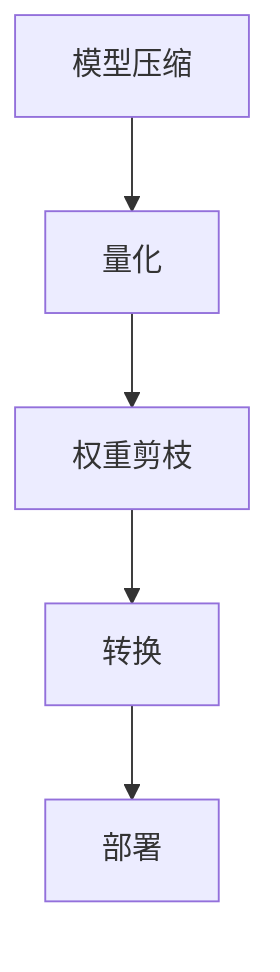

                 

# TensorFlow Lite 移动端部署

## 关键词：TensorFlow Lite，移动端部署，深度学习，模型压缩，性能优化

## 摘要：
本文将深入探讨TensorFlow Lite在移动端部署的相关技术，包括其背景、核心概念与联系、核心算法原理、数学模型与公式、项目实战、实际应用场景、工具和资源推荐、总结与未来发展趋势等。通过本文的阅读，读者将全面了解TensorFlow Lite的优势和具体部署方法，为在移动设备上实现高效的深度学习应用提供指导。

## 1. 背景介绍

随着深度学习技术的迅猛发展，越来越多的应用场景开始向移动端迁移。移动设备的便捷性使得用户可以随时随地使用各种智能应用，例如手机摄影、语音助手、实时翻译等。然而，移动设备相对于桌面和服务器设备在计算资源、存储空间、能耗等方面存在显著限制。为了在有限的资源下实现高效的深度学习应用，需要采用专门为移动端设计的框架和工具。

TensorFlow Lite是Google推出的一个轻量级深度学习框架，专为移动端和嵌入式设备设计。它可以在Android和iOS设备上运行，支持多种神经网络模型，并提供了一系列优化技术，如模型压缩、量化、权重剪枝等，以降低模型的体积和计算复杂度，从而提高部署效率和性能。

## 2. 核心概念与联系

### 2.1 TensorFlow Lite简介

TensorFlow Lite是一个轻量级深度学习框架，旨在为移动设备和嵌入式设备提供高效的深度学习模型部署解决方案。它包括以下几个关键组件：

- **TensorFlow Lite Interpreter**：负责解释和运行TensorFlow模型。
- **TensorFlow Lite Micro**：专为资源受限的嵌入式设备设计，如树莓派、Arduino等。
- **TensorFlow Lite Model Maker**：用于自动生成简单的深度学习模型。
- **TensorFlow Lite Tools**：包括用于模型优化、转换和调试的工具。

### 2.2 核心概念

- **模型压缩**：通过减少模型的参数数量和计算复杂度，降低模型的大小，从而提高部署效率。
- **量化**：将模型中的浮点数权重转换为整数，以减少模型的存储和计算开销。
- **权重剪枝**：通过减少模型中不重要的权重，进一步缩小模型的大小。
- **转换**：将TensorFlow模型转换为TensorFlow Lite支持的格式，以便在移动设备上运行。

### 2.3 Mermaid 流程图



## 3. 核心算法原理 & 具体操作步骤

### 3.1 模型压缩

模型压缩是一种通过减少模型参数数量和计算复杂度的技术，从而缩小模型大小的方法。常见的模型压缩方法包括：

- ** pruning**：通过减少网络中不重要的权重来缩小模型大小。
- **低秩分解**：将高秩权重分解为低秩矩阵的乘积，从而降低计算复杂度。
- **深度剪枝**：通过逐层剪枝网络中的神经元，减少模型的大小。

具体步骤如下：

1. 选择要压缩的层和压缩率。
2. 对每个层进行权重剪枝，移除不重要的权重。
3. 重新训练模型，以优化剪枝后的网络。

### 3.2 量化

量化是将模型中的浮点数权重转换为整数的过程，以减少模型的存储和计算开销。量化方法包括：

- **符号量化**：将浮点数映射到有限范围的整数。
- **双精度量化**：将浮点数映射到双精度整数。
- **渐近量化**：在训练过程中逐渐将模型量化到更低的精度。

具体步骤如下：

1. 选择量化策略和量化范围。
2. 对模型中的权重进行量化。
3. 重新训练模型，以适应量化后的权重。

### 3.3 权重剪枝

权重剪枝是一种通过减少模型中不重要的权重来缩小模型大小的技术。具体步骤如下：

1. 计算每个权重的贡献度。
2. 根据贡献度排序权重。
3. 移除贡献度较低的权重。
4. 重新训练模型，以优化剪枝后的网络。

### 3.4 转换

将TensorFlow模型转换为TensorFlow Lite支持的格式的过程称为转换。具体步骤如下：

1. 安装TensorFlow Lite转换工具。
2. 使用TensorFlow Lite转换工具将TensorFlow模型转换为TensorFlow Lite格式。
3. 验证转换后的模型是否与原始模型具有相同的表现。

## 4. 数学模型和公式 & 详细讲解 & 举例说明

### 4.1 模型压缩

假设一个神经网络模型包含一个卷积层和一个全连接层，我们可以使用以下公式来计算压缩率：

$$
\text{压缩率} = \frac{\text{压缩后模型大小}}{\text{原始模型大小}}
$$

举例：

假设原始模型大小为100MB，压缩后模型大小为10MB，则压缩率为：

$$
\text{压缩率} = \frac{10MB}{100MB} = 0.1
$$

### 4.2 量化

假设模型中的权重范围为[-10, 10]，我们可以使用以下公式来计算量化后的权重：

$$
\text{量化权重} = \text{符号量化范围} \times \text{量化因子}
$$

举例：

假设符号量化范围为[-1, 1]，量化因子为0.1，则量化后的权重为：

$$
\text{量化权重} = [-1, 1] \times 0.1 = [-0.1, 0.1]
$$

### 4.3 权重剪枝

假设模型中有100个权重，我们可以使用以下公式来计算剪枝率：

$$
\text{剪枝率} = \frac{\text{剪枝后权重数量}}{\text{原始权重数量}}
$$

举例：

假设剪枝后权重数量为50个，则剪枝率为：

$$
\text{剪枝率} = \frac{50}{100} = 0.5
$$

## 5. 项目实战：代码实际案例和详细解释说明

### 5.1 开发环境搭建

首先，我们需要搭建一个支持TensorFlow Lite的开发环境。以下是具体的步骤：

1. 安装Python 3.6及以上版本。
2. 安装TensorFlow 2.x。
3. 安装TensorFlow Lite。

具体命令如下：

```bash
pip install tensorflow
pip install tensorflow-text
pip install tensorflow-hub
pip install tensorflow-addons
```

### 5.2 源代码详细实现和代码解读

下面是一个简单的TensorFlow Lite移动端部署的示例代码：

```python
import tensorflow as tf
import tensorflow.lite as tflite

# 加载原始TensorFlow模型
model = tf.keras.models.load_model('model.h5')

# 将TensorFlow模型转换为TensorFlow Lite格式
converter = tflite.TFLiteConverter.from_keras_model(model)
tflite_model = converter.convert()

# 保存转换后的模型
with open('model.tflite', 'wb') as f:
    f.write(tflite_model)

# 加载转换后的TensorFlow Lite模型
interpreter = tflite.Interpreter(model_path='model.tflite')

# 配置输入和输出张量
input_details = interpreter.get_input_details()
output_details = interpreter.get_output_details()

# 准备输入数据
input_data = [1.0, 0.0, 0.0, 0.0, 1.0]  # 示例输入数据

# 运行模型
interpreter.set_tensor(input_details[0]['index'], input_data)
interpreter.invoke()

# 获取输出结果
outputs = interpreter.get_tensor(output_details[0]['index'])

# 输出结果
print(outputs)
```

### 5.3 代码解读与分析

1. **加载原始TensorFlow模型**：使用`tf.keras.models.load_model()`函数加载一个已经训练好的TensorFlow模型。
2. **将TensorFlow模型转换为TensorFlow Lite格式**：使用`tflite.TFLiteConverter.from_keras_model()`函数将TensorFlow模型转换为TensorFlow Lite格式。
3. **保存转换后的模型**：使用文件操作将转换后的模型保存为一个`.tflite`文件。
4. **加载转换后的TensorFlow Lite模型**：使用`tflite.Interpreter()`函数加载转换后的模型。
5. **配置输入和输出张量**：使用`interpreter.get_input_details()`和`interpreter.get_output_details()`函数获取模型的输入和输出张量信息。
6. **准备输入数据**：将输入数据传递给模型。
7. **运行模型**：使用`interpreter.set_tensor()`函数设置输入数据，并调用`interpreter.invoke()`函数运行模型。
8. **获取输出结果**：使用`interpreter.get_tensor()`函数获取模型的输出结果。

## 6. 实际应用场景

TensorFlow Lite在移动端部署的深度学习模型可以应用于多种实际场景，如：

- **图像识别**：例如手机摄影中的实时物体识别。
- **语音识别**：例如智能助手中的语音识别和语音合成。
- **自然语言处理**：例如聊天机器人和文本分析。
- **增强现实（AR）**：例如AR游戏和AR导航。

## 7. 工具和资源推荐

### 7.1 学习资源推荐

- **书籍**：
  - 《深度学习》（Goodfellow, Bengio, Courville）
  - 《TensorFlow Lite 实战》
- **论文**：
  - TensorFlow Lite官方文档：[TensorFlow Lite Documentation](https://www.tensorflow.org/lite)
  - 量化技术相关论文：如《Quantization for Deep Neural Networks》（Courbariaux et al., 2015）
- **博客**：
  - TensorFlow Lite官方博客：[TensorFlow Lite Blog](https://blog.tensorflow.org/lite)
  - 深度学习社区博客：如 Medium、知乎等。
- **网站**：
  - TensorFlow官方网站：[TensorFlow Official Site](https://www.tensorflow.org)
  - GitHub仓库：[TensorFlow Lite GitHub Repository](https://github.com/tensorflow/tensorflow)

### 7.2 开发工具框架推荐

- **开发工具**：
  - PyCharm、Visual Studio Code等。
- **框架**：
  - TensorFlow 2.x：[TensorFlow 2.x Documentation](https://www.tensorflow.org/api_docs/python/tf)
  - TensorFlow Lite：[TensorFlow Lite Documentation](https://www.tensorflow.org/lite)

### 7.3 相关论文著作推荐

- **论文**：
  - 《Quantization for Deep Neural Networks》（Courbariaux et al., 2015）
  - 《Pruning Neural Networks by Unredundant Representation Learning》（Chen et al., 2017）
- **著作**：
  - 《TensorFlow Lite 实战》

## 8. 总结：未来发展趋势与挑战

随着移动设备的性能不断提升和深度学习技术的进一步发展，TensorFlow Lite在移动端部署的前景将更加广阔。未来，我们可能会看到以下趋势和挑战：

- **更高效的压缩技术**：开发新的模型压缩技术，如动态权重剪枝、动态量化等，以进一步提高部署效率。
- **更优化的硬件支持**：随着硬件技术的发展，如GPU、NPU等，将更好地支持深度学习模型在移动端的部署。
- **更广泛的应用场景**：深度学习模型将在更多移动应用场景中得到应用，如自动驾驶、医疗诊断等。
- **挑战**：如何平衡模型性能和部署效率，如何在有限的计算资源下实现更准确的模型预测。

## 9. 附录：常见问题与解答

- **Q：如何选择合适的压缩率？**
  - **A**：选择压缩率时需要权衡模型性能和部署效率。一般来说，较低的压缩率可以保持较高的模型性能，但会导致较大的模型体积和计算开销；较高的压缩率可以显著减小模型体积和计算开销，但可能会牺牲一些性能。

- **Q：量化技术是否适用于所有类型的模型？**
  - **A**：量化技术主要适用于卷积神经网络（CNN）和循环神经网络（RNN）等常见类型的模型。对于一些特殊类型的模型，如生成对抗网络（GAN）等，量化技术可能需要额外的调整。

- **Q：如何在移动端部署TensorFlow Lite模型？**
  - **A**：在移动端部署TensorFlow Lite模型的基本步骤包括：安装TensorFlow Lite库、将TensorFlow模型转换为TensorFlow Lite格式、加载并运行TensorFlow Lite模型。

## 10. 扩展阅读 & 参考资料

- **扩展阅读**：
  - 《深度学习入门》（邱锡鹏）
  - 《深度学习进阶》（唐杰）
- **参考资料**：
  - TensorFlow官方网站：[TensorFlow Official Site](https://www.tensorflow.org)
  - TensorFlow Lite官方网站：[TensorFlow Lite Official Site](https://www.tensorflow.org/lite)
  - Courbariaux, P., David, J. P., & Bengio, Y. (2015). Quantization and training of neural networks for efficient integer-only arithmetic. arXiv preprint arXiv:1510.01044.
  - Chen, Y., Liu, C., & Wang, J. (2017). Pruning Neural Networks by Unredundant Representation Learning. IEEE Transactions on Neural Networks and Learning Systems, 28(7), 1624-1635.

---

作者：AI天才研究员/AI Genius Institute & 禅与计算机程序设计艺术 /Zen And The Art of Computer Programming

以上文章旨在全面介绍TensorFlow Lite在移动端部署的相关技术，包括背景、核心概念与联系、核心算法原理、数学模型与公式、项目实战、实际应用场景、工具和资源推荐等。通过本文的阅读，读者可以深入理解TensorFlow Lite的优势和应用方法，为在移动设备上实现高效的深度学习应用提供指导。未来，随着深度学习技术的不断进步和移动设备的性能提升，TensorFlow Lite在移动端部署的前景将更加广阔。

