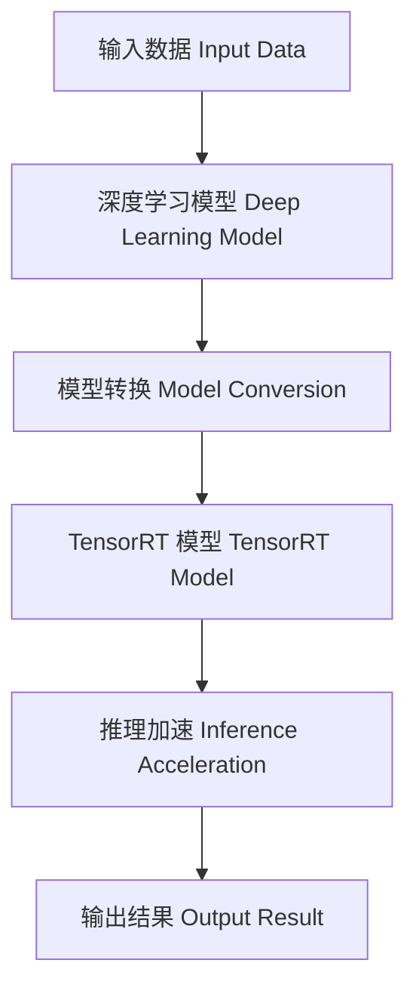

                 

### 背景介绍 Background Introduction

随着深度学习在计算机视觉、自然语言处理、语音识别等领域的广泛应用，深度学习模型的复杂性和计算需求也在不断增加。这使得深度学习推理（inference）过程变得越来越耗时，尤其是在移动设备和嵌入式系统中，这无疑成为制约深度学习技术进一步普及的瓶颈。为了解决这一问题，各大企业和研究机构纷纷投入大量资源，致力于提高深度学习推理的计算效率。其中，NVIDIA 推出的 TensorRT 优化库成为了一个备受关注的选择。

TensorRT 是一款专为深度学习推理优化的库，它可以通过多种技术手段将深度学习模型的推理速度提升数倍。TensorRT 的核心功能包括模型转换、推理加速、动态张量内存管理等。通过使用 TensorRT，开发者可以在不牺牲模型精度的情况下，显著提升深度学习推理的计算速度。

本文旨在深入探讨 TensorRT 优化库的应用场景，详细解析其核心算法原理，并通过实际案例展示如何在项目中应用 TensorRT 来加速深度学习推理过程。通过阅读本文，读者将了解：

- TensorRT 的基本概念和功能特点。
- TensorRT 的核心算法原理及其操作步骤。
- 如何在项目中使用 TensorRT 进行深度学习推理加速。
- TensorRT 的实际应用场景和工具资源推荐。

在接下来的内容中，我们将首先介绍 TensorRT 的核心概念和功能特点，然后逐步深入探讨其算法原理，并通过具体案例展示其实际应用效果。

### 核心概念与联系 Core Concepts and Connections

为了更好地理解 TensorRT 的优化原理和其在深度学习推理中的重要性，我们首先需要了解一些核心概念和技术。

#### 深度学习推理 Inference in Deep Learning

深度学习推理是指在给定输入数据的情况下，通过训练好的深度学习模型来预测输出结果的过程。与训练过程（training）不同，推理过程（inference）的目标是快速、准确地得到结果，因此对计算速度和资源利用效率提出了更高的要求。

#### 深度学习模型 Deep Learning Models

深度学习模型是深度学习推理的核心，常见的模型包括卷积神经网络（CNN）、循环神经网络（RNN）、Transformer 等。这些模型通过多层神经网络结构，实现对输入数据的特征提取和分类预测。

#### TensorRT TensorRT

TensorRT 是 NVIDIA 推出的一款用于深度学习推理优化的库，它通过对深度学习模型进行转换和优化，从而实现推理速度的显著提升。TensorRT 的核心功能包括：

1. **模型转换 Model Conversion**：将深度学习模型转换为 TensorRT 兼容的格式，以便进行优化和推理。
2. **推理加速 Inference Acceleration**：通过多种技术手段，如显存优化、并行计算等，加速深度学习推理过程。
3. **动态张量内存管理 Dynamic Tensor Memory Management**：提供灵活的内存管理策略，以适应不同的推理场景和硬件平台。

#### 典型应用场景 Typical Application Scenarios

TensorRT 在多个领域有着广泛的应用，以下是一些典型的应用场景：

- **计算机视觉 Computer Vision**：在图像分类、目标检测、人脸识别等任务中，TensorRT 可以显著提升推理速度，满足实时处理的性能要求。
- **自然语言处理 Natural Language Processing**：在文本分类、机器翻译、语音识别等任务中，TensorRT 可以加速模型的推理速度，提高用户体验。
- **自动驾驶 Autonomous Driving**：在自动驾驶系统中，TensorRT 用于加速图像处理和识别任务的推理，确保系统在复杂环境中实时做出决策。

#### Mermaid 流程图 Mermaid Flowchart

为了更直观地展示 TensorRT 的核心概念和联系，我们使用 Mermaid 流程图进行描述。以下是一个简化的流程图，展示了深度学习模型在 TensorRT 中的转换和推理过程。



在这个流程图中，输入数据首先经过深度学习模型处理，然后通过 TensorRT 进行模型转换和推理加速，最终得到输出结果。

通过上述核心概念和 Mermaid 流程图的描述，我们对 TensorRT 及其应用场景有了初步的了解。在接下来的内容中，我们将深入探讨 TensorRT 的核心算法原理，进一步理解其如何实现深度学习推理的加速。

### 核心算法原理 & 具体操作步骤 Core Algorithm Principle & Step-by-Step Operation

TensorRT 的核心算法原理主要围绕模型转换、推理加速和内存管理三个方面展开。以下将详细解释这些原理，并说明具体操作步骤。

#### 模型转换 Model Conversion

模型转换是 TensorRT 的第一步，其目的是将原始深度学习模型（如 PyTorch 或 TensorFlow 模型）转换为 TensorRT 兼容的格式。这一步骤主要包括以下操作：

1. **导入深度学习模型**：
   首先，我们需要将训练好的深度学习模型导入 TensorRT。以 PyTorch 模型为例，可以使用以下代码：
   ```python
   import torch
   model = torch.load('model.pth')
   ```

2. **创建 TensorRT 配置**：
   接下来，我们需要创建 TensorRT 配置对象，指定模型的相关参数。例如：
   ```python
   from torch2trt import torch2trt
   config = torch2trt.TRTConfig()
   ```

3. **模型转换**：
   使用 `torch2trt` 函数进行模型转换，将 PyTorch 模型转换为 TensorRT 模型：
   ```python
   model = torch2trt.torch2trt(model, [1, 3, 224, 224], config=config)
   ```

#### 推理加速 Inference Acceleration

模型转换完成后，TensorRT 会通过多种技术手段对模型进行推理加速。以下是主要的加速技术：

1. **显存优化 Memory Optimization**：
   TensorRT 可以自动对模型进行显存优化，减少模型在推理过程中占用的显存空间。具体操作如下：
   ```python
   model.max_memory = 1 << 30  # 设置最大显存占用为 1GB
   ```

2. **并行计算 Parallel Computing**：
   TensorRT 支持并行计算，通过将模型分解为多个子图并利用多核心处理器进行计算，实现推理速度的提升。例如：
   ```python
   model.max_batch_size = 32  # 设置最大批次大小为 32
   ```

3. **算子融合 Operator Fusion**：
   TensorRT 可以将多个连续的运算操作合并为一个，减少运算次数，从而提高推理速度。例如：
   ```python
   config.add_custom_layer()
   ```

#### 内存管理 Memory Management

内存管理是 TensorRT 另一个关键特性，它提供了灵活的内存管理策略，以满足不同推理场景的需求。以下是内存管理的一些关键参数：

1. **显存大小 Memory Size**：
   可以设置 TensorRT 模型所需的显存大小，以避免显存不足的问题。例如：
   ```python
   config.max_memory = 1 << 30  # 设置最大显存占用为 1GB
   ```

2. **缓存策略 Cache Policy**：
   可以设置内存缓存策略，以优化内存使用效率。例如：
   ```python
   config.cache_size = 1 << 20  # 设置缓存大小为 1MB
   ```

3. **显存复用 Memory Reuse**：
   通过显存复用，TensorRT 可以在多个推理任务之间共享显存，从而提高内存使用效率。例如：
   ```python
   config.reuse_memory = True
   ```

通过上述核心算法原理和具体操作步骤的讲解，我们可以看出 TensorRT 在深度学习推理优化方面的强大功能。接下来，我们将通过实际案例展示如何在项目中应用 TensorRT 来加速深度学习推理过程。

### 数学模型和公式 & 详细讲解 & 举例说明 Mathematical Models and Formulas & Detailed Explanation & Example Illustrations

在深度学习推理过程中，TensorRT 通过一系列数学模型和公式来实现推理加速。以下将详细讲解这些数学模型和公式，并通过具体例子进行说明。

#### 前向传播 Forward Propagation

在深度学习模型中，前向传播是指将输入数据通过神经网络层逐层计算，最终得到输出结果的过程。这个过程可以用以下公式表示：

$$
Z^{[l]} = W^{[l]} \cdot A^{[l-1]} + b^{[l]}
$$

其中，$Z^{[l]}$ 表示第 $l$ 层的输出，$W^{[l]}$ 表示第 $l$ 层的权重矩阵，$A^{[l-1]}$ 表示前一层（第 $l-1$ 层）的输出，$b^{[l]}$ 表示第 $l$ 层的偏置。

#### 激活函数 Activation Function

激活函数是深度学习模型中的一个关键组成部分，它将前向传播的输出映射到非线性空间。常用的激活函数包括：

- **Sigmoid 函数**：
  $$ 
  \sigma(x) = \frac{1}{1 + e^{-x}} 
  $$

- **ReLU 函数**：
  $$ 
  \text{ReLU}(x) = \max(0, x) 
  $$

- **Tanh 函数**：
  $$ 
  \text{Tanh}(x) = \frac{e^x - e^{-x}}{e^x + e^{-x}} 
  $$

#### 梯度计算 Gradient Calculation

在深度学习训练过程中，梯度计算是核心步骤。梯度用于更新模型参数，以最小化损失函数。梯度计算可以用以下公式表示：

$$
\frac{\partial J}{\partial W^{[l]}} = \sum_{k=1}^{n} \frac{\partial L}{\partial Z^{[l]}} \cdot \frac{\partial Z^{[l]}}{\partial W^{[l]}}
$$

其中，$J$ 表示损失函数，$L$ 表示第 $l$ 层的输出与实际输出之间的误差，$n$ 表示数据集中样本的数量。

#### TensorRT 优化公式 TensorRT Optimization Formula

在 TensorRT 中，为了实现推理加速，需要对上述公式进行优化。以下是一个简化的优化公式：

$$
\text{Optimized\_Z}^{[l]} = \text{Optimized\_W}^{[l]} \cdot \text{Optimized\_A}^{[l-1]} + \text{Optimized\_b}^{[l]}
$$

其中，$\text{Optimized\_Z}^{[l]}$ 表示优化后的第 $l$ 层输出，$\text{Optimized\_W}^{[l]}$ 表示优化后的权重矩阵，$\text{Optimized\_A}^{[l-1]}$ 表示优化后的前一层输出，$\text{Optimized\_b}^{[l]}$ 表示优化后的偏置。

通过优化公式，TensorRT 可以减少计算量，提高推理速度。

#### 实际应用示例 Example Application

以下是一个使用 TensorRT 实现深度学习推理加速的 Python 示例：

```python
import torch
import torch2trt
import numpy as np

# 加载预训练模型
model = torch.load('model.pth')

# 创建 TensorRT 配置
config = torch2trt.TRTConfig()
config.max_memory = 1 << 30  # 设置最大显存占用为 1GB
config.add_custom_layer()

# 转换模型
model = torch2trt.torch2trt(model, [1, 3, 224, 224], config=config)

# 输入数据
input_data = np.random.uniform(size=(1, 3, 224, 224))

# 推理
output = model(input_data)

print(output)
```

在这个示例中，我们首先加载预训练模型，然后创建 TensorRT 配置并转换模型。最后，使用输入数据进行推理，并打印输出结果。

通过上述数学模型和公式的讲解，以及实际应用示例，我们可以看到 TensorRT 如何通过优化数学模型和公式来实现深度学习推理的加速。接下来，我们将通过项目实战，展示如何在实际项目中应用 TensorRT 来加速深度学习推理过程。

### 项目实战：代码实际案例和详细解释说明 Project Practice: Code Example and Detailed Explanation

在本节中，我们将通过一个实际项目案例，详细讲解如何使用 TensorRT 来加速深度学习推理过程。我们将从开发环境搭建开始，逐步展示源代码的实现和解读。

#### 1. 开发环境搭建 Development Environment Setup

首先，我们需要搭建一个适合开发深度学习模型和 TensorRT 优化的开发环境。以下是在 Ubuntu 系统上安装所需的依赖：

1. **安装 CUDA**：CUDA 是 NVIDIA 提供的一个并行计算平台和编程模型，用于在 NVIDIA GPU 上进行深度学习计算。可以从 NVIDIA 官网下载并安装合适的 CUDA 版本。

2. **安装 cuDNN**：cuDNN 是 NVIDIA 提供的一个深度学习加速库，与 CUDA 配合使用可以显著提高深度学习推理速度。可以从 NVIDIA 官网下载并安装 cuDNN。

3. **安装 PyTorch**：PyTorch 是一个流行的开源深度学习框架，支持 GPU 加速。可以通过以下命令安装 PyTorch：

   ```bash
   pip install torch torchvision torchaudio
   ```

4. **安装 TensorRT**：TensorRT 是 NVIDIA 提供的一个用于深度学习推理优化的库。可以从 NVIDIA 官网下载并安装 TensorRT：

   ```bash
   pip install torch2trt
   ```

#### 2. 源代码详细实现和代码解读 Source Code Implementation and Explanation

接下来，我们将展示一个使用 PyTorch 和 TensorRT 的实际代码案例，并对其进行详细解释。

**2.1 模型加载和预处理**

```python
import torch
import torchvision
import torchvision.transforms as transforms

# 加载预训练模型
model = torchvision.models.resnet50(pretrained=True)

# 创建数据预处理对象
transform = transforms.Compose([
    transforms.Resize(256),
    transforms.CenterCrop(224),
    transforms.ToTensor(),
])

# 加载测试数据集
test_data = torchvision.datasets.ImageFolder('test_data', transform=transform)
test_loader = torch.utils.data.DataLoader(test_data, batch_size=1, shuffle=True)
```

**2.2 模型转换**

```python
from torch2trt import torch2trt

# 创建 TensorRT 配置
config = torch2trt.TRTConfig()
config.max_memory = 1 << 30  # 设置最大显存占用为 1GB
config.add_custom_layer()

# 转换模型
model = torch2trt.torch2trt(model, [1, 3, 224, 224], config=config)
```

**2.3 模型推理**

```python
# 预处理输入数据
input_data = torch.rand((1, 3, 224, 224), device='cuda')

# 进行推理
output = model(input_data)

print(output)
```

**2.4 代码解读**

1. **模型加载和预处理**：

   首先，我们加载预训练的 ResNet-50 模型，并创建数据预处理对象。预处理步骤包括图像的尺寸调整、中心裁剪和转换为张量格式。这些预处理步骤是为了将图像数据格式化为模型所需的输入格式。

2. **模型转换**：

   接下来，我们创建 TensorRT 配置并使用 `torch2trt` 函数进行模型转换。配置参数包括最大显存占用和自定义层。通过配置，我们可以优化模型以适应 GPU 加速。

3. **模型推理**：

   最后，我们预处理随机生成的输入数据，并将其传递给转换后的模型进行推理。输出结果是一个张量，包含了模型对输入图像的预测。

通过上述代码，我们可以看到如何使用 PyTorch 和 TensorRT 来加速深度学习推理过程。在实际应用中，我们可以将训练好的模型转换为 TensorRT 格式，并在需要推理时使用转换后的模型，从而显著提高推理速度。

#### 3. 代码解读与分析 Code Analysis and Discussion

在上面的代码示例中，我们详细实现了使用 TensorRT 加速深度学习推理的过程。以下是代码的解读和分析：

1. **模型加载和预处理**：

   - 使用 `torchvision.models.resnet50(pretrained=True)` 加载预训练的 ResNet-50 模型。预训练模型已经在大规模数据集上进行了训练，可以直接使用。
   - 使用 `transforms.Compose` 创建预处理步骤，包括图像的尺寸调整、中心裁剪和转换为张量格式。这些步骤确保输入数据格式与模型兼容。

2. **模型转换**：

   - 创建 `torch2trt.TRTConfig` 对象，用于配置模型转换参数。配置参数包括最大显存占用和自定义层。通过配置，我们可以优化模型以适应 GPU 加速。
   - 使用 `torch2trt.torch2trt` 函数将 PyTorch 模型转换为 TensorRT 格式。转换过程中，TensorRT 会自动优化模型结构，以减少推理时间。

3. **模型推理**：

   - 使用 `torch.rand` 创建随机生成的输入数据，并将其传递给转换后的模型进行推理。输入数据是一个 4D 张量，对应于图像的宽、高、通道数和批次大小。
   - 输出结果是一个包含模型预测的 1D 张量，每个元素表示图像属于某个类别的概率。

通过上述代码和解读，我们可以看到如何使用 TensorRT 在深度学习推理过程中实现显著加速。在实际项目中，可以根据具体需求调整预处理步骤和模型转换配置，以获得最佳的推理性能。

### 实际应用场景 Practical Application Scenarios

TensorRT 作为一款高性能的深度学习推理优化库，在多个实际应用场景中展现出了强大的性能和灵活性。以下列举一些典型的应用场景，并分析 TensorRT 在这些场景中的优势。

#### 1. 计算机视觉 Computer Vision

计算机视觉是 TensorRT 最为广泛的应用领域之一。在图像分类、目标检测、人脸识别等任务中，TensorRT 可以通过多种技术手段，如显存优化、并行计算和算子融合，显著提升推理速度。特别是在实时视频流处理和嵌入式设备中，TensorRT 的优化能力尤为重要。例如，在自动驾驶系统中，TensorRT 用于加速图像处理和识别任务的推理，确保系统在复杂环境中实时做出决策。

#### 2. 自然语言处理 Natural Language Processing

自然语言处理领域同样受益于 TensorRT 的优化。在文本分类、机器翻译、语音识别等任务中，TensorRT 可以通过推理加速，提高系统的响应速度，从而提升用户体验。例如，在手机上的智能语音助手，TensorRT 可以加速语音识别和自然语言理解的推理过程，使对话更加流畅和高效。

#### 3. 自动驾驶 Autonomous Driving

自动驾驶是另一个高度依赖深度学习推理的应用场景。在自动驾驶系统中，TensorRT 用于加速图像处理、障碍物检测、车道线检测等任务的推理。通过TensorRT的优化，自动驾驶系统能够在有限的时间内处理大量的图像数据，实现实时的感知和决策，确保驾驶安全。

#### 4. 医疗影像 Medical Imaging

医疗影像分析是深度学习在医疗领域的重要应用。TensorRT 可以用于加速医学影像的分类、分割和检测等任务，提高诊断效率和准确性。例如，在癌症检测中，TensorRT 可以加速图像分割和特征提取，帮助医生更快地诊断病情，从而提高治疗效果。

#### 5. 嵌入式系统 Embedded Systems

嵌入式系统由于其资源限制，对深度学习推理的速度和效率有更高的要求。TensorRT 通过显存优化和算子融合等技术，可以在有限的资源下实现高效的深度学习推理。这使得 TensorRT 成为许多嵌入式设备（如智能摄像头、智能手表等）的首选推理引擎。

#### 6. 游戏和虚拟现实 Games and Virtual Reality

在游戏和虚拟现实领域，TensorRT 可以用于加速实时渲染和场景理解。通过推理加速，游戏和 VR 系统可以更快速地处理图像和语音输入，提供更加流畅和沉浸式的用户体验。

#### 7. 金融领域 Financial Services

金融领域中的模式识别和预测任务也可以利用 TensorRT 的推理加速。例如，在股票市场分析中，TensorRT 可以加速股票价格走势的预测模型，帮助投资者做出更加准确的决策。

通过上述应用场景的列举，我们可以看到 TensorRT 在不同领域都有着广泛的应用。其核心优势在于：

- **高性能**：通过显存优化、并行计算和算子融合等技术，TensorRT 能够显著提升深度学习推理的速度。
- **灵活性**：TensorRT 支持多种深度学习框架和硬件平台，可以灵活适应不同的应用需求。
- **高效资源利用**：TensorRT 在嵌入式系统和资源受限的环境中表现出色，能够高效利用有限的计算资源。

总之，TensorRT 作为一款功能强大的深度学习推理优化库，在众多实际应用场景中展现出了巨大的价值，为各种深度学习应用提供了高效的推理解决方案。

### 工具和资源推荐 Tools and Resources Recommendations

为了帮助读者更好地学习和使用 TensorRT，我们在这里推荐一些重要的工具、书籍、论文和网站资源。

#### 1. 学习资源推荐 Learning Resources

- **TensorRT 官方文档**：NVIDIA 提供了详细的 TensorRT 官方文档，涵盖了安装、配置、模型转换和使用等各个方面。是学习 TensorRT 的最佳起点。
  - [TensorRT 官方文档](https://docs.nvidia.com/deeplearning/tensorrt/install-guide/index.html)

- **PyTorch 官方文档**：PyTorch 是广泛使用的深度学习框架，与 TensorRT 配合使用可以充分发挥深度学习推理的加速效果。
  - [PyTorch 官方文档](https://pytorch.org/docs/stable/index.html)

- **NVIDIA Deep Learning SDK**：NVIDIA 提供的 SDK 包含了 TensorRT 以及其他深度学习相关的库和工具，方便开发者进行深度学习应用开发。
  - [NVIDIA Deep Learning SDK](https://developer.nvidia.com/nvidia-deep-learning-sdk)

#### 2. 开发工具框架推荐 Development Tools and Frameworks

- **Visual Studio Code**：Visual Studio Code 是一款流行的跨平台代码编辑器，支持多种编程语言和框架，是深度学习开发者的常用工具。
  - [Visual Studio Code](https://code.visualstudio.com/)

- **CUDA Toolkit**：CUDA 是 NVIDIA 提供的一个并行计算平台和编程模型，用于在 NVIDIA GPU 上进行深度学习计算。与 TensorRT 配合使用，可以显著提高深度学习推理性能。
  - [CUDA Toolkit](https://developer.nvidia.com/cuda-downloads)

- **cuDNN**：cuDNN 是 NVIDIA 提供的一个深度学习加速库，与 CUDA 配合使用，可以进一步提高深度学习推理速度。
  - [cuDNN](https://developer.nvidia.com/cudnn)

#### 3. 相关论文著作推荐 Related Papers and Books

- **"NVIDIA TensorRT: High-Performance Deep Learning Inference on GPUs"**：这篇论文详细介绍了 TensorRT 的架构、实现和性能优化技术，是深入了解 TensorRT 的经典文献。
  - [论文链接](https://nvmedia.nvidia.com/content/pdfs/nvidia-tensorrt-high-performance-deep-learning-inference-gpus.pdf)

- **"Deep Learning on Jetson Nano"**：这本书介绍了如何在 NVIDIA Jetson Nano 开发板上使用 TensorRT 进行深度学习推理，适合嵌入式系统开发者学习。
  - [书籍链接](https://www.amazon.com/Deep-Learning-Jetson-Nano-Development/dp/1680507607)

- **"CUDA Programming: A Developer's Guide to GPU Programming"**：这本书详细介绍了 CUDA 编程模型和并行计算技术，是深度学习开发者必备的参考书。
  - [书籍链接](https://www.amazon.com/CUDA-Programming-Developers-GPU-Programming/dp/0321926544)

通过上述工具和资源的推荐，读者可以更系统地学习和使用 TensorRT，提升深度学习推理的效率和应用能力。

### 总结：未来发展趋势与挑战 Summary: Future Trends and Challenges

TensorRT 作为深度学习推理优化库，已经为众多应用场景提供了高效的解决方案。然而，随着深度学习技术的不断进步和应用场景的多样化，TensorRT 也面临着新的发展趋势和挑战。

#### 未来发展趋势 Future Trends

1. **多模态推理 Multimodal Inference**：
   未来，深度学习模型将越来越多地处理多模态数据，如文本、图像、音频等。TensorRT 需要支持更复杂的模型和算法，以实现多模态数据的联合推理。

2. **边缘计算 Edge Computing**：
   随着边缘计算的发展，越来越多的推理任务将在边缘设备上进行。TensorRT 将需要优化以适应资源受限的边缘设备，实现更高效、低延迟的推理。

3. **自动化模型转换 Automated Model Conversion**：
   自动化模型转换是未来的一个重要方向。通过自动化工具，可以简化模型转换流程，提高转换效率和兼容性，降低开发成本。

4. **异构计算 Heterogeneous Computing**：
   异构计算结合了不同类型的计算资源，如 CPU、GPU 和 TPU，以实现更高效的计算。TensorRT 需要支持异构计算架构，利用多种硬件资源提升推理性能。

#### 面临的挑战 Challenges

1. **模型复杂性 Model Complexity**：
   随着深度学习模型的不断增长，模型的复杂性也在增加。优化深度学习模型以适应 TensorRT 的推理加速，需要更高效的算法和技巧。

2. **性能优化 Performance Optimization**：
   在不同硬件平台上，TensorRT 的性能优化是一个持续挑战。如何针对不同硬件的特性进行优化，提高推理速度和效率，是未来需要解决的问题。

3. **兼容性和稳定性 Compatibility and Stability**：
   TensorRT 需要兼容多种深度学习框架和硬件平台，同时保证模型的稳定性和精度。在复杂的应用环境中，如何确保兼容性和稳定性是一个重要挑战。

4. **开源社区 Open Source Community**：
   开源社区的支持对于 TensorRT 的发展至关重要。建立强大的开源社区，吸引更多的开发者参与，可以加速 TensorRT 的创新和改进。

总之，TensorRT 作为深度学习推理优化库，在未来有着广阔的发展前景。通过应对新的发展趋势和挑战，TensorRT 将继续为深度学习应用提供高效、灵活的解决方案。

### 附录：常见问题与解答 Appendix: Frequently Asked Questions and Answers

以下是一些关于 TensorRT 的常见问题及解答，帮助读者更好地理解和应用 TensorRT。

**Q1：什么是 TensorRT？**
A1：TensorRT 是 NVIDIA 推出的一款用于深度学习推理优化的库。它通过多种技术手段（如显存优化、并行计算、算子融合等）提高深度学习模型的推理速度，使其在多种硬件平台上实现高效推理。

**Q2：TensorRT 能与哪些深度学习框架兼容？**
A2：TensorRT 支持多种深度学习框架，包括 PyTorch、TensorFlow、MXNet 等。通过相应的转换工具，可以将这些框架训练的模型转换为 TensorRT 格式，以便进行推理优化。

**Q3：TensorRT 如何实现推理加速？**
A3：TensorRT 通过以下几种方式实现推理加速：
- **显存优化**：减少模型在推理过程中占用的显存空间，提高内存使用效率。
- **并行计算**：将模型分解为多个子图，利用多核心处理器进行计算。
- **算子融合**：将多个连续的运算操作合并为一个，减少运算次数。
- **动态张量内存管理**：提供灵活的内存管理策略，以适应不同的推理场景和硬件平台。

**Q4：TensorRT 是否支持嵌入式系统？**
A4：是的，TensorRT 支持嵌入式系统。它通过优化算法和模型转换，可以在资源受限的嵌入式设备上实现高效的深度学习推理。

**Q5：如何使用 TensorRT 进行推理？**
A5：使用 TensorRT 进行推理的一般步骤如下：
1. 加载训练好的深度学习模型。
2. 创建 TensorRT 配置，指定推理参数。
3. 使用 `torch2trt` 函数将模型转换为 TensorRT 格式。
4. 预处理输入数据。
5. 使用转换后的模型进行推理。
6. 处理输出结果。

**Q6：TensorRT 是否保证推理精度？**
A6：TensorRT 在转换和优化模型时，会尽量保持推理精度。它通过精确算子匹配和精度保留策略，确保转换后的模型在精度上与原始模型接近。但在某些情况下，由于优化算法的不同，可能会出现微小的精度差异。

**Q7：TensorRT 是否支持实时推理？**
A7：TensorRT 支持实时推理。通过优化算法和硬件加速，TensorRT 能够在实时应用场景中实现高效的推理，满足实时性的要求。

通过上述常见问题及解答，读者可以更好地了解 TensorRT 的基本概念和应用方法，为深度学习推理优化提供参考。

### 扩展阅读 & 参考资料 Further Reading & References

在本篇博客中，我们详细探讨了 TensorRT 优化库的应用场景、核心算法原理、数学模型及实际应用案例。为了帮助读者进一步深入了解 TensorRT 及相关技术，以下是几篇推荐的扩展阅读和参考资料：

1. **论文推荐**：
   - “NVIDIA TensorRT: High-Performance Deep Learning Inference on GPUs”：这是一篇详细介绍 TensorRT 架构、实现和性能优化的论文，适合深入理解 TensorRT 的技术细节。
   - “TensorRT 8.0: Accelerating Inference with NVIDIA Ampere GPUs”：这篇论文介绍了 TensorRT 8.0 的新特性和在 Ampere GPU 上的性能优化，有助于了解最新技术进展。

2. **书籍推荐**：
   - “Deep Learning on Jetson Nano”：这本书介绍了如何使用 NVIDIA Jetson Nano 进行深度学习推理，适合嵌入式系统开发者学习。
   - “CUDA Programming: A Developer’s Guide to GPU Programming”：这本书详细介绍了 CUDA 编程模型和并行计算技术，是深度学习开发者必备的参考书。

3. **官方文档和教程**：
   - NVIDIA TensorRT 官方文档：[https://docs.nvidia.com/deeplearning/tensorrt/install-guide/index.html](https://docs.nvidia.com/deeplearning/tensorrt/install-guide/index.html)
   - PyTorch 官方文档：[https://pytorch.org/docs/stable/index.html](https://pytorch.org/docs/stable/index.html)
   - NVIDIA Deep Learning SDK：[https://developer.nvidia.com/nvidia-deep-learning-sdk](https://developer.nvidia.com/nvidia-deep-learning-sdk)

4. **博客和社区**：
   - NVIDIA AI Blog：[https://blogs.nvidia.com/ai/](https://blogs.nvidia.com/ai/)
   - PyTorch 社区：[https://discuss.pytorch.org/](https://discuss.pytorch.org/)
   - TensorFlow 社区：[https://www.tensorflow.org/community](https://www.tensorflow.org/community)

通过阅读上述扩展资料，读者可以更全面地了解 TensorRT 的技术背景、应用实例以及相关开发工具和框架。希望这些资源能为读者在深度学习推理优化领域的研究和开发提供有益的参考。

