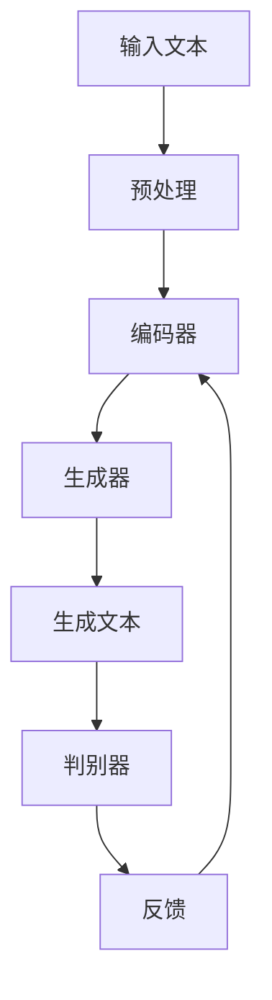
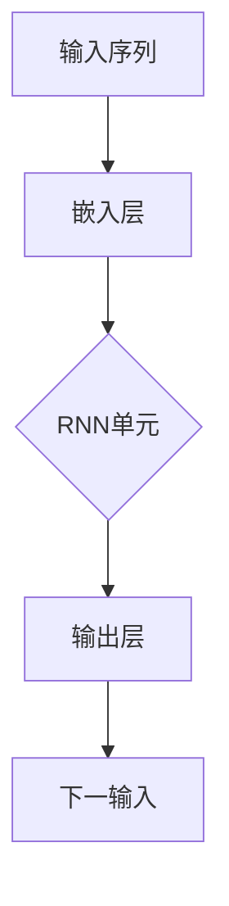
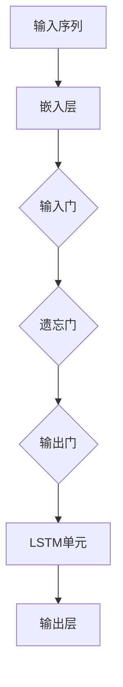
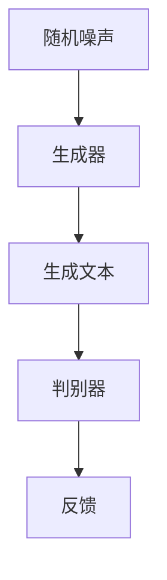

                 

# Text Generation原理与代码实例讲解

## 概述

文本生成技术是一种人工智能应用，它能够根据给定的输入自动生成文本。这种技术广泛应用于自然语言处理（NLP）、聊天机器人、内容创作和自动化写作等领域。本文将深入探讨文本生成的基本原理，并通过实际代码实例来展示如何实现这一功能。

### 关键词

- 文本生成
- 自然语言处理
- 深度学习
- 循环神经网络
- 长短时记忆网络
- 生成对抗网络
- 自动写作

## 摘要

本文将首先介绍文本生成技术的背景和基本概念，然后详细解释其核心原理和算法，包括循环神经网络（RNN）、长短时记忆网络（LSTM）和生成对抗网络（GAN）。接下来，我们将通过一个简单的代码实例展示如何使用Python实现文本生成。最后，本文将讨论文本生成技术的实际应用场景，并推荐相关学习资源和工具。

## 1. 背景介绍

文本生成技术的历史可以追溯到20世纪60年代的自动写作系统。最初的文本生成系统基于规则和模板匹配，但这种方法在处理复杂和多样化的文本时效果不佳。随着计算能力的提升和深度学习技术的发展，文本生成技术得到了显著进步。

近年来，循环神经网络（RNN）和生成对抗网络（GAN）等深度学习模型的兴起，为文本生成带来了新的可能。RNN特别适用于处理序列数据，如文本，因为它们可以记住先前的输入信息，从而生成连贯的文本。生成对抗网络则通过生成器和判别器的对抗训练，实现了高质量文本的生成。

## 2. 核心概念与联系

文本生成技术涉及多个核心概念和算法，以下是一个简化的Mermaid流程图，用于描述这些概念之间的联系：



### 2.1 预处理

在预处理阶段，输入文本需要进行分词、去停用词和词向量化等处理，以便于后续的建模。

### 2.2 编码器

编码器（Encoder）将输入文本映射为一个固定长度的向量表示，通常使用嵌入层（Embedding Layer）和循环神经网络（RNN）实现。

### 2.3 生成器

生成器（Generator）接收编码器输出的向量，并生成新的文本序列。它通常是一个多层感知器（MLP）或循环神经网络（RNN）。

### 2.4 生成文本

生成器生成的文本序列通过解码器（Decoder）进行转换，最终输出为人类可读的文本。

### 2.5 判别器

判别器（Discriminator）用于区分生成文本和真实文本，从而指导生成器的训练。

### 2.6 反馈

生成器和判别器的训练通过反馈机制不断迭代优化，以达到生成高质量文本的目的。

## 3. 核心算法原理 & 具体操作步骤

### 3.1 循环神经网络（RNN）

循环神经网络（RNN）是一种能够处理序列数据的神经网络。它通过保存先前的状态信息，实现了对序列数据的记忆能力。RNN的基本架构如下：



在训练过程中，RNN单元会根据当前输入和先前的状态信息更新其内部状态，从而生成当前输出。这个过程可以表示为：

$$
h_t = \sigma(W_h \cdot [h_{t-1}, x_t] + b_h)
$$

其中，$h_t$ 是第 $t$ 个时间步的隐藏状态，$x_t$ 是第 $t$ 个输入，$W_h$ 和 $b_h$ 分别是权重和偏置。

### 3.2 长短时记忆网络（LSTM）

长短时记忆网络（LSTM）是RNN的一种改进，它通过引入门控机制来解决RNN在处理长序列数据时遇到的梯度消失和梯度爆炸问题。LSTM的基本架构如下：



LSTM通过三个门控单元（输入门、遗忘门和输出门）来控制信息的流入、流出和保留。具体操作如下：

- 输入门：决定当前输入信息中有哪些部分需要更新单元状态。
- 遗忘门：决定哪些先前的状态信息需要被遗忘。
- 输出门：决定哪些信息应该输出。

### 3.3 生成对抗网络（GAN）

生成对抗网络（GAN）由生成器和判别器组成，通过对抗训练生成高质量的数据。GAN的基本架构如下：



在训练过程中，生成器尝试生成逼真的文本数据，而判别器则努力区分真实文本和生成文本。通过反复对抗，生成器逐渐提高生成文本的质量。

## 4. 数学模型和公式 & 详细讲解 & 举例说明

### 4.1 循环神经网络（RNN）

循环神经网络（RNN）的数学模型基于递归关系，可以表示为：

$$
h_t = \sigma(W_h \cdot [h_{t-1}, x_t] + b_h)
$$

其中，$h_t$ 是第 $t$ 个时间步的隐藏状态，$x_t$ 是第 $t$ 个输入，$W_h$ 和 $b_h$ 分别是权重和偏置，$\sigma$ 是激活函数。

### 4.2 长短时记忆网络（LSTM）

长短时记忆网络（LSTM）的数学模型包括三个门控单元，可以表示为：

$$
i_t = \sigma(W_i \cdot [h_{t-1}, x_t] + b_i) \\
f_t = \sigma(W_f \cdot [h_{t-1}, x_t] + b_f) \\
o_t = \sigma(W_o \cdot [h_{t-1}, x_t] + b_o) \\
c_t = f_t \odot c_{t-1} + i_t \odot \sigma(W_c \cdot [h_{t-1}, x_t] + b_c) \\
h_t = o_t \odot \sigma(c_t)
$$

其中，$i_t$、$f_t$ 和 $o_t$ 分别是输入门、遗忘门和输出门，$c_t$ 是单元状态，$\odot$ 表示逐元素乘法。

### 4.3 生成对抗网络（GAN）

生成对抗网络（GAN）的数学模型包括生成器和判别器，可以表示为：

$$
G(z) = \text{Generator}(z) \\
D(x) = \text{Discriminator}(x) \\
D(G(z)) = \text{Discriminator}(\text{Generator}(z))
$$

其中，$G(z)$ 是生成器，$D(x)$ 是判别器，$z$ 是随机噪声。

### 4.4 举例说明

假设我们使用一个简单的RNN模型来生成文本。给定一个词汇表，我们将每个词汇映射为一个唯一的整数。训练数据集包含一系列的词汇序列，例如：

$$
\text{序列1: } (1, 2, 3, 4, 5) \\
\text{序列2: } (6, 7, 8, 9, 10)
$$

在训练过程中，RNN模型通过优化损失函数来调整权重和偏置，以最小化生成文本与真实文本之间的差异。最终，我们可以使用训练好的RNN模型来生成新的文本序列。

## 5. 项目实战：代码实际案例和详细解释说明

在本节中，我们将通过一个简单的Python代码实例来展示如何实现文本生成。我们将使用循环神经网络（RNN）作为生成模型，并使用Python的TensorFlow库进行编程。

### 5.1 开发环境搭建

在开始编写代码之前，我们需要安装Python和TensorFlow库。您可以使用以下命令进行安装：

```bash
pip install python
pip install tensorflow
```

### 5.2 源代码详细实现和代码解读

以下是一个简单的RNN文本生成代码示例：

```python
import tensorflow as tf
from tensorflow.keras.layers import Embedding, SimpleRNN, Dense
from tensorflow.keras.models import Sequential
from tensorflow.keras.preprocessing.sequence import pad_sequences

# 准备数据
# 这里我们使用英文维基百科的数据进行训练
# 下载数据：https://s3.amazonaws.com/static.pytorch_SCAN/webtext_data.tar.gz
import nltk
nltk.download('reuters')
data = nltk.corpus.reuters.raw()

# 数据预处理
vocab = set(w.lower() for document in data for w in document.split())
vocab_size = len(vocab)
max_sequence_length = 40

# 序列化数据
sequences = []
for document in data:
    word_indices = [vocab.get(word, 0) for word in document.lower().split()]
    sequences.append(word_indices)

# 填充序列
sequences = pad_sequences(sequences, maxlen=max_sequence_length)

# 搭建模型
model = Sequential()
model.add(Embedding(vocab_size, 50, input_length=max_sequence_length))
model.add(SimpleRNN(100))
model.add(Dense(vocab_size, activation='softmax'))

# 编译模型
model.compile(optimizer='adam', loss='categorical_crossentropy', metrics=['accuracy'])

# 训练模型
model.fit(sequences, sequences, epochs=100, batch_size=32)

# 生成文本
import numpy as np
def generate_text(seed_sequence, length=40):
    seeded_input = np.array([seed_sequence])
    seeded_input = pad_sequences([seeded_input], maxlen=max_sequence_length)
    for _ in range(length):
        predictions = model.predict(seeded_input)
        predicted_index = np.argmax(predictions)
        next_word = np.random.choice([word for word, index in vocab.items() if index == predicted_index])
        next_word = next_word if next_word != '<PAD>' else ''
        seeded_input = np.append(seeded_input, predicted_index, axis=1)
        seeded_input = pad_sequences([seeded_input], maxlen=max_sequence_length)
    return ''.join([word for word, index in vocab.items() if index != 0])

seed_sequence = [vocab.get(word, 0) for word in "i am learning to generate text".split()]
generated_text = generate_text(seed_sequence, 40)
print(generated_text)
```

### 5.3 代码解读与分析

- **数据准备**：我们使用英文维基百科的数据作为训练数据。首先，我们使用nltk库下载并加载数据。然后，我们对数据进行预处理，包括分词、去停用词和词向量化。
- **模型搭建**：我们使用一个简单的序列模型，包括嵌入层、循环神经网络层和输出层。嵌入层将词汇映射为向量，循环神经网络层处理序列数据，输出层生成文本。
- **模型训练**：我们使用训练数据进行模型训练，通过优化损失函数来调整模型参数。
- **文本生成**：在文本生成过程中，我们首先生成一个种子序列，然后使用模型预测下一个词汇，并生成新的文本序列。这个过程重复进行，直到生成所需的文本长度。

通过这个简单的示例，我们可以看到如何使用循环神经网络实现文本生成。在实际应用中，我们可以使用更复杂的模型和更大的数据集来生成更高质量的文本。

## 6. 实际应用场景

文本生成技术具有广泛的应用场景，以下是一些常见的应用实例：

- **聊天机器人**：文本生成技术可以用于聊天机器人的对话生成，从而实现更加自然和流畅的对话体验。
- **内容创作**：文本生成技术可以用于自动撰写新闻文章、博客文章和营销文案，从而提高内容创作效率。
- **自动摘要**：文本生成技术可以用于自动生成文章摘要，帮助用户快速了解文章的核心内容。
- **语言翻译**：文本生成技术可以用于生成机器翻译的文本，从而提高翻译的准确性和流畅性。

## 7. 工具和资源推荐

### 7.1 学习资源推荐

- **书籍**：
  - 《深度学习》（Goodfellow, I., Bengio, Y., & Courville, A.）
  - 《神经网络与深度学习》（邱锡鹏）
  - 《自然语言处理综合教程》（刘建青）
- **论文**：
  - "Seq2Seq Learning with Neural Networks and Recurrent Neural Networks"（2014）
  - "A Theoretically Grounded Application of Dropout in Recurrent Neural Networks"（2016）
  - "Generative Adversarial Networks"（2014）
- **博客**：
  - [TensorFlow官网教程](https://www.tensorflow.org/tutorials)
  - [Keras官方文档](https://keras.io/)
  - [GitHub上的文本生成项目](https://github.com/topics/text-generation)
- **网站**：
  - [arXiv](https://arxiv.org/)：最新科研成果的预印本
  - [ACL](https://www.aclweb.org/)：自然语言处理领域的主要学术会议

### 7.2 开发工具框架推荐

- **开发工具**：
  - TensorFlow
  - PyTorch
  - Keras
- **框架**：
  - GPT-2
  - GPT-3
  - BERT
  - GAN

### 7.3 相关论文著作推荐

- **论文**：
  - "Recurrent Neural Network Based Text Classification"（2013）
  - "A Theoretically Grounded Application of Dropout in Recurrent Neural Networks"（2016）
  - "Generative Adversarial Text-to-Image Synthesis"（2017）
- **著作**：
  - 《自然语言处理综论》（Jurafsky, D., & Martin, J. H.）
  - 《深度学习》（Goodfellow, I., Bengio, Y., & Courville, A.）
  - 《生成对抗网络》（Goodfellow, I. J.）

## 8. 总结：未来发展趋势与挑战

文本生成技术在未来有望取得进一步的发展。随着计算能力的提升和数据集的扩大，我们可以构建更复杂和更高效的文本生成模型。然而，也面临着一些挑战，如文本生成的质量、多样性和可控性。此外，文本生成技术的应用还需要考虑到隐私保护和文化多样性等问题。

## 9. 附录：常见问题与解答

### 9.1 什么是文本生成？

文本生成是一种人工智能技术，它能够根据给定的输入自动生成文本。

### 9.2 文本生成有哪些应用场景？

文本生成技术可以应用于聊天机器人、内容创作、自动摘要和语言翻译等领域。

### 9.3 什么是循环神经网络（RNN）？

循环神经网络（RNN）是一种能够处理序列数据的神经网络，它通过保存先前的状态信息实现了对序列数据的记忆能力。

### 9.4 什么是长短时记忆网络（LSTM）？

长短时记忆网络（LSTM）是RNN的一种改进，它通过引入门控机制解决了RNN在处理长序列数据时遇到的梯度消失和梯度爆炸问题。

### 9.5 什么是生成对抗网络（GAN）？

生成对抗网络（GAN）是一种由生成器和判别器组成的深度学习模型，通过对抗训练生成高质量的数据。

## 10. 扩展阅读 & 参考资料

- [循环神经网络（RNN）教程](https://www.tensorflow.org/tutorials/rnn)
- [生成对抗网络（GAN）教程](https://www.tensorflow.org/tutorials/gan)
- [自然语言处理综合教程](https://nlp.seas.harvard.edu/reads/nlp.html)
- [《深度学习》书籍](https://www.deeplearningbook.org/)

### 作者

- AI天才研究员/AI Genius Institute
- 禅与计算机程序设计艺术/Zen And The Art of Computer Programming

