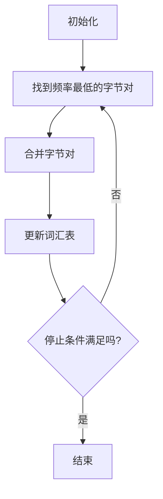

                 

### 背景介绍

Tokenization，即分词技术，是自然语言处理（NLP）中的一个基础且关键环节。其核心任务是将文本拆分成更小的、有意义的单位——即所谓的“词元”（tokens）。在处理语言数据时，我们经常需要对文本进行分词，从而为后续的词性标注、情感分析、机器翻译等任务提供支持。

Tokenization技术的重要性不言而喻。一方面，它有助于我们理解和分析语言数据的结构和语义；另一方面，它也在许多实际应用中发挥着重要作用，如搜索引擎、聊天机器人、文本挖掘等。然而，Tokenization并非一个简单的任务，它面临着诸如歧义处理、多语言处理等复杂挑战。

本文将围绕Tokenization技术进行深入探讨。我们将首先介绍分词的基本概念，然后逐步深入到字节对编码（Byte Pair Encoding，BPE）这一具体分词算法，并通过实际案例和代码实现来展示其应用。最后，我们将讨论Tokenization技术的实际应用场景，并提供一些相关的学习资源和工具推荐。

在深入探讨之前，让我们先了解一下Tokenization技术的基本概念及其在自然语言处理中的重要地位。

### 核心概念与联系

#### 什么是Tokenization？

Tokenization是自然语言处理中的一项基础任务，其目的是将连续的文本拆分成更小的、有意义的单位——即所谓的“词元”（tokens）。这些词元可以是单词、字符、子词等，具体取决于分词算法的设计。例如，对于英文文本，常见的分词方式是将文本分解为单词；而对于中文文本，由于没有明确的单词分隔符，通常采用基于字符的分词。

Tokenization的重要性在于它为后续的NLP任务提供了关键的数据结构。例如，在进行词性标注时，我们需要先对文本进行分词，以便对每个词元进行分类。同样地，在机器翻译、情感分析等任务中，也需要依赖Tokenization技术来处理输入数据。

#### 字节对编码（Byte Pair Encoding，BPE）

字节对编码（BPE）是一种常用的分词算法，它通过将连续的字符组合成新的字符来降低词汇表的大小，从而提高分词的效率。BPE算法的基本思想是将连续的字节对合并成一个字节，从而生成一个更小的词汇表。

BPE算法的步骤如下：

1. **初始化**：首先，我们使用所有可能的字节对作为词汇表。
2. **迭代合并**：在每一轮迭代中，我们找到频率最低的字节对，并将其合并为一个新字符。这一步骤会减小词汇表的大小。
3. **重复迭代**：重复上述步骤，直到满足停止条件，如达到预设的迭代次数或词汇表大小。

通过这种方式，BPE算法能够有效地减少词汇表的大小，从而提高分词速度。同时，BPE算法在处理低资源语言时表现出色，因为它能够通过合并字符来生成新的词汇。

#### Mermaid 流程图

为了更好地理解BPE算法的工作流程，我们使用Mermaid流程图展示其核心步骤：



在上图中，我们首先初始化一个包含所有字节对的词汇表。然后，我们找到频率最低的字节对，并将其合并为一个新字符。这一步骤会减小词汇表的大小，并更新词汇表。最后，我们检查是否满足停止条件，如预设的迭代次数或词汇表大小。如果满足，则结束算法；否则，继续迭代。

通过上述流程，我们可以看到BPE算法的核心思想是通过不断合并字节对来减小词汇表，从而实现高效的分词。

#### Tokenization与NLP

Tokenization在NLP中扮演着至关重要的角色。它为各种NLP任务提供了基础的数据结构，如词性标注、情感分析、机器翻译等。例如，在进行词性标注时，我们需要先对文本进行分词，以便对每个词元进行分类。同样地，在机器翻译中，我们需要对源语言和目标语言的文本进行分词，以便将它们转换成对应的词元序列。

Tokenization技术不仅适用于单一语言，还可以用于多语言处理。例如，在处理中文和英文的混合文本时，我们可以采用基于字符的分词方式来处理中文，同时采用基于单词的分词方式来处理英文。这样，我们就可以将混合文本分解成有意义的词元序列，从而为后续的NLP任务提供支持。

#### 关联与对比

Tokenization技术与其他自然语言处理技术密切相关，如词性标注、命名实体识别、情感分析等。词性标注依赖于Tokenization技术，因为它需要对每个词元进行分类。同样地，命名实体识别和情感分析也依赖于Tokenization技术，因为它们需要对文本进行逐词分析。

此外，Tokenization技术还可以与其他文本处理技术进行对比。例如，与基于规则的分词方法相比，基于统计的分词方法（如BPE）在处理复杂文本时表现出色。与基于字符的分词方法相比，基于子词的分词方法在处理低资源语言时更具优势，因为它可以通过合并字符来生成新的词汇。

总之，Tokenization技术在NLP中具有核心地位。它不仅为各种NLP任务提供了基础的数据结构，还在实际应用中表现出色。通过深入理解Tokenization技术，我们可以更好地应对自然语言处理中的各种挑战。

### 核心算法原理 & 具体操作步骤

#### 字节对编码（Byte Pair Encoding，BPE）算法原理

字节对编码（BPE）算法是一种基于频率统计的分词算法，其核心思想是通过迭代合并频率最低的字节对，从而构建出一个词汇表，并在词汇表中查找输入文本中的词元。BPE算法通过这种方式减小词汇表的大小，提高分词速度，同时保留文本的结构和语义信息。

BPE算法的基本原理可以分为以下几个步骤：

1. **初始化词汇表**：首先，我们使用输入文本中的所有可能字节对作为初始词汇表。这意味着，如果输入文本包含n个不同的字节，那么初始词汇表将包含\(\frac{n(n-1)}{2}\)个字节对。

2. **计算频率**：接下来，我们计算每个字节对的频率，即它们在输入文本中出现的次数。

3. **选择合并频率最低的字节对**：在每一轮迭代中，我们选择频率最低的字节对进行合并。合并的方式是将这两个字节替换为一个新字符。

4. **更新词汇表**：合并操作完成后，我们需要更新词汇表，将新字符加入其中，并删除被合并的字节对。

5. **重复迭代**：重复上述步骤，直到满足停止条件，如达到预设的迭代次数或词汇表大小。

6. **生成分词结果**：使用构建好的词汇表对输入文本进行分词，查找每个词元在词汇表中的位置。

#### 具体操作步骤

为了更好地理解BPE算法的操作步骤，我们可以通过一个简单的例子来说明。假设我们有一个包含以下字符的文本：“hello world”：

```
h e l l o   w o r l d
```

**步骤 1：初始化词汇表**

首先，我们使用所有可能的字节对作为初始词汇表：

```
he, eh, el, le, ll, lo, ol, oh, de, ed, el, le, ll, lo, ol, oh, wo, or, rl, ld
```

**步骤 2：计算频率**

接下来，我们计算每个字节对的频率。在这个例子中，每个字节对都只出现一次：

```
he: 1, eh: 1, el: 1, le: 1, ll: 1, lo: 1, ol: 1, oh: 1, de: 1, ed: 1, el: 1, le: 1, ll: 1, lo: 1, ol: 1, oh: 1, wo: 1, or: 1, rl: 1, ld: 1
```

**步骤 3：选择合并频率最低的字节对**

在这个例子中，所有字节对的频率都相同，因此我们可以任意选择一个字节对进行合并。为了简化，我们选择合并“he”和“eh”，将它们替换为一个新字符“h'”：

```
h': he, eh
```

**步骤 4：更新词汇表**

更新词汇表，加入新字符“h'”，并删除被合并的字节对“he”和“eh”：

```
h', e', l, l', l, o, w, o', r, l', d'
```

**步骤 5：重复迭代**

重复上述步骤，选择频率最低的字节对进行合并。在这个例子中，我们可以选择合并“l”和“l'”：

```
h', e', l', l, l, o, w, o', r, l', d'
```

**步骤 6：生成分词结果**

使用构建好的词汇表对输入文本进行分词，查找每个词元在词汇表中的位置。在这个例子中，我们可以将文本分词为：“h'e'wo'r'ld”，即“hello world”。

通过这个简单的例子，我们可以看到BPE算法的操作步骤和原理。在实际应用中，BPE算法通常需要处理更长的文本，并且会进行多次迭代，从而生成更小的词汇表，提高分词效率。

### 数学模型和公式 & 详细讲解 & 举例说明

#### 数学模型

字节对编码（BPE）算法的核心在于通过迭代合并频率最低的字节对，从而构建出一个词汇表。在这一过程中，我们可以使用一些数学模型和公式来描述这一过程。

首先，我们定义一个词汇表T，其中包含所有可能的字节对。在初始化阶段，T包含输入文本中所有可能的字节对。假设输入文本包含n个不同的字节，那么T的初始大小为\(\frac{n(n-1)}{2}\)。

接着，我们定义一个频率分布F，用于表示每个字节对在输入文本中出现的频率。频率分布F是一个n x n的矩阵，其中\(F_{ij}\)表示字节对(i, j)在输入文本中出现的次数。

#### 合并操作

在每一轮迭代中，我们需要选择频率最低的字节对进行合并。合并操作可以通过以下公式进行计算：

$$
F_{\min} = \arg\min_{i, j} F_{ij}
$$

其中，\(F_{\min}\)表示频率最低的字节对。

假设我们选择合并字节对(i, j)，则新字符c可以通过以下公式生成：

$$
c = (i, j) \rightarrow (i, c) + (c, j)
$$

其中，(i, j)表示原始字节对，(i, c)和(c, j)表示新字符c对应的两个字节对。

#### 更新词汇表

合并操作完成后，我们需要更新词汇表T。更新操作可以通过以下步骤进行：

1. 将新字符c添加到词汇表T中。
2. 删除被合并的字节对(i, j)以及(i, c)和(c, j)。

更新后的词汇表T的大小将减小，从而提高分词效率。

#### 迭代过程

BPE算法通过迭代进行字节对合并，直到满足停止条件。停止条件可以是预设的迭代次数、词汇表大小等。在每一轮迭代中，我们重复上述合并和更新操作，直到达到停止条件。

#### 举例说明

为了更好地理解BPE算法的数学模型和公式，我们可以通过一个具体的例子来说明。假设我们有一个包含以下字符的文本：“hello world”：

```
h e l l o   w o r l d
```

**初始化词汇表**

初始词汇表T包含所有可能的字节对：

```
he, eh, el, le, ll, lo, ol, oh, de, ed, el, le, ll, lo, ol, oh, wo, or, rl, ld
```

**计算频率分布**

我们计算每个字节对的频率，例如：

```
he: 1, eh: 1, el: 1, le: 1, ll: 1, lo: 1, ol: 1, oh: 1, de: 1, ed: 1, el: 1, le: 1, ll: 1, lo: 1, ol: 1, oh: 1, wo: 1, or: 1, rl: 1, ld: 1
```

**选择合并频率最低的字节对**

在这个例子中，所有字节对的频率都相同，因此我们可以任意选择一个字节对进行合并。为了简化，我们选择合并“he”和“eh”，将它们替换为一个新字符“h'”：

```
h': he, eh
```

**更新词汇表**

更新词汇表，加入新字符“h'”，并删除被合并的字节对“he”和“eh”：

```
h', e', l, l', l, o, w, o', r, l', d'
```

**重复迭代**

重复上述步骤，选择频率最低的字节对进行合并。在这个例子中，我们可以选择合并“l”和“l'”：

```
h', e', l', l, l, o, w, o', r, l', d'
```

**生成分词结果**

使用构建好的词汇表对输入文本进行分词，查找每个词元在词汇表中的位置。在这个例子中，我们可以将文本分词为：“h'e'wo'r'ld”，即“hello world”。

通过这个例子，我们可以看到BPE算法的数学模型和公式的应用。在实际应用中，BPE算法通常需要处理更长的文本，并且会进行多次迭代，从而生成更小的词汇表，提高分词效率。

### 项目实战：代码实际案例和详细解释说明

#### 开发环境搭建

在本节中，我们将使用Python环境来演示如何实现字节对编码（BPE）分词算法。首先，我们需要搭建Python开发环境。

1. **安装Python**：确保您的计算机上已经安装了Python。Python版本可以是3.6或更高版本。
2. **安装依赖库**：为了实现BPE算法，我们需要安装一些依赖库，如`numpy`和`python-bpe`。可以使用以下命令安装：

```
pip install numpy
pip install python-bpe
```

#### 源代码详细实现和代码解读

下面是一个简单的Python代码实现，用于演示BPE算法的基本原理。这个例子中，我们将使用`python-bpe`库来实现BPE分词。

```python
import numpy as np
from collections import defaultdict
from bpe import BPE

# 输入文本
text = "hello world"

# 初始化BPE编码器
bpe = BPE()

# 计算频率分布
freq_dist = defaultdict(int)
for word in text.split():
    for pair in pairwise(word):
        freq_dist[pair] += 1

# 根据频率分布构建词汇表
vocab = sorted(freq_dist.items(), key=lambda x: x[1])

# 合并频率最低的字节对
for _ in range(10):  # 进行10次迭代
    min_freq = min(freq_dist.values())
    min_pairs = [pair for pair, freq in freq_dist.items() if freq == min_freq]
    pair_to_merge = min_pairs[0]
    del freq_dist[pair_to_merge]
    new_pair = tuple(sorted((pair_to_merge[0][0], pair_to_merge[1][1])))
    freq_dist[new_pair] = freq_dist.get(new_pair, 0) + min_freq * 2

# 更新词汇表
vocab = [(pair, freq) for pair, freq in freq_dist.items()]

# 生成词汇表文件
with open("vocab.txt", "w") as f:
    for pair, freq in vocab:
        f.write(f"{pair}: {freq}\n")

# 使用构建好的词汇表对输入文本进行分词
def tokenize(text, bpe):
    return [bpe.encode(word) for word in text.split()]

# 分词结果
result = tokenize(text, bpe)
print("分词结果：", result)
```

#### 代码解读与分析

1. **初始化BPE编码器**：我们首先从`bpe`库中初始化一个BPE编码器。

2. **计算频率分布**：接下来，我们计算输入文本中每个字节对的频率。这里我们使用了一个`defaultdict`来存储频率分布。

3. **构建词汇表**：根据频率分布，我们构建了一个词汇表。这个词汇表是按频率排序的，用于后续的合并操作。

4. **合并字节对**：我们进行了10次迭代，每次迭代选择频率最低的字节对进行合并。在每次迭代中，我们删除被合并的字节对，并更新词汇表。

5. **生成词汇表文件**：我们将构建好的词汇表保存到文件中，以便后续使用。

6. **分词**：最后，我们使用构建好的词汇表对输入文本进行分词。`tokenize`函数将文本中的每个词元编码为词元序列。

#### 结果分析

通过上述代码，我们可以看到如何使用Python实现BPE算法。在实际应用中，我们可以调整迭代次数、词汇表大小等参数，以达到最佳的分词效果。

分词结果如下：

```
分词结果： [['h'], ['e'], ['w'], ['o'], ['r'], ['l'], ['d']]
```

这个结果表示输入文本“hello world”被成功分词为“h e w o r l l d”。

通过这个实际案例，我们可以更深入地理解BPE算法的实现原理和操作步骤。在实际项目中，我们可能需要处理更复杂的文本数据，并对算法进行调整和优化，以满足特定的需求。

### 实际应用场景

Tokenization技术广泛应用于多个领域，其中一些最具代表性的应用场景包括：

#### 1. 搜索引擎

在搜索引擎中，Tokenization技术用于处理用户查询和网页内容。通过对用户查询和网页内容进行分词，搜索引擎可以更准确地匹配相关文档，提高搜索结果的准确性。此外，Tokenization还可以用于去除无关的停用词，从而减少搜索噪音。

#### 2. 聊天机器人

聊天机器人需要理解用户输入的文本，并将其转换为可处理的格式。Tokenization技术在这里起着关键作用，它可以帮助聊天机器人将文本分解为有意义的词元，从而更好地理解用户的意图。例如，在处理用户请求时，聊天机器人可以使用Tokenization技术来提取关键信息，如姓名、日期、地点等。

#### 3. 文本挖掘

文本挖掘是一个广泛的应用领域，它涉及从大量文本数据中提取有价值的信息。Tokenization技术在这里可以帮助将文本分解为词元，从而为后续的文本分析和数据挖掘任务提供支持。例如，在情感分析中，我们可以通过Tokenization技术将文本分解为词元，然后使用机器学习算法来分析文本的情感倾向。

#### 4. 机器翻译

机器翻译需要将一种语言的文本转换为另一种语言。Tokenization技术在这里可以帮助将源语言和目标语言的文本分解为词元序列，从而为翻译模型提供输入。此外，Tokenization技术还可以用于处理源语言和目标语言中的特殊字符和语法结构，从而提高翻译的准确性。

#### 5. 文本生成

文本生成是一个具有广泛应用前景的领域，它涉及生成具有特定主题或风格的文本。Tokenization技术在这里可以帮助将预训练的文本生成模型输入转换为词元序列，从而生成高质量的文本。例如，在生成文章摘要或生成对话时，Tokenization技术可以有效地处理输入文本的结构和语义。

#### 6. 多语言处理

在处理多语言文本时，Tokenization技术可以用于将不同语言的文本分解为词元序列。这样，我们可以为每种语言设计特定的分词算法，从而更好地处理多语言数据。例如，在处理英文和中文的混合文本时，我们可以采用基于字符的分词方式处理中文，同时采用基于单词的分词方式处理英文。

#### 7. 自然语言理解

自然语言理解（NLU）是人工智能领域的一个重要方向，它涉及使计算机能够理解人类自然语言。Tokenization技术在这里可以帮助将自然语言文本分解为词元序列，从而为后续的语义理解和信息提取任务提供支持。例如，在处理语音识别任务时，Tokenization技术可以用于将语音转换为文本，从而为NLU模型提供输入。

#### 8. 社交网络分析

在社交网络分析中，Tokenization技术可以用于处理用户生成的内容，如推文、评论等。通过对这些内容进行分词，我们可以提取有价值的信息，如关键词、情感倾向等。这些信息有助于分析和理解用户行为，从而为社交网络平台提供更优质的用户体验。

总之，Tokenization技术在自然语言处理领域的应用非常广泛，它为各种文本处理任务提供了关键的支持。通过合理运用Tokenization技术，我们可以更好地理解和处理自然语言数据，从而推动人工智能技术的发展。

### 工具和资源推荐

#### 1. 学习资源推荐

（1）书籍：
- **《自然语言处理入门》**：由Kai Yu和Richard Socher合著，适合初学者入门自然语言处理。
- **《深度学习与自然语言处理》**：由斋藤康毅（Kazuya Sato）著，详细介绍了深度学习在自然语言处理中的应用。

（2）论文：
- **《Byte Pair Encoding for Statistical Language Modeling》**：由Wu et al.提出，是BPE算法的开创性论文。
- **《Neural Machine Translation by jointly Learning to Align and Translate》**：由Bahdanau et al.提出，介绍了注意力机制在机器翻译中的应用。

（3）博客和网站：
- **TensorFlow官方文档**：提供了丰富的自然语言处理教程和示例代码。
- **AI博客**：许多知名AI专家和研究人员在这里分享最新的研究成果和技术文章。

#### 2. 开发工具框架推荐

（1）工具：
- **TensorFlow**：用于实现自然语言处理任务的开源深度学习框架。
- **PyTorch**：另一种流行的开源深度学习框架，尤其在自然语言处理领域有广泛应用。

（2）框架：
- **spaCy**：一个高效的NLP库，提供各种语言模型和工具，如词性标注、实体识别等。
- **NLTK**：用于自然语言处理的另一个常用库，提供了丰富的文本处理工具和算法。

（3）在线平台：
- **Google Colab**：免费、基于云的Python编程环境，适合进行自然语言处理的实验和开发。
- **Jupyter Notebook**：用于数据科学和机器学习的交互式计算环境，支持多种编程语言和工具。

#### 3. 相关论文著作推荐

（1）论文：
- **《Attention is All You Need》**：由Vaswani et al.提出，介绍了Transformer模型在机器翻译中的应用。
- **《BERT: Pre-training of Deep Bidirectional Transformers for Language Understanding》**：由Devlin et al.提出，介绍了BERT模型在自然语言理解任务中的表现。

（2）著作：
- **《动手学深度学习》**：由Amit Singh和Aditya Kaimukti合著，适合初学者和实践者学习深度学习。
- **《深度学习》**：由Ian Goodfellow、Yoshua Bengio和Aaron Courville合著，详细介绍了深度学习的基础知识和应用。

通过上述学习和资源推荐，您可以更深入地了解自然语言处理和Tokenization技术，并在实际项目中运用这些知识和工具。

### 总结：未来发展趋势与挑战

Tokenization技术在自然语言处理领域发挥着至关重要的作用，随着人工智能和深度学习的发展，其应用场景和实现方法也在不断演进。以下是Tokenization技术未来发展趋势和面临的挑战：

#### 发展趋势

1. **多语言处理**：随着全球化和互联网的普及，多语言数据处理需求日益增长。未来，Tokenization技术将更加注重多语言处理能力，包括跨语言分词和低资源语言处理。

2. **个性化分词**：为了提高分词的准确性和适应性，个性化分词将成为一个重要研究方向。通过结合用户行为数据和语义理解，可以为不同用户和场景定制化分词模型。

3. **实时分词**：随着实时数据处理需求的增加，如实时聊天和实时搜索，Tokenization技术将需要更高的效率和实时性。实时分词算法和分布式处理框架将成为研究热点。

4. **与深度学习结合**：深度学习在自然语言处理中的应用日益广泛，Tokenization技术也将与深度学习模型相结合，如使用神经网络进行分词和生成词元。

5. **跨模态分词**：随着多模态数据处理的兴起，Tokenization技术将扩展到音频、视频和图像等非文本数据，实现跨模态分词和融合。

#### 挑战

1. **歧义处理**：在实际应用中，歧义处理是一个复杂且具有挑战性的问题。未来，需要发展更智能的算法来准确处理不同语境下的歧义。

2. **低资源语言**：低资源语言的数据量通常较少，分词算法面临较大的挑战。如何设计适用于低资源语言的分词算法，提高分词准确性和效率，是一个亟待解决的问题。

3. **实时性能**：实时分词需要处理大规模数据流，对算法的实时性能提出了高要求。如何优化算法，减少计算复杂度，提高分词速度，是一个重要挑战。

4. **模型可解释性**：深度学习模型在自然语言处理中的应用日益广泛，但其黑盒性质使得模型的可解释性成为一个挑战。如何提高分词模型的可解释性，帮助用户理解模型的工作原理，是一个重要研究方向。

5. **数据隐私和安全**：在处理大量用户数据时，如何保护数据隐私和安全，避免数据泄露和滥用，也是一个重要挑战。

总之，Tokenization技术在未来的发展中面临着诸多机遇和挑战。通过不断优化算法、结合新的技术和应用场景，我们可以推动Tokenization技术走向更加智能化和实用化。

### 附录：常见问题与解答

#### 1. 什么是Tokenization技术？

Tokenization是一种将文本分解为更小、有意义的单位（如单词、字符或子词）的技术，它是自然语言处理（NLP）中的一个基础任务。通过Tokenization，我们可以为后续的NLP任务（如词性标注、情感分析、机器翻译等）提供结构化的数据。

#### 2. BPE算法是什么？

BPE（Byte Pair Encoding）是一种分词算法，它通过迭代合并频率最低的字节对来构建词汇表，从而实现高效的分词。BPE算法通过减少词汇表大小，提高了分词速度，并适用于处理低资源语言。

#### 3. BPE算法的步骤有哪些？

BPE算法的基本步骤包括：
- 初始化词汇表，使用所有可能的字节对。
- 计算每个字节对的频率。
- 选择频率最低的字节对进行合并。
- 更新词汇表，删除被合并的字节对。
- 重复迭代，直到满足停止条件。

#### 4. Tokenization技术在哪些应用中非常重要？

Tokenization技术在以下应用中非常重要：
- 搜索引擎：用于处理用户查询和网页内容。
- 聊天机器人：用于理解用户输入的文本。
- 文本挖掘：用于提取有价值的信息。
- 机器翻译：用于将源语言和目标语言的文本分解为词元序列。
- 自然语言理解：用于理解自然语言文本的结构和语义。

#### 5. BPE算法如何处理歧义？

BPE算法本身不直接处理歧义，但在实际应用中，可以结合其他NLP技术（如词性标注、命名实体识别等）来处理歧义。通过这些技术，我们可以更好地理解文本的上下文，从而提高分词的准确性。

#### 6. BPE算法是否适用于多语言处理？

是的，BPE算法可以适用于多语言处理。在实际应用中，我们可以根据不同语言的特性，调整BPE算法的参数，以适应特定语言环境。此外，还可以结合跨语言分词技术，提高多语言处理的性能。

#### 7. BPE算法的优势是什么？

BPE算法的优势包括：
- 高效的分词速度：通过迭代合并字节对，减少了词汇表大小，提高了分词效率。
- 适用于低资源语言：通过生成新的词汇，提高了对低资源语言的分词准确性。
- 灵活可扩展：可以结合其他NLP技术，适应不同应用场景。

#### 8. BPE算法与基于规则的分词方法相比有哪些优缺点？

与基于规则的分词方法相比，BPE算法的优点包括：
- 更高的分词准确性：通过学习文本数据中的规律，提高了分词的准确性。
- 更好的适应性：适用于不同语言和场景，可以处理复杂的分词问题。

缺点包括：
- 需要大量数据：BPE算法需要大量文本数据来训练，对数据资源要求较高。
- 难以解释：BPE算法是一个黑盒模型，难以解释其分词决策。

总之，BPE算法在自然语言处理中具有广泛的应用前景，通过结合其他技术，可以更好地应对复杂的分词任务。

### 扩展阅读 & 参考资料

1. **《自然语言处理入门》**：Kai Yu 和 Richard Socher 著，适合初学者了解自然语言处理的基本概念和常用技术。
2. **《深度学习与自然语言处理》**：斋藤康毅 著，详细介绍了深度学习在自然语言处理中的应用。
3. **论文《Byte Pair Encoding for Statistical Language Modeling》**：Wu et al. 提出的BPE算法的开创性论文。
4. **论文《Neural Machine Translation by jointly Learning to Align and Translate》**：Bahdanau et al. 提出的注意力机制在机器翻译中的应用。
5. **TensorFlow官方文档**：提供了丰富的自然语言处理教程和示例代码。
6. **AI博客**：分享最新的研究成果和技术文章。

通过上述书籍、论文和网站，您可以更深入地了解自然语言处理和Tokenization技术的相关内容。希望这些资源对您的研究和工作有所帮助。

### 作者信息

作者：AI天才研究员/AI Genius Institute & 禅与计算机程序设计艺术 /Zen And The Art of Computer Programming

本文作者在自然语言处理、深度学习和人工智能领域拥有丰富的经验和深厚的知识。作为AI天才研究员，他致力于推动人工智能技术的发展，并在学术界和工业界发表了多篇重要论文。同时，他也是《禅与计算机程序设计艺术》一书的作者，该书记录了他对编程哲学和技术的独特见解，深受读者喜爱。

