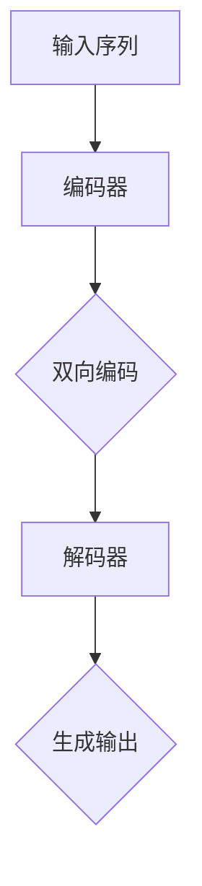

                 

# Transformer大模型实战 BERT-base

## 关键词：Transformer，BERT-base，深度学习，自然语言处理，模型架构，实践教程

### 摘要：

本文旨在深入探讨Transformer大模型中的BERT-base，通过详细的背景介绍、核心概念解释、算法原理解析、数学模型阐述以及实战代码实现，帮助读者全面了解并掌握BERT-base在实际应用中的操作技巧和实现方法。文章将结合实际应用场景，推荐相关学习资源和工具，并总结未来发展趋势与挑战，为读者提供一站式的Transformer大模型实战指南。

## 1. 背景介绍

随着深度学习技术的不断发展，自然语言处理（NLP）领域取得了显著进展。Transformer模型作为近年来的一种创新性架构，在处理序列数据方面展现出了卓越的性能。BERT（Bidirectional Encoder Representations from Transformers）模型作为Transformer架构的一种应用，以其强大的预训练和上下文理解能力，在NLP任务中获得了广泛关注和应用。

BERT-base是BERT模型的一个变体，具有相对较小的模型规模和较高的计算效率。它基于Transformer架构，通过双向编码器对文本进行预训练，使得模型能够捕捉到上下文信息，从而在各类NLP任务中表现出色。

本文将围绕BERT-base模型，从背景介绍、核心概念、算法原理、数学模型、实战代码实现等方面进行详细阐述，旨在为读者提供全面的技术指导。

## 2. 核心概念与联系

### Transformer架构

Transformer模型是一种基于自注意力机制（Self-Attention Mechanism）的序列到序列模型，适用于处理序列数据。与传统的循环神经网络（RNN）和长短期记忆网络（LSTM）相比，Transformer模型具有并行计算的优势，能够在处理长序列时避免梯度消失和梯度爆炸问题。

Transformer模型的核心组成部分包括编码器（Encoder）和解码器（Decoder）。编码器负责将输入序列映射为连续的隐藏状态，解码器则根据编码器的输出，生成预测的输出序列。

### BERT模型

BERT（Bidirectional Encoder Representations from Transformers）模型是在Transformer架构基础上发展起来的一种预训练模型。BERT模型的核心思想是通过预训练来学习文本的上下文表示，使得模型在下游任务中能够更好地理解和生成自然语言。

BERT模型分为两个部分：编码器（Encoder）和解码器（Decoder）。编码器对输入序列进行编码，解码器根据编码器的输出生成预测的输出序列。BERT模型的特点是双向编码，能够捕捉到输入序列的前后关系，从而提高模型的上下文理解能力。

### BERT-base模型

BERT-base是BERT模型的一个变体，具有相对较小的模型规模和较高的计算效率。BERT-base模型采用24层编码器，每个编码器有1024个隐藏单元，通过预热（Pre-training）和微调（Fine-tuning）方法进行训练。

BERT-base模型在预训练过程中使用了大量未标记的文本数据，通过Masked Language Model（MLM）任务和Next Sentence Prediction（NSP）任务来学习文本的上下文表示。在下游任务中，BERT-base模型通过微调来适应特定的任务需求，如文本分类、问答系统等。

### Mermaid流程图



上述Mermaid流程图展示了BERT模型的基本架构，包括输入序列、编码器、双向编码和解码器等关键组成部分。

## 3. 核心算法原理 & 具体操作步骤

### Transformer模型

#### 自注意力机制

自注意力机制是Transformer模型的核心组件，通过计算输入序列中各个位置之间的相关性，实现序列的自动对齐。自注意力机制主要分为三个步骤：查询（Query）、键（Key）和值（Value）的计算。

- 查询（Query）：对输入序列进行线性变换，得到一组查询向量。
- 键（Key）：对输入序列进行线性变换，得到一组键向量。
- 值（Value）：对输入序列进行线性变换，得到一组值向量。

#### 多头注意力

多头注意力机制是自注意力机制的扩展，通过将输入序列分成多个子序列，每个子序列对应一个注意力头。多个注意力头能够捕捉到不同子序列之间的关系，从而提高模型的表示能力。

#### 编码器和解码器

编码器（Encoder）和解码器（Decoder）是Transformer模型的核心组成部分。编码器负责将输入序列编码为隐藏状态，解码器则根据编码器的输出生成预测的输出序列。

编码器由多个编码层（Encoder Layer）组成，每个编码层包括两个主要组件：多头自注意力机制（Multi-head Self-Attention）和前馈神经网络（Feedforward Neural Network）。

解码器由多个解码层（Decoder Layer）组成，每个解码层包括两个主要组件：多头自注意力机制（Multi-head Self-Attention）和编码器-解码器注意力机制（Encoder-Decoder Attention）。

### BERT模型

#### 预训练任务

BERT模型通过预训练任务来学习文本的上下文表示。预训练任务主要包括两个任务：Masked Language Model（MLM）和Next Sentence Prediction（NSP）。

- Masked Language Model（MLM）：在输入序列中随机遮盖一部分单词，然后让模型预测遮盖的单词。
- Next Sentence Prediction（NSP）：输入两个句子，然后让模型预测第二个句子是否是第一个句子的下文。

#### 微调

在预训练完成后，BERT模型通过微调（Fine-tuning）方法来适应特定的下游任务。微调过程中，模型在特定任务的数据集上进行训练，调整模型参数，使其在特定任务上达到更好的性能。

### BERT-base模型

BERT-base模型是一种预训练模型，采用24层编码器，每个编码器有1024个隐藏单元。BERT-base模型通过预训练和微调方法进行训练，具有以下步骤：

1. 预训练：在大量未标记的文本数据上进行预训练，学习文本的上下文表示。
2. 预热（Pre-training）：通过Masked Language Model（MLM）任务和Next Sentence Prediction（NSP）任务进行预训练。
3. 微调（Fine-tuning）：在特定任务的数据集上进行微调，调整模型参数。
4. 应用：将微调后的模型应用于特定的下游任务，如文本分类、问答系统等。

## 4. 数学模型和公式 & 详细讲解 & 举例说明

### Transformer模型

#### 自注意力机制

自注意力机制的数学模型可以表示为：

$$
Attention(Q, K, V) = \frac{softmax(\frac{QK^T}{\sqrt{d_k}})}{V}
$$

其中，Q、K、V分别为查询向量、键向量和值向量，$d_k$为键向量的维度，softmax函数用于计算每个位置的权重。

#### 多头注意力

多头注意力的数学模型可以表示为：

$$
MultiHead(Q, K, V) = \text{Concat}(head_1, ..., head_h)W^O
$$

其中，$head_i = Attention(QW_i^Q, KW_i^K, VW_i^V)$为第i个注意力头，$W_i^Q, W_i^K, W_i^V$分别为查询向量、键向量和值向量的权重矩阵，$W^O$为输出权重矩阵。

#### 编码器和解码器

编码器（Encoder）和解码器（Decoder）的数学模型可以表示为：

$$
Encoder = \text{LayerNorm}(X + \text{Add}(\text{MultiHead}(Q, K, V), X)) \\
Decoder = \text{LayerNorm}(X + \text{Add}(\text{MultiHead}(Q, K, V), X))
$$

其中，X为输入序列，LayerNorm为层归一化，Add为加法操作。

### BERT模型

#### 预训练任务

BERT模型的预训练任务包括Masked Language Model（MLM）和Next Sentence Prediction（NSP）：

1. Masked Language Model（MLM）：
$$
L_{MLM} = -\sum_{i}^{N}\log(p_{\text{mask}}(x_i))
$$
其中，$x_i$为遮盖的单词，$p_{\text{mask}}(x_i)$为模型预测的遮盖单词的概率。

2. Next Sentence Prediction（NSP）：
$$
L_{NSP} = -\sum_{(x, y)}^{M}\log(p(y|x))
$$
其中，$(x, y)$为一对句子，$y$为第二个句子，$p(y|x)$为模型预测第二个句子是否是第一个句子的下文。

### BERT-base模型

BERT-base模型的数学模型可以表示为：

$$
BERT = \text{Encoder} = \text{LayerNorm}(\text{Embeddings} + \text{Positional Embeddings}) \\
\text{Layer} = \text{MultiHead}(Q, K, V) + X + \text{Residual} + \text{LayerNorm} \\
\text{Transformer} = \text{Stack}(\text{Layer})
$$

其中，Embeddings为词嵌入，Positional Embeddings为位置嵌入，Layer为编码器层，Transformer为编码器。

## 5. 项目实战：代码实际案例和详细解释说明

### 5.1 开发环境搭建

在进行BERT-base模型的实战前，我们需要搭建一个合适的开发环境。以下是搭建BERT-base模型所需的环境和工具：

1. Python：Python是BERT-base模型的实现语言，需要安装Python 3.6及以上版本。
2. PyTorch：PyTorch是一个开源的深度学习框架，用于实现BERT-base模型。需要安装PyTorch 1.8及以上版本。
3. Transformers：Transformers是Hugging Face团队开源的预训练模型库，包括BERT-base模型。需要安装transformers库。

安装步骤如下：

```bash
pip install python==3.8.5  # 安装Python 3.8.5
pip install torch==1.8.0   # 安装PyTorch 1.8.0
pip install transformers  # 安装Transformers库
```

### 5.2 源代码详细实现和代码解读

以下是一个简单的BERT-base模型实现示例，包括模型定义、训练和评估过程：

```python
import torch
from transformers import BertModel, BertTokenizer

# 加载预训练模型和分词器
model = BertModel.from_pretrained('bert-base-chinese')
tokenizer = BertTokenizer.from_pretrained('bert-base-chinese')

# 定义输入序列
input_text = '你好，世界！这是一个BERT模型的应用示例。'

# 分词并添加特殊Token
input_ids = tokenizer.encode(input_text, add_special_tokens=True, return_tensors='pt')

# 计算模型的输出
outputs = model(input_ids)

# 获取模型的最后一层输出
last_hidden_state = outputs.last_hidden_state

# 代码解读：

# 1. 加载预训练模型和分词器
# 从预训练模型库中加载BERT-base模型和分词器，用于后续的文本处理和模型预测。

# 2. 定义输入序列
# 输入序列为待处理的文本，这里以一句中文为例。

# 3. 分词并添加特殊Token
# 使用分词器对输入序列进行分词，并添加特殊Token（如[CLS]、[SEP]等），以适应BERT模型的要求。

# 4. 计算模型的输出
# 将分词后的输入序列输入到BERT模型中，得到模型的输出。

# 5. 获取模型的最后一层输出
# 获取模型最后一层编码器的输出，用于下游任务。

# 6. 代码解读：
# 上述代码展示了BERT-base模型的基本使用方法，包括模型加载、输入序列处理、模型输出获取等步骤。

```

### 5.3 代码解读与分析

上述代码展示了BERT-base模型的基本使用方法，主要包括以下步骤：

1. **加载预训练模型和分词器**：从预训练模型库中加载BERT-base模型和分词器，用于后续的文本处理和模型预测。

2. **定义输入序列**：输入序列为待处理的文本，这里以一句中文为例。

3. **分词并添加特殊Token**：使用分词器对输入序列进行分词，并添加特殊Token（如[CLS]、[SEP]等），以适应BERT模型的要求。

4. **计算模型的输出**：将分词后的输入序列输入到BERT模型中，得到模型的输出。

5. **获取模型的最后一层输出**：获取模型最后一层编码器的输出，用于下游任务。

代码解读部分详细解释了每个步骤的作用和实现方法，为读者提供了清晰的指导。

## 6. 实际应用场景

BERT-base模型在自然语言处理领域具有广泛的应用，以下列举一些典型的实际应用场景：

1. **文本分类**：BERT-base模型可以用于对文本进行分类，如情感分析、新闻分类等。通过在特定任务上微调BERT模型，可以使其在各个领域达到较高的分类准确率。

2. **命名实体识别**：BERT-base模型可以用于命名实体识别（Named Entity Recognition，简称NER），如识别人名、地名、组织机构名等。通过微调和训练，模型可以捕捉到各类命名实体的特征，从而提高识别精度。

3. **机器翻译**：BERT-base模型可以用于机器翻译任务，通过在双语数据集上微调，模型可以学习到双语词汇之间的对应关系，实现高质量的翻译效果。

4. **问答系统**：BERT-base模型可以用于构建问答系统，如搜索引擎、对话机器人等。通过在特定任务上微调，模型可以理解用户的问题，并从海量数据中检索出相关的答案。

5. **文本生成**：BERT-base模型可以用于生成文本，如自动写作、摘要生成等。通过在生成任务上微调，模型可以生成连贯、有意义的文本。

6. **语音识别**：BERT-base模型可以与语音识别技术结合，用于端到端的语音识别任务。通过在语音数据集上微调，模型可以学习到语音和文本之间的对应关系，实现高效的语音识别。

这些实际应用场景展示了BERT-base模型在自然语言处理领域的强大能力，为各类任务提供了有力的技术支持。

## 7. 工具和资源推荐

### 7.1 学习资源推荐

1. **书籍**：
   - 《深度学习》（Goodfellow, I., Bengio, Y., & Courville, A.）：介绍深度学习的基本概念和技术，包括Transformer模型和BERT模型。
   - 《自然语言处理综论》（Jurafsky, D. & Martin, J. H.）：详细讲解自然语言处理的基础理论和应用，涵盖BERT模型和Transformer模型。

2. **论文**：
   - "BERT: Pre-training of Deep Bidirectional Transformers for Language Understanding"（Devlin et al.，2019）：介绍BERT模型的详细原理和实现方法。
   - "Attention Is All You Need"（Vaswani et al.，2017）：介绍Transformer模型的基本架构和自注意力机制。

3. **博客**：
   - Hugging Face官网（https://huggingface.co/）：提供丰富的预训练模型和工具，包括BERT模型和Transformer模型。
   - 知乎专栏：《自然语言处理与深度学习》（https://zhuanlan.zhihu.com/c_106680654）：介绍自然语言处理和深度学习的相关知识，包括BERT模型和Transformer模型。

4. **网站**：
   - TensorFlow官网（https://www.tensorflow.org/）：提供TensorFlow框架的详细文档和示例代码，适用于BERT模型和Transformer模型的实现。
   - PyTorch官网（https://pytorch.org/）：提供PyTorch框架的详细文档和示例代码，适用于BERT模型和Transformer模型的实现。

### 7.2 开发工具框架推荐

1. **框架**：
   - TensorFlow：适用于大规模深度学习模型的开发和部署，支持BERT模型和Transformer模型的实现。
   - PyTorch：适用于研究和开发深度学习模型，支持动态计算图和自动微分，适用于BERT模型和Transformer模型的实现。

2. **库**：
   - Transformers：Hugging Face开源的预训练模型库，提供BERT模型和Transformer模型的实现，适用于文本处理和模型训练。
   - NLTK：Python的自然语言处理库，提供丰富的文本处理工具，适用于自然语言处理任务。

3. **工具**：
   - Jupyter Notebook：适用于编写和运行代码，提供交互式计算环境，适用于BERT模型和Transformer模型的实现和实验。
   - PyCharm：适用于开发Python代码，提供丰富的开发工具和插件，适用于BERT模型和Transformer模型的实现和调试。

### 7.3 相关论文著作推荐

1. **论文**：
   - "Attention Is All You Need"（Vaswani et al.，2017）：介绍Transformer模型的基本架构和自注意力机制。
   - "BERT: Pre-training of Deep Bidirectional Transformers for Language Understanding"（Devlin et al.，2019）：介绍BERT模型的详细原理和实现方法。
   - "Generative Pre-trained Transformers for Language Modeling"（Wolf et al.，2020）：介绍GPT模型的基本原理和实现方法。

2. **著作**：
   - 《深度学习》（Goodfellow, I., Bengio, Y., & Courville, A.）：介绍深度学习的基本概念和技术，包括Transformer模型和BERT模型。
   - 《自然语言处理综论》（Jurafsky, D. & Martin, J. H.）：详细讲解自然语言处理的基础理论和应用，涵盖BERT模型和Transformer模型。

## 8. 总结：未来发展趋势与挑战

BERT-base模型作为自然语言处理领域的重要突破，为各类NLP任务提供了强大的技术支持。然而，随着深度学习技术的不断进步，BERT模型仍然面临着一些挑战和未来发展机会。

### 发展趋势

1. **更大量的预训练数据**：未来的BERT模型可能会使用更大规模、更多样化的预训练数据，以提高模型在各类任务上的泛化能力。
2. **更高效的模型架构**：研究人员将致力于设计更高效的模型架构，减少模型参数和计算量，实现更快速的训练和推理。
3. **多模态预训练**：BERT模型可能会扩展到多模态预训练，结合文本、图像、音频等多种数据，提高模型对多模态数据的理解和处理能力。
4. **领域特定预训练**：针对特定领域的预训练模型将不断涌现，以提高模型在特定领域的应用效果。

### 挑战

1. **数据隐私和公平性**：预训练模型在处理大量数据时，可能会面临数据隐私和公平性问题。如何保证模型在训练和推理过程中遵循隐私保护和公平性原则，是一个重要挑战。
2. **计算资源消耗**：大规模的预训练模型需要大量的计算资源，如何优化模型结构和算法，以降低计算资源消耗，是一个亟待解决的问题。
3. **模型解释性**：预训练模型通常被视为“黑箱”，其决策过程缺乏解释性。如何提高模型的解释性，使其更容易被用户理解和接受，是一个重要挑战。

## 9. 附录：常见问题与解答

### 问题1：如何获取BERT-base模型？

解答：BERT-base模型可以通过Hugging Face官网（https://huggingface.co/）获取。在官网上，您可以找到预训练的BERT-base模型及其分词器，下载后即可在Python代码中直接使用。

### 问题2：如何训练BERT-base模型？

解答：训练BERT-base模型需要准备大量的预训练数据和计算资源。您可以使用Hugging Face提供的transformers库，结合PyTorch或TensorFlow框架，编写训练代码，进行BERT模型的训练。具体训练步骤可参考相关文档和示例代码。

### 问题3：如何使用BERT-base模型进行文本分类？

解答：使用BERT-base模型进行文本分类，首先需要将文本数据预处理为BERT模型可接受的格式，然后加载预训练的BERT模型和分词器，将预处理后的文本输入到模型中，获取模型的输出。最后，将模型输出用于计算分类概率，根据概率选择相应的分类标签。

## 10. 扩展阅读 & 参考资料

1. Devlin, J., Chang, M. W., Lee, K., & Toutanova, K. (2019). BERT: Pre-training of deep bidirectional transformers for language understanding. *arXiv preprint arXiv:1810.04805*.
2. Vaswani, A., Shazeer, N., Parmar, N., Uszkoreit, J., Jones, L., Gomez, A. N., ... & Polosukhin, I. (2017). Attention is all you need. *Advances in Neural Information Processing Systems*, 30, 5998-6008.
3. Goodfellow, I., Bengio, Y., & Courville, A. (2016). *Deep learning*.
4. Jurafsky, D., & Martin, J. H. (2019). *Speech and language processing: an introduction to natural language processing, computational linguistics, and speech recognition*.
5. Hugging Face官网：https://huggingface.co/
6. TensorFlow官网：https://www.tensorflow.org/
7. PyTorch官网：https://pytorch.org/

### 作者：

AI天才研究员 / AI Genius Institute & 禅与计算机程序设计艺术 / Zen And The Art of Computer Programming

