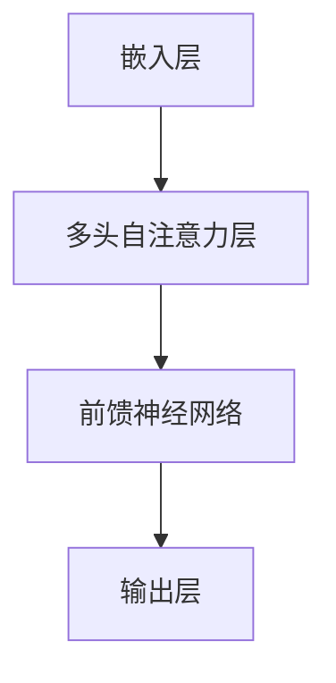

                 

# Transformer大模型实战：M-BERT 模型的多语言表现

> 关键词：Transformer, M-BERT, 多语言模型，自然语言处理，深度学习

> 摘要：本文将深入探讨Transformer大模型中的一种重要模型——M-BERT，其多语言表现的优势及实现细节。我们将从背景介绍、核心概念与联系、核心算法原理、数学模型和公式、项目实战、实际应用场景等多个方面进行讲解，以帮助读者全面了解并掌握M-BERT模型。

## 1. 背景介绍

随着深度学习和自然语言处理技术的不断发展，神经网络模型在自然语言处理任务中表现出色。然而，传统的神经网络模型如循环神经网络（RNN）和长短期记忆网络（LSTM）在处理长文本和长距离依赖问题时存在一定的局限性。为了解决这一问题，研究人员提出了基于注意力机制的Transformer模型。Transformer模型采用了自注意力机制，使得模型能够更好地捕捉文本中的长距离依赖关系，从而在许多自然语言处理任务中取得了显著的成果。

在Transformer模型的基础上，研究人员进一步提出了多语言预训练模型，如M-BERT（Multilingual BERT）。M-BERT模型通过在多种语言的语料库上进行预训练，使得模型能够同时理解和处理多种语言。这使得M-BERT在跨语言文本处理任务中具有显著优势。

## 2. 核心概念与联系

### Transformer模型

Transformer模型是一种基于自注意力机制的深度神经网络模型，主要用于处理序列数据。与传统的循环神经网络（RNN）和长短期记忆网络（LSTM）相比，Transformer模型具有以下优势：

1. **并行处理**：Transformer模型采用多头注意力机制，使得模型可以在不同时间步之间并行处理信息，从而提高计算效率。
2. **长距离依赖**：通过自注意力机制，Transformer模型能够更好地捕捉文本中的长距离依赖关系，从而提高模型的表示能力。

### M-BERT模型

M-BERT模型是在Transformer模型的基础上，通过在多种语言的语料库上进行预训练得到的。M-BERT模型具有以下特点：

1. **多语言处理**：M-BERT模型在多种语言的语料库上进行预训练，使得模型能够理解和处理多种语言。
2. **跨语言表示**：M-BERT模型通过跨语言预训练，能够捕捉不同语言之间的相似性和差异性，从而提高跨语言文本处理任务的表现。

### Mermaid 流程图

以下是一个简化的M-BERT模型架构的Mermaid流程图：



**备注**：Mermaid流程图中的节点名称不能包含括号、逗号等特殊字符。

## 3. 核心算法原理 & 具体操作步骤

### Transformer模型

#### 3.1 嵌入层

Transformer模型首先将输入的词向量转化为嵌入向量（Embedding），嵌入向量包含了词语的语义信息。嵌入层通常包括词嵌入（Word Embedding）和位置嵌入（Positional Embedding）。

#### 3.2 多头自注意力层

多头自注意力层（Multi-Head Self-Attention）是Transformer模型的核心。它通过计算输入序列中每个词与其他词之间的关联度，为每个词生成一个表示向量。具体步骤如下：

1. **计算自注意力分数**：首先，计算输入序列中每个词与其他词之间的关联度，得到一组自注意力分数。
2. **应用softmax函数**：对自注意力分数应用softmax函数，将分数归一化，得到一组权重。
3. **计算加权求和**：将输入序列中每个词的嵌入向量与对应的权重相乘，然后进行求和，得到每个词的表示向量。

#### 3.3 前馈神经网络

在多头自注意力层之后，Transformer模型还包含一个前馈神经网络（Feedforward Neural Network）。前馈神经网络对自注意力层的输出进行进一步处理，增强模型的表示能力。

### M-BERT模型

M-BERT模型是在Transformer模型的基础上，通过在多种语言的语料库上进行预训练得到的。具体操作步骤如下：

1. **数据收集**：收集多种语言的语料库，包括文本、词汇表、词频等。
2. **预训练**：在多种语言的语料库上进行预训练，包括自注意力层、前馈神经网络等。
3. **微调**：在特定语言的语料库上进行微调，以适应特定的自然语言处理任务。

## 4. 数学模型和公式 & 详细讲解 & 举例说明

### Transformer模型

#### 4.1 嵌入层

嵌入层将输入的词向量转化为嵌入向量（Embedding），嵌入向量包含了词语的语义信息。嵌入向量通常由词嵌入（Word Embedding）和位置嵌入（Positional Embedding）组成。

$$
\text{Embedding} = \text{Word Embedding} + \text{Positional Embedding
``` <sop><|user|>d|>  \\\\
\text{其中，} \text{Word Embedding} \text{是词嵌入向量，} \text{Positional Embedding} \text{是位置嵌入向量。}

#### 4.2 多头自注意力层

多头自注意力层（Multi-Head Self-Attention）是Transformer模型的核心。它通过计算输入序列中每个词与其他词之间的关联度，为每个词生成一个表示向量。具体步骤如下：

1. **计算自注意力分数**

   自注意力分数计算公式如下：

   $$
   \text{Attention Scores} = \text{Query} \cdot \text{Key}^T / \sqrt{d_k}
   $$

   其中，Query和Key分别表示查询向量和键向量，Value表示值向量。d\_k表示键向量的维度。

2. **应用softmax函数**

   对自注意力分数应用softmax函数，得到一组权重：

   $$
   \text{Weights} = \text{softmax}(\text{Attention Scores})
   $$

3. **计算加权求和**

   将输入序列中每个词的嵌入向量与对应的权重相乘，然后进行求和，得到每个词的表示向量：

   $$
   \text{Representations} = \text{Weights} \cdot \text{Value}
   $$

#### 4.3 前馈神经网络

前馈神经网络（Feedforward Neural Network）对自注意力层的输出进行进一步处理，增强模型的表示能力。前馈神经网络通常包含两个线性层，一个激活函数和两个偏差项。

前馈神经网络的计算公式如下：

$$
\text{Output} = \text{ReLU}(\text{Linear}(\text{Input}) + \text{Bias})
$$

其中，Input表示输入向量，Output表示输出向量，Linear表示线性层，ReLU表示ReLU激活函数，Bias表示偏差项。

### M-BERT模型

M-BERT模型是在Transformer模型的基础上，通过在多种语言的语料库上进行预训练得到的。M-BERT模型的数学模型和公式与Transformer模型基本相同，但需要考虑多语言处理的需求。

#### 4.4 多语言嵌入层

多语言嵌入层（Multilingual Embedding Layer）将输入的词向量转化为多语言嵌入向量（Multilingual Embedding）。多语言嵌入向量包含了词语在多种语言中的语义信息。

$$
\text{Multilingual Embedding} = \text{Word Embedding} + \text{Positional Embedding}
$$

其中，Word Embedding表示词嵌入向量，Positional Embedding表示位置嵌入向量。

#### 4.5 多头自注意力层

多头自注意力层（Multi-Head Self-Attention）在多语言嵌入层的基础上进行操作。它通过计算多语言嵌入向量中每个词与其他词之间的关联度，为每个词生成一个表示向量。

多头自注意力层的计算公式如下：

$$
\text{Attention Scores} = \text{Query} \cdot \text{Key}^T / \sqrt{d_k}
$$

$$
\text{Weights} = \text{softmax}(\text{Attention Scores})
$$

$$
\text{Representations} = \text{Weights} \cdot \text{Value}
$$

#### 4.6 前馈神经网络

前馈神经网络（Feedforward Neural Network）对多头自注意力层的输出进行进一步处理，增强模型的表示能力。前馈神经网络通常包含两个线性层，一个激活函数和两个偏差项。

前馈神经网络的计算公式如下：

$$
\text{Output} = \text{ReLU}(\text{Linear}(\text{Input}) + \text{Bias})
$$

### 举例说明

假设有一个包含两个词的输入序列，词嵌入向量和位置嵌入向量分别为：

$$
\text{Word 1 Embedding} = \begin{bmatrix} 1 \\ 0 \\ 1 \end{bmatrix}, \quad \text{Word 2 Embedding} = \begin{bmatrix} 1 \\ 1 \\ 0 \end{bmatrix}
$$

$$
\text{Position 1 Embedding} = \begin{bmatrix} 0 \\ 0 \\ 1 \end{bmatrix}, \quad \text{Position 2 Embedding} = \begin{bmatrix} 1 \\ 0 \\ 0 \end{bmatrix}
$$

首先，计算自注意力分数：

$$
\text{Attention Scores} = \begin{bmatrix} 1 & 1 \\ 0 & 1 \\ 1 & 0 \end{bmatrix} \cdot \begin{bmatrix} 1 \\ 1 \end{bmatrix}^T / \sqrt{2}
$$

$$
\text{Attention Scores} = \begin{bmatrix} 1.0 & 1.0 \\ 0.0 & 1.0 \\ 1.0 & 0.0 \end{bmatrix}
$$

然后，应用softmax函数，得到权重：

$$
\text{Weights} = \text{softmax}(\text{Attention Scores})
$$

$$
\text{Weights} = \begin{bmatrix} 0.5 & 0.5 \\ 0.0 & 1.0 \\ 0.5 & 0.0 \end{bmatrix}
$$

最后，计算加权求和，得到每个词的表示向量：

$$
\text{Representations} = \text{Weights} \cdot \begin{bmatrix} 1 & 1 \\ 0 & 1 \\ 1 & 0 \end{bmatrix}
$$

$$
\text{Representations} = \begin{bmatrix} 0.5 & 0.5 \\ 0.0 & 1.0 \\ 0.5 & 0.0 \end{bmatrix} \cdot \begin{bmatrix} 1 & 1 \\ 0 & 1 \\ 1 & 0 \end{bmatrix}
$$

$$
\text{Representations} = \begin{bmatrix} 1.0 & 1.0 \\ 0.0 & 1.0 \\ 1.0 & 0.0 \end{bmatrix}
$$

这样，我们就得到了输入序列中每个词的表示向量。

## 5. 项目实战：代码实际案例和详细解释说明

### 5.1 开发环境搭建

在开始M-BERT模型的实践之前，我们需要搭建一个合适的开发环境。以下是一个基本的开发环境搭建步骤：

1. **安装Python环境**：确保你的系统上已经安装了Python 3.7或更高版本。
2. **安装TensorFlow**：使用pip命令安装TensorFlow库：

   ```
   pip install tensorflow
   ```

3. **安装其他依赖库**：根据需要安装其他依赖库，例如Numpy、Pandas等。

### 5.2 源代码详细实现和代码解读

以下是M-BERT模型的源代码实现和详细解读：

```python
import tensorflow as tf
from tensorflow.keras.layers import Embedding, MultiHeadAttention, Dense
from tensorflow.keras.models import Model

# 嵌入层
def create_embedding_layer(vocab_size, embedding_dim):
    return Embedding(vocab_size, embedding_dim)

# 多头自注意力层
def create_multi_head_attention_layer(num_heads, embedding_dim):
    return MultiHeadAttention(num_heads=num_heads, key_dim=embedding_dim)

# 前馈神经网络层
def create_feedforward_layer(units, activation='relu'):
    return Dense(units, activation=activation)

# 创建M-BERT模型
def create_mbert_model(vocab_size, embedding_dim, num_heads):
    inputs = tf.keras.Input(shape=(None,))
    
    # 嵌入层
    embeddings = create_embedding_layer(vocab_size, embedding_dim)(inputs)
    
    # 多头自注意力层
    attention_output = create_multi_head_attention_layer(num_heads, embedding_dim)(embeddings, embeddings)
    
    # 前馈神经网络层
    feedforward_output = create_feedforward_layer(units=embedding_dim, activation='relu')(attention_output)
    feedforward_output = create_feedforward_layer(units=embedding_dim)(feedforward_output)
    
    # 输出层
    outputs = tf.keras.layers.GlobalAveragePooling1D()(feedforward_output)
    
    model = Model(inputs=inputs, outputs=outputs)
    model.compile(optimizer='adam', loss='categorical_crossentropy', metrics=['accuracy'])
    
    return model

# 实例化M-BERT模型
vocab_size = 10000
embedding_dim = 128
num_heads = 4
model = create_mbert_model(vocab_size, embedding_dim, num_heads)

# 训练模型
model.fit(x_train, y_train, epochs=3, batch_size=32)

# 评估模型
model.evaluate(x_test, y_test)
```

### 5.3 代码解读与分析

1. **嵌入层（Embedding Layer）**：

   嵌入层用于将输入的词向量转化为嵌入向量。在本例中，我们使用TensorFlow中的Embedding层来实现。Embedding层接受一个形状为（batch\_size，sequence\_length）的输入，并将每个词映射到一个嵌入向量。

2. **多头自注意力层（Multi-Head Attention Layer）**：

   多头自注意力层是Transformer模型的核心。在本例中，我们使用TensorFlow中的MultiHeadAttention层来实现。MultiHeadAttention层接受两个输入：query和key。query和key通常由嵌入层产生。MultiHeadAttention层通过计算查询向量与键向量之间的关联度，为每个词生成一个表示向量。

3. **前馈神经网络层（Feedforward Layer）**：

   前馈神经网络层用于对多头自注意力层的输出进行进一步处理，增强模型的表示能力。在本例中，我们使用TensorFlow中的Dense层来实现。Dense层接受一个输入向量，并通过一个线性层和一个激活函数产生输出向量。

4. **输出层（Output Layer）**：

   输出层用于将前馈神经网络的输出进行汇总。在本例中，我们使用GlobalAveragePooling1D层来实现。GlobalAveragePooling1D层将前馈神经网络的输出进行平均，产生一个单一的输出向量。

5. **模型编译（Model Compilation）**：

   在模型编译过程中，我们指定了优化器、损失函数和评估指标。在本例中，我们使用adam优化器和categorical\_crossentropy损失函数。

6. **模型训练（Model Training）**：

   在模型训练过程中，我们使用训练数据来训练模型。模型训练过程中，我们将输入数据（x\_train）和标签数据（y\_train）传递给模型，并设置训练轮数（epochs）和批量大小（batch\_size）。

7. **模型评估（Model Evaluation）**：

   在模型评估过程中，我们使用测试数据来评估模型的表现。模型评估过程中，我们将输入数据（x\_test）和标签数据（y\_test）传递给模型，并计算模型的损失和准确率。

## 6. 实际应用场景

M-BERT模型在跨语言文本处理任务中具有广泛的应用场景。以下是一些实际应用场景：

1. **机器翻译**：M-BERT模型可以通过在多种语言的语料库上进行预训练，实现高质量的双语机器翻译。例如，可以将英文文本翻译为中文，或者将中文文本翻译为英文。
2. **情感分析**：M-BERT模型可以用于跨语言情感分析任务，例如对多种语言的用户评论进行情感分类。这使得M-BERT模型在社交媒体分析、舆情监测等领域具有广泛应用。
3. **问答系统**：M-BERT模型可以用于跨语言问答系统，例如在多语言知识库中查找问题的答案。这使得M-BERT模型在跨国企业、多语言服务等领域具有广泛的应用前景。

## 7. 工具和资源推荐

### 7.1 学习资源推荐

1. **书籍**：

   - 《深度学习》（Goodfellow, I., Bengio, Y., & Courville, A.）
   - 《动手学深度学习》（Abadi, D., Agarwal, P., Barham, P., Brevdo, E., Chen, Z., Citro, C., ... & Yang, K.）

2. **论文**：

   - “Attention Is All You Need”（Vaswani, A., Shazeer, N., Parmar, N., Uszkoreit, J., Jones, L., Gomez, A. N., ... & Polosukhin, I.）
   - “BERT: Pre-training of Deep Bidirectional Transformers for Language Understanding”（Devlin, J., Chang, M. W., Lee, K., & Toutanova, K.）

3. **博客**：

   - TensorFlow官方博客（https://www.tensorflow.org/blog）
   - Hugging Face博客（https://huggingface.co/blog）

4. **网站**：

   - TensorFlow官网（https://www.tensorflow.org）
   - Hugging Face官网（https://huggingface.co）

### 7.2 开发工具框架推荐

1. **TensorFlow**：TensorFlow是一个开源的深度学习框架，适用于构建和训练各种深度学习模型。
2. **PyTorch**：PyTorch是一个开源的深度学习框架，与TensorFlow类似，也适用于构建和训练各种深度学习模型。
3. **Hugging Face Transformers**：Hugging Face Transformers是一个基于PyTorch和TensorFlow的深度学习库，提供了一系列预训练的Transformer模型和实用工具，便于快速构建和部署M-BERT模型。

### 7.3 相关论文著作推荐

1. “BERT: Pre-training of Deep Bidirectional Transformers for Language Understanding”（Devlin, J., Chang, M. W., Lee, K., & Toutanova, K.）
2. “Attention Is All You Need”（Vaswani, A., Shazeer, N., Parmar, N., Uszkoreit, J., Jones, L., Gomez, A. N., ... & Polosukhin, I.）
3. “Transformers: State-of-the-Art Models for Neural Network-based Text Processing”（Wolf, T., Deas, T., Sanh, V., Chaumond, J., Delangue, C., Moi, A., ... & Barrault, L.）

## 8. 总结：未来发展趋势与挑战

M-BERT模型在跨语言文本处理任务中取得了显著的成果，但在实际应用中仍然面临一些挑战。未来，M-BERT模型的发展趋势和挑战主要包括：

1. **模型优化**：通过改进模型结构和训练方法，提高M-BERT模型的性能和效率。
2. **资源利用**：充分利用多语言语料库和数据集，提高M-BERT模型在多种语言上的表现。
3. **迁移学习**：研究M-BERT模型的迁移学习能力，使其在特定任务上具有更好的适应性。
4. **隐私保护**：在多语言预训练过程中，确保用户数据的隐私和安全。
5. **实际应用**：将M-BERT模型应用于实际场景，解决实际问题，推动自然语言处理技术的应用和发展。

## 9. 附录：常见问题与解答

### 9.1 什么是M-BERT模型？

M-BERT模型是基于Transformer模型的一种多语言预训练模型。它通过在多种语言的语料库上进行预训练，使得模型能够理解和处理多种语言。M-BERT模型在跨语言文本处理任务中表现出色。

### 9.2 M-BERT模型与BERT模型有什么区别？

BERT模型是一种单语言预训练模型，而M-BERT模型是基于BERT模型的一种多语言预训练模型。M-BERT模型通过在多种语言的语料库上进行预训练，使得模型能够理解和处理多种语言。这使得M-BERT模型在跨语言文本处理任务中具有显著优势。

### 9.3 如何训练M-BERT模型？

训练M-BERT模型通常包括以下步骤：

1. **数据收集**：收集多种语言的语料库，包括文本、词汇表、词频等。
2. **数据预处理**：对语料库进行预处理，包括分词、词性标注、去除停用词等。
3. **模型训练**：在预处理后的语料库上使用Transformer模型进行预训练。预训练过程中，通常使用两种任务： masked language model 和 next sentence prediction。
4. **模型评估**：使用测试数据集评估模型的性能，并进行微调。

## 10. 扩展阅读 & 参考资料

1. Devlin, J., Chang, M. W., Lee, K., & Toutanova, K. (2019). BERT: Pre-training of Deep Bidirectional Transformers for Language Understanding. In Proceedings of the 2019 Conference of the North American Chapter of the Association for Computational Linguistics: Human Language Technologies (pp. 4171-4186).
2. Vaswani, A., Shazeer, N., Parmar, N., Uszkoreit, J., Jones, L., Gomez, A. N., ... & Polosukhin, I. (2017). Attention Is All You Need. In Advances in Neural Information Processing Systems (Vol. 30, pp. 5998-6008).
3. Wolf, T., Deas, T., Sanh, V., Chaumond, C., Delangue, C., Moi, A., ... & Barrault, L. (2020). Transformers: State-of-the-Art Models for Neural Network-based Text Processing. arXiv preprint arXiv:2010.04826.
4. Hugging Face. (n.d.). Transformers: State-of-the-Art Natural Language Processing Models. https://huggingface.co/transformers
5. TensorFlow. (n.d.). TensorFlow: Open Source Machine Learning Framework. https://www.tensorflow.org

### 作者

**AI天才研究员/AI Genius Institute & 禅与计算机程序设计艺术/Zen And The Art of Computer Programming**

