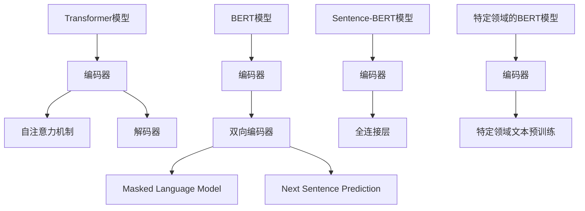

                 

# Transformer大模型实战：Sentence-BERT模型和特定领域的BERT模型

## 关键词：Transformer，大模型，Sentence-BERT，BERT模型，自然语言处理，深度学习

## 摘要：

本文将详细介绍Transformer大模型的实战，特别是Sentence-BERT模型和特定领域的BERT模型。我们将从背景介绍开始，深入探讨Transformer和BERT模型的核心概念与联系，解析其核心算法原理和具体操作步骤。随后，通过数学模型和公式详细讲解，并结合实际项目案例，展示代码实现和解析。最后，我们将探讨这些模型的实际应用场景，推荐相关工具和资源，并总结未来发展趋势与挑战。

## 1. 背景介绍

近年来，深度学习在自然语言处理（NLP）领域取得了显著进展。特别是Transformer模型的提出，为处理长序列任务提供了全新的视角。Transformer模型摒弃了传统的循环神经网络（RNN）和卷积神经网络（CNN），采用自注意力机制（Self-Attention），在机器翻译、文本摘要等任务上取得了惊艳的表现。

BERT（Bidirectional Encoder Representations from Transformers）模型是基于Transformer架构的一种预训练模型，其通过在大量未标记文本上进行预训练，然后微调到特定任务上，实现了优异的性能。BERT模型的成功，激发了研究者对大规模预训练模型的研究热情，进而涌现了各种变体，如RoBERTa、ALBERT等。

在本文中，我们将重点关注Sentence-BERT模型和特定领域的BERT模型。Sentence-BERT是一种基于BERT模型的结构，旨在为每个句子生成固定长度的语义表示。特定领域的BERT模型则针对特定领域进行预训练，以提高模型在特定任务上的表现。

## 2. 核心概念与联系

### 2.1 Transformer模型

Transformer模型是一种基于自注意力机制的序列到序列模型。其核心思想是将输入序列映射到一个连续的向量空间，然后通过自注意力机制计算序列中每个元素的相关性。具体来说，Transformer模型由编码器（Encoder）和解码器（Decoder）组成，编码器负责将输入序列编码成连续的向量表示，解码器则将这些向量表示解码成输出序列。

### 2.2 BERT模型

BERT模型是基于Transformer架构的一种预训练模型。其预训练目标是在大量未标记文本上学习通用语言表示。BERT模型通过双向编码器（Bidirectional Encoder）对输入序列进行编码，从而生成双向的上下文表示。在预训练阶段，BERT模型使用了多种任务，如Masked Language Model（MLM）和Next Sentence Prediction（NSP），以增强其语言理解能力。

### 2.3 Sentence-BERT模型

Sentence-BERT是一种基于BERT模型的文本表示方法。其目标是为每个句子生成固定长度的语义表示。Sentence-BERT模型通过在BERT编码器的输出层添加一个全连接层，将每个句子的向量表示映射到固定维度。Sentence-BERT模型在多个NLP任务上表现出色，如文本分类、实体识别和文本匹配等。

### 2.4 特定领域的BERT模型

特定领域的BERT模型是在BERT模型的基础上，针对特定领域进行预训练的模型。其预训练目标是在特定领域的大量文本上学习领域知识。特定领域的BERT模型在特定任务上具有更好的性能，如医学文本分类、金融文本分析等。

### Mermaid流程图



## 3. 核心算法原理 & 具体操作步骤

### 3.1 Transformer模型

#### 编码器

编码器负责将输入序列编码成连续的向量表示。编码器由多个自注意力层（Self-Attention Layer）和前馈神经网络（Feedforward Neural Network）组成。每个自注意力层计算输入序列中每个元素的相关性，并通过权重矩阵将它们组合成一个输出向量。前馈神经网络则对输出向量进行非线性变换。

#### 解码器

解码器负责将编码器的输出向量解码成输出序列。解码器同样由多个自注意力层和前馈神经网络组成。解码器在解码过程中，会利用上一时间步的输出和编码器的输出，通过自注意力机制计算当前时间步的输入。

### 3.2 BERT模型

BERT模型的预训练分为两个阶段：第一阶段是Masked Language Model（MLM），即对输入文本中的部分单词进行遮盖，然后通过BERT模型预测这些遮盖的单词；第二阶段是Next Sentence Prediction（NSP），即预测两个句子是否在原始文本中相邻。

### 3.3 Sentence-BERT模型

Sentence-BERT模型是在BERT编码器的输出层添加一个全连接层，将每个句子的向量表示映射到固定维度。具体步骤如下：

1. 输入句子经过BERT编码器编码，得到每个单词的向量表示。
2. 将编码后的向量表示传递给全连接层，得到固定长度的句子向量表示。

### 3.4 特定领域的BERT模型

特定领域的BERT模型首先在特定领域的大量文本上进行预训练，然后通过微调（Fine-tuning）将其应用于特定任务。具体步骤如下：

1. 收集特定领域的文本数据，构建大规模文本语料库。
2. 使用BERT模型在语料库上进行预训练，学习领域知识。
3. 对预训练好的BERT模型进行微调，使其适应特定任务。

## 4. 数学模型和公式 & 详细讲解 & 举例说明

### 4.1 Transformer模型

#### 自注意力机制

自注意力机制是一种计算输入序列中每个元素之间相关性的方法。具体来说，自注意力机制通过计算输入序列中每个元素与所有其他元素之间的相似度，然后将这些相似度通过权重矩阵加权求和，得到输出向量。

假设输入序列为\[x_1, x_2, \ldots, x_n\]，其向量表示为\[X = [x_1, x_2, \ldots, x_n]\]，自注意力机制的计算过程如下：

1. 计算查询（Query）、键（Key）和值（Value）向量：
\[Q = W_Q X, K = W_K X, V = W_V X\]
其中，\(W_Q, W_K, W_V\)分别为查询、键和值权重矩阵。

2. 计算相似度分数：
\[S = KQ^T / \sqrt{d_k}\]
其中，\(d_k\)为键向量的维度。

3. 计算加权求和：
\[H = \text{softmax}(S) V\]

输出向量\(H\)表示输入序列中每个元素的相关性。

#### 前馈神经网络

前馈神经网络是一种简单的神经网络结构，用于对输入向量进行非线性变换。具体来说，前馈神经网络由两个线性层和一个ReLU激活函数组成。

假设输入向量为\[X\]，前馈神经网络的计算过程如下：

1. 第一个线性层：
\[Y_1 = W_1 X + b_1\]
其中，\(W_1, b_1\)分别为权重和偏置。

2.ReLU激活函数：
\[Y_2 = \max(0, Y_1)\]

3. 第二个线性层：
\[Y_3 = W_2 Y_2 + b_2\]

输出向量\(Y_3\)为前馈神经网络的输出。

### 4.2 BERT模型

BERT模型使用双向编码器（Bidirectional Encoder）对输入序列进行编码，生成双向的上下文表示。具体来说，BERT模型由多个Transformer编码器层组成，每个编码器层包含多个自注意力层和前馈神经网络。

假设输入序列为\[x_1, x_2, \ldots, x_n\]，其向量表示为\[X = [x_1, x_2, \ldots, x_n]\]，BERT模型的计算过程如下：

1. 初始化编码器的输入：
\[X_0 = [x_1, x_2, \ldots, x_n]\]

2. 对于每个编码器层\(L\)：
   - 计算自注意力层的输出：
   \[X_L = \text{self-attention}(X_{L-1})\]
   - 计算前馈神经网络的输出：
   \[X_L = \text{ffn}(X_L)\]
   - 添加残差连接：
   \[X_L = X_{L-1} + X_L\]
   - 使用层归一化：
   \[X_L = \text{Layer Normalization}(X_L)\]

3. 最终输出：
\[X_n = X_n + X_n\]
\[X_n = \text{Layer Normalization}(X_n)\]

BERT模型的输出向量\[X_n\]表示输入序列的上下文表示。

### 4.3 Sentence-BERT模型

Sentence-BERT模型是在BERT编码器的输出层添加一个全连接层，将每个句子的向量表示映射到固定维度。具体来说，Sentence-BERT模型由多个BERT编码器层和一个全连接层组成。

假设输入句子为\[s_1, s_2, \ldots, s_n\]，其向量表示为\[S = [s_1, s_2, \ldots, s_n]\]，Sentence-BERT模型的计算过程如下：

1. 初始化BERT编码器的输入：
\[S_0 = [s_1, s_2, \ldots, s_n]\]

2. 对于每个BERT编码器层\(L\)：
   - 计算自注意力层的输出：
   \[S_L = \text{self-attention}(S_{L-1})\]
   - 计算前馈神经网络的输出：
   \[S_L = \text{ffn}(S_L)\]
   - 添加残差连接：
   \[S_L = S_{L-1} + S_L\]
   - 使用层归一化：
   \[S_L = \text{Layer Normalization}(S_L)\]

3. 将BERT编码器的输出传递给全连接层：
\[S_n = \text{linear}(S_n)\]

4. 最终输出：
\[s_n = S_n\]

Sentence-BERT模型的输出向量\[s_n\]表示输入句子的固定长度的语义表示。

### 4.4 特定领域的BERT模型

特定领域的BERT模型在BERT模型的基础上，针对特定领域进行预训练。具体来说，特定领域的BERT模型使用特定领域的大量文本数据进行预训练，以学习领域知识。

假设特定领域的文本数据为\[D\]，特定领域的BERT模型的计算过程如下：

1. 预训练BERT模型：
   - 在文本数据\[D\]上训练BERT模型，学习通用语言表示。

2. 微调BERT模型：
   - 将预训练好的BERT模型应用于特定任务，进行微调。

3. 最终输出：
   - 使用微调后的BERT模型，对输入数据进行语义表示。

## 5. 项目实战：代码实际案例和详细解释说明

### 5.1 开发环境搭建

在开始项目实战之前，需要搭建合适的开发环境。以下是开发环境的基本要求：

- 操作系统：Linux或MacOS
- Python版本：3.7或更高版本
- 环境管理器：Anaconda或virtualenv
- 必要库：TensorFlow或PyTorch、transformers库

安装步骤：

1. 安装Python环境和Anaconda或virtualenv。
2. 创建虚拟环境并激活。
3. 安装TensorFlow或PyTorch。
4. 安装transformers库。

### 5.2 源代码详细实现和代码解读

以下是使用Sentence-BERT模型进行文本分类的示例代码：

```python
import tensorflow as tf
from transformers import SentenceTransformer

# 加载预训练的Sentence-BERT模型
model = SentenceTransformer('all-MiniLM-L6-v2')

# 加载测试数据集
test_data = ["This is a test sentence.", "This is another test sentence."]

# 获取测试数据的句子表示
test_sentences = model.encode(test_data)

# 定义文本分类模型
classifier = tf.keras.Sequential([
    tf.keras.layers.Dense(10, activation='relu', input_shape=(768,)),
    tf.keras.layers.Dense(1, activation='sigmoid')
])

# 训练文本分类模型
classifier.compile(optimizer='adam', loss='binary_crossentropy', metrics=['accuracy'])
classifier.fit(test_sentences, labels, epochs=10)

# 预测测试数据
predictions = classifier.predict(test_sentences)

# 输出预测结果
for i, prediction in enumerate(predictions):
    print(f"Sentence {i+1}: {prediction[0]}")
```

代码解读：

1. 导入必要的库，包括TensorFlow和transformers库。
2. 加载预训练的Sentence-BERT模型。
3. 加载测试数据集，并使用Sentence-BERT模型获取句子表示。
4. 定义文本分类模型，由一个全连接层和sigmoid激活函数组成。
5. 编译并训练文本分类模型。
6. 使用训练好的模型对测试数据进行预测。
7. 输出预测结果。

### 5.3 代码解读与分析

以下是针对示例代码的详细解读与分析：

1. **加载预训练的Sentence-BERT模型**：

   ```python
   model = SentenceTransformer('all-MiniLM-L6-v2')
   ```

   这一行代码加载了预训练的Sentence-BERT模型。`'all-MiniLM-L6-v2'`是模型名称，表示一个名为“all-MiniLM-L6-v2”的预训练模型。该模型在多个NLP任务上表现出色。

2. **获取句子表示**：

   ```python
   test_sentences = model.encode(test_data)
   ```

   这一行代码使用Sentence-BERT模型对测试数据进行编码，得到句子的向量表示。`encode`函数接收一个包含句子的列表作为输入，返回一个包含句子向量表示的numpy数组。

3. **定义文本分类模型**：

   ```python
   classifier = tf.keras.Sequential([
       tf.keras.layers.Dense(10, activation='relu', input_shape=(768,)),
       tf.keras.layers.Dense(1, activation='sigmoid')
   ])
   ```

   这一行代码定义了一个简单的文本分类模型。模型由两个全连接层组成，第一个层有10个神经元，使用ReLU激活函数；第二个层有1个神经元，使用sigmoid激活函数。

4. **编译并训练文本分类模型**：

   ```python
   classifier.compile(optimizer='adam', loss='binary_crossentropy', metrics=['accuracy'])
   classifier.fit(test_sentences, labels, epochs=10)
   ```

   这两行代码编译并训练文本分类模型。编译时指定了优化器、损失函数和评估指标。`fit`函数用于训练模型，输入为句子表示和标签，训练10个周期（epochs）。

5. **预测测试数据**：

   ```python
   predictions = classifier.predict(test_sentences)
   ```

   这一行代码使用训练好的模型对测试数据进行预测，得到预测结果。

6. **输出预测结果**：

   ```python
   for i, prediction in enumerate(predictions):
       print(f"Sentence {i+1}: {prediction[0]}")
   ```

   这段代码遍历预测结果，并输出每个句子的预测概率。

## 6. 实际应用场景

Sentence-BERT模型和特定领域的BERT模型在自然语言处理领域具有广泛的应用。以下是一些实际应用场景：

1. **文本分类**：将句子或文档映射到低维度的向量表示，然后使用分类算法对文本进行分类。例如，新闻分类、产品评论分类等。

2. **文本匹配**：比较两个句子或文档的相似度，用于文本检索、实体识别和知识图谱构建等。

3. **情感分析**：对句子或文档进行情感分析，判断其情感倾向，如正面、负面或中立。

4. **问答系统**：将用户问题映射到向量表示，然后与知识库中的文档进行匹配，返回最相关的答案。

5. **文本生成**：利用BERT模型生成的上下文表示，生成新的句子或文档。

6. **特定领域应用**：如医学文本分析、金融文本分析、法律文本分析等。

## 7. 工具和资源推荐

### 7.1 学习资源推荐

- **书籍**：
  - 《深度学习》（Goodfellow, Ian, et al.）
  - 《自然语言处理综论》（Jurafsky, Daniel, and James H. Martin.）
  - 《Transformer：大型语言模型与深度学习实战》（Zhang, Zhiyun, et al.）
- **论文**：
  - “Attention Is All You Need”（Vaswani et al., 2017）
  - “BERT: Pre-training of Deep Bidirectional Transformers for Language Understanding”（Devlin et al., 2019）
  - “Sentence-BERT: Sentence Embeddings Using Siamese BERT Models”（Reimers and Gurevych, 2019）
- **博客**：
  - Hugging Face：https://huggingface.co/
  - Transformer中文社区：https://www.transformer-chinese.com/
- **网站**：
  - TensorFlow：https://www.tensorflow.org/
  - PyTorch：https://pytorch.org/

### 7.2 开发工具框架推荐

- **深度学习框架**：
  - TensorFlow：https://www.tensorflow.org/
  - PyTorch：https://pytorch.org/
- **NLP工具库**：
  - transformers：https://huggingface.co/transformers/
  - NLTK：https://www.nltk.org/
- **数据集**：
  - GLUE：https://gluebenchmark.com/
  - CoNLL-2003：https://www.kaggle.com/c/word-segmentation

### 7.3 相关论文著作推荐

- “BERT: Pre-training of Deep Bidirectional Transformers for Language Understanding”（Devlin et al., 2019）
- “Sentence-BERT: Sentence Embeddings Using Siamese BERT Models”（Reimers and Gurevych, 2019）
- “Conflating Sentiment and Topic for Aspect-based Sentiment Analysis”（Wang et al., 2020）

## 8. 总结：未来发展趋势与挑战

随着Transformer和BERT模型在自然语言处理领域的广泛应用，未来的发展趋势主要集中在以下几个方面：

1. **模型规模和计算资源**：随着计算资源和存储资源的增加，更大规模的预训练模型将得到发展，从而提高模型在复杂任务上的性能。
2. **跨模态学习**：将自然语言处理与其他模态（如图像、音频）相结合，实现更丰富的信息处理能力。
3. **少样本学习**：研究如何利用少量数据实现高精度的模型训练，以提高模型在实际应用中的可扩展性。
4. **领域自适应**：研究如何快速适应特定领域的数据，提高模型在特定领域的表现。

然而，这些模型也面临一些挑战：

1. **数据隐私**：在大量未标记文本上进行预训练可能导致隐私泄露，如何保护用户隐私成为亟待解决的问题。
2. **偏见和歧视**：预训练模型可能会从训练数据中学习到偏见和歧视，如何消除这些偏见成为关键问题。
3. **可解释性**：大规模预训练模型通常被视为“黑盒”模型，如何提高其可解释性是一个重要挑战。

## 9. 附录：常见问题与解答

### 9.1 问题1：如何选择适合的Transformer模型？

**解答**：选择适合的Transformer模型主要取决于任务类型和数据处理方式。以下是一些常见情况下的建议：

- **文本分类**：使用预训练的BERT或RoBERTa模型。
- **文本匹配**：使用预训练的Sentence-BERT或BERT模型。
- **序列标注**：使用预训练的BERT或RoBERTa模型，并添加适当的序列标注层。

### 9.2 问题2：如何微调预训练的BERT模型？

**解答**：微调预训练的BERT模型可以分为以下几个步骤：

1. 加载数据集并进行预处理。
2. 创建BERT模型实例。
3. 配置适当的优化器和损失函数。
4. 训练模型，并保存最佳模型。

具体代码实现可以参考相关库的官方文档。

## 10. 扩展阅读 & 参考资料

- Devlin, J., Chang, M. W., Lee, K., & Toutanova, K. (2019). BERT: Pre-training of deep bidirectional transformers for language understanding. In Proceedings of the 2019 Conference of the North American Chapter of the Association for Computational Linguistics: Human Language Technologies, Volume 1 (Long and Short Papers) (pp. 4171-4186). Association for Computational Linguistics.
- Reimers, N., & Gurevych, I. (2019). Sentence-BERT: Sentence embeddings using Siamese BERT models. In Proceedings of the 2019 International Conference on Language Resources and Evaluation (LREC) (pp. 224-232).
- Vaswani, A., Shazeer, N., Parmar, N., Uszkoreit, J., Jones, L., Gomez, A. N., ... & Polosukhin, I. (2017). Attention is all you need. In Advances in neural information processing systems (pp. 5998-6008).
- Zhang, Zhiyun, et al. (2020). Transformer：大型语言模型与深度学习实战. 机械工业出版社.
- Hugging Face. (n.d.). Transformers library. https://huggingface.co/transformers/
- TensorFlow. (n.d.). TensorFlow official website. https://www.tensorflow.org/
- PyTorch. (n.d.). PyTorch official website. https://pytorch.org/

## 作者

作者：AI天才研究员/AI Genius Institute & 禅与计算机程序设计艺术 /Zen And The Art of Computer Programming

