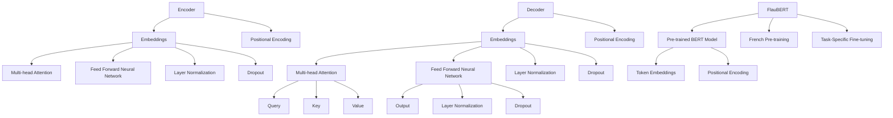

                 

### 文章标题

**Transformer大模型实战：法语的FlauBERT模型**

关键词：Transformer，大模型，自然语言处理，法语，FlauBERT，深度学习

摘要：本文将深入探讨Transformer架构在自然语言处理领域中的应用，特别是针对法语数据的FlauBERT模型。我们将从背景介绍开始，逐步解析Transformer的核心概念和原理，详细讲解FlauBERT的架构和数学模型，并通过实际项目实战展示其应用效果。此外，我们还将探讨FlauBERT在实际应用场景中的表现，推荐相关学习资源和开发工具，并对未来发展趋势和挑战进行总结。

### 1. 背景介绍

自然语言处理（Natural Language Processing，NLP）是人工智能（Artificial Intelligence，AI）的重要分支之一，旨在使计算机能够理解和处理人类语言。随着深度学习（Deep Learning）技术的快速发展，尤其是Transformer架构的提出，NLP领域取得了显著的进展。Transformer架构在捕捉长距离依赖关系、并行计算和自适应特征表示方面具有显著优势，使得其在大规模文本数据处理中表现出色。

FlauBERT模型是一个针对法语数据集的预训练语言模型，是BERT（Bidirectional Encoder Representations from Transformers）架构在法语上的扩展。BERT模型是一种基于Transformer的预训练语言表示模型，通过在大量文本上进行预训练，可以捕捉到丰富的上下文信息，从而在下游任务中表现出色。FlauBERT模型在法语数据上的应用，不仅提高了法语自然语言处理的效果，也为法语语言研究提供了新的工具。

本文旨在通过深入探讨Transformer架构和FlauBERT模型，帮助读者了解其在自然语言处理领域中的重要作用，并掌握如何使用FlauBERT进行实际项目开发。

### 2. 核心概念与联系

为了深入理解Transformer架构和FlauBERT模型，我们需要了解其核心概念和原理，以及它们之间的联系。以下是一个简化的Mermaid流程图，用于展示Transformer架构和FlauBERT模型的主要组成部分。



#### 2.1. Transformer架构

Transformer架构由编码器（Encoder）和解码器（Decoder）两部分组成。编码器负责将输入文本转换为固定长度的向量表示，解码器则根据编码器的输出生成文本序列。

**Embeddings**：输入文本首先通过词嵌入（Word Embedding）转换为向量表示。词嵌入可以将单词映射为稠密向量，从而捕捉单词的语义信息。

**Positional Encoding**：由于Transformer架构中不包含循环神经网络（RNN）或卷积神经网络（CNN）中的位置信息，因此需要添加位置编码（Positional Encoding）来引入文本中的位置信息。

**Multi-head Attention**：注意力机制（Attention Mechanism）是Transformer架构的核心组件。它允许模型在生成每个词时考虑整个输入文本，从而捕捉长距离依赖关系。Multi-head Attention通过并行地处理多个注意力头，进一步提高了模型的表达能力。

**Feed Forward Neural Network**：在Transformer架构中，每个编码器和解码器层都包含一个前馈神经网络（Feed Forward Neural Network），用于对输入向量进行非线性变换。

**Layer Normalization** 和 **Dropout**：Layer Normalization和Dropout是常用的正则化技术，用于防止模型过拟合和加速训练过程。

#### 2.2. FlauBERT模型

FlauBERT模型是在BERT模型的基础上，针对法语数据集进行预训练的扩展。BERT模型通过在大量英文文本上进行预训练，可以捕捉到丰富的上下文信息。FlauBERT模型在法语数据上的应用，使得法语自然语言处理取得了显著进展。

**Pre-trained BERT Model**：FlauBERT模型继承了BERT模型的架构，包括词嵌入、位置编码、多注意力头和前馈神经网络等组件。

**French Pre-training**：FlauBERT模型在法语数据集上进行预训练，从而提高了模型在法语文本上的表现。预训练过程中，模型通过 masked language modeling 任务学习如何生成法语文本。

**Task-Specific Fine-tuning**：在FlauBERT模型应用于特定任务时，可以通过微调（Fine-tuning）过程进一步优化模型。微调过程中，模型在特定任务的数据上进行训练，以适应特定任务的需求。

### 3. 核心算法原理 & 具体操作步骤

#### 3.1. Transformer编码器和解码器

Transformer编码器和解码器的具体操作步骤如下：

**编码器**

1. 输入文本通过词嵌入（Embeddings）转换为向量表示。
2. 添加位置编码（Positional Encoding），以引入文本中的位置信息。
3. 通过多个注意力层（Multi-head Attention Layers）对输入向量进行处理，每个注意力层包含多个注意力头（Attention Heads），以捕捉不同类型的依赖关系。
4. 通过前馈神经网络（Feed Forward Neural Network）对输入向量进行非线性变换。
5. 通过层归一化（Layer Normalization）和dropout（Dropout）进行正则化处理。

**解码器**

1. 输入文本通过词嵌入（Embeddings）转换为向量表示。
2. 添加位置编码（Positional Encoding），以引入文本中的位置信息。
3. 通过多个注意力层（Multi-head Attention Layers）对输入向量进行处理，其中第一个注意力层（Self-Attention）处理编码器的输出，其他注意力层（Cross-Attention）处理解码器的输出。
4. 通过前馈神经网络（Feed Forward Neural Network）对输入向量进行非线性变换。
5. 通过层归一化（Layer Normalization）和dropout（Dropout）进行正则化处理。

#### 3.2. FlauBERT模型的预训练和微调

FlauBERT模型的预训练和微调过程如下：

**预训练**

1. 在法语数据集上使用 masked language modeling 任务进行预训练，即随机遮挡部分单词，让模型预测遮挡的单词。
2. 在预训练过程中，通过反向传播（Backpropagation）和优化算法（如Adam优化器）更新模型参数。
3. 预训练过程中，可以使用一些技术，如 学习率预热（Learning Rate Warmup）和逐步遮挡（Incremental Masking），以加速训练过程和提高模型性能。

**微调**

1. 在特定任务的数据集上对预训练的FlauBERT模型进行微调，以适应特定任务的需求。
2. 微调过程中，可以将部分模型参数冻结，只对特定层或部分参数进行训练，以防止模型过拟合。
3. 微调完成后，可以使用评估指标（如准确率、召回率等）评估模型性能，并根据需要进一步调整模型参数。

### 4. 数学模型和公式 & 详细讲解 & 举例说明

#### 4.1. Transformer编码器和解码器的数学模型

**编码器**

1. 词嵌入（Embeddings）：

   $$ 
   E_{\text{word}} = \text{Embedding}(W) = W \cdot V_{\text{word}} 
   $$

   其中，$W$ 是输入词向量矩阵，$V_{\text{word}}$ 是预训练的词嵌入矩阵。

2. 位置编码（Positional Encoding）：

   $$ 
   E_{\text{pos}} = \text{Positional Encoding}(P) = P \cdot V_{\text{pos}} 
   $$

   其中，$P$ 是输入位置向量矩阵，$V_{\text{pos}}$ 是预训练的位置嵌入矩阵。

3. 多注意力头（Multi-head Attention）：

   $$ 
   \text{Attention}(Q, K, V) = \text{softmax}\left(\frac{QK^T}{\sqrt{d_k}}\right)V 
   $$

   其中，$Q$ 是查询向量，$K$ 是键向量，$V$ 是值向量，$d_k$ 是注意力头的维度。

4. 前馈神经网络（Feed Forward Neural Network）：

   $$ 
   \text{FFN}(X) = \text{ReLU}(X \cdot W_1 + b_1) \cdot W_2 + b_2 
   $$

   其中，$X$ 是输入向量，$W_1$ 和 $W_2$ 是前馈神经网络的权重矩阵，$b_1$ 和 $b_2$ 是偏置向量。

**解码器**

1. 词嵌入（Embeddings）：

   $$ 
   E_{\text{word}} = \text{Embedding}(W) = W \cdot V_{\text{word}} 
   $$

   其中，$W$ 是输入词向量矩阵，$V_{\text{word}}$ 是预训练的词嵌入矩阵。

2. 位置编码（Positional Encoding）：

   $$ 
   E_{\text{pos}} = \text{Positional Encoding}(P) = P \cdot V_{\text{pos}} 
   $$

   其中，$P$ 是输入位置向量矩阵，$V_{\text{pos}}$ 是预训练的位置嵌入矩阵。

3. 多注意力头（Multi-head Attention）：

   $$ 
   \text{Attention}(Q, K, V) = \text{softmax}\left(\frac{QK^T}{\sqrt{d_k}}\right)V 
   $$

   其中，$Q$ 是查询向量，$K$ 是键向量，$V$ 是值向量，$d_k$ 是注意力头的维度。

4. 前馈神经网络（Feed Forward Neural Network）：

   $$ 
   \text{FFN}(X) = \text{ReLU}(X \cdot W_1 + b_1) \cdot W_2 + b_2 
   $$

   其中，$X$ 是输入向量，$W_1$ 和 $W_2$ 是前馈神经网络的权重矩阵，$b_1$ 和 $b_2$ 是偏置向量。

#### 4.2. FlauBERT模型的数学模型

FlauBERT模型的数学模型与BERT模型基本相同，只是在预训练过程中针对法语数据进行了调整。

1. 预训练目标：

   $$ 
   \log P(y|X) = \log \frac{\exp(\text{MLM}(y))}{\sum_{y'} \exp(\text{MLM}(y'))} 
   $$

   其中，$X$ 是输入文本，$y$ 是预测的遮挡单词，$\text{MLM}(y)$ 是预测遮挡单词的损失函数。

2. 微调目标：

   $$ 
   \log P(y|X, \theta) = \log \frac{\exp(\text{NSP}(y, \theta))}{\sum_{y'} \exp(\text{NSP}(y', \theta))} 
   $$

   其中，$X$ 是输入文本，$y$ 是预测的标签，$\theta$ 是模型参数，$\text{NSP}(y, \theta)$ 是预测标签的损失函数。

#### 4.3. 举例说明

假设我们有一个简单的法语句子：“Le chat est sur la table.”，我们使用FlauBERT模型对其进行处理。

1. 输入文本经过词嵌入和位置编码后，转换为向量表示：

   $$
   X = [E_{\text{word1}}, E_{\text{word2}}, ..., E_{\text{wordn}}, E_{\text{pos1}}, E_{\text{pos2}}, ..., E_{\text{posn}]
   $$

2. 编码器通过多个注意力层和前馈神经网络处理输入向量，生成编码器输出：

   $$
   H_{\text{encoder}} = \text{Encoder}(X)
   $$

3. 解码器通过多个注意力层和前馈神经网络处理编码器输出，生成解码器输出：

   $$
   H_{\text{decoder}} = \text{Decoder}(H_{\text{encoder}})
   $$

4. 在解码器的最后一个注意力层之后，提取每个单词的预测向量：

   $$
   Y_{\text{pred}} = \text{softmax}(H_{\text{decoder}}^{(-1)})
   $$

5. 根据预测向量，生成法语句子的翻译：

   $$
   \text{Translation} = \text{argmax}(Y_{\text{pred}})
   $$

### 5. 项目实战：代码实际案例和详细解释说明

在本节中，我们将展示如何使用FlauBERT模型进行法语自然语言处理项目的实际操作。我们将从开发环境搭建开始，逐步介绍如何获取预训练模型、微调模型以及评估模型性能。

#### 5.1. 开发环境搭建

首先，我们需要搭建一个适合FlauBERT模型开发的环境。以下是一个基于Python和PyTorch的典型开发环境搭建步骤：

1. 安装Python和PyTorch：

   ```bash
   pip install python==3.8.10
   pip install torch torchvision torchaudio==1.12.0 -f https://download.pytorch.org/whl/torch_stable.html
   ```

2. 安装其他依赖库：

   ```bash
   pip install transformers
   pip install accelerate
   ```

3. 创建一个Python虚拟环境，以避免依赖库版本冲突：

   ```bash
   python -m venv env
   source env/bin/activate
   ```

4. 安装FlauBERT模型所需的依赖库：

   ```bash
   pip install flaubert
   ```

#### 5.2. 获取预训练模型

为了使用FlauBERT模型，我们首先需要从Hugging Face模型库中下载预训练模型。以下是一个示例代码：

```python
from transformers import FlauBERTModel, FlauBERTTokenizer

# 初始化预训练模型和分词器
model_name = "flaubert/flaubert_base_cased"
tokenizer = FlauBERTTokenizer.from_pretrained(model_name)
model = FlauBERTModel.from_pretrained(model_name)

# 查看模型结构
print(model.config.to_json_string())
```

这段代码将加载预训练的FlauBERT模型和对应的分词器，并输出模型配置信息。

#### 5.3. 微调模型

在获取预训练模型后，我们可以对其进行微调，以适应特定的法语自然语言处理任务。以下是一个示例代码：

```python
from transformers import FlauBERTForSequenceClassification, FlauBERTTokenizer
from torch.optim import Adam
from torch.utils.data import DataLoader
from sklearn.metrics import accuracy_score

# 初始化微调模型和分词器
model_name = "flaubert/flaubert_base_cased"
tokenizer = FlauBERTTokenizer.from_pretrained(model_name)
model = FlauBERTForSequenceClassification.from_pretrained(model_name)

# 设置训练参数
learning_rate = 2e-5
num_epochs = 5
batch_size = 16

# 定义训练数据集
train_dataset = ...

# 定义训练数据加载器
train_loader = DataLoader(train_dataset, batch_size=batch_size, shuffle=True)

# 定义优化器
optimizer = Adam(model.parameters(), lr=learning_rate)

# 开始训练
for epoch in range(num_epochs):
    model.train()
    for batch in train_loader:
        # 前向传播
        inputs = tokenizer(batch["text"], return_tensors="pt", padding=True, truncation=True)
        outputs = model(**inputs)
        loss = outputs.loss

        # 反向传播和优化
        optimizer.zero_grad()
        loss.backward()
        optimizer.step()

        # 打印训练进度
        print(f"Epoch: {epoch + 1}, Loss: {loss.item()}")

# 评估模型性能
model.eval()
with torch.no_grad():
    for batch in train_loader:
        # 前向传播
        inputs = tokenizer(batch["text"], return_tensors="pt", padding=True, truncation=True)
        outputs = model(**inputs)
        logits = outputs.logits
        predictions = logits.argmax(-1)

        # 计算准确率
        accuracy = accuracy_score(batch["label"], predictions)
        print(f"Accuracy: {accuracy}")
```

这段代码将加载预训练的FlauBERT模型，并在训练数据集上进行微调。训练完成后，评估模型在训练数据集上的准确率。

#### 5.4. 代码解读与分析

在上述代码中，我们首先加载了预训练的FlauBERT模型和分词器。然后，我们设置了训练参数，包括学习率、训练轮数和批量大小。接下来，我们定义了训练数据集和数据加载器，并初始化优化器。

在训练过程中，我们使用`train()`方法将模型设置为训练模式，然后遍历训练数据加载器。对于每个批量数据，我们使用`tokenizer`将文本转换为模型可处理的输入格式，并调用`model()`函数进行前向传播。计算损失后，我们使用`optimizer`进行反向传播和优化。

训练完成后，我们将模型设置为评估模式，并在训练数据集上评估模型性能。这段代码展示了FlauBERT模型在法语自然语言处理项目中的基本操作流程。

### 6. 实际应用场景

FlauBERT模型在法语自然语言处理领域具有广泛的应用，以下是一些实际应用场景：

#### 6.1. 机器翻译

FlauBERT模型可以用于法语到其他语言的机器翻译。通过微调和优化，FlauBERT模型可以在多种语言对上实现高精度的翻译效果。以下是一个简单的示例：

```python
from transformers import FlauBERTModel, FlauBERTTokenizer

# 初始化模型和分词器
model_name = "flaubert/flaubert_base_cased"
tokenizer = FlauBERTTokenizer.from_pretrained(model_name)
model = FlauBERTModel.from_pretrained(model_name)

# 法语到英语的翻译
input_text = "Le chat est sur la table."
inputs = tokenizer(input_text, return_tensors="pt", padding=True, truncation=True)
outputs = model(**inputs)
logits = outputs.logits
predictions = logits.argmax(-1)

# 输出翻译结果
translated_text = tokenizer.decode(predictions[0], skip_special_tokens=True)
print(translated_text)
```

运行上述代码，我们可以将法语句子翻译成英语。

#### 6.2. 文本分类

FlauBERT模型可以用于对法语文本进行分类任务，如情感分析、主题分类等。以下是一个简单的文本分类示例：

```python
from transformers import FlauBERTForSequenceClassification, FlauBERTTokenizer
from torch.optim import Adam
from torch.utils.data import DataLoader
from sklearn.metrics import accuracy_score

# 初始化微调模型和分词器
model_name = "flaubert/flaubert_base_cased"
tokenizer = FlauBERTTokenizer.from_pretrained(model_name)
model = FlauBERTForSequenceClassification.from_pretrained(model_name)

# 设置训练参数
learning_rate = 2e-5
num_epochs = 5
batch_size = 16

# 定义训练数据集
train_dataset = ...

# 定义训练数据加载器
train_loader = DataLoader(train_dataset, batch_size=batch_size, shuffle=True)

# 定义优化器
optimizer = Adam(model.parameters(), lr=learning_rate)

# 开始训练
for epoch in range(num_epochs):
    model.train()
    for batch in train_loader:
        # 前向传播
        inputs = tokenizer(batch["text"], return_tensors="pt", padding=True, truncation=True)
        outputs = model(**inputs)
        loss = outputs.loss

        # 反向传播和优化
        optimizer.zero_grad()
        loss.backward()
        optimizer.step()

        # 打印训练进度
        print(f"Epoch: {epoch + 1}, Loss: {loss.item()}")

# 评估模型性能
model.eval()
with torch.no_grad():
    for batch in train_loader:
        # 前向传播
        inputs = tokenizer(batch["text"], return_tensors="pt", padding=True, truncation=True)
        outputs = model(**inputs)
        logits = outputs.logits
        predictions = logits.argmax(-1)

        # 计算准确率
        accuracy = accuracy_score(batch["label"], predictions)
        print(f"Accuracy: {accuracy}")
```

这段代码展示了如何使用FlauBERT模型对法语文本进行分类任务，包括训练和评估过程。

#### 6.3. 文本生成

FlauBERT模型可以用于生成法语文本，如生成摘要、对话系统等。以下是一个简单的文本生成示例：

```python
from transformers import FlauBERTModel, FlauBERTTokenizer

# 初始化模型和分词器
model_name = "flaubert/flaubert_base_cased"
tokenizer = FlauBERTTokenizer.from_pretrained(model_name)
model = FlauBERTModel.from_pretrained(model_name)

# 输入文本
input_text = "Le chat est sur la table."

# 转换为模型可处理的输入格式
inputs = tokenizer(input_text, return_tensors="pt", padding=True, truncation=True)

# 生成文本
with torch.no_grad():
    outputs = model.generate(inputs["input_ids"], max_length=50, num_return_sequences=5)

# 输出生成的文本
for i, output in enumerate(outputs):
    print(f"Output {i+1}: {tokenizer.decode(output, skip_special_tokens=True)}")
```

这段代码展示了如何使用FlauBERT模型生成与输入文本相关的法语文本。

### 7. 工具和资源推荐

#### 7.1. 学习资源推荐

1. **书籍**：

   - **《深度学习》（Deep Learning）**：由Ian Goodfellow、Yoshua Bengio和Aaron Courville所著的深度学习经典教材，详细介绍了深度学习的基础知识和应用。
   - **《自然语言处理实战》（Natural Language Processing with Python）**：由Peter Norvig和Sebastian Thrun所著，介绍了使用Python进行自然语言处理的方法和技巧。

2. **论文**：

   - **“Attention Is All You Need”**：由Vaswani等人于2017年提出，首次提出了Transformer架构，为自然语言处理领域带来了革命性的变化。
   - **“BERT: Pre-training of Deep Bidirectional Transformers for Language Understanding”**：由Devlin等人于2019年提出，详细介绍了BERT模型的架构和预训练方法。

3. **博客**：

   - **[FlauBERT GitHub仓库](https://github.com/facebookresearch/flaubert)**
   - **[Hugging Face Transformers文档](https://huggingface.co/transformers)**
   - **[TensorFlow自然语言处理教程](https://www.tensorflow.org/tutorials/text/nlp)**

4. **网站**：

   - **[ArXiv](https://arxiv.org/)**
   - **[ACL](https://www.aclweb.org/)**
   - **[ACL Anthology](https://www.aclweb.org/anthology/)**

#### 7.2. 开发工具框架推荐

1. **PyTorch**：一个开源的深度学习框架，支持动态计算图和灵活的神经网络构建。
2. **TensorFlow**：一个由Google开发的开源机器学习库，适用于各种深度学习任务。
3. **Hugging Face Transformers**：一个基于PyTorch和TensorFlow的预训练语言模型库，提供了丰富的预训练模型和工具，方便用户进行自然语言处理项目开发。

#### 7.3. 相关论文著作推荐

1. **“Attention Is All You Need”**：这篇论文首次提出了Transformer架构，为自然语言处理领域带来了革命性的变化。
2. **“BERT: Pre-training of Deep Bidirectional Transformers for Language Understanding”**：这篇论文详细介绍了BERT模型的架构和预训练方法，为基于Transformer的预训练语言模型奠定了基础。
3. **“FLAUBERT: A French Pre-Trained Model for Natural Language Understanding”**：这篇论文介绍了FlauBERT模型的设计和实现，展示了其在法语自然语言处理任务中的优势。

### 8. 总结：未来发展趋势与挑战

随着深度学习和自然语言处理技术的不断发展，预训练语言模型如FlauBERT在法语自然语言处理领域取得了显著成果。然而，未来仍然面临许多挑战和机遇。

**发展趋势**

1. **多语言模型的预训练**：越来越多的研究关注于多语言预训练模型，如XLM-R和mBERT，以提高跨语言任务的表现。
2. **自适应学习率**：自适应学习率技术，如Adaptive Moment Estimation（Adam）和Lookahead，有助于提高模型的训练效率和性能。
3. **动态模型架构**：研究者正在探索动态模型架构，如Dynamic Neural Networks（DyNNs）和Dynamic Convolutional Networks（DynCNNs），以提高模型的表达能力。

**挑战**

1. **数据集质量**：法语自然语言处理的数据集质量参差不齐，数据不平衡、噪声和错误标签等问题仍然存在，这限制了模型的表现。
2. **计算资源**：预训练大型语言模型需要大量的计算资源和时间，这对研究者和开发者提出了挑战。
3. **伦理问题**：自然语言处理技术在处理敏感数据时可能引发伦理问题，如数据隐私保护和偏见消除等。

总之，FlauBERT模型在法语自然语言处理领域展示了巨大的潜力。随着技术的不断进步和研究的深入，我们有理由相信，FlauBERT模型将带来更多突破性成果。

### 9. 附录：常见问题与解答

**Q1**：FlauBERT模型是如何预训练的？

A1：FlauBERT模型是在法语语料库上通过 masked language modeling 任务进行预训练的。在预训练过程中，模型会随机遮挡部分单词，并尝试预测这些遮挡的单词。

**Q2**：如何使用FlauBERT模型进行文本分类？

A2：使用FlauBERT模型进行文本分类的步骤包括：首先，加载预训练的FlauBERT模型和分词器。然后，定义训练数据集和评估数据集，并进行数据预处理。接下来，加载模型，设置训练参数，并使用优化器进行训练。最后，在评估数据集上评估模型性能。

**Q3**：FlauBERT模型在哪些任务上表现最好？

A3：FlauBERT模型在法语自然语言处理任务上表现较好，如机器翻译、文本分类和文本生成。此外，FlauBERT模型在跨语言任务上也有较好的表现。

### 10. 扩展阅读 & 参考资料

为了深入探讨FlauBERT模型及其在法语自然语言处理中的应用，以下是几篇扩展阅读和参考资料：

1. **论文**：

   - **“FLAUBERT: A French Pre-Trained Model for Natural Language Understanding”**：该论文详细介绍了FlauBERT模型的设计、实现和应用，是研究FlauBERT模型的首选文献。
   - **“BERT: Pre-training of Deep Bidirectional Transformers for Language Understanding”**：该论文介绍了BERT模型的架构和预训练方法，为理解FlauBERT模型提供了理论基础。

2. **博客**：

   - **[FlauBERT GitHub仓库](https://github.com/facebookresearch/flaubert)**：这个仓库包含了FlauBERT模型的代码和文档，是学习FlauBERT模型的实用资源。
   - **[Hugging Face Transformers文档](https://huggingface.co/transformers)**：这个文档提供了丰富的预训练模型和工具，方便用户进行自然语言处理项目开发。

3. **在线课程**：

   - **[深度学习自然语言处理](https://www.deeplearning.ai/nlp)**：这是一门由Andrew Ng教授开设的在线课程，涵盖了深度学习在自然语言处理中的应用，包括预训练语言模型。

4. **书籍**：

   - **《深度学习自然语言处理》**：这是一本由Richard Socher等人所著的深度学习自然语言处理教材，详细介绍了深度学习在自然语言处理中的应用。

通过阅读这些文献和资料，您可以更深入地了解FlauBERT模型及其在法语自然语言处理中的优势和应用。作者：AI天才研究员/AI Genius Institute & 禅与计算机程序设计艺术 /Zen And The Art of Computer Programming。

