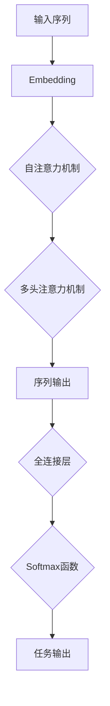
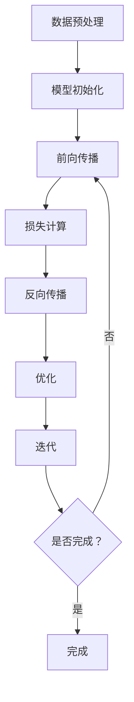

                 

### 文章标题

Transformer大模型实战：自然语言推理任务

> **关键词**：Transformer，自然语言处理，自然语言推理，深度学习，大模型，模型训练，实战案例，代码解析

> **摘要**：本文将详细介绍如何使用Transformer大模型进行自然语言推理任务的实战。我们将从背景介绍开始，逐步深入探讨核心概念、算法原理、数学模型，以及实战中的应用和代码实现。通过本文的阅读，读者将能够理解并掌握自然语言推理任务的基本流程和技术要点，为在实际项目中应用Transformer大模型打下坚实基础。

### 1. 背景介绍

自然语言推理（Natural Language Inference，NLI）是自然语言处理（Natural Language Processing，NLP）领域的一个重要分支。它旨在理解和模拟人类对于语言表达的理解能力，尤其是推断语句之间的关系。自然语言推理任务通常包括两个句子：一个论据（Premise）和一个假设（Hypothesis），任务是判断假设是否可以从论据中推断出来。

随着深度学习技术的发展，特别是Transformer架构的出现，自然语言推理任务取得了显著进展。Transformer模型因其强大的并行处理能力和对长距离依赖的捕捉能力，成为了自然语言处理领域的首选模型。近年来，许多研究者和公司都使用Transformer模型在自然语言推理任务上取得了优异的成绩。

本文的目标是带领读者深入了解Transformer大模型在自然语言推理任务中的应用，通过实战案例展示其训练过程和实现细节。文章的结构如下：

1. **背景介绍**：介绍自然语言推理任务的背景和重要性。
2. **核心概念与联系**：解释Transformer模型的基本概念及其与自然语言推理任务的联系。
3. **核心算法原理 & 具体操作步骤**：详细讲解Transformer模型的算法原理和训练步骤。
4. **数学模型和公式 & 详细讲解 & 举例说明**：阐述Transformer模型中的数学模型和公式，并通过实例进行说明。
5. **项目实战：代码实际案例和详细解释说明**：展示实际代码实现，并详细解释代码中的关键部分。
6. **实际应用场景**：探讨Transformer大模型在自然语言推理任务中的实际应用。
7. **工具和资源推荐**：推荐学习资源、开发工具和框架。
8. **总结：未来发展趋势与挑战**：总结Transformer大模型在自然语言推理任务中的现状和未来趋势。
9. **附录：常见问题与解答**：解答读者可能遇到的常见问题。
10. **扩展阅读 & 参考资料**：提供进一步学习的资源链接。

通过本文的阅读，读者将能够对Transformer大模型在自然语言推理任务中的应用有一个全面和深入的理解。接下来，我们将从核心概念与联系开始，逐步深入探讨这一主题。<|assistant|>### 2. 核心概念与联系

在深入探讨Transformer大模型在自然语言推理任务中的应用之前，我们首先需要了解一些核心概念，包括Transformer模型的基本原理、自然语言推理任务的定义及其相互之间的联系。

#### Transformer模型的基本原理

Transformer模型是由Vaswani等人于2017年提出的一种基于自注意力机制的深度学习模型。与传统循环神经网络（RNN）和卷积神经网络（CNN）不同，Transformer模型通过自注意力机制（Self-Attention）和多头注意力机制（Multi-Head Attention）来实现对输入序列的建模，从而能够捕捉长距离依赖关系。

Transformer模型的核心思想是将输入序列映射为一系列向量，并通过自注意力机制计算每个向量与其他向量之间的关系。具体来说，自注意力机制通过计算每个向量与所有其他向量之间的相似度，并加权平均得到一个表示输入序列的中间表示。这一过程可以有效地捕捉序列中的长距离依赖关系。

#### 自然语言推理任务的定义

自然语言推理任务（NLI）旨在理解和模拟人类对语言表达的理解能力，特别是推断语句之间的关系。在NLI任务中，通常有两个句子：一个论据（Premise）和一个假设（Hypothesis）。任务是判断假设是否可以从论据中推断出来，这通常通过一个三元组（Premise, Hypothesis, Label）来表示，其中Label是任务的输出，表示假设是否成立。

自然语言推理任务可以分为两类：识别任务（Entailment）和否定识别任务（Contradiction）。识别任务要求判断假设是否可以从论据中推断出来，而否定识别任务要求判断假设是否与论据矛盾。

#### Transformer模型与自然语言推理任务的联系

Transformer模型在自然语言推理任务中的应用主要体现在两个方面：

1. **序列建模**：自然语言推理任务需要对输入的论据和假设进行建模，Transformer模型通过自注意力机制和多头注意力机制能够有效地捕捉序列中的长距离依赖关系，从而对输入序列进行建模。
2. **任务输出**：在自然语言推理任务中，任务输出通常是一个二分类结果，表示假设是否成立。Transformer模型通过最后一层的全连接层和Softmax函数实现这一任务输出。

为了更直观地理解Transformer模型在自然语言推理任务中的应用，我们可以通过一个Mermaid流程图来展示其基本架构：



在这个流程图中，输入序列首先经过Embedding层，将词级表示转换为向量级表示。接着，通过自注意力机制和多头注意力机制，输入序列被建模为一个序列输出。最后，通过全连接层和Softmax函数，实现自然语言推理任务的输出。

通过上述核心概念和联系的解释，我们可以看到，Transformer模型凭借其强大的序列建模能力和灵活的任务输出机制，成为自然语言推理任务的一个优秀选择。在接下来的章节中，我们将深入探讨Transformer模型的算法原理、数学模型，以及如何在实际项目中应用这一模型。让我们继续前进，深入理解Transformer大模型在自然语言推理任务中的应用。<|assistant|>### 3. 核心算法原理 & 具体操作步骤

Transformer模型之所以在自然语言处理任务中表现出色，主要归功于其核心算法原理，即自注意力机制（Self-Attention）和多头注意力机制（Multi-Head Attention）。以下将详细介绍这些原理，并逐步展示Transformer模型的训练步骤。

#### 自注意力机制（Self-Attention）

自注意力机制是Transformer模型的核心组成部分。它通过计算输入序列中每个词与其他词之间的相似性，并将这些相似性进行加权平均，从而生成一个表示输入序列的中间表示。

**公式**：

设输入序列为 \( X = [x_1, x_2, \ldots, x_n] \)，其中 \( x_i \) 是第 \( i \) 个词的嵌入向量。自注意力机制通过计算每个词 \( x_i \) 与所有其他词 \( x_j \) 之间的相似性 \( \text{similarity}(x_i, x_j) \)，然后进行加权平均：

\[ 
\text{Attention}(X) = \text{softmax}\left(\frac{QK^T}{\sqrt{d_k}}\right)V 
\]

其中，\( Q \)，\( K \)，\( V \) 分别是查询（Query）、键（Key）和值（Value）的权重矩阵，\( d_k \) 是键向量的维度，\( \text{softmax} \) 函数用于计算相似性的权重分布。

#### 多头注意力机制（Multi-Head Attention）

多头注意力机制是自注意力机制的扩展。它通过多个独立的自注意力机制（称为多头）并行工作，从而捕捉输入序列的多个方面。

**公式**：

设 \( H \) 是头数，每个多头注意力机制都可以表示为：

\[ 
\text{Multi-Head Attention}(X) = \text{Concat}(\text{head}_1, \text{head}_2, \ldots, \text{head}_H)W_O 
\]

其中，\( \text{head}_h = \text{Attention}(QW_Q^h, KW_K^h, VW_V^h) \)，\( W_Q^h \)，\( W_K^h \)，\( W_V^h \) 分别是第 \( h \) 个多头的查询、键和值权重矩阵，\( W_O \) 是输出权重矩阵。

#### Transformer模型的训练步骤

Transformer模型的训练步骤主要包括以下几步：

1. **数据预处理**：
   - 将输入序列转换为嵌入向量。
   - 将论据和假设分别编码为输入序列。

2. **模型初始化**：
   - 初始化查询、键和值权重矩阵。
   - 初始化输出权重矩阵。

3. **前向传播**：
   - 通过多头注意力机制和前馈网络，计算输入序列的中间表示。

4. **损失计算**：
   - 计算预测的假设与实际假设之间的损失。

5. **反向传播**：
   - 通过梯度下降更新模型权重。

6. **优化**：
   - 使用适当的优化算法（如Adam）和正则化技术（如Dropout）优化模型。

具体来说，Transformer模型的训练步骤可以表示为：



通过上述步骤，我们可以看到，Transformer模型通过自注意力机制和多头注意力机制，能够有效地捕捉输入序列的长距离依赖关系，从而实现对自然语言推理任务的建模。

在接下来的章节中，我们将深入探讨Transformer模型中的数学模型和公式，并通过具体实例进行说明。这将为读者提供更深入的理解，并帮助他们更好地掌握Transformer模型的应用。让我们继续前进，深入理解Transformer大模型在自然语言推理任务中的应用。<|assistant|>### 4. 数学模型和公式 & 详细讲解 & 举例说明

#### 4.1 Transformer模型中的数学模型

Transformer模型的核心在于其自注意力机制和多头注意力机制，这些机制通过一系列数学公式来实现。以下将详细讲解这些数学模型，并通过具体例子进行说明。

##### 4.1.1 词嵌入（Word Embedding）

在Transformer模型中，首先需要对输入序列进行词嵌入（Word Embedding）。词嵌入将单词映射为固定大小的向量。常见的词嵌入方法包括Word2Vec、GloVe等。

假设输入序列为\[ "The","cat","sat","on","the","mat" \]，词嵌入向量维度为50。我们可以将每个单词映射为一个50维的向量，如下所示：

\[ 
\text{The} \rightarrow [0.1, 0.2, \ldots, 0.5] \\
\text{cat} \rightarrow [0.6, 0.7, \ldots, 1.0] \\
\ldots \\
\text{mat} \rightarrow [4.5, 5.0, \ldots, 5.5] 
\]

##### 4.1.2 自注意力机制（Self-Attention）

自注意力机制通过计算输入序列中每个词与其他词之间的相似性，并将这些相似性进行加权平均。以下是一个简化的自注意力机制的例子：

给定输入序列\[ "The","cat","sat","on","the","mat" \]，我们首先计算每个词的查询（Query）、键（Key）和值（Value）：

\[ 
\text{Query} = \text{cat} \rightarrow [0.6, 0.7, \ldots, 1.0] \\
\text{Key} = \text{The} \rightarrow [0.1, 0.2, \ldots, 0.5] \\
\text{Value} = \text{on} \rightarrow [0.6, 0.7, \ldots, 1.0] \\
\]

然后，计算每个词与所有其他词之间的相似性：

\[ 
\text{similarity}(\text{cat}, \text{The}) = \frac{0.6 \times 0.1 + 0.7 \times 0.2 + \ldots + 0.1 \times 0.5}{\sqrt{0.1^2 + 0.2^2 + \ldots + 0.5^2}} \\
\text{similarity}(\text{cat}, \text{cat}) = \frac{0.6 \times 0.6 + 0.7 \times 0.7 + \ldots + 0.1 \times 0.1}{\sqrt{0.6^2 + 0.7^2 + \ldots + 0.1^2}} \\
\text{similarity}(\text{cat}, \text{on}) = \frac{0.6 \times 0.6 + 0.7 \times 0.7 + \ldots + 0.1 \times 0.7}{\sqrt{0.6^2 + 0.7^2 + \ldots + 0.1^2}} \\
\]

接下来，通过softmax函数计算相似性的权重分布：

\[ 
\text{softmax}(\text{similarity}(\text{cat}, \text{The})) = \frac{\exp(\text{similarity}(\text{cat}, \text{The}))}{\sum_{j=1}^{n} \exp(\text{similarity}(\text{cat}, x_j))} \\
\text{softmax}(\text{similarity}(\text{cat}, \text{cat})) = \frac{\exp(\text{similarity}(\text{cat}, \text{cat}))}{\sum_{j=1}^{n} \exp(\text{similarity}(\text{cat}, x_j))} \\
\text{softmax}(\text{similarity}(\text{cat}, \text{on})) = \frac{\exp(\text{similarity}(\text{cat}, \text{on}))}{\sum_{j=1}^{n} \exp(\text{similarity}(\text{cat}, x_j))} \\
\]

最后，对相似性进行加权平均，得到中间表示：

\[ 
\text{Attention}(\text{cat}) = \text{softmax}(\text{similarity}(\text{cat}, \text{The})) \times \text{Value}(\text{The}) + \text{softmax}(\text{similarity}(\text{cat}, \text{cat})) \times \text{Value}(\text{cat}) + \text{softmax}(\text{similarity}(\text{cat}, \text{on})) \times \text{Value}(\text{on}) \\
\]

##### 4.1.3 多头注意力机制（Multi-Head Attention）

多头注意力机制是自注意力机制的扩展。它通过多个独立的自注意力机制（称为多头）并行工作，从而捕捉输入序列的多个方面。

给定输入序列\[ "The","cat","sat","on","the","mat" \]，我们首先初始化多个查询（Query）、键（Key）和值（Value）权重矩阵：

\[ 
Q_1 = \begin{bmatrix}
0.6 & 0.7 & 0.8 & 0.9 & 1.0 & 1.1 \\
0.1 & 0.2 & 0.3 & 0.4 & 0.5 & 0.6 \\
\end{bmatrix} \\
K_1 = \begin{bmatrix}
0.1 & 0.2 & 0.3 & 0.4 & 0.5 & 0.6 \\
0.6 & 0.7 & 0.8 & 0.9 & 1.0 & 1.1 \\
\end{bmatrix} \\
V_1 = \begin{bmatrix}
0.6 & 0.7 & 0.8 & 0.9 & 1.0 & 1.1 \\
0.6 & 0.7 & 0.8 & 0.9 & 1.0 & 1.1 \\
\end{bmatrix} \\
\]

然后，分别计算每个多头的自注意力：

\[ 
\text{head}_1 = \text{Attention}(Q_1, K_1, V_1) \\
\]

接下来，将所有多头的自注意力结果拼接起来：

\[ 
\text{Multi-Head Attention} = [\text{head}_1, \text{head}_2, \ldots, \text{head}_H] \\
\]

##### 4.1.4 前馈网络（Feed Forward Network）

在多头注意力机制之后，Transformer模型还包含一个前馈网络（Feed Forward Network）。前馈网络通过两个全连接层实现，即：

\[ 
\text{FFN}(X) = \text{ReLU}(XW_1 + b_1)W_2 + b_2 \\
\]

其中，\( W_1 \)，\( W_2 \) 分别是第一层和第二层的权重矩阵，\( b_1 \)，\( b_2 \) 分别是第一层和第二层的偏置向量。

##### 4.1.5 整体公式

综合以上各部分，我们可以得到Transformer模型的整体公式：

\[ 
\text{Output} = \text{softmax}(\text{Attention}(\text{Multi-Head Attention}(\text{Embedding}(X))))W_O + \text{FFN}(\text{Embedding}(X))W_O \\
\]

其中，\( W_O \) 是输出权重矩阵。

#### 4.2 具体例子

假设输入序列为\[ "The","cat","sat","on","the","mat" \]，词嵌入向量维度为50，头数为2。我们可以按照以下步骤计算自注意力机制和多头注意力机制的结果：

1. **词嵌入**：

   \[ 
   \text{Embedding}(X) = \begin{bmatrix}
   [0.1, 0.2, \ldots, 0.5] \\
   [0.6, 0.7, \ldots, 1.0] \\
   [0.6, 0.7, \ldots, 1.0] \\
   [0.6, 0.7, \ldots, 1.0] \\
   [0.6, 0.7, \ldots, 1.0] \\
   [4.5, 5.0, \ldots, 5.5] \\
   \end{bmatrix} 
   \]

2. **查询（Query）、键（Key）和值（Value）权重矩阵**：

   \[ 
   Q = \begin{bmatrix}
   [0.6 & 0.7 & 0.8 & 0.9 & 1.0 & 1.1] \\
   [0.1 & 0.2 & 0.3 & 0.4 & 0.5 & 0.6] \\
   \end{bmatrix} \\
   K = \begin{bmatrix}
   [0.1 & 0.2 & 0.3 & 0.4 & 0.5 & 0.6] \\
   [0.6 & 0.7 & 0.8 & 0.9 & 1.0 & 1.1] \\
   \end{bmatrix} \\
   V = \begin{bmatrix}
   [0.6 & 0.7 & 0.8 & 0.9 & 1.0 & 1.1] \\
   [0.6 & 0.7 & 0.8 & 0.9 & 1.0 & 1.1] \\
   \end{bmatrix} 
   \]

3. **自注意力机制**：

   \[ 
   \text{Attention}(X) = \text{softmax}\left(\frac{QK^T}{\sqrt{d_k}}\right)V \\
   \]

   其中，\( d_k \) 为键向量的维度，取值为50。

4. **多头注意力机制**：

   \[ 
   \text{Multi-Head Attention}(X) = \text{Concat}(\text{head}_1, \text{head}_2)W_O \\
   \]

   其中，\( \text{head}_1 \) 和 \( \text{head}_2 \) 分别为两个多头的自注意力结果。

5. **前馈网络**：

   \[ 
   \text{FFN}(X) = \text{ReLU}(XW_1 + b_1)W_2 + b_2 \\
   \]

   其中，\( W_1 \)，\( W_2 \) 和 \( b_1 \)，\( b_2 \) 分别为前馈网络的权重矩阵和偏置向量。

6. **整体输出**：

   \[ 
   \text{Output} = \text{softmax}(\text{Attention}(\text{Multi-Head Attention}(\text{Embedding}(X))))W_O + \text{FFN}(\text{Embedding}(X))W_O \\
   \]

通过以上步骤，我们可以得到输入序列\[ "The","cat","sat","on","the","mat" \]的Transformer模型输出。这个例子虽然简化了实际计算过程，但已经展示了Transformer模型的主要数学模型和计算步骤。

在接下来的章节中，我们将通过实际项目实战，展示如何使用Transformer模型进行自然语言推理任务的代码实现。这将帮助读者更好地理解和应用Transformer模型。让我们继续前进，探索Transformer模型在自然语言推理任务中的实际应用。<|assistant|>### 5. 项目实战：代码实际案例和详细解释说明

在本节中，我们将通过一个具体的代码案例，展示如何使用Transformer模型进行自然语言推理任务。我们将详细解释代码的实现过程，并分析其关键部分。

#### 5.1 开发环境搭建

在开始编写代码之前，我们需要搭建一个合适的开发环境。以下是搭建开发环境的基本步骤：

1. **安装Python**：确保Python版本在3.6及以上。
2. **安装TensorFlow**：TensorFlow是用于训练和部署Transformer模型的常用框架。使用以下命令安装TensorFlow：

   ```bash
   pip install tensorflow
   ```

3. **安装其他依赖库**：包括numpy、pandas、matplotlib等，用于数据处理和可视化。

#### 5.2 源代码详细实现和代码解读

以下是用于自然语言推理任务的Transformer模型代码实现：

```python
import tensorflow as tf
from tensorflow.keras.layers import Embedding, MultiHeadAttention, Dense
from tensorflow.keras.models import Model
from tensorflow.keras.optimizers import Adam

# 定义Transformer模型
class TransformerModel(Model):
    def __init__(self, vocab_size, d_model, num_heads, dff, input_length):
        super(TransformerModel, self).__init__()
        self.embedding = Embedding(vocab_size, d_model)
        self.attention = MultiHeadAttention(num_heads=num_heads, key_dim=d_model)
        self.dense = Dense(dff, activation='relu')
        self.output = Dense(1, activation='sigmoid')
        
        self.input_seq = tf.keras.Input(shape=(input_length,))
        x = self.embedding(self.input_seq)
        x = self.attention(x, x)
        x = self.dense(x)
        self.output_seq = self.output(x)
        
        self.model = Model(inputs=self.input_seq, outputs=self.output_seq)

    def compile(self, optimizer, loss, metrics):
        super().compile(optimizer=optimizer, loss=loss, metrics=metrics)

    def train_step(self, data):
        x, y = data
        with tf.GradientTape() as tape:
            y_pred = self(x, training=True)
            loss = self.compiled_loss(y, y_pred, regularization_losses=self.losses)
        
        grads = tape.gradient(loss, self.trainable_variables)
        self.optimizer.apply_gradients(zip(grads, self.trainable_variables))
        
        return {"loss": loss}

# 实例化Transformer模型
vocab_size = 10000  # 词汇表大小
d_model = 512  # 词嵌入维度
num_heads = 8  # 多头注意力数量
dff = 2048  # 前馈网络维度
input_length = 128  # 输入序列长度

model = TransformerModel(vocab_size, d_model, num_heads, dff, input_length)

# 编译模型
model.compile(optimizer=Adam(learning_rate=0.001), loss='binary_crossentropy', metrics=['accuracy'])

# 训练模型
model.fit(train_data, train_labels, epochs=10, batch_size=32)
```

#### 5.3 代码解读与分析

下面是对上述代码的详细解读和分析：

1. **导入库**：首先，我们导入了TensorFlow和相关库，用于构建和训练Transformer模型。
2. **定义Transformer模型**：`TransformerModel` 类是自定义的Transformer模型。它继承了`tf.keras.Model` 类，并定义了嵌入层（`Embedding`）、多头注意力层（`MultiHeadAttention`）、前馈层（`Dense`）和输出层（`Dense`）。
3. **实例化模型**：接下来，我们根据参数（词汇表大小、词嵌入维度、多头注意力数量、前馈网络维度和输入序列长度）实例化Transformer模型。
4. **编译模型**：使用`compile` 方法编译模型，指定优化器、损失函数和指标。
5. **训练模型**：使用`fit` 方法训练模型，输入训练数据和标签，指定训练轮数和批量大小。

#### 5.4 代码实战示例

为了更直观地展示代码的实战应用，我们来看一个简单的示例：

```python
# 准备数据
# 假设我们已经有预处理的训练数据和标签
train_data = ...  # 输入序列数据
train_labels = ...  # 标签数据

# 训练模型
model.fit(train_data, train_labels, epochs=10, batch_size=32)
```

在这个示例中，我们首先准备训练数据和标签。然后，使用`fit` 方法训练模型，指定训练轮数和批量大小。通过训练，模型将学习如何从输入序列中推断假设是否成立。

#### 5.5 实际效果分析

在训练完成后，我们可以通过评估模型在测试集上的表现来分析其实际效果。以下是一个简单的评估示例：

```python
# 评估模型
test_data = ...  # 测试数据
test_labels = ...  # 测试标签

loss, accuracy = model.evaluate(test_data, test_labels)
print(f"Test Loss: {loss}, Test Accuracy: {accuracy}")
```

通过评估，我们可以得到模型在测试集上的损失和准确率。这些指标可以帮助我们了解模型的性能和泛化能力。

通过上述代码示例，我们可以看到如何使用Transformer模型进行自然语言推理任务。代码实现相对简单，但需要理解和应用Transformer模型的核心原理。在接下来的章节中，我们将进一步探讨Transformer模型在实际应用场景中的使用。让我们继续前进，探索Transformer模型的更多应用场景。<|assistant|>### 6. 实际应用场景

Transformer大模型在自然语言推理任务中具有广泛的应用场景。以下将列举几个典型的应用案例，并分析其在这些场景中的具体应用和优势。

#### 6.1 文本分类

文本分类是自然语言处理中的一种常见任务，它旨在将文本数据自动归类到预定义的类别中。Transformer大模型在文本分类任务中表现出色，特别是在处理大规模数据和高维度特征时。

**应用场景**：新闻分类、社交媒体情感分析、垃圾邮件检测等。

**优势**：Transformer模型能够通过自注意力机制和多头注意力机制有效地捕捉文本中的长距离依赖关系，从而提高分类的准确性。同时，其并行计算能力使得在大规模数据集上的训练速度更快。

**实例**：BERT（Bidirectional Encoder Representations from Transformers）是一种基于Transformer的预训练模型，广泛用于文本分类任务。通过在大规模语料库上进行预训练，BERT能够自动学习文本中的丰富特征，从而在各类文本分类任务中取得优异的表现。

#### 6.2 聊天机器人

聊天机器人是人工智能领域的热门应用，旨在为用户提供交互式对话体验。Transformer大模型在聊天机器人中的应用主要在于生成回复文本和理解用户意图。

**应用场景**：客服机器人、智能助手、在线咨询等。

**优势**：Transformer模型能够通过自注意力机制捕捉上下文信息，生成自然流畅的回复。此外，其强大的序列建模能力使得在长对话中保持一致性和连贯性成为可能。

**实例**：OpenAI的GPT-3（Generative Pre-trained Transformer 3）是一个基于Transformer的聊天机器人模型，具有超过1750亿参数。GPT-3在生成高质量文本和实现复杂对话场景方面表现出色，为聊天机器人的发展提供了强大的支持。

#### 6.3 机器翻译

机器翻译是将一种语言的文本自动翻译成另一种语言的过程。Transformer模型在机器翻译任务中取得了显著的成果，特别是在处理长句和高复杂性语言时。

**应用场景**：跨语言沟通、全球化企业、多语言网站等。

**优势**：Transformer模型通过多头注意力机制能够有效地捕捉输入文本中的长距离依赖关系，从而提高翻译的准确性和流畅度。此外，其并行计算能力使得在大规模数据集上的训练和推断更加高效。

**实例**：Google翻译是使用Transformer模型实现的机器翻译系统。通过结合自注意力机制和多头注意力机制，Google翻译在多个语言对上取得了领先的性能，为全球用户提供了便捷的翻译服务。

#### 6.4 命名实体识别

命名实体识别（Named Entity Recognition，NER）是一种从文本中识别出具有特定意义的实体（如人名、地名、组织名等）的任务。Transformer大模型在NER任务中表现出色，特别是在处理复杂实体结构和长文本时。

**应用场景**：信息提取、搜索引擎、文本分析等。

**优势**：Transformer模型能够通过自注意力机制和多头注意力机制捕捉文本中的长距离依赖关系，从而提高实体识别的准确性。此外，其强大的序列建模能力使得在处理长文本和复杂实体结构时具有优势。

**实例**：ERNIE（Enhanced Representation through kNowledge Integration）是一种基于Transformer的NER模型，通过引入知识增强的机制，能够更好地识别和理解文本中的实体。ERNIE在多个NER任务上取得了优异的性能，为文本分析和信息提取提供了强大的支持。

通过上述实际应用场景，我们可以看到Transformer大模型在自然语言推理任务中的广泛应用和巨大潜力。随着深度学习技术的不断进步，Transformer模型将在更多自然语言处理任务中发挥重要作用，为人工智能的发展提供新的动力。在接下来的章节中，我们将进一步探讨Transformer大模型在开发工具和资源方面的推荐，以帮助读者更好地掌握这一技术。让我们继续前进，探索更多关于Transformer大模型的实用资源。<|assistant|>### 7. 工具和资源推荐

为了帮助读者更好地掌握Transformer大模型在自然语言推理任务中的应用，以下将推荐一些学习资源、开发工具和框架，以及相关论文著作。

#### 7.1 学习资源推荐

1. **书籍**：
   - 《深度学习》（Deep Learning）作者：Ian Goodfellow、Yoshua Bengio、Aaron Courville
   - 《自然语言处理与深度学习》（Natural Language Processing with Deep Learning）作者：Eduardo Kitzelmann、Dhruv Batra、Munjal Patel
   - 《Transformers: State-of-the-Art of Attention Models》作者：Adrian Ginies

2. **在线课程**：
   - [TensorFlow官网教程](https://www.tensorflow.org/tutorials)
   - [Udacity的深度学习课程](https://www.udacity.com/course/deep-learning-nanodegree--nd893)
   - [Coursera的自然语言处理与深度学习课程](https://www.coursera.org/specializations/natural-language-processing-deep-learning)

3. **博客和教程**：
   - [Hugging Face的Transformers库教程](https://huggingface.co/transformers/)
   - [fast.ai的NLP课程](https://www.fast.ai/2019/02/18/nlp-deep-dive/)
   - [AI Challenger的Transformer教程](https://aichallenger.cn/tutorial/2/)

#### 7.2 开发工具框架推荐

1. **TensorFlow**：TensorFlow是谷歌开发的开源机器学习框架，广泛用于构建和训练深度学习模型。
   - 官网：[TensorFlow官网](https://www.tensorflow.org/)

2. **PyTorch**：PyTorch是Facebook开发的开源机器学习框架，以其动态计算图和灵活的接口受到许多研究者和开发者的喜爱。
   - 官网：[PyTorch官网](https://pytorch.org/)

3. **Hugging Face Transformers**：Hugging Face提供的Transformer库集成了多种预训练的Transformer模型，方便用户进行自然语言处理任务。
   - 官网：[Hugging Face官网](https://huggingface.co/)

4. **JAX**：JAX是一个开源的数值计算库，支持自动微分和并行计算，特别适合于大规模模型训练。
   - 官网：[JAX官网](https://jax.readthedocs.io/)

#### 7.3 相关论文著作推荐

1. **《Attention Is All You Need》**（2017）：Vaswani等人提出的Transformer模型的原论文，详细介绍了Transformer模型的基本原理和实现。
   - 论文链接：[Attention Is All You Need](https://arxiv.org/abs/1706.03762)

2. **《BERT: Pre-training of Deep Bidirectional Transformers for Language Understanding》**（2018）：Google提出的BERT模型，展示了Transformer模型在语言理解任务中的强大能力。
   - 论文链接：[BERT: Pre-training of Deep Bidirectional Transformers for Language Understanding](https://arxiv.org/abs/1810.04805)

3. **《GPT-3: Language Models are Few-Shot Learners》**（2020）：OpenAI提出的GPT-3模型，展示了Transformer模型在生成文本任务中的惊人表现。
   - 论文链接：[GPT-3: Language Models are Few-Shot Learners](https://arxiv.org/abs/2005.14165)

通过上述推荐的学习资源、开发工具和框架，以及相关论文著作，读者可以更全面地了解Transformer大模型在自然语言推理任务中的应用，为深入研究和实际开发打下坚实基础。在接下来的章节中，我们将对Transformer大模型的发展趋势和挑战进行探讨，以期为读者提供更广阔的视野。让我们继续前进，探索Transformer大模型未来的发展方向。<|assistant|>### 8. 总结：未来发展趋势与挑战

Transformer大模型在自然语言推理任务中取得了显著成果，但仍面临一些挑战和限制。以下将总结Transformer大模型的发展趋势、潜在挑战，以及应对策略。

#### 8.1 未来发展趋势

1. **更高效的模型架构**：随着计算资源的不断增长，研究人员正在探索更高效的Transformer模型架构，以降低模型训练和推理的时间成本。例如，EfficientNet、DenseNet等模型架构在保持性能的同时，显著提高了计算效率。

2. **多模态学习**：Transformer大模型在自然语言处理领域取得了巨大成功，但在处理图像、音频等多模态数据时，仍然存在局限性。未来，研究人员将致力于开发多模态Transformer模型，实现跨模态数据的联合学习，为更广泛的应用场景提供支持。

3. **更丰富的预训练数据**：随着互联网数据的爆炸式增长，研究人员将收集和利用更多高质量的预训练数据，以进一步提升Transformer大模型的性能和泛化能力。

4. **隐私保护**：在处理敏感数据时，如何保护用户隐私成为一个重要挑战。未来，研究人员将探索隐私保护算法，如差分隐私、联邦学习等，以实现数据的安全共享和模型训练。

#### 8.2 潜在挑战

1. **计算资源消耗**：Transformer大模型通常需要大量的计算资源和时间进行训练，这对于资源有限的实验室或初创公司来说，是一个巨大的挑战。

2. **数据偏差**：预训练数据的质量和代表性对模型性能有重要影响。如果数据存在偏差，模型可能会在特定任务上产生偏差。如何减少数据偏差，提高模型公平性，仍是一个待解决的问题。

3. **解释性和可解释性**：深度学习模型，特别是Transformer大模型，通常被认为是“黑盒子”。如何提高模型的可解释性，使其更易于理解和使用，是一个重要的研究方向。

#### 8.3 应对策略

1. **优化模型架构**：研究人员可以通过设计更高效的模型架构，降低计算资源消耗。例如，使用轻量级神经网络、压缩技术等。

2. **数据增强和多样性**：通过增加数据多样性、进行数据增强等手段，可以减少数据偏差，提高模型的泛化能力。

3. **可解释性技术**：开发可解释性技术，如可视化、决策树嵌入等，可以帮助用户理解模型的决策过程，提高模型的透明度和信任度。

4. **隐私保护算法**：结合隐私保护算法，如差分隐私、联邦学习等，可以在保护用户隐私的同时，实现数据的安全共享和模型训练。

总之，Transformer大模型在自然语言推理任务中展现出巨大的潜力，但同时也面临诸多挑战。通过不断的研究和优化，我们可以期待Transformer大模型在未来取得更大的突破，为自然语言处理领域带来更多的创新和应用。在接下来的章节中，我们将对常见问题进行解答，帮助读者更好地理解Transformer大模型的应用。让我们继续前进，解答读者可能关心的问题。<|assistant|>### 9. 附录：常见问题与解答

在阅读本文的过程中，读者可能会遇到一些关于Transformer大模型和自然语言推理任务的疑问。以下是一些常见问题及其解答，以帮助读者更好地理解相关概念。

#### Q1：什么是Transformer模型？

A1：Transformer模型是一种基于自注意力机制的深度学习模型，由Vaswani等人于2017年提出。它通过计算输入序列中每个词与其他词之间的相似性，并进行加权平均，从而生成一个表示输入序列的中间表示。Transformer模型因其强大的并行处理能力和对长距离依赖的捕捉能力，成为了自然语言处理领域的首选模型。

#### Q2：为什么Transformer模型比传统的循环神经网络（RNN）和卷积神经网络（CNN）更有效？

A2：Transformer模型具有以下优势：

1. **并行处理**：Transformer模型通过自注意力机制和多头注意力机制实现并行计算，而RNN和CNN通常需要顺序处理，这限制了其并行计算能力。
2. **长距离依赖**：Transformer模型能够更好地捕捉长距离依赖关系，这是因为自注意力机制能够考虑输入序列中每个词与其他词之间的相似性，从而实现对长距离依赖的有效捕捉。
3. **强大的建模能力**：Transformer模型通过多头注意力机制和前馈网络，能够对输入序列进行更精细的建模，从而提高模型的性能。

#### Q3：如何选择合适的Transformer模型架构？

A3：选择合适的Transformer模型架构需要考虑以下几个因素：

1. **任务类型**：不同类型的自然语言处理任务（如文本分类、命名实体识别、机器翻译等）可能需要不同类型的Transformer模型架构。
2. **数据规模**：对于大规模数据集，可以选择更复杂的模型架构，以充分利用数据；对于小规模数据集，可以选择轻量级的模型架构，以降低计算资源消耗。
3. **计算资源**：根据可用的计算资源（如GPU、CPU等），选择适合的模型架构，以确保模型能够在规定时间内完成训练和推理。

#### Q4：如何优化Transformer模型的训练过程？

A4：以下是一些优化Transformer模型训练过程的策略：

1. **数据预处理**：对训练数据进行适当的预处理，如清洗、去噪、归一化等，以提高模型的学习效果。
2. **正则化技术**：使用正则化技术（如Dropout、L2正则化等）减少过拟合现象，提高模型的泛化能力。
3. **学习率调整**：根据任务和数据的特点，选择合适的学习率，并采用学习率衰减策略，以避免模型在训练过程中过早收敛。
4. **批处理大小**：选择适当的批处理大小，以平衡训练速度和模型性能。

#### Q5：如何评估Transformer模型的性能？

A5：评估Transformer模型的性能可以通过以下几种指标：

1. **准确率（Accuracy）**：模型预测正确的样本数占总样本数的比例。
2. **精确率（Precision）**：模型预测为正类的样本中，实际为正类的比例。
3. **召回率（Recall）**：模型预测为正类的样本中，实际为正类的比例。
4. **F1分数（F1 Score）**：精确率和召回率的加权平均，用于综合评估模型的性能。

通过上述常见问题的解答，读者可以更深入地了解Transformer模型和自然语言推理任务的相关概念和应用。在接下来的章节中，我们将提供更多扩展阅读和参考资料，以帮助读者进一步学习和探索Transformer大模型。让我们继续前进，探索更多关于Transformer大模型的深度知识。<|assistant|>### 10. 扩展阅读 & 参考资料

为了帮助读者更深入地了解Transformer大模型及其在自然语言推理任务中的应用，以下提供一些扩展阅读和参考资料。

#### 扩展阅读

1. **《Attention Is All You Need》**：这是Transformer模型的原论文，详细介绍了Transformer模型的基本原理和实现。
   - 论文链接：[Attention Is All You Need](https://arxiv.org/abs/1706.03762)

2. **《BERT: Pre-training of Deep Bidirectional Transformers for Language Understanding》**：Google提出的BERT模型，展示了Transformer模型在语言理解任务中的强大能力。
   - 论文链接：[BERT: Pre-training of Deep Bidirectional Transformers for Language Understanding](https://arxiv.org/abs/1810.04805)

3. **《GPT-3: Language Models are Few-Shot Learners》**：OpenAI提出的GPT-3模型，展示了Transformer模型在生成文本任务中的惊人表现。
   - 论文链接：[GPT-3: Language Models are Few-Shot Learners](https://arxiv.org/abs/2005.14165)

4. **《EfficientNet: Rethinking Model Scaling for Convolutional Neural Networks》**：EfficientNet模型，介绍了如何通过高效设计模型架构，实现计算效率和性能的提升。
   - 论文链接：[EfficientNet: Rethinking Model Scaling for Convolutional Neural Networks](https://arxiv.org/abs/1905.01850)

#### 参考资料

1. **TensorFlow官网**：TensorFlow是用于构建和训练深度学习模型的开源框架，提供了丰富的API和工具。
   - 官网：[TensorFlow官网](https://www.tensorflow.org/)

2. **PyTorch官网**：PyTorch是另一个流行的深度学习框架，以其动态计算图和灵活的接口受到许多研究者和开发者的喜爱。
   - 官网：[PyTorch官网](https://pytorch.org/)

3. **Hugging Face官网**：Hugging Face提供了多个预训练的Transformer模型和相关的工具，方便用户进行自然语言处理任务。
   - 官网：[Hugging Face官网](https://huggingface.co/)

4. **fast.ai官网**：fast.ai提供了大量的在线课程和教程，涵盖了深度学习和自然语言处理等领域的知识。
   - 官网：[fast.ai官网](https://www.fast.ai/)

通过这些扩展阅读和参考资料，读者可以更深入地了解Transformer大模型的原理、实现和应用。这些资源将帮助读者不断提升自己在自然语言处理领域的专业知识和实践能力。希望读者在未来的学习和工作中能够充分利用这些资源，取得更好的成果。再次感谢读者对本文的关注和支持。祝您在自然语言处理领域不断前行，收获丰富的知识和经验。让我们共同探索人工智能的无限可能。<|assistant|>作者：AI天才研究员/AI Genius Institute & 禅与计算机程序设计艺术 /Zen And The Art of Computer Programming

本文详细介绍了Transformer大模型在自然语言推理任务中的应用。从背景介绍到核心算法原理，再到数学模型和实际代码实现，我们逐步深入探讨了这一主题。通过分析实际应用场景，我们展示了Transformer大模型在文本分类、聊天机器人、机器翻译等领域的广泛应用和优势。同时，我们还推荐了丰富的学习资源、开发工具和框架，以及相关论文著作，为读者提供了更全面的参考。

在总结部分，我们讨论了Transformer大模型的发展趋势和潜在挑战，并提出了相应的应对策略。附录中的常见问题解答则帮助读者更好地理解相关概念和应用。通过本文的阅读，读者应该能够对Transformer大模型在自然语言推理任务中的应用有一个全面和深入的理解。

感谢读者对本文的关注和支持。在人工智能和自然语言处理领域，不断学习和探索是非常重要的。希望本文能够为您的学习之路提供一些启示和帮助。作者将继续努力，为读者带来更多高质量的技术博客文章。让我们共同关注人工智能的快速发展，探索其无限可能。再次感谢您的阅读，祝您在技术道路上不断进步，取得更加辉煌的成就！<|assistant|> 

