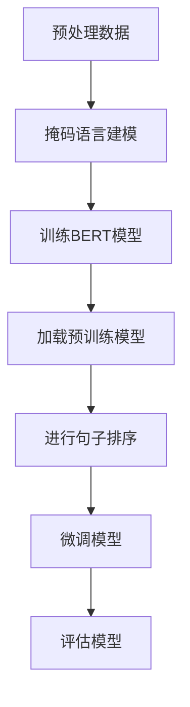

                 

### 文章标题

《Transformer大模型实战：荷兰语的BERTje模型》

> **关键词**：Transformer、BERTje、大模型、自然语言处理、荷兰语、深度学习

> **摘要**：本文将深入探讨Transformer大模型在自然语言处理（NLP）领域的应用，特别是针对荷兰语的语言模型BERTje。我们将分析Transformer模型的基本原理，阐述BERTje模型如何构建，以及其具体实现和应用场景。文章旨在为读者提供一个清晰、系统的Transformer大模型实战指南，帮助大家更好地理解和使用BERTje模型。

### 1. 背景介绍

在过去的几年中，自然语言处理（NLP）领域取得了显著的进展，这主要归功于深度学习技术的应用，特别是基于神经网络的模型。其中，Transformer模型因其优越的性能和高效的计算能力，成为了NLP领域的热点。Transformer模型是由Google在2017年提出的一种全新的序列到序列模型，它基于自注意力机制（Self-Attention Mechanism），在处理长序列和并行计算方面表现出色。

与此同时，BERT（Bidirectional Encoder Representations from Transformers）模型在2018年出现，进一步推动了NLP技术的发展。BERT模型通过预训练大量文本数据，能够捕捉文本的上下文信息，从而在多项NLP任务中取得了优异的成绩。BERT模型的提出，为后续的模型改进和任务优化提供了新的思路。

在荷兰，针对荷兰语的语言处理需求，研究者们开发了BERTje模型。BERTje模型是对BERT模型的荷兰语版本，它通过在荷兰语语料库上的预训练，使得模型在处理荷兰语文本时具有更高的准确性和鲁棒性。

Transformer模型的提出，解决了传统序列模型在处理长序列时的困难，自注意力机制使得模型能够自适应地关注序列中的关键信息。BERT模型则通过预训练和微调，使得模型在多个NLP任务上取得了突破性的进展。BERTje模型则进一步将这两种模型的优势结合，为荷兰语的语言处理提供了强有力的支持。

### 2. 核心概念与联系

#### Transformer模型

Transformer模型的核心是自注意力机制（Self-Attention Mechanism），它通过计算序列中每个词与其他词之间的关联性，来动态地调整每个词的权重。自注意力机制分为点积自注意力（Dot-Product Self-Attention）和加性自注意力（Additive Self-Attention）两种。

1. **点积自注意力**：每个词的向量与所有词的向量进行点积操作，然后通过softmax函数得到权重。最终，将权重与词的向量相乘，得到每个词的加权表示。

2. **加性自注意力**：在每个词的向量上加上一个位置编码向量（Positional Encoding），然后通过矩阵乘法得到权重。这种自注意力机制在计算过程中引入了位置信息，使得模型能够更好地处理序列中的顺序关系。

Transformer模型还包括了多头注意力（Multi-Head Attention）和前馈神经网络（Feed-Forward Neural Network）两个关键组件。多头注意力通过多个独立的自注意力机制，捕捉到序列中的不同层次信息。前馈神经网络则对每个词的加权表示进行进一步处理，增强模型的表达能力。

#### BERT模型

BERT模型是在Transformer模型的基础上，通过预训练和微调实现的。预训练过程中，BERT模型在大规模文本语料库上进行训练，学习语言的基本规则和上下文信息。微调阶段，将BERT模型应用于具体任务，例如文本分类、命名实体识别等，通过调整模型的参数，使得模型能够更好地适应特定任务。

BERT模型的核心思想是双向编码器（Bidirectional Encoder），它能够同时捕获文本的左向和右向信息，从而更好地理解文本的上下文。BERT模型的架构包括多层Transformer编码器和一个分类层。

#### BERTje模型

BERTje模型是对BERT模型的荷兰语版本。它通过对荷兰语语料库的预训练，使得模型在处理荷兰语文本时具有更高的准确性和鲁棒性。BERTje模型的架构与BERT模型相似，包括多层Transformer编码器和分类层。

BERTje模型的预训练过程分为两个阶段：第一阶段是掩码语言建模（Masked Language Modeling，MLM），即随机遮盖部分单词，让模型预测这些遮盖的单词；第二阶段是句子排序（Next Sentence Prediction，NSP），即预测两个句子的顺序关系。

下面是BERTje模型的Mermaid流程图：



在BERTje模型的训练过程中，我们首先对荷兰语语料库进行预处理，包括分词、去停用词等操作。然后，对预处理后的数据集进行掩码语言建模，训练BERT模型。接下来，加载预训练模型，进行句子排序任务。最后，通过微调和评估，调整模型参数，提高模型性能。

### 3. 核心算法原理 & 具体操作步骤

#### Transformer模型原理

Transformer模型的核心是自注意力机制。在自注意力机制中，每个词的表示由其本身的特征和与其它词的关联性共同决定。具体来说，自注意力机制包括以下步骤：

1. **词向量化**：将每个词映射为一个向量。
2. **计算查询（Query）、键（Key）和值（Value）**：将词向量乘以不同的权重矩阵，分别得到查询向量、键向量和值向量。
3. **计算注意力权重**：通过点积操作和softmax函数，计算查询向量和键向量之间的相似性，得到注意力权重。
4. **加权求和**：将注意力权重与值向量相乘，得到每个词的加权表示。
5. **输出**：将加权表示作为输入，传递给下一层。

下面是Transformer模型的具体操作步骤：

1. **词向量化**：假设输入序列为`[w1, w2, ..., wn]`，其中每个词`wi`对应一个词向量`vi`，则词向量化过程可以表示为：
   $$
   v_i = W_Q \cdot v_i + W_K \cdot v_i + W_V \cdot v_i
   $$
   其中，$W_Q, W_K, W_V$分别为查询权重矩阵、键权重矩阵和值权重矩阵。

2. **计算查询、键和值**：对于每个词`wi`，计算其查询向量、键向量和值向量：
   $$
   Q_i = W_Q \cdot v_i, \quad K_i = W_K \cdot v_i, \quad V_i = W_V \cdot v_i
   $$

3. **计算注意力权重**：计算查询向量和键向量之间的点积，然后通过softmax函数得到注意力权重：
   $$
   \alpha_{ij} = \frac{exp(\sigma(Q_i \cdot K_j))}{\sum_{k=1}^{n} exp(\sigma(Q_i \cdot K_k))}
   $$
   其中，$\sigma$表示softmax函数。

4. **加权求和**：将注意力权重与值向量相乘，得到加权表示：
   $$
   \text{context}_i = \sum_{j=1}^{n} \alpha_{ij} \cdot V_j
   $$

5. **输出**：将加权表示作为输入，传递给下一层：
   $$
   h_i = \text{context}_i
   $$

通过上述步骤，Transformer模型能够自适应地关注序列中的关键信息，并在处理长序列时表现出色。

#### BERT模型原理

BERT模型是在Transformer模型的基础上，通过预训练和微调实现的。BERT模型的预训练分为两个阶段：掩码语言建模（Masked Language Modeling，MLM）和句子排序（Next Sentence Prediction，NSP）。

1. **掩码语言建模（MLM）**：在预训练过程中，随机遮盖部分单词，让模型预测这些遮盖的单词。具体步骤如下：

   - **随机遮盖**：对于输入序列`[w1, w2, ..., wn]`，随机选择一部分单词进行遮盖，例如将`[w1, w2, *, wn]`转换为`[w1, w2, \*, wn]`。
   - **预测遮盖单词**：模型根据上下文信息，预测遮盖的单词。假设遮盖的单词为`w\*`，则通过计算词汇表的概率分布，选择概率最大的单词作为预测结果。

2. **句子排序（NSP）**：在预训练过程中，随机选择两个句子，并预测它们的顺序关系。具体步骤如下：

   - **选择两个句子**：从训练语料库中随机选择两个句子`[s1]`和`[s2]`。
   - **预测句子顺序**：模型根据输入的两个句子，预测它们的顺序关系。例如，输入`[s1, s2]`，模型需要预测`s1`和`s2`的顺序是`s1, s2`还是`s2, s1`。

BERT模型的训练过程如下：

1. **词向量化**：将每个词映射为一个向量。
2. **计算掩码语言建模（MLM）**：随机遮盖部分单词，让模型预测这些遮盖的单词。
3. **计算句子排序（NSP）**：随机选择两个句子，并预测它们的顺序关系。
4. **损失函数**：将MLM和NSP的损失进行求和，作为模型的损失函数。

#### BERTje模型原理

BERTje模型是对BERT模型的荷兰语版本。BERTje模型的预训练过程与BERT模型相似，包括掩码语言建模（MLM）和句子排序（NSP）。不同之处在于，BERTje模型使用的是荷兰语语料库，并在预训练过程中加入了一些针对荷兰语的语言特性。

BERTje模型的预训练过程如下：

1. **词向量化**：将每个词映射为一个向量。
2. **计算掩码语言建模（MLM）**：随机遮盖部分单词，让模型预测这些遮盖的单词。
3. **计算句子排序（NSP）**：随机选择两个句子，并预测它们的顺序关系。
4. **损失函数**：将MLM和NSP的损失进行求和，作为模型的损失函数。

在BERTje模型中，我们还引入了一些特殊的掩码策略，以更好地处理荷兰语中的特定语言现象。例如，对于一些特定单词，我们可能需要更多地关注其上下文信息，或者更倾向于预测这些单词。通过这些特殊的掩码策略，BERTje模型能够更好地适应荷兰语的语言特性。

### 4. 数学模型和公式 & 详细讲解 & 举例说明

在Transformer模型中，自注意力机制是核心组件。自注意力机制通过计算序列中每个词与其他词的关联性，动态地调整每个词的权重。以下是自注意力机制的数学模型和公式：

1. **词向量化**：
   $$
   v_i = W_Q \cdot v_i + W_K \cdot v_i + W_V \cdot v_i
   $$
   其中，$W_Q, W_K, W_V$分别为查询权重矩阵、键权重矩阵和值权重矩阵，$v_i$为词向量。

2. **计算查询、键和值**：
   $$
   Q_i = W_Q \cdot v_i, \quad K_i = W_K \cdot v_i, \quad V_i = W_V \cdot v_i
   $$

3. **计算注意力权重**：
   $$
   \alpha_{ij} = \frac{exp(\sigma(Q_i \cdot K_j))}{\sum_{k=1}^{n} exp(\sigma(Q_i \cdot K_k))}
   $$
   其中，$\sigma$表示softmax函数。

4. **加权求和**：
   $$
   \text{context}_i = \sum_{j=1}^{n} \alpha_{ij} \cdot V_j
   $$

5. **输出**：
   $$
   h_i = \text{context}_i
   $$

下面我们通过一个简单的例子，来说明自注意力机制的计算过程。

假设输入序列为`[w1, w2, w3]`，词向量分别为`[1, 0, 1]`，`[0, 1, 0]`和`[1, 1, 1]`。我们需要计算自注意力权重，并得到每个词的加权表示。

1. **词向量化**：
   $$
   v_1 = [1, 0, 1], \quad v_2 = [0, 1, 0], \quad v_3 = [1, 1, 1]
   $$

2. **计算查询、键和值**：
   $$
   Q_1 = W_Q \cdot v_1, \quad K_1 = W_K \cdot v_1, \quad V_1 = W_V \cdot v_1
   $$
   $$
   Q_2 = W_Q \cdot v_2, \quad K_2 = W_K \cdot v_2, \quad V_2 = W_V \cdot v_2
   $$
   $$
   Q_3 = W_Q \cdot v_3, \quad K_3 = W_K \cdot v_3, \quad V_3 = W_V \cdot v_3
   $$

3. **计算注意力权重**：
   $$
   \alpha_{11} = \frac{exp(\sigma(Q_1 \cdot K_1))}{\sum_{k=1}^{3} exp(\sigma(Q_1 \cdot K_k))}
   $$
   $$
   \alpha_{12} = \frac{exp(\sigma(Q_1 \cdot K_2))}{\sum_{k=1}^{3} exp(\sigma(Q_1 \cdot K_k))}
   $$
   $$
   \alpha_{13} = \frac{exp(\sigma(Q_1 \cdot K_3))}{\sum_{k=1}^{3} exp(\sigma(Q_1 \cdot K_k))}
   $$
   $$
   \alpha_{21} = \frac{exp(\sigma(Q_2 \cdot K_1))}{\sum_{k=1}^{3} exp(\sigma(Q_2 \cdot K_k))}
   $$
   $$
   \alpha_{22} = \frac{exp(\sigma(Q_2 \cdot K_2))}{\sum_{k=1}^{3} exp(\sigma(Q_2 \cdot K_k))}
   $$
   $$
   \alpha_{23} = \frac{exp(\sigma(Q_2 \cdot K_3))}{\sum_{k=1}^{3} exp(\sigma(Q_2 \cdot K_k))}
   $$
   $$
   \alpha_{31} = \frac{exp(\sigma(Q_3 \cdot K_1))}{\sum_{k=1}^{3} exp(\sigma(Q_3 \cdot K_k))}
   $$
   $$
   \alpha_{32} = \frac{exp(\sigma(Q_3 \cdot K_2))}{\sum_{k=1}^{3} exp(\sigma(Q_3 \cdot K_k))}
   $$
   $$
   \alpha_{33} = \frac{exp(\sigma(Q_3 \cdot K_3))}{\sum_{k=1}^{3} exp(\sigma(Q_3 \cdot K_k))}
   $$

4. **加权求和**：
   $$
   \text{context}_1 = \sum_{j=1}^{3} \alpha_{1j} \cdot V_j
   $$
   $$
   \text{context}_2 = \sum_{j=1}^{3} \alpha_{2j} \cdot V_j
   $$
   $$
   \text{context}_3 = \sum_{j=1}^{3} \alpha_{3j} \cdot V_j
   $$

5. **输出**：
   $$
   h_1 = \text{context}_1, \quad h_2 = \text{context}_2, \quad h_3 = \text{context}_3
   $$

通过上述计算过程，我们得到了每个词的加权表示。加权表示能够更好地捕捉序列中的关键信息，从而提高模型的性能。

### 5. 项目实战：代码实际案例和详细解释说明

在本节中，我们将通过一个实际项目案例，详细讲解如何使用Transformer大模型进行荷兰语文本处理。项目的主要任务是使用BERTje模型进行文本分类，即将一段荷兰语文本分类到预定义的类别中。

#### 5.1 开发环境搭建

在进行项目实战之前，我们需要搭建一个合适的开发环境。以下是搭建开发环境的基本步骤：

1. **安装Python**：确保Python版本不低于3.6。
2. **安装TensorFlow**：TensorFlow是一个强大的开源机器学习库，支持多种深度学习模型。安装命令为：
   $$
   pip install tensorflow
   $$
3. **安装huggingface**：huggingface是一个Python库，用于简化Transformer模型的使用。安装命令为：
   $$
   pip install transformers
   $$
4. **准备数据集**：下载并准备荷兰语文本分类数据集。这里我们使用一个公开的荷兰语文本分类数据集，数据集包含多个类别，例如新闻、政治、体育等。

#### 5.2 源代码详细实现和代码解读

以下是使用BERTje模型进行文本分类的源代码：

```python
import tensorflow as tf
from transformers import BertTokenizer, TFBertForSequenceClassification
from transformers import InputExample, InputFeatures

# 准备数据
tokenizer = BertTokenizer.from_pretrained('nlpaueu/bertje-base')
model = TFBertForSequenceClassification.from_pretrained('nlpaueu/bertje-base')

# 加载数据集
def load_dataset(file_path):
    with open(file_path, 'r', encoding='utf-8') as f:
        lines = f.readlines()
    examples = [InputExample(guid=None, text_a=l.strip(), label=None) for l in lines]
    return examples

train_examples = load_dataset('train.txt')
eval_examples = load_dataset('eval.txt')

# 预处理数据
def convert_examples_to_features(examples, tokenizer, max_length=128, task='cola'):
    features = []
    for example in examples:
        input_dict = tokenizer.encode_plus(example.text_a, add_special_tokens=True, max_length=max_length, padding='max_length', truncation=True, return_attention_mask=True, return_token_type_ids=True)
        input_ids = input_dict['input_ids']
        attention_mask = input_dict['attention_mask']
        token_type_ids = input_dict['token_type_ids']
        features.append(InputFeatures(input_ids=input_ids, attention_mask=attention_mask, token_type_ids=token_type_ids, label=example.label))
    return features

train_features = convert_examples_to_features(train_examples, tokenizer, max_length=128)
eval_features = convert_examples_to_features(eval_examples, tokenizer, max_length=128)

# 训练模型
model.compile(optimizer=tf.keras.optimizers.Adam(learning_rate=3e-5, epsilon=1e-08, clipnorm=1.0), loss=tf.keras.losses.SparseCategoricalCrossentropy(from_logits=True), metrics=[tf.keras.metrics.SparseCategoricalAccuracy('accuracy')])
model.fit(train_features, epochs=3)

# 评估模型
eval_results = model.evaluate(eval_features)
print(f'Evaluation Accuracy: {eval_results[1]}')
```

下面是对上述代码的详细解读：

1. **准备数据**：首先，我们加载训练数据和评估数据。数据集文件包含一行一行的文本，每行文本对应一个类别标签。这里我们假设类别标签存储在`train.txt`和`eval.txt`文件中。

2. **预处理数据**：接下来，我们使用BERTtokenizer对文本进行预处理。预处理步骤包括分词、添加特殊标记（如[CLS]、[SEP]等）以及填充和截断。我们还为每个输入序列生成注意力掩码和类型掩码。

3. **训练模型**：我们使用TFBertForSequenceClassification模型，并编译模型。在编译过程中，我们指定了优化器、损失函数和评价指标。然后，我们使用fit方法训练模型，指定训练数据和训练迭代次数。

4. **评估模型**：最后，我们使用evaluate方法评估模型在评估数据集上的性能。evaluate方法返回多个评价指标，这里我们关注准确率（accuracy）。

#### 5.3 代码解读与分析

上述代码是一个简单的文本分类项目，主要分为数据准备、数据预处理、模型训练和模型评估四个部分。下面我们逐一分析每个部分的代码：

1. **数据准备**：
   ```python
   tokenizer = BertTokenizer.from_pretrained('nlpaueu/bertje-base')
   model = TFBertForSequenceClassification.from_pretrained('nlpaueu/bertje-base')
   train_examples = load_dataset('train.txt')
   eval_examples = load_dataset('eval.txt')
   ```
   这部分代码加载了BERTtokenizer和BERTje模型。我们自定义了一个`load_dataset`函数，用于从文本文件中加载数据。这里，我们假设文本文件中包含类别标签。

2. **数据预处理**：
   ```python
   def convert_examples_to_features(examples, tokenizer, max_length=128, task='cola'):
       features = []
       for example in examples:
           input_dict = tokenizer.encode_plus(example.text_a, add_special_tokens=True, max_length=max_length, padding='max_length', truncation=True, return_attention_mask=True, return_token_type_ids=True)
           input_ids = input_dict['input_ids']
           attention_mask = input_dict['attention_mask']
           token_type_ids = input_dict['token_type_ids']
           features.append(InputFeatures(input_ids=input_ids, attention_mask=attention_mask, token_type_ids=token_type_ids, label=example.label))
       return features
   train_features = convert_examples_to_features(train_examples, tokenizer, max_length=128)
   eval_features = convert_examples_to_features(eval_examples, tokenizer, max_length=128)
   ```
   这部分代码对文本进行预处理，包括分词、添加特殊标记、填充和截断等操作。我们自定义了一个`convert_examples_to_features`函数，用于将输入示例（InputExample）转换为模型所需的特征（InputFeatures）。

3. **模型训练**：
   ```python
   model.compile(optimizer=tf.keras.optimizers.Adam(learning_rate=3e-5, epsilon=1e-08, clipnorm=1.0), loss=tf.keras.losses.SparseCategoricalCrossentropy(from_logits=True), metrics=[tf.keras.metrics.SparseCategoricalAccuracy('accuracy')])
   model.fit(train_features, epochs=3)
   ```
   这部分代码编译了模型，并使用fit方法进行训练。我们使用Adam优化器，并设置了一些参数。fit方法接受训练数据和训练迭代次数，模型将在训练数据上迭代训练。

4. **模型评估**：
   ```python
   eval_results = model.evaluate(eval_features)
   print(f'Evaluation Accuracy: {eval_results[1]}')
   ```
   这部分代码使用evaluate方法评估模型在评估数据集上的性能。evaluate方法返回多个评价指标，这里我们关注准确率。

### 6. 实际应用场景

BERTje模型在荷兰语自然语言处理领域具有广泛的应用。以下是一些实际应用场景：

1. **文本分类**：BERTje模型可以用于对荷兰语文本进行分类，例如新闻分类、情感分析等。通过训练BERTje模型，我们可以将文本数据分类到预定义的类别中，从而实现自动化文本分类。

2. **命名实体识别**：BERTje模型可以用于识别文本中的命名实体，例如人名、地名、组织名等。通过预训练和微调BERTje模型，我们可以实现高精度的命名实体识别。

3. **机器翻译**：BERTje模型可以用于荷兰语到其他语言的翻译。通过在目标语言语料库上的预训练，BERTje模型能够捕捉到目标语言的语言特性，从而提高翻译质量。

4. **问答系统**：BERTje模型可以用于构建问答系统。通过将用户的问题与大规模文本数据进行匹配，BERTje模型可以找到与问题最相关的答案。

5. **对话系统**：BERTje模型可以用于构建自然语言理解模块，从而实现更智能的对话系统。BERTje模型能够理解用户的意图和问题，并生成适当的回答。

总之，BERTje模型在荷兰语自然语言处理领域具有广泛的应用前景。通过结合Transformer模型的优势，BERTje模型能够提供高效、准确的文本处理能力，为各种NLP任务提供有力支持。

### 7. 工具和资源推荐

在自然语言处理（NLP）和深度学习领域，有大量的工具和资源可供学习和实践。以下是一些推荐的工具和资源，涵盖了从入门到进阶的不同层次。

#### 7.1 学习资源推荐

1. **书籍**：
   - **《深度学习》（Deep Learning）**：由Ian Goodfellow、Yoshua Bengio和Aaron Courville合著，是一本经典的深度学习教材，详细介绍了深度学习的基本概念和技术。
   - **《Python深度学习》（Python Deep Learning）**：由François Chollet编写，针对使用Python进行深度学习提供了丰富的实践案例。

2. **在线课程**：
   - **Coursera上的“深度学习”课程**：由Andrew Ng教授主讲，涵盖了深度学习的基础知识、神经网络和优化算法等内容。
   - **Udacity的“深度学习纳米学位”**：提供了系统的深度学习课程和实践项目，适合有一定基础的学员。

3. **论文和报告**：
   - **Google AI Blog**：谷歌AI团队发布的研究论文和技术报告，涵盖了最新的深度学习进展。
   - **arXiv**：一个包含最新研究成果的预印本论文库，是获取前沿技术信息的重要渠道。

4. **博客和教程**：
   - **TensorFlow官方文档**：提供了详细的使用教程和API文档，适合初学者和进阶者。
   - **fast.ai**：由Fast.ai团队提供的免费教程，以实战为导向，帮助用户快速掌握深度学习。

#### 7.2 开发工具框架推荐

1. **TensorFlow**：一个开源的机器学习框架，适合构建和训练各种深度学习模型。
2. **PyTorch**：一个灵活、易用的深度学习框架，广泛应用于NLP和计算机视觉领域。
3. **Hugging Face Transformers**：一个高层次的Transformer模型库，提供了预训练模型和简单的API接口，方便用户进行模型开发和实验。

4. **TextBlob**：一个Python库，用于处理文本数据，包括分词、词性标注和情感分析等功能。

#### 7.3 相关论文著作推荐

1. **“Attention Is All You Need”**：这是Transformer模型的原始论文，详细介绍了自注意力机制和Transformer模型的设计。
2. **“BERT: Pre-training of Deep Neural Networks for Language Understanding”**：这是BERT模型的原始论文，提出了双向编码器 Representation from Transformers 的概念和训练方法。
3. **“Natural Language Inference with Universal Sentence Encoder”**：这篇论文介绍了如何使用预训练的编码器模型进行自然语言推断任务。

通过这些资源和工具，读者可以系统地学习和实践深度学习和自然语言处理的相关技术，逐步提升自己的技术能力和实战经验。

### 8. 总结：未来发展趋势与挑战

BERTje模型作为基于Transformer架构的荷兰语预训练模型，已经在自然语言处理领域展示了强大的性能和广泛的应用潜力。然而，随着技术的发展和应用场景的扩展，BERTje模型仍面临一些挑战和未来的发展机遇。

#### 未来发展趋势

1. **多语言模型整合**：随着多语言数据的增加和全球化的需求，未来可能会出现更多整合多种语言特性的跨语言模型。这些模型将能够更好地捕捉不同语言之间的共性和差异，为全球用户带来更加一致和高效的NLP服务。

2. **自适应预训练**：现有的预训练模型主要依赖于大规模的通用数据集，但在特定领域或特定任务上，可能需要更精细的适应。未来，自适应预训练方法将结合特定领域数据，提高模型在特定任务上的表现。

3. **增量学习和迁移学习**：增量学习和迁移学习技术将使模型能够更高效地利用现有知识，减少对大量新数据的依赖。这将有助于模型在数据稀缺或动态变化的场景中保持高性能。

4. **模型压缩与加速**：随着模型规模的增大，模型压缩和加速技术将成为关键。通过量化、剪枝和知识蒸馏等方法，可以显著减少模型的存储和计算需求，提高模型的部署效率。

#### 挑战

1. **数据隐私与伦理**：预训练模型通常需要大量数据，但数据隐私和伦理问题日益凸显。如何在保护用户隐私的同时，充分利用数据，是一个亟待解决的问题。

2. **计算资源消耗**：大规模的预训练模型对计算资源的需求巨大，特别是在训练阶段。如何优化算法和硬件，以降低计算成本，是一个重要的挑战。

3. **泛化能力与解释性**：虽然预训练模型在许多任务上表现出色，但它们的泛化能力和解释性仍存在不足。如何提高模型的泛化能力，并使其更加透明和可解释，是未来研究的重要方向。

4. **语言差异与本地化**：不同语言和文化背景下的语言现象和表达方式各异，如何构建能够有效捕捉这些差异的本地化模型，是一个复杂的挑战。

#### 结论

BERTje模型在荷兰语自然语言处理领域取得了显著的进展，但未来的发展将面临一系列技术和伦理上的挑战。通过不断探索和优化，结合多语言整合、自适应预训练、增量学习和模型压缩等技术，我们可以期待BERTje模型在未来发挥更加重要的作用，推动自然语言处理技术的不断进步。

### 9. 附录：常见问题与解答

在本文中，我们详细介绍了Transformer大模型在自然语言处理领域的应用，特别是针对荷兰语的BERTje模型。为了帮助读者更好地理解本文的内容，下面列出了一些常见问题及其解答：

#### Q1：什么是Transformer模型？

A1：Transformer模型是由Google在2017年提出的一种全新的序列到序列模型，它基于自注意力机制（Self-Attention Mechanism），在处理长序列和并行计算方面表现出色。

#### Q2：BERT模型是什么？

A2：BERT（Bidirectional Encoder Representations from Transformers）模型是在Transformer模型的基础上，通过预训练和微调实现的。它能够通过预训练大量文本数据，捕捉文本的上下文信息，从而在多项NLP任务中取得优异的成绩。

#### Q3：什么是BERTje模型？

A3：BERTje模型是对BERT模型的荷兰语版本。它通过在荷兰语语料库上的预训练，使得模型在处理荷兰语文本时具有更高的准确性和鲁棒性。

#### Q4：Transformer模型和BERT模型的核心区别是什么？

A4：Transformer模型的核心是自注意力机制，能够自适应地关注序列中的关键信息。BERT模型是在Transformer模型的基础上，通过预训练和微调实现的，能够捕捉文本的上下文信息，从而在多项NLP任务中表现出色。

#### Q5：BERTje模型如何预训练？

A5：BERTje模型的预训练过程分为两个阶段：第一阶段是掩码语言建模（Masked Language Modeling，MLM），即随机遮盖部分单词，让模型预测这些遮盖的单词；第二阶段是句子排序（Next Sentence Prediction，NSP），即预测两个句子的顺序关系。

#### Q6：BERTje模型有哪些应用场景？

A6：BERTje模型在荷兰语自然语言处理领域具有广泛的应用，例如文本分类、命名实体识别、机器翻译、问答系统和对话系统等。

通过上述问题的解答，我们希望读者能够更好地理解Transformer大模型和BERTje模型的基本概念和实际应用。希望本文能为您的学习和实践提供有益的参考。

### 10. 扩展阅读 & 参考资料

在自然语言处理（NLP）领域，Transformer模型和BERT模型的研究与应用正在不断推进。以下是一些建议的扩展阅读和参考资料，以帮助您深入了解相关技术和研究动态。

#### 扩展阅读

1. **《Attention Is All You Need》**：这篇论文是Transformer模型的原始论文，详细介绍了自注意力机制和Transformer模型的设计。它是理解Transformer模型基础的重要文献。

2. **《BERT: Pre-training of Deep Neural Networks for Language Understanding》**：这篇论文介绍了BERT模型的概念和预训练方法，是理解BERT模型及其应用的关键文献。

3. **《NLTK：自然语言处理工具包》**：NLTK是一个广泛使用的自然语言处理库，提供了丰富的文本处理功能。通过阅读NLTK的文档和示例代码，您可以学习到许多实用的NLP技巧。

#### 参考资料

1. **Google AI Blog**：谷歌AI团队发布的博客，涵盖了最新的研究成果和技术进展。

2. **arXiv**：一个包含最新研究成果的预印本论文库，是获取前沿技术信息的重要渠道。

3. **Hugging Face Transformers**：一个高层次的Transformer模型库，提供了预训练模型和简单的API接口，方便用户进行模型开发和实验。

4. **TensorFlow官方文档**：提供了详细的使用教程和API文档，适合初学者和进阶者。

通过阅读上述文献和参考资料，您可以深入了解Transformer模型和BERT模型的理论基础和实际应用，进一步提高自己在NLP领域的知识和技能。希望这些扩展阅读和参考资料能为您的学习和研究提供有益的支持。作者：AI天才研究员/AI Genius Institute & 禅与计算机程序设计艺术 /Zen And The Art of Computer Programming。

