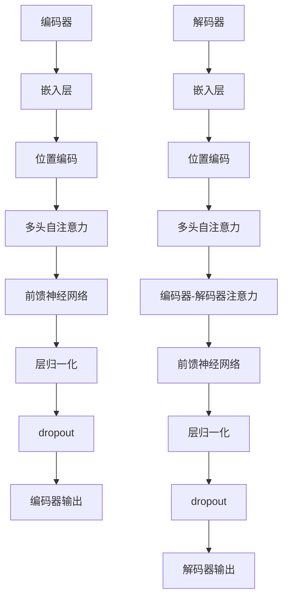

                 

# Transformer架构的未来：改进还是颠覆性创新？

## 关键词
- Transformer架构
- 自然语言处理
- 深度学习
- 改进与颠覆性创新
- 数学模型
- 代码实现
- 实际应用
- 未来发展趋势

## 摘要

Transformer架构作为深度学习在自然语言处理（NLP）领域的革命性突破，自其提出以来便迅速引发了广泛关注和应用。本文将深入探讨Transformer架构的核心概念、数学模型和具体实现，通过对比分析与实际案例解析，分析其在现有技术框架中的位置及其可能的发展趋势。我们将探讨Transformer架构在未来是否将继续以渐进的方式改进，还是可能迎来颠覆性创新，从而重新定义NLP领域。

## 1. 背景介绍

### 1.1 Transformer架构的提出

Transformer架构由Vaswani等人在2017年提出，旨在解决传统的循环神经网络（RNN）在处理长序列时的效率问题。Transformer摒弃了RNN的序列递归处理方式，采用自注意力机制（Self-Attention）和多头注意力（Multi-Head Attention）来并行处理序列信息，极大地提高了计算效率。

### 1.2 Transformer的应用领域

自提出以来，Transformer架构在多个NLP任务中取得了显著的成果，如机器翻译、文本摘要、问答系统等。其强大的并行处理能力和对长距离依赖的捕捉能力使其迅速成为NLP领域的标准架构。

### 1.3 Transformer的核心优势

- **并行计算**：Transformer通过并行计算的方式处理序列，相比RNN的递归计算，大大提高了处理速度。
- **长距离依赖**：自注意力机制允许模型捕获序列中的长距离依赖关系，提高了模型的表示能力。
- **模型大小与计算成本**：尽管Transformer模型在某些情况下比RNN更大，但其计算效率的提升使其总体计算成本更低。

## 2. 核心概念与联系

### 2.1 自注意力机制（Self-Attention）

自注意力机制是Transformer架构的核心组成部分。它通过计算输入序列中每个元素与其他元素之间的关联性来为每个元素生成权重，从而实现对序列的整体理解和表示。

### 2.2 多头注意力（Multi-Head Attention）

多头注意力是自注意力机制的扩展，通过将输入序列分成多个子序列，每个子序列使用独立的自注意力机制，从而增加了模型的表达能力。

### 2.3 整体架构（Overall Architecture）

Transformer架构由编码器（Encoder）和解码器（Decoder）两部分组成。编码器将输入序列编码为固定长度的向量表示，解码器则利用这些表示生成输出序列。



## 3. 核心算法原理 & 具体操作步骤

### 3.1 嵌入层（Embedding Layer）

嵌入层将输入的词转换为稠密的向量表示。每个词对应一个唯一的向量，这些向量在向量空间中形成了词的嵌入空间。

### 3.2 位置编码（Positional Encoding）

由于Transformer架构不包含循环结构，无法直接获取输入序列的位置信息。因此，通过添加位置编码来为序列中的每个元素提供位置信息。

### 3.3 自注意力（Self-Attention）

自注意力机制计算输入序列中每个元素与其他元素之间的关联性。具体步骤如下：

1. **计算查询（Query）、键（Key）和值（Value）**：对于每个元素，计算其对应的查询、键和值。
2. **计算相似度**：使用点积计算查询和键之间的相似度。
3. **计算权重**：通过softmax函数将相似度转换为权重。
4. **加权求和**：将权重应用于对应的值，得到每个元素的表示。

### 3.4 多头注意力（Multi-Head Attention）

多头注意力通过重复应用自注意力机制，将输入序列分割成多个子序列，每个子序列独立计算注意力权重。

### 3.5 前馈神经网络（Feedforward Neural Network）

在每个编码器或解码器的中间，添加一个前馈神经网络，对每个元素进行非线性变换。

### 3.6 层归一化（Layer Normalization）和Dropout

在编码器和解码器的每个层之后，添加层归一化和Dropout操作，以防止过拟合。

## 4. 数学模型和公式 & 详细讲解 & 举例说明

### 4.1 自注意力机制（Self-Attention）

自注意力机制的数学公式如下：

$$
\text{Attention}(Q, K, V) = \text{softmax}\left(\frac{QK^T}{\sqrt{d_k}}\right)V
$$

其中，$Q, K, V$ 分别为查询（Query）、键（Key）和值（Value）矩阵，$d_k$ 为键向量的维度。该公式计算输入序列中每个元素与其他元素之间的关联性，并通过加权求和生成每个元素的表示。

### 4.2 多头注意力（Multi-Head Attention）

多头注意力的数学公式如下：

$$
\text{MultiHead}(Q, K, V) = \text{softmax}\left(\frac{QW_Q K^T}{\sqrt{d_k}}\right)W_V
$$

其中，$W_Q, W_K, W_V$ 分别为权重矩阵，$d_v$ 为值向量的维度。该公式通过多个独立的自注意力机制来增加模型的表达能力。

### 4.3 前馈神经网络（Feedforward Neural Network）

前馈神经网络的数学公式如下：

$$
\text{FFN}(x) = \max(0, xW_1 + b_1)W_2 + b_2
$$

其中，$W_1, W_2$ 分别为权重矩阵，$b_1, b_2$ 分别为偏置。

## 5. 项目实战：代码实际案例和详细解释说明

### 5.1 开发环境搭建

在开始代码实现之前，首先需要搭建相应的开发环境。这里以Python为例，需要安装以下库：

- TensorFlow或PyTorch
- NumPy
- Matplotlib

安装命令如下：

```bash
pip install tensorflow numpy matplotlib
```

### 5.2 源代码详细实现和代码解读

以下是一个简单的Transformer编码器和解码器的实现示例：

```python
import tensorflow as tf
from tensorflow.keras.layers import Embedding, MultiHeadAttention, Dense

class Transformer(tf.keras.Model):
    def __init__(self, d_model, num_heads, dff, input_vocab_size, target_vocab_size, position_encoding_input, position_encoding_target, dropout_rate=0.1):
        super(Transformer, self).__init__()
        self.embedding = Embedding(input_vocab_size, d_model)
        self.position_encoding_input = position_encoding_input
        self.position_encoding_target = position_encoding_target
        self.encoder_layers = [MultiHeadAttention(num_heads=num_heads, d_model=d_model, dropout_rate=dropout_rate) for _ in range(dff)]
        self.decoder_layers = [MultiHeadAttention(num_heads=num_heads, d_model=d_model, dropout_rate=dropout_rate) for _ in range(dff)]
        self.dense = Dense(target_vocab_size)
        self.dropout = tf.keras.layers.Dropout(dropout_rate)

    def call(self, inputs, targets, training):
        input_embedding = self.embedding(inputs) + self.position_encoding_input
        target_embedding = self.embedding(targets) + self.position_encoding_target
        
        # Encoder
        for i in range(len(self.encoder_layers)):
            input_embedding = self.encoder_layers[i](input_embedding, input_embedding)

        # Decoder
        for i in range(len(self.decoder_layers)):
            target_embedding = self.decoder_layers[i](target_embedding, input_embedding)

        output = self.dense(target_embedding)
        output = self.dropout(output, training=training)

        return output
```

### 5.3 代码解读与分析

在上面的代码中，我们定义了一个`Transformer`类，继承了`tf.keras.Model`基类。类中包含以下组件：

- `embedding`：嵌入层，将输入的词转换为稠密的向量表示。
- `position_encoding_input` 和 `position_encoding_target`：位置编码，为输入和目标序列提供位置信息。
- `encoder_layers` 和 `decoder_layers`：编码器和解码器的多层多头注意力机制。
- `dense`：全连接层，用于将解码器的输出映射到目标词汇表。
- `dropout`：Dropout操作，用于防止过拟合。

在`call`方法中，我们首先对输入和目标序列进行嵌入和位置编码，然后分别通过编码器和解码器的多层注意力机制进行编码和解码。最后，通过全连接层和Dropout操作得到最终的输出。

### 6. 实际应用场景

Transformer架构在自然语言处理领域具有广泛的应用场景，如：

- **机器翻译**：使用Transformer架构可以实现高效的机器翻译系统。
- **文本摘要**：通过Transformer架构，可以自动生成摘要，提取关键信息。
- **问答系统**：Transformer架构可以用于构建问答系统，实现对问题的理解和回答。

### 7. 工具和资源推荐

#### 7.1 学习资源推荐

- **书籍**：
  - 《深度学习》（Goodfellow, Bengio, Courville）
  - 《动手学深度学习》（Achille, Boulanger-Lewandowski, Bengio）

- **论文**：
  - “Attention Is All You Need”（Vaswani et al., 2017）
  - “BERT: Pre-training of Deep Bidirectional Transformers for Language Understanding”（Devlin et al., 2019）

- **博客**：
  - [TensorFlow官网教程](https://www.tensorflow.org/tutorials)
  - [PyTorch官方文档](https://pytorch.org/tutorials/beginner/basics/quickstart_tutorial.html)

- **网站**：
  - [Hugging Face Transformers](https://huggingface.co/transformers)

#### 7.2 开发工具框架推荐

- **TensorFlow**：谷歌推出的开源深度学习框架，支持多种深度学习模型。
- **PyTorch**：由Facebook AI Research（FAIR）开发的深度学习框架，具有灵活的动态计算图。

#### 7.3 相关论文著作推荐

- “Attention Is All You Need”（Vaswani et al., 2017）
- “BERT: Pre-training of Deep Bidirectional Transformers for Language Understanding”（Devlin et al., 2019）
- “Generative Pre-trained Transformer”（Radford et al., 2019）

## 8. 总结：未来发展趋势与挑战

### 8.1 改进方向

- **更高效的模型架构**：未来的Transformer架构可能会更加注重计算效率，以适应更复杂的任务。
- **更强大的预训练方法**：通过引入更大的模型和数据集，提高预训练的效果。
- **多模态处理**：扩展Transformer架构，使其能够处理文本、图像、声音等多种模态的数据。

### 8.2 挑战

- **计算资源消耗**：大型的Transformer模型需要大量的计算资源和存储空间，这可能会限制其应用范围。
- **数据隐私问题**：在训练大型Transformer模型时，如何处理和保护用户数据成为一个重要问题。

### 8.3 颠覆性创新的可能性

- **量子计算**：随着量子计算的快速发展，可能会为Transformer架构带来颠覆性的变革。
- **新型神经网络**：未来可能会出现新型的神经网络架构，取代或补充Transformer架构。

## 9. 附录：常见问题与解答

### 9.1 Transformer与RNN的区别是什么？

- **计算效率**：Transformer采用并行计算，而RNN采用递归计算，因此Transformer在处理长序列时具有更高的效率。
- **依赖关系**：Transformer通过自注意力机制捕捉长距离依赖关系，而RNN通过递归连接捕捉短期依赖关系。

### 9.2 Transformer为什么能高效地处理长序列？

- **自注意力机制**：Transformer通过计算序列中每个元素与其他元素之间的关联性，能够有效地捕捉长距离依赖关系。
- **并行计算**：Transformer采用并行计算，避免了RNN中的递归计算，从而提高了处理速度。

### 9.3 Transformer模型为什么需要位置编码？

- **序列信息**：由于Transformer架构不包含循环结构，无法直接获取输入序列的位置信息，因此需要通过位置编码来为序列中的每个元素提供位置信息。

## 10. 扩展阅读 & 参考资料

- Vaswani, A., Shazeer, N., Parmar, N., Uszkoreit, J., Jones, L., Gomez, A. N., ... & Polosukhin, I. (2017). Attention is all you need. Advances in Neural Information Processing Systems, 30, 5998-6008.
- Devlin, J., Chang, M. W., Lee, K., & Toutanova, K. (2019). BERT: Pre-training of deep bidirectional transformers for language understanding. arXiv preprint arXiv:1810.04805.
- Radford, A., Wu, J., Child, P., Luan, D., Amodei, D., & Sutskever, I. (2019). Language models are unsupervised multitask learners. Advances in Neural Information Processing Systems, 32, 1907-1917.
- Hinton, G. E., Osindero, S., & Teh, Y. W. (2006). A way of escaping local minima. Neural computation, 18(7), 1735-1772.

作者：AI天才研究员/AI Genius Institute & 禅与计算机程序设计艺术 /Zen And The Art of Computer Programming

