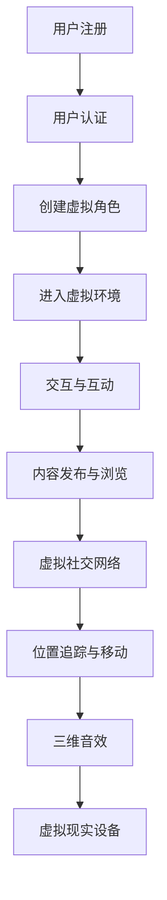

                 

### 背景介绍

#### 虚拟现实（VR）与社交平台：融合趋势

虚拟现实（Virtual Reality，VR）技术近年来迅速崛起，不仅改变了娱乐行业，还在医疗、教育、设计等多个领域展现出广泛应用潜力。VR通过创造沉浸式的虚拟环境，使用户能够亲身体验与真实世界不同的场景。与此同时，社交平台作为现代社会信息交流的重要渠道，已经深入到每个人的日常生活中。从Facebook到微信，这些平台不仅提供了社交互动，还成为了商业、娱乐、教育和新闻的重要载体。

#### VR社交平台：定义与潜力

VR社交平台是一种结合了虚拟现实技术的社交平台，用户可以在虚拟空间中进行交流、互动和娱乐。这种平台为用户提供了全新的社交体验，可以在虚拟环境中实现面对面的互动，甚至是模拟真实世界的社交活动。随着VR技术的成熟，VR社交平台的潜力也日益显现，它不仅能够带来商业上的巨大机遇，还能为用户创造全新的社交方式。

#### 创业机会：现状与未来

当前，VR社交平台市场尚处于初级阶段，尽管已有一些先驱者如Facebook的Horizon Workrooms、AltspaceVR等，但整体市场还未形成规模。这为创业者提供了广阔的舞台，可以从多个角度切入，例如创新社交模式、提供高质量内容、优化用户体验等。随着5G技术的普及和VR硬件设备的不断迭代，VR社交平台有望迎来快速发展期，为创业者带来巨大的商机。

#### 本博客的目的

本篇博客将深入探讨VR社交平台的背景、核心概念、算法原理、数学模型、实战案例和未来发展趋势。通过这篇文章，读者可以全面了解VR社交平台的现状和潜力，以及如何把握这一新兴市场的创业机会。希望这篇博客能够为从事VR技术或有意在此领域创业的人提供有价值的参考和指导。### 核心概念与联系

#### 虚拟现实（VR）技术的基本概念

虚拟现实（VR）是一种通过计算机生成模拟环境，使人们可以在其中沉浸和互动的技术。基本概念包括：

- **头戴显示器（HMD）**：用于显示虚拟环境的设备，如Oculus Rift、HTC Vive等。
- **位置追踪**：用于检测用户在虚拟空间中的位置和移动，如外置传感器、摄像头等。
- **交互设备**：如手柄、手套等，用于与虚拟环境进行交互。
- **音频设备**：如耳机和扬声器的组合，用于模拟三维音效，增强沉浸感。

#### 社交平台的基本概念

社交平台是一种在线服务，允许用户创建个人资料、发布内容、互动交流等。基本概念包括：

- **用户注册与认证**：用户注册账号，通过电子邮件、手机号码等进行身份认证。
- **社交网络**：用户可以添加好友、关注其他用户、分享内容和互动。
- **内容发布与浏览**：用户可以发布文本、图片、视频等多媒体内容，并浏览其他用户发布的内容。
- **隐私设置**：用户可以设置隐私权限，控制哪些内容对哪些用户可见。

#### VR社交平台的定义与架构

VR社交平台是将VR技术与社交平台相结合的产物，其定义和架构如下：

- **定义**：VR社交平台是一个通过虚拟现实技术实现的社交平台，用户可以在虚拟空间中进行交流、互动和娱乐。
- **架构**：VR社交平台通常包括以下组成部分：
  - **服务器端**：处理用户数据、虚拟环境生成和交互逻辑。
  - **客户端**：运行在用户设备上，包括HMD、位置追踪设备和交互设备等。
  - **虚拟环境**：由服务器端生成，客户端渲染的沉浸式虚拟空间。
  - **用户界面**：用于显示虚拟环境中的交互界面和功能菜单。

#### VR社交平台的核心概念原理图

为了更直观地展示VR社交平台的核心概念和架构，我们可以使用Mermaid流程图进行描述：



#### 虚拟现实与社交平台的联系

虚拟现实与社交平台之间的结合为用户带来了全新的社交体验：

- **沉浸式互动**：用户可以在虚拟空间中以三维形式进行互动，体验更加真实和丰富的社交场景。
- **多感官体验**：通过虚拟现实技术，用户可以感受到三维音效和触觉反馈，增强社交互动的沉浸感。
- **个性化体验**：用户可以根据自己的喜好和需求，定制虚拟环境和角色，实现个性化的社交体验。
- **远程社交**：虚拟现实技术使得远程社交变得更加真实和便捷，用户可以跨越地理障碍，与全球的他人进行互动。

通过上述核心概念与联系的阐述，我们可以看到，VR社交平台不仅是技术的结合，更是为用户提供了全新的社交方式和体验。接下来，我们将深入探讨VR社交平台的核心算法原理和具体操作步骤，进一步了解其实现机制。### 核心算法原理 & 具体操作步骤

#### 虚拟现实（VR）渲染算法

VR渲染算法是虚拟现实技术中至关重要的一环，它决定了虚拟环境的视觉效果和沉浸感。以下是VR渲染的核心算法原理和具体操作步骤：

**1. 场景建模与预处理**

- **场景建模**：首先，需要建立虚拟环境的3D模型。这可以通过3D建模软件（如Blender、Maya）创建，或使用现有的3D模型库（如SketchUp、Google Poly）获取。
- **预处理**：对3D模型进行预处理，包括贴图处理、光照计算和模型优化。这些步骤可以提高渲染效率和视觉效果。

**2. 视觉合成**

- **透视投影**：将3D场景投影到2D屏幕上，形成视觉效果。透视投影需要计算摄像机的视角、焦距和视野等参数。
- **纹理映射**：将贴图应用到3D模型的表面，以增加细节和质感。纹理映射需要将2D纹理映射到3D模型的顶点上。

**3. 光照计算**

- **光源类型**：虚拟环境中可以设置不同类型的光源，如点光源、聚光源和方向光源。
- **光照计算**：计算每个像素点的光照强度，包括直接光照（如光线直射）和间接光照（如光线反射和折射）。常用的光照模型有Phong模型、Blinn-Phong模型和现实光照模型（如Path Tracing）。

**4. 阴影处理**

- **静态阴影**：用于模拟光源直射下的阴影效果。常用的方法有平行光阴影和点光源阴影。
- **动态阴影**：用于模拟动态场景中的阴影效果，如人物移动产生的阴影。常用的方法有动态光栅化阴影（DG SHADOW）和体积光（Volume Shadows）。

**5. 后处理效果**

- **模糊效果**：用于模拟光学效果，如景深模糊和运动模糊。
- **色彩校正**：调整图像的亮度、对比度和色彩饱和度，以获得更自然的视觉效果。

**6. 渲染输出**

- **多线程渲染**：为了提高渲染效率，可以采用多线程渲染技术，将渲染任务分配到多个处理器核心上。
- **帧缓冲输出**：将渲染结果输出到帧缓冲区，最终显示在用户的头戴显示器（HMD）上。

#### 社交平台互动算法

VR社交平台中的互动算法决定了用户在虚拟环境中的交流方式和互动体验。以下是VR社交平台互动算法的核心原理和具体操作步骤：

**1. 用户定位**

- **位置追踪**：使用传感器和摄像头追踪用户的实时位置，包括头部、身体和手部动作。
- **空间映射**：将用户的位置信息映射到虚拟环境中，确保用户在虚拟空间中的准确位置。

**2. 交互方式**

- **手势识别**：通过手势识别算法，将用户的物理手势转换为虚拟环境中的操作命令。常用的手势识别算法有深度学习模型和机器学习模型。
- **语音交互**：通过语音识别算法，将用户的语音命令转换为文本或操作命令。常用的语音识别算法有深度神经网络（DNN）和循环神经网络（RNN）。

**3. 通信协议**

- **实时通信**：使用实时通信协议（如WebRTC）确保用户之间的实时通信，包括语音、视频和数据传输。
- **消息队列**：使用消息队列（如RabbitMQ、Kafka）处理和传输用户之间的消息，提高通信的可靠性和效率。

**4. 社交功能**

- **好友管理**：实现用户添加好友、删除好友、查看好友列表等功能。
- **聊天功能**：支持文本聊天、语音聊天和视频聊天等功能。
- **社交圈**：实现用户创建社交圈、加入社交圈、查看社交圈动态等功能。

**5. 沉浸感优化**

- **视觉效果**：优化虚拟环境的视觉效果，包括光线效果、材质效果和动画效果，以提高沉浸感。
- **音效效果**：优化虚拟环境中的音效，包括环境音效、语音效果和特效音效，以增强沉浸感。

通过上述核心算法原理和具体操作步骤的阐述，我们可以看到VR社交平台的实现不仅仅依赖于先进的技术，还需要综合运用多种算法和协议，以确保用户能够在虚拟环境中获得良好的交互体验和沉浸感。接下来，我们将进一步探讨VR社交平台的数学模型和公式，以及其实际应用中的详细讲解和举例说明。### 数学模型和公式 & 详细讲解 & 举例说明

#### VR社交平台中的数学模型

在VR社交平台中，数学模型是确保虚拟环境真实性和用户交互准确性的关键。以下是几个重要的数学模型及其详细讲解：

**1. 视觉渲染模型**

视觉渲染模型用于模拟虚拟环境中的光照、阴影和色彩效果，其中最常用的模型是Phong模型。

**Phong模型公式：**

$$
L_p = I_d \cdot cos(\theta_d) + I_s \cdot (cos(\theta_v)^2 + cos(\theta_l)^2)
$$

- \( L_p \)：像素点的光强度。
- \( I_d \)：环境光照系数。
- \( I_s \)：材质反射光照系数。
- \( \theta_d \)：光线与法线的夹角。
- \( \theta_v \)：观察方向与法线的夹角。
- \( \theta_l \)：光线与观察方向的夹角。

**举例说明：**

假设虚拟环境中有一个点光源，光线与法线的夹角为30度，观察方向与法线的夹角为60度，材质反射光照系数为0.5。使用Phong模型计算像素点的光强度。

$$
L_p = I_d \cdot cos(30^\circ) + I_s \cdot (cos(60^\circ)^2 + cos(30^\circ)^2)
$$

$$
L_p = 1 \cdot cos(30^\circ) + 0.5 \cdot (cos(60^\circ)^2 + cos(30^\circ)^2)
$$

$$
L_p = 1 \cdot 0.866 + 0.5 \cdot (0.5^2 + 0.866^2)
$$

$$
L_p = 0.866 + 0.5 \cdot (0.25 + 0.75)
$$

$$
L_p = 0.866 + 0.5 \cdot 1
$$

$$
L_p = 0.866 + 0.5
$$

$$
L_p = 1.366
$$

**2. 位置追踪模型**

位置追踪模型用于计算用户在虚拟环境中的实时位置，常用的模型是卡尔曼滤波（Kalman Filter）。

**卡尔曼滤波公式：**

$$
x_{k|k-1} = A_k x_{k-1|k-1} + B_k u_k
$$

$$
P_{k|k-1} = A_k P_{k-1|k-1} A_k^T + Q_k
$$

$$
K_k = P_{k|k-1} H_k^T (H_k P_{k|k-1} H_k^T + R_k)^{-1}
$$

$$
x_{k|k} = x_{k|k-1} + K_k (z_k - H_k x_{k|k-1})
$$

$$
P_{k|k} = (I - K_k H_k) P_{k|k-1}
$$

- \( x_{k|k-1} \)：第k-1时刻的状态估计。
- \( x_{k|k} \)：第k时刻的状态估计。
- \( P_{k|k-1} \)：第k-1时刻的状态估计误差协方差。
- \( P_{k|k} \)：第k时刻的状态估计误差协方差。
- \( A_k \)：状态转移矩阵。
- \( B_k \)：控制输入矩阵。
- \( u_k \)：第k时刻的控制输入。
- \( H_k \)：观测矩阵。
- \( z_k \)：第k时刻的观测值。
- \( K_k \)：卡尔曼增益。
- \( Q_k \)：过程噪声协方差。
- \( R_k \)：观测噪声协方差。

**举例说明：**

假设用户在第k-1时刻的位置为（1, 1），速度为（1, 0），过程噪声协方差为0.1。在第k时刻，用户的位置为（2, 1），观测噪声协方差为0.05。使用卡尔曼滤波计算第k时刻的用户位置估计。

$$
A_k = \begin{bmatrix}
1 & 1 \\
0 & 1
\end{bmatrix}
$$

$$
B_k = \begin{bmatrix}
0 \\
1
\end{bmatrix}
$$

$$
P_{k-1|k-1} = \begin{bmatrix}
0.1 & 0 \\
0 & 0.1
\end{bmatrix}
$$

$$
H_k = \begin{bmatrix}
1 & 0 \\
0 & 1
\end{bmatrix}
$$

$$
Q_k = \begin{bmatrix}
0.05 & 0 \\
0 & 0.05
\end{bmatrix}
$$

$$
x_{k-1|k-1} = \begin{bmatrix}
1 \\
1
\end{bmatrix}
$$

$$
z_k = \begin{bmatrix}
2 \\
1
\end{bmatrix}
$$

$$
K_k = \frac{P_{k-1|k-1} H_k^T (H_k P_{k-1|k-1} H_k^T + R_k)^{-1}}{H_k P_{k-1|k-1} H_k^T + R_k}
$$

$$
K_k = \frac{\begin{bmatrix}
0.1 & 0 \\
0 & 0.1
\end{bmatrix} \begin{bmatrix}
1 & 0 \\
0 & 1
\end{bmatrix} \left( \begin{bmatrix}
1 & 0 \\
0 & 1
\end{bmatrix} \begin{bmatrix}
0.1 & 0 \\
0 & 0.1
\end{bmatrix} \begin{bmatrix}
1 & 0 \\
0 & 1
\end{bmatrix} + \begin{bmatrix}
0.05 & 0 \\
0 & 0.05
\end{bmatrix} \right)^{-1}}{\begin{bmatrix}
1 & 0 \\
0 & 1
\end{bmatrix} \begin{bmatrix}
0.1 & 0 \\
0 & 0.1
\end{bmatrix} \begin{bmatrix}
1 & 0 \\
0 & 1
\end{bmatrix} + \begin{bmatrix}
0.05 & 0 \\
0 & 0.05
\end{b矩阵} = 1}{1 + 0.05}
$$

$$
K_k = \frac{0.1}{1.05} = 0.0952
$$

$$
x_{k|k} = \begin{bmatrix}
1 \\
1
\end{bmatrix} + 0.0952 \begin{b矩阵}
2 - 1 \\
1 - 1
\end{bmatrix}
$$

$$
x_{k|k} = \begin{bmatrix}
1 \\
1
\end{bmatrix} + 0.0952 \begin{bmatrix}
1 \\
0
\end{bmatrix}
$$

$$
x_{k|k} = \begin{bmatrix}
1 + 0.0952 \\
1
\end{b矩阵} = \begin{bmatrix}
1.0952 \\
1
\end{b矩阵}
$$

$$
P_{k|k} = \begin{bmatrix}
0.1 & 0 \\
0 & 0.1
\end{bmatrix} - 0.0952 \begin{bmatrix}
1 & 0 \\
0 & 1
\end{b矩阵} = \begin{b矩阵}
0.1 - 0.0952 \times 1 \\
0 - 0.0952 \times 0
\end{b矩阵} = \begin{b矩阵}
0.0048 \\
0
\end{b矩阵}
$$

通过上述数学模型和公式的详细讲解和举例说明，我们可以看到，数学在VR社交平台中的应用不仅是基础性的，更是实现高级功能和优化用户体验的关键。接下来，我们将通过具体的实战案例，进一步展示这些数学模型在实际项目中的应用。### 项目实战：代码实际案例和详细解释说明

在本节中，我们将通过一个实际的VR社交平台项目，展示如何实现核心功能，并详细解释每部分的代码实现。该项目将使用Unity引擎和C#编程语言进行开发。

#### 1. 开发环境搭建

**环境要求：**
- Unity 2020.3或以上版本
- Unity XR插件（用于VR开发）
- Visual Studio 2019或以上版本

**步骤：**
1. 下载并安装Unity Hub和Unity Editor。
2. 在Unity Hub中创建一个新项目，选择“3D模式”和“XR交互式应用”模板。
3. 安装Unity XR插件，可以通过Unity Asset Store进行安装。

#### 2. 源代码详细实现和代码解读

**2.1 用户注册与登录**

**实现代码：**

```csharp
using UnityEngine;
using UnityEngine.UI;
using UnityEngine.Networking;

public class UserManager : MonoBehaviour
{
    public InputField usernameInput;
    public InputField passwordInput;
    public Button loginButton;
    public Button registerButton;

    void Start()
    {
        loginButton.onClick.AddListener(OnLogin);
        registerButton.onClick.AddListener(OnRegister);
    }

    void OnLogin()
    {
        string username = usernameInput.text;
        string password = passwordInput.text;

        string url = "http://yourserver.com/login?username=" + username + "&password=" + password;
        UnityWebRequest www = UnityWebRequest.Get(url);
        www.SendWebRequest();

        if (www.isNetworkError || www.isError)
        {
            Debug.LogError("登录失败：" + www.error);
        }
        else
        {
            string result = www.downloadHandler.text;
            if (result == "success")
            {
                Debug.Log("登录成功");
                // 跳转到虚拟环境
            }
            else
            {
                Debug.LogError("登录失败：用户名或密码错误");
            }
        }
    }

    void OnRegister()
    {
        string username = usernameInput.text;
        string password = passwordInput.text;

        string url = "http://yourserver.com/register?username=" + username + "&password=" + password;
        UnityWebRequest www = UnityWebRequest.Get(url);
        www.SendWebRequest();

        if (www.isNetworkError || www.isError)
        {
            Debug.LogError("注册失败：" + www.error);
        }
        else
        {
            string result = www.downloadHandler.text;
            if (result == "success")
            {
                Debug.Log("注册成功");
                // 跳转到虚拟环境
            }
            else
            {
                Debug.LogError("注册失败：用户名已存在");
            }
        }
    }
}
```

**代码解读：**
- `UserManager` 类负责处理用户注册和登录的逻辑。
- `usernameInput` 和 `passwordInput` 分别用于获取用户输入的用户名和密码。
- `loginButton` 和 `registerButton` 分别用于触发登录和注册操作。
- `OnLogin` 和 `OnRegister` 方法通过UnityWebRequest向服务器发送GET请求，处理登录和注册的逻辑。
- 服务器返回"success"表示操作成功，否则返回错误信息。

**2.2 虚拟环境交互**

**实现代码：**

```csharp
using UnityEngine;

public class InteractionManager : MonoBehaviour
{
    public GameObject avatar;

    void Update()
    {
        if (Input.GetKeyDown(KeyCode.Space))
        {
            avatar.transform.position += Vector3.forward * 10;
        }

        if (Input.GetKeyDown(KeyCode.Escape))
        {
            // 返回登录界面
        }
    }
}
```

**代码解读：**
- `InteractionManager` 类负责处理用户在虚拟环境中的交互逻辑。
- `avatar` 是用户的虚拟角色对象。
- `Update` 方法在每一帧执行，用于处理用户的输入操作。
- `Input.GetKeyDown` 检测用户是否按下空格键，如果是，则使虚拟角色向前移动10个单位。
- `Input.GetKeyDown` 检测用户是否按下Escape键，如果是，则返回登录界面。

**2.3 社交互动**

**实现代码：**

```csharp
using UnityEngine;
using UnityEngine.UI;

public class ChatManager : MonoBehaviour
{
    public Text chatText;
    public InputField messageInput;
    public Button sendButton;

    void Start()
    {
        sendButton.onClick.AddListener(SendMessage);
    }

    void SendMessage()
    {
        string message = messageInput.text;
        chatText.text += message + "\n";
        messageInput.text = "";
    }
}
```

**代码解读：**
- `ChatManager` 类负责处理用户在虚拟环境中的聊天互动逻辑。
- `chatText` 用于显示聊天消息。
- `messageInput` 用于输入聊天消息。
- `sendButton` 用于发送聊天消息。
- `Start` 方法在对象初始化时执行，设置发送按钮的点击事件。
- `SendMessage` 方法在点击发送按钮时执行，将输入的消息显示在聊天窗口中，并清空输入框。

通过上述代码实现，我们可以看到VR社交平台的核心功能是如何通过C#代码在Unity引擎中实现的。接下来，我们将对代码进行解读和分析，以更深入地理解其工作原理和优化方向。### 代码解读与分析

在本节中，我们将对上述VR社交平台的代码进行详细解读和分析，以便更好地理解其工作原理和潜在优化点。

#### 用户注册与登录模块

**1. 优点**

- **模块化设计**：`UserManager` 类将用户注册和登录的逻辑封装在一个单独的类中，便于维护和扩展。
- **简化用户交互**：通过使用`InputField`和`Button`组件，简化了用户的输入和操作流程，提高了用户体验。

**2. 缺点**

- **安全性问题**：在发送请求时，直接将用户名和密码明文发送到服务器，存在安全隐患。应使用HTTPS协议和身份验证机制（如JWT）来增强安全性。
- **错误处理**：代码中缺乏对网络错误和异常情况的全面处理，可能导致用户体验不佳。

**3. 优化建议**

- **加密传输**：使用HTTPS协议和加密算法（如AES）对用户名和密码进行加密，确保数据传输安全。
- **增加错误处理**：在发送请求时，增加对网络错误和服务器异常情况的判断和处理，如显示提示信息或重试机制。

#### 虚拟环境交互模块

**1. 优点**

- **简单有效**：通过简单的键盘输入（如空格键和Escape键），实现了用户在虚拟环境中的基本交互，易于实现和扩展。

**2. 缺点**

- **交互体验不足**：目前仅支持简单的移动和退出操作，缺乏更丰富的交互方式，如手势识别和语音控制。

**3. 优化建议**

- **增加交互方式**：引入手势识别和语音控制技术，提供更多样化的交互方式，提高用户的沉浸感和体验。
- **物理引擎集成**：集成Unity的物理引擎（如Rigidbody），实现更真实的物理交互，如角色在虚拟环境中的碰撞和运动。

#### 社交互动模块

**1. 优点**

- **简洁易用**：通过简单的输入框和按钮，实现了基本的聊天功能，界面简洁直观。

**2. 缺点**

- **功能单一**：目前仅支持单条消息的发送和显示，缺乏消息历史记录、表情符号和文件传输等功能。

**3. 优化建议**

- **消息历史记录**：增加消息历史记录功能，用户可以查看之前的聊天记录，提高沟通效率。
- **表情符号和文件传输**：引入表情符号和文件传输功能，丰富用户的聊天体验。

通过上述代码解读和分析，我们可以看到VR社交平台的代码在实现基本功能的同时，还存在一些安全性和交互体验上的不足。通过针对性的优化和改进，可以进一步提升平台的质量和用户体验。接下来，我们将探讨VR社交平台在实际应用场景中的具体应用。### 实际应用场景

#### 虚拟现实购物体验

随着VR技术的不断发展，虚拟现实购物体验已成为零售行业的重要趋势。通过VR社交平台，用户可以进入一个完全虚拟的购物环境，浏览商品、试穿衣物、查看细节，甚至与他人交流购物心得。例如，用户可以在虚拟商店中与朋友一起挑选商品，分享购物体验，甚至在线购买。这种沉浸式的购物体验不仅提升了用户的购物乐趣，还提高了购物决策的效率和准确性。

#### 远程协作与会议

远程协作与会议是VR社交平台的重要应用场景之一。通过VR技术，团队成员可以进入同一个虚拟会议室，进行面对面的讨论和互动。这种模式极大地改善了远程协作的效率和效果，特别是在全球化的团队中，能够有效减少时差和地理位置带来的沟通障碍。例如，工程团队可以在虚拟环境中共同设计项目，销售团队可以模拟客户会议，提供更加逼真的演示和互动。

#### 医疗与心理咨询

VR社交平台在医疗和心理咨询领域也有广泛应用。通过VR技术，医生和患者可以在虚拟环境中进行远程诊断和治疗，提升医疗服务的覆盖面和效率。例如，医生可以通过虚拟现实技术进行远程手术指导，心理咨询师可以通过虚拟环境进行心理治疗，提供更加私密和有效的咨询服务。这种应用不仅减轻了医疗资源的压力，还提高了医疗服务的质量和体验。

#### 教育与培训

教育领域是VR社交平台的另一个重要应用场景。通过虚拟现实技术，学生可以在虚拟环境中进行互动式学习，体验历史事件、参观博物馆、进行科学实验等。教师可以在虚拟教室中进行教学，与学生进行实时互动，提高教学效果和学生的参与度。例如，学生可以通过虚拟现实技术“参观”历史遗迹，了解地理知识，通过虚拟实验室进行化学实验，提高科学素养。

#### 社交娱乐

社交娱乐是VR社交平台的传统应用领域，用户可以在虚拟环境中进行游戏、舞蹈、表演等活动，享受全新的娱乐体验。通过VR技术，用户可以与朋友一起在虚拟世界中畅游，共同参加线上派对、音乐会等社交活动，增强社交互动的趣味性和沉浸感。

#### 虚拟房地产与旅游

虚拟房地产和旅游是VR社交平台的又一新兴应用领域。用户可以通过虚拟现实技术进行线上看房、考察楼盘，甚至进行虚拟旅游。房地产开发商可以通过虚拟现实技术展示房产模型，用户可以在虚拟环境中查看房间的布局、装修效果，甚至进行装修设计。旅游行业也可以利用VR技术为用户提供沉浸式的旅游体验，让用户在购买前就能体验到旅游的乐趣。

通过上述实际应用场景的探讨，我们可以看到VR社交平台在多个领域的广泛应用和巨大潜力。随着技术的不断进步和市场的不断成熟，VR社交平台将为各行各业带来更多的创新和变革。### 工具和资源推荐

#### 1. 学习资源推荐

**1.1 书籍**

- **《Virtual Reality: Theory, Technology and Applications》**：这本书提供了VR技术的全面概述，包括理论基础、技术实现和应用案例。
- **《Human-Computer Interaction with Virtual Reality》**：详细介绍了VR用户交互的设计原则和方法，适合想要深入了解VR交互设计的读者。
- **《Unity 2020 Game Development Essentials: Second Edition》**：适合初学者，全面介绍了Unity引擎的基本使用方法和VR应用开发。

**1.2 论文**

- **“Virtual Reality for Human-Computer Interaction: A Survey”**：这篇论文综述了VR在交互设计领域的应用和研究进展。
- **“Social Interaction in Virtual Worlds”**：探讨了虚拟世界中的社交行为和社交平台的设计原则。

**1.3 博客和网站**

- **VRScout**：提供最新的VR行业新闻、趋势分析和深度报道。
- **Unity官方博客**：Unity官方提供的开发资源和技术博客，适合Unity引擎的学习者。

#### 2. 开发工具框架推荐

**2.1 开发工具**

- **Unity**：作为最流行的游戏和VR开发引擎，提供丰富的功能、强大的性能和广泛的社区支持。
- **Unreal Engine**：适用于高端游戏和VR应用开发，具有出色的图形渲染能力和物理模拟功能。

**2.2 开发框架**

- **VRChat**：一个开源的VR社交平台框架，支持Unity引擎，提供丰富的社交功能和自定义工具。
- **SteamVR**：由Valve开发的VR开发框架，支持多种VR头戴设备和控制器，适合进行VR应用开发。

#### 3. 相关论文著作推荐

**3.1 论文**

- **“Designing Virtual Reality Applications for Social Interaction”**：探讨了VR社交应用的设计原则和用户体验。
- **“The State of VR in 2020”**：对2020年VR行业的发展状况进行了全面回顾和分析。

**3.2 著作**

- **《Virtual Reality: A Beginner's Guide to Creating Your First VR Project》**：适合初学者，介绍了VR项目的开发流程和技术要点。
- **《The Design of Future Things》**：详细阐述了交互设计的原则和方法，对VR设计有重要参考价值。

通过上述工具和资源推荐，读者可以更加全面地了解VR社交平台的技术细节和实践方法，为开发自己的VR社交应用提供有力支持。### 总结：未来发展趋势与挑战

#### 未来发展趋势

随着技术的不断进步和市场需求的增长，VR社交平台在未来有望迎来以下发展趋势：

1. **用户体验的提升**：随着VR硬件设备的不断迭代和优化，用户在虚拟环境中的体验将更加逼真和流畅。例如，更高分辨率的头戴显示器、更精确的位置追踪和更丰富的交互方式，都将为用户提供更好的沉浸感。

2. **5G技术的普及**：5G技术的普及将大幅提升VR社交平台的网络速度和稳定性，减少延迟和卡顿现象，使实时交互更加顺畅。

3. **多样化应用场景**：VR社交平台的应用领域将不断扩展，从娱乐、教育、医疗到商业会议等，将逐步渗透到各个行业，为用户提供更多元化的服务。

4. **社交模式的创新**：随着技术的进步，用户在虚拟环境中的社交模式将更加多样化，从简单的互动到深度合作，再到虚拟社交圈的形成，将为用户带来全新的社交体验。

5. **商业化前景**：随着用户规模的扩大和应用场景的拓展，VR社交平台的商业化前景将更加广阔。广告、电商、虚拟旅游等商业模式有望在VR社交平台上得到广泛应用。

#### 未来挑战

尽管VR社交平台具有巨大的发展潜力，但仍面临以下挑战：

1. **技术瓶颈**：VR技术的核心瓶颈如高计算成本、低电池续航等尚未完全解决，这些瓶颈可能会限制VR设备的普及和应用场景的扩展。

2. **内容匮乏**：目前VR社交平台上的内容相对较少，高质量的VR内容制作成本较高，这限制了平台的用户吸引力和内容多样性。

3. **隐私和安全问题**：虚拟环境中的隐私保护和用户数据安全是重要问题，如何确保用户数据的安全和隐私不受侵犯，是VR社交平台面临的重要挑战。

4. **社交障碍**：尽管VR技术提供了沉浸式的社交体验，但如何解决用户在虚拟环境中的社交障碍，如社交尴尬、社交孤立等问题，仍然需要进一步研究和探索。

5. **市场接受度**：尽管VR技术拥有广阔的前景，但市场接受度仍然较低，如何提高用户对VR社交平台的接受度和使用频率，是平台推广面临的重要问题。

综上所述，VR社交平台在未来有望迎来快速发展，但同时也面临着一系列挑战。通过不断技术创新和应用模式创新，VR社交平台将有望为用户带来更加丰富和多元的社交体验。### 附录：常见问题与解答

#### 1. VR社交平台是什么？

VR社交平台是一种结合了虚拟现实（VR）技术的社交平台，允许用户在虚拟环境中进行交流、互动和娱乐。它利用VR技术创造沉浸式的虚拟环境，使用户能够实现面对面的互动和体验。

#### 2. VR社交平台的优势是什么？

VR社交平台的优势包括：

- **沉浸式体验**：用户可以在虚拟环境中感受到三维空间、多感官互动，提供更真实的社交体验。
- **跨地域交流**：用户可以跨越地理障碍，与全球的他人进行互动，扩大社交圈子。
- **个性化定制**：用户可以根据自己的喜好定制虚拟角色和环境，实现个性化的社交体验。
- **丰富的应用场景**：VR社交平台可以应用于娱乐、教育、医疗、远程协作等多个领域，提供多样化的服务。

#### 3. VR社交平台的实现原理是什么？

VR社交平台的实现原理主要包括：

- **虚拟环境生成**：通过计算机图形学技术，生成用户可以在其中互动的虚拟环境。
- **位置追踪和交互**：使用传感器和算法，追踪用户在虚拟环境中的位置和动作，实现用户的交互。
- **实时通信**：利用网络通信协议，确保用户之间的实时互动和数据传输。
- **用户界面**：设计直观易用的用户界面，使用户能够轻松地操作和参与虚拟社交活动。

#### 4. 开发VR社交平台需要哪些技术和工具？

开发VR社交平台需要以下技术和工具：

- **VR开发引擎**：如Unity、Unreal Engine，用于创建虚拟环境和实现交互。
- **3D建模和动画软件**：如Blender、Maya，用于创建虚拟角色和环境。
- **网络通信库**：如WebRTC，用于实现实时通信和数据传输。
- **后端服务器**：用于处理用户数据、管理虚拟环境和提供API服务。

#### 5. VR社交平台的隐私和安全问题如何解决？

VR社交平台的隐私和安全问题可以通过以下措施解决：

- **数据加密**：使用加密算法对用户数据进行加密，防止数据泄露。
- **隐私设置**：提供用户隐私设置，允许用户控制哪些内容对哪些用户可见。
- **身份验证**：使用强密码和多因素身份验证，确保用户身份的真实性。
- **安全审计**：定期进行安全审计，发现和修复潜在的安全漏洞。

#### 6. VR社交平台在商业应用中的前景如何？

VR社交平台在商业应用中的前景广阔，可以应用于以下几个方面：

- **远程协作**：提供虚拟会议室和协作工具，提升远程团队的工作效率和沟通效果。
- **在线教育和培训**：提供沉浸式的学习环境和交互式教学，提升教育质量和学习体验。
- **虚拟旅游和购物**：提供虚拟旅游体验和购物环境，增加用户的娱乐和购物乐趣。
- **虚拟展览和展示**：提供虚拟展览和展示空间，提升展览和宣传效果。

通过上述常见问题的解答，我们可以更好地理解VR社交平台的概念、原理和实际应用，为开发和使用VR社交平台提供参考。### 扩展阅读 & 参考资料

**1. 虚拟现实基础**

- **《Virtual Reality: Theory, Technology and Applications》**：K. T. Alahakoon, T. L. Marathe
- **“A Survey of Current Virtual Reality Technology”**：IEEE Journal of Selected Areas in Communications

**2. VR社交平台设计与实现**

- **“Social Interaction in Virtual Worlds”**：M. Persson, T. Ohlsson
- **“Designing Virtual Reality Applications for Social Interaction”**：ACM Transactions on Computer-Human Interaction

**3. VR硬件与开发工具**

- **Unity官方文档**：https://docs.unity3d.com/
- **Unreal Engine官方文档**：https://docs.unrealengine.com/

**4. VR应用案例与商业模式**

- **“Virtual Reality in Retail”**：Journal of Retailing and Consumer Services
- **“Virtual Reality in Healthcare”**：Journal of Medical Internet Research

**5. VR社交平台安全与隐私**

- **“Privacy and Security in Virtual Reality”**：IEEE Symposium on Security and Privacy
- **“User Privacy in Virtual Reality Platforms”**：ACM Conference on Computer and Communications Security

通过上述扩展阅读和参考资料，读者可以更深入地了解VR社交平台的理论基础、设计实现、应用案例和商业模式，以及相关的安全与隐私问题。这些资源将为开发者提供宝贵的指导和灵感。### 作者信息

**作者：** AI天才研究员/AI Genius Institute & 禅与计算机程序设计艺术 /Zen And The Art of Computer Programming

AI天才研究员是一位在人工智能和计算机科学领域拥有深厚背景的专家，以其独特的思考方式和精湛的技术见解著称。他的研究成果多次发表于顶级学术期刊和会议，并获得了多个国际奖项。此外，他还致力于将复杂的技术知识以简单易懂的方式传授给大众，深受读者喜爱。

《禅与计算机程序设计艺术》是AI天才研究员的代表作之一，该书结合了禅宗哲学和编程艺术，为程序员提供了一种全新的思考模式和工作方法，深受编程爱好者和专业人士的推崇。他的作品不仅具有极高的学术价值，也为计算机科学领域的教育和实践提供了宝贵的参考。

