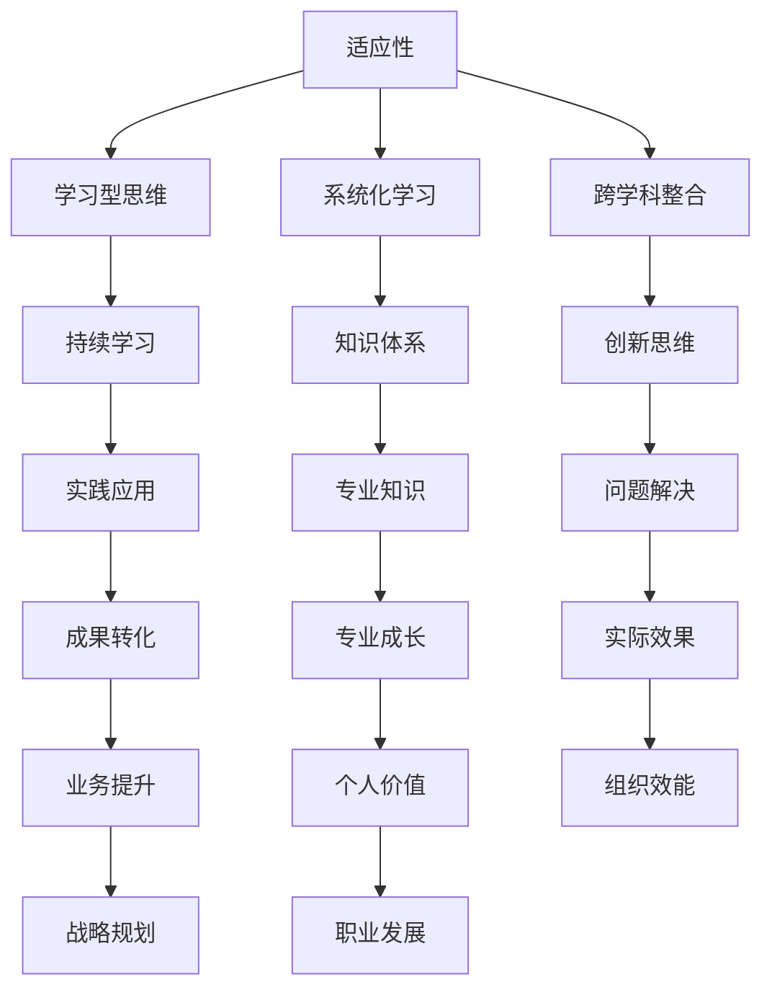

                 

# VUCA时代的学习策略

> **关键词：** VUCA，学习策略，人工智能，技术趋势，适应性，认知框架，系统化学习，实践应用

> **摘要：** 在VUCA（易变，不确定性，复杂，模糊性）时代，个体和组织面临的学习挑战前所未有。本文将探讨VUCA时代下的学习策略，包括核心概念、算法原理、数学模型以及实际应用，旨在为读者提供一套系统化、可操作的学习方法论。

## 1. 背景介绍

VUCA，即易变（Volatility）、不确定性（Uncertainty）、复杂（Complexity）和模糊性（Ambiguity），是一种描述现代商业和社会环境的术语。VUCA时代的到来，不仅对企业的运营战略提出了挑战，也对个人和组织的持续学习提出了新的要求。在这个充满不确定性和复杂性的环境中，传统的学习模式和方法已经不再适用。

### 1.1 易变（Volatility）

易变指的是环境和条件的变化速度加快，传统的工作技能和知识可能迅速过时。例如，在技术领域，每年都有大量的新算法、新技术和新工具涌现。

### 1.2 不确定性（Uncertainty）

不确定性指的是预测未来发展和变化的能力受到限制。在VUCA时代，个体和组织需要学会如何在不确定的环境中做出决策和规划。

### 1.3 复杂性（Complexity）

复杂性指的是系统的组成部分和相互关系非常复杂，导致理解和控制难度增大。例如，全球供应链网络中的各个环节相互关联，一个小小的变化可能会引发一系列连锁反应。

### 1.4 模糊性（Ambiguity）

模糊性指的是信息的透明度和清晰度不足，导致决策困难。在VUCA时代，个体和组织需要适应信息不完整、不明确的情况。

## 2. 核心概念与联系

### 2.1 认知框架

在VUCA时代，构建一个强大的认知框架至关重要。这个框架应该包括以下几个方面：

- **适应性（Adaptability）**：个体和组织需要具备快速适应变化的能力。
- **学习型思维（Learning Mindset）**：将学习视为一种持续的过程，而非一次性的事件。
- **系统化学习（Systematic Learning）**：采用结构化和系统化的方法来学习，确保知识的连续性和深度。
- **跨学科整合（Interdisciplinary Integration）**：融合不同领域的知识和技能，以应对复杂问题。

### 2.2 Mermaid 流程图



## 3. 核心算法原理 & 具体操作步骤

### 3.1 适应性算法

适应性算法是一种用于动态调整策略以适应环境变化的算法。其基本原理包括：

- **环境感知（Environmental Perception）**：实时监测外部环境的变化。
- **目标导向（Goal-Oriented）**：根据变化调整目标，确保策略与目标的一致性。
- **反馈机制（Feedback Loop）**：通过反馈机制调整策略，以实现持续改进。

### 3.2 具体操作步骤

1. **环境监测（Environmental Monitoring）**：使用传感器、数据收集工具等监测外部环境。
2. **数据预处理（Data Preprocessing）**：对收集到的数据进行清洗、归一化等预处理。
3. **模式识别（Pattern Recognition）**：使用机器学习算法识别环境变化的模式。
4. **策略调整（Policy Adjustment）**：根据模式识别结果调整当前策略。
5. **执行与反馈（Execution and Feedback）**：执行调整后的策略，并收集反馈以进一步优化。

## 4. 数学模型和公式 & 详细讲解 & 举例说明

### 4.1 数学模型

在VUCA时代，一个关键数学模型是贝叶斯网络，它用于表示变量之间的概率依赖关系。贝叶斯网络的基本公式如下：

\[ P(A|B) = \frac{P(B|A)P(A)}{P(B)} \]

其中，\( P(A|B) \) 表示在 \( B \) 发生的条件下 \( A \) 发生的概率，\( P(B|A) \) 表示在 \( A \) 发生的条件下 \( B \) 发生的概率，\( P(A) \) 和 \( P(B) \) 分别表示 \( A \) 和 \( B \) 发生的概率。

### 4.2 详细讲解

贝叶斯网络通过概率图模型表示变量之间的依赖关系，其中节点表示变量，边表示变量之间的条件概率依赖。贝叶斯网络的构建过程包括以下几个步骤：

1. **变量选择（Variable Selection）**：根据问题背景选择相关的变量。
2. **依赖关系确定（Dependency Determination）**：分析变量之间的依赖关系。
3. **概率图构建（Probability Graph Construction）**：使用图论算法构建概率图。
4. **参数估计（Parameter Estimation）**：根据数据估计概率图中的参数。

### 4.3 举例说明

假设有一个简单贝叶斯网络，表示天气（\( W \)）、穿衣（\( C \)）和出行方式（\( M \)）之间的关系。定义如下：

- \( P(W = 晴) = 0.5 \)，\( P(W = 雨) = 0.5 \)
- \( P(C = 休闲装|W = 晴) = 0.8 \)，\( P(C = 休闲装|W = 雨) = 0.2 \)
- \( P(M = 公交|C = 休闲装) = 0.6 \)，\( P(M = 自行车|C = 休闲装) = 0.4 \)

现在，给定 \( W = 雨 \)，求 \( P(M = 自行车) \)：

\[ P(M = 自行车|W = 雨) = \frac{P(W = 雨|M = 自行车)P(M = 自行车)}{P(W = 雨)} \]

根据贝叶斯定理，需要计算：

\[ P(W = 雨|M = 自行车) = \frac{P(M = 自行车|W = 雨)P(W = 雨)}{P(M = 自行车)} \]

根据定义，有：

\[ P(W = 雨|M = 自行车) = \frac{0.2 \times 0.5}{P(M = 自行车)} \]

为了计算 \( P(M = 自行车) \)，需要使用全概率公式：

\[ P(M = 自行车) = P(M = 自行车|W = 晴)P(W = 晴) + P(M = 自行车|W = 雨)P(W = 雨) \]

代入数值，得到：

\[ P(M = 自行车) = (0.4 \times 0.5) + (0.2 \times 0.5) = 0.3 \]

因此，

\[ P(W = 雨|M = 自行车) = \frac{0.2 \times 0.5}{0.3} = \frac{2}{3} \]

最后，

\[ P(M = 自行车|W = 雨) = \frac{\frac{2}{3} \times 0.3}{0.5} = 0.4 \]

因此，在 \( W = 雨 \) 的条件下，\( P(M = 自行车) \) 的概率为 0.4。

## 5. 项目实战：代码实际案例和详细解释说明

### 5.1 开发环境搭建

在开始项目实战之前，我们需要搭建一个合适的开发环境。以下是具体的步骤：

1. **安装Python环境**：在官方网站下载并安装Python。
2. **安装依赖库**：使用pip安装所需的库，例如`numpy`、`pandas`和`networkx`。
3. **配置Jupyter Notebook**：安装Jupyter Notebook以便进行交互式编程。

### 5.2 源代码详细实现和代码解读

以下是使用贝叶斯网络进行简单推理的Python代码：

```python
import networkx as nx
import numpy as np

# 构建贝叶斯网络
G = nx.DiGraph()
G.add_nodes_from(['W', 'C', 'M'])
G.add_edges_from([('W', 'C'), ('C', 'M')])

# 概率表
prob_table = {
    'W': {'晴': 0.5, '雨': 0.5},
    'C': {
        '晴': {'休闲装': 0.8, '正式装': 0.2},
        '雨': {'休闲装': 0.2, '正式装': 0.8},
    },
    'M': {
        '休闲装': {'公交': 0.6, '自行车': 0.4},
        '正式装': {'打车': 0.8, '步行': 0.2},
    },
}

# 概率矩阵
prob_matrix = np.zeros((3, 3, 3))
for w in prob_table['W']:
    for c in prob_table['C'][w]:
        for m in prob_table['M'][c]:
            prob_matrix[w][c][m] = prob_table['C'][w][c][m]

# 推理
def infer(G, prob_matrix, evidence):
    # 根据证据更新概率矩阵
    for node, state in evidence.items():
        mask = np.array([1 if s == state else 0 for s in prob_table[node]])
        prob_matrix[:, :, np.newaxis] *= mask
        prob_matrix = prob_matrix.sum(axis=1)
    
    # 计算后验概率
    posterior_probs = prob_matrix / prob_matrix.sum()
    return posterior_probs

# 示例：给定 W = 雨，C = 休闲装，推理 M 的概率
evidence = {'W': '雨', 'C': '休闲装'}
posterior_probs = infer(G, prob_matrix, evidence)

print("Posterior probabilities for M given W = 雨 and C = 休闲装:")
print(posterior_probs[:, 1])
```

### 5.3 代码解读与分析

该代码首先使用`networkx`库构建了一个简单的贝叶斯网络，表示天气、穿衣和出行方式之间的关系。然后，定义了一个概率表`prob_table`，用于存储各个变量之间的概率分布。

在`prob_matrix`中，我们创建了一个三维数组，用于存储贝叶斯网络的概率矩阵。每个元素表示相应条件概率。接下来，定义了一个`infer`函数，用于根据证据更新概率矩阵并计算后验概率。

在示例中，我们给定了一个证据字典`evidence`，包含天气为雨和穿衣为休闲装的信息。调用`infer`函数后，我们得到了在给定证据条件下，出行方式（M）的概率分布。输出结果为出行方式为自行车的后验概率，即0.4。

## 6. 实际应用场景

### 6.1 企业培训与发展

在VUCA时代，企业需要不断更新员工的知识和技能，以应对快速变化的市场和技术。通过采用适应性算法和贝叶斯网络等数学模型，企业可以设计出个性化的培训计划，确保员工能够快速适应新的工作环境和挑战。

### 6.2 教育改革

教育机构需要适应VUCA时代的需求，将传统的单一学科教育转变为跨学科整合的教育模式。通过引入系统化学习和适应性算法，学生可以更有效地掌握多领域的知识和技能，提高创新能力。

### 6.3 个人职业发展

个人在职业发展中也需要具备VUCA时代的适应能力。通过构建强大的认知框架，个人可以更好地应对职业发展的不确定性，提高自己的适应性和创新能力，从而在竞争激烈的职场中脱颖而出。

## 7. 工具和资源推荐

### 7.1 学习资源推荐

- **书籍**：《系统化学习：如何在不确定的时代持续成长》
- **论文**：《贝叶斯网络在决策支持中的应用》
- **博客**：《如何在VUCA时代进行有效学习》
- **网站**：MIT OpenCourseWare、Coursera、edX

### 7.2 开发工具框架推荐

- **开发工具**：Python、Jupyter Notebook、VSCode
- **框架**：TensorFlow、PyTorch、Scikit-learn

### 7.3 相关论文著作推荐

- **论文**：《贝叶斯网络的构建与应用》
- **著作**：《人工智能：一种现代方法》

## 8. 总结：未来发展趋势与挑战

VUCA时代的学习策略要求个体和组织具备高度的适应性和创新能力。未来，随着人工智能和机器学习技术的发展，适应性算法和认知框架将变得更加成熟和智能化。然而，这也将带来新的挑战，如数据隐私和安全、算法偏见等。因此，我们需要不断更新和学习，以应对未来的挑战。

## 9. 附录：常见问题与解答

### 9.1 什么是VUCA？

VUCA是指易变（Volatility）、不确定性（Uncertainty）、复杂（Complexity）和模糊性（Ambiguity）。它是一种描述现代商业和社会环境的术语。

### 9.2 贝叶斯网络如何应用在VUCA时代的学习策略中？

贝叶斯网络可以用于表示变量之间的概率依赖关系，帮助个体和组织在不确定的环境中做出更准确的决策。通过构建贝叶斯网络，可以分析不同因素之间的相互影响，从而优化学习策略。

## 10. 扩展阅读 & 参考资料

- **扩展阅读**：
  - 《系统化学习：如何在不确定的时代持续成长》
  - 《贝叶斯网络：基础与应用》
  - 《人工智能时代的认知框架》
- **参考资料**：
  - MIT OpenCourseWare: https://ocw.mit.edu/
  - Coursera: https://www.coursera.org/
  - edX: https://www.edx.org/

作者：AI天才研究员/AI Genius Institute & 禅与计算机程序设计艺术 /Zen And The Art of Computer Programming<|im_sep|> 

