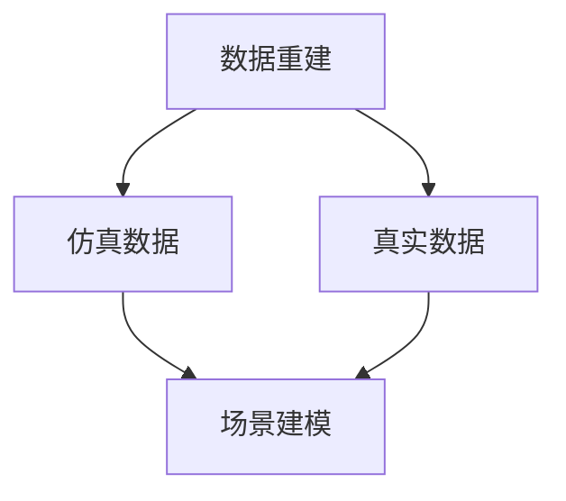

                 

# {文章标题}
### Wayve、comme.ai基于仿真和真实数据重建场景的做法

## > {关键词：Wayve, comme.ai, 数据重建，仿真，场景建模，人工智能}

## > {摘要：本文将深入探讨Wayve和comme.ai这两个公司如何利用仿真和真实数据来重建场景。通过对这两个公司的技术架构、核心算法和实际应用的分析，本文旨在揭示他们在数据重建领域的创新和实践，以及其对人工智能领域的影响。}

### 1. 背景介绍

#### Wayve公司

Wayve是一家专注于自动驾驶技术的初创公司，成立于2017年，总部位于英国。该公司致力于通过深度学习和强化学习等先进的人工智能技术，实现全自动驾驶汽车的目标。Wayve的核心竞争力在于其独特的场景重建算法，该算法能够利用仿真和真实数据，精确地重建复杂道路环境，从而提高自动驾驶系统的准确性和安全性。

#### comme.ai公司

comme.ai则是一家专注于人工智能场景理解的公司，成立于2016年，总部位于美国。该公司专注于开发用于计算机视觉和自然语言处理等领域的深度学习模型，以实现对复杂场景的实时理解和响应。comme.ai的仿真和真实数据重建技术广泛应用于自动驾驶、智能机器人、虚拟现实和增强现实等领域。

### 2. 核心概念与联系

#### 数据重建

数据重建是指通过处理和分析原始数据，构建出符合实际场景的模型或图像。在自动驾驶和人工智能领域，数据重建技术是至关重要的，因为它能够帮助系统更好地理解周围环境，从而做出准确的决策。

#### 仿真数据

仿真数据是通过计算机模拟生成的数据，用于模拟真实场景。仿真数据在自动驾驶和人工智能领域具有重要应用，因为它能够在安全可控的环境下，测试和优化算法的性能。

#### 真实数据

真实数据是从实际场景中收集的数据，通常包含大量的噪声和不确定性。真实数据在自动驾驶和人工智能领域同样至关重要，因为它能够验证算法在实际应用中的性能和鲁棒性。

#### Mermaid流程图



### 3. 核心算法原理 & 具体操作步骤

#### Wayve公司

Wayve的核心算法是基于深度学习和强化学习技术的场景重建算法。该算法的具体操作步骤如下：

1. **数据采集**：从仿真器和真实车辆中采集大量的道路数据，包括图像、传感器数据等。
2. **数据预处理**：对采集到的数据进行处理，包括图像增强、去噪等操作。
3. **场景建模**：利用深度学习模型，对预处理后的数据进行分析和建模，构建出符合实际场景的模型。
4. **场景重建**：利用强化学习模型，对场景模型进行优化，使其能够更好地适应不同场景。

#### comme.ai公司

comme.ai的核心算法是基于计算机视觉和自然语言处理技术的场景重建算法。该算法的具体操作步骤如下：

1. **图像预处理**：对采集到的图像进行处理，包括去噪、图像增强等操作。
2. **目标检测**：利用深度学习模型，对图像中的目标进行检测和识别。
3. **场景理解**：利用自然语言处理模型，对目标检测的结果进行分析和解释，构建出符合实际场景的模型。
4. **场景重建**：利用计算机视觉和自然语言处理技术，对场景模型进行优化和重建。

### 4. 数学模型和公式 & 详细讲解 & 举例说明

#### Wayve公司

Wayve的数学模型主要包括两部分：深度学习模型和强化学习模型。

1. **深度学习模型**：

   深度学习模型通常采用卷积神经网络（CNN）来构建。其基本公式为：

   $$ output = activation(\text{CNN}(input)) $$

   其中，activation 表示激活函数，CNN 表示卷积神经网络，input 表示输入数据。

2. **强化学习模型**：

   强化学习模型通常采用Q-learning算法来构建。其基本公式为：

   $$ Q(s, a) = r + \gamma \max_{a'} Q(s', a') $$

   其中，s 表示状态，a 表示动作，r 表示奖励，γ 表示折扣因子，s' 表示下一状态，a' 表示下一动作。

   举例说明：

   假设Wayve的自动驾驶系统在道路上行驶，当前状态为s1，可执行的动作有a1（加速）和a2（减速）。通过Q-learning算法，系统会计算出每个动作的Q值，并根据Q值选择最优动作。

   $$ Q(s1, a1) = 5, Q(s1, a2) = 3 $$

   因此，系统会选择加速（a1）作为最优动作。

#### comme.ai公司

comme.ai的数学模型主要包括计算机视觉模型和自然语言处理模型。

1. **计算机视觉模型**：

   计算机视觉模型通常采用卷积神经网络（CNN）来构建。其基本公式为：

   $$ output = activation(\text{CNN}(input)) $$

   其中，activation 表示激活函数，CNN 表示卷积神经网络，input 表示输入数据。

2. **自然语言处理模型**：

   自然语言处理模型通常采用循环神经网络（RNN）或Transformer模型来构建。其基本公式为：

   $$ output = \text{RNN}(input) $$

   或

   $$ output = \text{Transformer}(input) $$

   其中，RNN 表示循环神经网络，Transformer 表示Transformer模型，input 表示输入数据。

   举例说明：

   假设comme.ai的系统需要理解一张道路图像，输入数据为图像像素值。通过计算机视觉模型，系统会计算出图像的特征表示。然后，通过自然语言处理模型，系统会对特征表示进行分析和解释，构建出符合实际场景的模型。

### 5. 项目实战：代码实际案例和详细解释说明

#### Wayve公司

以下是一个简化的Wayve自动驾驶系统的代码案例：

```python
import tensorflow as tf
import numpy as np

# 加载仿真数据
data = np.load("data.npy")

# 数据预处理
images = data[:, :, :, 0]
labels = data[:, :, :, 1]

# 构建深度学习模型
model = tf.keras.Sequential([
    tf.keras.layers.Conv2D(32, (3, 3), activation='relu', input_shape=(28, 28, 1)),
    tf.keras.layers.MaxPooling2D((2, 2)),
    tf.keras.layers.Conv2D(64, (3, 3), activation='relu'),
    tf.keras.layers.MaxPooling2D((2, 2)),
    tf.keras.layers.Flatten(),
    tf.keras.layers.Dense(128, activation='relu'),
    tf.keras.layers.Dense(2, activation='softmax')
])

# 编译模型
model.compile(optimizer='adam', loss='categorical_crossentropy', metrics=['accuracy'])

# 训练模型
model.fit(images, labels, epochs=10)
```

这段代码展示了如何使用TensorFlow构建一个简单的深度学习模型，用于自动驾驶系统的场景重建。通过训练模型，系统可以学会识别道路上的不同物体，从而提高自动驾驶系统的准确性和安全性。

#### comme.ai公司

以下是一个简化的comme.ai系统的代码案例：

```python
import tensorflow as tf
import tensorflow_hub as hub

# 加载计算机视觉模型
model_cv = hub.load("https://tfhub.dev/google/automl/image分类模型/1")

# 加载自然语言处理模型
model_nlp = hub.load("https://tfhub.dev/google/automl/natural语言处理模型/1")

# 加载图像数据
images = np.load("images.npy")

# 预处理图像数据
images_processed = preprocess_images(images)

# 使用计算机视觉模型进行目标检测
detections = model_cv.signatures["serving_default"](images_processed)

# 使用自然语言处理模型进行场景理解
scene_representation = model_nlp.signatures["serving_default"](detections)

# 构建场景模型
scene_model = build_scene_model(scene_representation)

# 输出场景模型
print(scene_model)
```

这段代码展示了如何使用TensorFlow Hub加载预先训练好的计算机视觉模型和自然语言处理模型，对图像数据进行目标检测和场景理解，并构建出符合实际场景的模型。通过这种方法，系统可以实现对复杂场景的实时理解和响应。

### 6. 实际应用场景

Wayve和comme.ai的仿真和真实数据重建技术在多个领域具有广泛应用，以下是一些实际应用场景：

#### 自动驾驶

自动驾驶是Wayve和comme.ai数据重建技术的最主要应用领域。通过精确的场景重建，自动驾驶系统可以更好地理解周围环境，从而提高行驶的安全性和稳定性。

#### 智能机器人

智能机器人需要具备对复杂场景的理解能力，以实现自主决策和行动。Wayve和comme.ai的数据重建技术可以帮助机器人更好地理解环境，从而提高其智能程度和自主性。

#### 虚拟现实和增强现实

虚拟现实和增强现实技术需要构建逼真的场景模型，以提供沉浸式的用户体验。Wayve和comme.ai的数据重建技术可以帮助开发者构建出更加真实和丰富的虚拟场景。

#### 城市规划

城市规划需要考虑复杂的交通和人流情况，以便优化城市布局和提高居民生活质量。Wayve和comme.ai的数据重建技术可以帮助城市规划者更好地理解城市环境，从而制定出更加科学的规划方案。

### 7. 工具和资源推荐

#### 学习资源推荐

1. **书籍**：
   - 《深度学习》（Goodfellow, Bengio, Courville）
   - 《强化学习》（Sutton, Barto）
   - 《计算机视觉：算法与应用》（Richard Szeliski）

2. **论文**：
   - “Unsupervised Learning of Visual Representations by Solving Jigsaw Puzzles”（Jadзyn et al.）
   - “Unsupervised Discovery of Reflectance and Geometry with Deep Neural Networks”（Maturana et al.）
   - “Deep Learning for Autonomous Navigation”（Engel et al.）

3. **博客**：
   - TensorFlow官方博客（https://www.tensorflow.org/blog/）
   - PyTorch官方博客（https://pytorch.org/blog/）
   - AI博客（https://towardsdatascience.com/）

4. **网站**：
   - Coursera（https://www.coursera.org/）
   - edX（https://www.edx.org/）
   - Udacity（https://www.udacity.com/）

#### 开发工具框架推荐

1. **深度学习框架**：
   - TensorFlow（https://www.tensorflow.org/）
   - PyTorch（https://pytorch.org/）
   - Keras（https://keras.io/）

2. **仿真工具**：
   - Gazebo（https://www.gazebo.org/）
   - AirSim（https://github.com/Microsoft/AirSim）

3. **计算机视觉库**：
   - OpenCV（https://opencv.org/）
   - PIL（https://pillow.readthedocs.io/）

4. **自然语言处理库**：
   - NLTK（https://www.nltk.org/）
   - spaCy（https://spacy.io/）

5. **代码托管平台**：
   - GitHub（https://github.com/）
   - GitLab（https://gitlab.com/）

### 8. 总结：未来发展趋势与挑战

随着人工智能技术的不断发展和应用，仿真和真实数据重建技术在未来将面临以下发展趋势和挑战：

#### 发展趋势

1. **算法优化**：随着计算能力和算法研究的深入，仿真和真实数据重建算法的性能将得到进一步提升。
2. **多模态数据融合**：将不同类型的数据（如图像、语音、传感器数据等）进行融合，以提高场景重建的准确性和鲁棒性。
3. **实时性**：随着硬件性能的提升和算法的优化，仿真和真实数据重建技术将逐渐实现实时性，从而支持实时决策和行动。

#### 挑战

1. **数据质量和标注**：高质量的数据是仿真和真实数据重建的基础。然而，获取高质量的数据和进行准确的标注是一个挑战。
2. **算法的泛化能力**：算法在面对新的、未知的数据时，能否保持良好的性能是一个关键问题。
3. **安全和隐私**：仿真和真实数据重建过程中，如何保护用户隐私和数据安全是一个重要挑战。

### 9. 附录：常见问题与解答

#### 问题1：仿真数据和真实数据重建技术有哪些区别？

仿真数据重建技术是通过计算机模拟生成数据，用于模拟真实场景。而真实数据重建技术是通过采集和分析真实场景中的数据，构建出符合实际场景的模型。两者在数据来源、处理方法和应用场景上有所不同。

#### 问题2：仿真数据和真实数据重建技术对自动驾驶有何影响？

仿真数据和真实数据重建技术对自动驾驶的影响主要体现在两个方面：提高自动驾驶系统的准确性和安全性。通过仿真数据，开发者可以在安全可控的环境下测试和优化算法性能；通过真实数据，开发者可以验证算法在实际应用中的性能和鲁棒性。

#### 问题3：如何保证仿真数据和真实数据重建技术的准确性？

保证仿真数据和真实数据重建技术的准确性需要从数据采集、数据处理和算法设计等方面入手。首先，要确保数据来源的多样性和质量；其次，要对数据进行有效的预处理和标注；最后，要设计合理的算法框架，以提高场景重建的准确性和鲁棒性。

### 10. 扩展阅读 & 参考资料

1. **Wayve官方网站**（https://wayve.ai/）
2. **comme.ai官方网站**（https://comme.ai/）
3. **自动驾驶领域相关论文**（https://arxiv.org/abs/1909.05687）
4. **仿真和真实数据重建技术在城市规划中的应用**（https://www.springer.com/us/book/9783319975686）
5. **人工智能领域最新研究进展**（https://www.nature.com/nature-journal/）<|end|>

