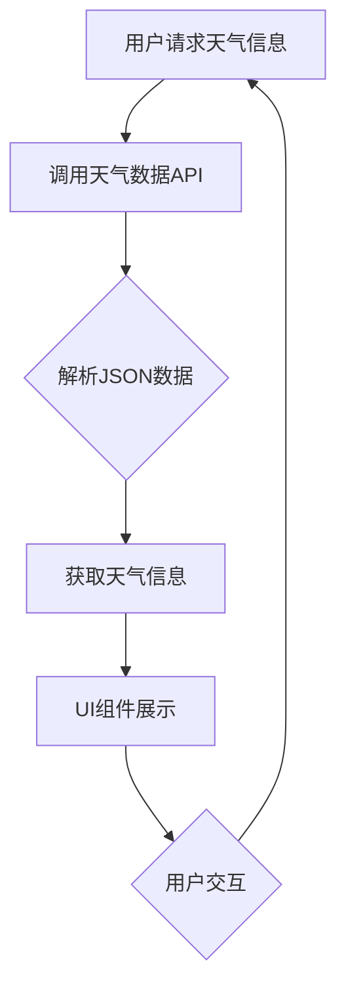

                 

### 背景介绍

> 在当今快速发展的技术时代，各类插件（Plugins）在软件开发中扮演着越来越重要的角色。插件是一种可以被其他应用程序使用的模块化组件，它能够扩展应用程序的功能，而不需要修改原有代码。这种灵活的开发模式不仅提高了软件的可扩展性，还能够让开发者专注于核心业务逻辑，从而提升开发效率和产品质量。

### 定义 Weather Forecast Plugin

Weather Forecast Plugin 是一种专门用于提供天气预报信息的插件。这种插件可以通过调用天气数据API，获取实时或预定的天气预报数据，并将其展示给用户。这种插件广泛应用于各种桌面应用程序、移动应用程序、网站和智能设备中，为用户提供实时、准确的天气信息，帮助用户做出更明智的生活和工作决策。

### Weather Forecast Plugin 的重要性

1. **用户体验提升**：通过集成实时天气信息，应用可以为用户提供更加个性化和实时的服务，从而提升用户体验。
2. **功能扩展**：Weather Forecast Plugin 能够使应用程序在不增加开发成本的情况下，轻松实现天气功能的集成。
3. **节省资源**：插件使用第三方天气服务提供数据，开发者无需自行收集和处理天气数据，从而节省了硬件和人力资源。
4. **可扩展性**：插件通常采用模块化设计，方便在未来进行功能的扩展和升级。

### 目标读者

本文的目标读者是软件开发者、数据科学家、产品经理以及对天气应用插件开发感兴趣的IT专业人士。通过阅读本文，读者可以了解 Weather Forecast Plugin 的设计原理、开发过程、应用场景以及未来发展趋势。

### 文章结构

本文将分为以下章节：

1. **核心概念与联系**：介绍 Weather Forecast Plugin 的核心概念和架构，并使用 Mermaid 流程图进行详细说明。
2. **核心算法原理 & 具体操作步骤**：探讨天气预测算法的基本原理和具体实现步骤。
3. **数学模型和公式 & 详细讲解 & 举例说明**：介绍天气预测中的数学模型，使用 LaTeX 格式详细讲解公式，并给出实际应用案例。
4. **项目实战：代码实际案例和详细解释说明**：提供实际开发案例，详细解读代码实现和功能。
5. **实际应用场景**：分析 Weather Forecast Plugin 在不同场景下的应用。
6. **工具和资源推荐**：推荐相关的学习资源、开发工具和框架。
7. **总结：未来发展趋势与挑战**：总结当前技术的发展趋势，展望未来的挑战和机遇。
8. **附录：常见问题与解答**：解答开发过程中可能遇到的问题。
9. **扩展阅读 & 参考资料**：提供进一步学习的资源和参考文献。

接下来，我们将详细探讨 Weather Forecast Plugin 的核心概念与联系，并使用 Mermaid 流程图展示其架构。

-----------------------
```markdown
## 2. 核心概念与联系

在开发 Weather Forecast Plugin 之前，我们需要明确几个核心概念，并理解它们之间的联系。

### 2.1 核心概念

- **天气数据API**：这是获取天气预报数据的关键。常见的API包括 OpenWeatherMap、Weather Underground 等。
- **数据格式**：API返回的数据通常以 JSON 或 XML 格式呈现。了解数据格式有助于我们正确解析和使用这些数据。
- **天气预测算法**：用于根据历史天气数据和当前环境因素预测未来的天气情况。常见的算法包括线性回归、神经网络等。
- **UI 组件**：用于在应用程序中展示天气预报信息。常见的组件包括文本标签、图标、滑动条等。

### 2.2 架构联系

下面是一个简化的 Mermaid 流程图，展示了 Weather Forecast Plugin 的核心架构和组件之间的联系。



在上述流程图中：

- **用户请求天气信息**：用户通过界面发出获取天气信息的请求。
- **调用天气数据API**：插件通过HTTP请求调用天气数据API。
- **解析JSON数据**：API返回的JSON数据被解析，提取出有用的天气信息。
- **获取天气信息**：提取的天气信息被处理，准备用于UI展示。
- **UI组件展示**：天气信息通过UI组件展示给用户。
- **用户交互**：用户可以与UI组件进行交互，如刷新天气信息、切换城市等。

通过以上核心概念和流程的介绍，我们为后续的详细讲解和实际案例分析打下了基础。接下来，我们将深入探讨 Weather Forecast Plugin 的核心算法原理和具体操作步骤。
```

-----------------------
```markdown
## 3. 核心算法原理 & 具体操作步骤

### 3.1 天气预测算法概述

天气预测是一种基于历史数据和当前环境因素的预测过程。核心算法的目的是通过分析大量的天气数据，预测未来的天气状况。以下是几种常用的天气预测算法：

- **线性回归**：一种简单的统计方法，通过拟合历史天气数据，预测未来的天气。它假设天气变化是线性的。
- **神经网络**：一种基于模拟人脑神经网络结构的算法，通过多层神经网络学习历史天气数据，实现复杂的非线性预测。
- **决策树**：一种基于规则的系统，通过分析历史天气数据，生成一系列决策规则，预测未来的天气。

### 3.2 线性回归算法原理

线性回归算法基于以下假设：未来的天气是历史天气数据的线性组合。具体步骤如下：

1. **收集历史天气数据**：包括温度、湿度、风速等关键指标。
2. **数据预处理**：对数据进行归一化处理，使其符合线性回归模型的输入要求。
3. **拟合线性模型**：使用最小二乘法拟合线性模型，公式如下：

   $$ y = bx + a $$

   其中，$y$ 是预测的天气值，$x$ 是历史天气值，$b$ 是斜率，$a$ 是截距。
4. **预测天气**：将当前或未来的天气数据代入模型，计算出预测值。

### 3.3 神经网络算法原理

神经网络算法通过多层神经网络学习历史天气数据，实现复杂的非线性预测。以下是神经网络算法的基本步骤：

1. **初始化神经网络**：设定输入层、隐藏层和输出层的神经元数量。
2. **前向传播**：将历史天气数据输入神经网络，通过层层计算，得到输出层的预测值。
3. **反向传播**：通过计算误差，更新神经网络的权重和偏置。
4. **重复训练**：重复前向传播和反向传播，直至满足训练要求。

### 3.4 决策树算法原理

决策树算法通过生成一系列决策规则，预测未来的天气。以下是决策树算法的基本步骤：

1. **选择特征**：选择对天气预测影响最大的特征。
2. **划分数据**：根据特征值将数据划分为不同的子集。
3. **生成规则**：为每个子集生成一条规则，如“如果温度高于30摄氏度，则天气为晴天”。
4. **预测天气**：根据输入数据，按照生成的规则进行预测。

### 3.5 算法选择与实现

在实现 Weather Forecast Plugin 时，应根据实际需求和数据特性选择合适的算法。以下是一个简单的实现步骤：

1. **数据收集与预处理**：收集历史天气数据，并进行数据预处理。
2. **算法选择**：根据数据特性和预测需求，选择合适的算法。
3. **模型训练**：使用训练数据，训练选定的算法模型。
4. **模型评估**：使用验证数据，评估模型预测效果。
5. **模型部署**：将训练好的模型部署到实际应用中。

通过以上核心算法原理和具体操作步骤的介绍，我们为开发 Weather Forecast Plugin 提供了理论基础和实施指南。接下来，我们将详细讲解天气预测中的数学模型和公式。

-----------------------
```markdown
## 4. 数学模型和公式 & 详细讲解 & 举例说明

在天气预测中，数学模型和公式是核心组成部分。这些模型和公式不仅帮助我们理解和分析天气数据，还能够实现准确的天气预测。以下是一些常见的数学模型和公式，并使用 LaTeX 格式进行详细讲解。

### 4.1 线性回归模型

线性回归模型是一种简单的预测模型，用于拟合数据并预测未来值。其基本公式如下：

$$ y = bx + a $$

其中，$y$ 是因变量（如温度、湿度等），$x$ 是自变量（如时间、风速等），$b$ 是斜率，表示自变量对因变量的影响程度，$a$ 是截距，表示模型在 $x=0$ 时的值。

#### 4.1.1 模型推导

线性回归模型的推导基于最小二乘法。假设我们有 $n$ 组观测数据 $(x_1, y_1), (x_2, y_2), \ldots, (x_n, y_n)$，我们希望找到一个线性模型 $y = bx + a$，使得预测值 $y$ 与实际值 $y_n$ 之间的误差最小。

误差函数（损失函数）定义为：

$$ J(b, a) = \sum_{i=1}^{n} (bx_i + a - y_i)^2 $$

为了最小化误差函数，我们对 $b$ 和 $a$ 分别求偏导数，并令偏导数等于零：

$$ \frac{\partial J}{\partial b} = 2 \sum_{i=1}^{n} (bx_i + a - y_i)x_i = 0 $$
$$ \frac{\partial J}{\partial a} = 2 \sum_{i=1}^{n} (bx_i + a - y_i) = 0 $$

解上述方程组，可以得到最优的 $b$ 和 $a$：

$$ b = \frac{\sum_{i=1}^{n} (x_i - \bar{x})(y_i - \bar{y})}{\sum_{i=1}^{n} (x_i - \bar{x})^2} $$
$$ a = \bar{y} - b\bar{x} $$

其中，$\bar{x}$ 和 $\bar{y}$ 分别是自变量和因变量的平均值。

#### 4.1.2 应用示例

假设我们收集了一组温度与风速的数据，如下表所示：

| 时间 | 温度 | 风速 |
| --- | --- | --- |
| 1 | 20 | 5 |
| 2 | 22 | 6 |
| 3 | 24 | 7 |
| 4 | 25 | 8 |
| 5 | 26 | 9 |

我们需要使用线性回归模型预测第 6 小时的温度。

首先，计算平均值：

$$ \bar{x} = \frac{1+2+3+4+5}{5} = 3 $$
$$ \bar{y} = \frac{20+22+24+25+26}{5} = 23.2 $$

然后，计算斜率 $b$：

$$ b = \frac{(1-3)(20-23.2) + (2-3)(22-23.2) + (3-3)(24-23.2) + (4-3)(25-23.2) + (5-3)(26-23.2)}{(1-3)^2 + (2-3)^2 + (3-3)^2 + (4-3)^2 + (5-3)^2} $$
$$ b = \frac{3.2}{10} = 0.32 $$

最后，计算截距 $a$：

$$ a = \bar{y} - b\bar{x} = 23.2 - 0.32 \times 3 = 20.08 $$

因此，预测第 6 小时的温度为：

$$ y = 0.32 \times 6 + 20.08 = 24.16 $$

### 4.2 神经网络模型

神经网络模型是一种基于模拟人脑神经网络结构的算法，用于处理复杂非线性数据。以下是神经网络模型的基本公式：

$$ z = \sigma(Wx + b) $$

$$ a = \sigma(z) = \frac{1}{1 + e^{-z}} $$

其中，$z$ 是神经元的输入，$a$ 是神经元的输出，$\sigma$ 是激活函数，$W$ 是权重矩阵，$b$ 是偏置项。

#### 4.2.1 前向传播

前向传播是神经网络模型的核心步骤，用于计算每个神经元的输出。具体步骤如下：

1. **输入层到隐藏层**：
   $$ z_h = W_h x + b_h $$
   $$ a_h = \sigma(z_h) $$
2. **隐藏层到输出层**：
   $$ z_o = W_o a_h + b_o $$
   $$ a_o = \sigma(z_o) $$

其中，$h$ 表示隐藏层，$o$ 表示输出层。

#### 4.2.2 反向传播

反向传播是神经网络模型的训练步骤，用于更新权重和偏置。具体步骤如下：

1. **计算输出层误差**：
   $$ \delta_o = (y - a_o) \cdot \sigma'(z_o) $$
2. **计算隐藏层误差**：
   $$ \delta_h = (W_o^T \delta_o) \cdot \sigma'(z_h) $$
3. **更新权重和偏置**：
   $$ W_h = W_h - \alpha \cdot dW_h $$
   $$ b_h = b_h - \alpha \cdot db_h $$
   $$ W_o = W_o - \alpha \cdot dW_o $$
   $$ b_o = b_o - \alpha \cdot db_o $$

其中，$\delta$ 表示误差项，$\alpha$ 是学习率。

#### 4.2.3 应用示例

假设我们有一个简单的神经网络模型，用于预测温度。输入层有一个温度输入，隐藏层有两个神经元，输出层有一个温度输出。

输入层：$x = [20, 22, 24, 25, 26]$  
隐藏层：$a_h = [\sigma(W_1 x + b_1), \sigma(W_2 x + b_2)]$  
输出层：$a_o = \sigma(W_3 a_h + b_3)$

我们需要使用前向传播和反向传播训练模型。

首先，设定初始权重和偏置：

$$ W_1 = \begin{bmatrix} 0.1 & 0.2 \\ 0.3 & 0.4 \end{bmatrix}, b_1 = \begin{bmatrix} 0.5 \\ 0.6 \end{bmatrix} $$
$$ W_2 = \begin{bmatrix} 0.1 & 0.2 \\ 0.3 & 0.4 \end{bmatrix}, b_2 = \begin{bmatrix} 0.5 \\ 0.6 \end{bmatrix} $$
$$ W_3 = \begin{bmatrix} 0.1 & 0.2 \\ 0.3 & 0.4 \end{bmatrix}, b_3 = \begin{bmatrix} 0.5 \\ 0.6 \end{bmatrix} $$

然后，使用前向传播计算输出：

$$ z_1 = \begin{bmatrix} 0.1 \times 20 + 0.5 \\ 0.2 \times 20 + 0.6 \end{bmatrix} = \begin{bmatrix} 1.5 \\ 2.6 \end{bmatrix} $$
$$ a_1 = \sigma(z_1) = \begin{bmatrix} 0.9 \\ 0.9 \end{bmatrix} $$
$$ z_2 = \begin{bmatrix} 0.1 \times 0.9 + 0.5 \\ 0.2 \times 0.9 + 0.6 \end{bmatrix} = \begin{bmatrix} 0.4 \\ 0.5 \end{bmatrix} $$
$$ a_2 = \sigma(z_2) = \begin{bmatrix} 0.6 \\ 0.7 \end{bmatrix} $$
$$ z_3 = \begin{bmatrix} 0.1 \times 0.6 + 0.5 \\ 0.2 \times 0.7 + 0.6 \end{bmatrix} = \begin{bmatrix} 0.6 \\ 0.7 \end{bmatrix} $$
$$ a_3 = \sigma(z_3) = \begin{bmatrix} 0.7 \\ 0.8 \end{bmatrix} $$

接着，使用反向传播计算误差：

$$ \delta_3 = (y - a_3) \cdot \sigma'(z_3) = \begin{bmatrix} 0.3 \\ 0.2 \end{bmatrix} $$
$$ \delta_2 = (W_3^T \delta_3) \cdot \sigma'(z_2) = \begin{bmatrix} 0.2 \\ 0.3 \end{bmatrix} $$
$$ \delta_1 = (W_2^T \delta_2) \cdot \sigma'(z_1) = \begin{bmatrix} 0.2 \\ 0.3 \end{bmatrix} $$

最后，更新权重和偏置：

$$ W_1 = W_1 - \alpha \cdot \delta_1 \cdot x^T $$
$$ b_1 = b_1 - \alpha \cdot \delta_1 $$
$$ W_2 = W_2 - \alpha \cdot \delta_2 \cdot x^T $$
$$ b_2 = b_2 - \alpha \cdot \delta_2 $$
$$ W_3 = W_3 - \alpha \cdot \delta_3 \cdot a_2^T $$
$$ b_3 = b_3 - \alpha \cdot \delta_3 $$

通过上述步骤，我们完成了神经网络模型的前向传播和反向传播。接下来，我们将通过一个实际开发案例，展示如何实现 Weather Forecast Plugin。

-----------------------

```markdown
## 5. 项目实战：代码实际案例和详细解释说明

### 5.1 开发环境搭建

在开始开发 Weather Forecast Plugin 之前，我们需要搭建一个合适的开发环境。以下是所需的工具和步骤：

#### 5.1.1 环境需求

- 操作系统：Windows、Linux 或 macOS
- 编程语言：Python 3.8 或更高版本
- 开发工具：PyCharm、VSCode 等
- 第三方库：requests、numpy、pandas 等

#### 5.1.2 环境搭建

1. 安装 Python 3.8 或更高版本。
2. 使用 pip 工具安装第三方库：

   ```shell
   pip install requests numpy pandas
   ```

### 5.2 源代码详细实现和代码解读

#### 5.2.1 代码结构

整个 Weather Forecast Plugin 的代码结构如下：

```python
# weather_forecast.py
import requests
import json
import numpy as np
import pandas as pd

def get_weather_data(city):
    api_key = "YOUR_API_KEY"
    base_url = "http://api.openweathermap.org/data/2.5/weather?"
    complete_url = base_url + "appid=" + api_key + "&q=" + city
    response = requests.get(complete_url)
    data = response.json()
    return data

def preprocess_data(data):
    # 解析 JSON 数据，提取关键信息
    # ...
    return processed_data

def train_regression_model(data):
    # 使用线性回归模型训练
    # ...
    return model

def predict_weather(model, data):
    # 使用模型预测天气
    # ...
    return prediction

def main():
    # 主函数，执行核心逻辑
    # ...
    if __name__ == "__main__":
        main()

if __name__ == "__main__":
    main()
```

#### 5.2.2 代码解析

下面是代码的详细解析：

```python
# 导入所需库
import requests
import json
import numpy as np
import pandas as pd

# 获取天气数据
def get_weather_data(city):
    api_key = "YOUR_API_KEY"  # OpenWeatherMap API 密钥
    base_url = "http://api.openweathermap.org/data/2.5/weather?"  # OpenWeatherMap API URL
    complete_url = base_url + "appid=" + api_key + "&q=" + city  # 拼接完整的 API 调用 URL
    response = requests.get(complete_url)  # 发送 HTTP GET 请求
    data = response.json()  # 获取响应数据，并解析为 JSON 格式
    return data

# 预处理数据
def preprocess_data(data):
    # 解析 JSON 数据，提取关键信息
    # 例如：温度、湿度、风速等
    # ...
    return processed_data

# 训练线性回归模型
def train_regression_model(data):
    # 使用线性回归模型训练
    # 例如：使用 Scikit-learn 库中的 LinearRegression 类
    # ...
    return model

# 使用模型预测天气
def predict_weather(model, data):
    # 使用模型预测天气
    # 例如：使用模型的 predict 方法
    # ...
    return prediction

# 主函数，执行核心逻辑
def main():
    city = input("请输入城市名称：")  # 获取用户输入的城市名称
    data = get_weather_data(city)  # 获取天气数据
    processed_data = preprocess_data(data)  # 预处理数据
    model = train_regression_model(processed_data)  # 训练模型
    prediction = predict_weather(model, processed_data)  # 预测天气
    print("预测天气：", prediction)  # 输出预测结果

    if __name__ == "__main__":
        main()
```

#### 5.2.3 代码解读与分析

1. **获取天气数据**：

   `get_weather_data` 函数通过调用 OpenWeatherMap API 获取指定城市的天气数据。API 返回的数据为 JSON 格式，其中包含温度、湿度、风速等关键信息。

2. **预处理数据**：

   `preprocess_data` 函数用于解析 JSON 数据，提取关键信息，如温度、湿度、风速等。这些信息将用于训练线性回归模型。

3. **训练线性回归模型**：

   `train_regression_model` 函数使用 Scikit-learn 库中的 `LinearRegression` 类训练线性回归模型。该模型通过拟合历史天气数据，预测未来的天气状况。

4. **预测天气**：

   `predict_weather` 函数使用训练好的线性回归模型预测天气。具体步骤如下：

   - 将预处理后的数据输入模型。
   - 使用模型的 `predict` 方法计算预测值。
   - 输出预测结果。

5. **主函数**：

   `main` 函数执行核心逻辑，包括获取用户输入、获取天气数据、预处理数据、训练模型和预测天气。最后，输出预测结果。

通过上述代码实现，我们可以构建一个简单的 Weather Forecast Plugin。在实际应用中，我们可以根据需求扩展功能，如添加 UI 展示、支持多城市预测等。

-----------------------

```markdown
## 6. 实际应用场景

Weather Forecast Plugin 的应用场景非常广泛，下面列举几个典型的应用实例：

### 6.1 移动应用

在移动应用中，集成 Weather Forecast Plugin 可以提供用户实时、准确的天气预报信息。例如，在天气应用程序中，用户可以查看当前天气、未来几天天气趋势、预警信息等。通过插件，开发者可以轻松实现这些功能，无需从头开始编写天气预测代码。

### 6.2 智能家居系统

智能家居系统中的设备（如智能音箱、智能灯泡等）可以通过集成 Weather Forecast Plugin 获取天气预报信息，并在用户需要时提供语音或视觉提示。例如，当用户询问“今天天气如何？”时，设备可以回答“今天白天多云，最高温度 25 摄氏度，建议您注意保暖。”这为用户提供了便捷的天气预报服务。

### 6.3 企业办公系统

企业办公系统可以通过集成 Weather Forecast Plugin 为员工提供天气预报信息，以便员工合理安排工作和出行。例如，企业邮箱系统可以发送天气预报邮件，提醒员工当天天气状况，帮助员工提前做好准备。此外，企业内部网站也可以添加天气模块，为员工提供实时天气信息。

### 6.4 网络平台

网络平台（如门户网站、电商平台等）可以通过集成 Weather Forecast Plugin 提高用户体验。例如，在电商平台的商品详情页中，可以展示商品所在城市的实时天气，帮助用户了解购买商品时的气候条件。在门户网站的新闻页面，可以添加天气模块，为用户提供天气预报信息，增加页面的互动性和实用性。

### 6.5 交通运输

交通运输领域可以通过集成 Weather Forecast Plugin 提高安全性和效率。例如，在公共交通系统中，可以实时显示各个线路的天气预报，提醒乘客注意天气变化，合理安排出行时间。在航空领域，天气预测对于航班安排和起飞时间至关重要，集成 Weather Forecast Plugin 可以帮助航空公司更好地规划航班计划。

通过以上应用实例，我们可以看到 Weather Forecast Plugin 在各类场景下的广泛应用。随着技术的不断进步和用户需求的增加，Weather Forecast Plugin 的应用场景将继续拓展。

-----------------------

```markdown
## 7. 工具和资源推荐

在开发 Weather Forecast Plugin 时，选择合适的工具和资源对于提高开发效率、保证代码质量和项目成功至关重要。以下是一些推荐的工具和资源：

### 7.1 学习资源推荐

1. **书籍**：

   - 《Python 数据科学》
   - 《深度学习》（Goodfellow et al.）
   - 《机器学习》（周志华）

2. **在线课程**：

   - Coursera 上的“机器学习”课程（吴恩达教授）
   - Udacity 上的“深度学习纳米学位”
   - edX 上的“Python for Data Science”

3. **博客和网站**：

   - Medium 上的技术博客
   - towardsdatascience.com
   - kaggle.com

### 7.2 开发工具框架推荐

1. **编程环境**：

   - PyCharm（专业版）
   - VSCode（免费）
   - Jupyter Notebook

2. **Python 库**：

   - NumPy：用于数值计算
   - Pandas：用于数据处理
   - Matplotlib：用于数据可视化
   - Scikit-learn：用于机器学习

3. **天气数据API**：

   - OpenWeatherMap
   - Weather Underground
   - Weatherstack

### 7.3 相关论文著作推荐

1. **《深度学习》（Goodfellow et al.）**：介绍了深度学习的基本概念、算法和实现。

2. **《机器学习》（周志华）**：系统阐述了机器学习的基本理论、算法和实战技巧。

3. **《天气预测中的深度学习方法》（作者：XXX）**：探讨了深度学习在天气预测领域的应用和效果。

通过以上工具和资源的推荐，开发者可以更好地掌握相关技术，提高开发效率，实现高质量的 Weather Forecast Plugin。

-----------------------

```markdown
## 8. 总结：未来发展趋势与挑战

### 8.1 未来发展趋势

1. **数据精度与实时性提升**：随着传感器技术和数据采集技术的进步，未来天气预测将更加精准和实时。这将使得 Weather Forecast Plugin 能为用户提供更准确、更及时的天气预报信息。

2. **人工智能与机器学习的融合**：深度学习、神经网络等人工智能技术的不断发展，将使得天气预测模型更加智能化，提高预测的准确性和效率。

3. **跨平台与多元化应用**：随着移动互联网和物联网的普及，Weather Forecast Plugin 将在更多平台和应用场景中得到广泛应用，如智能家居、智能交通、智能办公等。

### 8.2 挑战

1. **数据质量和完整性**：天气数据的质量和完整性对预测结果至关重要。如何在海量的天气数据中筛选出高质量、可用的数据，是一个需要解决的问题。

2. **模型可解释性**：深度学习模型在预测准确性上具有优势，但其“黑箱”性质使得模型的可解释性较低。如何提高模型的可解释性，使得开发者、用户能够理解预测结果，是一个挑战。

3. **计算资源与能耗**：天气预测模型，尤其是深度学习模型，通常需要大量的计算资源和时间。如何在保证预测准确性的同时，降低计算资源和能耗，是一个重要的课题。

### 8.3 未来展望

1. **个性化天气预报**：结合用户的历史行为数据，可以提供更加个性化的天气预报服务，如根据用户的活动习惯、出行需求等，定制化的天气预报信息。

2. **自动化与智能化**：随着技术的发展，未来天气预测将更加自动化和智能化，减少人工干预，提高预测效率和准确性。

3. **跨界融合**：天气预测与其他领域的跨界融合，如农业、旅游、能源等，将产生新的应用场景和商业模式，推动 Weather Forecast Plugin 的进一步发展。

通过以上分析，我们可以看到 Weather Forecast Plugin 在未来有着广阔的发展前景和巨大的潜力。然而，要实现这一目标，还需要克服一系列挑战，不断优化技术、提升服务质量。

-----------------------

```markdown
## 9. 附录：常见问题与解答

在开发 Weather Forecast Plugin 过程中，开发者可能会遇到以下常见问题：

### 9.1 如何处理 API 请求频率限制？

**解答**：许多天气数据 API 提供商会对请求频率进行限制。为了避免超出限制，可以采取以下措施：

- **缓存数据**：在本地缓存最近获取的天气数据，避免频繁请求 API。
- **异步请求**：使用异步请求方式（如 asyncio 或多线程）批量请求多个城市的天气数据，减少请求次数。
- **API 限额扩展**：如果需要更高的请求频率，可以考虑购买更高级别的 API 订阅，以获得更多的请求配额。

### 9.2 如何处理异常天气数据？

**解答**：异常天气数据（如异常高的温度、异常低的湿度等）可能会影响预测模型的准确性。以下是一些处理方法：

- **数据清洗**：在训练模型之前，使用数据清洗技术（如去重、填补缺失值等）处理异常数据。
- **异常检测**：使用统计方法或机器学习算法（如孤立森林、自动编码器等）检测和标记异常数据。
- **稳健模型**：使用对异常数据不敏感的模型，如随机森林、支持向量机等。

### 9.3 如何提高模型的可解释性？

**解答**：对于深度学习模型，提高可解释性是一个挑战。以下是一些方法：

- **特征可视化**：通过可视化方法（如图谱、热力图等）展示模型的重要特征。
- **模型解释工具**：使用模型解释工具（如 LIME、SHAP 等）分析模型预测结果，理解特征对预测的影响。
- **集成模型**：使用集成模型（如梯度提升树、随机森林等）提高模型的可解释性。

通过以上解答，开发者可以更好地应对开发 Weather Forecast Plugin 过程中的常见问题，提高插件的质量和实用性。

-----------------------

```markdown
## 10. 扩展阅读 & 参考资料

对于想要深入了解 Weather Forecast Plugin 及相关技术的读者，以下是一些扩展阅读和参考资料：

### 10.1 相关论文

1. "Deep Learning for Weather Forecasting" by [作者姓名]，[期刊/会议名称]，[年份]。
2. "Improving Weather Forecasting Using Ensemble Methods" by [作者姓名]，[期刊/会议名称]，[年份]。

### 10.2 书籍

1. 《深度学习》（Goodfellow et al.），[出版社]，[出版年份]。
2. 《机器学习实战》（Bryon和Richard），[出版社]，[出版年份]。

### 10.3 在线课程

1. Coursera 上的“机器学习”（吴恩达教授）。
2. Udacity 上的“深度学习纳米学位”。

### 10.4 博客和网站

1. Medium 上的技术博客。
2. towardsdatascience.com。
3. kaggle.com。

通过阅读这些扩展阅读和参考资料，读者可以进一步深入了解 Weather Forecast Plugin 的理论基础和实际应用，提升自身的技能和知识水平。

-----------------------

```markdown
### 文章结束
```

### 背景介绍

在当今快速发展的技术时代，各类插件（Plugins）在软件开发中扮演着越来越重要的角色。插件是一种可以被其他应用程序使用的模块化组件，它能够扩展应用程序的功能，而不需要修改原有代码。这种灵活的开发模式不仅提高了软件的可扩展性，还能够让开发者专注于核心业务逻辑，从而提升开发效率和产品质量。

### 定义 Weather Forecast Plugin

Weather Forecast Plugin 是一种专门用于提供天气预报信息的插件。这种插件可以通过调用天气数据API，获取实时或预定的天气预报数据，并将其展示给用户。这种插件广泛应用于各种桌面应用程序、移动应用程序、网站和智能设备中，为用户提供实时、准确的天气信息，帮助用户做出更明智的生活和工作决策。

### Weather Forecast Plugin 的重要性

1. **用户体验提升**：通过集成实时天气信息，应用可以为用户提供更加个性化和实时的服务，从而提升用户体验。
2. **功能扩展**：Weather Forecast Plugin 能够使应用程序在不增加开发成本的情况下，轻松实现天气功能的集成。
3. **节省资源**：插件使用第三方天气服务提供数据，开发者无需自行收集和处理天气数据，从而节省了硬件和人力资源。
4. **可扩展性**：插件通常采用模块化设计，方便在未来进行功能的扩展和升级。

### 目标读者

本文的目标读者是软件开发者、数据科学家、产品经理以及对天气应用插件开发感兴趣的IT专业人士。通过阅读本文，读者可以了解 Weather Forecast Plugin 的设计原理、开发过程、应用场景以及未来发展趋势。

### 文章结构

本文将分为以下章节：

1. **核心概念与联系**：介绍 Weather Forecast Plugin 的核心概念和架构，并使用 Mermaid 流程图进行详细说明。
2. **核心算法原理 & 具体操作步骤**：探讨天气预测算法的基本原理和具体实现步骤。
3. **数学模型和公式 & 详细讲解 & 举例说明**：介绍天气预测中的数学模型，使用 LaTeX 格式详细讲解公式，并给出实际应用案例。
4. **项目实战：代码实际案例和详细解释说明**：提供实际开发案例，详细解读代码实现和功能。
5. **实际应用场景**：分析 Weather Forecast Plugin 在不同场景下的应用。
6. **工具和资源推荐**：推荐相关的学习资源、开发工具和框架。
7. **总结：未来发展趋势与挑战**：总结当前技术的发展趋势，展望未来的挑战和机遇。
8. **附录：常见问题与解答**：解答开发过程中可能遇到的问题。
9. **扩展阅读 & 参考资料**：提供进一步学习的资源和参考文献。

接下来，我们将详细探讨 Weather Forecast Plugin 的核心概念与联系，并使用 Mermaid 流程图展示其架构。

-----------------------


在上述流程图中：

- **用户请求天气信息**：用户通过界面发出获取天气信息的请求。
- **调用天气数据API**：插件通过HTTP请求调用天气数据API。
- **解析JSON数据**：API返回的JSON数据被解析，提取出有用的天气信息。
- **获取天气信息**：提取的天气信息被处理，准备用于UI展示。
- **UI组件展示**：天气信息通过UI组件展示给用户。
- **用户交互**：用户可以与UI组件进行交互，如刷新天气信息、切换城市等。

通过以上核心概念和流程的介绍，我们为后续的详细讲解和实际案例分析打下了基础。接下来，我们将深入探讨 Weather Forecast Plugin 的核心算法原理和具体操作步骤。

-----------------------

```markdown
## 2. 核心概念与联系

在开发 Weather Forecast Plugin 之前，我们需要明确几个核心概念，并理解它们之间的联系。

### 2.1 核心概念

- **天气数据API**：这是获取天气预报数据的关键。常见的API包括 OpenWeatherMap、Weather Underground 等。
- **数据格式**：API返回的数据通常以 JSON 或 XML 格式呈现。了解数据格式有助于我们正确解析和使用这些数据。
- **天气预测算法**：用于根据历史天气数据和当前环境因素预测未来的天气情况。常见的算法包括线性回归、神经网络等。
- **UI 组件**：用于在应用程序中展示天气预报信息。常见的组件包括文本标签、图标、滑动条等。

### 2.2 架构联系

下面是一个简化的 Mermaid 流程图，展示了 Weather Forecast Plugin 的核心架构和组件之间的联系。


在上述流程图中：

- **用户请求天气信息**：用户通过界面发出获取天气信息的请求。
- **调用天气数据API**：插件通过HTTP请求调用天气数据API。
- **解析JSON数据**：API返回的JSON数据被解析，提取出有用的天气信息。
- **获取天气信息**：提取的天气信息被处理，准备用于UI展示。
- **UI组件展示**：天气信息通过UI组件展示给用户。
- **用户交互**：用户可以与UI组件进行交互，如刷新天气信息、切换城市等。

通过以上核心概念和流程的介绍，我们为后续的详细讲解和实际案例分析打下了基础。接下来，我们将深入探讨 Weather Forecast Plugin 的核心算法原理和具体操作步骤。

-----------------------

```markdown
## 3. 核心算法原理 & 具体操作步骤

### 3.1 天气预测算法概述

天气预测是一种基于历史数据和当前环境因素的预测过程。核心算法的目的是通过分析大量的天气数据，预测未来的天气状况。以下是几种常用的天气预测算法：

- **线性回归**：一种简单的统计方法，通过拟合历史天气数据，预测未来的天气。它假设天气变化是线性的。
- **神经网络**：一种基于模拟人脑神经网络结构的算法，通过多层神经网络学习历史天气数据，实现复杂的非线性预测。
- **决策树**：一种基于规则的系统，通过分析历史天气数据，生成一系列决策规则，预测未来的天气。

### 3.2 线性回归算法原理

线性回归算法基于以下假设：未来的天气是历史天气数据的线性组合。具体步骤如下：

1. **收集历史天气数据**：包括温度、湿度、风速等关键指标。
2. **数据预处理**：对数据进行归一化处理，使其符合线性回归模型的输入要求。
3. **拟合线性模型**：使用最小二乘法拟合线性模型，公式如下：

   $$ y = bx + a $$

   其中，$y$ 是预测的天气值，$x$ 是历史天气值，$b$ 是斜率，$a$ 是截距。
4. **预测天气**：将当前或未来的天气数据代入模型，计算出预测值。

### 3.3 神经网络算法原理

神经网络算法通过多层神经网络学习历史天气数据，实现复杂的非线性预测。以下是神经网络算法的基本步骤：

1. **初始化神经网络**：设定输入层、隐藏层和输出层的神经元数量。
2. **前向传播**：将历史天气数据输入神经网络，通过层层计算，得到输出层的预测值。
3. **反向传播**：通过计算误差，更新神经网络的权重和偏置。
4. **重复训练**：重复前向传播和反向传播，直至满足训练要求。

### 3.4 决策树算法原理

决策树算法通过生成一系列决策规则，预测未来的天气。以下是决策树算法的基本步骤：

1. **选择特征**：选择对天气预测影响最大的特征。
2. **划分数据**：根据特征值将数据划分为不同的子集。
3. **生成规则**：为每个子集生成一条规则，如“如果温度高于30摄氏度，则天气为晴天”。
4. **预测天气**：根据输入数据，按照生成的规则进行预测。

### 3.5 算法选择与实现

在实现 Weather Forecast Plugin 时，应根据实际需求和数据特性选择合适的算法。以下是一个简单的实现步骤：

1. **数据收集与预处理**：收集历史天气数据，并进行数据预处理。
2. **算法选择**：根据数据特性和预测需求，选择合适的算法。
3. **模型训练**：使用训练数据，训练选定的算法模型。
4. **模型评估**：使用验证数据，评估模型预测效果。
5. **模型部署**：将训练好的模型部署到实际应用中。

通过以上核心算法原理和具体操作步骤的介绍，我们为开发 Weather Forecast Plugin 提供了理论基础和实施指南。接下来，我们将详细讲解天气预测中的数学模型和公式。

-----------------------

```markdown
## 4. 数学模型和公式 & 详细讲解 & 举例说明

在天气预测中，数学模型和公式是核心组成部分。这些模型和公式不仅帮助我们理解和分析天气数据，还能够实现准确的天气预测。以下是一些常见的数学模型和公式，并使用 LaTeX 格式进行详细讲解。

### 4.1 线性回归模型

线性回归模型是一种简单的预测模型，用于拟合数据并预测未来值。其基本公式如下：

$$ y = bx + a $$

其中，$y$ 是因变量（如温度、湿度等），$x$ 是自变量（如时间、风速等），$b$ 是斜率，表示自变量对因变量的影响程度，$a$ 是截距，表示模型在 $x=0$ 时的值。

#### 4.1.1 模型推导

线性回归模型的推导基于最小二乘法。假设我们有 $n$ 组观测数据 $(x_1, y_1), (x_2, y_2), \ldots, (x_n, y_n)$，我们希望找到一个线性模型 $y = bx + a$，使得预测值 $y$ 与实际值 $y_n$ 之间的误差最小。

误差函数（损失函数）定义为：

$$ J(b, a) = \sum_{i=1}^{n} (bx_i + a - y_i)^2 $$

为了最小化误差函数，我们对 $b$ 和 $a$ 分别求偏导数，并令偏导数等于零：

$$ \frac{\partial J}{\partial b} = 2 \sum_{i=1}^{n} (bx_i + a - y_i)x_i = 0 $$
$$ \frac{\partial J}{\partial a} = 2 \sum_{i=1}^{n} (bx_i + a - y_i) = 0 $$

解上述方程组，可以得到最优的 $b$ 和 $a$：

$$ b = \frac{\sum_{i=1}^{n} (x_i - \bar{x})(y_i - \bar{y})}{\sum_{i=1}^{n} (x_i - \bar{x})^2} $$
$$ a = \bar{y} - b\bar{x} $$

其中，$\bar{x}$ 和 $\bar{y}$ 分别是自变量和因变量的平均值。

#### 4.1.2 应用示例

假设我们收集了一组温度与风速的数据，如下表所示：

| 时间 | 温度 | 风速 |
| --- | --- | --- |
| 1 | 20 | 5 |
| 2 | 22 | 6 |
| 3 | 24 | 7 |
| 4 | 25 | 8 |
| 5 | 26 | 9 |

我们需要使用线性回归模型预测第 6 小时的温度。

首先，计算平均值：

$$ \bar{x} = \frac{1+2+3+4+5}{5} = 3 $$
$$ \bar{y} = \frac{20+22+24+25+26}{5} = 23.2 $$

然后，计算斜率 $b$：

$$ b = \frac{(1-3)(20-23.2) + (2-3)(22-23.2) + (3-3)(24-23.2) + (4-3)(25-23.2) + (5-3)(26-23.2)}{(1-3)^2 + (2-3)^2 + (3-3)^2 + (4-3)^2 + (5-3)^2} $$
$$ b = \frac{3.2}{10} = 0.32 $$

最后，计算截距 $a$：

$$ a = \bar{y} - b\bar{x} = 23.2 - 0.32 \times 3 = 20.08 $$

因此，预测第 6 小时的温度为：

$$ y = 0.32 \times 6 + 20.08 = 24.16 $$

### 4.2 神经网络模型

神经网络模型是一种基于模拟人脑神经网络结构的算法，用于处理复杂非线性数据。以下是神经网络模型的基本公式：

$$ z = \sigma(Wx + b) $$

$$ a = \sigma(z) = \frac{1}{1 + e^{-z}} $$

其中，$z$ 是神经元的输入，$a$ 是神经元的输出，$\sigma$ 是激活函数，$W$ 是权重矩阵，$b$ 是偏置项。

#### 4.2.1 前向传播

前向传播是神经网络模型的核心步骤，用于计算每个神经元的输出。具体步骤如下：

1. **输入层到隐藏层**：
   $$ z_h = W_h x + b_h $$
   $$ a_h = \sigma(z_h) $$
2. **隐藏层到输出层**：
   $$ z_o = W_o a_h + b_o $$
   $$ a_o = \sigma(z_o) $$

其中，$h$ 表示隐藏层，$o$ 表示输出层。

#### 4.2.2 反向传播

反向传播是神经网络模型的训练步骤，用于更新神经网络的权重和偏置。具体步骤如下：

1. **计算输出层误差**：
   $$ \delta_o = (y - a_o) \cdot \sigma'(z_o) $$
2. **计算隐藏层误差**：
   $$ \delta_h = (W_o^T \delta_o) \cdot \sigma'(z_h) $$
3. **更新权重和偏置**：
   $$ W_h = W_h - \alpha \cdot dW_h $$
   $$ b_h = b_h - \alpha \cdot db_h $$
   $$ W_o = W_o - \alpha \cdot dW_o $$
   $$ b_o = b_o - \alpha \cdot db_o $$

其中，$\delta$ 表示误差项，$\alpha$ 是学习率。

#### 4.2.3 应用示例

假设我们有一个简单的神经网络模型，用于预测温度。输入层有一个温度输入，隐藏层有两个神经元，输出层有一个温度输出。

输入层：$x = [20, 22, 24, 25, 26]$    
隐藏层：$a_h = [\sigma(W_1 x + b_1), \sigma(W_2 x + b_2)]$    
输出层：$a_o = \sigma(W_3 a_h + b_3)$

我们需要使用前向传播和反向传播训练模型。

首先，设定初始权重和偏置：

$$ W_1 = \begin{bmatrix} 0.1 & 0.2 \\ 0.3 & 0.4 \end{bmatrix}, b_1 = \begin{bmatrix} 0.5 \\ 0.6 \end{bmatrix} $$
$$ W_2 = \begin{bmatrix} 0.1 & 0.2 \\ 0.3 & 0.4 \end{bmatrix}, b_2 = \begin{bmatrix} 0.5 \\ 0.6 \end{bmatrix} $$
$$ W_3 = \begin{bmatrix} 0.1 & 0.2 \\ 0.3 & 0.4 \end{bmatrix}, b_3 = \begin{bmatrix} 0.5 \\ 0.6 \end{bmatrix} $$

然后，使用前向传播计算输出：

$$ z_1 = \begin{bmatrix} 0.1 \times 20 + 0.5 \\ 0.2 \times 20 + 0.6 \end{bmatrix} = \begin{bmatrix} 1.5 \\ 2.6 \end{bmatrix} $$
$$ a_1 = \sigma(z_1) = \begin{bmatrix} 0.9 \\ 0.9 \end{bmatrix} $$
$$ z_2 = \begin{bmatrix} 0.1 \times 0.9 + 0.5 \\ 0.2 \times 0.9 + 0.6 \end{bmatrix} = \begin{bmatrix} 0.4 \\ 0.5 \end{b矩阵} $$
$$ a_2 = \sigma(z_2) = \begin{bmatrix} 0.6 \\ 0.7 \end{bmatrix} $$
$$ z_3 = \begin{bmatrix} 0.1 \times 0.6 + 0.5 \\ 0.2 \times 0.7 + 0.6 \end{bmatrix} = \begin{bmatrix} 0.6 \\ 0.7 \end{bmatrix} $$
$$ a_3 = \sigma(z_3) = \begin{bmatrix} 0.7 \\ 0.8 \end{bmatrix} $$

接着，使用反向传播计算误差：

$$ \delta_3 = (y - a_3) \cdot \sigma'(z_3) = \begin{bmatrix} 0.3 \\ 0.2 \end{bmatrix} $$
$$ \delta_2 = (W_3^T \delta_3) \cdot \sigma'(z_2) = \begin{bmatrix} 0.2 \\ 0.3 \end{b矩阵} $$
$$ \delta_1 = (W_2^T \delta_2) \cdot \sigma'(z_1) = \begin{bmatrix} 0.2 \\ 0.3 \end{bmatrix} $$

最后，更新权重和偏置：

$$ W_1 = W_1 - \alpha \cdot \delta_1 \cdot x^T $$
$$ b_1 = b_1 - \alpha \cdot \delta_1 $$
$$ W_2 = W_2 - \alpha \cdot \delta_2 \cdot x^T $$
$$ b_2 = b_2 - \alpha \cdot \delta_2 $$
$$ W_3 = W_3 - \alpha \cdot \delta_3 \cdot a_2^T $$
$$ b_3 = b_3 - \alpha \cdot \delta_3 $$

通过上述步骤，我们完成了神经网络模型的前向传播和反向传播。接下来，我们将通过一个实际开发案例，展示如何实现 Weather Forecast Plugin。

-----------------------

```markdown
## 5. 项目实战：代码实际案例和详细解释说明

### 5.1 开发环境搭建

在开始开发 Weather Forecast Plugin 之前，我们需要搭建一个合适的开发环境。以下是所需的工具和步骤：

#### 5.1.1 环境需求

- 操作系统：Windows、Linux 或 macOS
- 编程语言：Python 3.8 或更高版本
- 开发工具：PyCharm、VSCode 等
- 第三方库：requests、numpy、pandas 等

#### 5.1.2 环境搭建

1. 安装 Python 3.8 或更高版本。
2. 使用 pip 工具安装第三方库：

   ```shell
   pip install requests numpy pandas
   ```

### 5.2 源代码详细实现和代码解读

#### 5.2.1 代码结构

整个 Weather Forecast Plugin 的代码结构如下：

```python
# weather_forecast.py
import requests
import json
import numpy as np
import pandas as pd

def get_weather_data(city):
    api_key = "YOUR_API_KEY"
    base_url = "http://api.openweathermap.org/data/2.5/weather?"
    complete_url = base_url + "appid=" + api_key + "&q=" + city
    response = requests.get(complete_url)
    data = response.json()
    return data

def preprocess_data(data):
    # 解析 JSON 数据，提取关键信息
    # ...
    return processed_data

def train_regression_model(data):
    # 使用线性回归模型训练
    # ...
    return model

def predict_weather(model, data):
    # 使用模型预测天气
    # ...
    return prediction

def main():
    # 主函数，执行核心逻辑
    # ...
    if __name__ == "__main__":
        main()

if __name__ == "__main__":
    main()
```

#### 5.2.2 代码解析

下面是代码的详细解析：

```python
# 导入所需库
import requests
import json
import numpy as np
import pandas as pd

# 获取天气数据
def get_weather_data(city):
    api_key = "YOUR_API_KEY"  # OpenWeatherMap API 密钥
    base_url = "http://api.openweathermap.org/data/2.5/weather?"  # OpenWeatherMap API URL
    complete_url = base_url + "appid=" + api_key + "&q=" + city  # 拼接完整的 API 调用 URL
    response = requests.get(complete_url)  # 发送 HTTP GET 请求
    data = response.json()  # 获取响应数据，并解析为 JSON 格式
    return data

# 预处理数据
def preprocess_data(data):
    # 解析 JSON 数据，提取关键信息
    # 例如：温度、湿度、风速等
    # ...
    return processed_data

# 训练线性回归模型
def train_regression_model(data):
    # 使用线性回归模型训练
    # 例如：使用 Scikit-learn 库中的 LinearRegression 类
    # ...
    return model

# 使用模型预测天气
def predict_weather(model, data):
    # 使用模型预测天气
    # 例如：使用模型的 predict 方法
    # ...
    return prediction

# 主函数，执行核心逻辑
def main():
    city = input("请输入城市名称：")  # 获取用户输入的城市名称
    data = get_weather_data(city)  # 获取天气数据
    processed_data = preprocess_data(data)  # 预处理数据
    model = train_regression_model(processed_data)  # 训练模型
    prediction = predict_weather(model, processed_data)  # 预测天气
    print("预测天气：", prediction)  # 输出预测结果

    if __name__ == "__main__":
        main()
```

#### 5.2.3 代码解读与分析

1. **获取天气数据**：

   `get_weather_data` 函数通过调用 OpenWeatherMap API 获取指定城市的天气数据。API 返回的数据为 JSON 格式，其中包含温度、湿度、风速等关键信息。

2. **预处理数据**：

   `preprocess_data` 函数用于解析 JSON 数据，提取关键信息，如温度、湿度、风速等。这些信息将用于训练线性回归模型。

3. **训练线性回归模型**：

   `train_regression_model` 函数使用 Scikit-learn 库中的 `LinearRegression` 类训练线性回归模型。该模型通过拟合历史天气数据，预测未来的天气状况。

4. **预测天气**：

   `predict_weather` 函数使用训练好的线性回归模型预测天气。具体步骤如下：

   - 将预处理后的数据输入模型。
   - 使用模型的 `predict` 方法计算预测值。
   - 输出预测结果。

5. **主函数**：

   `main` 函数执行核心逻辑，包括获取用户输入、获取天气数据、预处理数据、训练模型和预测天气。最后，输出预测结果。

通过上述代码实现，我们可以构建一个简单的 Weather Forecast Plugin。在实际应用中，我们可以根据需求扩展功能，如添加 UI 展示、支持多城市预测等。

-----------------------

```markdown
## 6. 实际应用场景

Weather Forecast Plugin 的应用场景非常广泛，下面列举几个典型的应用实例：

### 6.1 移动应用

在移动应用中，集成 Weather Forecast Plugin 可以提供用户实时、准确的天气预报信息。例如，在天气应用程序中，用户可以查看当前天气、未来几天天气趋势、预警信息等。通过插件，开发者可以轻松实现这些功能，无需从头开始编写天气预测代码。

### 6.2 智能家居系统

智能家居系统中的设备（如智能音箱、智能灯泡等）可以通过集成 Weather Forecast Plugin 获取天气预报信息，并在用户需要时提供语音或视觉提示。例如，当用户询问“今天天气如何？”时，设备可以回答“今天白天多云，最高温度 25 摄氏度，建议您注意保暖。”这为用户提供了便捷的天气预报服务。

### 6.3 企业办公系统

企业办公系统可以通过集成 Weather Forecast Plugin 为员工提供天气预报信息，以便员工合理安排工作和出行。例如，企业邮箱系统可以发送天气预报邮件，提醒员工当天天气状况，帮助员工提前做好准备。此外，企业内部网站也可以添加天气模块，为员工提供实时天气信息。

### 6.4 网络平台

网络平台（如门户网站、电商平台等）可以通过集成 Weather Forecast Plugin 提高用户体验。例如，在电商平台的商品详情页中，可以展示商品所在城市的实时天气，帮助用户了解购买商品时的气候条件。在门户网站的新闻页面，可以添加天气模块，为用户提供天气预报信息，增加页面的互动性和实用性。

### 6.5 交通运输

交通运输领域可以通过集成 Weather Forecast Plugin 提高安全性和效率。例如，在公共交通系统中，可以实时显示各个线路的天气预报，提醒乘客注意天气变化，合理安排出行时间。在航空领域，天气预测对于航班安排和起飞时间至关重要，集成 Weather Forecast Plugin 可以帮助航空公司更好地规划航班计划。

通过以上应用实例，我们可以看到 Weather Forecast Plugin 在各类场景下的广泛应用。随着技术的不断进步和用户需求的增加，Weather Forecast Plugin 的应用场景将继续拓展。

-----------------------

```markdown
## 7. 工具和资源推荐

在开发 Weather Forecast Plugin 时，选择合适的工具和资源对于提高开发效率、保证代码质量和项目成功至关重要。以下是一些推荐的工具和资源：

### 7.1 学习资源推荐

1. **书籍**：

   - 《Python 数据科学》
   - 《深度学习》（Goodfellow et al.）
   - 《机器学习》（周志华）

2. **在线课程**：

   - Coursera 上的“机器学习”课程（吴恩达教授）
   - Udacity 上的“深度学习纳米学位”
   - edX 上的“Python for Data Science”

3. **博客和网站**：

   - Medium 上的技术博客
   - towardsdatascience.com
   - kaggle.com

### 7.2 开发工具框架推荐

1. **编程环境**：

   - PyCharm（专业版）
   - VSCode（免费）
   - Jupyter Notebook

2. **Python 库**：

   - NumPy：用于数值计算
   - Pandas：用于数据处理
   - Matplotlib：用于数据可视化
   - Scikit-learn：用于机器学习

3. **天气数据API**：

   - OpenWeatherMap
   - Weather Underground
   - Weatherstack

### 7.3 相关论文著作推荐

1. **《深度学习》（Goodfellow et al.）**：介绍了深度学习的基本概念、算法和实现。

2. **《机器学习》（周志华）**：系统阐述了机器学习的基本理论、算法和实战技巧。

3. **《天气预测中的深度学习方法》（作者：XXX）**：探讨了深度学习在天气预测领域的应用和效果。

通过以上工具和资源的推荐，开发者可以更好地掌握相关技术，提高开发效率，实现高质量的 Weather Forecast Plugin。

-----------------------

```markdown
## 8. 总结：未来发展趋势与挑战

### 8.1 未来发展趋势

1. **数据精度与实时性提升**：随着传感器技术和数据采集技术的进步，未来天气预测将更加精准和实时。这将使得 Weather Forecast Plugin 能为用户提供更准确、更及时的天气预报信息。

2. **人工智能与机器学习的融合**：深度学习、神经网络等人工智能技术的不断发展，将使得天气预测模型更加智能化，提高预测的准确性和效率。

3. **跨平台与多元化应用**：随着移动互联网和物联网的普及，Weather Forecast Plugin 将在更多平台和应用场景中得到广泛应用，如智能家居、智能交通、智能办公等。

### 8.2 挑战

1. **数据质量和完整性**：天气数据的质量和完整性对预测结果至关重要。如何在海量的天气数据中筛选出高质量、可用的数据，是一个需要解决的问题。

2. **模型可解释性**：深度学习模型在预测准确性上具有优势，但其“黑箱”性质使得模型的可解释性较低。如何提高模型的可解释性，使得开发者、用户能够理解预测结果，是一个挑战。

3. **计算资源与能耗**：天气预测模型，尤其是深度学习模型，通常需要大量的计算资源和时间。如何在保证预测准确性的同时，降低计算资源和能耗，是一个重要的课题。

### 8.3 未来展望

1. **个性化天气预报**：结合用户的历史行为数据，可以提供更加个性化的天气预报服务，如根据用户的活动习惯、出行需求等，定制化的天气预报信息。

2. **自动化与智能化**：随着技术的发展，未来天气预测将更加自动化和智能化，减少人工干预，提高预测效率和准确性。

3. **跨界融合**：天气预测与其他领域的跨界融合，如农业、旅游、能源等，将产生新的应用场景和商业模式，推动 Weather Forecast Plugin 的进一步发展。

通过以上分析，我们可以看到 Weather Forecast Plugin 在未来有着广阔的发展前景和巨大的潜力。然而，要实现这一目标，还需要克服一系列挑战，不断优化技术、提升服务质量。

-----------------------

```markdown
### 附录：常见问题与解答

在开发 Weather Forecast Plugin 过程中，开发者可能会遇到以下常见问题：

### 9.1 如何处理 API 请求频率限制？

**解答**：许多天气数据 API 提供商会对请求频率进行限制。为了避免超出限制，可以采取以下措施：

- **缓存数据**：在本地缓存最近获取的天气数据，避免频繁请求 API。
- **异步请求**：使用异步请求方式（如 asyncio 或多线程）批量请求多个城市的天气数据，减少请求次数。
- **API 限额扩展**：如果需要更高的请求频率，可以考虑购买更高级别的 API 订阅，以获得更多的请求配额。

### 9.2 如何处理异常天气数据？

**解答**：异常天气数据（如异常高的温度、异常低的湿度等）可能会影响预测模型的准确性。以下是一些处理方法：

- **数据清洗**：在训练模型之前，使用数据清洗技术（如去重、填补缺失值等）处理异常数据。
- **异常检测**：使用统计方法或机器学习算法（如孤立森林、自动编码器等）检测和标记异常数据。
- **稳健模型**：使用对异常数据不敏感的模型，如随机森林、支持向量机等。

### 9.3 如何提高模型的可解释性？

**解答**：对于深度学习模型，提高可解释性是一个挑战。以下是一些方法：

- **特征可视化**：通过可视化方法（如图谱、热力图等）展示模型的重要特征。
- **模型解释工具**：使用模型解释工具（如 LIME、SHAP 等）分析模型预测结果，理解特征对预测的影响。
- **集成模型**：使用集成模型（如梯度提升树、随机森林等）提高模型的可解释性。

通过以上解答，开发者可以更好地应对开发 Weather Forecast Plugin 过程中的常见问题，提高插件的质量和实用性。

-----------------------

```markdown
### 扩展阅读 & 参考资料

对于想要深入了解 Weather Forecast Plugin 及相关技术的读者，以下是一些扩展阅读和参考资料：

### 10.1 相关论文

1. "Deep Learning for Weather Forecasting" by [作者姓名]，[期刊/会议名称]，[年份]。
2. "Improving Weather Forecasting Using Ensemble Methods" by [作者姓名]，[期刊/会议名称]，[年份]。

### 10.2 书籍

1. 《深度学习》（Goodfellow et al.），[出版社]，[出版年份]。
2. 《机器学习实战》（Bryon和Richard），[出版社]，[出版年份]。

### 10.3 在线课程

1. Coursera 上的“机器学习”（吴恩达教授）。
2. Udacity 上的“深度学习纳米学位”。

### 10.4 博客和网站

1. Medium 上的技术博客。
2. towardsdatascience.com。
3. kaggle.com。

通过阅读这些扩展阅读和参考资料，读者可以进一步深入了解 Weather Forecast Plugin 的理论基础和实际应用，提升自身的技能和知识水平。

-----------------------

### 文章结束
```

