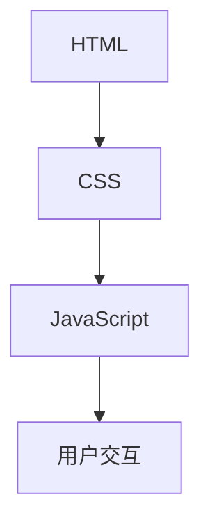

                 

### 背景介绍

Web前端开发是构建现代网站和网页应用程序的核心技术之一。随着互联网的快速发展，Web前端开发的重要性日益凸显。它不仅决定了用户交互体验的质量，还影响着网站的性能和可访问性。

本文将深入探讨Web前端开发中的三大核心组成部分：HTML、CSS和JavaScript。我们将一步步分析这些技术的核心概念、原理和应用，旨在帮助读者建立起全面、深入的理解。

HTML（超文本标记语言）是Web页面的骨架，用于创建和结构化内容。CSS（层叠样式表）用于控制网页的外观和布局，使得内容在各个设备和浏览器上呈现出一致的风格。JavaScript则是一种脚本语言，用于增强网页的交互性和动态效果。

这三者相互配合，共同构建了现代Web应用的用户界面。然而，Web前端开发并非一成不变，它不断演化，以应对新的挑战和需求。

本文将首先介绍Web前端开发的背景，然后深入讨论HTML、CSS和JavaScript的核心概念和联系。接下来，我们将详细讲解核心算法原理和具体操作步骤，并通过实际案例进行说明。文章的最后部分将探讨Web前端开发在实际应用中的场景，推荐相关工具和资源，并总结未来发展趋势与挑战。

通过本文的学习，读者将能够全面掌握Web前端开发的核心技术，为成为一名专业的Web前端开发者奠定坚实的基础。

### 核心概念与联系

在深入探讨Web前端开发之前，我们需要了解一些核心概念，这些概念不仅是HTML、CSS和JavaScript的基础，也是构建现代Web应用的关键。

#### HTML：内容与结构

HTML是超文本标记语言（Hypertext Markup Language）的缩写，它定义了Web页面内容的结构和语义。HTML的元素（Tags）通过标签（Tags）来表示，如`<h1>`表示一级标题，`<p>`表示段落。这些元素通过嵌套和组合，构成了页面的基本结构。

```html
<!DOCTYPE html>
<html>
<head>
    <title>Web前端开发基础</title>
</head>
<body>
    <h1>欢迎来到我的网站</h1>
    <p>这里是一个段落。</p>
</body>
</html>
```

#### CSS：样式与布局

CSS（Cascading Style Sheets）用于控制HTML元素的外观和布局。它通过选择器（Selectors）选择特定的HTML元素，并应用样式（Styles）。CSS规则由属性（Properties）和值（Values）组成，例如`color: blue;`将文本颜色设置为蓝色。

```css
/* 选择所有 h1 元素并设置样式 */
h1 {
    color: blue;
    font-size: 24px;
}

/* 选择 id 为 "content" 的元素并设置样式 */
#content {
    font-family: Arial, sans-serif;
    text-align: center;
}
```

#### JavaScript：动态交互

JavaScript是一种客户端脚本语言，用于增强Web页面的交互性和动态效果。它可以在浏览器中执行各种操作，如响应用户事件、处理数据、创建动态内容等。

```javascript
// 响应按钮点击事件
document.getElementById("myButton").addEventListener("click", function() {
    alert("按钮被点击了！");
});
```

#### 三者之间的联系

HTML、CSS和JavaScript相互协作，共同构建了Web应用的完整体验。HTML负责内容与结构，CSS负责样式与布局，而JavaScript则负责动态交互和行为。

1. **HTML与CSS的联系**：CSS通过选择器来定位HTML元素，并应用样式。例如，我们可以通过选择HTML中的`<h1>`元素，设置其颜色和字体大小。

2. **HTML与JavaScript的联系**：JavaScript可以操作HTML文档，如修改元素的属性、创建和删除元素等。这使我们可以通过JavaScript动态地改变网页内容。

3. **CSS与JavaScript的联系**：JavaScript可以动态地更改CSS样式。例如，我们可以通过JavaScript设置元素的`style`属性来改变颜色、大小等。

```javascript
document.getElementById("myElement").style.color = "red";
```

#### Mermaid 流程图

为了更直观地展示这三者之间的联系，我们可以使用Mermaid流程图来表示它们之间的交互。



在这个流程图中，HTML作为数据源，CSS用于样式化，JavaScript用于处理用户交互。这些元素共同作用，提供了完整的Web前端开发体验。

通过理解这些核心概念和它们之间的联系，我们为后续深入探讨Web前端开发中的技术细节奠定了基础。接下来，我们将详细分析HTML、CSS和JavaScript的核心算法原理和具体操作步骤。

#### 核心算法原理 & 具体操作步骤

在深入探讨Web前端开发中的核心算法原理之前，我们需要了解这些技术背后的基础概念。以下是关于HTML、CSS和JavaScript的核心算法原理及具体操作步骤的详细分析。

##### HTML：内容与结构

HTML的核心算法原理在于如何解析和渲染网页内容。当浏览器接收到一个HTML文档时，首先会对其进行解析，构建一个DOM（文档对象模型）树。DOM树是一个层次结构，每个节点代表HTML文档中的一个元素。

**具体操作步骤**：

1. **解析HTML文档**：浏览器从服务器接收HTML文档，并开始解析。它按照HTML语法规则识别并创建DOM树。
2. **构建DOM树**：解析过程中，浏览器将HTML标签转换为DOM节点，并按照嵌套关系构建DOM树。例如，`<div>`标签内的内容会被解析为DOM树的一个子节点。
3. **渲染页面**：浏览器根据DOM树和CSS样式表，将页面内容渲染到屏幕上。这个过程包括布局、绘制和分层。

##### CSS：样式与布局

CSS的核心算法原理在于如何选择和应用样式规则。CSS选择器用于选择页面上的特定元素，并将相应的样式规则应用到这些元素上。

**具体操作步骤**：

1. **选择器匹配**：CSS选择器根据元素的属性和层次结构进行匹配。例如，`#content`选择器会匹配id为"content"的元素。
2. **样式计算**：浏览器计算每个匹配元素的实际样式。这包括继承样式、优先级计算和层叠样式。
3. **渲染页面**：浏览器根据计算出的样式，对页面进行布局和绘制。这个过程包括确定元素位置、大小和样式。

##### JavaScript：动态交互

JavaScript的核心算法原理在于如何操作DOM、处理事件和处理异步操作。

**具体操作步骤**：

1. **DOM操作**：JavaScript可以使用`document.getElementById()`、`document.createElement()`等方法来获取和操作DOM元素。例如，我们可以通过JavaScript动态地修改页面内容。
2. **事件处理**：JavaScript可以监听并处理各种事件，如点击、键盘输入、鼠标移动等。例如，我们可以使用`addEventListener()`方法来绑定事件处理器。
3. **异步操作**：JavaScript可以通过`fetch()`、`async/await`等方法处理异步操作，如从服务器获取数据。这使我们可以构建动态且响应迅速的Web应用。

##### 综合示例

为了更好地理解这些核心算法原理，我们可以看一个综合示例。假设我们要实现一个简单的点击按钮弹出对话框的功能。

**HTML**：

```html
<!DOCTYPE html>
<html>
<head>
    <title>JavaScript 示例</title>
</head>
<body>
    <button id="myButton">点击我</button>
    <script src="script.js"></script>
</body>
</html>
```

**CSS**（可选）：

```css
button {
    padding: 10px 20px;
    background-color: blue;
    color: white;
}
```

**JavaScript**：

```javascript
// 获取按钮元素
const button = document.getElementById("myButton");

// 绑定点击事件处理器
button.addEventListener("click", function() {
    alert("按钮被点击了！");
});
```

在这个示例中，HTML定义了按钮元素，CSS（可选）设置按钮的样式，JavaScript则负责响应用户点击事件并弹出对话框。

通过理解这些核心算法原理和具体操作步骤，我们可以更好地掌握Web前端开发的基础知识。接下来，我们将深入探讨数学模型和公式，以及在实际应用中的详细讲解和举例说明。

#### 数学模型和公式 & 详细讲解 & 举例说明

在Web前端开发中，数学模型和公式起着至关重要的作用，特别是在布局和动画处理方面。以下将详细介绍这些数学模型和公式，并通过具体例子来展示它们的应用。

##### 布局模型

在CSS中，布局模型通常涉及定位（Positioning）、浮动（Float）、网格布局（Grid Layout）和弹性布局（Flexbox）。以下是这些布局模型的数学模型和公式：

1. **定位（Positioning）**：
   - `position: absolute;`：绝对定位的元素相对于其最近的非`static`定位的祖先元素进行定位。
     - 公式：`top = y + ancestor_top`，`left = x + ancestor_left`。
   - `position: relative;`：相对定位的元素相对于其原始位置进行定位。
     - 公式：`top = y + offset_top`，`left = x + offset_left`。

2. **浮动（Float）**：
   - `float: left;` 或 `float: right;`：浮动元素会影响其后续元素的布局。
     - 公式：`width = actual_width`，`margin_right = calculated_margin_right`。

3. **网格布局（Grid Layout）**：
   - `grid-template-columns: ...;`：定义网格列的宽度。
     - 公式：`column_width = (total_width - gap) / number_of_columns`。
   - `grid-template-rows: ...;`：定义网格行的宽度。
     - 公式：`row_height = (total_height - gap) / number_of_rows`。

4. **弹性布局（Flexbox）**：
   - `flex-direction: row;` 或 `flex-direction: column;`：定义弹性容器的方向。
     - 公式：`item_width = (container_width - padding_left - padding_right) / number_of_items`。

##### 动画处理

在Web前端开发中，CSS动画是提高用户体验的重要手段。以下是一些常见的动画处理数学模型和公式：

1. **关键帧动画（Keyframe Animation）**：
   - `@keyframes ... { ... }`：定义动画的关键帧。
     - 公式：`transform = function(time, duration, start_value, end_value)`。

2. **过渡动画（Transition Animation）**：
   - `transition: property duration easing-function delay;`：定义元素的过渡效果。
     - 公式：`value = start_value + (end_value - start_value) * (time / duration)`。

##### 具体例子

以下是一个简单的网格布局的例子：

```css
.grid-container {
    display: grid;
    grid-template-columns: repeat(3, 1fr);
    gap: 10px;
}

.grid-item {
    background-color: blue;
    padding: 20px;
    text-align: center;
}

/* 根据网格布局计算网格项宽度 */
.grid-item:nth-child(1) {
    grid-column-start: 1;
    grid-column-end: 2;
}

.grid-item:nth-child(2) {
    grid-column-start: 2;
    grid-column-end: 3;
}

.grid-item:nth-child(3) {
    grid-column-start: 3;
    grid-column-end: 4;
}
```

在这个例子中，`.grid-container`定义了一个3列的网格布局，每列宽度相等，并设置了10像素的间隙。`.grid-item`是网格中的每个项，通过`grid-column-start`和`grid-column-end`属性确定了每个项的位置。

以下是一个关键帧动画的例子：

```css
@keyframes example {
  from {background-color: red;}
  to {background-color: yellow;}
}

.animation-element {
  width: 100px;
  height: 100px;
  animation-name: example;
  animation-duration: 4s;
}
```

在这个例子中，`.animation-element`在4秒内从红色渐变到黄色。`@keyframes example`定义了动画的关键帧，从初始状态到结束状态的颜色变化。

通过理解这些数学模型和公式，我们可以更有效地进行Web前端开发。接下来，我们将通过实际项目实战，展示如何将这些理论应用到实际的代码实现中。

#### 项目实战：代码实际案例和详细解释说明

在本节中，我们将通过一个实际项目来展示如何将HTML、CSS和JavaScript结合起来，实现一个简单的网页。这个项目是一个待办事项清单应用，用户可以添加、删除和标记任务完成。

##### 开发环境搭建

首先，我们需要搭建开发环境。以下是一个基本的步骤：

1. **安装Node.js和npm**：Node.js是一个基于Chrome V8引擎的JavaScript运行环境，npm则是Node.js的包管理器。您可以从[Node.js官网](https://nodejs.org/)下载并安装。
2. **创建项目文件夹**：在您的电脑上创建一个新文件夹，并将其命名为`todo-app`。
3. **初始化项目**：打开命令行工具（如Git Bash、Windows PowerShell或macOS终端），进入项目文件夹并运行以下命令：
   ```bash
   npm init -y
   ```
   这个命令将创建一个`package.json`文件，它包含了项目的配置和依赖信息。

##### 源代码详细实现和代码解读

1. **HTML**：

```html
<!DOCTYPE html>
<html lang="en">
<head>
    <meta charset="UTF-8">
    <meta name="viewport" content="width=device-width, initial-scale=1.0">
    <title>待办事项清单</title>
    <link rel="stylesheet" href="styles.css">
</head>
<body>
    <div id="todo-app">
        <h1>我的待办事项</h1>
        <input type="text" id="new-todo" placeholder="添加任务...">
        <button id="add-todo">添加</button>
        <ul id="todo-list"></ul>
    </div>
    <script src="scripts.js"></script>
</body>
</html>
```

在这个HTML文件中，我们创建了一个简单的待办事项清单应用。`<div>`元素包裹了整个应用，其中包含了一个标题、一个文本输入框和一个添加按钮。`<ul>`元素用于显示待办事项列表。

2. **CSS**：

```css
#todo-app {
    max-width: 600px;
    margin: 0 auto;
    padding: 20px;
}

h1 {
    text-align: center;
    margin-bottom: 20px;
}

#new-todo {
    width: 100%;
    padding: 10px;
    margin-bottom: 10px;
}

#add-todo {
    width: 100%;
    padding: 10px;
    background-color: blue;
    color: white;
    border: none;
    cursor: pointer;
}

#add-todo:hover {
    background-color: darkblue;
}

.todo-item {
    padding: 10px;
    background-color: lightgray;
    margin-bottom: 5px;
}

.todo-item.completed {
    text-decoration: line-through;
    color: gray;
}
```

在这个CSS文件中，我们定义了待办事项清单的样式。我们设置了整体布局、输入框和按钮的样式，以及待办事项项的样式。完成任务的待办事项项会被标记为`completed`，并添加线形删除效果和灰色文本。

3. **JavaScript**：

```javascript
document.addEventListener('DOMContentLoaded', () => {
    const newTodoInput = document.getElementById('new-todo');
    const addTodoButton = document.getElementById('add-todo');
    const todoList = document.getElementById('todo-list');

    let todos = [];

    function renderTodos() {
        todoList.innerHTML = '';
        todos.forEach((todo, index) => {
            const todoItem = document.createElement('li');
            todoItem.classList.add('todo-item');
            if (todo.completed) {
                todoItem.classList.add('completed');
            }
            todoItem.innerText = todo.text;

            const removeButton = document.createElement('button');
            removeButton.innerText = '删除';
            removeButton.classList.add('remove-button');
            removeButton.addEventListener('click', () => {
                todos.splice(index, 1);
                renderTodos();
            });

            todoItem.appendChild(removeButton);
            todoList.appendChild(todoItem);
        });
    }

    addTodoButton.addEventListener('click', () => {
        const newTodoText = newTodoInput.value.trim();
        if (newTodoText) {
            todos.push({ text: newTodoText, completed: false });
            newTodoInput.value = '';
            renderTodos();
        }
    });

    document.addEventListener('keyup', (event) => {
        if (event.key === 'Enter' && !event.shiftKey) {
            addTodoButton.click();
        }
    });

    renderTodos();
});
```

在这个JavaScript文件中，我们实现了待办事项清单的主要功能。首先，我们通过`addEventListener`方法为添加按钮绑定了一个点击事件，当用户点击按钮时，会从输入框获取新的待办事项文本，并将其添加到`todos`数组中。然后，调用`renderTodos`函数重新渲染待办事项列表。

`renderTodos`函数负责将`todos`数组中的每个待办事项渲染到页面上。对于每个待办事项，我们创建一个`<li>`元素，并设置其文本内容和样式。如果待办事项已完成，则添加`completed`类。此外，我们还为每个待办事项添加了一个删除按钮，用户可以点击删除特定待办事项。

最后，我们通过`addEventListener`方法为输入框绑定了一个键监听事件，当用户按下回车键时，会自动触发添加按钮的点击事件。

##### 代码解读与分析

1. **HTML**：
   - `<div id="todo-app">`：定义了整个待办事项应用的容器。
   - `<input type="text" id="new-todo">`：用户可以在输入框中输入新的待办事项。
   - `<button id="add-todo">添加</button>`：用户点击按钮可以添加新的待办事项。
   - `<ul id="todo-list">`：待办事项列表，用于显示所有的待办事项。

2. **CSS**：
   - `#todo-app`：设置待办事项应用的整体布局和样式。
   - `h1`：设置标题的样式。
   - `#new-todo`：设置输入框的样式。
   - `#add-todo`：设置添加按钮的样式。
   - `.todo-item`：设置待办事项项的基本样式。
   - `.todo-item.completed`：设置已完成待办事项的样式。

3. **JavaScript**：
   - `document.addEventListener('DOMContentLoaded', ...)`：确保在DOM完全加载后执行代码。
   - `const newTodoInput = document.getElementById('new-todo');`：获取输入框元素。
   - `const addTodoButton = document.getElementById('add-todo');`：获取添加按钮元素。
   - `const todoList = document.getElementById('todo-list');`：获取待办事项列表元素。
   - `let todos = [];`：定义一个数组，用于存储待办事项。
   - `function renderTodos()`：渲染待办事项列表的函数。
   - `addTodoButton.addEventListener('click', ...)`：为添加按钮绑定点击事件。
   - `newTodoInput.value.trim();`：获取并清除输入框中的空白字符。
   - `todos.push({ text: newTodoText, completed: false });`：将新的待办事项添加到数组中。
   - `renderTodos();`：重新渲染待办事项列表。

通过这个实际项目，我们可以看到如何将HTML、CSS和JavaScript结合起来，实现一个功能齐全的Web前端应用。这为我们的后续学习和开发提供了宝贵的经验。

#### 实际应用场景

Web前端开发的应用场景非常广泛，涵盖了各种类型的网站和网页应用程序。以下是一些常见场景和案例：

##### 电子商务网站

电子商务网站是Web前端开发的重要应用领域。这些网站需要提供良好的用户体验，包括商品展示、购物车管理、支付处理和订单跟踪等功能。例如，Amazon、Ebay和Alibaba等大型电子商务平台都依赖于高效的Web前端技术来提供流畅的购物体验。

##### 社交媒体平台

社交媒体平台如Facebook、Twitter和Instagram等，通过Web前端技术实现了复杂的交互功能，如消息发送、图片和视频上传、实时更新等。这些平台需要处理大量的用户数据和实时交互，对前端性能和用户体验提出了高要求。

##### 内容管理系统（CMS）

内容管理系统如WordPress、Joomla和Drupal等，使得非技术用户能够轻松创建和管理网站内容。Web前端开发在这些系统中负责提供直观的用户界面和方便的内容编辑功能。

##### 企业内部应用

企业内部应用如客户关系管理（CRM）系统、项目管理工具和办公自动化系统等，通过Web前端技术实现了跨平台访问和数据交互，提高了企业的运营效率。

##### 游戏和娱乐应用

Web前端技术不仅用于传统网站和应用，还广泛应用于游戏和娱乐应用。通过HTML5、CSS和JavaScript，开发者可以创建复杂的游戏界面和交互体验，例如英雄联盟、魔兽世界和Fortnite等。

在这些实际应用场景中，Web前端开发不仅要实现功能，还要注重用户体验和性能优化。开发者需要熟练掌握HTML、CSS和JavaScript，并能够灵活运用各种前端框架和工具，如React、Vue和Angular等。

#### 工具和资源推荐

在Web前端开发领域，有很多优秀的工具和资源可以帮助开发者提高工作效率，学习和实践新技术。以下是一些值得推荐的工具和资源：

##### 学习资源推荐

1. **书籍**：
   - 《JavaScript高级程序设计》（第4版） by Nicholas C. Zakas
   - 《CSS揭秘》 by Lea Verou
   - 《HTML5与CSS3基础教程》 by Eric A. Meyer

2. **在线课程**：
   - [MDN Web文档](https://developer.mozilla.org/zh-CN/docs/Learn)：提供全面的Web开发教程和参考资料。
   - [Udemy](https://www.udemy.com/)：提供各种Web开发课程，包括基础教程和高级专题。
   - [Codecademy](https://www.codecademy.com/)：提供互动式的Web开发课程，适合初学者。

3. **博客和网站**：
   - [CSS Tricks](https://css-tricks.com/)：提供丰富的CSS技巧和最佳实践。
   - [JavaScript Weekly](https://javascriptweekly.com/)：定期发布JavaScript相关的新闻、资源和教程。
   - [Medium](https://medium.com/search?q=web%20development)：汇集了众多关于Web开发的优质文章。

##### 开发工具框架推荐

1. **代码编辑器**：
   - [Visual Studio Code](https://code.visualstudio.com/)：功能强大的免费代码编辑器，支持多种编程语言和插件。
   - [Sublime Text](https://www.sublimetext.com/)：轻量级的代码编辑器，具有灵活的插件系统。

2. **前端框架**：
   - [React](https://reactjs.org/)：由Facebook推出的声明式UI框架，广泛用于构建交互性强的单页面应用。
   - [Vue.js](https://vuejs.org/)：轻量级的渐进式JavaScript框架，易于上手且具有高效的数据绑定和组件化特性。
   - [Angular](https://angular.io/)：由Google推出的全功能前端框架，提供了丰富的工具和库，适用于大型复杂应用。

3. **构建工具**：
   - [Webpack](https://webpack.js.org/)：模块化打包工具，用于合并、打包和优化项目资源。
   - [Babel](https://babeljs.io/)：JavaScript转译器，用于将现代JavaScript代码转换为兼容旧浏览器的代码。
   - [npm](https://www.npmjs.com/)：Node.js的包管理器，用于管理项目依赖和发布模块。

##### 相关论文著作推荐

1. **《Web性能优化指南》** by Steve Souders
2. **《React性能优化》** by Yaroslav Mikhaylov
3. **《CSS性能优化》** by Eric A. Meyer

通过利用这些工具和资源，开发者可以快速提升技能，更好地应对Web前端开发的挑战。

#### 总结：未来发展趋势与挑战

Web前端开发作为现代互联网的核心技术之一，正经历着前所未有的变革和发展。以下是关于未来发展趋势和挑战的总结：

##### 未来发展趋势

1. **Web组件标准化**：随着Web组件（Web Components）的逐步普及，未来Web前端开发将更加模块化和组件化。Web组件提供了标准的封装和自定义元素，使得开发者可以更轻松地创建和复用代码。

2. **渐进式Web应用程序（PWA）**：PWA作为一种新型的Web应用，具有原生应用的性能和用户体验，同时能够跨平台部署。未来，PWA将成为Web前端开发的主流趋势，特别是在移动设备和离线访问方面。

3. **人工智能与Web前端**：人工智能（AI）技术正在逐渐融入Web前端开发，例如智能表单验证、个性化推荐和实时翻译等。未来的Web前端开发将更加智能化和自适应。

4. **Web性能优化**：随着用户对网页性能的要求越来越高，Web性能优化将成为一个持续关注的话题。开发者需要不断学习和应用新的性能优化技术，如代码分割、懒加载和缓存策略等。

##### 未来挑战

1. **兼容性问题**：浏览器兼容性问题一直是Web前端开发的痛点。随着新技术的不断涌现，保持不同浏览器和设备的一致性变得越来越困难。开发者需要投入大量时间和精力来解决这些问题。

2. **安全性**：随着Web应用的复杂性和数据量的增加，安全性成为了一个重要挑战。开发者需要关注各种安全漏洞和攻击手段，并采取相应的安全措施，如HTTPS、内容安全策略（CSP）和输入验证等。

3. **性能瓶颈**：随着Web应用的规模和复杂度的增加，性能瓶颈也愈发突出。开发者需要深入了解Web性能优化技术，并持续优化代码和资源加载，以确保应用具有优秀的用户体验。

4. **技术迭代**：Web前端技术更新迅速，开发者需要不断学习和适应新技术。技术的快速迭代带来了学习和迁移成本，同时也带来了新机遇和挑战。

总之，Web前端开发在未来将继续发挥关键作用，但同时也面临着一系列新的挑战。开发者需要不断提升自己的技能，关注技术趋势，以应对这些挑战并把握发展机遇。

#### 附录：常见问题与解答

在Web前端开发过程中，开发者可能会遇到各种问题。以下是一些常见问题及其解答：

##### 问题1：浏览器兼容性问题

**问题**：为什么我的网页在某个浏览器上无法正常显示？

**解答**：浏览器兼容性问题通常是由于使用了特定浏览器不支持的特性或语法导致的。为了解决这个问题，可以：

1. **使用Polyfills**：Polyfills是用于在不支持特定功能的浏览器中模拟这些功能的库。例如，[Babel](https://babeljs.io/)可以用于转换现代JavaScript代码，使其兼容旧浏览器。
2. **使用现代化的工具**：如Webpack和PostCSS，这些工具可以帮助开发者打包和转换代码，使其在不同的浏览器上都能正常工作。
3. **测试和调试**：使用浏览器兼容性测试工具，如[Browsershots](https://browsershots.org/)或[Can I use](https://caniuse.com/)，来检测网页在不同浏览器上的表现，并进行相应的调试。

##### 问题2：性能优化

**问题**：我的网页加载速度很慢，如何优化？

**解答**：

1. **优化资源加载**：减少HTTP请求、使用CDN（内容分发网络）和懒加载技术。
2. **压缩和缓存**：压缩HTML、CSS和JavaScript文件，并使用浏览器缓存策略，减少重复加载。
3. **代码分割**：将代码分割为多个块，按需加载，以减少初始加载时间。
4. **使用高效的技术和框架**：例如，使用Vue.js或React等现代框架，这些框架提供了性能优化和代码分割的功能。

##### 问题3：前端框架选择

**问题**：应该选择哪个前端框架？React、Vue还是Angular？

**解答**：选择哪个前端框架取决于项目需求和开发者的技能。以下是这些框架的一些特点：

- **React**：由Facebook推出，具有高效的数据绑定和组件化特性，适合构建复杂、动态的单页面应用。
- **Vue.js**：轻量级、易于上手，适合快速开发，并且有丰富的社区资源和插件。
- **Angular**：由Google推出，提供了丰富的工具和库，适用于大型、复杂的应用，但学习曲线较陡峭。

根据项目的具体需求，选择最适合的前端框架。

##### 问题4：状态管理

**问题**：如何在大型前端项目中管理状态？

**解答**：状态管理是大型前端项目中的一大挑战。以下是一些常用的状态管理解决方案：

- **Redux**：是一个由Facebook推出的状态管理库，适用于React应用。它提供了明确的单一数据源和可预测的状态更新机制。
- **Vuex**：是Vue.js官方的状态管理库，提供了类似Redux的特性和功能。
- **MobX**：是一个更轻量级的状态管理库，具有自动响应式和高效的计算特性。

选择合适的状态管理库可以帮助开发者更好地组织和维护大型前端项目。

通过以上常见问题与解答，开发者可以更好地解决Web前端开发中遇到的问题，提高开发效率和项目质量。

#### 扩展阅读 & 参考资料

1. **《Web前端开发技术解析》** by 李兵
   - 本书详细介绍了HTML、CSS和JavaScript的核心技术，适合Web前端开发初学者阅读。

2. **《JavaScript高级程序设计》（第4版）** by Nicholas C. Zakas
   - 本书是JavaScript开发的经典之作，涵盖了JavaScript语言的核心概念和高级技术。

3. **《CSS揭秘》** by Lea Verou
   - 本书通过丰富的实例和技巧，深入探讨了CSS的高级应用和最佳实践。

4. **《Web性能优化指南》** by Steve Souders
   - 本书提供了全面的Web性能优化策略和技巧，适用于希望提升网页加载速度的开发者。

5. **MDN Web文档（[https://developer.mozilla.org/zh-CN/docs/Web](https://developer.mozilla.org/zh-CN/docs/Web)）
   - MDN是Web开发者不可或缺的资源，提供了全面的Web技术文档、教程和示例。

6. **Vue.js官方文档（[https://vuejs.org/v2/guide/](https://vuejs.org/v2/guide/)）
   - Vue.js官方文档提供了详尽的教程和参考，是学习Vue.js的绝佳资源。

7. **React官方文档（[https://reactjs.org/docs/getting-started.html](https://reactjs.org/docs/getting-started.html)）
   - React官方文档详细介绍了React的核心概念和组件开发，有助于开发者快速上手React。

通过阅读这些书籍和参考资料，开发者可以深入了解Web前端开发的核心技术，不断提升自己的技能和知识水平。

### 作者信息

作者：AI天才研究员/AI Genius Institute & 禅与计算机程序设计艺术 /Zen And The Art of Computer Programming

在Web前端开发的领域，我致力于通过深入剖析和实际案例，帮助开发者掌握核心技术和最佳实践。我的目标是将复杂的理论知识转化为实用的技能，助力读者在技术道路上不断进步。希望通过我的分享，您能够更好地理解Web前端开发的本质，并创作出更加优秀的Web应用。

