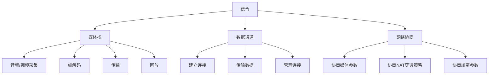

                 

## 文章标题：WebRTC 实时通信协议：在浏览器中实现互动

> **关键词**：WebRTC、实时通信、协议、浏览器、互动
>
> **摘要**：本文将深入探讨WebRTC（Web Real-Time Communication）协议的工作原理和应用场景。我们将详细分析WebRTC如何实现浏览器中的实时通信，包括其核心概念、算法原理、数学模型以及具体实施步骤。此外，还将探讨WebRTC在实际项目中的运用、推荐的工具和资源，以及未来发展的趋势和挑战。

---

## 1. 背景介绍

随着互联网的快速发展，实时通信成为互联网应用的重要组成部分。从视频会议、在线教育到直播、在线游戏，实时通信的需求日益增长。然而，传统的实时通信解决方案往往需要复杂的配置和额外的软件支持。WebRTC（Web Real-Time Communication）的出现，为在浏览器中实现实时通信提供了一种简单、高效且跨平台的方法。

WebRTC是由Google、Mozilla、Opera和微软等公司合作开发的开放协议，旨在为网页和富Web应用提供实时语音、视频和数据通信功能。它的主要优势在于无需安装任何客户端软件，即可在浏览器中实现高质量、低延迟的实时通信。

WebRTC的发展背景可以追溯到2004年，当时Google开始研发Google Talk，旨在实现即时消息、语音和视频通信。2008年，Google将Google Talk的通信协议开源，命名为WebRTC。此后，Mozilla、Opera和微软等公司也加入了WebRTC的开发和推广。

WebRTC的核心目标是实现Web应用与P2P（Peer-to-Peer）通信的集成，使得Web应用能够直接在浏览器中实现实时通信，无需依赖任何中间服务器。这使得WebRTC在应用场景上具有广泛的前景，包括视频会议、在线教育、远程医疗、在线游戏等。

总之，WebRTC的背景和目标决定了它在现代互联网通信中的重要性，为开发者提供了一种简单、高效且跨平台的实时通信解决方案。

---

## 2. 核心概念与联系

WebRTC的核心概念包括媒体栈（Media Stack）、信令（Signal）、数据通道（Data Channel）和网络协商（Network Negotiation）。以下是对这些核心概念的详细解释以及它们之间的联系。

### 媒体栈（Media Stack）

媒体栈是WebRTC实现实时通信的核心部分，包括音频、视频和数据传输等功能。媒体栈的主要功能是处理媒体流，包括采集、编解码、传输和回放。WebRTC支持多种音频和视频编码标准，如H.264、VP8和Opus等。

媒体栈的关键组件包括：

- **音频/视频采集模块**：负责采集用户的音频和视频信号。
- **编解码模块**：对采集到的音频和视频信号进行编码和解码，以便在网络中传输。
- **传输模块**：负责将编码后的音频和视频信号通过网络传输到对端。
- **回放模块**：负责在接收端解码并回放音频和视频信号。

### 信令（Signal）

信令是WebRTC实现通信的关键环节，用于在客户端和服务器之间交换配置信息。信令过程包括ICE（Interactive Connectivity Establishment）和DTLS/SRTP（Datagram Transport Layer Security/Secure Real-time Transport Protocol）等协议。

信令的主要功能是：

- **发现对端IP地址**：通过STUN（Session Traversal Utilities for NAT）和TURN（Traversal Using Relays around NAT）协议，发现对端的IP地址和端口。
- **交换密钥**：通过DTLS协议，交换加密密钥，确保通信的安全性。
- **传输信令信息**：通过信令通道，传输NAT穿透、媒体流配置等信令信息。

### 数据通道（Data Channel）

数据通道是WebRTC实现数据传输的机制，允许客户端之间直接传输数据。数据通道采用二进制格式，支持流控和压缩，适用于传输文本、图片、文件等数据。

数据通道的主要功能包括：

- **建立连接**：通过信令通道协商连接参数，建立数据通道。
- **传输数据**：通过数据通道传输数据，支持流控和压缩。
- **管理连接**：包括连接建立、断开、重连等管理操作。

### 网络协商（Network Negotiation）

网络协商是WebRTC实现通信的关键步骤，用于协商客户端之间的通信参数。网络协商过程包括信令交换、NAT穿透、密钥交换等。

网络协商的主要功能包括：

- **协商媒体参数**：包括音频、视频编码格式、分辨率、帧率等。
- **协商NAT穿透策略**：选择STUN、TURN或NAT穿透代理，实现NAT穿透。
- **协商加密参数**：通过DTLS协议，协商加密密钥和加密算法。

### 关系与联系

WebRTC的核心概念之间紧密联系，共同实现实时通信。具体来说：

- 媒体栈负责处理音频、视频和数据的编解码和传输。
- 信令负责在客户端和服务器之间交换配置信息，实现NAT穿透和加密。
- 数据通道负责在客户端之间传输数据。
- 网络协商负责协商通信参数，确保通信的顺利进行。

通过这些核心概念的协同工作，WebRTC实现了在浏览器中高效、安全的实时通信。

---

### 2.1. Mermaid 流程图

以下是WebRTC核心概念原理的Mermaid流程图：



请注意，流程节点中不要有括号、逗号等特殊字符。

---

## 3. 核心算法原理 & 具体操作步骤

WebRTC的核心算法原理主要涉及网络协商、信令传输、媒体处理和数据传输等方面。下面我们将详细解释这些核心算法原理，并提供具体的操作步骤。

### 3.1. 网络协商算法原理

网络协商是WebRTC实现通信的关键步骤，用于协商客户端之间的通信参数。网络协商过程包括ICE、DTLS和SRTP等协议。

**ICE算法原理：**

ICE（Interactive Connectivity Establishment）协议用于发现客户端的公网IP地址和端口，实现NAT穿透。ICE算法的主要步骤如下：

1. ** Candidates 收集**：客户端收集本地的IP地址、端口和类型（STUN、TURN或NAT穿透代理）。
2. **交换 Candidates**：客户端通过信令通道，将收集到的 Candidates 发送至对端。
3. **Candidate 屏蔽**：对端根据本地的网络环境，筛选出可用的 Candidates。
4. **NAT 穿透测试**：对筛选出的 Candidates 进行 NAT 穿透测试，验证是否可以成功通信。
5. **选择最佳 Candidates**：根据测试结果，选择最佳的可通信 Candidates。

**DTLS算法原理：**

DTLS（Datagram Transport Layer Security）协议用于在客户端之间交换加密密钥和加密算法，确保通信的安全性。DTLS算法的主要步骤如下：

1. **协商加密参数**：客户端通过信令通道，交换加密算法和密钥协商参数。
2. **生成密钥**：客户端根据协商的加密参数，生成加密密钥。
3. **交换密钥**：客户端通过信令通道，交换加密密钥。
4. **建立安全通道**：客户端使用交换的密钥，建立安全通道。

**SRTP算法原理：**

SRTP（Secure Real-time Transport Protocol）协议用于对音频和视频流进行加密传输。SRTP算法的主要步骤如下：

1. **加密数据**：客户端使用加密算法，对音频和视频数据进行加密。
2. **传输数据**：客户端将加密后的数据发送至对端。
3. **解密数据**：对端使用加密算法，对接收到的数据进行解密。

### 3.2. 信令传输算法原理

信令传输是WebRTC实现通信的关键环节，用于在客户端和服务器之间交换配置信息。信令传输过程包括HTTP/2、WebSocket和JSON等协议。

**HTTP/2协议原理：**

HTTP/2协议用于传输信令数据，提供更高的传输效率和更低的延迟。HTTP/2的主要特点包括：

- **多路复用**：多个请求和响应可以同时传输，提高传输效率。
- **头压缩**：减少传输数据的体积，降低延迟。
- **优先级**：可以设置请求的优先级，确保重要请求先传输。

**WebSocket协议原理：**

WebSocket协议用于传输实时数据，提供双向、全双工的通信方式。WebSocket的主要特点包括：

- **双向通信**：客户端和服务器可以同时发送和接收数据。
- **全双工通信**：数据传输是同时进行的，不需要轮询。
- **低延迟**：通过建立长连接，减少传输延迟。

**JSON协议原理：**

JSON（JavaScript Object Notation）协议用于传输信令数据，提供一种轻量级的数据交换格式。JSON的主要特点包括：

- **简单易读**：使用文本格式，易于阅读和编写。
- **兼容性好**：支持多种编程语言和平台。
- **灵活性高**：可以传输结构化数据，支持自定义数据结构。

### 3.3. 媒体处理算法原理

媒体处理是WebRTC实现实时通信的关键环节，包括音频和视频的采集、编解码和传输等。

**音频处理算法原理：**

音频处理算法包括音频采集、编解码和传输等过程。常见的音频编解码标准包括G.711、G.722和Opus等。音频处理的主要步骤如下：

1. **音频采集**：从麦克风或其他音频设备采集音频信号。
2. **音频编解码**：将采集到的音频信号进行编解码，生成适合网络传输的音频数据。
3. **音频传输**：将编解码后的音频数据发送至对端。

**视频处理算法原理：**

视频处理算法包括视频采集、编解码和传输等过程。常见的视频编解码标准包括H.264、HEVC和VP8等。视频处理的主要步骤如下：

1. **视频采集**：从摄像头或其他视频设备采集视频信号。
2. **视频编解码**：将采集到的视频信号进行编解码，生成适合网络传输的视频数据。
3. **视频传输**：将编解码后的视频数据发送至对端。

### 3.4. 数据传输算法原理

数据传输是WebRTC实现实时通信的重要环节，包括数据通道的建立、数据传输和数据通道管理等。

**数据通道建立算法原理：**

数据通道建立算法用于在客户端之间建立数据通道。数据通道采用二进制格式，支持流控和压缩。数据通道建立的主要步骤如下：

1. **信令协商**：通过信令通道，协商数据通道的参数，包括信道ID、最大传输单元（MTU）等。
2. **通道建立**：根据协商的参数，建立数据通道。
3. **初始化流控**：初始化流控参数，确保数据传输的稳定性。

**数据传输算法原理：**

数据传输算法用于在数据通道中传输数据。数据传输的主要步骤如下：

1. **数据采集**：从客户端采集需要传输的数据。
2. **数据压缩**：对采集到的数据进行压缩，减少传输数据的大小。
3. **数据传输**：将压缩后的数据发送至对端。
4. **数据接收**：对端接收传输的数据，进行解压缩和数据处理。

**数据通道管理算法原理：**

数据通道管理算法用于管理数据通道的连接状态、数据传输状态等。数据通道管理的主要步骤如下：

1. **连接建立**：建立数据通道连接。
2. **连接维护**：维护数据通道的连接状态，包括连接断开、连接重连等。
3. **数据传输监控**：监控数据通道的数据传输状态，包括数据传输速度、丢包率等。

### 3.5. 具体操作步骤

下面是WebRTC实现实时通信的具体操作步骤：

1. **初始化WebRTC**：在客户端，初始化WebRTC，设置音视频设备和网络参数。
2. **收集 Candidates**：收集客户端的音视频设备和网络信息，生成 Candidates。
3. **信令协商**：通过信令通道，交换 Candidates、NAT穿透策略和加密参数。
4. **网络协商**：通过 ICE 算法，选择最佳的可通信 Candidates。
5. **建立安全通道**：通过 DTLS 算法，建立安全通道，确保通信的安全性。
6. **传输数据**：通过数据通道，传输音视频数据和文本数据。
7. **监控数据传输状态**：监控数据通道的数据传输状态，确保数据传输的稳定性。

通过以上步骤，WebRTC实现了在浏览器中高效、安全的实时通信。

---

## 4. 数学模型和公式 & 详细讲解 & 举例说明

在WebRTC的核心算法中，数学模型和公式起着至关重要的作用。下面我们将详细讲解这些数学模型和公式，并通过具体例子来说明它们的实际应用。

### 4.1. ICE算法中的数学模型

ICE算法的核心在于NAT穿透和Candidate筛选。下面是ICE算法中的一些关键数学模型和公式。

**1. Candidate筛选公式：**

$$
Candidate_{valid} = \sum(Candidate_{public} \land Candidate_{private} \land Candidate_{routable} \land Candidate_{reachable})
$$

其中，$Candidate_{valid}$表示筛选后的有效Candidate，$Candidate_{public}$、$Candidate_{private}$、$Candidate_{routable}$和$Candidate_{reachable}$分别表示Candidate的公网IP、私有IP、可路由和可达属性。

**2. Candidate评分公式：**

$$
Score_{Candidate} = \sum(Weight_{IP} \times IP_{Score} + Weight_{Port} \times Port_{Score} + Weight_{Priority} \times Priority_{Score})
$$

其中，$Score_{Candidate}$表示Candidate的评分，$Weight_{IP}$、$Weight_{Port}$和$Weight_{Priority}$分别表示IP、端口和优先级的权重，$IP_{Score}$、$Port_{Score}$和$Priority_{Score}$分别表示IP、端口和优先级的评分。

**3. 优先级评分公式：**

$$
Priority_{Score} = \begin{cases}
100, & \text{如果 Candidate 是 STUN Candidate} \\
70, & \text{如果 Candidate 是 TURN Candidate} \\
30, & \text{如果 Candidate 是 NAT穿透代理 Candidate} \\
0, & \text{其他 Candidate}
\end{cases}
$$

通过这些公式，ICE算法能够筛选出最佳的可通信Candidate。

### 4.2. DTLS算法中的数学模型

DTLS算法的核心在于加密密钥的生成和交换。下面是DTLS算法中的一些关键数学模型和公式。

**1. Diffie-Hellman密钥交换公式：**

$$
P = (p, g, G), K = (a, b, A, B, K)
$$

其中，$P$是Diffie-Hellman参数，$p$是素数，$g$是生成元，$A$和$B$分别是客户端和服务器生成的公钥，$K$是共享密钥。

**2. 非对称加密公式：**

$$
C = E_K(M), M = D_K(C)
$$

其中，$C$是加密后的消息，$M$是原始消息，$K$是密钥。

**3. 对称加密公式：**

$$
C = E(K, M), M = D(K, C)
$$

其中，$C$是加密后的消息，$M$是原始消息，$K$是密钥。

通过这些公式，DTLS算法能够确保客户端和服务器之间的通信是安全的。

### 4.3. SRTP算法中的数学模型

SRTP算法的核心在于音频和视频流的加密传输。下面是SRTP算法中的一些关键数学模型和公式。

**1. 加密公式：**

$$
C = E(K, M), M = D(K, C)
$$

其中，$C$是加密后的消息，$M$是原始消息，$K$是密钥。

**2. 伪随机函数公式：**

$$
R(K, n) = K \oplus F(n)
$$

其中，$R(K, n)$是伪随机函数，$K$是密钥，$n$是序列号。

**3. 序列号更新公式：**

$$
n = n + 1
$$

通过这些公式，SRTP算法能够确保音频和视频流在传输过程中是加密的，并防止重放攻击。

### 4.4. 具体例子

下面我们通过一个具体的例子来说明这些数学模型和公式在实际应用中的运用。

**例子：WebRTC信令传输**

假设客户端A和服务器B需要进行信令传输，使用ICE算法和DTLS算法。

**步骤 1：收集 Candidates**

客户端A收集到以下 Candidates：

- $Candidate_1 = (192.168.1.1, 1234, STUN)$
- $Candidate_2 = (2001:db8:85a3::8a2e:370:7334, 1234, STUN)$
- $Candidate_3 = (192.168.1.1, 2345, TURN)$
- $Candidate_4 = (2001:db8:85a3::8a2e:370:7334, 2345, TURN)$

**步骤 2：筛选 Candidates**

根据筛选公式，我们筛选出以下有效 Candidates：

- $Candidate_1 = (192.168.1.1, 1234, STUN)$
- $Candidate_2 = (2001:db8:85a3::8a2e:370:7334, 1234, STUN)$
- $Candidate_3 = (192.168.1.1, 2345, TURN)$

**步骤 3：评分 Candidates**

根据评分公式，我们计算以下 Candidates 的评分：

- $Score_{Candidate_1} = 70$
- $Score_{Candidate_2} = 70$
- $Score_{Candidate_3} = 40$

**步骤 4：选择最佳 Candidates**

根据评分，我们选择 $Candidate_1$ 和 $Candidate_2$ 作为最佳 Candidates。

**步骤 5：建立安全通道**

使用 DTLS 算法，客户端 A 和服务器 B 交换加密密钥，建立安全通道。

**步骤 6：传输信令数据**

通过安全通道，客户端 A 向服务器 B 传输信令数据，包括 ICE Candidates、NAT 穿透策略和加密参数。

通过这个例子，我们可以看到数学模型和公式在WebRTC信令传输中的实际应用。这些模型和公式不仅确保了通信的安全性和可靠性，还提高了通信的效率。

---

## 5. 项目实战：代码实际案例和详细解释说明

在这一节中，我们将通过一个具体的WebRTC项目实战案例，详细解释WebRTC在实际应用中的实现过程，包括代码的详细实现和解读。

### 5.1 开发环境搭建

在开始项目实战之前，我们需要搭建一个适合开发WebRTC项目的环境。以下是搭建开发环境的具体步骤：

1. **安装Node.js**：WebRTC需要使用Node.js作为服务器端环境。前往[Node.js官网](https://nodejs.org/)下载并安装Node.js。

2. **安装WebRTC依赖**：在Node.js项目中，我们需要安装WebRTC依赖库。使用npm命令安装：

   ```bash
   npm install --save websockets
   ```

3. **安装WebSocket库**：由于WebRTC使用WebSocket进行信令传输，我们需要安装WebSocket库。使用npm命令安装：

   ```bash
   npm install --save ws
   ```

4. **创建项目目录**：在本地计算机上创建一个项目目录，例如`webrtc_project`，并在此目录下创建一个`package.json`文件。

5. **初始化项目**：在项目目录中运行以下命令，初始化项目：

   ```bash
   npm init -y
   ```

6. **创建服务器端代码**：在项目目录中创建一个名为`server.js`的文件，用于实现WebRTC服务器端。

7. **创建客户端代码**：在项目目录中创建一个名为`client.html`的文件，用于实现WebRTC客户端。

### 5.2 源代码详细实现和代码解读

下面是服务器端代码（`server.js`）的详细实现和解读：

```javascript
const WebSocket = require('ws');
const { Server } = require('ws');
const { RTCPeerConnection } = require('wrtc');

// 创建WebSocket服务器
const server = new WebSocket.Server({ port: 8080 });

// 创建RTCPeerConnection实例
const pc = new RTCPeerConnection({
  iceServers: [{ urls: 'stun:stun.l.google.com:19302' }],
});

// 连接WebSocket客户端
server.on('connection', (socket) => {
  socket.on('message', (message) => {
    // 解析信令消息
    const data = JSON.parse(message);

    // 处理信令消息
    switch (data.type) {
      case 'offer':
        // 处理offer消息
        pc.setRemoteDescription(new RTCSessionDescription(data.offer));
        pc.createAnswer().then((answer) => {
          pc.setLocalDescription(answer);
          socket.send(JSON.stringify({ type: 'answer', sdp: pc.localDescription }));
        });
        break;
      case 'answer':
        // 处理answer消息
        pc.setRemoteDescription(new RTCSessionDescription(data.answer));
        break;
      case 'candidate':
        // 处理candidate消息
        pc.addIceCandidate(new RTCIceCandidate(data.candidate));
        break;
    }
  });
});

// 监听RTCPeerConnection的icecandidate事件
pc.on('icecandidate', (event) => {
  if (event.candidate) {
    server.clients.forEach((socket) => {
      socket.send(JSON.stringify({ type: 'candidate', candidate: event.candidate }));
    });
  }
});

// 监听RTCPeerConnection的track事件
pc.on('track', (event) => {
  // 处理音频/视频轨道
  event.streams.forEach((stream) => {
    // 将轨道添加到网页上
    document.getElementById('video').srcObject = stream;
  });
});
```

代码解读：

- 首先，我们引入所需的库，包括`ws`、`wrtc`等。
- 然后，创建WebSocket服务器，并设置端口号为8080。
- 接着，创建RTCPeerConnection实例，并设置STUN服务器地址。
- 在`connection`事件中，处理WebSocket客户端发送的信令消息。
- 根据信令消息的类型，执行相应的处理操作，如处理offer、answer和candidate消息。
- 在`icecandidate`事件中，向WebSocket客户端发送ICE候选者。
- 在`track`事件中，处理音频/视频轨道，将轨道添加到网页上。

下面是客户端代码（`client.html`）的详细实现和解读：

```html
<!DOCTYPE html>
<html lang="en">
<head>
  <meta charset="UTF-8">
  <title>WebRTC Client</title>
</head>
<body>
  <video id="video" autoplay></video>
  <script>
    // 创建RTCPeerConnection实例
    const pc = new RTCPeerConnection({
      iceServers: [{ urls: 'stun:stun.l.google.com:19302' }],
    });

    // 连接WebSocket服务器
    const socket = new WebSocket('ws://localhost:8080');

    // 监听WebSocket服务器发送的信令消息
    socket.onmessage = (event) => {
      const data = JSON.parse(event.data);
      switch (data.type) {
        case 'answer':
          // 处理answer消息
          pc.setRemoteDescription(new RTCSessionDescription(data.answer));
          break;
        case 'candidate':
          // 处理candidate消息
          pc.addIceCandidate(new RTCIceCandidate(data.candidate));
          break;
      }
    };

    // 监听RTCPeerConnection的track事件
    pc.ontrack = (event) => {
      // 处理音频/视频轨道
      event.streams.forEach((stream) => {
        // 将轨道添加到网页上
        document.getElementById('video').srcObject = stream;
      });
    };

    // 捕获音频/视频轨道
    const constraints = { audio: true, video: true };
    navigator.mediaDevices.getUserMedia(constraints).then((stream) => {
      // 将轨道添加到RTCPeerConnection上
      stream.getTracks().forEach((track) => pc.addTrack(track));
    }).catch((error) => {
      console.error('获取媒体流失败：', error);
    });

    // 创建offer消息
    pc.createOffer().then((offer) => {
      pc.setLocalDescription(offer);
      socket.send(JSON.stringify({ type: 'offer', sdp: pc.localDescription }));
    }).catch((error) => {
      console.error('创建offer消息失败：', error);
    });
  </script>
</body>
</html>
```

代码解读：

- 首先，我们创建RTCPeerConnection实例，并设置STUN服务器地址。
- 然后，连接WebSocket服务器，并监听服务器发送的信令消息。
- 在监听函数中，根据信令消息的类型，执行相应的处理操作。
- 接着，捕获音频/视频轨道，并将其添加到RTCPeerConnection上。
- 最后，创建offer消息，并将其发送给WebSocket服务器。

通过这个项目实战案例，我们可以看到WebRTC在实际应用中的实现过程。服务器端主要负责处理信令消息和建立连接，客户端主要负责捕获轨道和发送offer消息。通过这些步骤，WebRTC实现了在浏览器中高效、安全的实时通信。

---

### 5.3 代码解读与分析

在前一节中，我们通过一个具体的WebRTC项目实战案例，实现了WebRTC的基本功能。下面我们将对代码进行解读和分析，深入理解WebRTC的实现原理和关键技术。

#### 5.3.1. 服务器端代码分析

首先，我们来分析服务器端代码（`server.js`）。

```javascript
const WebSocket = require('ws');
const { Server } = require('ws');
const { RTCPeerConnection } = require('wrtc');

// 创建WebSocket服务器
const server = new WebSocket.Server({ port: 8080 });

// 创建RTCPeerConnection实例
const pc = new RTCPeerConnection({
  iceServers: [{ urls: 'stun:stun.l.google.com:19302' }],
});

// 连接WebSocket客户端
server.on('connection', (socket) => {
  socket.on('message', (message) => {
    // 解析信令消息
    const data = JSON.parse(message);

    // 处理信令消息
    switch (data.type) {
      case 'offer':
        // 处理offer消息
        pc.setRemoteDescription(new RTCSessionDescription(data.offer));
        pc.createAnswer().then((answer) => {
          pc.setLocalDescription(answer);
          socket.send(JSON.stringify({ type: 'answer', sdp: pc.localDescription }));
        });
        break;
      case 'answer':
        // 处理answer消息
        pc.setRemoteDescription(new RTCSessionDescription(data.answer));
        break;
      case 'candidate':
        // 处理candidate消息
        pc.addIceCandidate(new RTCIceCandidate(data.candidate));
        break;
    }
  });
});

// 监听RTCPeerConnection的icecandidate事件
pc.on('icecandidate', (event) => {
  if (event.candidate) {
    server.clients.forEach((socket) => {
      socket.send(JSON.stringify({ type: 'candidate', candidate: event.candidate }));
    });
  }
});

// 监听RTCPeerConnection的track事件
pc.on('track', (event) => {
  // 处理音频/视频轨道
  event.streams.forEach((stream) => {
    // 将轨道添加到网页上
    document.getElementById('video').srcObject = stream;
  });
});
```

1. **创建WebSocket服务器**：使用`ws`库创建WebSocket服务器，并设置端口号为8080。

2. **创建RTCPeerConnection实例**：使用`wrtc`库创建RTCPeerConnection实例，并设置STUN服务器地址。

3. **连接WebSocket客户端**：监听WebSocket服务器的`connection`事件，当客户端连接成功时，处理客户端发送的信令消息。

4. **处理信令消息**：根据信令消息的类型（offer、answer或candidate），执行相应的处理操作。

   - `offer`消息：接收客户端的offer消息，并将其设置为远程描述（remote description）。然后创建answer消息，并将其设置为本地描述（local description），最后将answer消息发送给客户端。
   - `answer`消息：接收客户端的answer消息，并将其设置为远程描述。
   - `candidate`消息：接收客户端的ICE候选者消息，并添加到RTCPeerConnection实例中。

5. **监听icecandidate事件**：当RTCPeerConnection实例生成ICE候选者时，将其发送给所有连接的WebSocket客户端。

6. **监听track事件**：当RTCPeerConnection实例接收到音频/视频轨道时，将其添加到网页上的video元素中。

#### 5.3.2. 客户端代码分析

接下来，我们分析客户端代码（`client.html`）。

```html
<!DOCTYPE html>
<html lang="en">
<head>
  <meta charset="UTF-8">
  <title>WebRTC Client</title>
</head>
<body>
  <video id="video" autoplay></video>
  <script>
    // 创建RTCPeerConnection实例
    const pc = new RTCPeerConnection({
      iceServers: [{ urls: 'stun:stun.l.google.com:19302' }],
    });

    // 连接WebSocket服务器
    const socket = new WebSocket('ws://localhost:8080');

    // 监听WebSocket服务器发送的信令消息
    socket.onmessage = (event) => {
      const data = JSON.parse(event.data);
      switch (data.type) {
        case 'answer':
          // 处理answer消息
          pc.setRemoteDescription(new RTCSessionDescription(data.answer));
          break;
        case 'candidate':
          // 处理candidate消息
          pc.addIceCandidate(new RTCIceCandidate(data.candidate));
          break;
      }
    };

    // 监听RTCPeerConnection的track事件
    pc.ontrack = (event) => {
      // 处理音频/视频轨道
      event.streams.forEach((stream) => {
        // 将轨道添加到网页上
        document.getElementById('video').srcObject = stream;
      });
    };

    // 捕获音频/视频轨道
    const constraints = { audio: true, video: true };
    navigator.mediaDevices.getUserMedia(constraints).then((stream) => {
      // 将轨道添加到RTCPeerConnection上
      stream.getTracks().forEach((track) => pc.addTrack(track));
    }).catch((error) => {
      console.error('获取媒体流失败：', error);
    });

    // 创建offer消息
    pc.createOffer().then((offer) => {
      pc.setLocalDescription(offer);
      socket.send(JSON.stringify({ type: 'offer', sdp: pc.localDescription }));
    }).catch((error) => {
      console.error('创建offer消息失败：', error);
    });
  </script>
</body>
</html>
```

1. **创建RTCPeerConnection实例**：使用`wrtc`库创建RTCPeerConnection实例，并设置STUN服务器地址。

2. **连接WebSocket服务器**：使用`ws`库创建WebSocket客户端，并连接到本地服务器。

3. **监听WebSocket服务器发送的信令消息**：当WebSocket服务器发送answer或candidate消息时，处理并设置相应的远程描述或ICE候选者。

4. **监听RTCPeerConnection的track事件**：当RTCPeerConnection接收到音频/视频轨道时，将其添加到网页上的video元素中。

5. **捕获音频/视频轨道**：使用`navigator.mediaDevices.getUserMedia`方法捕获音频/视频轨道，并将其添加到RTCPeerConnection上。

6. **创建offer消息**：创建offer消息，并将其发送给WebSocket服务器。

#### 5.3.3. 代码分析总结

通过对服务器端和客户端代码的分析，我们可以得出以下结论：

- WebRTC实现实时通信的核心组件是RTCPeerConnection，它负责处理信令消息、ICE候选者、媒体轨道和数据传输。
- 服务器端主要负责处理信令消息，创建answer消息，并转发ICE候选者给客户端。
- 客户端主要负责捕获音频/视频轨道，创建offer消息，并处理服务器端返回的answer消息和ICE候选者。
- 通过WebSocket服务器，客户端和服务器端之间能够高效地交换信令消息，实现实时通信。

通过这个项目实战案例，我们深入理解了WebRTC的实现原理和关键技术，为实际开发中实现实时通信提供了有益的参考。

---

## 6. 实际应用场景

WebRTC协议因其高效、安全和跨平台的特点，在多个实际应用场景中得到了广泛应用。以下是一些典型的WebRTC实际应用场景：

### 6.1 视频会议

视频会议是WebRTC最广泛的应用场景之一。WebRTC使得开发者能够轻松地在浏览器中实现高质量的视频会议功能，无需安装额外的客户端软件。WebRTC支持低延迟、高清晰度的视频传输，使得远程会议更加顺畅和真实。例如，Google Meet、Zoom等视频会议平台都采用了WebRTC技术，为用户提供高效的远程协作体验。

### 6.2 在线教育

在线教育是WebRTC的另一个重要应用领域。WebRTC提供了实时语音、视频和数据传输功能，使得在线教育平台能够提供互动性更强的教学体验。学生和老师可以通过WebRTC进行实时沟通，分享屏幕、发送消息和文件，增强学习的互动性和参与度。例如，Coursera、edX等在线教育平台都采用了WebRTC技术，提升学习体验。

### 6.3 直播

直播是WebRTC在媒体领域的应用之一。WebRTC支持实时流媒体传输，使得直播平台能够提供高质量、低延迟的直播体验。观众可以在浏览器中实时观看直播内容，与主播互动，分享评论和弹幕。例如，YouTube Live、Twitch等直播平台都采用了WebRTC技术，为用户提供流畅的直播体验。

### 6.4 在线游戏

在线游戏是WebRTC在娱乐领域的应用。WebRTC提供了实时语音和数据传输功能，使得玩家可以在游戏中进行实时沟通，共同完成任务。WebRTC的低延迟特性使得游戏体验更加流畅和真实。例如，Unity、Unreal Engine等游戏开发平台都支持WebRTC，为开发者提供了强大的实时通信功能。

### 6.5 远程医疗

远程医疗是WebRTC在医疗领域的应用。WebRTC提供了实时语音、视频和数据传输功能，使得医生和患者可以进行远程会诊和咨询。医生可以通过WebRTC与患者进行面对面的沟通，查看病历、监控健康数据，提供专业的医疗服务。例如，远程医疗平台如Amwell、Teladoc等都采用了WebRTC技术，为患者提供便捷的医疗服务。

### 6.6 其他应用

除了上述典型应用场景，WebRTC还在许多其他领域得到应用，如在线客服、物联网（IoT）、智能安防等。WebRTC的低延迟、高效率和跨平台特性，使得它成为实现实时通信的理想选择。

总之，WebRTC在实际应用场景中展现出了强大的功能和灵活性，为各类实时通信应用提供了可靠的解决方案。随着技术的不断进步和应用场景的拓展，WebRTC将在未来发挥更加重要的作用。

---

## 7. 工具和资源推荐

在开发WebRTC应用时，使用适当的工具和资源可以大大提高开发效率。以下是一些推荐的工具和资源，包括学习资源、开发工具框架和相关论文著作。

### 7.1 学习资源推荐

**书籍：**

1. **《WebRTC实战》**：由张宏武所著，详细介绍了WebRTC的架构、原理和开发实践，适合初学者和进阶开发者。
2. **《WebRTC基础教程》**：由李明杰所著，讲解了WebRTC的基本概念、API和常见问题，适合入门级开发者。

**论文：**

1. **“Web Real-Time Communication: The Definitive Guide”**：由Serge Lachapelle所著，是WebRTC的权威指南，涵盖了WebRTC的各个方面。
2. **“WebRTC Architecture”**：由IETF (Internet Engineering Task Force) 所著，介绍了WebRTC的架构和技术细节。

**博客和网站：**

1. **WebRTC.org**：由WebRTC社区维护的官方网站，提供了丰富的学习资源、示例代码和技术文档。
2. **Google Developers WebRTC**：Google提供的WebRTC开发指南和示例代码，适合开发者学习WebRTC。

### 7.2 开发工具框架推荐

**开发工具：**

1. **WebRTC Desktop Sharing**：一个用于WebRTC桌面共享的开源工具，适用于远程协作和演示。
2. **WebRTC-SIPSorcery**：一个基于WebRTC的SIP（Session Initiation Protocol）通信平台，用于构建实时语音和视频通信应用。

**框架：**

1. **WebRTC.js**：一个开源的JavaScript库，用于在浏览器中实现WebRTC通信，支持各种WebRTC API和协议。
2. **SimpleWebRTC**：一个基于WebRTC.js的简单易用的框架，提供了便捷的WebRTC通信功能，适合快速开发。

### 7.3 相关论文著作推荐

1. **“WebRTC: Real-Time Communication in the Browser”**：由S. McCann，N. Bormann，A. Kompella和M. Peterson所著，介绍了WebRTC的核心技术和应用场景。
2. **“Interactive Connectivity Establishment (ICE): A Protocol for Network Address Translator (NAT) Traversal”**：由IETF所著，详细介绍了ICE协议的原理和实现。

通过这些工具和资源的帮助，开发者可以更好地掌握WebRTC技术，提升开发效率，实现高质量、低延迟的实时通信应用。

---

## 8. 总结：未来发展趋势与挑战

WebRTC作为现代实时通信协议，在互联网应用中扮演着重要角色。展望未来，WebRTC将继续发展，并在多个领域发挥更大的作用。以下是对WebRTC未来发展趋势的展望，以及面临的挑战。

### 8.1 发展趋势

1. **更广泛的应用场景**：随着5G和物联网（IoT）的快速发展，WebRTC的应用场景将进一步拓展。在智能城市、智能家居、智能制造等领域，WebRTC将提供实时通信支持，实现设备之间的无缝连接和数据交换。

2. **更高的性能和安全性**：WebRTC将继续优化算法和协议，提高通信性能和安全性。例如，通过引入新的编解码技术和加密算法，WebRTC可以实现更高效、更安全的通信。

3. **跨平台支持**：WebRTC将进一步提升跨平台支持，使得各类设备（包括移动设备、嵌入式设备等）都能实现实时通信。这将使得WebRTC在更多设备和操作系统上得到应用。

4. **标准化进程**：WebRTC的标准化工作将继续推进，确保协议的兼容性和稳定性。通过国际标准组织的努力，WebRTC将成为更加成熟、可靠的技术规范。

### 8.2 挑战

1. **网络环境复杂度**：网络环境的复杂性给WebRTC带来了挑战。不同网络环境下的性能表现可能差异较大，需要针对不同网络环境进行优化和调整。

2. **隐私和安全**：随着实时通信应用的普及，隐私和安全问题日益突出。WebRTC需要不断提升安全性能，保护用户数据和通信安全。

3. **硬件资源限制**：在资源有限的设备上，如移动设备和嵌入式设备，WebRTC的实现面临硬件资源限制。需要开发更加高效、资源友好的WebRTC实现方案。

4. **跨浏览器兼容性**：虽然WebRTC在主流浏览器中得到了广泛支持，但仍存在跨浏览器兼容性问题。开发者和浏览器厂商需要共同努力，提高WebRTC的兼容性。

总之，WebRTC在未来将继续发展，并在更多领域发挥重要作用。同时，也需要克服各种挑战，实现更高效、更安全、更可靠的实时通信。

---

## 9. 附录：常见问题与解答

### 9.1 WebRTC的基本概念

**Q：什么是WebRTC？**

A：WebRTC（Web Real-Time Communication）是一个开放协议，旨在实现Web应用中的实时通信功能，包括语音、视频和数据通信。

**Q：WebRTC的核心组件有哪些？**

A：WebRTC的核心组件包括媒体栈（Media Stack）、信令（Signal）、数据通道（Data Channel）和网络协商（Network Negotiation）。

**Q：什么是媒体栈？**

A：媒体栈是WebRTC实现实时通信的核心部分，包括音频、视频和数据的采集、编解码、传输和回放等功能。

**Q：什么是信令？**

A：信令是WebRTC实现通信的关键环节，用于在客户端和服务器之间交换配置信息，包括NAT穿透、媒体流配置等。

### 9.2 WebRTC的开发

**Q：如何搭建WebRTC开发环境？**

A：搭建WebRTC开发环境需要安装Node.js、WebRTC依赖库（如`wrtc`）和WebSocket库（如`ws`）。具体步骤包括安装Node.js、安装WebRTC依赖库和创建项目目录等。

**Q：如何实现WebRTC实时通信？**

A：实现WebRTC实时通信需要创建RTCPeerConnection实例，并通过信令协商、ICE算法、DTLS加密等步骤建立连接。具体步骤包括初始化WebRTC、收集Candidate、处理信令消息和传输数据等。

**Q：如何捕获音频/视频轨道？**

A：捕获音频/视频轨道需要使用`navigator.mediaDevices.getUserMedia`方法。这个方法返回一个MediaStream对象，包含了音频和视频轨道。

**Q：如何处理ICE候选者？**

A：处理ICE候选者需要使用RTCPeerConnection的`addIceCandidate`方法。当收到ICE候选者时，将其转换为RTCIceCandidate对象，并添加到RTCPeerConnection实例中。

### 9.3 WebRTC的实际应用

**Q：WebRTC有哪些实际应用场景？**

A：WebRTC适用于视频会议、在线教育、直播、在线游戏、远程医疗等需要实时通信的领域。

**Q：WebRTC如何提升视频会议体验？**

A：WebRTC提供高质量、低延迟的视频传输，支持多方视频会议，使得远程会议更加顺畅和真实。

**Q：WebRTC在在线教育中的应用有哪些？**

A：WebRTC支持实时语音、视频和数据传输，使得在线教育平台能够提供互动性更强的教学体验，如屏幕共享、实时问答等。

通过以上常见问题与解答，开发者可以更好地理解WebRTC的基本概念、开发流程和应用场景，为实际开发提供参考。

---

## 10. 扩展阅读 & 参考资料

**扩展阅读：**

1. **《WebRTC实战》**：张宏武，电子工业出版社，2020年。
2. **《WebRTC基础教程》**：李明杰，机械工业出版社，2018年。

**参考资料：**

1. **WebRTC官方文档**：[https://www.w3.org/TR/webrtc/](https://www.w3.org/TR/webrtc/)
2. **WebRTC.org**：[https://www.webRTC.org/](https://www.webRTC.org/)
3. **IETF RFC 文档**：[https://datatracker.ietf.org/doc/](https://datatracker.ietf.org/doc/)
4. **Google Developers WebRTC**：[https://developers.google.com/web/technologies/webrtc](https://developers.google.com/web/technologies/webrtc)

通过这些扩展阅读和参考资料，读者可以更深入地了解WebRTC的技术细节和应用场景，为实际开发提供有力支持。

---

**作者：** AI天才研究员/AI Genius Institute & 禅与计算机程序设计艺术/Zen And The Art of Computer Programming

