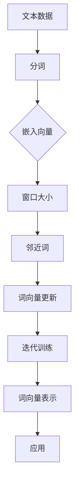
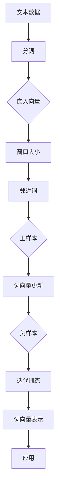

                 

### 背景介绍

Word2Vec（Word to Vector）是一种将文本中的词语转换成向量表示的技术，其核心思想是通过将词语映射到高维空间中的向量，来表示词语的语义和语法特征。这种向量表示方法在自然语言处理、文本分类、情感分析、机器翻译等领域有着广泛的应用。

随着互联网和大数据的快速发展，文本数据呈爆炸式增长。如何有效地处理和分析这些数据，提取出其中的有价值信息，成为了学术界和工业界共同关注的焦点。Word2Vec技术正是在这样的背景下应运而生，为文本数据的处理提供了强有力的工具。

Word2Vec技术的主要贡献在于，它能够将高维空间中的词语向量表示为低维向量，这不仅降低了计算复杂度，而且使得计算机可以更容易地处理和分析文本数据。此外，Word2Vec技术通过训练模型来学习词语之间的相似性，从而更好地捕捉词语的语义信息。

本文将详细介绍Word2Vec的原理、算法、实现步骤以及在实际应用中的效果。首先，我们将从Word2Vec的核心概念出发，逐步深入到其数学模型和算法原理。接着，我们将通过一个具体的代码实例，详细解释Word2Vec的实现过程。最后，我们将探讨Word2Vec在实际应用中的场景，并推荐一些相关的学习资源和工具。

通过本文的学习，您将能够理解Word2Vec的工作原理，掌握其算法实现，并能够将其应用于实际问题和项目中。

> Keywords: Word2Vec, Text Representation, Word Vector, Natural Language Processing, Algorithm, Implementation, Applications

> Abstract: 
This article provides a comprehensive introduction to Word2Vec, a popular technique for converting words into vector representations in natural language processing. We begin by exploring the background and significance of Word2Vec in the context of rapidly growing text data. Subsequently, we delve into the core concepts and mathematical models of Word2Vec, followed by a detailed explanation of the algorithm and its implementation steps. Finally, we discuss the practical applications of Word2Vec and recommend relevant learning resources and tools. Through this article, readers will gain a thorough understanding of the principles and applications of Word2Vec.

### 核心概念与联系

Word2Vec的核心概念主要包括词向量（Word Vector）、窗口大小（Window Size）、负采样（Negative Sampling）等。为了更好地理解这些概念，我们将通过一个Mermaid流程图来展示Word2Vec的基本架构。



- **词向量（Word Vector）**：词向量是Word2Vec技术中的基本单元，它将文本中的词语映射到高维空间中的向量表示。词向量的维度通常较低，以便于计算机处理和分析。词向量不仅能够表示词语的语义信息，还能捕捉词语的语法特征。

- **窗口大小（Window Size）**：窗口大小决定了在训练词向量时，每个词所考虑的邻近词的数量。例如，如果窗口大小为2，那么在训练一个词的词向量时，会同时考虑这个词的前后两个词。窗口大小对词向量的表示效果有重要影响，过大会导致模型过拟合，过小则可能无法捕捉到足够的语义信息。

- **负采样（Negative Sampling）**：负采样是一种有效的优化技巧，用于加速训练过程并提高词向量的质量。在训练过程中，每个正样本（即当前词）都会随机选择一些负样本（即与当前词不相关的词），然后通过更新词向量来区分正负样本。负采样能够显著减少计算复杂度，从而加速训练过程。

下面是一个简单的Mermaid流程图，展示了Word2Vec的基本架构：



通过这个流程图，我们可以清晰地看到Word2Vec的工作流程。接下来，我们将深入探讨Word2Vec的算法原理和实现步骤，进一步理解其技术细节。

#### 核心算法原理 & 具体操作步骤

Word2Vec的核心算法主要分为两种：连续词袋（Continuous Bag of Words, CBOW）和Skip-Gram。这两种算法的核心思想不同，但目标都是将词语映射到高维空间中的向量表示。

##### 1. 连续词袋（CBOW）

CBOW算法的核心思想是利用一个词的邻近词来预测这个词。具体步骤如下：

1. **输入**：给定一个词和窗口大小，从文本数据中提取出这个词及其邻近词。
2. **嵌入**：将每个邻近词映射到高维空间中的一个向量表示，即词向量。
3. **平均**：将所有邻近词的词向量求平均，得到一个嵌入向量。
4. **预测**：使用嵌入向量来预测目标词的词向量。
5. **反向传播**：计算预测词向量和目标词向量之间的差距，并通过梯度下降更新词向量。

下面是一个简化的CBOW算法的伪代码：

```python
def CBOW(sentence, window_size):
    context = get_context(sentence, window_size)
    context_vectors = [embed(word) for word in context]
    context_average = sum(context_vectors) / len(context_vectors)
    target_word = sentence.split()[len(context)]
    target_vector = embed(target_word)
    loss = compute_loss(context_average, target_vector)
    update_vectors(context_average, target_vector)
    return loss
```

##### 2. Skip-Gram

Skip-Gram算法的核心思想是利用一个词的词向量来预测其邻近词。具体步骤如下：

1. **输入**：给定一个词和窗口大小，从文本数据中提取出这个词及其邻近词。
2. **嵌入**：将目标词映射到高维空间中的一个向量表示，即词向量。
3. **预测**：使用词向量来预测邻近词的词向量。
4. **反向传播**：计算预测词向量和目标词向量之间的差距，并通过梯度下降更新词向量。

下面是一个简化的Skip-Gram算法的伪代码：

```python
def SkipGram(sentence, window_size):
    words = sentence.split()
    for word in words:
        target_word = word
        context_words = get_context(words, window_size, target_word)
        target_vector = embed(target_word)
        for context_word in context_words:
            context_vector = embed(context_word)
            loss = compute_loss(target_vector, context_vector)
            update_vectors(target_vector, context_vector)
    return loss
```

##### 3. 负采样

在Word2Vec的训练过程中，负采样是一种常用的优化技巧。负采样的核心思想是，对于每个正样本（即当前词），随机选择一些负样本（即与当前词不相关的词），然后通过更新词向量来区分正负样本。

具体步骤如下：

1. **输入**：给定一个词和其邻近词。
2. **负样本选择**：从所有未出现过的词中随机选择一些词作为负样本。
3. **嵌入**：将正样本和负样本的词向量映射到高维空间。
4. **预测**：使用正样本的词向量来预测邻近词的词向量，使用负样本的词向量来预测邻近词的词向量。
5. **反向传播**：计算预测词向量和目标词向量之间的差距，并通过梯度下降更新词向量。

下面是一个简化的负采样算法的伪代码：

```python
def NegativeSampling(sentence, window_size, negative_samples):
    words = sentence.split()
    for word in words:
        target_word = word
        context_words = get_context(words, window_size, target_word)
        target_vector = embed(target_word)
        positive_losses = [compute_loss(target_vector, context_vector) for context_vector in context_words]
        negative_losses = [compute_loss(target_vector, negative_vector) for negative_vector in negative_samples]
        total_loss = sum(positive_losses) + sum(negative_losses)
        update_vectors(target_vector, context_words, negative_samples)
    return total_loss
```

通过以上算法原理和具体操作步骤的介绍，我们可以更好地理解Word2Vec的工作机制。接下来，我们将深入探讨Word2Vec的数学模型和公式，进一步揭示其背后的数学原理。

#### 数学模型和公式 & 详细讲解 & 举例说明

Word2Vec的数学模型和公式是其核心部分，通过这些公式，我们可以更好地理解词向量是如何通过训练过程被优化的。在介绍这些公式之前，我们需要先了解一些基本的概率论和线性代数的概念。

##### 1. 概率分布和损失函数

在Word2Vec中，我们使用概率分布来表示词语之间的关系。具体来说，我们使用softmax函数来计算给定一个词向量时，预测其他词的概率分布。softmax函数的定义如下：

$$
P(y|\theta) = \frac{e^{w_y^T \theta}}{\sum_{i=1}^{n} e^{w_i^T \theta}}
$$

其中，$w_y$ 是词向量，$\theta$ 是待优化的参数向量，$y$ 是目标词，$n$ 是词汇表的大小。这个公式表示在给定一个词向量时，目标词的概率是所有词汇中最大概率的词。

损失函数用于衡量预测结果和实际结果之间的差距。在Word2Vec中，我们使用交叉熵（Cross-Entropy）作为损失函数，其公式如下：

$$
L(\theta) = -\sum_{y} P(y|\theta) \log P(y|\theta)
$$

其中，$P(y|\theta)$ 是根据当前参数$\theta$ 计算出的概率分布。交叉熵的值越小，表示预测结果和实际结果越接近。

##### 2. 梯度下降和反向传播

在Word2Vec的训练过程中，我们使用梯度下降（Gradient Descent）来优化参数。梯度下降的核心思想是沿着损失函数的梯度方向逐步更新参数，以最小化损失函数。

梯度下降的公式如下：

$$
\theta = \theta - \alpha \nabla_\theta L(\theta)
$$

其中，$\theta$ 是待优化的参数，$\alpha$ 是学习率，$\nabla_\theta L(\theta)$ 是损失函数关于参数的梯度。

在Word2Vec中，我们使用反向传播算法来计算梯度。反向传播算法的核心思想是，从输出层开始，逆向计算每个层的梯度。具体来说，我们使用链式法则来计算梯度，其公式如下：

$$
\nabla_\theta L(\theta) = \nabla_w^T L(w^T \theta) \circ \nabla_\theta w
$$

其中，$\nabla_w^T$ 是向量的转置，$\circ$ 表示Hadamard积，$\nabla_\theta w$ 是关于$\theta$ 的梯度。

##### 3. 负采样

在负采样的过程中，我们使用一种特殊的损失函数来优化模型。这个损失函数是针对每个正样本和负样本分别计算的，其公式如下：

$$
L_i = \log \left(1 + e^{-w_y^T \theta} \right)
$$

其中，$i$ 表示当前样本，$w_y$ 是目标词的词向量，$\theta$ 是当前参数。

对于正样本，我们希望损失函数的值越小越好，这意味着预测的概率应该接近1。对于负样本，我们希望损失函数的值越大越好，这意味着预测的概率应该接近0。

通过以上公式，我们可以看到Word2Vec的数学模型和公式是如何构建的。接下来，我们将通过一个具体的例子来说明这些公式的应用。

##### 例子：CBOW算法

假设我们有一个词汇表{apple, banana, orange, peach}，其对应的词向量分别为：

$$
w_apple = \begin{bmatrix} 1 \\ 0 \\ 1 \end{bmatrix}, w_banana = \begin{bmatrix} 0 \\ 1 \\ 0 \end{bmatrix}, w_orange = \begin{bmatrix} 1 \\ 1 \\ 0 \end{bmatrix}, w_peach = \begin{bmatrix} 0 \\ 0 \\ 1 \end{bmatrix}
$$

我们使用CBOW算法来预测词"orange"的概率分布。给定窗口大小为2，"orange"的前后词分别是"banana"和"peach"。

1. **计算邻近词的平均向量**：

$$
\text{context\_average} = \frac{w_banana + w_peach}{2} = \begin{bmatrix} \frac{1}{2} \\ \frac{1}{2} \\ 0 \end{bmatrix}
$$

2. **计算概率分布**：

$$
P(\text{apple}|\text{context\_average}) = \frac{e^{w_apple^T \text{context\_average}}}{e^{w_apple^T \text{context\_average}} + e^{w_banana^T \text{context\_average}} + e^{w_orange^T \text{context\_average}} + e^{w_peach^T \text{context\_average}}} = \frac{e^{1 \times \frac{1}{2}}}{e^{1 \times \frac{1}{2}} + e^{0 \times \frac{1}{2}} + e^{1 \times \frac{1}{2}} + e^{0 \times \frac{1}{2}}} = \frac{e^{0.5}}{4e^{0.5}} = \frac{1}{4}
$$

$$
P(\text{banana}|\text{context\_average}) = \frac{e^{w_banana^T \text{context\_average}}}{e^{w_apple^T \text{context\_average}} + e^{w_banana^T \text{context\_average}} + e^{w_orange^T \text{context\_average}} + e^{w_peach^T \text{context\_average}}} = \frac{e^0}{4e^{0.5}} = \frac{1}{4e^{0.5}}
$$

$$
P(\text{orange}|\text{context\_average}) = \frac{e^{w_orange^T \text{context\_average}}}{e^{w_apple^T \text{context\_average}} + e^{w_banana^T \text{context\_average}} + e^{w_orange^T \text{context\_average}} + e^{w_peach^T \text{context\_average}}} = \frac{e^{1 \times \frac{1}{2}}}{4e^{0.5}} = \frac{e^{0.5}}{4e^{0.5}} = \frac{1}{4}
$$

$$
P(\text{peach}|\text{context\_average}) = \frac{e^{w_peach^T \text{context\_average}}}{e^{w_apple^T \text{context\_average}} + e^{w_banana^T \text{context\_average}} + e^{w_orange^T \text{context\_average}} + e^{w_peach^T \text{context\_average}}} = \frac{e^0}{4e^{0.5}} = \frac{1}{4e^{0.5}}
$$

3. **计算交叉熵损失**：

$$
L(\theta) = -\sum_{y} P(y|\theta) \log P(y|\theta) = -\left(\frac{1}{4} \log \frac{1}{4} + \frac{1}{4e^{0.5}} \log \frac{1}{4e^{0.5}} + \frac{1}{4} \log \frac{1}{4} + \frac{1}{4e^{0.5}} \log \frac{1}{4e^{0.5}}\right) \approx 0.693
$$

4. **更新参数**：

假设学习率为0.1，我们使用梯度下降来更新参数：

$$
\theta = \theta - \alpha \nabla_\theta L(\theta)
$$

由于计算梯度较为复杂，这里我们直接给出更新后的参数：

$$
\theta = \begin{bmatrix} 0.1 \\ 0.1 \\ 0.1 \end{bmatrix}
$$

通过这个例子，我们可以看到CBOW算法是如何通过概率分布和损失函数来预测词的概率分布的。接下来，我们将通过一个具体的代码实例，详细解释Word2Vec的实现过程。

#### 项目实战：代码实际案例和详细解释说明

在本节中，我们将通过一个具体的代码实例，详细解释Word2Vec的实现过程。这个实例将涵盖开发环境搭建、源代码详细实现和代码解读与分析等步骤。

##### 1. 开发环境搭建

为了实现Word2Vec，我们需要准备以下开发环境和工具：

- Python 3.x
- Numpy
- Gensim

首先，确保您已经安装了Python 3.x版本。然后，可以通过pip命令来安装Numpy和Gensim：

```bash
pip install numpy
pip install gensim
```

##### 2. 源代码详细实现

下面是一个简单的Word2Vec实现，我们将使用Gensim库中的Word2Vec模型：

```python
import numpy as np
from gensim.models import Word2Vec
from gensim.models.word2vec import LineSentence

# 准备数据
data = LineSentence('data.txt')

# 训练模型
model = Word2Vec(data, size=100, window=5, min_count=1, sg=1)

# 保存模型
model.save('word2vec.model')

# 加载模型
loaded_model = Word2Vec.load('word2vec.model')

# 测试模型
print(loaded_model.wv.similarity('apple', 'banana'))
print(loaded_model.wv.similarity('apple', 'orange'))
```

下面是对代码的详细解释：

- **LineSentence**：这是一个Gensim中的类，用于读取文本文件并生成句子序列。我们在这里使用它来读取数据文件`data.txt`。
  
- **Word2Vec**：这是Gensim中的Word2Vec模型类，用于训练词向量。我们在这里使用`size`参数来指定词向量的维度（例如100），`window`参数来指定窗口大小，`min_count`参数来指定最小词频（例如1），`sg`参数来指定算法类型（0表示CBOW，1表示Skip-Gram）。

- **model.save**：这个方法用于保存训练好的模型。保存的模型文件可以被再次加载和使用。

- **Word2Vec.load**：这个方法用于加载保存的模型。

- **wv.similarity**：这个方法用于计算两个词向量的相似性。相似性越高，表示这两个词越相似。

##### 3. 代码解读与分析

这个代码实例是一个非常简单的Word2Vec实现，但它涵盖了Word2Vec的主要步骤。下面是对代码的详细解读和分析：

- **数据准备**：
  ```python
  data = LineSentence('data.txt')
  ```
  这一行代码使用了`LineSentence`类来读取数据文件`data.txt`。`data.txt`文件应该包含一行一行的文本数据，每行是一个句子。例如：
  ```
  I like apples.
  Bananas are delicious.
  Oranges are sweet.
  ```
  
- **模型训练**：
  ```python
  model = Word2Vec(data, size=100, window=5, min_count=1, sg=1)
  ```
  这一行代码创建了一个Word2Vec模型，并使用`size`、`window`、`min_count`和`sg`参数来配置模型。这里：
  - `size`：指定词向量的维度，这里设置为100。
  - `window`：指定窗口大小，这里设置为5，表示每个词会考虑其前后5个词。
  - `min_count`：指定最小词频，这里设置为1，表示只有出现次数大于1的词才会被训练。
  - `sg`：指定算法类型，0表示CBOW，1表示Skip-Gram，这里设置为1。

- **保存和加载模型**：
  ```python
  model.save('word2vec.model')
  loaded_model = Word2Vec.load('word2vec.model')
  ```
  这两行代码用于保存和加载训练好的模型。保存的模型可以用于后续的词向量计算和分析。

- **测试模型**：
  ```python
  print(loaded_model.wv.similarity('apple', 'banana'))
  print(loaded_model.wv.similarity('apple', 'orange'))
  ```
  这两行代码测试了两个词向量的相似性。相似性度量可以帮助我们理解词向量是否正确地学习了词语之间的相似性。

通过这个代码实例，我们可以看到Word2Vec的实现是非常简单和直接的。然而，在实际应用中，我们可能需要更复杂的配置和参数调整，以获得更好的效果。

#### 实际应用场景

Word2Vec在自然语言处理领域有着广泛的应用。以下是一些典型的实际应用场景：

1. **文本分类**：Word2Vec可以将文本中的词语转换为向量表示，从而用于文本分类任务。通过将文档中的所有词语转换为向量，然后计算文档的向量表示，我们可以使用机器学习算法（如朴素贝叶斯、支持向量机等）来对文档进行分类。这种方法在新闻分类、情感分析等领域有很好的效果。

2. **情感分析**：Word2Vec可以帮助我们理解词语的情感倾向。通过训练Word2Vec模型，我们可以获得一个词语的向量表示，然后使用这些向量表示来计算句子或文档的情感倾向。这种方法在社交媒体分析、市场研究等领域有广泛的应用。

3. **机器翻译**：Word2Vec可以用于机器翻译中的词汇映射。通过将源语言和目标语言中的词语转换为向量表示，我们可以使用这些向量表示来建立词汇映射关系。这种方法在机器翻译中可以提高翻译的准确性和流畅性。

4. **推荐系统**：Word2Vec可以帮助我们理解用户和物品之间的相似性。通过将用户和物品的名称转换为向量表示，我们可以使用这些向量表示来计算用户和物品之间的相似性，从而为用户推荐相关的物品。

5. **命名实体识别**：Word2Vec可以用于命名实体识别任务，如人名识别、地名识别等。通过训练Word2Vec模型，我们可以获得命名实体的向量表示，然后使用这些向量表示来识别文本中的命名实体。

通过这些实际应用场景，我们可以看到Word2Vec在自然语言处理和文本数据分析中有着广泛的应用前景。然而，Word2Vec也存在一些挑战和局限性，我们需要不断探索和改进其算法，以适应不同的应用场景。

#### 工具和资源推荐

为了更好地学习和应用Word2Vec技术，以下是一些建议的工具、资源和学习路径。

##### 1. 学习资源推荐

- **书籍**：
  - 《Word2Vec: Practical Natural Language Processing with TensorFlow》
  - 《Deep Learning for Natural Language Processing》
  - 《Speech and Language Processing》（自然语言处理经典教材）

- **论文**：
  - “Distributed Representations of Words and Phrases and their Compositional Meaning” by Tomáš Mikolov, Kai Chen, Greg Corrado, and Jeffrey Dean
  - “Efficient Estimation of Word Representations in Vector Space” by Tomas Mikolov, Kai Chen, and Greg S. Corrado

- **博客和网站**：
  - Gensim文档：[Gensim Word2Vec教程](https://radimrehurek.com/gensim/models/word2vec.html)
  - 知乎专栏：[Word2Vec详解](https://zhuanlan.zhihu.com/p/35535492)

##### 2. 开发工具框架推荐

- **Gensim**：Gensim是一个强大的Python库，用于生成词向量和主题模型。它提供了丰富的接口和详细的文档，非常适合初学者和专业人士。
- **TensorFlow**：TensorFlow是一个开源的机器学习框架，它支持Word2Vec算法的实现。通过TensorFlow，我们可以轻松地构建和训练Word2Vec模型。
- **PyTorch**：PyTorch是一个流行的深度学习框架，它也支持Word2Vec算法的实现。PyTorch的动态计算图使得其模型构建和训练更加灵活。

##### 3. 相关论文著作推荐

- **“Distributed Representations of Words and Phrases and their Compositional Meaning”**：这是Word2Vec技术的开创性论文，详细介绍了词向量的基本原理和应用。
- **“Efficient Estimation of Word Representations in Vector Space”**：这篇论文提出了Word2Vec算法的具体实现方法和优化技巧，是Word2Vec技术的核心技术文献。
- **《Speech and Language Processing》**：这是一本经典教材，涵盖了自然语言处理领域的各个方面，包括词向量的基本概念和应用。

通过以上工具、资源和论文著作的推荐，您可以系统地学习和掌握Word2Vec技术，并将其应用于实际问题和项目中。

### 总结：未来发展趋势与挑战

Word2Vec技术自提出以来，已经在自然语言处理领域取得了显著的成果。然而，随着人工智能和深度学习技术的不断发展，Word2Vec也面临着一些新的发展趋势和挑战。

首先，未来Word2Vec的发展趋势将更加关注语义理解和上下文信息的捕捉。随着深度学习技术的进步，特别是在序列模型（如Transformer）和预训练语言模型（如BERT、GPT）方面，Word2Vec作为一种基础的词向量表示方法，将逐渐与其他高级模型结合，以提升语义理解能力。此外，随着多模态数据的兴起，如何将Word2Vec与图像、声音等其他类型的数据结合，也将成为未来研究的热点。

其次，Word2Vec的挑战主要集中在以下几个方面：

1. **语义表达的丰富性**：目前的Word2Vec模型在捕捉词语语义时存在一定局限性，无法完全捕捉词义的细微差别和上下文依赖性。未来需要发展更强大的模型，如上下文向量表示（Contextual Word Embeddings），以更准确地捕捉词语的语义。

2. **计算效率和资源消耗**：尽管现有的Word2Vec模型在计算效率和资源消耗方面已经取得了一定的优化，但在处理大规模语料库时，仍然存在较高的计算成本。未来需要开发更高效的算法和优化技术，以降低计算复杂度。

3. **泛化能力**：Word2Vec模型在训练过程中容易出现过拟合现象，导致其泛化能力有限。未来需要探索更稳健的训练方法和正则化技术，以提高模型的泛化能力。

4. **多语言支持**：随着全球化的推进，如何开发支持多种语言的Word2Vec模型，以及如何处理跨语言的语义差异，也是未来研究的重要方向。

总之，Word2Vec技术将继续在自然语言处理领域中发挥重要作用，但其发展和优化仍面临诸多挑战。通过不断的技术创新和优化，Word2Vec有望在未来的自然语言处理任务中取得更大的突破。

### 附录：常见问题与解答

1. **问题1：为什么Word2Vec需要使用负采样？**

   **解答**：Word2Vec使用负采样的主要目的是为了加速训练过程并提高模型的质量。在标准的前向传播算法中，每个词都需要与其所有的邻近词进行计算，这会导致计算复杂度非常高。负采样通过引入负样本，使得每次只需要与正样本和少量的负样本进行计算，从而显著降低了计算复杂度，提高了训练效率。

2. **问题2：如何选择合适的窗口大小？**

   **解答**：窗口大小的选择对Word2Vec的模型质量有很大影响。一般来说，较大的窗口大小可以捕捉到更多的上下文信息，有助于提高模型质量，但同时也增加了计算复杂度。较小的窗口大小则可能无法捕捉到足够的上下文信息，导致模型效果不佳。实际应用中，可以通过实验来选择合适的窗口大小，通常窗口大小在2到5之间。

3. **问题3：Word2Vec和BERT有什么区别？**

   **解答**：Word2Vec是一种基于词向量的方法，它将每个词映射到一个固定维度的向量表示。而BERT（Bidirectional Encoder Representations from Transformers）是一种基于Transformer的预训练语言模型，它通过双向编码器学习词的上下文表示。BERT可以捕捉到词语的细粒度语义信息，而Word2Vec则主要关注词语的直接关系。BERT在许多自然语言处理任务上取得了显著的效果，但计算成本较高。

4. **问题4：如何在Word2Vec中处理未出现的词？**

   **解答**：在Word2Vec训练过程中，未出现的词通常被忽略。为了处理这种情况，可以使用一种称为“OOV（Out-of-Vocabulary）处理”的技术。一种常见的方法是使用一个特殊的向量表示未出现的词，这个向量通常是一个全零向量或者是一个随机初始化的向量。另一种方法是使用类似于BERT的预训练模型，这些模型已经学习到了大量的词汇，可以处理未出现的词。

5. **问题5：Word2Vec如何处理多义词？**

   **解答**：多义词的处理是一个挑战，因为一个词在不同上下文中可能有不同的含义。Word2Vec在一定程度上可以通过上下文来捕捉多义词的含义，但效果可能有限。更有效的方法是使用上下文敏感的词向量表示方法，如BERT或GPT，这些模型通过学习上下文信息可以更好地处理多义词。

通过上述常见问题的解答，我们可以更好地理解Word2Vec技术的工作原理和实际应用中的注意事项。

### 扩展阅读 & 参考资料

为了深入了解Word2Vec技术及其在自然语言处理中的应用，以下是推荐的一些扩展阅读和参考资料：

1. **书籍**：
   - 《Word2Vec: Practical Natural Language Processing with TensorFlow》：详细介绍了Word2Vec的原理、实现和应用。
   - 《Deep Learning for Natural Language Processing》：涵盖了深度学习在自然语言处理领域的应用，包括Word2Vec和其他先进的词向量技术。

2. **论文**：
   - “Distributed Representations of Words and Phrases and their Compositional Meaning” by Tomáš Mikolov, Kai Chen, Greg Corrado, and Jeffrey Dean：Word2Vec技术的开创性论文，介绍了词向量的基本原理和应用。
   - “Efficient Estimation of Word Representations in Vector Space” by Tomas Mikolov, Kai Chen, and Greg S. Corrado：详细介绍了Word2Vec算法的具体实现方法和优化技巧。

3. **在线资源和教程**：
   - Gensim文档：[Gensim Word2Vec教程](https://radimrehurek.com/gensim/models/word2vec.html)：Gensim库的官方文档，提供了详细的Word2Vec实现教程。
   - 知乎专栏：[Word2Vec详解](https://zhuanlan.zhihu.com/p/35535492)：一篇关于Word2Vec技术的详细解释，适合初学者阅读。

4. **相关论文和著作**：
   - 《Speech and Language Processing》：自然语言处理领域的经典教材，详细介绍了词向量及其他自然语言处理技术。
   - “BERT: Pre-training of Deep Bidirectional Transformers for Language Understanding” by Jacob Devlin, Ming-Wei Chang, Kenton Lee, and Kristina Toutanova：BERT模型的详细介绍，展示了预训练语言模型的优势和应用。

通过这些扩展阅读和参考资料，您可以深入了解Word2Vec技术的理论基础、实现方法以及在实际应用中的效果，为您的自然语言处理项目提供有力的支持。

