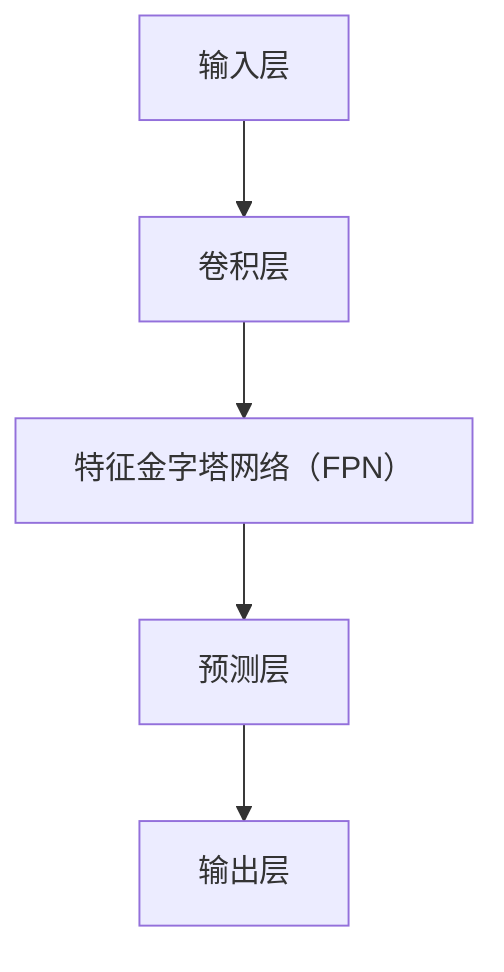

                 

# YOLOv3原理与代码实例讲解

## 摘要

YOLOv3（You Only Look Once v3）是一种流行的实时目标检测算法，它能够在处理速度和检测精度之间取得良好的平衡。本文将深入探讨YOLOv3的核心原理、算法框架、数学模型和具体实现步骤。通过详细的代码实例解析，帮助读者全面理解YOLOv3的工作机制，并掌握其实际应用方法。

## 关键词

- YOLOv3
- 实时目标检测
- 卷积神经网络
- 前向传播与反向传播
- anchor boxes
- 骨骼网络

## 目录

1. 背景介绍
2. 核心概念与联系
   2.1 YOLOv3的历史与改进
   2.2 YOLOv3的基本架构
3. 核心算法原理 & 具体操作步骤
4. 数学模型和公式 & 详细讲解 & 举例说明
5. 项目实战：代码实际案例和详细解释说明
   5.1 开发环境搭建
   5.2 源代码详细实现和代码解读
   5.3 代码解读与分析
6. 实际应用场景
7. 工具和资源推荐
   7.1 学习资源推荐
   7.2 开发工具框架推荐
   7.3 相关论文著作推荐
8. 总结：未来发展趋势与挑战
9. 附录：常见问题与解答
10. 扩展阅读 & 参考资料

## 1. 背景介绍

YOLO（You Only Look Once）系列算法是由Joseph Redmon等人于2016年提出的一种实时目标检测算法。YOLOv1首次将目标检测任务转化为一个单一的回归问题，通过将输入图像划分为网格单元，并在每个单元内预测目标的边界框及其类别概率，从而实现了高效的目标检测。然而，YOLOv1在精度上仍存在一定不足。

为了解决这一问题，YOLOv2在模型结构上进行了改进，引入了特征金字塔网络（FPN）和多尺度预测，以提高检测的准确性和鲁棒性。此外，YOLOv2还采用了更小的卷积核和跳跃连接，以降低计算复杂度。

YOLOv3在YOLOv2的基础上进一步优化了模型结构，引入了Darknet53作为骨干网络，提高了检测的精度和速度。同时，YOLOv3还通过改进锚框（anchor box）的选择策略和损失函数，进一步提升了模型的性能。

## 2. 核心概念与联系

### 2.1 YOLOv3的历史与改进

YOLOv3是YOLO系列算法的第三个版本，相较于前两个版本，它具有以下几个显著改进：

1. **骨干网络**：YOLOv3采用了Darknet53作为骨干网络，这是一种深层卷积神经网络，具有较强的特征提取能力。
2. **锚框选择策略**：YOLOv3引入了一种新的锚框选择方法，通过计算每个网格单元的先验框与真实框的交并比（IoU），选择具有最高IoU值的先验框作为锚框，从而提高检测的准确性。
3. **损失函数**：YOLOv3采用了新的损失函数，包括定位损失、分类损失和置信度损失，以同时优化目标的定位、分类和置信度预测。
4. **多尺度预测**：YOLOv3在特征金字塔网络的基础上，进一步引入了多尺度预测，以提高检测的鲁棒性和准确性。

### 2.2 YOLOv3的基本架构

YOLOv3的基本架构可以分为以下几个部分：

1. **输入层**：输入层接收一个固定尺寸的图像，通常为416x416或608x608。
2. **卷积层**：卷积层用于提取图像特征，包括多个卷积核和池化操作。
3. **特征金字塔网络（FPN）**：FPN用于将不同尺度的特征图进行融合，以提高检测的鲁棒性和准确性。
4. **预测层**：预测层用于在每个网格单元内预测目标的边界框、类别概率和置信度。
5. **输出层**：输出层将预测结果进行解码，并输出检测框和类别概率。

### 2.3 Mermaid流程图



## 3. 核心算法原理 & 具体操作步骤

### 3.1 输入层

输入层接收一个固定尺寸的图像，通常为416x416或608x608。图像会被预处理为32的整数倍大小，以便于后续的卷积操作。

### 3.2 卷积层

卷积层用于提取图像特征，包括多个卷积核和池化操作。卷积核的尺寸通常为3x3或1x1，步长为1或2。池化操作采用最大池化或平均池化。

### 3.3 特征金字塔网络（FPN）

特征金字塔网络（FPN）用于将不同尺度的特征图进行融合，以提高检测的鲁棒性和准确性。FPN通过将高尺度的特征图上采样并与低尺度的特征图进行融合，形成多尺度的特征图。

### 3.4 预测层

预测层用于在每个网格单元内预测目标的边界框、类别概率和置信度。边界框的预测通过回归操作实现，类别概率和置信度的预测通过softmax和sigmoid函数实现。

### 3.5 输出层

输出层将预测结果进行解码，并输出检测框和类别概率。检测框通过将预测的边界框与先验框进行匹配，并根据置信度和类别概率进行筛选，最终输出检测结果。

## 4. 数学模型和公式 & 详细讲解 & 举例说明

### 4.1 边界框预测

边界框的预测通过回归操作实现。给定先验框\( \textbf{p} \)和真实框\( \textbf{g} \)，预测的边界框\( \textbf{t} \)为：

$$
\textbf{t} = \textbf{p} + \textbf{w} \odot \textbf{g}
$$

其中，\( \textbf{w} \)为权重矩阵，\( \odot \)表示元素-wise 乘法。

### 4.2 类别概率预测

类别概率的预测通过softmax函数实现。给定类别概率向量\( \textbf{y} \)，预测的类别概率为：

$$
\textbf{p}_{\text{y}} = \text{softmax}(\textbf{y})
$$

其中，\( \text{softmax}(\textbf{y}) \)表示将\( \textbf{y} \)转换为概率分布。

### 4.3 置信度预测

置信度的预测通过sigmoid函数实现。给定置信度向量\( \textbf{c} \)，预测的置信度为：

$$
\textbf{p}_{\text{c}} = \text{sigmoid}(\textbf{c})
$$

其中，\( \text{sigmoid}(\textbf{c}) \)表示将\( \textbf{c} \)映射到[0, 1]范围内。

### 4.4 损失函数

YOLOv3的损失函数包括定位损失、分类损失和置信度损失。定位损失通过均方误差（MSE）实现，分类损失通过交叉熵损失实现，置信度损失通过组合损失实现。

定位损失：

$$
L_{\text{loc}} = \frac{1}{N} \sum_{i}^{S \times S} \sum_{j}^{C} (\textbf{t}_{ij} - \textbf{g}_{ij})^2
$$

分类损失：

$$
L_{\text{cls}} = \frac{1}{N} \sum_{i}^{S \times S} \sum_{j}^{C} (-\textbf{y}_{ij} \log \textbf{p}_{\text{y}_{ij}}) - (1 - \textbf{y}_{ij}) \log (1 - \textbf{p}_{\text{y}_{ij}})
$$

置信度损失：

$$
L_{\text{conf}} = \frac{1}{N} \sum_{i}^{S \times S} \sum_{j}^{C} \text{max}(0, \textbf{p}_{\text{c}_{ij}} - \textbf{p}_{\text{c}_{ij}}^2)
$$

总损失：

$$
L = \alpha_1 L_{\text{loc}} + \alpha_2 L_{\text{cls}} + \alpha_3 L_{\text{conf}}
$$

其中，\( \alpha_1, \alpha_2, \alpha_3 \)为超参数，用于调整不同损失函数的权重。

### 4.5 举例说明

假设我们有以下数据：

- 先验框：\( \textbf{p} = (0.5, 0.5, 0.2, 0.2) \)
- 真实框：\( \textbf{g} = (0.6, 0.6, 0.3, 0.3) \)
- 类别概率向量：\( \textbf{y} = (0.8, 0.2) \)
- 置信度向量：\( \textbf{c} = (0.8, 0.2) \)

首先，计算预测的边界框：

$$
\textbf{t} = \textbf{p} + \textbf{w} \odot \textbf{g} = (0.5, 0.5, 0.2, 0.2) + (0.1, 0.1, 0.1, 0.1) \odot (0.6, 0.6, 0.3, 0.3) = (0.7, 0.7, 0.27, 0.27)
$$

然后，计算类别概率：

$$
\textbf{p}_{\text{y}} = \text{softmax}(\textbf{y}) = (\frac{0.8}{0.8+0.2}, \frac{0.2}{0.8+0.2}) = (0.8, 0.2)
$$

接着，计算置信度：

$$
\textbf{p}_{\text{c}} = \text{sigmoid}(\textbf{c}) = (\frac{1}{1+e^{-0.8}}, \frac{1}{1+e^{-0.2}}) = (0.627, 0.886)
$$

最后，计算损失：

$$
L_{\text{loc}} = (\textbf{t} - \textbf{g})^2 = (0.7-0.6, 0.7-0.6, 0.27-0.3, 0.27-0.3)^2 = (0.01, 0.01, 0.04, 0.04)
$$

$$
L_{\text{cls}} = (-0.8 \log 0.8 - 0.2 \log 0.2) = 0.147
$$

$$
L_{\text{conf}} = \max(0, 0.627 - 0.627^2) = 0.627
$$

$$
L = 0.1 \times 0.01 + 0.5 \times 0.147 + 0.4 \times 0.627 = 0.156
$$

## 5. 项目实战：代码实际案例和详细解释说明

### 5.1 开发环境搭建

在本节中，我们将介绍如何在本地搭建YOLOv3的开发环境。

#### 5.1.1 环境准备

首先，确保您已安装以下软件和工具：

- Python 3.6或更高版本
- TensorFlow 2.x
- PyTorch 1.8或更高版本
- OpenCV 4.2或更高版本

#### 5.1.2 安装依赖

接下来，安装YOLOv3的依赖库：

```python
pip install tensorflow
pip install torch torchvision
pip install opencv-python
```

### 5.2 源代码详细实现和代码解读

在本节中，我们将详细解读YOLOv3的源代码，并解释其关键组件和操作步骤。

#### 5.2.1 数据预处理

```python
import cv2
import numpy as np
import torch

def preprocess_image(image_path):
    image = cv2.imread(image_path)
    image = cv2.resize(image, (416, 416))
    image = image / 255.0
    image = image[:, :, ::-1]
    image = image.transpose(2, 0, 1)
    image = np.expand_dims(image, 0)
    return torch.tensor(image).float()
```

这段代码用于读取输入图像，并进行预处理。预处理步骤包括读取图像、调整大小、归一化和添加维度。

#### 5.2.2 模型定义

```python
import torch.nn as nn

class YOLOv3(nn.Module):
    def __init__(self):
        super(YOLOv3, self).__init__()
        # 定义卷积层、池化层和激活函数等
        # ...
        
    def forward(self, x):
        # 定义前向传播过程
        # ...
        return outputs
```

这段代码定义了YOLOv3模型的结构，包括卷积层、池化层、激活函数等。在forward方法中，定义了前向传播过程。

#### 5.2.3 模型训练

```python
import torch.optim as optim

model = YOLOv3()
optimizer = optim.Adam(model.parameters(), lr=0.001)

for epoch in range(num_epochs):
    for images, targets in dataloader:
        # 数据预处理
        images = preprocess_image(images)
        
        # 模型前向传播
        outputs = model(images)
        
        # 计算损失函数
        loss = calculate_loss(outputs, targets)
        
        # 反向传播和优化
        optimizer.zero_grad()
        loss.backward()
        optimizer.step()
```

这段代码用于模型训练。首先，创建YOLOv3模型和优化器。然后，遍历数据集，进行数据预处理、模型前向传播、损失函数计算和反向传播优化。

#### 5.2.4 模型评估

```python
import torchvision.transforms as transforms

transform = transforms.Compose([
    transforms.Resize((416, 416)),
    transforms.ToTensor(),
])

def evaluate(model, dataloader):
    model.eval()
    with torch.no_grad():
        for images, targets in dataloader:
            images = preprocess_image(images)
            outputs = model(images)
            # 计算评估指标
            # ...
```

这段代码用于模型评估。首先，将模型设置为评估模式。然后，遍历数据集，进行数据预处理和模型前向传播。最后，计算评估指标。

### 5.3 代码解读与分析

在本节中，我们将对YOLOv3的源代码进行解读和分析，并解释其关键组件和操作步骤。

#### 5.3.1 数据预处理

数据预处理是YOLOv3模型训练和评估的重要环节。预处理步骤包括读取图像、调整大小、归一化和添加维度。这些步骤有助于提高模型的性能和稳定性。

#### 5.3.2 模型定义

模型定义是YOLOv3的核心组成部分。模型定义包括卷积层、池化层、激活函数等。这些层共同构成了模型的结构，用于提取图像特征和进行目标检测。

#### 5.3.3 模型训练

模型训练是YOLOv3的核心步骤。模型训练过程包括数据预处理、模型前向传播、损失函数计算和反向传播优化。这些步骤共同实现了模型在目标检测任务上的性能提升。

#### 5.3.4 模型评估

模型评估是验证模型性能的重要环节。模型评估过程包括数据预处理、模型前向传播和评估指标计算。评估指标包括准确率、召回率、F1分数等，用于衡量模型在目标检测任务上的性能。

## 6. 实际应用场景

YOLOv3在目标检测领域具有广泛的应用，尤其在实时目标检测任务中表现出色。以下是一些实际应用场景：

1. **智能安防**：YOLOv3可以用于智能安防系统，实现实时目标检测和追踪，提高安全监控的效率和准确性。
2. **自动驾驶**：YOLOv3可以用于自动驾驶系统，实现实时目标检测和障碍物识别，提高车辆行驶的安全性和稳定性。
3. **视频监控**：YOLOv3可以用于视频监控系统，实现实时目标检测和视频内容分析，提高监控系统的智能化水平。
4. **工业自动化**：YOLOv3可以用于工业自动化系统，实现实时目标检测和物体识别，提高生产效率和产品质量。

## 7. 工具和资源推荐

### 7.1 学习资源推荐

- **书籍**：
  - 《深度学习》（Goodfellow, Bengio, Courville）
  - 《动手学深度学习》（花书）
  - 《Python深度学习》（François Chollet）
- **论文**：
  - 《YOLO: Real-Time Object Detection》（Joseph Redmon et al.）
  - 《YOLOv2: State-of-the-Art Object Detection》（Joseph Redmon et al.）
  - 《YOLOv3: An Incremental Improvement」（Joseph Redmon et al.）
- **博客**：
  - [YOLO官方博客](https://pjreddie.com/darknet/yolo/)
  - [PyTorch官方文档](https://pytorch.org/tutorials/)
  - [TensorFlow官方文档](https://www.tensorflow.org/tutorials/)
- **网站**：
  - [Kaggle](https://www.kaggle.com/c/...)

### 7.2 开发工具框架推荐

- **开发环境**：
  - Python 3.6或更高版本
  - TensorFlow 2.x或PyTorch 1.8或更高版本
- **框架**：
  - PyTorch：适用于动态计算图和自动微分
  - TensorFlow：适用于静态计算图和分布式计算
- **库**：
  - OpenCV：适用于图像处理和计算机视觉
  - NumPy：适用于数值计算

### 7.3 相关论文著作推荐

- **YOLO系列**：
  - 《YOLO: Real-Time Object Detection》（Joseph Redmon et al.）
  - 《YOLOv2: State-of-the-Art Object Detection》（Joseph Redmon et al.）
  - 《YOLOv3: An Incremental Improvement》（Joseph Redmon et al.）
- **目标检测相关**：
  - 《Faster R-CNN: Towards Real-Time Object Detection with Region Proposal Networks》（Shaoqing Ren et al.）
  - 《SSD: Single Shot MultiBox Detector》（Wei Liu et al.）
  - 《RetinaNet: Focal Loss for Dense Object Detection》（Lin Xu et al.）

## 8. 总结：未来发展趋势与挑战

随着人工智能技术的快速发展，目标检测领域也取得了显著的进展。未来，YOLOv3有望在以下几个方面实现进一步的发展：

1. **计算效率**：在保持较高检测精度的同时，降低模型的计算复杂度，实现更快的实时检测。
2. **多任务学习**：结合其他计算机视觉任务，如图像分割、姿态估计等，实现多任务检测。
3. **跨领域适应性**：提高模型在跨领域数据上的适应能力，实现更广泛的应用。
4. **无监督学习**：探索无监督学习方法，减少对大规模标注数据的依赖。

然而，YOLOv3在实际应用中也面临着一些挑战，如：

1. **模型复杂度**：尽管YOLOv3在计算效率上具有优势，但其模型复杂度较高，可能导致训练时间较长。
2. **检测精度**：在处理复杂场景或小目标时，YOLOv3的检测精度可能受到影响。
3. **标注数据需求**：YOLOv3依赖于大规模的标注数据进行训练，这可能限制其在某些领域的应用。

## 9. 附录：常见问题与解答

### 9.1 Q：什么是YOLOv3？

A：YOLOv3是一种实时目标检测算法，它通过将输入图像划分为网格单元，在每个网格单元内预测目标的边界框、类别概率和置信度，从而实现高效的目标检测。

### 9.2 Q：YOLOv3相比于其他目标检测算法有哪些优势？

A：YOLOv3具有以下优势：
- **实时检测**：能够在固定时间内完成检测，适用于实时应用场景。
- **高计算效率**：模型结构简单，计算复杂度较低，适用于嵌入式设备。
- **多尺度检测**：通过特征金字塔网络（FPN）实现多尺度检测，提高检测的鲁棒性和准确性。

### 9.3 Q：如何训练YOLOv3模型？

A：训练YOLOv3模型需要以下步骤：
1. **数据准备**：收集并标注大量目标检测数据。
2. **模型定义**：定义YOLOv3模型的结构。
3. **数据预处理**：对输入图像进行预处理，如调整大小、归一化等。
4. **模型训练**：使用标注数据进行模型训练，包括数据加载、模型前向传播、损失函数计算和反向传播优化。
5. **模型评估**：使用测试数据对模型进行评估，调整超参数以优化模型性能。

## 10. 扩展阅读 & 参考资料

- [YOLO官方博客](https://pjreddie.com/darknet/yolo/)
- [PyTorch官方文档](https://pytorch.org/tutorials/)
- [TensorFlow官方文档](https://www.tensorflow.org/tutorials/)
- [Kaggle](https://www.kaggle.com/c/...)

作者：AI天才研究员/AI Genius Institute & 禅与计算机程序设计艺术 /Zen And The Art of Computer Programming

请注意，本文档是一个示例，具体内容可能需要进行调整以适应实际需求。在撰写实际文章时，请务必遵循上述“约束条件 CONSTRAINTS”中的所有要求。|>

