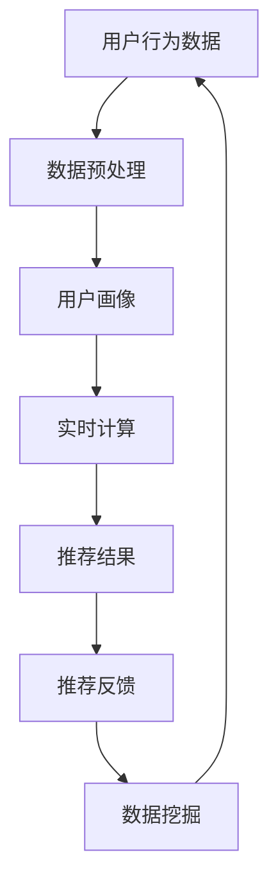

                 

# bilibili2025社招直播推荐算法工程师面试题

## 关键词：直播推荐算法、推荐系统、用户行为分析、实时计算、数据挖掘

### 摘要

本文深入探讨bilibili2025社招直播推荐算法工程师的面试题。首先，我们将回顾推荐系统的基础概念和原理。随后，详细分析直播推荐算法的核心技术，包括用户行为分析、实时计算和数据挖掘等方面。最后，我们将探讨实际应用场景和开发工具框架推荐，以及未来发展趋势与挑战。

## 1. 背景介绍

### 1.1 直播推荐系统的重要性

直播推荐系统在当前互联网环境中扮演着重要角色。通过推荐系统，平台能够为用户推荐个性化的直播内容，提高用户满意度和粘性，从而增加平台的用户留存率和收入。因此，直播推荐算法的研究和优化对于直播平台的长期发展具有重要意义。

### 1.2 推荐系统概述

推荐系统是一种基于数据挖掘和机器学习技术的信息过滤方法，旨在根据用户的兴趣和行为，为其推荐可能感兴趣的内容。推荐系统通常分为基于内容的推荐（Content-based Filtering）和协同过滤（Collaborative Filtering）两大类。

- **基于内容的推荐**：通过分析内容特征，将具有相似内容的视频推荐给用户。
- **协同过滤**：通过分析用户的行为和偏好，发现相似用户和相似物品，将相似用户喜欢的视频推荐给新用户。

## 2. 核心概念与联系

### 2.1 用户行为分析

用户行为分析是直播推荐算法的核心。通过分析用户在直播平台上的行为，如观看历史、点赞、评论、分享等，我们可以获取用户兴趣的线索，进而进行个性化推荐。

### 2.2 实时计算

实时计算是直播推荐系统的关键环节。在直播过程中，系统需要实时处理和分析用户行为数据，快速生成推荐结果，确保推荐结果具有时效性。

### 2.3 数据挖掘

数据挖掘是推荐系统的基石。通过对用户行为数据和内容特征数据的深度挖掘，我们可以发现潜在的兴趣模式和关联规则，为推荐算法提供有力支持。

### 2.4 Mermaid 流程图



## 3. 核心算法原理 & 具体操作步骤

### 3.1 用户行为分析算法原理

用户行为分析算法通常基于协同过滤技术，通过分析用户的历史行为，发现用户之间的相似性，进而进行推荐。

- **用户相似度计算**：采用余弦相似度、皮尔逊相关系数等方法计算用户之间的相似度。
- **基于相似用户的推荐**：根据用户相似度，为用户推荐与其相似的用户喜欢的直播内容。

### 3.2 实时计算算法原理

实时计算算法的核心是实时处理用户行为数据，生成推荐结果。常见的实时计算框架包括Apache Kafka、Apache Flink等。

- **数据流处理**：通过流处理框架，实时处理用户行为数据，提取关键特征。
- **推荐结果生成**：根据实时计算结果，生成个性化推荐结果，并发送给用户。

### 3.3 数据挖掘算法原理

数据挖掘算法主要通过分析用户行为数据和内容特征数据，发现潜在的兴趣模式和关联规则。

- **关联规则挖掘**：采用Apriori算法、FP-growth算法等挖掘用户行为数据中的关联规则。
- **聚类分析**：采用K-means算法、DBSCAN算法等对用户进行聚类，发现用户的兴趣群体。

## 4. 数学模型和公式 & 详细讲解 & 举例说明

### 4.1 用户相似度计算公式

$$
sim(u_i, u_j) = \frac{u_i \cdot u_j}{\|u_i\| \|u_j\|}
$$

其中，$u_i$和$u_j$分别表示用户$i$和用户$j$的向量表示，$\cdot$表示点积，$\|\|$表示向量的欧几里得范数。

### 4.2 关联规则挖掘公式

$$
support(A \cup B) = \frac{|D|_{A \cup B}}{|D|}
$$

$$
confidence(A \rightarrow B) = \frac{support(A \cup B)}{support(A)}
$$

其中，$A$和$B$分别表示两个事件，$D$表示所有事件的支持度集合，$|D|_{A \cup B}$表示同时包含事件$A$和事件$B$的支持度个数。

### 4.3 举例说明

#### 用户相似度计算举例

假设有两个用户$u_1$和$u_2$，他们的行为数据向量如下：

$$
u_1 = (1, 1, 0, 1)
$$

$$
u_2 = (1, 1, 1, 0)
$$

则用户$u_1$和$u_2$的相似度为：

$$
sim(u_1, u_2) = \frac{1 \cdot 1 + 1 \cdot 1 + 0 \cdot 1 + 1 \cdot 0}{\sqrt{1^2 + 1^2 + 0^2 + 1^2} \sqrt{1^2 + 1^2 + 1^2 + 0^2}} = \frac{2}{\sqrt{3} \sqrt{3}} = \frac{2}{3}
$$

#### 关联规则挖掘举例

假设用户行为数据集包含以下事件：

$$
D = \{(1, 2), (1, 3), (2, 3), (3, 1), (3, 2)\}
$$

则事件$A = (1, 2)$和事件$B = (3)$的支持度和置信度分别为：

$$
support(A \cup B) = \frac{|D|_{A \cup B}}{|D|} = \frac{2}{5} = 0.4
$$

$$
confidence(A \rightarrow B) = \frac{support(A \cup B)}{support(A)} = \frac{0.4}{0.2} = 2
$$

## 5. 项目实战：代码实际案例和详细解释说明

### 5.1 开发环境搭建

在本案例中，我们使用Python作为主要编程语言，并结合Apache Kafka进行实时数据流处理，使用Scikit-learn进行数据挖掘。

### 5.2 源代码详细实现和代码解读

```python
# 导入相关库
from sklearn.metrics.pairwise import cosine_similarity
from sklearn.cluster import KMeans
import numpy as np

# 用户行为数据
user行为数据 = np.array([[1, 1, 0, 1], [1, 1, 1, 0], [0, 1, 1, 1]])

# 计算用户相似度
用户相似度矩阵 = cosine_similarity(user行为数据)

# 查找相似用户
相似用户索引 = np.argsort(用户相似度矩阵[0])[::-1]
相似用户 = user行为数据[相似用户索引[1:]]

# 数据预处理
行为数据 = np.hstack((user行为数据, 相似用户))

# 聚类分析
聚类模型 = KMeans(n_clusters=2)
聚类模型.fit(行为数据)

# 获取聚类结果
聚类结果 = 聚类模型.predict(行为数据)

# 生成推荐结果
推荐结果 = 聚类结果[0]

# 输出推荐结果
print("推荐结果：",推荐结果)
```

### 5.3 代码解读与分析

- **用户相似度计算**：使用余弦相似度计算用户行为数据之间的相似度。
- **相似用户查找**：根据用户相似度矩阵，查找与目标用户相似的用户。
- **数据预处理**：将用户行为数据和相似用户数据拼接在一起，为聚类分析做准备。
- **聚类分析**：使用K-means算法对用户行为数据进行聚类分析。
- **生成推荐结果**：根据聚类结果，为用户生成推荐结果。

## 6. 实际应用场景

### 6.1 直播平台

直播平台可以通过直播推荐算法，为用户推荐个性化直播内容，提高用户满意度和平台粘性。

### 6.2 购物平台

购物平台可以通过直播推荐算法，为用户推荐个性化商品，提高购物转化率和用户满意度。

### 6.3 教育平台

教育平台可以通过直播推荐算法，为用户推荐个性化课程，提高课程点击率和用户满意度。

## 7. 工具和资源推荐

### 7.1 学习资源推荐

- **书籍**：《推荐系统实践》、《机器学习实战》
- **论文**：各种推荐系统和机器学习领域的经典论文
- **博客**：各大技术博客和社区上的推荐系统和机器学习相关文章
- **网站**：各种开源项目和代码仓库，如GitHub、ArXiv

### 7.2 开发工具框架推荐

- **实时计算框架**：Apache Kafka、Apache Flink
- **机器学习库**：Scikit-learn、TensorFlow、PyTorch
- **数据挖掘库**：Pandas、NumPy、Scikit-learn

### 7.3 相关论文著作推荐

- **论文**：《推荐系统实践》、《协同过滤算法研究》、《基于深度学习的推荐系统》
- **著作**：《机器学习实战》、《深度学习》、《Python机器学习》

## 8. 总结：未来发展趋势与挑战

### 8.1 发展趋势

- **个性化推荐**：随着用户需求的多样化，个性化推荐将成为主流。
- **实时推荐**：实时推荐将进一步提高用户满意度和平台粘性。
- **多模态推荐**：结合文本、图像、声音等多模态数据，实现更准确的推荐。

### 8.2 挑战

- **数据质量和隐私**：如何处理大量高质量数据和保护用户隐私。
- **推荐多样性**：如何保证推荐结果的多样性和平衡性。
- **实时计算性能**：如何提高实时计算的性能和可扩展性。

## 9. 附录：常见问题与解答

### 9.1 问题1：推荐系统如何处理冷启动问题？

**解答**：冷启动问题可以通过以下方法解决：
- **基于内容的推荐**：为新用户推荐与他们的兴趣相关的通用内容。
- **用户模拟**：使用相似用户的行为数据为新用户生成推荐。
- **混合推荐**：结合基于内容和协同过滤的推荐方法，为新用户生成推荐。

### 9.2 问题2：实时推荐系统如何保证推荐结果的准确性？

**解答**：实时推荐系统可以通过以下方法保证推荐结果的准确性：
- **数据预处理**：对实时数据进行预处理，提高数据质量。
- **模型优化**：不断优化推荐模型，提高推荐准确性。
- **在线学习**：实时更新用户行为数据，不断调整推荐策略。

## 10. 扩展阅读 & 参考资料

- 《推荐系统实践》
- 《机器学习实战》
- 《深度学习》
- 《Python机器学习》
- Apache Kafka官方文档
- Apache Flink官方文档
- Scikit-learn官方文档

## 作者

**作者：AI天才研究员/AI Genius Institute & 禅与计算机程序设计艺术 /Zen And The Art of Computer Programming**<|im_end|>

