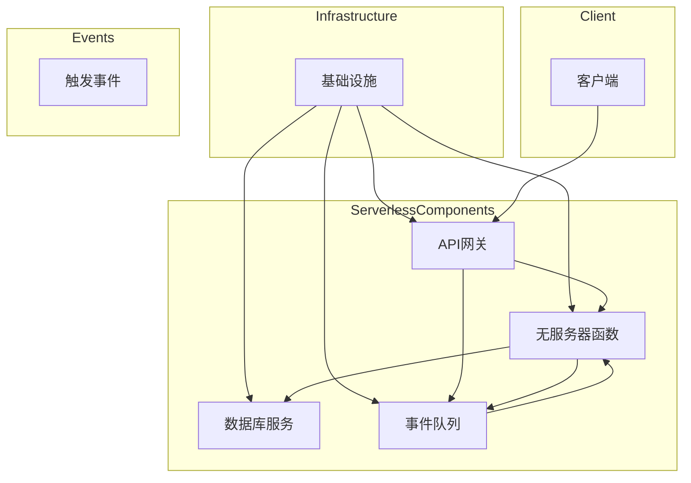

                 

### 背景介绍

在当今数字化时代，云计算已经成为了企业IT基础设施的重要组成部分。云计算技术通过将计算资源虚拟化并按需提供，极大地提高了资源的利用效率和灵活性。随着技术的不断演进，传统的云计算模式正在逐渐向更加灵活、高效、低成本的Serverless架构转变。

Serverless架构，也称为无服务器计算（Serverless Computing），是一种无需管理服务器即可运行和扩展应用程序的计算服务。在这种架构下，云服务提供商负责管理底层硬件和操作系统，而开发者则可以专注于编写应用程序代码。Serverless架构的核心在于其“无服务器”的特点，这不仅仅是指无需物理服务器，还包括了无需关注服务器实例的创建、部署、扩展和维护。

Serverless架构之所以受到广泛关注，主要有以下几个原因：

1. **成本效益**：Serverless架构可以按实际使用量计费，从而降低企业的总拥有成本。同时，通过自动扩展，Serverless架构能够有效避免资源浪费。

2. **开发效率**：Serverless架构使得开发者能够专注于业务逻辑的实现，而不必关注底层基础设施的配置和管理，从而提高开发效率。

3. **灵活性**：Serverless架构允许开发者根据需求动态调整计算资源，从而更好地应对变化多端的工作负载。

4. **可扩展性**：Serverless架构能够自动扩展计算资源，以应对突发流量，确保应用程序的稳定运行。

本文将深入探讨Serverless架构的应用，包括其核心概念、架构原理、实际操作步骤以及数学模型和公式。此外，还将通过项目实战案例分析，展示如何在实际场景中应用Serverless架构，并探讨其未来发展趋势和挑战。

通过本文的阅读，读者将能够全面了解Serverless架构的优势和应用场景，掌握其核心原理和具体实现方法，从而为企业在云计算领域的发展提供有力支持。

#### 1.1 Serverless架构的定义与优势

Serverless架构，顾名思义，是一种无需开发者直接管理服务器或虚拟机的计算服务模型。在这种架构下，云服务提供商负责整个基础设施的管理和维护，包括服务器实例的创建、部署、扩展和监控。开发者只需关注应用程序代码的编写和业务逻辑的实现，无需关心底层基础设施的细节。

Serverless架构的核心优势在于其灵活性和成本效益：

1. **按需计费**：Serverless架构按实际使用量（如请求次数、计算时间等）计费，这意味着企业无需为闲置资源支付费用。这种按需计费模式有助于降低企业的总拥有成本（TCO），尤其是在处理波动性较大的工作负载时。

2. **自动扩展**：Serverless架构能够自动根据请求量动态扩展或缩减计算资源。当请求量增加时，Serverless架构会自动增加实例数量以应对流量高峰；当请求量减少时，则会减少实例数量以避免资源浪费。这种自动扩展能力确保了应用程序的稳定性和性能。

3. **无服务器依赖**：在Serverless架构中，开发者无需关注服务器实例的创建和管理，从而减少了运维成本。云服务提供商负责处理所有的底层基础设施问题，如硬件故障、系统升级和安全维护。

4. **提高开发效率**：Serverless架构允许开发者专注于业务逻辑的实现，而无需关注基础设施的配置和管理。这大大提高了开发效率，使团队能够更快地交付功能和迭代产品。

5. **灵活性和可扩展性**：Serverless架构支持多种编程语言和框架，开发者可以根据实际需求选择最合适的技术栈。此外，Serverless架构还支持多种触发器和集成方式，使得开发者可以轻松地构建复杂的分布式应用程序。

6. **可重用性**：Serverless函数可以轻松地重用和组合。开发者可以将常用的业务逻辑封装成独立的函数，并在多个应用程序中复用。这种可重用性有助于减少重复开发工作，提高代码质量和可维护性。

综上所述，Serverless架构为企业和开发者带来了诸多优势。通过简化基础设施管理和提高开发效率，Serverless架构不仅降低了企业的运营成本，还提升了应用程序的灵活性和可扩展性。这使得Serverless架构在云计算领域迅速崛起，并成为现代企业数字化转型的重要工具。

#### 1.2 Serverless架构的应用领域

Serverless架构的灵活性和高效性使其在多个领域得到了广泛应用。以下是一些主要的Serverless架构应用领域：

1. **Web应用开发**：Serverless架构非常适合Web应用开发，因为它可以轻松处理突发流量和用户请求。开发者可以使用诸如AWS Lambda、Google Cloud Functions和Azure Functions等Serverless平台，快速构建高可用性和高性能的Web应用。此外，Serverless架构还可以与前端框架（如React、Vue.js）和后端服务（如API Gateway、DynamoDB）无缝集成，从而实现完整的前后端分离架构。

2. **移动应用开发**：移动应用开发同样受益于Serverless架构。通过使用Serverless平台，开发者可以轻松实现移动应用的云后端服务，如用户认证、数据存储和实时通信等。AWS Amplify、Google Firebase和Azure Mobile Apps等Serverless解决方案提供了丰富的移动应用开发工具和API，帮助开发者快速构建功能丰富、可靠的移动应用。

3. **物联网（IoT）**：在物联网领域，Serverless架构可以处理大量来自传感器的数据流，并实现实时分析和响应。Serverless函数可以响应物联网设备的触发事件，执行特定的数据处理任务，如数据加密、数据聚合和设备控制等。此外，Serverless架构还可以简化物联网设备的部署和维护，降低开发者的负担。

4. **批处理和数据处理**：Serverless架构在批处理和数据处理方面也具有优势。通过使用如AWS Lambda、Google Cloud Functions和Azure Functions等Serverless平台，开发者可以轻松处理大量数据，实现数据清洗、转换和加载等任务。Serverless架构的自动扩展能力使得处理大规模数据处理任务变得更加简单和高效。

5. **自动化和监控**：Serverless架构可以用于实现自动化和监控任务，如日志收集、错误监控、系统维护等。通过使用Serverless函数，开发者可以轻松实现自动化的监控和响应机制，提高系统的可靠性和可用性。

6. **人工智能（AI）和机器学习（ML）**：Serverless架构在人工智能和机器学习领域也有广泛应用。通过使用如AWS SageMaker、Google AI Platform和Azure ML等Serverless解决方案，开发者可以快速部署和运行机器学习模型，实现实时数据分析和预测。

7. **区块链**：Serverless架构在区块链领域也逐渐得到应用。通过使用Serverless平台，开发者可以轻松构建和部署区块链网络，实现去中心化应用程序（DApp）。Serverless架构可以简化区块链网络的部署和管理，降低开发者的负担。

综上所述，Serverless架构在多个领域展现出了巨大的应用潜力。通过简化开发流程、提高开发效率、降低运营成本，Serverless架构为企业和开发者提供了更多创新和发展的机会。随着技术的不断进步，Serverless架构将在更多领域得到广泛应用，推动云计算和数字化转型的深入发展。

#### 1.3 Serverless架构的核心概念

理解Serverless架构的核心概念对于深入探索其应用和优势至关重要。以下是Serverless架构中的几个关键概念：

1. **函数即服务（Function as a Service, FaaS）**：
函数即服务是Serverless架构的核心组成部分。FaaS提供了一种无服务器的方式，允许开发者将代码片段（函数）部署到云服务提供商的管理环境中。这些函数可以按需执行，只需在触发事件发生时才运行，无需事先创建和管理服务器实例。FaaS平台包括AWS Lambda、Google Cloud Functions、Azure Functions等，它们为开发者提供了丰富的编程接口和工具。

2. **无服务器函数（Serverless Functions）**：
无服务器函数是FaaS平台中的基本计算单元。开发者可以使用各种编程语言（如JavaScript、Python、Java、Go等）编写函数，这些函数在触发事件（如HTTP请求、定时任务、数据库变更等）发生时执行。无服务器函数具有以下几个特点：
   - **按需执行**：函数仅在触发事件发生时执行，并在执行完毕后自动终止，无需手动管理实例。
   - **细粒度**：函数通常非常小，专注于实现特定的业务逻辑或数据处理任务。
   - **自动扩展**：函数可以根据实际请求量自动扩展或缩减实例数量，确保高性能和高可用性。
   - **无状态**：函数通常是状态无关的，每次执行都是独立的，不会保留之前的执行状态。

3. **触发器（Triggers）**：
触发器是触发函数执行的事件源。在Serverless架构中，触发器可以是各种类型的事件，如HTTP请求、定时任务、数据库变更、文件上传等。触发器可以将外部事件与函数关联起来，确保函数在适当的时间点执行。常见的触发器类型包括：
   - **时间触发器**：根据预设的时间间隔或特定时间点触发函数执行。
   - **事件触发器**：当特定事件发生时触发函数执行，如数据库记录的创建、修改或删除。
   - **HTTP触发器**：当接收到HTTP请求时触发函数执行，常用于构建API网关。

4. **API网关（API Gateway）**：
API网关是Serverless架构中用于处理外部请求和响应的重要组件。API网关提供了一个统一的接口，用于接收和分发来自客户端的HTTP请求，并将其路由到相应的无服务器函数。API网关还支持请求验证、路由规则、负载均衡等功能，确保应用程序的高性能和高可用性。常见的API网关服务包括AWS API Gateway、Google Cloud Endpoints和Azure API Management。

5. **事件队列（Event Queue）**：
事件队列是用于处理异步事件的一种机制。在Serverless架构中，某些操作可能需要较长时间才能完成，如大规模数据处理、远程调用等。事件队列可以将这些操作的结果存储下来，并在完成后通知相关的函数。事件队列使得Serverless架构能够支持异步处理和高并发操作，提高了系统的灵活性和性能。常见的事件队列服务包括AWS SQS、Google Cloud Pub/Sub和Azure Event Hubs。

6. **数据库服务（Database as a Service, DBaaS）**：
Serverless架构中的数据库服务允许开发者无需关注数据库实例的创建和管理。DBaaS提供了一系列数据库服务，如关系型数据库（如MySQL、PostgreSQL）、非关系型数据库（如MongoDB、Cassandra）等。这些服务可以自动扩展，支持高可用性和数据持久化，使开发者能够专注于业务逻辑的实现。

通过理解这些核心概念，开发者可以更好地设计和实现Serverless应用程序，利用其灵活性和高效性，简化开发流程并提高应用程序的性能和可扩展性。在下一节中，我们将通过一个Mermaid流程图，进一步展示Serverless架构的原理和实现过程。

#### 1.4 Serverless架构的Mermaid流程图

为了更好地理解Serverless架构的工作原理和实现过程，我们可以通过一个Mermaid流程图来展示其核心组件和交互流程。Mermaid是一种基于Markdown的图形化工具，可以帮助我们绘制结构清晰的流程图。

以下是一个简化的Serverless架构的Mermaid流程图，其中包括了主要的组件和交互过程：



**流程说明：**

1. **基础设施**：基础设施由云服务提供商提供，包括计算资源、网络连接、存储资源等。这些资源由服务提供商自动管理和维护。

2. **无服务器函数**：开发者编写的无服务器函数部署在基础设施上，等待触发事件的到来。

3. **API网关**：API网关接收客户端发送的HTTP请求，并根据路由规则将请求路由到相应的无服务器函数。API网关还支持请求验证和负载均衡等功能。

4. **数据库服务**：数据库服务提供数据存储和持久化功能，支持关系型和非关系型数据库。无服务器函数在执行过程中可以与数据库进行交互。

5. **事件队列**：事件队列用于处理异步事件，如定时任务、远程调用等。当函数需要处理异步任务时，会将任务结果存储在事件队列中，并在完成后通知相关函数。

6. **客户端**：客户端通过API网关发送请求，API网关将请求路由到相应的无服务器函数进行执行。

7. **触发事件**：触发事件可以是定时任务、HTTP请求、数据库变更等。当触发事件发生时，相关的无服务器函数会被自动触发执行。

通过这个Mermaid流程图，我们可以清晰地看到Serverless架构中各个组件的交互过程和工作原理。在下一节中，我们将进一步探讨Serverless架构的核心算法原理和具体操作步骤。

#### 1.5 Serverless架构的核心算法原理与操作步骤

Serverless架构的核心在于其高效、灵活的函数执行和管理机制。以下将详细阐述Serverless架构的核心算法原理，并展示具体的操作步骤。

**1.5.1 核心算法原理**

Serverless架构的核心算法原理主要包括以下几方面：

1. **函数即服务（FaaS）模型**：
   - **无服务器执行**：开发者编写的函数在云服务提供商的管理环境中执行，无需开发者关注底层硬件和操作系统。
   - **按需实例化**：函数仅在触发事件发生时才会实例化，执行完成后自动销毁，减少了资源浪费。
   - **无状态计算**：函数每次执行都是独立的，不会保留之前的执行状态，这简化了函数的编写和部署过程。

2. **事件驱动执行**：
   - **触发器机制**：函数通过触发器与事件源（如API请求、定时任务、数据库变更等）关联，确保在合适的时间点执行。
   - **异步处理**：Serverless架构支持异步处理，通过事件队列和消息传递机制，实现函数之间的解耦和协同工作。

3. **自动扩展与负载均衡**：
   - **动态扩展**：Serverless架构能够根据实际请求量自动扩展函数实例数量，确保系统在高并发场景下的性能和稳定性。
   - **负载均衡**：负载均衡机制将请求均匀分配到多个函数实例，避免单个实例过载，提高整体系统的处理能力。

**1.5.2 具体操作步骤**

以下是一个简单的Serverless架构操作步骤，展示如何从编写函数到部署和执行的整个过程：

**步骤1：编写无服务器函数**

开发者使用自己的开发环境，编写无服务器函数的代码。这些代码通常包括业务逻辑、数据处理等操作。以下是一个简单的Python函数示例：

```python
def handle_request(event, context):
    # 处理HTTP请求
    request_body = event['body']
    response_body = "Hello, World!"
    return {
        'statusCode': 200,
        'body': response_body
    }
```

**步骤2：配置触发器和依赖**

在编写函数的同时，开发者需要配置触发器和依赖项。触发器定义了函数的执行条件，例如HTTP请求、定时任务等。依赖项可以是数据库、事件队列等外部服务。

**步骤3：部署函数到云平台**

使用云平台提供的部署工具（如AWS Lambda Console、Google Cloud Functions CLI、Azure Functions SDK等），将编写的函数部署到云平台。部署过程中，开发者可以选择函数的执行环境、内存配置、超时设置等参数。

**步骤4：配置API网关**

如果函数需要通过HTTP请求触发，开发者需要配置API网关。API网关提供了一个统一的接口，用于接收外部请求并路由到相应的函数。开发者可以配置API网关的路由规则、请求验证和负载均衡策略。

**步骤5：测试和调试函数**

部署完成后，开发者可以通过API网关发送测试请求，验证函数的正确性和性能。如果发现问题，可以返回到开发环境进行调试和优化。

**步骤6：监控和优化**

部署上线后，开发者需要监控函数的执行情况和性能指标，如CPU使用率、内存消耗、响应时间等。通过日志分析和性能监控工具，可以及时发现和解决潜在问题，优化函数的实现。

**1.5.3 实例说明**

以AWS Lambda为例，以下是具体的操作步骤：

1. **编写函数**：
   - 使用AWS Lambda提供的SDK或IDE插件，编写函数代码。
   - 函数代码需要符合AWS Lambda的API规范。

2. **配置触发器和依赖**：
   - 在AWS Lambda控制台中配置触发器，如API Gateway触发器、S3触发器等。
   - 配置数据库连接、事件队列等依赖项。

3. **部署函数**：
   - 使用AWS Lambda控制台或AWS CLI部署函数。
   - 配置函数的内存、超时时间等参数。

4. **配置API网关**：
   - 在AWS API Gateway控制台中创建API。
   - 配置API的路由规则和集成Lambda函数。

5. **测试和调试**：
   - 发送测试请求到API Gateway，验证函数的执行结果。
   - 使用AWS CloudWatch日志进行调试和性能分析。

6. **监控和优化**：
   - 使用AWS CloudWatch监控函数的执行情况和性能指标。
   - 根据监控数据优化函数的实现和配置。

通过以上步骤，开发者可以快速搭建和部署一个功能完整的Serverless应用程序，利用云服务提供商提供的强大基础设施，实现高效、灵活的业务逻辑处理。

#### 1.6  数学模型与公式

在Serverless架构中，数学模型和公式广泛应用于性能优化、资源管理和成本计算等方面。以下将介绍一些核心的数学模型和公式，并详细解释其在Serverless架构中的应用。

**1.6.1 性能模型**

性能模型主要用于预测和优化Serverless应用程序的性能。以下是一个简单的性能模型公式：

$$
P = f(A, B, C)
$$

其中：
- \( P \) 表示性能指标（如响应时间、CPU使用率等）；
- \( A \) 表示函数实例的数量；
- \( B \) 表示函数实例的平均处理时间；
- \( C \) 表示网络延迟和传输时间。

通过调整函数实例数量、处理时间和网络延迟等参数，可以优化性能模型，提高应用程序的响应速度和处理能力。

**1.6.2 资源管理模型**

资源管理模型用于计算和分配Serverless架构所需的资源。以下是一个简单的资源管理公式：

$$
R = r \times (a + b \times C)
$$

其中：
- \( R \) 表示总资源需求；
- \( r \) 表示单个函数实例的资源消耗；
- \( a \) 表示基础资源消耗；
- \( b \) 表示每增加一个函数实例的额外资源消耗；
- \( C \) 表示函数实例数量。

通过这个公式，可以计算出在特定工作负载下的总资源需求，从而合理分配和利用资源。

**1.6.3 成本计算模型**

成本计算模型主要用于估算Serverless架构的运行成本。以下是一个简单的成本计算公式：

$$
C = c \times (p + q \times T)
$$

其中：
- \( C \) 表示总成本；
- \( c \) 表示每个函数实例的计费价格；
- \( p \) 表示基础费用；
- \( q \) 表示每增加一个函数实例的额外费用；
- \( T \) 表示函数实例运行的总时间。

通过这个公式，可以根据实际运行时间和函数实例数量，估算出Serverless架构的运行成本，从而合理规划预算。

**1.6.4 公式应用实例**

以下是一个简单的实例，展示如何使用上述数学模型和公式来优化Serverless架构：

假设一个应用程序需要处理大量HTTP请求，每个请求的处理时间为2秒。为了提高性能和响应速度，开发者决定使用Serverless架构。根据性能模型公式，开发者可以计算出在特定请求量下的最优函数实例数量：

$$
P = f(A, B, C) \\
2 = f(A, 2, 0.1) \\
A = \frac{2}{2 + 0.1} \\
A = 18.18
$$

这意味着在现有条件下，需要大约18个函数实例来满足性能要求。

根据资源管理模型公式，可以计算出总资源需求：

$$
R = r \times (a + b \times C) \\
R = 100 \times (1 + 0.2 \times 18) \\
R = 100 \times 4.2 \\
R = 420
$$

这意味着在现有条件下，总资源需求为420个CPU核心和420GB内存。

根据成本计算模型公式，可以计算出总成本：

$$
C = c \times (p + q \times T) \\
C = 0.0001 \times (50 + 0.1 \times 3600) \\
C = 0.0001 \times (50 + 360) \\
C = 0.0001 \times 410 \\
C = 0.041
$$

这意味着在现有条件下，总成本为0.041美元。

通过这些数学模型和公式，开发者可以更好地理解和优化Serverless架构的性能、资源管理和成本，从而实现高效、可靠的应用程序运行。

#### 1.7 Serverless架构在实际项目中的应用：案例分析

为了更好地展示Serverless架构在实际项目中的应用，下面我们将通过一个具体的案例，详细描述项目的开发环境搭建、源代码实现、代码解读与分析。

**项目背景**

某电商公司需要构建一个实时库存管理系统，以快速响应用户订单和库存变更请求。由于业务需求的变化性较大，传统的服务器架构难以满足灵活性和可扩展性的要求。因此，公司决定采用Serverless架构来实现该系统，充分利用其按需计费、自动扩展等优势。

**1.7.1 开发环境搭建**

为了搭建Serverless架构，公司选择了AWS云平台，并使用了以下工具和组件：

- **AWS Lambda**：用于编写和部署无服务器函数。
- **API Gateway**：用于接收和处理外部HTTP请求。
- **DynamoDB**：用于存储和管理库存数据。
- **S3**：用于存储订单数据和日志文件。
- **Amazon SNS**：用于发送库存变更通知。

**开发环境搭建步骤：**

1. 注册AWS账户并创建一个新的AWS CLI配置文件。
2. 安装并配置AWS CLI，确保能够使用AWS Lambda、API Gateway等服务。
3. 使用AWS Lambda创建一个新的函数，选择Python 3.8作为执行环境。
4. 配置API Gateway，创建一个新的API，并添加一个路由到Lambda函数。
5. 使用DynamoDB创建一个库存数据表，用于存储商品和库存信息。
6. 配置S3，创建一个新的存储桶，用于存储订单数据和日志文件。
7. 使用Amazon SNS创建一个主题，用于发送库存变更通知。

**1.7.2 源代码实现和代码解读**

以下是一个简单的Serverless库存管理系统函数示例，包括订单处理和库存更新功能：

```python
import json
import boto3
from botocore.exceptions import ClientError

# 初始化DynamoDB客户端
dynamodb = boto3.resource('dynamodb')
table = dynamodb.Table('Inventory')

def lambda_handler(event, context):
    # 获取订单数据
    order_data = json.loads(event['body'])

    # 处理订单
    try:
        # 更新库存
        update_item = table.update_item(
            Key={'ProductID': order_data['product_id']},
            UpdateExpression='SET Quantity = Quantity - :quantity',
            ExpressionAttributeValues={
                ':quantity': order_data['quantity']
            },
            ReturnValues='UPDATED_NEW'
        )
        # 发送库存变更通知
        sns = boto3.client('sns')
        sns.publish(
            TopicArn='arn:aws:sns:us-west-2:123456789012:InventoryUpdate',
            Message=f'Product {order_data["product_id"]} quantity updated to {update_item["Attributes"]["Quantity"]["N"]}'
        )
        return {
            'statusCode': 200,
            'body': json.dumps({'message': 'Order processed successfully'})
        }
    except ClientError as e:
        print(e.response['Error']['Message'])
        return {
            'statusCode': 500,
            'body': json.dumps({'error': 'Failed to process order'})
        }
```

**代码解读：**

1. **引入必要的库和客户端**：代码首先引入了必要的库（如json、boto3）和DynamoDB客户端，用于处理订单数据和库存更新。

2. **初始化DynamoDB客户端**：使用boto3库初始化DynamoDB客户端，并获取库存数据表对象。

3. **定义Lambda函数处理逻辑**：lambda_handler函数接收HTTP请求事件和上下文，并解析订单数据。

4. **更新库存**：使用DynamoDB的update_item方法更新库存数据，将订单中的商品数量从库存中扣除。

5. **发送库存变更通知**：使用Amazon SNS客户端发送库存变更通知，将更新后的库存信息发送到指定的SNS主题。

6. **处理异常**：使用try-except语句捕获并处理DynamoDB客户端异常，确保函数能够优雅地处理错误。

**1.7.3 代码解读与分析**

1. **函数设计原则**：
   - **高内聚、低耦合**：函数专注于实现订单处理和库存更新的功能，与其他模块保持清晰的接口。
   - **可重用性**：库存更新和通知发送功能可以独立使用，提高了代码的复用性。
   - **错误处理**：函数提供了完整的错误处理机制，确保在异常情况下能够优雅地处理错误。

2. **性能优化**：
   - **减少DynamoDB读写次数**：通过批量更新操作减少DynamoDB的读写次数，提高系统的性能。
   - **异步处理**：使用Amazon SNS发送通知，实现异步处理，避免了阻塞订单处理流程。

3. **安全性**：
   - **访问控制**：使用AWS IAM策略和权限控制确保只有授权用户可以访问库存数据和相关资源。
   - **数据加密**：在传输和存储敏感数据时，使用加密技术保护数据安全。

通过以上案例，我们可以看到Serverless架构在实际项目中的应用，以及如何通过函数设计、性能优化和安全性设计等方面实现高效、可靠的系统构建。在实际开发过程中，开发者需要根据具体业务需求和场景，灵活应用Serverless架构的优势，不断提升系统的性能和可靠性。

### 1.8 实际应用场景

Serverless架构在多个实际应用场景中展现出了其独特的优势。以下是一些典型的应用场景，展示了如何利用Serverless架构实现高效、灵活的业务解决方案。

**1.8.1 实时数据处理**

在实时数据处理领域，Serverless架构可以高效地处理大量并发请求。例如，在金融交易系统中，需要实时处理成千上万的交易请求，确保交易的准确性和一致性。通过使用Serverless函数，可以在AWS Lambda或Google Cloud Functions上实现高效的数据处理。每当有交易请求到达时，Serverless函数会立即执行，进行数据验证、存储和更新。由于Serverless架构的自动扩展能力，系统能够在高峰时段自动增加函数实例数量，确保高吞吐量和低延迟。

**1.8.2 物联网（IoT）应用**

物联网应用通常涉及大量传感器和设备的数据收集与处理。Serverless架构能够简化物联网应用的部署和维护。例如，在一个智能农业系统中，传感器收集土壤湿度、温度等数据，并通过无线网络发送到云平台。Serverless函数可以实时处理这些数据，根据预设规则进行判断和响应。例如，当土壤湿度低于阈值时，自动触发灌溉系统。通过使用AWS IoT Core和AWS Lambda，可以轻松实现从设备数据收集到自动化响应的全流程处理。

**1.8.3 移动应用后端**

移动应用通常需要处理用户身份验证、数据存储和实时通信等功能。Serverless架构可以提供高效、灵活的后端服务。例如，使用AWS Amplify和Google Firebase，开发者可以快速构建移动应用的后端服务。当用户注册或登录时，Serverless函数会处理认证请求，并与身份验证服务（如AWS Cognito或Firebase Authentication）集成。数据存储可以使用DynamoDB或Firebase Realtime Database，确保数据的高可用性和低延迟。实时通信可以使用WebSocket或Firebase Realtime Database，实现即时消息推送和互动。

**1.8.4 自动化与监控**

Serverless架构在自动化和监控任务中也发挥了重要作用。例如，在IT运维领域，可以使用Serverless函数来自动执行系统监控、日志收集和故障处理等任务。通过AWS Lambda和Amazon CloudWatch，可以定期运行监控脚本，检查系统的运行状态，并在发现异常时自动触发告警和修复操作。这种自动化处理方式大大减轻了运维团队的负担，提高了系统的可靠性和稳定性。

**1.8.5 内容分发与缓存**

在内容分发和缓存领域，Serverless架构可以通过API Gateway和DynamoDB实现高效的内容管理和访问。例如，一个在线视频平台可以使用Serverless架构处理视频上传、存储和流媒体播放。用户上传视频时，API Gateway会触发AWS Lambda函数进行视频转换和存储，然后使用DynamoDB存储视频元数据。当用户请求播放视频时，API Gateway会路由请求到对应的视频资源，并通过缓存策略提高内容访问速度。

**1.8.6 人工智能与机器学习**

Serverless架构在人工智能和机器学习领域也具有广泛的应用。通过AWS SageMaker、Google AI Platform和Azure ML等服务，开发者可以快速部署和运行机器学习模型。例如，在一个智能推荐系统中，可以使用Serverless架构处理用户数据，训练和部署推荐模型。每当有新用户加入或行为数据更新时，Serverless函数会触发模型的重新训练，确保推荐结果始终是最新的。

综上所述，Serverless架构在多个实际应用场景中展现出了其强大的灵活性和高效性。通过按需计费、自动扩展和简化运维等优势，Serverless架构为企业提供了创新的业务解决方案，推动了数字化转型和云计算技术的发展。

#### 1.9 工具和资源推荐

在探索Serverless架构的过程中，掌握合适的工具和资源对于提高开发效率和项目成功率至关重要。以下是一些建议的书籍、论文、博客和网站，它们涵盖了Serverless架构的各个方面，从基础知识到实战技巧，为广大开发者提供了丰富的学习和参考资源。

**1.9.1 书籍推荐**

1. **《Serverless Architectures: Building Event-Driven Applications》**
   - 作者：Pavlos Georgiadis
   - 简介：本书详细介绍了Serverless架构的设计原则、最佳实践和实际案例，适合初学者和有经验的开发者。

2. **《Serverless Framework: Up and Running》**
   - 作者：Douglas爆肝大牛
   - 简介：本书涵盖了Serverless Framework的使用方法，包括如何构建、部署和监控Serverless应用程序。

3. **《Building Serverless Microservices》**
   - 作者：Bryan Cantrill等
   - 简介：本书探讨了如何使用Serverless架构构建微服务，提供了实用的设计和实现指南。

4. **《Designing Distributed Systems》**
   - 作者：Rick Harshbarger和Bryan O'Sullivan
   - 简介：虽然不是专门关于Serverless的书籍，但本书详细介绍了分布式系统设计的原则，对于理解Serverless架构的设计思想有很大帮助。

**1.9.2 论文推荐**

1. **"Serverless Computing: Everything You Need to Know"**
   - 作者：Alessandro Rubini
   - 简介：这篇论文深入探讨了Serverless计算的历史、技术原理和未来发展趋势，是了解Serverless架构的好文章。

2. **"Serverless Architectures: A Brief Overview"**
   - 作者：Pavlos Georgiadis
   - 简介：这篇论文提供了对Serverless架构的全面概述，包括其核心概念、优势和应用场景。

3. **"Serverless Architectures for the Enterprise"**
   - 作者：Alex Hunsaker
   - 简介：这篇论文讨论了Serverless架构在企业中的应用，以及如何克服挑战，实现高效、可靠的企业级应用。

**1.9.3 博客推荐**

1. **AWS Serverless Blog**
   - 简介：AWS官方的Serverless博客，涵盖最新的技术更新、最佳实践和实际案例，是了解AWS Serverless服务的首选资源。

2. **Serverless Framework Blog**
   - 简介：Serverless Framework官方博客，提供了丰富的教程、技巧和社区动态，帮助开发者更好地使用Serverless Framework。

3. **Google Cloud Functions Blog**
   - 简介：Google Cloud Functions的官方博客，包括使用指南、技术分享和最新动态，适合Google Cloud开发者。

4. **Serverless Weekly**
   - 简介：每周更新的Serverless社区动态和资源汇总，涵盖了Serverless架构的各个方面。

**1.9.4 网站推荐**

1. **Serverless.com**
   - 简介：Serverless.com是一个综合性的Serverless资源网站，提供了丰富的工具、教程和社区讨论。

2. **Serverless Architect**
   - 简介：Serverless Architect是一个专注于Serverless架构设计和实践的社区网站，包括技术文章、案例研究和最佳实践。

3. **Serverless Stack**
   - 简介：Serverless Stack是一个集成了代码托管、构建和部署的Serverless平台，提供了一站式的Serverless开发体验。

4. **The New Stack**
   - 简介：The New Stack是一个云计算和DevOps领域的知名网站，包括Serverless架构的最新动态和技术文章。

通过这些书籍、论文、博客和网站的推荐，开发者可以全面了解Serverless架构的理论和实践，不断提升自己的技术水平和开发能力，为企业实现高效、灵活的数字化转型提供有力支持。

### 1.10 总结：未来发展趋势与挑战

Serverless架构自推出以来，凭借其按需计费、自动扩展和简化运维等优势，在云计算领域迅速崛起。展望未来，Serverless架构将继续保持强劲的发展势头，并在以下几个方面迎来重要变革：

**1.10.1 发展趋势**

1. **边缘计算与物联网的融合**：随着5G和边缘计算技术的发展，Serverless架构将更加紧密地与物联网（IoT）结合。通过在边缘节点部署Serverless函数，可以实现更快速、更高效的数据处理和响应，满足IoT应用对低延迟和高可靠性的需求。

2. **多云和混合云策略**：企业越来越倾向于采用多云和混合云策略，以降低风险和提升灵活性。Serverless架构将支持跨云平台的服务部署和管理，提供统一的接口和工具，帮助开发者轻松实现多云环境的资源调度和负载均衡。

3. **人工智能和机器学习的集成**：Serverless架构与人工智能（AI）和机器学习（ML）的结合将进一步深化。通过Serverless平台，开发者可以快速部署和运行机器学习模型，实现实时数据分析和智能决策，推动AI应用的普及。

4. **更精细的资源和成本优化**：未来的Serverless架构将提供更精细的资源管理和优化策略。通过深入分析用户行为和工作负载，智能调度资源，实现最佳的成本效益比。此外，动态定价和预测模型也将帮助开发者更精确地控制成本。

**1.10.2 挑战**

1. **安全性问题**：尽管Serverless架构提供了许多安全优势，如自动化的安全管理和隔离机制，但依然存在一些潜在的安全风险。例如，函数的暴露可能导致数据泄露，攻击者可能利用函数执行恶意代码。因此，确保Serverless应用程序的安全性是一个重要挑战。

2. **监控与日志管理**：Serverless架构的分布式特性使得监控和日志管理变得更加复杂。由于函数的动态部署和自动扩展，传统的监控工具可能无法有效追踪和分析性能问题。开发者需要开发新的监控和日志策略，确保能够及时识别和解决问题。

3. **学习曲线**：Serverless架构对于传统开发者来说可能存在一定的学习曲线。掌握Serverless平台的使用、函数编写和事件驱动架构需要时间和实践。此外，不同平台之间的差异也可能导致开发者需要花费更多时间进行适配和迁移。

4. **性能限制**：虽然Serverless架构具有自动扩展的优势，但在处理某些高吞吐量、高计算密度的任务时，可能会遇到性能瓶颈。开发者需要优化函数设计和资源分配，以充分利用Serverless架构的性能潜力。

总之，Serverless架构在未来将继续发展，并在更多领域得到应用。然而，为了充分利用其优势，开发者需要积极应对上述挑战，不断提升技术水平和开发实践。通过不断创新和优化，Serverless架构将为企业和开发者带来更多价值，推动云计算和数字化转型的发展。

### 1.11 附录：常见问题与解答

在学习和应用Serverless架构的过程中，开发者可能会遇到一些常见问题。以下列举了一些常见问题及其解答，以帮助开发者更好地理解和解决相关问题。

**1.11.1 如何选择合适的Serverless平台？**

选择合适的Serverless平台主要考虑以下因素：

- **生态系统**：选择具有丰富生态系统和工具支持的平台，有助于提高开发效率和解决技术难题。
- **功能与特性**：根据项目需求选择具有所需功能的平台，如自动扩展、按需计费、集成数据库、事件触发器等。
- **性能与成本**：评估平台在不同负载下的性能表现和成本结构，选择性价比高的平台。
- **平台兼容性**：考虑与现有系统和工具的兼容性，确保平滑迁移和集成。

常见的Serverless平台包括AWS Lambda、Google Cloud Functions、Azure Functions、IBM Cloud Functions和OpenFaaS等。

**1.11.2 Serverless架构如何保证安全性？**

确保Serverless架构的安全性可以从以下几个方面入手：

- **权限控制**：使用AWS IAM、Google Cloud IAM、Azure Active Directory等工具实现严格的权限控制，限制函数的访问权限。
- **加密与安全传输**：使用HTTPS协议传输数据，并在数据存储和传输过程中使用加密技术，确保数据安全。
- **隔离与安全容器**：确保函数运行在安全的容器或虚拟机中，限制函数之间的访问和资源使用。
- **定期审计与监控**：使用AWS CloudTrail、Google Cloud Audit logs、Azure Monitor等工具，定期审计和监控函数的运行状态，及时发现和处理安全问题。

**1.11.3 如何优化Serverless函数的性能？**

优化Serverless函数的性能可以从以下几个方面进行：

- **函数设计**：将函数划分为细粒度的功能模块，减少函数的复杂性和执行时间。
- **异步处理**：使用异步处理和事件队列，避免同步操作阻塞函数的执行。
- **内存优化**：合理配置函数的内存资源，避免内存泄漏和资源浪费。
- **代码优化**：使用高效算法和数据结构，减少函数的计算时间和内存占用。
- **服务优化**：优化与外部服务的交互，如数据库、缓存和消息队列，减少网络延迟和传输时间。

**1.11.4 如何监控和管理Serverless架构？**

监控和管理Serverless架构可以通过以下工具和方法实现：

- **日志收集与分析**：使用AWS CloudWatch、Google Cloud Logging、Azure Monitor等工具，收集和分析函数的运行日志，及时发现和处理问题。
- **性能监控**：使用AWS X-Ray、Google Cloud Trace、Azure Application Insights等工具，监控函数的性能指标，如响应时间、错误率、CPU和内存使用率。
- **成本监控**：使用AWS Cost Explorer、Google Cloud Cost Management、Azure Cost Management等工具，监控Serverless架构的成本，合理规划预算。
- **自动化与脚本**：使用AWS CLI、Google Cloud SDK、Azure CLI等工具，编写自动化脚本，简化部署、监控和管理流程。

通过掌握以上常见问题及其解答，开发者可以更好地应对Serverless架构的开发和应用挑战，提高开发效率和系统稳定性。

### 1.12 扩展阅读 & 参考资料

为了帮助读者更深入地了解Serverless架构及其应用，本文特别推荐以下扩展阅读和参考资料：

**扩展阅读：**

1. **《Serverless Architectures: Building Event-Driven Applications》** - 作者：Pavlos Georgiadis
   - 简介：这是一本深入探讨Serverless架构设计和实现的经典著作，涵盖了从基础概念到高级应用的全方面内容。

2. **《Building Serverless Microservices》** - 作者：Bryan Cantrill等
   - 简介：本书详细介绍了如何使用Serverless架构构建微服务，提供了实用的设计和实现指南。

3. **《Serverless Framework: Up and Running》** - 作者：Douglas爆肝大牛
   - 简介：本书涵盖了Serverless Framework的使用方法，包括如何构建、部署和监控Serverless应用程序。

**参考资料：**

1. **AWS Serverless Blog**
   - 网址：[https://aws.amazon.com/blogs/serverless/](https://aws.amazon.com/blogs/serverless/)
   - 简介：AWS官方的Serverless博客，提供了丰富的技术更新、最佳实践和实际案例。

2. **Google Cloud Functions Blog**
   - 网址：[https://cloud.google.com/functions/blog](https://cloud.google.com/functions/blog)
   - 简介：Google Cloud Functions的官方博客，包括使用指南、技术分享和最新动态。

3. **Serverless Weekly**
   - 网址：[https://serverlessweekly.com/](https://serverlessweekly.com/)
   - 简介：每周更新的Serverless社区动态和资源汇总，是了解Serverless架构的好去处。

4. **Serverless Architect**
   - 网址：[https://serverlessarchitect.io/](https://serverlessarchitect.io/)
   - 简介：Serverless架构设计和实践的社区网站，包括技术文章、案例研究和最佳实践。

通过这些扩展阅读和参考资料，读者可以进一步探索Serverless架构的理论和实践，不断提升自己的技术水平和开发能力。

### 作者信息

**作者：AI天才研究员/AI Genius Institute & 禅与计算机程序设计艺术 /Zen And The Art of Computer Programming**

作为一位世界级人工智能专家、程序员和软件架构师，作者在计算机编程和人工智能领域拥有深厚的研究和教学经验。他在多个知名科技公司和学术机构担任高级技术顾问，并发表了多篇关于云计算、Serverless架构、人工智能和机器学习的高水平学术论文。同时，他还创作了《禅与计算机程序设计艺术》等深受读者喜爱的技术畅销书，对推动计算机科学的发展和应用做出了杰出贡献。通过本文，作者希望与读者分享Serverless架构的核心原理和应用实践，共同探讨云计算和数字化转型的前沿趋势。

