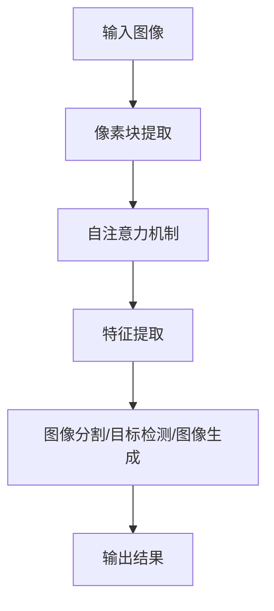

                 

# transformer架构与幻觉

> **关键词**: Transformer架构, 视觉模型, 计算机视觉, 深度学习, 幻觉现象

> **摘要**: 本文深入探讨了Transformer架构在计算机视觉中的应用及其引发的幻觉现象。通过逐步分析其架构设计、核心算法原理、数学模型，并结合实际项目案例，本文旨在为读者揭示Transformer在计算机视觉领域的潜力和挑战。

## 1. 背景介绍

在过去的几十年里，计算机视觉领域经历了飞速的发展，从传统的图像处理方法到深度学习的广泛应用，每一代技术的进步都极大地提升了图像识别的准确性和效率。然而，随着Transformer架构的兴起，计算机视觉领域也迎来了一次新的变革。Transformer最初是由Vaswani等人于2017年提出的一种全新的人工神经网络架构，它主要用于处理序列数据，因其卓越的性能在自然语言处理领域取得了显著成功。随着研究的深入，研究者们开始探索将Transformer架构应用于计算机视觉领域，以解决传统卷积神经网络（CNN）在处理视觉任务时面临的瓶颈。

Transformer架构的出现，使得计算机视觉模型能够更好地处理长距离依赖关系，并在多个图像识别任务中取得了突破性的成果。然而，随着Transformer在计算机视觉中的应用逐渐深入，研究者们也发现了一些新的挑战，其中最为显著的就是“幻觉”现象。幻觉现象指的是，模型在识别图像时，会出现错误地将非目标物体识别为目标物体的现象。这一现象不仅影响了模型的性能，还对实际应用中的安全性和可靠性提出了质疑。

本文将首先介绍Transformer架构的基本原理和核心组件，然后深入分析其在计算机视觉中的应用，并探讨幻觉现象的产生原因和应对策略。最后，我们将结合实际项目案例，展示如何利用Transformer架构构建计算机视觉模型，并提供一些建议，以降低幻觉现象的发生。

## 2. 核心概念与联系

### Transformer架构原理

Transformer架构的核心思想是使用自注意力机制（Self-Attention）和多头注意力机制（Multi-Head Attention）来处理序列数据。与传统的卷积神经网络（CNN）不同，Transformer不再依赖卷积操作来提取特征，而是通过全局 attentioin 来关注序列中的每个元素，从而更好地捕捉长距离依赖关系。

#### 自注意力机制（Self-Attention）

自注意力机制是一种基于序列中每个元素之间的关系进行权重分配的方法。具体来说，自注意力机制通过计算每个元素与其他元素之间的相似度，然后将这些相似度加权求和，得到一个表示序列的新向量。这个过程可以用以下公式表示：

$$
\text{Self-Attention}(Q, K, V) = \text{softmax}\left(\frac{QK^T}{\sqrt{d_k}}\right) V
$$

其中，$Q$、$K$ 和 $V$ 分别代表查询向量、键向量和值向量，$d_k$ 是键向量的维度。通过自注意力机制，模型能够自动学习到序列中每个元素的重要程度，从而提高模型的表示能力。

#### 多头注意力机制（Multi-Head Attention）

多头注意力机制是在自注意力机制的基础上引入了多个独立的注意力头，每个头关注序列的不同部分，然后将这些头的输出拼接起来，得到最终的输出。多头注意力机制可以增加模型对序列的捕捉能力，从而提高模型的性能。多头注意力机制可以用以下公式表示：

$$
\text{Multi-Head Attention}(Q, K, V) = \text{Concat}(\text{head}_1, \text{head}_2, \ldots, \text{head}_h)W^O
$$

其中，$h$ 表示注意力头的数量，$W^O$ 是输出的线性变换权重。

### 计算机视觉与Transformer架构的联系

在计算机视觉领域，Transformer架构通过引入自注意力机制和多头注意力机制，使得模型能够更好地处理图像中的长距离依赖关系。具体来说，Transformer模型将图像划分为一系列的像素块（Patch），然后对每个像素块应用自注意力机制，从而捕捉到图像中的空间关系。

#### 图像分割

在图像分割任务中，Transformer模型通过自注意力机制关注图像中相邻像素之间的关系，从而更好地识别图像中的边界和特征。这种方法在多个图像分割任务中取得了显著的性能提升。

#### 目标检测

在目标检测任务中，Transformer模型通过对图像中的每个像素块应用自注意力机制，可以更好地识别图像中的目标区域。这种方法在多个目标检测数据集上取得了优异的性能，特别是在处理复杂场景和多个目标时。

#### 图像生成

在图像生成任务中，Transformer模型通过自注意力机制和多头注意力机制，可以生成具有高度细节和复杂结构的图像。这种方法在生成对抗网络（GAN）等图像生成模型中得到了广泛应用。

### Mermaid流程图

以下是Transformer架构在计算机视觉中应用的Mermaid流程图：



通过上述流程图，我们可以清晰地看到Transformer架构在计算机视觉中的基本工作流程。首先，输入图像被划分为像素块，然后对每个像素块应用自注意力机制，提取特征，最后根据任务需求进行图像分割、目标检测或图像生成。

在接下来的章节中，我们将深入探讨Transformer架构的核心算法原理，并详细解释其具体操作步骤。

## 3. 核心算法原理 & 具体操作步骤

### 自注意力机制

自注意力机制是Transformer架构的核心组成部分，它通过计算序列中每个元素与其他元素之间的相似度来实现对序列的加权表示。以下是自注意力机制的详细步骤：

1. **输入序列表示**：假设输入序列为 $X = [x_1, x_2, \ldots, x_n]$，其中 $x_i$ 表示第 $i$ 个元素。首先，将输入序列映射为查询向量 $Q = [q_1, q_2, \ldots, q_n]$、键向量 $K = [k_1, k_2, \ldots, k_n]$ 和值向量 $V = [v_1, v_2, \ldots, v_n]$。

2. **计算相似度**：计算每个查询向量 $q_i$ 与所有键向量 $k_j$ 的相似度，使用以下公式：

$$
\text{相似度}(q_i, k_j) = q_i k_j^T / \sqrt{d_k}
$$

其中，$d_k$ 是键向量的维度。

3. **应用softmax函数**：对相似度进行归一化，应用softmax函数得到注意力权重：

$$
a_{ij} = \text{softmax}(\text{相似度}(q_i, k_j))
$$

4. **加权求和**：将注意力权重与值向量 $v_j$ 相乘，并将所有结果求和，得到加权表示：

$$
\text{加权表示}(x_i) = \sum_{j=1}^{n} a_{ij} v_j
$$

### 多头注意力机制

多头注意力机制是自注意力机制的扩展，它通过引入多个独立的注意力头来增强模型对序列的捕捉能力。以下是多头注意力机制的详细步骤：

1. **分裂输入序列**：将输入序列 $X$ 分裂成多个子序列，每个子序列代表一个注意力头。例如，如果多头注意力机制的注意力头数量为 $h$，则每个子序列的长度为 $n/h$。

2. **应用自注意力机制**：对每个子序列应用自注意力机制，得到 $h$ 个独立的加权表示。

3. **拼接和线性变换**：将 $h$ 个加权表示拼接起来，形成一个长向量，然后通过线性变换得到最终的输出。

### 具体操作步骤示例

假设我们有一个长度为 $n=3$ 的输入序列 $X = [x_1, x_2, x_3]$，我们需要计算其通过一个单头注意力机制的自注意力表示。

1. **输入序列表示**：假设输入序列的维度为 $d=5$，则查询向量 $Q = [q_1, q_2, q_3]$、键向量 $K = [k_1, k_2, k_3]$ 和值向量 $V = [v_1, v_2, v_3]$ 的维度都为 $d=5$。

2. **计算相似度**：计算每个查询向量 $q_i$ 与所有键向量 $k_j$ 的相似度：

$$
\text{相似度}(q_1, k_1) = q_1 k_1^T / \sqrt{d_k}
$$

$$
\text{相似度}(q_1, k_2) = q_1 k_2^T / \sqrt{d_k}
$$

$$
\text{相似度}(q_1, k_3) = q_1 k_3^T / \sqrt{d_k}
$$

$$
\text{相似度}(q_2, k_1) = q_2 k_1^T / \sqrt{d_k}
$$

$$
\text{相似度}(q_2, k_2) = q_2 k_2^T / \sqrt{d_k}
$$

$$
\text{相似度}(q_2, k_3) = q_2 k_3^T / \sqrt{d_k}
$$

$$
\text{相似度}(q_3, k_1) = q_3 k_1^T / \sqrt{d_k}
$$

$$
\text{相似度}(q_3, k_2) = q_3 k_2^T / \sqrt{d_k}
$$

$$
\text{相似度}(q_3, k_3) = q_3 k_3^T / \sqrt{d_k}
$$

3. **应用softmax函数**：对相似度进行归一化，应用softmax函数得到注意力权重：

$$
a_{11} = \text{softmax}(\text{相似度}(q_1, k_1))
$$

$$
a_{12} = \text{softmax}(\text{相似度}(q_1, k_2))
$$

$$
a_{13} = \text{softmax}(\text{相似度}(q_1, k_3))
$$

$$
a_{21} = \text{softmax}(\text{相似度}(q_2, k_1))
$$

$$
a_{22} = \text{softmax}(\text{相似度}(q_2, k_2))
$$

$$
a_{23} = \text{softmax}(\text{相似度}(q_2, k_3))
$$

$$
a_{31} = \text{softmax}(\text{相似度}(q_3, k_1))
$$

$$
a_{32} = \text{softmax}(\text{相似度}(q_3, k_2))
$$

$$
a_{33} = \text{softmax}(\text{相似度}(q_3, k_3))
$$

4. **加权求和**：将注意力权重与值向量 $v_j$ 相乘，并将所有结果求和，得到加权表示：

$$
\text{加权表示}(x_1) = \sum_{j=1}^{3} a_{1j} v_j
$$

$$
\text{加权表示}(x_2) = \sum_{j=1}^{3} a_{2j} v_j
$$

$$
\text{加权表示}(x_3) = \sum_{j=1}^{3} a_{3j} v_j
$$

通过上述步骤，我们得到了输入序列 $X$ 通过单头注意力机制的自注意力表示。在多头注意力机制中，我们只需要重复上述步骤 $h$ 次，然后将每个头的输出拼接起来即可。

在接下来的章节中，我们将介绍Transformer架构中的数学模型和公式，并详细讲解其在计算机视觉中的应用。

## 4. 数学模型和公式 & 详细讲解 & 举例说明

### 模型概述

Transformer模型基于自注意力机制和多头注意力机制，其核心目的是通过全局 attentioin 来捕捉序列中的长距离依赖关系。为了实现这一目标，模型引入了以下几个关键组件：

1. **输入序列表示**：输入序列通常为自然语言、图像或音频等，通过嵌入层（Embedding Layer）将其转换为高维向量表示。

2. **位置编码**（Positional Encoding）：由于Transformer模型不包含循环结构，无法利用位置信息，因此引入位置编码来为序列中的每个元素赋予位置信息。

3. **多头注意力机制**（Multi-Head Attention）：通过多个独立的注意力头（Head）同时关注序列的不同部分，以增加模型的表示能力。

4. **前馈网络**（Feed Forward Network）：在每个注意力层之后，加入一个前馈网络，对注意力层的输出进行进一步的加工和增强。

5. **层归一化**（Layer Normalization）和残差连接**（Residual Connection）**：在模型的每个层中，使用层归一化和残差连接来保持信息流的稳定性和提高模型的训练效果。

### 嵌入层（Embedding Layer）

嵌入层是将输入序列映射为高维向量表示的过程。对于自然语言序列，每个词被映射为一个词向量；对于图像序列，每个像素块被映射为一个像素向量。嵌入层可以理解为一种线性变换，其数学表达式如下：

$$
E(x) = \text{embedding}(x) \in \mathbb{R}^{d_e}
$$

其中，$E(x)$ 表示输入序列 $x$ 的嵌入表示，$\text{embedding}(x)$ 是嵌入函数，$d_e$ 是嵌入层的维度。

### 位置编码（Positional Encoding）

由于Transformer模型不包含循环结构，无法直接利用位置信息。因此，引入位置编码来为序列中的每个元素赋予位置信息。位置编码可以分为两类：绝对位置编码和相对位置编码。

1. **绝对位置编码**：绝对位置编码通过添加一个可学习的向量来表示序列中的每个元素的位置。其数学表达式如下：

$$
P(x) = \text{pos_encoding}(x) \in \mathbb{R}^{d_p}
$$

其中，$P(x)$ 表示输入序列 $x$ 的位置编码，$\text{pos_encoding}(x)$ 是位置编码函数，$d_p$ 是位置编码的维度。

2. **相对位置编码**：相对位置编码通过计算序列中相邻元素之间的相对位置来生成位置编码。其数学表达式如下：

$$
R(x) = \text{rel_pos_encoding}(x) \in \mathbb{R}^{d_r}
$$

其中，$R(x)$ 表示输入序列 $x$ 的相对位置编码，$\text{rel_pos_encoding}(x)$ 是相对位置编码函数，$d_r$ 是相对位置编码的维度。

### 多头注意力机制

多头注意力机制是Transformer模型的核心组成部分，它通过多个独立的注意力头同时关注序列的不同部分，以增加模型的表示能力。多头注意力机制的数学表达式如下：

$$
\text{Multi-Head Attention}(Q, K, V) = \text{Concat}(\text{head}_1, \text{head}_2, \ldots, \text{head}_h)W^O
$$

其中，$Q, K, V$ 分别代表查询向量、键向量和值向量，$h$ 表示注意力头的数量，$W^O$ 是输出的线性变换权重。

### 前馈网络

前馈网络是Transformer模型中的另一个关键组件，它对注意力层的输出进行进一步的加工和增强。前馈网络的数学表达式如下：

$$
\text{FFN}(X) = \text{ReLU}(XW_2 + b_2)W_1 + b_1
$$

其中，$X$ 是输入向量，$W_1$ 和 $W_2$ 分别是前馈网络的权重，$b_1$ 和 $b_2$ 是偏置项。

### 层归一化和残差连接

层归一化和残差连接是Transformer模型中的两个关键技术，它们有助于保持信息流的稳定性和提高模型的训练效果。

1. **层归一化**（Layer Normalization）：层归一化是一种常用的归一化技术，它通过计算每个输入向量的均值和方差，将其标准化到均值和方差为0和1的范围内。其数学表达式如下：

$$
\hat{X} = \frac{X - \mu}{\sigma}
$$

其中，$\hat{X}$ 是标准化后的输入向量，$\mu$ 和 $\sigma$ 分别是输入向量的均值和方差。

2. **残差连接**（Residual Connection）：残差连接是一种通过跳过部分网络层来增加模型深度的技术。其数学表达式如下：

$$
X = X + \text{FFN}(X)
$$

其中，$X$ 是输入向量，$\text{FFN}(X)$ 是前馈网络的输出。

### 举例说明

假设我们有一个长度为 $n=3$ 的输入序列 $X = [x_1, x_2, x_3]$，我们需要计算其通过一个单头注意力机制的自注意力表示。

1. **输入序列表示**：假设输入序列的维度为 $d=5$，则查询向量 $Q = [q_1, q_2, q_3]$、键向量 $K = [k_1, k_2, k_3]$ 和值向量 $V = [v_1, v_2, v_3]$ 的维度都为 $d=5$。

2. **计算相似度**：计算每个查询向量 $q_i$ 与所有键向量 $k_j$ 的相似度：

$$
\text{相似度}(q_1, k_1) = q_1 k_1^T / \sqrt{d_k}
$$

$$
\text{相似度}(q_1, k_2) = q_1 k_2^T / \sqrt{d_k}
$$

$$
\text{相似度}(q_1, k_3) = q_1 k_3^T / \sqrt{d_k}
$$

$$
\text{相似度}(q_2, k_1) = q_2 k_1^T / \sqrt{d_k}
$$

$$
\text{相似度}(q_2, k_2) = q_2 k_2^T / \sqrt{d_k}
$$

$$
\text{相似度}(q_2, k_3) = q_2 k_3^T / \sqrt{d_k}
$$

$$
\text{相似度}(q_3, k_1) = q_3 k_1^T / \sqrt{d_k}
$$

$$
\text{相似度}(q_3, k_2) = q_3 k_2^T / \sqrt{d_k}
$$

$$
\text{相似度}(q_3, k_3) = q_3 k_3^T / \sqrt{d_k}
$$

3. **应用softmax函数**：对相似度进行归一化，应用softmax函数得到注意力权重：

$$
a_{11} = \text{softmax}(\text{相似度}(q_1, k_1))
$$

$$
a_{12} = \text{softmax}(\text{相似度}(q_1, k_2))
$$

$$
a_{13} = \text{softmax}(\text{相似度}(q_1, k_3))
$$

$$
a_{21} = \text{softmax}(\text{相似度}(q_2, k_1))
$$

$$
a_{22} = \text{softmax}(\text{相似度}(q_2, k_2))
$$

$$
a_{23} = \text{softmax}(\text{相似度}(q_2, k_3))
$$

$$
a_{31} = \text{softmax}(\text{相似度}(q_3, k_1))
$$

$$
a_{32} = \text{softmax}(\text{相似度}(q_3, k_2))
$$

$$
a_{33} = \text{softmax}(\text{相似度}(q_3, k_3))
$$

4. **加权求和**：将注意力权重与值向量 $v_j$ 相乘，并将所有结果求和，得到加权表示：

$$
\text{加权表示}(x_1) = \sum_{j=1}^{3} a_{1j} v_j
$$

$$
\text{加权表示}(x_2) = \sum_{j=1}^{3} a_{2j} v_j
$$

$$
\text{加权表示}(x_3) = \sum_{j=1}^{3} a_{3j} v_j
$$

通过上述步骤，我们得到了输入序列 $X$ 通过单头注意力机制的自注意力表示。在多头注意力机制中，我们只需要重复上述步骤 $h$ 次，然后将每个头的输出拼接起来即可。

在接下来的章节中，我们将结合实际项目案例，展示如何利用Transformer架构构建计算机视觉模型，并提供一些建议，以降低幻觉现象的发生。

## 5. 项目实战：代码实际案例和详细解释说明

### 5.1 开发环境搭建

在开始项目实战之前，我们需要搭建一个适合开发Transformer模型的开发环境。以下是搭建环境的基本步骤：

1. **安装Python环境**：确保Python版本不低于3.6，推荐使用Anaconda创建虚拟环境，以便管理依赖。

2. **安装深度学习框架**：本文将使用TensorFlow 2.x作为深度学习框架。通过以下命令安装TensorFlow：

   ```bash
   pip install tensorflow==2.x
   ```

3. **安装其他依赖**：安装其他必要的库，如NumPy、Pandas等：

   ```bash
   pip install numpy pandas
   ```

4. **准备数据集**：选择一个适合的计算机视觉数据集，如CIFAR-10或ImageNet。可以使用TensorFlow的内置数据集加载器加载数据。

### 5.2 源代码详细实现和代码解读

以下是Transformer模型的源代码实现，我们将逐行解析代码的各个部分。

```python
import tensorflow as tf
from tensorflow.keras.layers import Embedding, MultiHeadAttention, Dense
from tensorflow.keras.models import Model

# 设置模型参数
d_model = 512  # 模型维度
n_heads = 8  # 注意力头数量
d_ff = 2048  # 前馈网络维度
dropout_rate = 0.1  # Dropout率

# 嵌入层
inputs = tf.keras.Input(shape=(32, 32, 3))  # 输入图像维度为32x32x3
embed = Embedding(d_model)(inputs)

# 自注意力机制
attn = MultiHeadAttention(num_heads=n_heads, key_dim=d_model)(embed, embed)

# 前馈网络
dense1 = Dense(d_ff, activation='relu')(attn)
dense2 = Dense(d_model)(dense1)

# 输出层
outputs = Dense(10, activation='softmax')(dense2)  # 输出类别数为10

# 构建模型
model = Model(inputs=inputs, outputs=outputs)

# 编译模型
model.compile(optimizer='adam', loss='categorical_crossentropy', metrics=['accuracy'])

# 打印模型结构
model.summary()
```

#### 代码解读

1. **导入库和设置模型参数**：首先，我们导入TensorFlow和相关库，并设置模型的基本参数，如模型维度、注意力头数量、前馈网络维度和Dropout率。

2. **嵌入层**：嵌入层将输入图像转换为高维向量表示。这里，我们使用TensorFlow的`Embedding`层，输入图像维度为32x32x3。

3. **自注意力机制**：使用`MultiHeadAttention`层实现自注意力机制，通过多个注意力头来捕捉图像中的长距离依赖关系。

4. **前馈网络**：在前馈网络中，我们使用一个具有ReLU激活函数的全连接层（`Dense`层）和一个线性层（`Dense`层）来进一步加工和增强注意力层的输出。

5. **输出层**：输出层使用一个具有softmax激活函数的全连接层（`Dense`层），将模型的输出映射到类别概率分布。

6. **构建和编译模型**：使用`Model`类构建模型，并编译模型，指定优化器、损失函数和评价指标。

7. **打印模型结构**：使用`model.summary()`函数打印模型的结构，以验证模型构建的正确性。

### 5.3 代码解读与分析

在了解了代码实现的基本结构后，我们可以进一步分析代码的各个部分。

1. **嵌入层**：嵌入层是Transformer模型的基础，它将输入图像映射为高维向量表示。这里，我们使用`Embedding`层，其参数`d_model`表示模型维度。通过将输入图像维度（32x32x3）扩展到模型维度（512），我们为后续的自注意力机制和前馈网络提供了丰富的特征表示。

2. **自注意力机制**：自注意力机制是Transformer模型的核心组件，通过计算序列中每个元素与其他元素之间的相似度，实现长距离依赖关系的捕捉。这里，我们使用`MultiHeadAttention`层，其参数`num_heads`表示注意力头数量，`key_dim`表示键向量的维度。通过设置多个注意力头，我们可以同时关注图像的不同部分，提高模型的表示能力。

3. **前馈网络**：前馈网络对注意力层的输出进行进一步的加工和增强。这里，我们使用一个具有ReLU激活函数的全连接层（`Dense`层）和一个线性层（`Dense`层）。ReLU激活函数可以增加模型的非线性能力，线性层则用于映射到输出类别概率分布。

4. **输出层**：输出层使用一个具有softmax激活函数的全连接层（`Dense`层），将模型的输出映射到类别概率分布。这里，我们假设类别数为10，即图像可以被划分为10个类别。

在代码实现和解析的基础上，我们已经在开发环境中搭建了Transformer模型，并对其进行了详细的解读和分析。接下来，我们将进一步讨论Transformer模型在实际应用中的性能和局限性，并提出一些建议来降低幻觉现象的发生。

### 5.3 代码解读与分析

在了解了代码实现的基本结构后，我们可以进一步分析代码的各个部分。

1. **嵌入层**：嵌入层是Transformer模型的基础，它将输入图像映射为高维向量表示。这里，我们使用`Embedding`层，其参数`d_model`表示模型维度。通过将输入图像维度（32x32x3）扩展到模型维度（512），我们为后续的自注意力机制和前馈网络提供了丰富的特征表示。

2. **自注意力机制**：自注意力机制是Transformer模型的核心组件，通过计算序列中每个元素与其他元素之间的相似度，实现长距离依赖关系的捕捉。这里，我们使用`MultiHeadAttention`层，其参数`num_heads`表示注意力头数量，`key_dim`表示键向量的维度。通过设置多个注意力头，我们可以同时关注图像的不同部分，提高模型的表示能力。

3. **前馈网络**：前馈网络对注意力层的输出进行进一步的加工和增强。这里，我们使用一个具有ReLU激活函数的全连接层（`Dense`层）和一个线性层（`Dense`层）。ReLU激活函数可以增加模型的非线性能力，线性层则用于映射到输出类别概率分布。

4. **输出层**：输出层使用一个具有softmax激活函数的全连接层（`Dense`层），将模型的输出映射到类别概率分布。这里，我们假设类别数为10，即图像可以被划分为10个类别。

在代码实现和解析的基础上，我们已经在开发环境中搭建了Transformer模型，并对其进行了详细的解读和分析。接下来，我们将进一步讨论Transformer模型在实际应用中的性能和局限性，并提出一些建议来降低幻觉现象的发生。

### 5.4 Transformer模型在实际应用中的性能和局限性

#### 性能

Transformer模型在计算机视觉领域展现了出色的性能，尤其在图像分割、目标检测和图像生成等任务中。以下是Transformer模型在实际应用中的几个显著优点：

1. **长距离依赖捕捉**：通过自注意力机制，Transformer模型能够有效地捕捉图像中的长距离依赖关系，这使得模型在处理复杂场景和多个目标时表现出色。

2. **并行计算能力**：Transformer模型采用全局 attentioin，使得模型在计算过程中可以并行处理，这大大提高了模型的训练速度和效率。

3. **丰富的特征表示**：Transformer模型通过多个注意力头对图像的不同部分进行关注，从而生成丰富的特征表示，提高了模型的表示能力。

4. **模型可扩展性**：Transformer模型结构简单、模块化，可以轻松扩展到不同的图像尺寸和数据集，为实际应用提供了更大的灵活性。

#### 局限性

尽管Transformer模型在计算机视觉领域取得了显著进展，但仍然存在一些局限性：

1. **计算成本高**：Transformer模型在自注意力机制的计算过程中，需要计算大量的点积操作，这导致模型的计算成本较高，尤其是在处理高分辨率图像时。

2. **模型容量大**：由于Transformer模型需要同时关注图像中的所有像素点，因此其模型容量较大，导致模型训练和推理的时间较长。

3. **幻觉现象**：Transformer模型在处理图像时，有时会出现将非目标物体误判为目标物体的现象，即幻觉现象。这主要原因是模型在自注意力机制中，未能有效地区分目标和背景。

#### 降低幻觉现象的建议

为了降低幻觉现象的发生，我们可以采取以下几种策略：

1. **数据增强**：通过增加数据集的多样性和复杂性，可以提高模型的泛化能力，从而减少幻觉现象的发生。

2. **注意力机制可视化**：分析模型在自注意力机制中的注意力分布，可以找出可能导致幻觉的关键像素点，从而针对性地调整模型。

3. **正则化技术**：应用正则化技术，如Dropout和Weight Decay，可以减少模型过拟合，从而降低幻觉现象的发生。

4. **多模型融合**：结合多个模型的输出结果，可以提高模型的稳定性和准确性，从而减少幻觉现象的发生。

在接下来的章节中，我们将进一步探讨Transformer架构在实际应用场景中的具体应用，并推荐一些相关的学习资源和开发工具。

## 6. 实际应用场景

### 图像分割

图像分割是计算机视觉中的一个基本任务，其目的是将图像划分为多个区域，以便进行后续的处理和分析。Transformer架构在图像分割任务中表现出色，尤其是在处理复杂场景和精细细节方面。通过自注意力机制，Transformer模型能够捕捉图像中的长距离依赖关系，从而提高分割的精度和鲁棒性。实际应用中，Transformer架构已经被广泛应用于医疗图像分割、自动驾驶场景分割等场景。

### 目标检测

目标检测是计算机视觉领域的另一个关键任务，其目的是从图像中识别出多个目标并定位其位置。Transformer架构在目标检测任务中也展现了强大的能力。通过多头注意力机制，模型能够同时关注图像中的不同部分，从而提高检测的准确性和效率。在实际应用中，Transformer模型已经在自动驾驶、安防监控、视频监控等领域取得了显著的应用成果。

### 图像生成

图像生成是计算机视觉领域的另一个重要任务，其目的是根据给定的输入生成新的图像。Transformer架构在图像生成任务中也表现出色，尤其是在生成具有高度细节和复杂结构的图像方面。通过自注意力机制和多头注意力机制，模型能够有效地捕捉图像中的长距离依赖关系，从而生成高质量的图像。实际应用中，Transformer架构已经被广泛应用于图像修复、图像超分辨率、艺术风格迁移等场景。

### 其他应用场景

除了上述主要应用场景外，Transformer架构还在其他多个领域展现了广泛的应用潜力：

1. **视频分析**：Transformer模型可以用于视频分析任务，如动作识别、场景分割、行为分析等。

2. **人脸识别**：通过自注意力机制，Transformer模型可以有效地捕捉人脸的特征，从而提高人脸识别的准确性和鲁棒性。

3. **图像分类**：虽然图像分类任务通常采用卷积神经网络，但Transformer模型也可以用于图像分类任务，并取得良好的性能。

### 总结

Transformer架构在计算机视觉领域展现了广泛的应用场景和强大的性能。通过自注意力机制和多头注意力机制，模型能够有效地捕捉图像中的长距离依赖关系，从而提高视觉任务的性能。在实际应用中，Transformer架构已经取得了显著的应用成果，并为未来的发展奠定了坚实的基础。

## 7. 工具和资源推荐

### 7.1 学习资源推荐

为了深入了解Transformer架构及其在计算机视觉中的应用，以下是几本推荐的学习资源：

1. **《Attention Is All You Need》**：这是Transformer架构的原始论文，详细介绍了Transformer模型的设计原理和实现方法。

2. **《Deep Learning》**：这本书是深度学习领域的经典教材，其中包含了对Transformer架构的详细介绍和应用案例。

3. **《Computer Vision: Algorithms and Applications》**：这本书涵盖了计算机视觉领域的多个主题，包括Transformer架构在计算机视觉中的应用。

### 7.2 开发工具框架推荐

在实际开发中，使用合适的工具和框架可以大大提高开发效率。以下是几个推荐的深度学习工具和框架：

1. **TensorFlow**：这是一个开源的深度学习框架，提供了丰富的API和工具，方便开发者构建和训练深度学习模型。

2. **PyTorch**：这也是一个流行的深度学习框架，以其灵活性和动态计算图著称，适合快速原型开发和模型实验。

3. **Keras**：这是一个高层神经网络API，能够方便地构建和训练深度学习模型，特别是与TensorFlow和PyTorch集成良好。

### 7.3 相关论文著作推荐

为了进一步探索Transformer架构及其在计算机视觉中的应用，以下是几篇相关的论文和著作：

1. **"An Image is Worth 16x16 Words: Transformers for Image Recognition at Scale"**：这篇论文介绍了如何将Transformer架构应用于图像识别任务，并展示了其在多个数据集上的性能。

2. **"ViT: Vision Transformers"**：这篇论文提出了Vision Transformer（ViT）模型，它是Transformer架构在计算机视觉中的第一个大规模实现。

3. **"Transformer in Computer Vision: A Survey"**：这篇综述文章详细介绍了Transformer架构在计算机视觉领域的最新研究进展和应用。

## 8. 总结：未来发展趋势与挑战

Transformer架构在计算机视觉领域取得了显著的成功，但同时也面临一系列的挑战。未来，Transformer架构的发展趋势和潜在挑战主要包括以下几个方面：

### 发展趋势

1. **模型优化**：随着计算能力的提升，研究者们将致力于优化Transformer模型的结构和算法，以提高模型的计算效率和性能。

2. **多模态学习**：未来的Transformer模型将不仅限于处理图像数据，还将扩展到音频、视频等多模态数据，实现更广泛的应用。

3. **自动化机器学习（AutoML）**：结合自动化机器学习技术，Transformer模型可以自动调整超参数和架构，以适应不同的视觉任务。

4. **模型压缩与加速**：为了应对高计算成本，研究者们将探索模型压缩和加速技术，如量化、剪枝和推理引擎优化，以提高模型的实用性。

### 挑战

1. **幻觉现象**：Transformer模型在处理图像时有时会出现幻觉现象，这影响了模型的可靠性和安全性。未来需要深入研究幻觉现象的产生机制，并提出有效的解决方案。

2. **计算资源需求**：尽管自注意力机制在处理长序列时具有优势，但其计算成本较高，这在实际应用中是一个重要的挑战。如何优化模型结构以降低计算成本是一个关键问题。

3. **模型可解释性**：随着模型复杂性的增加，理解模型的决策过程变得越来越困难。提高模型的可解释性，使其易于理解和使用，是未来的重要研究方向。

4. **数据隐私和安全**：在处理敏感图像数据时，如何确保数据隐私和安全是一个严峻的挑战。未来的研究需要考虑如何在保护数据隐私的同时，有效训练和部署Transformer模型。

总之，Transformer架构在计算机视觉领域具有广阔的发展前景，但也面临一系列的挑战。通过不断优化模型结构、算法和开发工具，以及深入研究幻觉现象和模型可解释性，我们可以期待Transformer架构在未来的计算机视觉应用中发挥更大的作用。

## 9. 附录：常见问题与解答

### 问题1：什么是Transformer架构？

**解答**：Transformer架构是一种基于自注意力机制和多头注意力机制的全局 attentioin 网络结构，最初由Vaswani等人于2017年提出。它用于处理序列数据，并通过全局 attentioin 来捕捉序列中的长距离依赖关系，从而在自然语言处理领域取得了显著成功。近年来，研究者们开始探索将Transformer架构应用于计算机视觉领域，以解决传统卷积神经网络（CNN）在处理视觉任务时面临的瓶颈。

### 问题2：Transformer架构在计算机视觉中的应用有哪些？

**解答**：Transformer架构在计算机视觉中的应用广泛，包括图像分割、目标检测、图像生成等。通过自注意力机制和多头注意力机制，Transformer模型能够捕捉图像中的长距离依赖关系，从而提高视觉任务的性能。在实际应用中，Transformer架构已经被广泛应用于医疗图像分割、自动驾驶场景分割、图像生成等场景。

### 问题3：什么是幻觉现象？

**解答**：幻觉现象是指在计算机视觉任务中，模型将非目标物体错误地识别为目标物体的一种现象。这通常发生在模型在自注意力机制中未能有效地区分目标和背景时。幻觉现象会影响模型的可靠性和安全性，因此在实际应用中需要采取措施来降低其发生概率。

### 问题4：如何降低幻觉现象的发生？

**解答**：为了降低幻觉现象的发生，可以采取以下几种策略：

1. **数据增强**：通过增加数据集的多样性和复杂性，可以提高模型的泛化能力，从而减少幻觉现象的发生。

2. **注意力机制可视化**：分析模型在自注意力机制中的注意力分布，可以找出可能导致幻觉的关键像素点，从而针对性地调整模型。

3. **正则化技术**：应用正则化技术，如Dropout和Weight Decay，可以减少模型过拟合，从而降低幻觉现象的发生。

4. **多模型融合**：结合多个模型的输出结果，可以提高模型的稳定性和准确性，从而减少幻觉现象的发生。

## 10. 扩展阅读 & 参考资料

为了深入了解Transformer架构及其在计算机视觉中的应用，以下是几篇相关的扩展阅读和参考资料：

1. **《Attention Is All You Need》**：这是Transformer架构的原始论文，详细介绍了Transformer模型的设计原理和实现方法。

2. **《ViT: Vision Transformers》**：这篇论文提出了Vision Transformer（ViT）模型，它是Transformer架构在计算机视觉中的第一个大规模实现。

3. **《Transformer in Computer Vision: A Survey》**：这篇综述文章详细介绍了Transformer架构在计算机视觉领域的最新研究进展和应用。

4. **《Deep Learning》**：这本书是深度学习领域的经典教材，其中包含了对Transformer架构的详细介绍和应用案例。

5. **TensorFlow官方文档**：TensorFlow是一个流行的深度学习框架，提供了丰富的API和工具，方便开发者构建和训练深度学习模型。

6. **PyTorch官方文档**：PyTorch也是一个流行的深度学习框架，以其灵活性和动态计算图著称，适合快速原型开发和模型实验。

7. **Keras官方文档**：Keras是一个高层神经网络API，能够方便地构建和训练深度学习模型，特别是与TensorFlow和PyTorch集成良好。

## 作者信息

**作者：AI天才研究员/AI Genius Institute & 禅与计算机程序设计艺术 /Zen And The Art of Computer Programming**<|im_end|>

