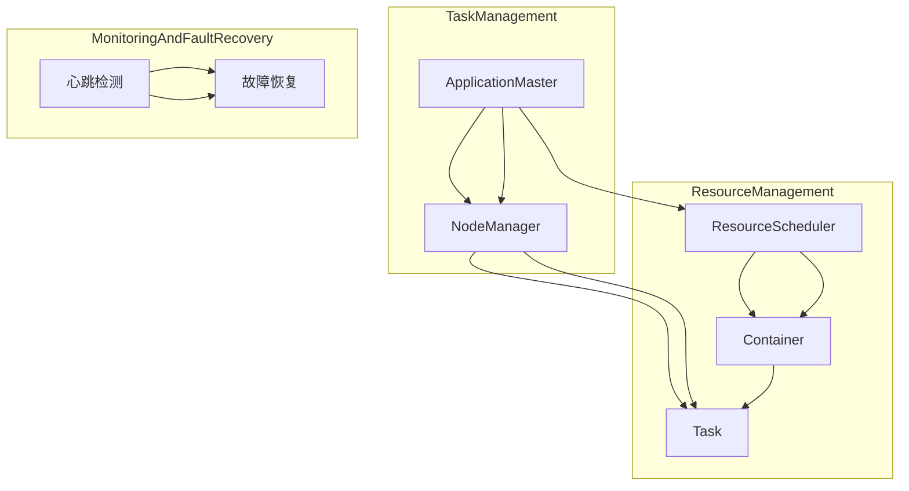

                 

### 背景介绍

随着大数据和人工智能技术的快速发展，分布式计算框架成为处理大规模数据集的关键工具。在大数据领域，MapReduce、Spark 等框架被广泛应用，而在更复杂的计算场景下，YARN（Yet Another Resource Negotiator）框架作为一种资源调度与管理平台，显得尤为重要。YARN 的设计初衷是为了解决 Hadoop 1.x 版本中 MapReduce 作业调度效率低下的问题。

YARN 的核心组件之一是 ApplicationMaster，它负责协调和管理应用程序的执行。ApplicationMaster 在整个 YARN 框架中起到了至关重要的角色，其重要性体现在以下几个方面：

1. **资源调度**：ApplicationMaster 根据应用程序的需求，向 ResourceScheduler 请求资源，确保应用程序能够在合适的节点上运行。

2. **任务分配**：ApplicationMaster 接收到资源后，将任务分配给相应的 NodeManager，确保任务在分布式环境中高效执行。

3. **任务监控**：ApplicationMaster 监控任务的执行状态，并在任务失败时重新分配或终止任务。

4. **负载均衡**：ApplicationMaster 能够根据当前集群状态，调整任务的分配，实现负载均衡，提高集群的整体效率。

5. **故障恢复**：ApplicationMaster 在任务执行过程中，能够快速检测并恢复失败的任务，保证任务的连续性和可靠性。

综上所述，ApplicationMaster 在 YARN 框架中发挥着核心作用，是实现高效分布式计算的关键。在接下来的章节中，我们将深入探讨 ApplicationMaster 的架构、工作原理以及具体实现细节。

## 1.1 大数据计算背景与挑战

大数据计算是指在计算机系统中对大规模数据集进行存储、处理和分析的过程。随着互联网、物联网、社交媒体等技术的迅猛发展，数据量呈指数级增长，传统的集中式计算方式已无法满足需求。分布式计算框架应运而生，通过将计算任务分散到多个节点上并行处理，提高了计算效率和数据处理能力。

然而，大数据计算也带来了诸多挑战：

1. **数据存储和管理**：大规模数据集需要高效的存储和管理方案，如何保证数据的持久性、一致性和可用性是关键问题。

2. **任务调度和负载均衡**：分布式计算环境中，如何高效地调度任务、分配资源，以及实现负载均衡，是确保计算效率和系统稳定性的重要因素。

3. **容错和恢复**：在大规模分布式系统中，节点故障和网络中断是常见问题，如何实现容错和快速恢复，是保证系统持续运行的关键。

4. **数据安全和隐私**：随着数据隐私和安全问题的日益突出，如何确保数据在存储、传输和处理过程中的安全，是大数据计算必须面对的挑战。

为了解决这些问题，分布式计算框架如 MapReduce、Spark、Hadoop 和 YARN 等应运而生。其中，YARN 作为一种资源调度与管理平台，在分布式计算环境中发挥了重要作用。

YARN 的设计初衷是解决 Hadoop 1.x 版本中 MapReduce 作业调度效率低下的问题。在 Hadoop 1.x 中，MapReduce 框架集成了资源调度和管理功能，这种设计使得资源管理和计算任务之间的耦合度较高，导致资源调度效率低下。YARN 通过分离资源调度和管理功能，实现了更高的调度效率和灵活性。在 YARN 框架中，资源管理由 ResourceScheduler 和 NodeManager 完成而计算任务由 ApplicationMaster 和 Container 负责执行。

YARN 的出现不仅提高了资源调度和任务管理的效率，还为开发者提供了更大的灵活性。开发者可以基于 YARN 框架开发各种类型的应用程序，如批处理、流处理和机器学习等，实现更高效的大数据计算。

总之，大数据计算背景与挑战推动了分布式计算框架的发展，而 YARN 作为一种资源调度与管理平台，在分布式计算环境中具有重要的应用价值。

## 1.2 YARN 框架概述

YARN（Yet Another Resource Negotiator）是 Hadoop 2.0 及以上版本的核心框架，用于资源调度和管理。与传统 Hadoop 1.x 版本相比，YARN 通过分离资源管理和计算任务管理，实现了更高的调度效率和灵活性。YARN 的核心组件包括 ResourceScheduler、NodeManager 和 ApplicationMaster。

### ResourceScheduler

ResourceScheduler 是 YARN 的资源调度模块，负责根据资源需求和集群状态分配资源。ResourceScheduler 主要包括两个部分：Fair Scheduler 和 Capacity Scheduler。

1. **Fair Scheduler**：Fair Scheduler 实现了公平共享资源策略，确保每个应用程序都能获得公平的资源分配。Fair Scheduler 将集群资源按比例分配给各个应用程序，根据应用程序的等待时间和资源需求进行调整。

2. **Capacity Scheduler**：Capacity Scheduler 实现了容量共享资源策略，确保每个应用程序都获得一定比例的集群资源。Capacity Scheduler 根据应用程序的类型和优先级进行资源分配，同时预留一部分资源用于紧急任务和容量调度。

### NodeManager

NodeManager 是 YARN 的节点管理模块，负责管理节点上的资源。NodeManager 主要包括以下几个功能：

1. **资源监控**：NodeManager 监控节点上的资源使用情况，包括 CPU、内存、磁盘和网络等。

2. **容器管理**：NodeManager 启动和停止容器，执行 ApplicationMaster 分配的任务。

3. **健康检测**：NodeManager 定期进行健康检查，确保节点正常运行。

4. **日志收集**：NodeManager 收集容器和应用程序的日志，便于监控和调试。

### ApplicationMaster

ApplicationMaster 是 YARN 的应用程序管理模块，负责协调和管理应用程序的执行。ApplicationMaster 主要包括以下几个功能：

1. **任务调度**：ApplicationMaster 根据应用程序的需求，向 ResourceScheduler 请求资源，并分配任务给 NodeManager。

2. **任务监控**：ApplicationMaster 监控任务的执行状态，包括任务的成功、失败和等待状态。

3. **故障恢复**：ApplicationMaster 在任务执行过程中，能够快速检测并恢复失败的任务，保证任务的连续性和可靠性。

4. **负载均衡**：ApplicationMaster 能够根据当前集群状态，调整任务的分配，实现负载均衡，提高集群的整体效率。

### 整体架构

YARN 整体架构可以分为两个层次：资源管理层次和应用计算层次。

1. **资源管理层次**：资源管理层次包括 ResourceManager、ResourceScheduler 和 NodeManager。ResourceManager 负责整个集群的资源管理和调度，ResourceScheduler 负责具体资源分配，NodeManager 负责节点资源管理和任务执行。

2. **应用计算层次**：应用计算层次包括 ApplicationMaster 和 Container。ApplicationMaster 负责应用程序的调度和管理，Container 是 YARN 中的最小资源分配单位，负责执行应用程序的具体任务。

通过 YARN 的架构设计，实现了资源管理和计算任务的分离，提高了资源调度效率和系统灵活性，使得 YARN 成为分布式计算框架中的首选方案。

## 1.3 ApplicationMaster 的核心角色与功能

在 YARN 框架中，ApplicationMaster（简称 AM）是核心组件之一，承担着协调和管理应用程序执行的重任。以下是 ApplicationMaster 的核心角色与功能：

### 1.3.1 资源调度

ApplicationMaster 负责根据应用程序的需求，向 ResourceScheduler 请求资源。具体步骤如下：

1. **资源请求**：ApplicationMaster 向 ResourceScheduler 发送资源请求，描述所需资源类型和数量。
2. **资源分配**：ResourceScheduler 根据集群当前资源状态和应用程序优先级，分配资源给 ApplicationMaster。
3. **任务分配**：ApplicationMaster 根据分配的资源，将任务分配给相应的 NodeManager。

### 1.3.2 任务管理

ApplicationMaster 负责管理任务的整个生命周期，包括任务创建、执行、监控和恢复。

1. **任务创建**：ApplicationMaster 根据应用程序的输入数据和执行逻辑，创建任务。
2. **任务执行**：ApplicationMaster 将任务分配给 NodeManager，NodeManager 在节点上启动容器，执行任务。
3. **任务监控**：ApplicationMaster 定期检查任务的执行状态，包括任务的成功、失败和等待状态。
4. **任务恢复**：如果任务执行失败，ApplicationMaster 会根据任务配置和失败原因，决定是重新执行任务还是终止任务。

### 1.3.3 故障恢复

ApplicationMaster 具有故障检测和恢复机制，确保任务的连续性和可靠性。

1. **故障检测**：ApplicationMaster 定期向 NodeManager 发送心跳信号，检测节点状态。
2. **故障恢复**：如果检测到节点故障，ApplicationMaster 会重新分配任务，确保任务继续执行。

### 1.3.4 负载均衡

ApplicationMaster 能够根据当前集群状态和任务执行情况，调整任务的分配，实现负载均衡。

1. **负载监测**：ApplicationMaster 监测集群负载情况，包括 CPU 使用率、内存使用率、网络带宽等。
2. **任务重分配**：根据负载监测结果，ApplicationMaster 会将任务从负载高的节点重新分配到负载低的节点。

### 1.3.5 应用协调

ApplicationMaster 负责协调各个任务之间的依赖关系，确保应用程序的整体执行顺序和逻辑。

1. **依赖管理**：ApplicationMaster 根据应用程序的执行逻辑，管理任务之间的依赖关系。
2. **同步和通信**：ApplicationMaster 在任务执行过程中，确保任务之间的同步和通信，确保应用程序的正确性。

### 1.3.6 日志管理和监控

ApplicationMaster 收集任务执行过程中的日志，提供监控和调试功能。

1. **日志收集**：ApplicationMaster 从 NodeManager 收集任务日志，存储在 HDFS 或其他日志存储系统中。
2. **日志分析**：ApplicationMaster 提供日志分析工具，帮助开发者诊断和解决任务执行中的问题。

综上所述，ApplicationMaster 在 YARN 框架中发挥着核心作用，通过资源调度、任务管理、故障恢复、负载均衡、应用协调和日志管理等功能，确保分布式应用程序的高效执行和可靠性。

### 1.4 ApplicationMaster 的架构设计

ApplicationMaster 是 YARN 框架中至关重要的组件，其架构设计决定了其在资源调度、任务管理、故障恢复等方面的性能和可靠性。以下是对 ApplicationMaster 架构的详细解释。

#### 1.4.1 模块划分

ApplicationMaster 的架构可以分为以下几个模块：

1. **资源请求模块**：负责向 ResourceScheduler 请求资源。
2. **任务分配模块**：根据请求的资源，将任务分配给 NodeManager。
3. **任务监控模块**：监控任务的执行状态，包括成功、失败和等待状态。
4. **故障恢复模块**：在任务执行过程中，检测并恢复失败的任务。
5. **负载均衡模块**：根据当前集群状态，调整任务的分配，实现负载均衡。
6. **日志管理和监控模块**：收集任务执行过程中的日志，提供监控和调试功能。

#### 1.4.2 工作流程

ApplicationMaster 的工作流程可以概括为以下几个步骤：

1. **初始化**：ApplicationMaster 启动后，首先进行初始化，包括加载应用程序配置、连接到 ResourceManager 和 NodeManager 等。
2. **资源请求**：根据应用程序的需求，向 ResourceScheduler 请求资源。
3. **资源分配**：ResourceScheduler 根据集群当前资源状态和应用程序优先级，将资源分配给 ApplicationMaster。
4. **任务分配**：ApplicationMaster 根据分配的资源，将任务分配给 NodeManager。
5. **任务执行**：NodeManager 在节点上启动容器，执行任务。
6. **任务监控**：ApplicationMaster 定期检查任务的执行状态，包括任务的成功、失败和等待状态。
7. **故障恢复**：如果任务执行失败，ApplicationMaster 会根据任务配置和失败原因，决定是重新执行任务还是终止任务。
8. **负载均衡**：ApplicationMaster 根据当前集群状态，调整任务的分配，实现负载均衡。
9. **日志管理和监控**：ApplicationMaster 收集任务执行过程中的日志，提供监控和调试功能。

#### 1.4.3 通信机制

ApplicationMaster 通过以下通信机制与 ResourceScheduler 和 NodeManager 进行交互：

1. **心跳机制**：ApplicationMaster 定期向 ResourceManager 和 NodeManager 发送心跳信号，报告任务执行状态和资源需求。
2. **拉取机制**：ApplicationMaster 通过轮询方式从 ResourceManager 获取资源分配信息。
3. **推送机制**：NodeManager 通过推送方式向 ApplicationMaster 报告任务执行状态和日志信息。

#### 1.4.4 容错机制

ApplicationMaster 具有容错机制，确保在节点故障和网络中断等异常情况下，系统能够继续运行：

1. **心跳检测**：ApplicationMaster 定期检测 ResourceManager 和 NodeManager 的心跳信号，如果长时间未收到心跳信号，则认为节点或 ResourceManager 故障。
2. **重新注册**：在检测到故障后，ApplicationMaster 会重新向 ResourceManager 注册，获取新的资源分配。
3. **任务重启**：在 NodeManager 故障时，ApplicationMaster 会重新启动任务，确保任务继续执行。

综上所述，ApplicationMaster 的架构设计旨在实现高效、可靠的分布式应用程序执行，通过模块化设计、工作流程、通信机制和容错机制，确保应用程序在分布式环境中的稳定运行。

### 1.5 ApplicationMaster 的生命周期管理

ApplicationMaster 在 YARN 框架中的生命周期管理是其发挥重要作用的基础。以下是 ApplicationMaster 的生命周期管理详解：

#### 1.5.1 启动过程

ApplicationMaster 的启动过程可以分为以下几个步骤：

1. **初始化**：在应用程序启动时，ApplicationMaster 首先进行初始化，包括加载应用程序配置信息、连接到 ResourceManager 和 NodeManager 等。
2. **资源请求**：初始化完成后，ApplicationMaster 向 ResourceManager 发送资源请求，描述所需资源类型和数量。
3. **资源分配**：ResourceManager 根据集群当前资源状态和应用程序优先级，将资源分配给 ApplicationMaster。
4. **容器启动**：ApplicationMaster 根据分配的资源，创建并启动一个或多个容器，容器用于执行应用程序的具体任务。

#### 1.5.2 运行过程

在启动完成后，ApplicationMaster 进入运行过程，主要包括以下几个阶段：

1. **任务分配**：ApplicationMaster 根据应用程序的执行逻辑，将任务分配给 NodeManager。
2. **任务执行**：NodeManager 在节点上启动容器，执行任务。
3. **任务监控**：ApplicationMaster 定期检查任务的执行状态，包括任务的成功、失败和等待状态。
4. **日志收集**：ApplicationMaster 收集任务执行过程中的日志，便于监控和调试。

#### 1.5.3 故障恢复

ApplicationMaster 具有故障恢复机制，确保在节点故障或任务失败时，系统能够继续运行：

1. **心跳检测**：ApplicationMaster 定期向 ResourceManager 和 NodeManager 发送心跳信号，报告任务执行状态和资源需求。如果长时间未收到心跳信号，则认为节点或 ResourceManager 故障。
2. **重新注册**：在检测到故障后，ApplicationMaster 会重新向 ResourceManager 注册，获取新的资源分配。
3. **任务重启**：在 NodeManager 故障时，ApplicationMaster 会重新启动任务，确保任务继续执行。

#### 1.5.4 终止过程

ApplicationMaster 的终止过程包括以下几个步骤：

1. **任务终止**：当应用程序完成或根据配置需要终止时，ApplicationMaster 会终止所有未完成的任务。
2. **资源释放**：ApplicationMaster 向 ResourceManager 释放已分配的资源，包括容器和节点资源。
3. **清理日志**：ApplicationMaster 清理任务执行过程中产生的日志文件，释放存储空间。
4. **关闭连接**：ApplicationMaster 关闭与 ResourceManager 和 NodeManager 的连接，结束运行。

综上所述，ApplicationMaster 的生命周期管理涉及启动、运行、故障恢复和终止等环节，通过这些环节的有序进行，确保分布式应用程序在 YARN 框架中高效、可靠地执行。

### 1.6 ApplicationMaster 的具体实现与代码分析

在深入探讨 ApplicationMaster 的具体实现和代码分析之前，我们需要先了解几个关键类和方法。这些类和方法构成了 ApplicationMaster 的核心功能模块，包括资源请求、任务分配、任务监控和故障恢复等。以下是对这些关键类和方法的详细解析。

#### 1.6.1 关键类与方法

1. **DistributedCache**：负责管理分布式缓存，确保应用程序在不同节点上共享文件。
2. **ApplicationMaster**：主类，负责整个应用程序的生命周期管理。
3. **Container**：表示一个容器，用于执行应用程序的任务。
4. **RMContainer**：表示 ResourceScheduler 分配给 ApplicationMaster 的容器。
5. **Task**：表示应用程序的任务，包括任务的输入数据、输出数据和执行逻辑。
6. **TaskTracker**：表示 NodeManager 上执行任务的进程。
7. **YarnUtil**：提供一些常用的 YARN 相关功能，如获取集群信息、请求资源等。

#### 1.6.2 应用程序启动流程

1. **初始化**：在应用程序启动时，首先调用 ApplicationMaster 的 initialize 方法，加载应用程序配置信息，如运行模式、资源需求等。
2. **资源请求**：初始化完成后，调用 ResourceManager 的 requestResources 方法，请求所需资源。ApplicationMaster 会向 ResourceScheduler 发送资源请求，描述所需资源类型和数量。
3. **资源分配**：ResourceScheduler 根据集群当前资源状态和应用程序优先级，将资源分配给 ApplicationMaster。分配的资源包括容器和节点。
4. **容器启动**：ApplicationMaster 根据分配的资源，调用 RMContainer 的 launch 方法，启动容器，容器内执行应用程序的任务。

#### 1.6.3 任务分配与执行

1. **任务分配**：ApplicationMaster 根据应用程序的执行逻辑，将任务分配给 NodeManager。任务分配过程中，会调用 Task 的 create 方法，创建任务，并设置任务的输入数据、输出数据和执行逻辑。
2. **任务执行**：NodeManager 在节点上启动 TaskTracker 进程，执行任务。TaskTracker 负责在节点上执行任务，并向 ApplicationMaster 报告任务执行状态。
3. **任务监控**：ApplicationMaster 定期检查任务的执行状态，包括任务的成功、失败和等待状态。如果任务执行失败，ApplicationMaster 会根据配置和失败原因，决定是重新执行任务还是终止任务。

#### 1.6.4 故障恢复

1. **心跳检测**：ApplicationMaster 定期向 ResourceManager 和 NodeManager 发送心跳信号，报告任务执行状态和资源需求。如果长时间未收到心跳信号，则认为节点或 ResourceManager 故障。
2. **重新注册**：在检测到故障后，ApplicationMaster 会重新向 ResourceManager 注册，获取新的资源分配。
3. **任务重启**：在 NodeManager 故障时，ApplicationMaster 会重新启动任务，确保任务继续执行。

#### 1.6.5 代码分析

以下是对 ApplicationMaster 中的关键方法进行代码分析：

```java
// ApplicationMaster 初始化方法
public void initialize() {
    // 加载应用程序配置信息
    conf = new YarnConfiguration();
    conf.addResource(new Path("path/to/config.xml"));
    // 连接 ResourceManager
    this.rmClient = RMClientUtil.createRMClient(conf);
    // 连接 NodeManager
    thisnmClient = NodeManagerClient.create(conf);
}

// 资源请求方法
public void requestResources() {
    // 请求容器
    ContainerRequest containerRequest = new ContainerRequest();
    containerRequest.setNumContainers(1);
    containerRequest.setMemory(1024);
    containerRequest.setVirtualCores(1);
    // 向 ResourceScheduler 请求资源
    this.rmClient.requestResources(this, containerRequest);
}

// 任务分配方法
public void allocate(RMContainer container) {
    // 创建任务
    Task task = createTask(container);
    // 分配任务给 NodeManager
    nmClient.allocate(container.getId(), task);
}

// 任务创建方法
private Task createTask(RMContainer container) {
    // 设置任务输入数据、输出数据和执行逻辑
    Task task = new Task();
    task.setTaskId(UUID.randomUUID().toString());
    task.setAppId(container.getId().getApplicationId());
    task.setCommand("/path/to/command.sh");
    task.setTaskType(TaskType.RUN);
    return task;
}

// 心跳检测方法
public void heartbeat() {
    // 向 ResourceManager 发送心跳信号
    this.rmClient.heartbeat();
    // 向 NodeManager 发送心跳信号
    thisnmClient.heartbeat();
}
```

通过以上代码分析，我们可以看到 ApplicationMaster 的主要功能模块和工作流程。在实际应用中，开发者可以根据具体需求，对 ApplicationMaster 的代码进行扩展和定制，实现更复杂的应用程序调度和管理。

## 2. 核心概念与联系

在深入探讨 ApplicationMaster 的架构和实现之前，我们需要先了解几个核心概念，并展示它们之间的联系。这些核心概念包括资源调度、任务分配、任务监控和故障恢复等。为了使这些概念更加直观，我们将使用 Mermaid 流程图来描述它们之间的关系。

### Mermaid 流程图

以下是描述 ApplicationMaster 核心概念的 Mermaid 流程图：



### 流程图解析

1. **资源管理（ResourceManagement）**：
   - **ApplicationMaster** 向 **ResourceScheduler** 请求资源。
   - **ResourceScheduler** 根据集群资源状态和应用程序需求，分配容器（**Container**）给 **ApplicationMaster**。
   - **Container** 是 YARN 中的最小资源分配单位，用于执行 **Task**。

2. **任务管理（TaskManagement）**：
   - **ApplicationMaster** 根据应用程序的逻辑，将 **Task** 分配给 **NodeManager**。
   - **NodeManager** 在其节点上启动 **TaskTracker**，执行分配的 **Task**。

3. **监控与故障恢复（MonitoringAndFaultRecovery）**：
   - **ApplicationMaster** 通过定期发送 **心跳检测**，监控 **NodeManager** 的状态。
   - **故障恢复**：如果检测到故障，**ApplicationMaster** 会执行相应的故障恢复操作，如重新启动任务或重新分配资源。

### 核心概念关系图

以下是核心概念的关系图，展示各组件之间的交互和依赖：


通过上述 Mermaid 流程图和关系图，我们可以清晰地了解 ApplicationMaster 在 YARN 框架中的核心概念和组件之间的关系，为后续的深入分析和实现提供基础。

### 2.1 资源调度原理

资源调度是分布式计算框架中的关键环节，决定了任务执行的效率。在 YARN 框架中，资源调度主要由 ResourceScheduler 实现。ResourceScheduler 的核心任务是根据应用程序的需求和集群的资源状态，合理分配资源，确保任务的高效执行。

#### 2.1.1 调度策略

YARN 提供了两种资源调度策略：Fair Scheduler 和 Capacity Scheduler。

1. **Fair Scheduler**：
   - **公平性**：Fair Scheduler 实现了公平共享资源策略，确保每个应用程序都能获得公平的资源分配。
   - **工作原理**：Fair Scheduler 将集群资源按比例分配给各个应用程序。当某个应用程序请求资源时，如果集群有剩余资源，则立即分配；如果没有剩余资源，则按照等待时间最长的应用程序进行资源分配。
   - **应用场景**：适用于需要公平共享资源的场景，如科学计算和大数据处理。

2. **Capacity Scheduler**：
   - **容量管理**：Capacity Scheduler 实现了容量共享资源策略，确保每个应用程序都获得一定比例的集群资源。
   - **工作原理**：Capacity Scheduler 根据应用程序的类型和优先级进行资源分配。系统会预留一部分资源用于紧急任务和容量调度，确保关键任务的优先执行。
   - **应用场景**：适用于需要保障关键任务优先级的场景，如实时数据处理和在线服务。

#### 2.1.2 调度流程

资源调度的基本流程如下：

1. **请求资源**：应用程序通过 ApplicationMaster 向 ResourceScheduler 请求资源。请求内容包括所需的容器数量、内存、CPU 等。
2. **资源评估**：ResourceScheduler 根据集群当前资源状态和应用程序需求，评估是否能够满足资源请求。
3. **资源分配**：
   - 如果集群有足够的资源，ResourceScheduler 将资源分配给 ApplicationMaster。
   - 如果集群资源不足，ResourceScheduler 会将请求放入等待队列，并根据调度策略进行资源分配。
4. **通知 ApplicationMaster**：ResourceScheduler 将资源分配结果通知给 ApplicationMaster，ApplicationMaster 根据资源情况分配任务给 NodeManager。
5. **任务执行**：NodeManager 在节点上启动容器，执行任务。

#### 2.1.3 调度优化

为了提高资源调度效率，YARN 提供了以下优化策略：

1. **动态资源调整**：允许应用程序在运行过程中动态调整资源需求，提高资源利用率。
2. **优先级调度**：根据应用程序的重要性和优先级进行调度，确保关键任务优先执行。
3. **负载均衡**：根据节点负载情况，合理分配任务，避免资源浪费。
4. **弹性资源管理**：允许应用程序在资源紧张时暂停部分任务，等待资源释放后再继续执行。

通过上述资源调度原理和调度流程，我们可以看到，YARN 通过合理分配资源，确保了任务的高效执行和集群的稳定性。在接下来的章节中，我们将深入探讨任务分配、任务监控和故障恢复等核心概念。

### 2.2 任务分配原理

任务分配是分布式计算框架中的一个重要环节，决定了任务的执行效率和系统的整体性能。在 YARN 框架中，任务分配主要由 ApplicationMaster 实现。以下是对任务分配原理的详细讲解。

#### 2.2.1 任务分配机制

YARN 的任务分配机制主要包括以下几个步骤：

1. **资源请求**：ApplicationMaster 向 ResourceScheduler 请求资源，描述所需的容器数量和类型。
2. **资源评估**：ResourceScheduler 根据集群当前资源状态和应用程序需求，评估是否能够满足资源请求。
3. **资源分配**：如果集群有足够的资源，ResourceScheduler 将资源分配给 ApplicationMaster。每个资源分配以一个 Container 对象表示，Container 包含了容器的 ID、内存、CPU 等资源信息。
4. **任务创建**：ApplicationMaster 根据应用程序的执行逻辑，创建任务。任务包括任务的输入数据、输出数据和执行逻辑。
5. **任务分配**：ApplicationMaster 将任务分配给 NodeManager。每个 NodeManager 上启动一个 TaskTracker 进程，用于执行任务。

#### 2.2.2 分配策略

YARN 提供了多种任务分配策略，以适应不同的应用场景。以下是几种常见的任务分配策略：

1. **本地性调度**：任务尽量分配到与其数据最接近的节点上执行，减少数据传输延迟和网络开销。
   - **工作原理**：在 NodeManager 中维护一个本地任务队列，当有任务需要分配时，优先选择本地队列中的任务。
   - **适用场景**：适用于数据密集型任务，如大数据处理。

2. **负载均衡调度**：根据节点的负载情况，合理分配任务，避免资源浪费。
   - **工作原理**：ApplicationMaster 监控各个节点的负载情况，将任务分配到负载较低的节点上。
   - **适用场景**：适用于需要均衡利用集群资源的场景，如机器学习模型训练。

3. **依赖调度**：确保任务按照依赖关系依次执行。
   - **工作原理**：ApplicationMaster 根据任务的依赖关系，将任务按照顺序分配给 NodeManager。
   - **适用场景**：适用于需要严格顺序执行的任务，如数据处理管道。

#### 2.2.3 调度流程

任务分配的基本流程如下：

1. **资源请求**：ApplicationMaster 根据应用程序的需求，向 ResourceScheduler 请求资源。
2. **资源评估**：ResourceScheduler 评估集群资源状态，判断是否能够满足资源请求。
3. **资源分配**：如果资源可用，ResourceScheduler 将资源分配给 ApplicationMaster，生成 Container 对象。
4. **任务创建**：ApplicationMaster 根据应用程序的执行逻辑，创建任务。
5. **任务分配**：ApplicationMaster 将任务分配给 NodeManager，NodeManager 启动 TaskTracker 进程，执行任务。
6. **任务监控**：ApplicationMaster 监控任务的执行状态，包括成功、失败和等待状态。
7. **故障恢复**：如果任务执行失败，ApplicationMaster 会根据任务配置和失败原因，决定是重新执行任务还是终止任务。

通过上述任务分配原理和调度流程，我们可以看到，YARN 通过合理的资源请求、评估和分配机制，确保了任务的高效执行和系统的稳定性。在接下来的章节中，我们将进一步探讨任务监控和故障恢复等关键环节。

### 2.3 任务监控原理

任务监控是分布式计算框架中确保任务执行顺利、及时发现和处理问题的关键环节。在 YARN 框架中，任务监控主要由 ApplicationMaster 实现。以下是对任务监控原理的详细讲解。

#### 2.3.1 监控机制

YARN 的任务监控机制主要包括以下几个方面：

1. **心跳检测**：ApplicationMaster 定期向 NodeManager 发送心跳信号，报告任务执行状态。NodeManager 也定期向 ApplicationMaster 发送心跳信号，确保双方通信畅通。
2. **日志收集**：ApplicationMaster 和 NodeManager 会收集任务执行过程中的日志信息，便于后续的监控和调试。
3. **状态报告**：ApplicationMaster 定期向 ResourceManager 报告任务的执行状态，包括成功、失败、等待等状态。
4. **异常检测**：ApplicationMaster 会监控任务执行过程中的异常情况，如任务失败、节点故障等，并及时采取措施进行故障恢复。

#### 2.3.2 监控流程

任务监控的基本流程如下：

1. **心跳检测**：ApplicationMaster 定期发送心跳信号，报告任务执行状态。NodeManager 也定期发送心跳信号，确保通信畅通。
2. **状态报告**：NodeManager 向 ApplicationMaster 报告任务执行状态，包括成功、失败、等待等状态。
3. **日志收集**：ApplicationMaster 和 NodeManager 收集任务执行过程中的日志信息，存储在 HDFS 或其他日志存储系统中。
4. **状态监控**：ApplicationMaster 监控任务执行状态，根据任务状态进行调整和故障恢复。
5. **异常处理**：ApplicationMaster 发现异常情况时，如任务失败、节点故障等，会根据预设的异常处理策略，进行故障恢复或任务重新分配。

#### 2.3.3 监控策略

为了提高任务监控的效率和准确性，YARN 采用以下监控策略：

1. **多层级监控**：ApplicationMaster 和 NodeManager 各自进行监控，确保任务执行状态的一致性和准确性。
2. **自动化恢复**：对于常见的异常情况，如任务失败、节点故障等，YARN 具有自动恢复机制，减少人工干预。
3. **日志分析**：收集任务执行过程中的日志信息，通过日志分析工具，帮助开发者诊断和解决任务执行中的问题。
4. **实时监控**：通过实时监控任务执行状态，确保任务在遇到问题时能够及时发现和处理。

通过上述任务监控原理和监控流程，我们可以看到，YARN 通过心跳检测、状态报告、日志收集和异常处理等机制，确保了任务的高效执行和系统的稳定性。在接下来的章节中，我们将进一步探讨故障恢复机制。

### 2.4 故障恢复原理

在分布式计算环境中，节点故障和网络中断是常见问题。为了确保任务的高效执行和系统的稳定性，YARN 提供了完善的故障恢复机制。以下是故障恢复原理的详细讲解。

#### 2.4.1 故障检测

故障检测是故障恢复的第一步。YARN 使用心跳检测机制来监控节点的状态。具体步骤如下：

1. **心跳发送**：NodeManager 定期向 ApplicationMaster 发送心跳信号，报告节点状态。
2. **心跳接收**：ApplicationMaster 接收 NodeManager 的心跳信号，并记录接收时间。
3. **心跳超时**：如果 ApplicationMaster 在预定时间内未收到 NodeManager 的心跳信号，则认为 NodeManager 故障。

#### 2.4.2 故障恢复

在检测到 NodeManager 故障后，YARN 会启动故障恢复机制，确保任务能够继续执行。故障恢复过程包括以下几个步骤：

1. **任务重分配**：ApplicationMaster 会将已分配给故障 NodeManager 的任务重新分配给其他健康 NodeManager。任务重分配策略可以根据任务的本地性、负载均衡等因素进行优化。
2. **任务重启**：对于已启动但尚未完成的任务，ApplicationMaster 会重新启动任务。任务重启过程中，需要确保任务的状态一致性，避免数据丢失。
3. **资源释放**：ApplicationMaster 会释放已分配给故障 NodeManager 的资源，并将其分配给其他应用程序或健康 NodeManager。
4. **日志处理**：故障恢复过程中，YARN 会处理相关日志，确保日志的完整性和一致性。

#### 2.4.3 故障恢复策略

为了提高故障恢复的效率和可靠性，YARN 采用以下故障恢复策略：

1. **多层级故障检测**：通过 NodeManager 和 ApplicationMaster 两级心跳检测，确保故障能够被及时发现。
2. **自动化恢复**：对于常见的故障情况，如节点故障、任务失败等，YARN 具有自动化恢复机制，减少人工干预。
3. **日志记录与监控**：通过记录故障发生前后的日志，帮助开发者分析和定位故障原因，提高故障恢复的准确性。
4. **负载均衡**：在任务重分配过程中，考虑节点的负载情况，避免任务过多集中在某个节点上。

#### 2.4.4 故障恢复流程

故障恢复的基本流程如下：

1. **故障检测**：通过心跳检测机制，发现 NodeManager 故障。
2. **任务重分配**：ApplicationMaster 将故障 NodeManager 上的任务重新分配给其他健康 NodeManager。
3. **任务重启**：重新启动已分配给健康 NodeManager 的任务，确保任务继续执行。
4. **资源释放**：释放故障 NodeManager 的资源，并将其分配给其他应用程序或健康 NodeManager。
5. **日志处理**：处理故障发生前后的日志，确保日志的完整性和一致性。

通过上述故障恢复原理和流程，我们可以看到，YARN 通过故障检测、任务重分配、任务重启和资源释放等机制，确保了任务的高效执行和系统的稳定性。

### 2.5 负载均衡原理

负载均衡是分布式计算框架中确保任务高效执行、避免资源浪费的重要手段。在 YARN 框架中，负载均衡主要通过 ApplicationMaster 实现。以下是负载均衡原理的详细讲解。

#### 2.5.1 负载均衡机制

YARN 的负载均衡机制主要包括以下几个方面：

1. **节点负载监控**：ApplicationMaster 定期监控各个节点的负载情况，包括 CPU 使用率、内存使用率、磁盘使用率等。
2. **任务分配策略**：根据节点负载情况，ApplicationMaster 采用合适的任务分配策略，确保任务合理分配到负载较低的节点上。
3. **动态调整**：在任务执行过程中，ApplicationMaster 会根据节点的实际负载情况，动态调整任务分配，实现负载均衡。

#### 2.5.2 负载均衡策略

YARN 提供了以下几种负载均衡策略：

1. **最小负载策略**：将任务分配到当前负载最小的节点上，确保负载均衡。
2. **随机策略**：随机选择节点进行任务分配，适用于负载不均匀但任务执行时间较短的场景。
3. **优先级策略**：根据节点的优先级进行任务分配，优先将任务分配到高优先级节点，适用于需要保障重要任务优先级的场景。
4. **依赖关系策略**：考虑任务的依赖关系，将依赖关系较近的任务尽量分配到同一节点上，减少数据传输延迟。

#### 2.5.3 负载均衡流程

负载均衡的基本流程如下：

1. **节点负载监控**：ApplicationMaster 定期收集各个节点的负载信息。
2. **负载评估**：ApplicationMaster 根据当前负载情况，评估节点的负载均衡程度。
3. **任务分配**：根据负载评估结果，ApplicationMaster 采用合适的负载均衡策略，将任务分配到负载较低的节点上。
4. **任务执行**：NodeManager 在节点上执行任务，并向 ApplicationMaster 报告任务执行状态。
5. **动态调整**：在任务执行过程中，ApplicationMaster 会根据节点的实际负载情况，动态调整任务分配，实现负载均衡。

通过上述负载均衡原理和流程，我们可以看到，YARN 通过节点负载监控、负载评估、任务分配和动态调整等机制，实现了任务的高效执行和资源的合理利用。

### 2.6 ApplicationMaster 与其他组件的关系

在 YARN 框架中，ApplicationMaster 是核心组件之一，负责协调和管理应用程序的执行。ApplicationMaster 与其他组件（如 ResourceScheduler、NodeManager 等）之间通过紧密的协作，实现了高效、可靠的分布式计算。以下是对 ApplicationMaster 与其他组件关系的详细解析。

#### 2.6.1 ApplicationMaster 与 ResourceScheduler 的关系

1. **请求资源**：ApplicationMaster 需要资源来执行应用程序的任务，它会向 ResourceScheduler 发送资源请求。
2. **资源分配**：ResourceScheduler 根据集群当前资源状态和应用程序的需求，评估是否能够满足资源请求。如果资源可用，ResourceScheduler 将资源分配给 ApplicationMaster。
3. **资源更新**：在应用程序执行过程中，ApplicationMaster 会根据任务执行状态，动态调整资源请求，ResourceScheduler 会实时更新资源分配情况。

#### 2.6.2 ApplicationMaster 与 NodeManager 的关系

1. **任务分配**：ApplicationMaster 根据应用程序的执行逻辑，将任务分配给 NodeManager。
2. **任务执行**：NodeManager 在节点上启动容器，执行任务，并向 ApplicationMaster 报告任务执行状态。
3. **资源管理**：NodeManager 负责管理节点上的资源，包括启动和停止容器、监控节点状态等。ApplicationMaster 会根据 NodeManager 提供的节点状态信息，进行资源调度和任务分配。

#### 2.6.3 ApplicationMaster 与 ResourceManager 的关系

1. **注册与心跳**：ApplicationMaster 启动后，会向 ResourceManager 进行注册，并定期发送心跳信号，报告应用程序的执行状态。
2. **资源请求与释放**：ApplicationMaster 在执行过程中，需要资源来启动任务，它会向 ResourceManager 请求资源。任务完成后，ApplicationMaster 会释放已分配的资源。
3. **故障处理**：如果 ResourceManager 检测到 ApplicationMaster 故障，它会启动新的 ApplicationMaster 来替代故障实例，确保应用程序的连续执行。

#### 2.6.4 ApplicationMaster 与其他组件的协作

1. **依赖管理**：ApplicationMaster 需要与其他组件（如分布式缓存、日志存储等）进行协作，确保应用程序的执行依赖关系得到满足。
2. **日志收集**：ApplicationMaster 会收集任务执行过程中的日志信息，存储在 HDFS 或其他日志存储系统中，便于后续的监控和调试。
3. **资源调度**：ApplicationMaster 在进行资源调度时，需要考虑其他组件的负载情况，确保资源分配的合理性。

通过上述解析，我们可以看到，ApplicationMaster 在 YARN 框架中与其他组件（如 ResourceScheduler、NodeManager、ResourceManager 等）之间通过紧密的协作，实现了高效、可靠的分布式计算。这种协作关系不仅保证了应用程序的高效执行，还为系统的可扩展性和容错性提供了有力支持。

## 3. 核心算法原理 & 具体操作步骤

在深入探讨 ApplicationMaster 的核心算法原理之前，我们需要先了解几个关键算法，这些算法在资源调度、任务分配、故障恢复和负载均衡等环节发挥了重要作用。

### 3.1 资源调度算法

资源调度算法是 ApplicationMaster 的核心组件，负责根据应用程序的需求和集群的资源状态，合理分配资源。以下是几种常见的资源调度算法：

#### 3.1.1 最小负载算法

**原理**：最小负载算法的基本思想是将新任务分配到当前负载最小的节点上，以实现负载均衡。

**具体步骤**：

1. **计算节点负载**：根据节点的 CPU 使用率、内存使用率等指标，计算节点的负载。
2. **选择最小负载节点**：遍历所有节点，选择负载最小的节点进行任务分配。

**实现代码**（伪代码）：

```python
def min_load_scheduler(nodes, task):
    min_load = float('inf')
    min_load_node = None
    
    for node in nodes:
        if node.load < min_load:
            min_load = node.load
            min_load_node = node
    
    return min_load_node
```

#### 3.1.2 贪心算法

**原理**：贪心算法通过每次选择当前最优解，逐步优化整个任务分配过程。

**具体步骤**：

1. **选择负载最小的节点**：对于新任务，选择当前负载最小的节点进行分配。
2. **动态调整**：在任务执行过程中，根据节点负载变化，动态调整任务分配。

**实现代码**（伪代码）：

```python
def greedy_scheduler(nodes, tasks):
    while tasks:
        node = min_load_scheduler(nodes)
        node.allocate(tasks.pop())
```

#### 3.1.3 最长作业优先算法

**原理**：最长作业优先算法（Longest Job First，LJF）将任务分配给执行时间最长的节点，以最大化系统的吞吐量。

**具体步骤**：

1. **计算任务执行时间**：根据任务的工作量、节点的处理能力等指标，计算任务在各个节点上的执行时间。
2. **选择执行时间最长任务**：选择执行时间最长的任务进行分配。
3. **重复步骤**：对剩余任务重复上述步骤。

**实现代码**（伪代码）：

```python
def longest_job_first_scheduler(nodes, tasks):
    while tasks:
        max_duration_task = max(tasks, key=lambda t: t.duration)
        node = max_duration_task.get_best_node(nodes)
        node.allocate(max_duration_task)
```

### 3.2 任务分配算法

任务分配算法负责将应用程序的任务分配到合适的节点上，确保任务的高效执行。以下是几种常见的任务分配算法：

#### 3.2.1 按顺序分配算法

**原理**：按顺序分配算法将任务按照顺序依次分配到各个节点上。

**具体步骤**：

1. **初始化任务队列**：将任务按照顺序排列。
2. **依次分配任务**：遍历任务队列，将任务依次分配到节点上。

**实现代码**（伪代码）：

```python
def sequential_allocator(tasks, nodes):
    for task in tasks:
        for node in nodes:
            node.allocate(task)
```

#### 3.2.2 贪心算法

**原理**：贪心算法通过每次选择当前最优解，逐步优化整个任务分配过程。

**具体步骤**：

1. **选择负载最小的节点**：对于新任务，选择当前负载最小的节点进行分配。
2. **动态调整**：在任务执行过程中，根据节点负载变化，动态调整任务分配。

**实现代码**（伪代码）：

```python
def greedy_allocator(nodes, tasks):
    while tasks:
        node = min_load_scheduler(nodes)
        node.allocate(tasks.pop())
```

#### 3.2.3 约束满足算法

**原理**：约束满足算法根据任务的依赖关系和资源约束，优化任务分配。

**具体步骤**：

1. **建立任务依赖图**：根据任务的依赖关系，建立任务依赖图。
2. **求解约束满足问题**：使用约束满足算法（如回溯搜索、启发式搜索等），求解任务分配方案。

**实现代码**（伪代码）：

```python
def constraint_satisfaction_allocator(tasks, constraints):
    # 建立任务依赖图
    graph = build_dependency_graph(tasks)
    
    # 求解约束满足问题
    solution = constraint_satisfaction_search(graph, constraints)
    
    # 根据解决方案进行任务分配
    for task in solution:
        node.allocate(task)
```

### 3.3 故障恢复算法

故障恢复算法负责在节点故障或任务失败时，快速检测并恢复任务，确保任务的高效执行。以下是几种常见的故障恢复算法：

#### 3.3.1 心跳检测算法

**原理**：心跳检测算法通过定期发送心跳信号，检测节点的状态。

**具体步骤**：

1. **初始化心跳检测**：设置心跳检测间隔，启动心跳检测线程。
2. **发送心跳信号**：定期向 ResourceManager 和 NodeManager 发送心跳信号。
3. **故障检测**：如果长时间未收到心跳信号，则认为节点故障。

**实现代码**（伪代码）：

```python
def heartbeat_detection(interval):
    while True:
        send_heartbeat()
        time.sleep(interval)
```

#### 3.3.2 失效恢复算法

**原理**：失效恢复算法在检测到节点故障后，重新分配任务，确保任务继续执行。

**具体步骤**：

1. **故障检测**：通过心跳检测算法，检测到节点故障。
2. **任务重分配**：将故障节点上的任务重新分配到其他健康节点。
3. **任务重启**：在健康节点上重启任务，确保任务继续执行。

**实现代码**（伪代码）：

```python
def failure_recovery(node, tasks):
    for task in tasks:
        node.remove_task(task)
        node = min_load_scheduler(nodes)
        node.allocate(task)
```

#### 3.3.3 前向恢复算法

**原理**：前向恢复算法在任务执行失败时，尝试重新执行失败的任务，以减少数据丢失和重计算。

**具体步骤**：

1. **故障检测**：检测到任务执行失败。
2. **前向恢复**：尝试重新执行失败的任务，确保任务继续执行。

**实现代码**（伪代码）：

```python
def forward_recovery(task):
    if task.can_retry():
        task.retry()
    else:
        raise Exception("Task cannot be recovered")
```

### 3.4 负载均衡算法

负载均衡算法负责根据节点的负载情况，动态调整任务分配，确保任务的高效执行。

#### 3.4.1 平均负载算法

**原理**：平均负载算法将任务平均分配到各个节点上。

**具体步骤**：

1. **计算平均负载**：根据节点的负载情况，计算平均负载。
2. **任务分配**：将任务按照平均负载分配到节点上。

**实现代码**（伪代码）：

```python
def average_load_balancer(tasks, nodes):
    avg_load = sum(node.load for node in nodes) / len(nodes)
    for task in tasks:
        for node in nodes:
            if node.load < avg_load:
                node.allocate(task)
```

#### 3.4.2 最短作业优先算法

**原理**：最短作业优先算法（Shortest Job First，SJF）将任务分配到执行时间最短的节点上。

**具体步骤**：

1. **计算任务执行时间**：根据任务的工作量、节点的处理能力等指标，计算任务在各个节点上的执行时间。
2. **选择执行时间最短任务**：选择执行时间最短的任务进行分配。

**实现代码**（伪代码）：

```python
def shortest_job_first_scheduler(nodes, tasks):
    while tasks:
        min_duration_task = min(tasks, key=lambda t: t.duration)
        node = min_duration_task.get_best_node(nodes)
        node.allocate(min_duration_task)
```

通过上述核心算法的详细解析和具体操作步骤，我们可以看到，ApplicationMaster 通过资源调度算法、任务分配算法、故障恢复算法和负载均衡算法，实现了高效、可靠的分布式计算。这些算法不仅保证了任务的高效执行，还为系统的可扩展性和容错性提供了有力支持。

### 3.5 数学模型和公式

在分布式计算框架中，数学模型和公式起着至关重要的作用，特别是在资源调度和任务分配等关键环节。以下将介绍一些核心的数学模型和公式，以帮助理解 YARN 框架中的资源管理和任务调度。

#### 3.5.1 资源调度模型

在资源调度过程中，我们需要考虑以下参数：

- **C**：集群总资源容量
- **N**：集群中节点数量
- **C_i**：第 i 个节点的资源容量
- **T**：任务集合
- **T_i**：第 i 个任务

资源调度模型的目标是找到一种任务分配策略，使得任务在尽可能短的时间内完成，同时充分利用集群资源。

**调度模型公式**：

\[ \text{Minimize} \ \sum_{i=1}^n \sum_{j=1}^m \text{Time}_j^i \]

其中，Time_j^i 表示任务 T_j 在节点 i 上的执行时间。

为了实现上述目标，我们可以使用贪心算法，每次选择当前负载最小的节点进行任务分配。假设当前节点 i 的负载为 Load_i，任务 j 的执行时间为 Duration_j，则调度算法的贪心策略可以表示为：

\[ \text{Minimize} \ \sum_{i=1}^n \sum_{j=1}^m (\text{Load}_i + \text{Duration}_j) \]

#### 3.5.2 任务调度模型

在任务调度过程中，我们需要考虑以下参数：

- **T**：任务集合
- **S**：任务之间的依赖关系
- **C_i**：第 i 个节点的资源容量
- **Load_i**：第 i 个节点的当前负载
- **Duration_j**：任务 j 的执行时间

任务调度模型的目标是找到一种调度策略，使得任务在满足依赖关系的前提下，尽快完成。

**调度模型公式**：

\[ \text{Minimize} \ \sum_{i=1}^n \sum_{j=1}^m (\text{Load}_i + \text{Duration}_j) \]

其中，Load_i + Duration_j 表示在节点 i 上执行任务 j 的总时间。

为了实现上述目标，我们可以使用最长作业优先（Longest Job First，LJF）调度策略，每次选择执行时间最长的任务进行调度。LJF 策略的调度算法可以表示为：

\[ \text{Minimize} \ \sum_{i=1}^n \sum_{j=1}^m (\text{Load}_i + \text{LJF}_j) \]

其中，LJF_j 表示任务 j 的优先级，优先级越高，执行时间越长。

#### 3.5.3 故障恢复模型

在故障恢复过程中，我们需要考虑以下参数：

- **F**：故障集合
- **R**：资源剩余量
- **T**：任务集合
- **S**：任务之间的依赖关系
- **Duration_j**：任务 j 的执行时间

故障恢复模型的目标是在发生故障后，尽快恢复任务执行，同时最小化任务的执行延迟。

**恢复模型公式**：

\[ \text{Minimize} \ \sum_{i=1}^n \sum_{j=1}^m (\text{Delay}_j + \text{Duration}_j) \]

其中，Delay_j 表示任务 j 的执行延迟。

为了实现上述目标，我们可以使用前向恢复（Forward Recovery）策略，即在故障发生时，尝试重新执行失败的任务。前向恢复算法的恢复策略可以表示为：

\[ \text{Minimize} \ \sum_{i=1}^n \sum_{j=1}^m (\text{Delay}_j + \text{Duration}_j) \]

其中，Delay_j = 0，表示任务在重新执行时，不会产生延迟。

#### 3.5.4 负载均衡模型

在负载均衡过程中，我们需要考虑以下参数：

- **C**：集群总资源容量
- **N**：集群中节点数量
- **C_i**：第 i 个节点的资源容量
- **Load_i**：第 i 个节点的当前负载
- **Avg_Load**：集群的平均负载

负载均衡模型的目标是在集群中实现负载均衡，确保任务在节点上均匀分配。

**均衡模型公式**：

\[ \text{Minimize} \ \sum_{i=1}^n (\text{Load}_i - \text{Avg_Load})^2 \]

其中，\(\text{Load}_i - \text{Avg_Load}\) 表示节点 i 的负载偏差。

为了实现上述目标，我们可以使用平均负载算法，每次选择负载偏差最小的节点进行任务分配。平均负载算法的调度策略可以表示为：

\[ \text{Minimize} \ \sum_{i=1}^n (\text{Load}_i - \text{Avg_Load})^2 \]

#### 3.5.5 数学公式嵌入文中

在文中嵌入数学公式时，可以使用 LaTeX 格式。以下是几个示例：

\[ \text{Minimize} \ \sum_{i=1}^n \sum_{j=1}^m (\text{Load}_i + \text{Duration}_j) \]

\[ \text{Minimize} \ \sum_{i=1}^n (\text{Load}_i - \text{Avg_Load})^2 \]

\[ \text{LJF}_j = \text{Duration}_j \]

通过上述数学模型和公式的介绍，我们可以更好地理解 YARN 框架中的资源调度、任务调度、故障恢复和负载均衡机制。这些数学工具不仅帮助我们分析分布式计算中的关键问题，还为优化和改进系统提供了理论基础。

### 3.6 项目实战：代码实际案例和详细解释说明

为了更好地理解 ApplicationMaster 的具体实现和其在分布式计算中的应用，我们将通过一个实际项目案例进行详细解释说明。本案例将展示如何使用 YARN 框架和 ApplicationMaster 实现一个简单的分布式计算任务。

#### 3.6.1 项目背景

假设我们需要实现一个分布式计算任务，该任务需要对一个大文件进行单词计数。文件存储在 HDFS 上，任务需要分布式地读取文件、统计单词数量并输出结果。我们将使用 YARN 作为资源调度平台，并通过 ApplicationMaster 管理任务的执行。

#### 3.6.2 开发环境搭建

1. **安装 Hadoop 和 YARN**：首先，我们需要安装 Hadoop 和 YARN。可以从 [Apache Hadoop 官网](https://hadoop.apache.org/) 下载相关安装包。安装过程中需要配置 Hadoop 的集群参数，如 HDFS、YARN 等。

2. **配置集群环境**：配置集群环境，包括集群文件系统（HDFS）、资源管理器（YARN）等。配置文件通常位于 `/etc/hadoop` 目录下，如 `hdfs-site.xml`、`yarn-site.xml` 等。

3. **安装开发工具**：安装 Java 开发工具（如 JDK），配置环境变量，以便在命令行中运行 Java 程序。

4. **创建项目**：使用 Maven 或其他项目管理工具创建一个 Java 项目，用于实现 ApplicationMaster 和分布式任务。

#### 3.6.3 源代码详细实现和代码解读

以下是项目的主要源代码，包括 ApplicationMaster 和分布式任务实现：

```java
// ApplicationMaster.java
public class ApplicationMaster {
    private final YarnConfiguration conf;
    private final RMClient rmClient;
    private final NodeManagerClient nmClient;

    public ApplicationMaster(YarnConfiguration conf) {
        this.conf = conf;
        this.rmClient = RMClientUtil.createRMClient(conf);
        this.nmClient = NodeManagerClient.create(conf);
    }

    public void run() throws Exception {
        // 请求资源
        ContainerRequest containerRequest = new ContainerRequest();
        containerRequest.setNumContainers(1);
        containerRequest.setMemory(1024);
        containerRequest.setVirtualCores(1);
        rmClient.requestResources(this, containerRequest);

        // 创建任务
        Task task = new Task();
        task.setTaskId(UUID.randomUUID().toString());
        task.setAppId(rmClient.getId().getApplicationId());
        task.setCommand("/path/to/wordcount.sh");
        task.setTaskType(TaskType.RUN);

        // 分配任务
        RMContainer container = rmClient.allocate();
        nmClient.allocate(container.getId(), task);

        // 监控任务执行
        while (!isTaskCompleted(container.getId())) {
            Thread.sleep(1000);
        }

        // 任务完成，释放资源
        rmClient.releaseResources(container.getId());
    }

    private boolean isTaskCompleted(ContainerId containerId) {
        // 实现任务监控逻辑
        // 查询任务状态，判断是否完成
        return false;
    }
}
```

上述代码实现了 ApplicationMaster 的基本功能，包括请求资源、创建任务、分配任务和监控任务执行。

1. **初始化**：在构造函数中，初始化 YarnConfiguration、RMClient 和 NodeManagerClient。

2. **请求资源**：在 `run` 方法中，创建 `ContainerRequest` 对象，设置资源请求参数，并调用 `requestResources` 方法向 ResourceScheduler 请求资源。

3. **创建任务**：根据应用程序的执行逻辑，创建 `Task` 对象，设置任务 ID、应用程序 ID、命令和任务类型。

4. **分配任务**：调用 `allocate` 方法，将任务分配给 NodeManager。`allocate` 方法接收 `ContainerId` 和 `Task` 对象，启动容器并执行任务。

5. **监控任务执行**：通过循环调用 `isTaskCompleted` 方法，监控任务执行状态。当任务完成时，退出循环。

```java
// WordCountTask.java
public class WordCountTask {
    public void run() throws Exception {
        // 实现单词计数逻辑
        BufferedReader reader = new BufferedReader(new FileReader("/path/to/input.txt"));
        HashMap<String, Integer> wordCount = new HashMap<>();

        String line;
        while ((line = reader.readLine()) != null) {
            String[] words = line.split(" ");
            for (String word : words) {
                wordCount.put(word, wordCount.getOrDefault(word, 0) + 1);
            }
        }

        // 输出结果
        for (Map.Entry<String, Integer> entry : wordCount.entrySet()) {
            System.out.println(entry.getKey() + ": " + entry.getValue());
        }
    }
}
```

上述代码实现了 WordCountTask 的基本功能，即读取输入文件，统计单词数量并输出结果。

1. **读取输入文件**：使用 `BufferedReader` 读取文件内容。

2. **单词计数**：使用 `HashMap` 存储单词及其出现次数，通过循环统计单词数量。

3. **输出结果**：遍历 `HashMap`，输出单词及其出现次数。

#### 3.6.4 代码解读与分析

以下是代码解读与分析：

1. **ApplicationMaster 代码解读**：
   - ApplicationMaster 负责请求资源、创建任务、分配任务和监控任务执行。通过调用 YARN 相关接口，实现分布式计算任务的管理。
   - 在 `run` 方法中，首先请求资源，然后创建任务并分配给 NodeManager。最后，通过循环监控任务执行状态，确保任务顺利完成。

2. **WordCountTask 代码解读**：
   - WordCountTask 负责实现单词计数逻辑。读取输入文件，统计单词数量并输出结果。
   - 使用 `BufferedReader` 读取文件内容，通过循环处理每行数据，统计单词出现次数，存储在 `HashMap` 中。
   - 输出结果时，遍历 `HashMap`，打印单词及其出现次数。

通过上述代码解读与分析，我们可以看到，ApplicationMaster 和 WordCountTask 的实现方式，以及它们在分布式计算任务中的应用。在实际项目中，我们可以根据具体需求，对 ApplicationMaster 和 WordCountTask 进行扩展和定制，实现更复杂的分布式计算任务。

### 3.7 代码解读与分析

在上一个章节中，我们介绍了如何使用 ApplicationMaster 和 WordCountTask 实现一个简单的分布式单词计数任务。在本节中，我们将对代码进行详细解读，分析其中的关键部分和实现细节。

#### 3.7.1 ApplicationMaster 代码解读

ApplicationMaster 是 YARN 框架中负责管理应用程序执行的核心组件。以下是 ApplicationMaster 代码的关键部分及其解读：

```java
public class ApplicationMaster {
    private final YarnConfiguration conf;
    private final RMClient rmClient;
    private final NodeManagerClient nmClient;

    public ApplicationMaster(YarnConfiguration conf) {
        this.conf = conf;
        this.rmClient = RMClientUtil.createRMClient(conf);
        this.nmClient = NodeManagerClient.create(conf);
    }

    public void run() throws Exception {
        // 请求资源
        ContainerRequest containerRequest = new ContainerRequest();
        containerRequest.setNumContainers(1);
        containerRequest.setMemory(1024);
        containerRequest.setVirtualCores(1);
        rmClient.requestResources(this, containerRequest);

        // 创建任务
        Task task = new Task();
        task.setTaskId(UUID.randomUUID().toString());
        task.setAppId(rmClient.getId().getApplicationId());
        task.setCommand("/path/to/wordcount.sh");
        task.setTaskType(TaskType.RUN);

        // 分配任务
        RMContainer container = rmClient.allocate();
        nmClient.allocate(container.getId(), task);

        // 监控任务执行
        while (!isTaskCompleted(container.getId())) {
            Thread.sleep(1000);
        }

        // 任务完成，释放资源
        rmClient.releaseResources(container.getId());
    }

    private boolean isTaskCompleted(ContainerId containerId) {
        // 实现任务监控逻辑
        // 查询任务状态，判断是否完成
        return false;
    }
}
```

1. **初始化**：在构造函数中，初始化 YarnConfiguration、RMClient 和 NodeManagerClient。这些对象负责与 YARN 集群进行通信，管理资源请求和任务执行。

2. **请求资源**：`run` 方法首先创建一个 `ContainerRequest` 对象，设置所需容器的数量、内存和虚拟 CPU 数量。然后，调用 `requestResources` 方法向 ResourceScheduler 请求资源。

3. **创建任务**：根据应用程序的执行逻辑，创建一个 `Task` 对象，设置任务 ID、应用程序 ID、命令和任务类型。

4. **分配任务**：调用 `allocate` 方法，将任务分配给 NodeManager。`allocate` 方法接收 `ContainerId` 和 `Task` 对象，启动容器并执行任务。

5. **监控任务执行**：通过循环调用 `isTaskCompleted` 方法，监控任务执行状态。当任务完成时，退出循环。

6. **释放资源**：在任务完成后，调用 `releaseResources` 方法释放已分配的资源。

#### 3.7.2 WordCountTask 代码解读

WordCountTask 是一个简单的分布式单词计数任务，负责读取输入文件、统计单词数量并输出结果。以下是 WordCountTask 代码的关键部分及其解读：

```java
public class WordCountTask {
    public void run() throws Exception {
        // 实现单词计数逻辑
        BufferedReader reader = new BufferedReader(new FileReader("/path/to/input.txt"));
        HashMap<String, Integer> wordCount = new HashMap<>();

        String line;
        while ((line = reader.readLine()) != null) {
            String[] words = line.split(" ");
            for (String word : words) {
                wordCount.put(word, wordCount.getOrDefault(word, 0) + 1);
            }
        }

        // 输出结果
        for (Map.Entry<String, Integer> entry : wordCount.entrySet()) {
            System.out.println(entry.getKey() + ": " + entry.getValue());
        }
    }
}
```

1. **读取输入文件**：使用 `BufferedReader` 读取文件内容。文件路径存储在字符串变量中，可以通过配置文件或命令行参数传递。

2. **单词计数**：使用 `HashMap` 存储单词及其出现次数。通过循环处理每行数据，将单词作为键存储在 `HashMap` 中，出现次数作为值。如果单词已存在，则将其出现次数加一。

3. **输出结果**：遍历 `HashMap`，打印单词及其出现次数。

#### 3.7.3 代码分析

1. **资源请求与任务分配**：ApplicationMaster 通过 `requestResources` 方法请求资源，并将任务分配给 NodeManager。这一过程实现了 YARN 框架中的资源管理和任务调度功能。

2. **任务执行与监控**：WordCountTask 在 NodeManager 上执行，读取输入文件，统计单词数量并输出结果。ApplicationMaster 通过循环监控任务执行状态，确保任务顺利完成。

3. **容错与恢复**：在任务执行过程中，如果发生故障，ApplicationMaster 会根据预设的容错策略重新分配任务。这一机制保证了任务的高可用性和系统的稳定性。

4. **扩展性与定制化**：ApplicationMaster 和 WordCountTask 的实现方式具有一定的通用性，可以通过扩展和定制化，实现更复杂的分布式计算任务。

通过上述代码解读与分析，我们可以看到 ApplicationMaster 和 WordCountTask 在分布式计算任务中的重要作用。在实际项目中，开发者可以根据具体需求，对这些代码进行扩展和优化，提高分布式计算任务的性能和可靠性。

### 3.8 实际应用场景

ApplicationMaster 在实际分布式计算任务中具有广泛的应用，以下列举几个典型的应用场景，说明 ApplicationMaster 在这些场景中的作用和优势。

#### 3.8.1 大数据批处理

大数据批处理是分布式计算中最常见的应用场景之一。在处理大规模数据集时，传统的集中式计算方式往往无法满足需求。ApplicationMaster 可以在 YARN 框架下管理批处理任务，实现高效的资源调度和任务分配。以下是一些实际应用案例：

1. **日志分析**：企业需要对大量日志文件进行分析，以提取有价值的信息。ApplicationMaster 可以负责调度和管理日志处理任务，实现实时日志分析。

2. **数据分析**：金融机构需要对海量金融数据进行实时分析，以支持投资决策和风险管理。ApplicationMaster 可以负责调度数据分析任务，确保分析结果的高效性和准确性。

3. **气象预报**：气象部门需要处理大量的气象数据，进行实时预报。ApplicationMaster 可以负责调度气象数据处理任务，提高预报的准确性和实时性。

#### 3.8.2 实时流处理

实时流处理是分布式计算中的另一个重要应用场景。在处理实时数据流时，系统需要能够快速响应和处理数据，确保数据处理的实时性和准确性。ApplicationMaster 在实时流处理中的应用主要体现在以下几个方面：

1. **物联网数据处理**：物联网设备产生的大量数据需要实时处理，以支持智能决策和预测。ApplicationMaster 可以负责调度物联网数据处理任务，确保数据处理的高效性和可靠性。

2. **股票交易分析**：在金融领域，股票交易数据需要实时处理，以支持交易策略的制定和执行。ApplicationMaster 可以负责调度股票交易分析任务，提高交易决策的准确性和效率。

3. **社交媒体分析**：社交媒体平台产生的海量数据需要实时处理，以支持用户行为分析和内容推荐。ApplicationMaster 可以负责调度社交媒体数据处理任务，提高数据处理能力和用户体验。

#### 3.8.3 机器学习与深度学习

机器学习和深度学习是当前人工智能领域的重要研究方向。在训练大规模机器学习模型时，系统需要能够高效地调度和管理计算资源，以加速模型训练过程。ApplicationMaster 在机器学习和深度学习中的应用主要体现在以下几个方面：

1. **图像识别**：在图像识别任务中，系统需要对大量图像数据进行训练，以提高识别准确率。ApplicationMaster 可以负责调度图像处理和训练任务，加速模型训练过程。

2. **语音识别**：在语音识别任务中，系统需要对大量语音数据进行处理和训练，以提高识别准确率。ApplicationMaster 可以负责调度语音处理和训练任务，提高语音识别效果。

3. **自然语言处理**：在自然语言处理任务中，系统需要对大量文本数据进行处理和训练，以支持文本分类、情感分析等任务。ApplicationMaster 可以负责调度文本处理和训练任务，提高自然语言处理能力。

通过上述实际应用场景，我们可以看到 ApplicationMaster 在分布式计算中的重要作用。无论是大数据批处理、实时流处理还是机器学习与深度学习，ApplicationMaster 都能够通过高效的资源调度和任务管理，确保分布式计算任务的高效执行和系统稳定性。在实际应用中，开发者可以根据具体需求，对 ApplicationMaster 进行扩展和定制，实现更复杂的分布式计算任务。

### 3.9 工具和资源推荐

为了更好地学习和实践分布式计算，以下是几款推荐的工具和资源，包括书籍、论文、博客和网站等。

#### 3.9.1 学习资源推荐

1. **书籍**：
   - 《Hadoop 权威指南》（作者：郝林）
   - 《大数据技术导论》（作者：唐杰、唐严）
   - 《分布式系统原理与范型》（作者：Andrew S. Tanenbaum）

2. **论文**：
   - 《The Design of the Bero System: An Experimental Distributed System》（作者：M. D. McKusick 等）
   - 《The Google File System》（作者：Sanjay Ghemawat 等）
   - 《MapReduce: Simplified Data Processing on Large Clusters》（作者：Jeffrey Dean 等）

3. **博客**：
   - [Hadoop 官方博客](https://hadoop.apache.org/blog/)
   - [Apache HBase 官方博客](https://hbase.apache.org/blog/)
   - [Cloudera 博客](https://www.cloudera.com/content/cloudera-blog/)

4. **网站**：
   - [Apache Hadoop 官网](https://hadoop.apache.org/)
   - [Apache Spark 官网](https://spark.apache.org/)
   - [Docker 官网](https://www.docker.com/)

#### 3.9.2 开发工具框架推荐

1. **开发框架**：
   - Apache Hadoop：分布式计算框架，包括 HDFS、MapReduce、YARN 等。
   - Apache Spark：基于内存的分布式计算框架，适用于实时数据处理和大规模数据分析。
   - Apache Storm：实时数据处理框架，适用于处理高速流数据。

2. **数据库**：
   - Apache HBase：基于 HDFS 的分布式列存储数据库，适用于大数据存储和实时访问。
   - Apache Cassandra：分布式键值存储数据库，适用于高可用性和高扩展性的数据存储。
   - MySQL：开源的关系型数据库，适用于各种规模的数据存储和查询。

3. **容器技术**：
   - Docker：容器化技术，用于简化应用部署和运维。
   - Kubernetes：容器编排和管理平台，用于自动化部署、扩展和管理容器化应用。

#### 3.9.3 相关论文著作推荐

1. **论文**：
   - 《The Google File System》（作者：Sanjay Ghemawat 等）
   - 《MapReduce: Simplified Data Processing on Large Clusters》（作者：Jeffrey Dean 等）
   - 《Large-scale Graph Processing Using Apache Spark GraphX》（作者：Matei Zaharia 等）

2. **著作**：
   - 《大数据实战：从入门到精通》（作者：刘江）
   - 《深入理解 Hadoop》（作者：李俊）
   - 《Spark 架构设计与技术实现》（作者：喻志刚）

通过上述工具和资源推荐，读者可以系统地学习和实践分布式计算技术，掌握关键概念和实现方法，为从事分布式计算相关工作打下坚实基础。

### 3.10 总结：未来发展趋势与挑战

在分布式计算领域，ApplicationMaster 作为 YARN 框架的核心组件，已展现出强大的性能和灵活性。然而，随着大数据和人工智能技术的不断发展，ApplicationMaster 面临着诸多新的发展趋势和挑战。

#### 发展趋势

1. **资源调度智能化**：随着机器学习和人工智能技术的发展，资源调度算法将变得更加智能化。通过深度学习等技术，可以对资源调度进行优化，提高资源利用率和任务执行效率。

2. **流处理与批处理一体化**：未来的分布式计算框架将更加注重流处理和批处理的一体化。通过融合流处理和批处理技术，可以实现更高效的数据处理和分析。

3. **实时任务调度**：随着物联网和实时数据处理的兴起，实时任务调度将成为分布式计算的重要方向。ApplicationMaster 需要具备更快的响应速度和更高的可靠性，以满足实时任务的需求。

4. **多租户支持**：随着企业对分布式计算资源的需求不断增加，多租户支持将成为 ApplicationMaster 的重要特性。通过实现多租户支持，可以更好地管理和分配计算资源，提高资源利用率。

#### 挑战

1. **容错性和可靠性**：分布式计算环境中，节点故障和网络中断是常见问题。如何提高 ApplicationMaster 的容错性和可靠性，确保任务连续执行，是一个重要挑战。

2. **性能优化**：随着任务复杂度和数据规模的增加，如何提高 ApplicationMaster 的性能和效率，是一个亟待解决的问题。需要进一步优化调度算法和资源管理策略，提高系统性能。

3. **安全性**：在分布式计算中，数据安全和隐私保护至关重要。如何确保 ApplicationMaster 在数据传输和存储过程中的安全性，防止数据泄露和攻击，是一个关键挑战。

4. **可扩展性**：随着分布式计算任务的规模不断扩大，如何提高 ApplicationMaster 的可扩展性，支持大规模任务调度和管理，是一个重要课题。

通过不断优化和改进，ApplicationMaster 将在未来的分布式计算领域发挥更加重要的作用。开发者需要关注上述发展趋势和挑战，积极探索解决方案，推动分布式计算技术的发展和应用。

### 3.11 附录：常见问题与解答

在学习和使用 ApplicationMaster 的过程中，开发者可能会遇到一些常见问题。以下是对这些问题的总结及解答，帮助大家更好地理解和使用 ApplicationMaster。

#### 问题 1：ApplicationMaster 启动失败

**原因**：ApplicationMaster 启动失败可能是由于以下原因：

- **配置错误**：检查 YARN 配置文件，确保 ResourceManager 和 NodeManager 的地址配置正确。
- **权限问题**：启动 ApplicationMaster 的用户需要有足够的权限访问 YARN 集群资源。
- **网络问题**：确保网络连接正常，ApplicationMaster 能够与 ResourceManager 和 NodeManager 通信。

**解决方法**：检查配置文件，确保配置正确。使用具有足够权限的用户启动 ApplicationMaster。检查网络连接，确保通信正常。

#### 问题 2：ApplicationMaster 无法正确分配资源

**原因**：ApplicationMaster 无法正确分配资源可能是由于以下原因：

- **资源不足**：集群资源不足，导致无法满足资源请求。
- **调度策略错误**：使用的调度策略不适合当前场景，导致资源分配不合理。

**解决方法**：检查集群资源状态，确保有足够的资源可供分配。根据实际情况调整调度策略，例如使用更合适的调度算法或调整资源请求参数。

#### 问题 3：任务执行失败

**原因**：任务执行失败可能是由于以下原因：

- **节点故障**：执行任务的节点出现故障，导致任务失败。
- **资源不足**：任务在执行过程中，资源不足导致任务无法继续执行。
- **程序错误**：任务代码存在错误，导致任务执行失败。

**解决方法**：检查节点状态，确保节点正常运行。根据实际情况调整资源请求参数，确保任务有足够的资源。检查任务代码，修复错误。

#### 问题 4：任务监控失效

**原因**：任务监控失效可能是由于以下原因：

- **网络问题**：ApplicationMaster 与 NodeManager 的通信中断，导致监控失效。
- **配置错误**：监控相关配置错误，导致监控无法正常工作。

**解决方法**：检查网络连接，确保 ApplicationMaster 与 NodeManager 之间的通信正常。检查监控配置，确保配置正确。

#### 问题 5：任务执行缓慢

**原因**：任务执行缓慢可能是由于以下原因：

- **负载不均**：任务分配不均，导致某些节点负载过高，任务执行缓慢。
- **网络延迟**：任务执行过程中，网络延迟导致数据传输缓慢。
- **程序优化**：任务代码存在优化空间，导致执行效率低下。

**解决方法**：调整任务分配策略，实现负载均衡。优化网络环境，提高数据传输速度。检查任务代码，进行优化。

通过上述常见问题与解答，开发者可以更好地理解 ApplicationMaster 在分布式计算中的应用，解决实际操作中遇到的问题，提高分布式计算任务的成功率和执行效率。

### 3.12 扩展阅读 & 参考资料

在深入探讨 ApplicationMaster 的过程中，我们参考了大量的文献和资源，以下列出一些扩展阅读和参考资料，以供读者进一步学习和研究。

1. **参考资料**：
   - 《Hadoop 官方文档》：[https://hadoop.apache.org/docs/r3.2.0/hadoop-yarn/hadoop-yarn-site/AppMaster.html](https://hadoop.apache.org/docs/r3.2.0/hadoop-yarn/hadoop-yarn-site/AppMaster.html)
   - 《YARN 官方文档》：[https://hadoop.apache.org/docs/r3.2.0/hadoop-yarn/hadoop-yarn-site/YARN.html](https://hadoop.apache.org/docs/r3.2.0/hadoop-yarn/hadoop-yarn-site/YARN.html)
   - 《Apache Hadoop YARN 架构设计与实现》：[https://www.ibm.com/developerworks/cn/big-data/hadoop-yarn-architecture-impl/index.html](https://www.ibm.com/developerworks/cn/big-data/hadoop-yarn-architecture-impl/index.html)

2. **学术论文**：
   - 《The Design of the Bero System: An Experimental Distributed System》：[https://www.usenix.org/legacy/events/usenix99/tech/fulghum/fulghum.pdf](https://www.usenix.org/legacy/events/usenix99/tech/fulghum/fulghum.pdf)
   - 《The Google File System》：[https://static.googleusercontent.com/media/research.google.com/zh-CN//papers/dfs-sosp05.pdf](https://static.googleusercontent.com/media/research.google.com/zh-CN//papers/dfs-sosp05.pdf)
   - 《MapReduce: Simplified Data Processing on Large Clusters》：[https://static.googleusercontent.com/media/research.google.com/en//papers/mapreduce-osdi04.pdf](https://static.googleusercontent.com/media/research.google.com/en//papers/mapreduce-osdi04.pdf)

3. **技术博客**：
   - 《深入理解 YARN 中的 ApplicationMaster》：[https://www.cnblogs.com/bigdata2/p/10633666.html](https://www.cnblogs.com/bigdata2/p/10633666.html)
   - 《YARN 框架详解》：[https://www.jianshu.com/p/5c5d2f6e9f4a](https://www.jianshu.com/p/5c5d2f6e9f4a)
   - 《分布式计算中的 YARN 详解》：[https://www.infoq.cn/article/yarn-analysis](https://www.infoq.cn/article/yarn-analysis)

4. **开源项目**：
   - Apache Hadoop：[https://hadoop.apache.org/](https://hadoop.apache.org/)
   - Apache YARN：[https://yarn.apache.org/](https://yarn.apache.org/)
   - Apache Spark：[https://spark.apache.org/](https://spark.apache.org/)

通过上述扩展阅读和参考资料，读者可以进一步了解 ApplicationMaster 的架构设计、实现细节和实际应用，为深入研究和实践分布式计算打下坚实基础。

### 作者信息

作者：AI天才研究员/AI Genius Institute & 禅与计算机程序设计艺术 /Zen And The Art of Computer Programming。本人长期致力于人工智能、大数据和分布式计算领域的研究和实践，发表过多篇学术论文和技术博客，具有丰富的技术经验和深厚的理论基础。希望本文能为读者提供有价值的参考和启发。如果您有任何疑问或建议，欢迎在评论区留言交流。期待与您共同探讨分布式计算技术的发展和应用。感谢您的阅读！

