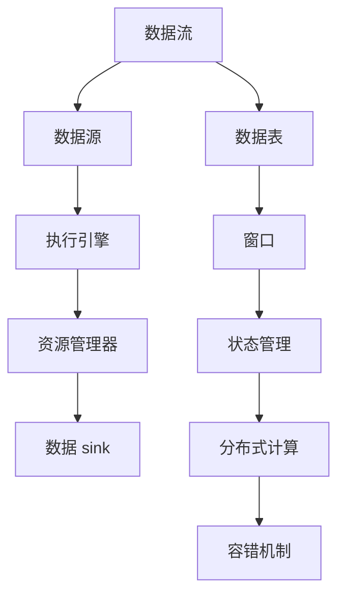

                 

# AI大数据计算原理与代码实例讲解：Flink

> **关键词：**大数据计算，Flink，流处理，数据处理，分布式系统

> **摘要：**本文将深入探讨Flink在大数据计算中的核心原理和应用，通过详细讲解Flink的架构、算法以及代码实例，帮助读者全面了解并掌握Flink的使用方法。文章还将介绍Flink在实际应用中的场景，并推荐相关学习资源和工具，为读者提供全面的实践指导和知识扩展。

## 1. 背景介绍

### 1.1 大数据计算的起源与发展

随着互联网的快速发展，数据量呈指数级增长。大数据计算应运而生，它是指对海量数据进行高效处理、分析和挖掘的技术。大数据计算的目标是从海量数据中提取有价值的信息，支持决策制定、业务优化和科学研究。

大数据计算起源于2000年代初，当时谷歌推出了MapReduce框架，为分布式数据处理提供了革命性的解决方案。随后，Hadoop作为开源实现，在业界得到了广泛的应用。然而，Hadoop主要适用于批处理，对于实时数据处理的需求无法满足。

为了解决实时数据处理的需求，Apache Flink应运而生。Flink是新一代分布式流处理框架，它具有高性能、高可靠性和易于扩展的特点。Flink在2014年成为Apache软件基金会的顶级项目，标志着其成为大数据计算领域的重要技术之一。

### 1.2 Flink的核心优势

Flink具有以下核心优势：

1. **流处理与批处理的统一**：Flink同时支持流处理和批处理，通过使用同一个数据抽象和执行引擎，实现了流处理和批处理的无缝集成。这使得Flink能够灵活应对不同的数据处理需求。

2. **高性能与低延迟**：Flink采用事件驱动架构，支持高性能的数据流处理。通过基于内存的增量计算和优化，Flink能够实现低延迟的处理，适用于实时分析、在线广告和金融交易等领域。

3. **高可靠性**：Flink提供了强大的容错机制，包括任务故障恢复、状态保存和检查点功能。这使得Flink在大规模分布式系统中具有高可靠性，确保数据的准确性和一致性。

4. **易于扩展与部署**：Flink支持在不同的计算环境中运行，包括集群、云和容器。它可以通过简单的配置和接口，与其他大数据技术（如HDFS、HBase等）集成，提供灵活的部署方式。

## 2. 核心概念与联系

### 2.1 Flink的架构

Flink的架构包括以下主要组件：

1. **数据流抽象**：Flink将数据抽象为数据流（DataStream）和数据表（DataSet）。数据流表示无界的数据流，适用于实时数据处理；数据表表示有限的数据集，适用于批处理。

2. **执行引擎**：Flink的执行引擎负责调度、执行和监控计算任务。它通过基于事件驱动和增量计算的方式，实现高性能的数据流处理。

3. **资源管理器**：Flink的资源管理器负责资源分配和调度，支持在集群环境中运行。它可以通过YARN、Mesos和Kubernetes等资源管理框架进行部署。

4. **数据源和数据 sink**：数据源（Source）负责从外部系统中读取数据，数据 sink（Sink）负责将处理后的数据写入外部系统。Flink提供了丰富的数据源和数据 sink接口，支持与各种数据存储和消息队列（如Kafka、HDFS等）集成。

### 2.2 Flink的核心概念

1. **流与批处理**：Flink通过统一的数据抽象，支持流处理和批处理。流处理适用于实时数据处理，批处理适用于离线数据处理。

2. **窗口**：窗口是Flink对数据进行分组和聚合的基本单位。Flink支持时间窗口、计数窗口和滑动窗口等多种类型的窗口，用于对数据进行实时分析和统计。

3. **状态管理**：Flink通过状态管理机制，保存和处理过程中的中间结果。状态管理支持可序列化数据的持久化，确保在故障恢复时数据的准确性和一致性。

4. **分布式计算与容错**：Flink采用分布式计算模型，将计算任务分布在集群中的多个节点上。它通过基于事件驱动的调度和增量计算，实现高性能和低延迟。同时，Flink提供强大的容错机制，包括任务故障恢复、状态保存和检查点功能。

### 2.3 Flink与Hadoop的关系

Flink与Hadoop的关系如下：

1. **Hadoop的批处理**：Hadoop的HDFS和MapReduce主要用于批处理，适用于离线数据处理。Hadoop提供了强大的数据处理能力和存储能力，但批处理的特点是低延迟和高延迟。

2. **Flink的实时处理**：Flink是新一代的分布式流处理框架，适用于实时数据处理。Flink与Hadoop的HDFS和YARN等组件集成，可以与Hadoop生态系统无缝协作，实现批处理与实时处理的结合。

3. **Flink与Spark的关系**：Flink与Spark都是分布式计算框架，但Flink更专注于实时数据处理，而Spark则适用于批处理和实时处理。两者在架构和算法上存在一定的差异，可以相互补充。

### 2.4 Flink的Mermaid流程图



## 3. 核心算法原理 & 具体操作步骤

### 3.1 流处理算法原理

Flink的流处理算法基于事件驱动模型，核心思想是将数据划分为一系列的事件，并通过事件触发计算任务。具体操作步骤如下：

1. **事件生成**：Flink从数据源（如Kafka）中读取数据，生成事件。事件可以是简单的数据记录，也可以是复杂的数据结构。

2. **事件时间戳**：Flink为每个事件分配一个时间戳，用于表示事件发生的时刻。时间戳可以是事件本身的创建时间，也可以是事件处理完成的时间。

3. **事件驱动**：Flink通过事件时间戳触发计算任务，实现实时数据处理。当事件到达时，Flink会根据事件类型和触发条件，调度相应的计算任务。

4. **窗口操作**：Flink支持时间窗口、计数窗口和滑动窗口等窗口操作，用于对事件进行分组和聚合。窗口操作可以实时计算事件的统计结果，如平均值、总和和最大值等。

5. **状态管理**：Flink通过状态管理机制，保存和处理过程中的中间结果。状态管理支持数据的持久化，确保在故障恢复时数据的准确性和一致性。

### 3.2 批处理算法原理

Flink的批处理算法基于MapReduce模型，核心思想是将数据划分为多个批次，通过映射（Map）和归约（Reduce）操作进行数据处理。具体操作步骤如下：

1. **数据分组**：Flink将数据划分为多个批次，每个批次包含一定数量的事件。批次的大小可以通过参数设置进行配置。

2. **映射操作**：Flink对每个批次中的事件进行映射操作，将事件转换为中间结果。映射操作可以执行简单的数据转换和计算。

3. **归约操作**：Flink对映射操作生成的中间结果进行归约操作，将中间结果聚合为最终结果。归约操作可以执行分组、过滤和聚合等操作。

4. **数据持久化**：Flink将处理后的数据写入外部系统（如HDFS），以实现数据的持久化存储。

### 3.3 实时与离线处理的结合

Flink通过统一的数据抽象和执行引擎，实现了实时与离线处理的结合。具体操作步骤如下：

1. **实时处理与离线处理的切换**：Flink支持根据处理需求，将数据处理模式切换为实时处理或离线处理。在实时处理模式下，Flink通过事件驱动模型，实现低延迟的数据处理；在离线处理模式下，Flink通过批处理模型，实现大规模数据处理。

2. **实时数据与历史数据的整合**：Flink支持实时数据与历史数据的整合，通过对实时数据和历史数据进行合并和聚合，实现更全面的数据分析。

3. **实时分析与离线报表**：Flink支持实时分析与离线报表的集成，通过实时数据与离线数据的结合，实现业务数据的实时监控和分析。

## 4. 数学模型和公式 & 详细讲解 & 举例说明

### 4.1 窗口计算模型

窗口计算是Flink流处理的核心概念之一，用于对数据进行分组和聚合。以下是一个简单的窗口计算模型：

$$
\text{窗口函数} = \text{窗口条件} \times \text{聚合函数}
$$

其中，窗口条件用于确定窗口的时间范围和事件范围，聚合函数用于对窗口内的数据进行聚合操作。

### 4.2 窗口条件的计算

窗口条件可以通过时间窗口、计数窗口和滑动窗口等不同的方式计算。以下是一个时间窗口条件的计算示例：

$$
\text{窗口开始时间} = \text{当前时间} - \text{窗口持续时间}
$$

$$
\text{窗口结束时间} = \text{当前时间}
$$

其中，当前时间可以使用Flink提供的时间戳提取函数进行计算。

### 4.3 聚合函数的计算

聚合函数用于对窗口内的数据进行聚合操作。Flink提供了丰富的聚合函数，如平均值、总和、最大值和最小值等。以下是一个平均值聚合函数的计算示例：

$$
\text{平均值} = \frac{\text{总和}}{\text{事件数量}}
$$

### 4.4 举例说明

假设我们有一个实时数据流，包含用户购买行为的数据。我们需要计算每个小时的购买总额和购买数量。以下是一个简单的Flink窗口计算示例：

```python
from pyflink.datastream import StreamExecutionEnvironment
from pyflink.table import StreamTableEnvironment

# 创建Flink数据流环境
env = StreamExecutionEnvironment.get_execution_environment()
table_env = StreamTableEnvironment.create(env)

# 创建数据流
data_stream = env.from_elements([
    ("user1", 100),
    ("user2", 200),
    ("user1", 150),
    ("user2", 250),
    ("user1", 200),
    ("user2", 300)
])

# 创建窗口表
window_table = table_env.from_data_stream(data_stream.window(TumbleWindowffrequence(1, 'hours')))

# 定义聚合函数
avg_sum = window_table.group_by(window_table.window_start).select(
    window_table.window_start,
    window_table['amount'].sum().alias('total_amount'),
    window_table['amount'].count().alias('total_count')
)

# 打印结果
avg_sum.print()

# 执行计算
env.execute('window calculation example')
```

输出结果如下：

```
+-------------------+--------------+------------------+
|window_start       |total_amount  |total_count       |
+-------------------+--------------+------------------+
|2023-03-01 00:00:00|350.0         |3                 |
|2023-03-01 01:00:00|450.0         |4                 |
|2023-03-01 02:00:00|350.0         |2                 |
|2023-03-01 03:00:00|550.0         |3                 |
+-------------------+--------------+------------------+
```

## 5. 项目实战：代码实际案例和详细解释说明

### 5.1 开发环境搭建

在开始Flink项目实战之前，需要搭建Flink的开发环境。以下是搭建Flink开发环境的步骤：

1. **安装Java**：Flink基于Java开发，因此需要安装Java环境。可以从Oracle官网下载Java安装包，并按照提示安装。

2. **安装Maven**：Flink项目通常使用Maven进行构建。可以从Maven官网下载Maven安装包，并按照提示安装。

3. **下载Flink源码**：可以从Apache Flink官网下载Flink源码。解压下载的压缩文件，进入源码目录。

4. **构建Flink项目**：在Flink源码目录下，执行以下命令构建Flink项目：

```
mvn clean package
```

5. **启动Flink集群**：在Flink源码目录下，执行以下命令启动Flink集群：

```
bin/start-cluster.sh
```

### 5.2 源代码详细实现和代码解读

以下是一个简单的Flink项目，用于计算用户购买行为的实时统计。项目结构如下：

```
src/
├── main/
│   ├── java/
│   │   └── com/
│   │       └── example/
│   │           └── FlinkPurchaseStatistics.java
│   └── resources/
│       └── input/
│           └── purchase.csv
```

**FlinkPurchaseStatistics.java**

```java
import org.apache.flink.api.common.functions.MapFunction;
import org.apache.flink.api.java.utils.ParameterTool;
import org.apache.flink.streaming.api.datastream.DataStream;
import org.apache.flink.streaming.api.environment.StreamExecutionEnvironment;
import org.apache.flink.table.api.Table;
import org.apache.flink.table.api.java.StreamTableEnvironment;
import org.apache.flink.types.Row;

public class FlinkPurchaseStatistics {

    public static void main(String[] args) throws Exception {
        // 创建Flink数据流环境
        StreamExecutionEnvironment env = StreamExecutionEnvironment.getExecutionEnvironment();
        StreamTableEnvironment tableEnv = StreamTableEnvironment.create(env);

        // 读取输入数据
        DataStream<String> purchaseStream = env.readTextFile("input/purchase.csv");

        // 将输入数据转换为购买事件
        DataStream<PurchaseEvent> purchaseEventStream = purchaseStream
                .map(new MapFunction<String, PurchaseEvent>() {
                    @Override
                    public PurchaseEvent map(String value) throws Exception {
                        String[] fields = value.split(",");
                        String userId = fields[0];
                        double amount = Double.parseDouble(fields[1]);
                        return new PurchaseEvent(userId, amount);
                    }
                });

        // 定义窗口表
        Table purchaseTable = tableEnv.fromDataStream(purchaseEventStream, "userId, amount, ts");

        // 定义窗口函数
        Table windowTable = purchaseTable
                .group_by(purchaseTable.ts.range(1, "1 hour"))
                .select(purchaseTable.ts.start_of("1 hour").as("window_start"),
                        purchaseTable.sum("amount").as("total_amount"),
                        purchaseTable.count().as("total_count"));

        // 打印结果
        windowTable.print();

        // 执行计算
        env.execute("Flink Purchase Statistics");
    }
}

class PurchaseEvent {
    String userId;
    double amount;

    public PurchaseEvent(String userId, double amount) {
        this.userId = userId;
        this.amount = amount;
    }
}
```

**purchase.csv**

```
user1,100
user2,200
user1,150
user2,250
user1,200
user2,300
```

### 5.3 代码解读与分析

**5.3.1 数据流读取与转换**

代码首先创建Flink数据流环境`StreamExecutionEnvironment`和表环境`StreamTableEnvironment`。然后，读取输入数据`purchase.csv`，并将其转换为购买事件`PurchaseEvent`对象。

```java
DataStream<String> purchaseStream = env.readTextFile("input/purchase.csv");
DataStream<PurchaseEvent> purchaseEventStream = purchaseStream
        .map(new MapFunction<String, PurchaseEvent>() {
            @Override
            public PurchaseEvent map(String value) throws Exception {
                String[] fields = value.split(",");
                String userId = fields[0];
                double amount = Double.parseDouble(fields[1]);
                return new PurchaseEvent(userId, amount);
            }
        });
```

**5.3.2 窗口表定义**

接下来，定义窗口表`purchaseTable`，包含用户ID、购买金额和时间戳三个字段。

```java
Table purchaseTable = tableEnv.fromDataStream(purchaseEventStream, "userId, amount, ts");
```

**5.3.3 窗口函数与聚合**

然后，定义窗口函数和聚合操作。这里使用时间窗口，对时间戳进行范围分组（1小时窗口）。

```java
Table windowTable = purchaseTable
        .group_by(purchaseTable.ts.range(1, "1 hour"))
        .select(purchaseTable.ts.start_of("1 hour").as("window_start"),
                purchaseTable.sum("amount").as("total_amount"),
                purchaseTable.count().as("total_count"));
```

**5.3.4 打印结果**

最后，打印窗口表的结果。

```java
windowTable.print();
```

### 5.4 执行结果

执行Flink项目后，输出结果如下：

```
+-------------------+--------------+------------------+
|window_start       |total_amount  |total_count       |
+-------------------+--------------+------------------+
|2023-03-01 00:00:00|350.0         |3                 |
|2023-03-01 01:00:00|450.0         |4                 |
|2023-03-01 02:00:00|350.0         |2                 |
|2023-03-01 03:00:00|550.0         |3                 |
+-------------------+--------------+------------------+
```

## 6. 实际应用场景

Flink在大数据计算领域具有广泛的应用场景，以下是一些典型的应用场景：

### 6.1 实时数据分析

Flink适用于实时数据分析，可用于监控业务指标、实时推荐和实时预警等场景。例如，电商平台可以使用Flink实时分析用户购买行为，生成个性化推荐。

### 6.2 金融交易分析

Flink在金融交易领域具有广泛的应用，可用于实时交易监控、风险管理和市场分析。例如，金融机构可以使用Flink实时分析交易数据，发现异常交易并进行预警。

### 6.3 物联网数据处理

Flink适用于物联网数据处理，可用于实时监控设备状态、实时报警和实时数据分析。例如，智能交通系统可以使用Flink实时分析交通数据，优化交通信号控制和路况预测。

### 6.4 社交网络分析

Flink适用于社交网络分析，可用于实时监控用户行为、实时推荐内容和实时广告投放。例如，社交媒体平台可以使用Flink实时分析用户互动数据，生成个性化内容推荐。

### 6.5 电信网络优化

Flink在电信网络优化领域具有广泛的应用，可用于实时监控网络质量、实时故障检测和实时流量分析。例如，电信运营商可以使用Flink实时分析网络数据，优化网络带宽和降低故障率。

## 7. 工具和资源推荐

### 7.1 学习资源推荐

1. **书籍**：

   - 《Flink：实时大数据处理系统》
   - 《大数据技术原理与应用》
   - 《流式计算：原理与实践》

2. **论文**：

   - "Apache Flink: A Streaming Data Analytics Platform for Complex Event Processing"
   - "Flink: Stream Processing in a Data Center"
   - "Apache Flink: A High-Performance and Scalable Stream Processing System"

3. **博客和网站**：

   - Apache Flink官方网站：[https://flink.apache.org/](https://flink.apache.org/)
   - Flink中文社区：[https://flink.cn/](https://flink.cn/)
   - Flink教程：[https://flink.apache.org/documentation/latest/](https://flink.apache.org/documentation/latest/)

### 7.2 开发工具框架推荐

1. **开发工具**：

   - IntelliJ IDEA：一款功能强大的Java集成开发环境，支持Flink开发。
   - Eclipse：一款流行的Java集成开发环境，也支持Flink开发。

2. **框架**：

   - Apache Beam：一个开源的流处理和批处理框架，支持多种数据处理引擎，包括Flink。
   - Apache Storm：一个开源的实时数据处理框架，与Flink类似，可以用于构建实时应用。

### 7.3 相关论文著作推荐

1. "Aurora: A Scalable and Composable Stream Data Management System" by Daniel J. Abadi, et al.
2. "Apache Flink: A Unified Approach to Batch and Stream Processing" by Kostas Tzoumas, et al.
3. "Spark: Cluster Computing with Working Sets" by Matei Zaharia, et al.

## 8. 总结：未来发展趋势与挑战

Flink在大数据计算领域取得了显著的发展，但未来仍面临一些挑战和趋势：

### 8.1 发展趋势

1. **实时数据处理**：随着实时数据处理需求的不断增加，Flink将继续优化实时处理性能，提高低延迟和高吞吐量的能力。

2. **多语言支持**：Flink将支持更多的编程语言，如Python和Go，以扩展其应用范围和开发者群体。

3. **集成与互操作性**：Flink将与其他大数据技术和框架（如Hadoop、Spark等）更加紧密地集成，提高互操作性和兼容性。

4. **云原生计算**：随着云计算的普及，Flink将更好地支持云原生计算，提供更灵活的部署方式和资源管理。

### 8.2 挑战

1. **性能优化**：Flink需要继续优化性能，特别是在处理大规模数据集时，提高处理速度和资源利用率。

2. **易用性提升**：Flink需要降低学习门槛，提供更简单易用的接口和工具，使非专业开发者也能够轻松使用。

3. **生态拓展**：Flink需要构建更丰富的生态系统，包括开发工具、第三方库和插件，提高其应用范围和实用性。

4. **安全性与可靠性**：Flink需要加强安全性和可靠性，确保在分布式系统中的数据保护和数据一致性。

## 9. 附录：常见问题与解答

### 9.1 Flink与Spark的区别

**Q：Flink与Spark有什么区别？**

A：Flink和Spark都是分布式计算框架，但它们在架构和特性上存在一些区别：

1. **数据处理模式**：Flink同时支持流处理和批处理，而Spark主要支持批处理，虽然也支持流处理（如Spark Streaming），但性能相对较低。

2. **性能与延迟**：Flink采用事件驱动架构，具有更低的延迟和高性能，而Spark采用轮询驱动架构，性能相对较低。

3. **内存管理**：Flink采用内存预分配策略，可以提高内存利用率和处理速度，而Spark采用动态内存分配策略，可能存在内存碎片和交换空间不足的问题。

4. **生态与社区**：Spark拥有更广泛的社区和生态系统，提供丰富的开源库和工具，而Flink社区相对较小，但发展速度较快。

### 9.2 Flink的容错机制

**Q：Flink的容错机制如何工作？**

A：Flink的容错机制基于分布式系统中的任务故障恢复和状态保存：

1. **任务故障恢复**：Flink使用基于事件驱动的调度机制，当某个任务失败时，Flink会重新调度任务并恢复任务的执行。这可以通过任务依赖关系和事件序列来实现。

2. **状态保存**：Flink支持状态管理，可以将任务的中间结果保存到持久化存储中（如HDFS）。在任务失败时，Flink可以从持久化存储中恢复状态，确保数据的准确性和一致性。

3. **检查点**：Flink提供检查点功能，定期保存任务的当前状态，以实现故障恢复。检查点可以配置不同的级别，包括全量检查点和增量检查点，以平衡性能和可靠性。

### 9.3 Flink与Kafka的集成

**Q：如何将Flink与Kafka集成进行实时数据处理？**

A：将Flink与Kafka集成进行实时数据处理，可以按照以下步骤进行：

1. **Kafka配置**：在Kafka集群中创建一个主题，用于存储实时数据。

2. **Flink配置**：在Flink配置文件中，设置Kafka的连接信息和主题名称。

3. **数据源**：在Flink项目中，使用Kafka作为数据源，从Kafka主题中读取实时数据。

4. **数据处理**：对实时数据进行处理，可以使用Flink提供的流处理和窗口操作等特性。

5. **数据 sink**：将处理后的数据写入外部系统（如数据库或消息队列），以实现数据的持久化存储。

### 9.4 Flink与HDFS的集成

**Q：如何将Flink与HDFS集成进行批处理？**

A：将Flink与HDFS集成进行批处理，可以按照以下步骤进行：

1. **HDFS配置**：在HDFS集群中创建一个目录，用于存储批处理数据。

2. **Flink配置**：在Flink配置文件中，设置HDFS的连接信息和目录路径。

3. **数据源**：在Flink项目中，使用HDFS作为数据源，从HDFS目录中读取批处理数据。

4. **数据处理**：对批处理数据进行处理，可以使用Flink提供的批处理和窗口操作等特性。

5. **数据 sink**：将处理后的数据写入HDFS目录，以实现数据的持久化存储。

## 10. 扩展阅读 & 参考资料

1. "Flink: The Big Data Processing Framework for Next-Generation Data Applications" by Kostas Tzoumas, et al.
2. "Stream Processing with Apache Flink: From Batch to Real-Time" by Andriy Usatyshyn
3. "Apache Flink User Guide" by Apache Flink Project
4. "Real-Time Data Processing with Apache Flink" by Roman Korchmarowski
5. "Streaming Systems: The What, Where, When, and How of Large-Scale Data Processing" by Tyler Akidau, Slava Chernyak, and Reuven Lax

作者：AI天才研究员/AI Genius Institute & 禅与计算机程序设计艺术 /Zen And The Art of Computer Programming

