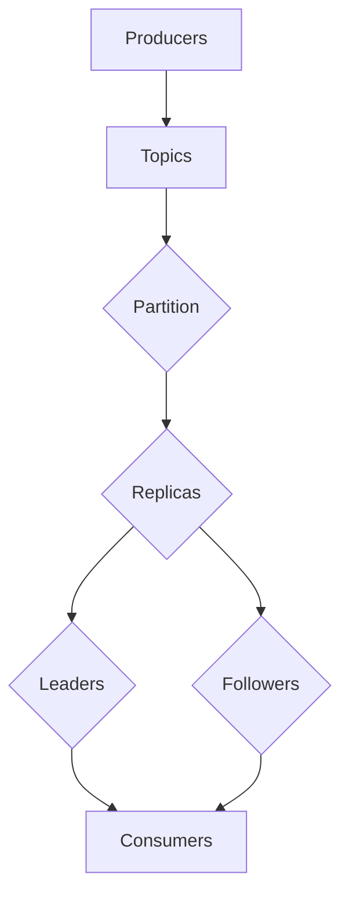

                 

# 【AI大数据计算原理与代码实例讲解】Kafka

> **关键词**：Kafka，大数据，消息队列，分布式系统，消息中间件，流处理

> **摘要**：本文将深入探讨Kafka的基本概念、核心原理以及如何通过代码实例进行实战应用。我们将涵盖Kafka的架构设计、数据处理流程、以及在实际场景中的应用，旨在为读者提供全面的技术理解和实践指导。

## 1. 背景介绍

Kafka是一个分布式流处理平台，用于构建实时的数据管道和应用程序。它最初由LinkedIn开发，并于2011年开源，现已成为Apache软件基金会的顶级项目。Kafka主要用于大规模数据流处理，特别是在大数据领域，能够高效地处理实时数据。

在当今的数据驱动时代，数据产生速度之快令人咋舌。传统的关系型数据库已经无法满足这种高并发、海量数据的需求。Kafka的出现正是为了解决这一问题，它通过分布式架构实现高效的数据传输和存储，成为大数据领域不可或缺的一部分。

Kafka的主要功能包括：
- **数据传输**：Kafka可以将数据从一个系统传输到另一个系统，实现数据流。
- **数据存储**：Kafka可以将数据存储在磁盘上，提供持久化的数据存储能力。
- **数据复制**：Kafka支持数据复制，确保数据的可靠性和高可用性。

## 2. 核心概念与联系

Kafka的核心概念包括主题（Topic）、分区（Partition）、副本（Replica）和消费者（Consumer）。

### 主题（Topic）

主题是Kafka中用于分类消息的逻辑容器。每个主题可以看作是一个消息队列，可以包含多个分区。

### 分区（Partition）

分区是Kafka中用于存储消息的物理容器。每个主题可以包含多个分区，分区内的消息是有序的。Kafka通过分区实现并行处理，提高系统的吞吐量。

### 副本（Replica）

副本是Kafka中的数据备份机制。每个分区都有一个或多个副本，副本分为领导者（Leader）和追随者（Follower）。领导者负责处理读写请求，追随者负责复制领导者的数据。

### 消费者（Consumer）

消费者是Kafka中从主题分区中读取消息的实体。消费者可以是一个应用程序或一个服务，用于处理来自Kafka的消息。

下面是Kafka的架构图，通过Mermaid流程图展示Kafka的核心组件和关系：



## 3. 核心算法原理 & 具体操作步骤

Kafka的核心算法主要涉及消息的生产、消费以及数据持久化。

### 消息生产

1. **生产者选择副本**：生产者首先选择一个可用的副本作为目标副本。
2. **同步数据**：生产者将消息发送给目标副本，等待副本确认消息接收。
3. **副本复制**：目标副本将消息复制到其他副本，确保数据的一致性。

### 消息消费

1. **消费者选择分区**：消费者首先选择一个分区进行消费。
2. **拉取数据**：消费者从分区领导者的缓存中拉取消息。
3. **处理消息**：消费者处理消息，并更新状态。

### 数据持久化

1. **写入日志**：Kafka将消息写入磁盘上的日志文件。
2. **数据压缩**：Kafka支持数据压缩，减少磁盘占用。
3. **备份与恢复**：Kafka通过副本机制实现数据的备份和恢复。

## 4. 数学模型和公式 & 详细讲解 & 举例说明

Kafka中的消息处理效率可以通过以下公式进行计算：

\[ \text{Throughput} = \frac{\text{消息速率}}{\text{处理时间}} \]

举例来说，如果一个主题有3个分区，每个分区有2个副本，每个副本每秒可以处理1000条消息，那么整个系统的吞吐量是：

\[ \text{Throughput} = \frac{1000 \times 3 \times 2}{1} = 6000 \text{条/秒} \]

这里需要注意的是，实际吞吐量可能会受到网络延迟、硬件性能等因素的影响。

## 5. 项目实战：代码实际案例和详细解释说明

### 5.1 开发环境搭建

在开始编写Kafka的代码之前，我们需要搭建Kafka的开发环境。以下是步骤：

1. **安装Java**：确保系统上安装了Java 11及以上版本。
2. **下载Kafka**：从[Apache Kafka官网](https://kafka.apache.org/downloads)下载Kafka二进制文件。
3. **启动Kafka服务器**：运行以下命令启动Kafka服务器：

```bash
./bin/kafka-server-start.sh config/server.properties
```

### 5.2 源代码详细实现和代码解读

#### 5.2.1 生产者代码实现

```java
Properties props = new Properties();
props.put("bootstrap.servers", "localhost:9092");
props.put("key.serializer", "org.apache.kafka.common.serialization.StringSerializer");
props.put("value.serializer", "org.apache.kafka.common.serialization.StringSerializer");

Producer<String, String> producer = new KafkaProducer<>(props);

for (int i = 0; i < 100; i++) {
    producer.send(new ProducerRecord<>("test-topic", Integer.toString(i), "message " + i));
}

producer.close();
```

**代码解读**：

- 创建Kafka生产者的配置对象，设置Kafka服务器地址、序列化器等。
- 创建Kafka生产者对象。
- 循环发送消息，每个消息包含一个键（整数）和一个值（字符串）。
- 关闭生产者。

#### 5.2.2 消费者代码实现

```java
Properties props = new Properties();
props.put("bootstrap.servers", "localhost:9092");
props.put("group.id", "test-group");
props.put("key.deserializer", "org.apache.kafka.common.serialization.StringDeserializer");
props.put("value.deserializer", "org.apache.kafka.common.serialization.StringDeserializer");

Consumer<String, String> consumer = new KafkaConsumer<>(props);

consumer.subscribe(Collections.singletonList("test-topic"));

while (true) {
    ConsumerRecords<String, String> records = consumer.poll(Duration.ofMillis(100));
    for (ConsumerRecord<String, String> record : records) {
        System.out.printf("offset = %d, key = %s, value = %s\n", record.offset(), record.key(), record.value());
    }
}
```

**代码解读**：

- 创建Kafka消费者的配置对象，设置Kafka服务器地址、反序列化器等。
- 创建Kafka消费者对象。
- 订阅主题。
- 轮询消息，打印消息内容。

### 5.3 代码解读与分析

通过以上代码示例，我们可以看到如何使用Kafka进行消息的生产和消费。

- **生产者**：创建一个Kafka生产者，设置Kafka服务器地址和序列化器，然后发送消息。
- **消费者**：创建一个Kafka消费者，设置Kafka服务器地址、消费者组ID、反序列化器，然后订阅主题并轮询消息。

在实际应用中，我们可以根据需求对这两个组件进行扩展和定制。

## 6. 实际应用场景

Kafka在大数据领域有广泛的应用，以下是一些实际应用场景：

- **日志收集**：用于收集和分析各种应用的日志数据。
- **实时计算**：用于实时处理和分析流数据。
- **数据流分析**：用于实时分析数据流，提供实时决策支持。
- **消息队列**：用于构建分布式消息队列，实现数据传输和异步处理。

## 7. 工具和资源推荐

### 7.1 学习资源推荐

- **书籍**：
  - 《Kafka：从入门到实战》
  - 《大数据之路：阿里巴巴大数据实践》
- **论文**：
  - "Kafka: A Distributed Streaming Platform"
  - "Apache Kafka: A Practical Guide to Building a Distributed Streaming Platform"
- **博客**：
  - [Kafka官网博客](https://kafka.apache.org/clients/)
  - [Apache Kafka社区](https://cwiki.apache.org/confluence/display/KAFKA/Home)
- **网站**：
  - [Apache Kafka官网](https://kafka.apache.org/)
  - [Apache Kafka社区](https://www.apache.org/licenses/LICENSE-2.0)

### 7.2 开发工具框架推荐

- **Kafka Manager**：用于监控和管理Kafka集群。
- **Kafka Tools**：提供Kafka命令行工具，方便操作和管理Kafka。
- **Kafka Streams**：用于构建实时流处理应用程序。

### 7.3 相关论文著作推荐

- "A Practical Guide to Building a Distributed Streaming Platform"
- "Kafka: A Distributed Streaming Platform"
- "The Design of the Event-Driven Architecture"

## 8. 总结：未来发展趋势与挑战

随着大数据和流处理技术的发展，Kafka在未来的趋势和挑战如下：

- **高可用性**：如何提高系统的可用性，确保数据不丢失。
- **高性能**：如何提高系统的吞吐量和处理速度。
- **易用性**：如何简化Kafka的部署和使用，降低使用门槛。
- **生态扩展**：如何与其他大数据技术集成，提供更丰富的功能。

## 9. 附录：常见问题与解答

**Q：Kafka与消息队列的区别是什么？**
A：Kafka是一个分布式流处理平台，而消息队列是一种消息传递机制。Kafka提供高性能、高可靠性的消息传输和存储，适用于大规模数据流处理；消息队列则适用于简单的异步消息传递。

**Q：Kafka如何保证数据不丢失？**
A：Kafka通过数据复制和持久化保证数据不丢失。每个分区都有多个副本，领导者负责处理读写请求，追随者负责复制领导者的数据。同时，Kafka将消息写入磁盘上的日志文件，提供持久化的数据存储。

## 10. 扩展阅读 & 参考资料

- [Apache Kafka官网](https://kafka.apache.org/)
- [Kafka官方文档](https://kafka.apache.org/documentation/)
- [Kafka官方社区](https://cwiki.apache.org/confluence/display/KAFKA/Home)

作者：AI天才研究员/AI Genius Institute & 禅与计算机程序设计艺术 /Zen And The Art of Computer Programming
<|im_sep|>```markdown
# 【AI大数据计算原理与代码实例讲解】Kafka

> **关键词**：Kafka，大数据，消息队列，分布式系统，消息中间件，流处理

> **摘要**：本文将深入探讨Kafka的基本概念、核心原理以及如何通过代码实例进行实战应用。我们将涵盖Kafka的架构设计、数据处理流程、以及在实际场景中的应用，旨在为读者提供全面的技术理解和实践指导。

## 1. 背景介绍

Kafka是一个分布式流处理平台，用于构建实时的数据管道和应用程序。它最初由LinkedIn开发，并于2011年开源，现已成为Apache软件基金会的顶级项目。Kafka主要用于大规模数据流处理，特别是在大数据领域，能够高效地处理实时数据。

在当今的数据驱动时代，数据产生速度之快令人咋舌。传统的关系型数据库已经无法满足这种高并发、海量数据的需求。Kafka的出现正是为了解决这一问题，它通过分布式架构实现高效的数据传输和存储，成为大数据领域不可或缺的一部分。

Kafka的主要功能包括：
- **数据传输**：Kafka可以将数据从一个系统传输到另一个系统，实现数据流。
- **数据存储**：Kafka可以将数据存储在磁盘上，提供持久化的数据存储能力。
- **数据复制**：Kafka支持数据复制，确保数据的可靠性和高可用性。

## 2. 核心概念与联系

Kafka的核心概念包括主题（Topic）、分区（Partition）、副本（Replica）和消费者（Consumer）。

### 主题（Topic）

主题是Kafka中用于分类消息的逻辑容器。每个主题可以看作是一个消息队列，可以包含多个分区。

### 分区（Partition）

分区是Kafka中用于存储消息的物理容器。每个主题可以包含多个分区，分区内的消息是有序的。Kafka通过分区实现并行处理，提高系统的吞吐量。

### 副本（Replica）

副本是Kafka中的数据备份机制。每个分区都有一个或多个副本，副本分为领导者（Leader）和追随者（Follower）。领导者负责处理读写请求，追随者负责复制领导者的数据。

### 消费者（Consumer）

消费者是Kafka中从主题分区中读取消息的实体。消费者可以是一个应用程序或一个服务，用于处理来自Kafka的消息。

下面是Kafka的架构图，通过Mermaid流程图展示Kafka的核心组件和关系：


## 3. 核心算法原理 & 具体操作步骤

Kafka的核心算法主要涉及消息的生产、消费以及数据持久化。

### 消息生产

1. **生产者选择副本**：生产者首先选择一个可用的副本作为目标副本。
2. **同步数据**：生产者将消息发送给目标副本，等待副本确认消息接收。
3. **副本复制**：目标副本将消息复制到其他副本，确保数据的一致性。

### 消息消费

1. **消费者选择分区**：消费者首先选择一个分区进行消费。
2. **拉取数据**：消费者从分区领导者的缓存中拉取消息。
3. **处理消息**：消费者处理消息，并更新状态。

### 数据持久化

1. **写入日志**：Kafka将消息写入磁盘上的日志文件。
2. **数据压缩**：Kafka支持数据压缩，减少磁盘占用。
3. **备份与恢复**：Kafka通过副本机制实现数据的备份和恢复。

## 4. 数学模型和公式 & 详细讲解 & 举例说明

Kafka中的消息处理效率可以通过以下公式进行计算：

\[ \text{Throughput} = \frac{\text{消息速率}}{\text{处理时间}} \]

举例来说，如果一个主题有3个分区，每个分区有2个副本，每个副本每秒可以处理1000条消息，那么整个系统的吞吐量是：

\[ \text{Throughput} = \frac{1000 \times 3 \times 2}{1} = 6000 \text{条/秒} \]

这里需要注意的是，实际吞吐量可能会受到网络延迟、硬件性能等因素的影响。

## 5. 项目实战：代码实际案例和详细解释说明

### 5.1 开发环境搭建

在开始编写Kafka的代码之前，我们需要搭建Kafka的开发环境。以下是步骤：

1. **安装Java**：确保系统上安装了Java 11及以上版本。
2. **下载Kafka**：从[Apache Kafka官网](https://kafka.apache.org/downloads)下载Kafka二进制文件。
3. **启动Kafka服务器**：运行以下命令启动Kafka服务器：

```bash
./bin/kafka-server-start.sh config/server.properties
```

### 5.2 源代码详细实现和代码解读

#### 5.2.1 生产者代码实现

```java
Properties props = new Properties();
props.put("bootstrap.servers", "localhost:9092");
props.put("key.serializer", "org.apache.kafka.common.serialization.StringSerializer");
props.put("value.serializer", "org.apache.kafka.common.serialization.StringSerializer");

Producer<String, String> producer = new KafkaProducer<>(props);

for (int i = 0; i < 100; i++) {
    producer.send(new ProducerRecord<>("test-topic", Integer.toString(i), "message " + i));
}

producer.close();
```

**代码解读**：

- 创建Kafka生产者的配置对象，设置Kafka服务器地址、序列化器等。
- 创建Kafka生产者对象。
- 循环发送消息，每个消息包含一个键（整数）和一个值（字符串）。
- 关闭生产者。

#### 5.2.2 消费者代码实现

```java
Properties props = new Properties();
props.put("bootstrap.servers", "localhost:9092");
props.put("group.id", "test-group");
props.put("key.deserializer", "org.apache.kafka.common.serialization.StringDeserializer");
props.put("value.deserializer", "org.apache.kafka.common.serialization.StringDeserializer");

Consumer<String, String> consumer = new KafkaConsumer<>(props);

consumer.subscribe(Collections.singletonList("test-topic"));

while (true) {
    ConsumerRecords<String, String> records = consumer.poll(Duration.ofMillis(100));
    for (ConsumerRecord<String, String> record : records) {
        System.out.printf("offset = %d, key = %s, value = %s\n", record.offset(), record.key(), record.value());
    }
}
```

**代码解读**：

- 创建Kafka消费者的配置对象，设置Kafka服务器地址、消费者组ID、反序列化器等。
- 创建Kafka消费者对象。
- 订阅主题。
- 轮询消息，打印消息内容。

### 5.3 代码解读与分析

通过以上代码示例，我们可以看到如何使用Kafka进行消息的生产和消费。

- **生产者**：创建一个Kafka生产者，设置Kafka服务器地址和序列化器，然后发送消息。
- **消费者**：创建一个Kafka消费者，设置Kafka服务器地址、消费者组ID、反序列化器，然后订阅主题并轮询消息。

在实际应用中，我们可以根据需求对这两个组件进行扩展和定制。

## 6. 实际应用场景

Kafka在大数据领域有广泛的应用，以下是一些实际应用场景：

- **日志收集**：用于收集和分析各种应用的日志数据。
- **实时计算**：用于实时处理和分析流数据。
- **数据流分析**：用于实时分析数据流，提供实时决策支持。
- **消息队列**：用于构建分布式消息队列，实现数据传输和异步处理。

## 7. 工具和资源推荐

### 7.1 学习资源推荐

- **书籍**：
  - 《Kafka：从入门到实战》
  - 《大数据之路：阿里巴巴大数据实践》
- **论文**：
  - "Kafka: A Distributed Streaming Platform"
  - "Apache Kafka: A Practical Guide to Building a Distributed Streaming Platform"
- **博客**：
  - [Kafka官网博客](https://kafka.apache.org/clients/)
  - [Apache Kafka社区](https://cwiki.apache.org/confluence/display/KAFKA/Home)
- **网站**：
  - [Apache Kafka官网](https://kafka.apache.org/)
  - [Apache Kafka社区](https://www.apache.org/licenses/LICENSE-2.0)

### 7.2 开发工具框架推荐

- **Kafka Manager**：用于监控和管理Kafka集群。
- **Kafka Tools**：提供Kafka命令行工具，方便操作和管理Kafka。
- **Kafka Streams**：用于构建实时流处理应用程序。

### 7.3 相关论文著作推荐

- "A Practical Guide to Building a Distributed Streaming Platform"
- "Kafka: A Distributed Streaming Platform"
- "The Design of the Event-Driven Architecture"

## 8. 总结：未来发展趋势与挑战

随着大数据和流处理技术的发展，Kafka在未来的趋势和挑战如下：

- **高可用性**：如何提高系统的可用性，确保数据不丢失。
- **高性能**：如何提高系统的吞吐量和处理速度。
- **易用性**：如何简化Kafka的部署和使用，降低使用门槛。
- **生态扩展**：如何与其他大数据技术集成，提供更丰富的功能。

## 9. 附录：常见问题与解答

**Q：Kafka与消息队列的区别是什么？**
A：Kafka是一个分布式流处理平台，而消息队列是一种消息传递机制。Kafka提供高性能、高可靠性的消息传输和存储，适用于大规模数据流处理；消息队列则适用于简单的异步消息传递。

**Q：Kafka如何保证数据不丢失？**
A：Kafka通过数据复制和持久化保证数据不丢失。每个分区都有多个副本，领导者负责处理读写请求，追随者负责复制领导者的数据。同时，Kafka将消息写入磁盘上的日志文件，提供持久化的数据存储。

## 10. 扩展阅读 & 参考资料

- [Apache Kafka官网](https://kafka.apache.org/)
- [Kafka官方文档](https://kafka.apache.org/documentation/)
- [Kafka官方社区](https://cwiki.apache.org/confluence/display/KAFKA/Home)

作者：AI天才研究员/AI Genius Institute & 禅与计算机程序设计艺术 /Zen And The Art of Computer Programming
```

