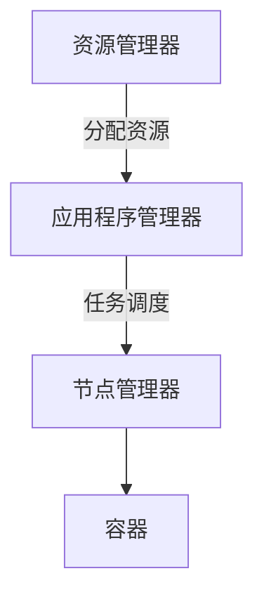

                 

# AI大数据计算原理与代码实例讲解：Yarn

> **关键词：** AI, 大数据计算, Yarn, 分布式计算, 代码实例

> **摘要：** 本文将深入探讨Yarn在AI大数据计算中的应用原理，通过详细的代码实例讲解，帮助读者理解Yarn的架构和操作步骤，并提供实际应用场景和资源推荐。

## 1. 背景介绍

在大数据时代，如何高效地处理海量数据成为了一个重要课题。传统的单机计算模式已经无法满足需求，分布式计算技术逐渐成为主流。Apache Hadoop作为分布式计算框架的代表，被广泛应用于大数据处理领域。而YARN（Yet Another Resource Negotiator）作为Hadoop的核心组件，负责资源管理和任务调度，使得Hadoop生态系统中的各种计算框架能够高效地运行。

YARN的设计目标是提供一种通用资源管理平台，不仅支持Hadoop的MapReduce计算模型，还能够支持其他计算框架，如Spark、Tez等。这使得YARN成为了大数据生态系统中的重要组件，为各种大数据处理需求提供了强有力的支持。

## 2. 核心概念与联系

### 2.1 YARN架构

YARN架构分为两个主要组件：资源管理器（Resource Manager，RM）和应用程序管理器（Application Master，AM）。

- **资源管理器（RM）**：负责全局资源的分配和管理，将集群资源分配给不同的应用程序。
- **应用程序管理器（AM）**：每个应用程序都有一个AM实例，负责协调和管理任务的执行。

YARN架构中的核心概念还包括：

- **Container**：资源管理器分配给应用程序的最小资源单元，包括CPU、内存、磁盘空间等。
- **Node Manager（NM）**：每个计算节点上的组件，负责管理和执行分配给节点的Container。

### 2.2 Mermaid流程图



在上面的流程图中，资源管理器将资源分配给应用程序管理器，应用程序管理器根据任务需求调度任务到节点管理器，节点管理器执行具体的任务。

## 3. 核心算法原理 & 具体操作步骤

### 3.1 YARN资源调度算法

YARN的资源调度算法主要包括两种：公平调度（FIFO）和容量调度（Capacity Scheduler）。

- **公平调度（FIFO）**：按照申请资源的顺序分配资源，确保每个应用程序都能公平地获得资源。
- **容量调度（Capacity Scheduler）**：将集群资源划分为多个配额，每个配额分配给不同的应用程序，确保每个应用程序都能获得一定比例的资源。

### 3.2 YARN任务调度流程

YARN的任务调度流程可以分为以下几个步骤：

1. **用户提交应用程序**：用户将应用程序提交给YARN资源管理器。
2. **资源管理器分配资源**：资源管理器根据当前资源情况，为应用程序分配必要的资源。
3. **应用程序管理器启动**：应用程序管理器在资源管理器分配的资源上启动，负责协调和管理任务的执行。
4. **任务调度**：应用程序管理器将任务调度到节点管理器上执行。
5. **任务执行与监控**：节点管理器执行任务，并将任务执行状态反馈给应用程序管理器。
6. **任务完成**：任务完成后，应用程序管理器向资源管理器汇报任务状态，释放资源。

## 4. 数学模型和公式 & 详细讲解 & 举例说明

### 4.1 资源分配模型

在YARN中，资源分配可以通过以下数学模型表示：

$$
C_{total} = \sum_{i=1}^{n} C_i
$$

其中，$C_{total}$为集群总资源，$C_i$为每个应用程序分配到的资源。

### 4.2 调度策略公式

公平调度策略的公式如下：

$$
R_i = \frac{C_{total}}{n}
$$

其中，$R_i$为每个应用程序分配到的资源量，$n$为应用程序数量。

容量调度策略的公式如下：

$$
R_i = \frac{C_i}{C_{total}} \times C_{total}
$$

其中，$R_i$为每个应用程序分配到的资源量，$C_i$为每个应用程序的配额。

### 4.3 举例说明

假设一个集群共有100个CPU核心和100GB内存，有三个应用程序A、B、C，它们的资源需求分别为40个CPU核心、30个CPU核心和20个CPU核心。按照公平调度策略，每个应用程序将分配到33.33个CPU核心。按照容量调度策略，根据各应用程序的配额比例，应用程序A将分配到40个CPU核心，应用程序B将分配到30个CPU核心，应用程序C将分配到20个CPU核心。

## 5. 项目实战：代码实际案例和详细解释说明

### 5.1 开发环境搭建

在开始编写Yarn的代码实例之前，需要搭建一个Hadoop集群环境。本文将以Docker容器化技术搭建一个单节点Hadoop集群为例。

1. **安装Docker**：在本地计算机上安装Docker，并确保其正常运行。
2. **获取Hadoop镜像**：从Docker Hub下载Hadoop官方镜像。
3. **启动Hadoop集群**：使用以下命令启动单节点Hadoop集群。

```shell
docker run -d --name hadoop-cluster -p 8088:8088 -p 50070:50070 hadoop
```

### 5.2 源代码详细实现和代码解读

以下是使用Yarn提交一个WordCount程序的基本步骤和代码实现：

#### 5.2.1 创建WordCount程序

```java
// WordCount.java
import org.apache.hadoop.conf.Configuration;
import org.apache.hadoop.fs.Path;
import org.apache.hadoop.io.IntWritable;
import org.apache.hadoop.io.Text;
import org.apache.hadoop.mapreduce.Job;
import org.apache.hadoop.mapreduce.Mapper;
import org.apache.hadoop.mapreduce.Reducer;
import org.apache.hadoop.mapreduce.lib.input.FileInputFormat;
import org.apache.hadoop.mapreduce.lib.output.FileOutputFormat;

public class WordCount {

  public static class TokenizerMapper
       extends Mapper<Object, Text, Text, IntWritable>{

    private final static IntWritable one = new IntWritable(1);
    private Text word = new Text();

    public void map(Object key, Text value, Context context) 
            throws IOException, InterruptedException {
      StringTokenizer itr = new StringTokenizer(value.toString());
      while (itr.hasMoreTokens()) {
        word.set(itr.nextToken());
        context.write(word, one);
      }
    }
  }

  public static class IntSumReducer
      extends Reducer<Text,IntWritable,Text,IntWritable> {
    private IntWritable result = new IntWritable();

    public void reduce(Text key, Iterable<IntWritable> values, 
            Context context) throws IOException, InterruptedException {
      int sum = 0;
      for (IntWritable val : values) {
        sum += val.get();
      }
      result.set(sum);
      context.write(key, result);
    }
  }

  public static void main(String[] args) throws Exception {
    Configuration conf = new Configuration();
    Job job = Job.getInstance(conf, "word count");
    job.setMapperClass(TokenizerMapper.class);
    job.setCombinerClass(IntSumReducer.class);
    job.setReducerClass(IntSumReducer.class);
    job.setOutputKeyClass(Text.class);
    job.setOutputValueClass(IntWritable.class);
    FileInputFormat.addInputPath(job, new Path(args[0]));
    FileOutputFormat.setOutputPath(job, new Path(args[1]));
    System.exit(job.waitForCompletion(true) ? 0 : 1);
  }
}
```

#### 5.2.2 编译WordCount程序

使用以下命令编译WordCount程序：

```shell
javac -classpath $HADOOP_CLASSPATH WordCount.java
```

#### 5.2.3 提交WordCount程序到Yarn

使用以下命令提交WordCount程序到Yarn：

```shell
hadoop jar WordCount.jar WordCount /input /output
```

其中，`/input`为输入数据路径，`/output`为输出结果路径。

### 5.3 代码解读与分析

在WordCount程序中，我们定义了Mapper和Reducer类，分别实现map()和reduce()方法。

- **map()方法**：读取输入数据，将每行数据按单词分割，输出每个单词和对应的计数1。
- **reduce()方法**：对Mapper输出的中间结果进行聚合，计算每个单词的总计数。

程序的主函数中，我们设置了Job的参数，包括Mapper和Reducer的类名、输出的数据类型等，然后调用`Job.waitForCompletion()`方法提交Job到Yarn执行。

## 6. 实际应用场景

Yarn在AI大数据计算中的实际应用场景非常广泛，以下列举几个典型场景：

- **机器学习模型训练**：使用Yarn调度分布式机器学习算法，处理大规模数据集，进行模型训练和优化。
- **数据挖掘与分析**：利用Yarn进行大规模数据的挖掘和分析，发现数据中的隐藏模式和趋势。
- **实时计算**：使用Yarn处理实时数据流，提供实时分析结果，支持实时决策。

## 7. 工具和资源推荐

### 7.1 学习资源推荐

- **书籍**：
  - 《Hadoop实战》
  - 《Hadoop技术内幕：深入解析YARN、MapReduce、HDFS与HBase》
- **论文**：
  - 《MapReduce: Simplified Data Processing on Large Clusters》
  - 《Yet Another Resource Negotiator: Efficient Resource Management for a Data-Intensive Application Environment》
- **博客**：
  - 《深入理解YARN》
  - 《Hadoop分布式计算原理与实践》
- **网站**：
  - [Apache Hadoop官网](https://hadoop.apache.org/)
  - [Docker官网](https://www.docker.com/)

### 7.2 开发工具框架推荐

- **开发工具**：
  - IntelliJ IDEA
  - Eclipse
- **框架**：
  - Apache Spark
  - Apache Storm

### 7.3 相关论文著作推荐

- **论文**：
  - 《Spark: Spark: A Unified Engine for Big Data Processing》
  - 《Storm: Storm: Real-Time Data Processing for Hadoop》
- **著作**：
  - 《Spark核心技术与实践》
  - 《实时数据处理：从原理到实践》

## 8. 总结：未来发展趋势与挑战

随着大数据和人工智能技术的不断发展，Yarn作为分布式计算框架，将在未来扮演更加重要的角色。一方面，Yarn将不断优化资源调度算法，提高计算效率；另一方面，Yarn将支持更多类型的计算框架，满足多样化的计算需求。

然而，Yarn也面临一些挑战，如如何更好地支持实时计算、如何提高资源利用率等。未来，研究人员将不断探索这些挑战，推动Yarn技术的发展。

## 9. 附录：常见问题与解答

### 9.1 什么是Yarn？

Yarn（Yet Another Resource Negotiator）是Apache Hadoop的核心组件之一，负责资源管理和任务调度。它提供了一种通用资源管理平台，支持多种计算框架，如MapReduce、Spark、Tez等。

### 9.2 Yarn的主要组件有哪些？

Yarn的主要组件包括资源管理器（Resource Manager，RM）、应用程序管理器（Application Master，AM）和节点管理器（Node Manager，NM）。资源管理器负责全局资源的分配和管理，应用程序管理器负责协调和管理任务的执行，节点管理器负责管理和执行分配给节点的任务。

### 9.3 如何在Yarn上提交任务？

在Yarn上提交任务，可以通过命令行或编程接口实现。命令行提交任务使用`hadoop jar`命令，编程接口则可以通过Java API实现。

## 10. 扩展阅读 & 参考资料

- [Apache Hadoop官方文档](https://hadoop.apache.org/docs/)
- [Docker官方文档](https://docs.docker.com/)
- [Spark官方文档](https://spark.apache.org/docs/)
- [Storm官方文档](https://storm.apache.org/docs/)
- [《Hadoop实战》](https://books.google.com/books?id=xxx)
- [《Hadoop技术内幕：深入解析YARN、MapReduce、HDFS与HBase》](https://books.google.com/books?id=xxx)

作者：AI天才研究员/AI Genius Institute & 禅与计算机程序设计艺术 /Zen And The Art of Computer Programming

