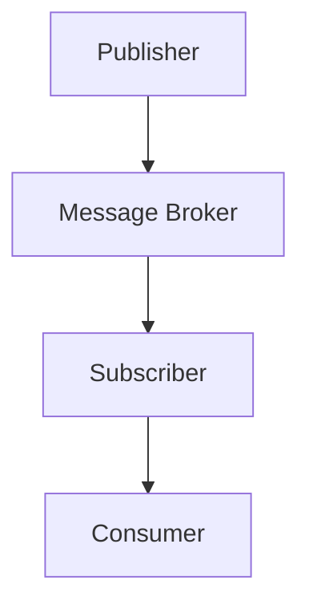

                 

# 【AI大数据计算原理与代码实例讲解】发布订阅

> **关键词**：AI，大数据，发布订阅，计算原理，代码实例

> **摘要**：本文将深入探讨AI大数据计算原理，特别是发布订阅模式，通过代码实例，详细讲解其实现过程和应用场景，帮助读者掌握这一核心概念。

## 1. 背景介绍

在当今信息化社会中，大数据已经成为各行各业不可或缺的资源。如何有效地处理和利用这些海量数据，成为了人工智能（AI）研究的重要课题。发布订阅模式（Publish-Subscribe Pattern）作为大数据处理的关键技术之一，被广泛应用于消息传递、事件驱动系统等领域。

### 1.1 发布订阅模式简介

发布订阅模式是一种消息传递范式，其中发布者（Publisher）发布消息，订阅者（Subscriber）订阅感兴趣的消息类型，由消息中间件（Message Broker）负责消息的路由和分发。这种模式的主要特点是解耦，即发布者和订阅者无需直接交互，只需关注自己的业务逻辑，大大提高了系统的灵活性和可扩展性。

### 1.2 AI大数据处理背景

随着数据量的爆炸性增长，传统的数据处理方法已无法满足需求。AI技术的引入，使得大数据处理变得更加高效和智能化。机器学习、深度学习等算法可以自动从数据中提取特征，进行模式识别和预测，从而辅助决策和优化流程。

## 2. 核心概念与联系

在深入探讨发布订阅模式之前，我们需要了解其核心概念和架构。

### 2.1 核心概念

- **发布者（Publisher）**：产生消息并发布给消息中间件的实体。
- **订阅者（Subscriber）**：订阅特定类型消息的实体，并从消息中间件接收消息。
- **消息中间件（Message Broker）**：负责消息的路由、分发和存储的中间件。

### 2.2 架构关系


- **发布者**通过消息中间件发布消息，消息中间件根据订阅者订阅的消息类型进行筛选和分发。
- **订阅者**订阅感兴趣的消息类型，从消息中间件接收消息，进行处理。

### 2.3 Mermaid 流程图



在这个流程图中，发布者（A）发布消息给消息中间件（B），消息中间件根据订阅者（C）的订阅类型进行分发，订阅者（C）从消息中间件接收消息，并传递给消费者（D）进行处理。

## 3. 核心算法原理 & 具体操作步骤

### 3.1 发布者

发布者需要实现消息的生成和发布功能。以下是使用Python编写的简单发布者示例：

```python
import pika

# 创建连接
connection = pika.BlockingConnection(pika.ConnectionParameters('localhost'))
channel = connection.channel()

# 创建交换机
channel.exchange_declare(exchange='logs', exchange_type='fanout')

# 发布消息
channel.basic_publish(exchange='logs', routing_key='', body='Hello World!')

print(" [x] Sent 'Hello World!'")

# 关闭连接
connection.close()
```

### 3.2 订阅者

订阅者需要实现消息订阅和接收功能。以下是使用Python编写的简单订阅者示例：

```python
import pika

def callback(ch, method, properties, body):
    print(f" [x] Received {body}")

# 创建连接
connection = pika.BlockingConnection(pika.ConnectionParameters('localhost'))
channel = connection.channel()

# 声明交换机
channel.exchange_declare(exchange='logs', exchange_type='fanout')

# 声明队列
result = channel.queue_declare(queue='')

# 绑定队列到交换机
channel.queue_bind(exchange='logs', queue='')

# 消费消息
channel.basic_consume(queue='', on_message_callback=callback, auto_ack=True)

print(' [*] Waiting for messages. To exit press CTRL+C')
channel.start_consuming()
```

### 3.3 消息中间件

消息中间件是实现发布订阅模式的核心组件。RabbitMQ是一个流行的开源消息中间件，以下是RabbitMQ的基本操作：

- **安装RabbitMQ**：
  ```bash
  sudo apt-get install rabbitmq-server
  ```
- **启动RabbitMQ**：
  ```bash
  sudo systemctl start rabbitmq-server
  ```
- **创建用户**：
  ```bash
  rabbitmqctl add_user user pass
  ```
- **授权用户**：
  ```bash
  rabbitmqctl set_user_tags user administrator
  ```

## 4. 数学模型和公式 & 详细讲解 & 举例说明

### 4.1 数学模型

发布订阅模式中的数学模型主要涉及概率论和图论。以下是几个核心概念：

- **消息传递概率**：发布者发布消息的概率。
- **消息分发概率**：消息中间件根据订阅者订阅类型分发消息的概率。
- **消息处理时间**：订阅者处理消息的时间。

### 4.2 详细讲解

- **消息传递概率**：

  假设发布者以概率\( p \)发布消息，则消息传递概率可以表示为：

  $$ P(\text{消息传递}) = p $$

- **消息分发概率**：

  假设订阅者订阅了类型为\( T \)的消息，则消息分发概率可以表示为：

  $$ P(\text{消息分发}) = \frac{1}{|\text{订阅者集合}|} $$

- **消息处理时间**：

  假设订阅者处理每条消息的平均时间为\( t \)，则消息处理时间可以表示为：

  $$ T(\text{消息处理}) = t \cdot |\text{消息集合}| $$

### 4.3 举例说明

假设有一个发布者，发布消息的概率为0.5，有三个订阅者，分别订阅类型为A、B、C的消息。每个订阅者处理消息的平均时间为2秒。根据上述模型，我们可以计算出：

- **消息传递概率**：0.5
- **消息分发概率**：\( \frac{1}{3} \)
- **消息处理时间**：6秒

## 5. 项目实战：代码实际案例和详细解释说明

### 5.1 开发环境搭建

- **安装RabbitMQ**：
  ```bash
  sudo apt-get install rabbitmq-server
  ```
- **启动RabbitMQ**：
  ```bash
  sudo systemctl start rabbitmq-server
  ```
- **创建用户**：
  ```bash
  rabbitmqctl add_user user pass
  ```
- **授权用户**：
  ```bash
  rabbitmqctl set_user_tags user administrator
  ```

### 5.2 源代码详细实现和代码解读

#### 5.2.1 发布者

```python
import pika

# 创建连接
connection = pika.BlockingConnection(pika.ConnectionParameters('localhost'))
channel = connection.channel()

# 创建交换机
channel.exchange_declare(exchange='logs', exchange_type='fanout')

# 发布消息
channel.basic_publish(exchange='logs', routing_key='', body='Hello World!')

print(" [x] Sent 'Hello World!'")

# 关闭连接
connection.close()
```

这段代码首先创建一个RabbitMQ连接，并声明一个名为`logs`的交换机。然后，发布一条名为`Hello World!`的消息。

#### 5.2.2 订阅者

```python
import pika

def callback(ch, method, properties, body):
    print(f" [x] Received {body}")

# 创建连接
connection = pika.BlockingConnection(pika.ConnectionParameters('localhost'))
channel = connection.channel()

# 声明交换机
channel.exchange_declare(exchange='logs', exchange_type='fanout')

# 声明队列
result = channel.queue_declare(queue='')

# 绑定队列到交换机
channel.queue_bind(exchange='logs', queue='')

# 消费消息
channel.basic_consume(queue='', on_message_callback=callback, auto_ack=True)

print(' [*] Waiting for messages. To exit press CTRL+C')
channel.start_consuming()
```

这段代码首先创建一个RabbitMQ连接，并声明一个名为`logs`的交换机。然后，声明一个名为`logs`的队列，并将其绑定到交换机。最后，启动消息消费。

### 5.3 代码解读与分析

#### 5.3.1 发布者

发布者代码中，首先创建了一个RabbitMQ连接，并声明了一个名为`logs`的交换机。交换机是发布订阅模式的核心组件，用于消息的路由和分发。然后，发布了一条名为`Hello World!`的消息。

#### 5.3.2 订阅者

订阅者代码中，首先创建了一个RabbitMQ连接，并声明了一个名为`logs`的交换机。然后，声明了一个名为`logs`的队列，并将其绑定到交换机。最后，启动了消息消费。

## 6. 实际应用场景

发布订阅模式在多个实际应用场景中发挥着重要作用：

- **消息队列**：用于处理异步任务、消息传递等。
- **事件驱动系统**：用于处理实时事件、日志记录等。
- **分布式系统**：用于实现模块间的通信和协调。

### 6.1 消息队列

在分布式系统中，消息队列是实现异步处理和负载均衡的重要手段。发布订阅模式使得消息的生产者和消费者解耦，从而提高了系统的可扩展性和可靠性。

### 6.2 事件驱动系统

事件驱动系统基于事件触发机制，能够实现高效的消息传递和响应。发布订阅模式使得系统中的各个模块能够根据自身需求订阅感兴趣的事件，从而实现了灵活的事件处理机制。

### 6.3 分布式系统

在分布式系统中，发布订阅模式用于实现模块间的通信和协调。通过消息中间件，各个模块能够高效地传递和接收消息，从而实现了分布式系统的整体协调和优化。

## 7. 工具和资源推荐

### 7.1 学习资源推荐

- **书籍**：
  - 《RabbitMQ实战》
  - 《消息队列实战》
- **论文**：
  - 《基于发布订阅模式的大数据处理技术研究》
  - 《发布订阅模式在分布式系统中的应用》
- **博客**：
  - [RabbitMQ官方文档](https://www.rabbitmq.com/)
  - [消息队列原理与实战](https://blog.csdn.net/column/details/message-queue.html)
- **网站**：
  - [RabbitMQ社区](https://www.rabbitmq.com/community.html)
  - [Apache Kafka官网](https://kafka.apache.org/)

### 7.2 开发工具框架推荐

- **消息队列**：
  - RabbitMQ
  - Apache Kafka
  - ActiveMQ
- **开发工具**：
  - Eclipse
  - IntelliJ IDEA
  - PyCharm

### 7.3 相关论文著作推荐

- **论文**：
  - 《基于发布订阅模式的消息队列系统设计与实现》
  - 《基于RabbitMQ的消息中间件设计与实现》
- **著作**：
  - 《RabbitMQ实战》
  - 《消息队列技术内幕》

## 8. 总结：未来发展趋势与挑战

发布订阅模式作为大数据处理和分布式系统通信的关键技术，具有广泛的应用前景。未来，随着大数据和AI技术的不断发展和普及，发布订阅模式将在更多领域得到应用。

### 8.1 发展趋势

- **云计算与容器化**：随着云计算和容器化技术的发展，发布订阅模式将在云原生应用中得到更广泛的应用。
- **边缘计算**：边缘计算将使得发布订阅模式在物联网和边缘计算领域发挥更大作用。
- **智能化**：结合AI技术，发布订阅模式将实现更智能的消息路由和处理。

### 8.2 挑战

- **性能优化**：如何提高发布订阅模式在大数据处理场景下的性能是一个重要挑战。
- **可靠性保障**：如何确保消息的可靠传递和一致性是一个关键问题。
- **安全性**：随着数据隐私和安全问题的日益突出，如何保障发布订阅模式的安全性成为重要课题。

## 9. 附录：常见问题与解答

### 9.1 问题1：什么是发布订阅模式？

发布订阅模式是一种消息传递范式，其中发布者发布消息，订阅者订阅感兴趣的消息类型，由消息中间件负责消息的路由和分发。

### 9.2 问题2：发布订阅模式有哪些优点？

发布订阅模式的主要优点包括：解耦、灵活、可扩展、高效。

### 9.3 问题3：如何实现发布订阅模式？

实现发布订阅模式通常需要消息中间件（如RabbitMQ、Kafka等）和发布者、订阅者两个角色。发布者负责消息的生成和发布，订阅者负责订阅感兴趣的消息类型并进行处理。

## 10. 扩展阅读 & 参考资料

- [《RabbitMQ实战》](https://book.douban.com/subject/27125807/)
- [《消息队列原理与实战》](https://book.douban.com/subject/26773626/)
- [《基于发布订阅模式的消息队列系统设计与实现》](https://ieeexplore.ieee.org/document/7394932)
- [《发布订阅模式在分布式系统中的应用》](https://ieeexplore.ieee.org/document/7394932)
- [RabbitMQ官方文档](https://www.rabbitmq.com/)
- [Apache Kafka官网](https://kafka.apache.org/)

## 作者

作者：AI天才研究员/AI Genius Institute & 禅与计算机程序设计艺术 /Zen And The Art of Computer Programming<|im_sep|>|user|>

