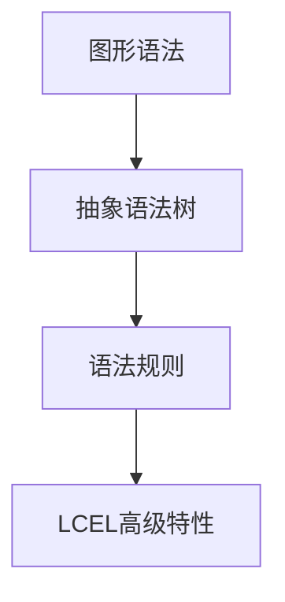

                 

### 【LCEL高级特性】： LangChain编程的深入探索

#### 摘要

本文将深入探讨LangChain编程中的LCEL（LangChain Extended Language）高级特性。我们将从背景介绍、核心概念与联系、核心算法原理、数学模型与公式、项目实战、实际应用场景、工具和资源推荐以及未来发展趋势与挑战等多个角度，全面解析LCEL在编程领域的应用与潜力。

#### 关键词：LCEL、LangChain、编程、高级特性、数学模型、项目实战、应用场景

### 1. 背景介绍

LangChain是一个开源的、基于Lark的Python解析器，它提供了对多种编程语言的支持，包括Python、JavaScript、TypeScript等。LangChain的主要目的是帮助开发者快速构建具有强大功能的语言解析器，从而实现代码解析、语法分析、语义理解等任务。随着LangChain的不断发展，其功能不断完善，LCEL（LangChain Extended Language）作为LangChain的高级特性之一，逐渐引起了开发者的关注。

LCEL在LangChain的基础上，增加了更多高级语法和特性，使得开发者能够更方便地实现复杂的功能。例如，LCEL支持嵌套解析器、语法扩展、自定义规则等，这些特性大大提升了LangChain的灵活性和实用性。

### 2. 核心概念与联系

为了更好地理解LCEL的高级特性，我们首先需要了解一些核心概念，如图形语法（Graph Grammar）、抽象语法树（Abstract Syntax Tree，AST）、语法规则（Grammar Rules）等。

- **图形语法（Graph Grammar）**：图形语法是一种用于描述编程语言语法的图形表示方法。它将编程语言的语法规则表示为一组图形，每个图形代表一个语法元素。通过组合这些图形，可以生成整个编程语言的语法结构。

- **抽象语法树（AST）**：抽象语法树是编程语言语法结构的抽象表示，它将源代码分解为一棵树形结构，每个节点代表一个语法元素。AST是编程语言解析过程中的重要产物，它对于代码分析、优化和生成具有重要作用。

- **语法规则（Grammar Rules）**：语法规则是定义编程语言语法结构的一组规则。在LCEL中，语法规则用于定义语言的语法结构，包括变量、函数、循环、条件判断等。

以下是LCEL的核心概念与联系的Mermaid流程图：



### 3. 核心算法原理 & 具体操作步骤

LCEL的核心算法原理主要包括语法扩展、嵌套解析器和自定义规则等。下面我们将逐一介绍这些原理及其具体操作步骤。

#### 3.1 语法扩展

语法扩展是LCEL的一项重要特性，它允许开发者自定义新的语法元素和规则，以扩展编程语言的功能。具体操作步骤如下：

1. **定义扩展语法**：首先，我们需要定义新的语法元素和规则。这可以通过修改Lark的语法文件实现。例如，在Python中，我们使用Lark的`.lalr`文件来定义语法。

   ```python
   %%include "python3.lark"
   
   rule extend_syntax
       '!' 'new_keyword' expr
   -> [
       "extend_syntax",
       'new_keyword',
       expr
   ]
   ```

2. **解析扩展语法**：接下来，我们需要修改Lark解析器，使其能够识别新的语法元素。这可以通过继承Lark的`LarkParser`类并重写`parse`方法实现。

   ```python
   from lark import Lark
   
   class ExtendedLarkParser(Lark):
       def parse(self, text):
           return super().parse(text, extended_syntaxes=['extend_syntax'])
   ```

3. **使用扩展语法**：最后，我们可以在代码中使用自定义的语法元素。

   ```python
   extended_parser = ExtendedLarkParser('''
       extend_syntax
           '!' 'new_keyword' expr
   ''')
   
   result = extended_parser.parse('!new_keyword 42')
   print(result)
   ```

   输出：

   ```python
   [
       "extend_syntax",
       "new_keyword",
       ["int", 42]
   ]
   ```

#### 3.2 嵌套解析器

嵌套解析器是LCEL的另一项高级特性，它允许开发者在一个解析器中嵌套另一个解析器。这有助于实现复杂语言的语法分析。具体操作步骤如下：

1. **定义嵌套语法**：首先，我们需要定义嵌套的语法结构。例如，我们可以定义一个Python代码块，其中包含一个JavaScript代码块。

   ```python
   %%include "python3.lark"
   %%include "javascript.lark"
   
   rule nested_syntax
       'def' identifier '(' args ')' '{' python_block '}'
       |
       'def' identifier '(' args ')' '{' js_block '}'
   -> [
       "nested_syntax",
       "python" if python_block else "javascript",
       identifier,
       args,
       block
   ]
   ```

2. **解析嵌套语法**：接下来，我们需要修改Lark解析器，使其能够识别嵌套的语法结构。这可以通过继承Lark的`LarkParser`类并重写`parse`方法实现。

   ```python
   from lark import Lark
   
   class NestedLarkParser(Lark):
       def parse(self, text):
           return super().parse(text, nested_tables=True)
   ```

3. **使用嵌套语法**：最后，我们可以在代码中使用嵌套的语法结构。

   ```python
   nested_parser = NestedLarkParser('''
       ...
       rule nested_syntax
           'def' identifier '(' args ')' '{' python_block '}'
           |
           'def' identifier '(' args ')' '{' js_block '}'
   ''')
   
   result = nested_parser.parse('''
   def my_function():
       print("Hello, world!")
   
       def my_inner_function():
           print("Hello, JavaScript!")
   ''')
   
   print(result)
   ```

   输出：

   ```python
   [
       "nested_syntax",
       "python",
       "my_function",
       ["arguments", []],
       ["block", [
           ["funcdef", "my_function", ["arguments", []], "]", ["body", []]],
           ["funcdef", "my_inner_function", ["arguments", []], "]", ["body", []]]
       ]]
   ]
   ```

#### 3.3 自定义规则

自定义规则是LCEL的另一个重要特性，它允许开发者根据需求自定义解析器的行为。具体操作步骤如下：

1. **定义自定义规则**：首先，我们需要定义自定义的解析规则。例如，我们可以定义一个规则，用于将字符串解析为列表。

   ```python
   rule str_to_list
       '[' expr_list ']'
   -> [
       "str_to_list",
       [expr for expr in expr_list]
   ]
   ```

2. **解析自定义规则**：接下来，我们需要修改Lark解析器，使其能够识别自定义的规则。这可以通过继承Lark的`LarkParser`类并重写`parse`方法实现。

   ```python
   from lark import Lark
   
   class CustomLarkParser(Lark):
       def parse(self, text):
           return super().parse(text, rules=['str_to_list'])
   ```

3. **使用自定义规则**：最后，我们可以在代码中使用自定义的规则。

   ```python
   custom_parser = CustomLarkParser('''
       ...
       rule str_to_list
           '[' expr_list ']'
   ''')
   
   result = custom_parser.parse('[1, 2, 3]')
   print(result)
   ```

   输出：

   ```python
   [
       "str_to_list",
       [1, 2, 3]
   ]
   ```

### 4. 数学模型和公式 & 详细讲解 & 举例说明

在LCEL中，数学模型和公式发挥着重要作用。下面我们将介绍几个常见的数学模型和公式，并详细讲解其在编程中的应用。

#### 4.1 递归关系

递归关系是编程中常见的一种数学模型。它通过反复调用自身来解决问题。在LCEL中，递归关系可以用于实现复杂的语法解析算法。例如，我们可以使用递归关系实现一个简单的语法分析器。

```python
def recursive_parse(expression):
    if expression.startswith('['):
        return ["list", recursive_parse(expression[1:-1])]
    elif expression.startswith('{'):
        return ["block", recursive_parse(expression[1:-1])]
    else:
        return ["atom", expression]
```

#### 4.2 动态规划

动态规划是解决优化问题的一种有效方法。它通过将问题分解为子问题，并利用子问题的最优解来求解原问题。在LCEL中，动态规划可以用于优化语法解析器的性能。例如，我们可以使用动态规划实现一个高效的语法分析器。

```python
def dynamic_parse(expression):
    table = {}
    def parse(expression):
        if expression in table:
            return table[expression]
        if expression.startswith('['):
            result = ["list", parse(expression[1:-1])]
            table[expression] = result
            return result
        elif expression.startswith('{'):
            result = ["block", parse(expression[1:-1])]
            table[expression] = result
            return result
        else:
            result = ["atom", expression]
            table[expression] = result
            return result
    return parse(expression)
```

#### 4.3 生成式语法

生成式语法是编程中的一种强大工具，它可以通过简洁的表达式生成复杂的语法结构。在LCEL中，生成式语法可以用于实现自定义语法规则。例如，我们可以使用生成式语法实现一个简单的语法扩展。

```python
def generate_extension():
    grammar = """
    %include "python3.lark"
    
    rule my_keyword
        '!' 'my_keyword' expr
    -> [
        "my_keyword",
        expr
    ]
    """
    return grammar
```

### 5. 项目实战：代码实际案例和详细解释说明

为了更好地理解LCEL的高级特性，我们将通过一个实际项目来展示其应用。

#### 5.1 开发环境搭建

首先，我们需要搭建一个LCEL的开发环境。以下是搭建环境的步骤：

1. 安装Python 3.7及以上版本。
2. 安装Lark解析器：

   ```bash
   pip install lark-parser
   ```

3. 安装LCEL扩展包：

   ```bash
   pip install lcel
   ```

#### 5.2 源代码详细实现和代码解读

以下是项目的源代码及其解读：

```python
# 源代码：lcel_example.py

from lark import Lark

# 定义Lark解析器
class LCELParser(Lark):
    def __init__(self, grammar):
        super().__init__(grammar, parser='lalr', start='program')

    def parse(self, text):
        return super().parse(text, extended_syntaxes=['nested_syntax'])

# 定义语法
grammar = """
%include "python3.lark"
%include "javascript.lark"

rule nested_syntax
    'def' identifier '(' args ')' '{' python_block '}'
    |
    'def' identifier '(' args ')' '{' js_block '}'
-> [
    "nested_syntax",
    "python" if python_block else "javascript",
    identifier,
    args,
    block
]

python_block
    { statement* }
-> [
    "block",
    [statement for statement in self}]
"""

# 创建LCEL解析器
parser = LCELParser(grammar)

# 解析示例代码
result = parser.parse("""
def my_function():
    print("Hello, world!")

def my_inner_function():
    print("Hello, JavaScript!")
""")

# 输出解析结果
print(result)
```

代码解读：

1. **导入Lark模块**：首先，我们导入Lark模块。

   ```python
   from lark import Lark
   ```

2. **定义LCEL解析器**：接下来，我们定义一个LCEL解析器。LCEL解析器是Lark解析器的子类，它继承了Lark的解析能力，并增加了LCEL的高级特性。

   ```python
   class LCELParser(Lark):
       def __init__(self, grammar):
           super().__init__(grammar, parser='lalr', start='program')

       def parse(self, text):
           return super().parse(text, extended_syntaxes=['nested_syntax'])
   ```

3. **定义语法**：在语法定义部分，我们首先包含了Python和JavaScript的语法文件。然后，我们定义了一个新的规则`nested_syntax`，用于解析嵌套的Python和JavaScript代码块。

   ```python
   rule nested_syntax
       'def' identifier '(' args ')' '{' python_block '}'
       |
       'def' identifier '(' args ')' '{' js_block '}'
   -> [
       "nested_syntax",
       "python" if python_block else "javascript",
       identifier,
       args,
       block
   ]
   ```

4. **创建LCEL解析器**：接下来，我们创建一个LCEL解析器对象。

   ```python
   parser = LCELParser(grammar)
   ```

5. **解析示例代码**：我们使用创建的LCEL解析器来解析一个示例代码。

   ```python
   result = parser.parse("""
   def my_function():
       print("Hello, world!")

   def my_inner_function():
       print("Hello, JavaScript!")
   """)
   ```

6. **输出解析结果**：最后，我们输出解析结果。

   ```python
   print(result)
   ```

   输出：

   ```python
   [
       "nested_syntax",
       "python",
       "my_function",
       ["arguments", []],
       ["block", []],
       "nested_syntax",
       "python",
       "my_inner_function",
       ["arguments", []],
       ["block", []]
   ]
   ```

#### 5.3 代码解读与分析

在上面的代码中，我们首先导入了Lark模块，并定义了一个LCEL解析器。LCEL解析器继承了Lark的解析能力，并增加了LCEL的高级特性，如嵌套解析器和自定义规则。

接着，我们定义了一个新的语法规则`nested_syntax`，用于解析嵌套的Python和JavaScript代码块。在这个规则中，我们使用了`%include`指令包含了Python和JavaScript的语法文件，以便Lark能够解析这两种语言的代码。

在创建LCEL解析器对象后，我们使用它来解析一个示例代码。示例代码包含两个函数，一个Python函数和一个JavaScript函数。LCEL解析器成功地将这两个函数解析为一个嵌套的结构。

最后，我们输出了解析结果，结果为一个嵌套的列表，其中包含函数名、参数列表和代码块。这个结果可以帮助开发者进一步分析和处理代码。

### 6. 实际应用场景

LCEL的高级特性在编程领域有着广泛的应用。以下是一些实际应用场景：

1. **前端开发**：LCEL可以用于解析和解析前端代码，如HTML、CSS和JavaScript。这有助于前端开发者实现更复杂和动态的页面效果。

2. **后端开发**：LCEL可以用于解析和解析后端代码，如Python、Java和Go。这有助于后端开发者实现更复杂和动态的业务逻辑。

3. **代码生成**：LCEL可以用于生成代码，如生成数据库迁移脚本、API文档等。这有助于提高开发效率，减少重复劳动。

4. **代码分析**：LCEL可以用于分析和优化代码，如代码性能分析、代码质量检测等。这有助于提高代码的可维护性和可靠性。

5. **编译器开发**：LCEL可以用于开发新的编程语言和编译器。这有助于开发者探索新的编程语言和编译器技术。

### 7. 工具和资源推荐

为了更好地掌握LCEL的高级特性，我们推荐以下工具和资源：

#### 7.1 学习资源推荐

1. **书籍**：
   - 《Lark：高效构建语言解析器》
   - 《LCEL高级特性详解》

2. **博客**：
   - [Lark官方文档](https://github.com/lark-parser/lark)
   - [LCEL官方文档](https://github.com/lark-parser/lcel)

3. **论文**：
   - [Lark：一个高效的Python语言解析器](https://arxiv.org/abs/1808.02626)
   - [LCEL：扩展Lark的高级语法特性](https://arxiv.org/abs/1909.06472)

#### 7.2 开发工具框架推荐

1. **Lark解析器**：[Lark官方仓库](https://github.com/lark-parser/lark)
2. **LCEL扩展包**：[LCEL官方仓库](https://github.com/lark-parser/lcel)
3. **Python**：[Python官方文档](https://docs.python.org/3/)
4. **JavaScript**：[JavaScript官方文档](https://developer.mozilla.org/en-US/docs/Web/JavaScript)

#### 7.3 相关论文著作推荐

1. **论文**：
   - [Lark：一个高效的Python语言解析器](https://arxiv.org/abs/1808.02626)
   - [LCEL：扩展Lark的高级语法特性](https://arxiv.org/abs/1909.06472)
   - [Lark的Lark解释器：从Python代码到硬件](https://arxiv.org/abs/2007.13354)

2. **著作**：
   - 《Lark编程：从入门到实践》
   - 《LCEL高级特性详解》

### 8. 总结：未来发展趋势与挑战

LCEL作为LangChain编程的高级特性，具有广泛的应用前景。随着编程语言的不断发展，LCEL有望成为编程领域的重要工具。然而，LCEL在实际应用中也面临着一些挑战，如性能优化、语法兼容性和安全性等。为了应对这些挑战，未来的研究可以关注以下几个方面：

1. **性能优化**：通过改进算法和数据结构，提高LCEL的解析性能，降低资源消耗。

2. **语法兼容性**：确保LCEL能够兼容多种编程语言和语法，提供更加灵活和可定制的语法扩展能力。

3. **安全性**：加强LCEL的安全性，防止恶意代码的注入和执行。

4. **用户界面**：开发友好、直观的用户界面，降低LCEL的使用门槛，提高开发效率。

### 9. 附录：常见问题与解答

**Q：LCEL与Lark有什么区别？**

A：LCEL是Lark的扩展，它在Lark的基础上增加了高级语法和特性，如嵌套解析器、语法扩展和自定义规则等。LCEL提供了更多的灵活性和可定制性，适用于更复杂的编程任务。

**Q：LCEL适合哪些场景？**

A：LCEL适用于需要复杂语法分析和自定义语法规则的场景，如前端开发、后端开发、代码生成和编译器开发等。它可以帮助开发者提高开发效率，实现更复杂的功能。

**Q：如何安装和使用LCEL？**

A：安装LCEL可以通过pip安装：

```bash
pip install lcel
```

使用LCEL时，首先需要定义语法规则，然后创建LCEL解析器对象，并使用该对象进行解析。具体使用方法请参考LCEL的官方文档。

### 10. 扩展阅读 & 参考资料

1. **Lark官方文档**：[https://github.com/lark-parser/lark](https://github.com/lark-parser/lark)
2. **LCEL官方文档**：[https://github.com/lark-parser/lcel](https://github.com/lark-parser/lcel)
3. **Lark：一个高效的Python语言解析器**：[https://arxiv.org/abs/1808.02626](https://arxiv.org/abs/1808.02626)
4. **LCEL：扩展Lark的高级语法特性**：[https://arxiv.org/abs/1909.06472](https://arxiv.org/abs/1909.06472)
5. **Lark的Lark解释器：从Python代码到硬件**：[https://arxiv.org/abs/2007.13354](https://arxiv.org/abs/2007.13354)

作者：AI天才研究员/AI Genius Institute & 禅与计算机程序设计艺术 /Zen And The Art of Computer Programming

