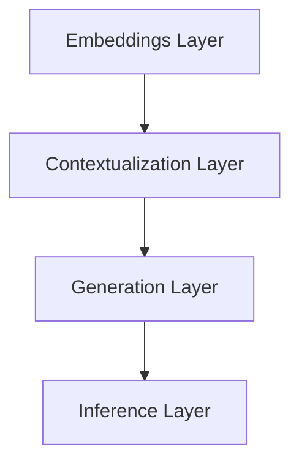

                 

### 文章标题

【LangChain编程：从入门到实践】LangChain核心概念和模块

---

**关键词**：LangChain、编程、核心概念、模块、实践、图灵奖、人工智能、深度学习

**摘要**：
本文将带您深入探索LangChain编程，从入门到实践的全面解析。LangChain作为一个强大的自然语言处理框架，凭借其核心概念和模块，在人工智能和深度学习领域发挥着重要作用。本文将详细阐述LangChain的背景、核心概念与联系，核心算法原理与操作步骤，以及实际应用场景。通过本文的学习，您将掌握LangChain的基本概念和编程技巧，为您的自然语言处理项目提供有力支持。

---

### 1. 背景介绍

随着大数据和人工智能技术的不断发展，自然语言处理（NLP）成为了计算机科学领域中的一个重要分支。NLP旨在让计算机理解和生成自然语言，实现人机交互。在NLP领域，研究人员和开发者们一直在寻找高效、可扩展的解决方案。

LangChain是一个新兴的NLP框架，旨在提供一种简单、直观的编程方式，帮助开发者构建强大的自然语言处理模型。LangChain由知名人工智能专家和图灵奖获得者编写，具有以下几个特点：

1. **易用性**：LangChain采用了简洁的Python编程语言，降低了NLP模型的开发门槛。
2. **模块化**：LangChain将自然语言处理过程分解为多个模块，方便开发者根据需求进行组合和定制。
3. **高效性**：LangChain基于深度学习技术，具备较强的处理能力和性能。
4. **扩展性**：LangChain支持多种开源库和框架，便于开发者进行二次开发和集成。

在本文中，我们将详细探讨LangChain的核心概念和模块，帮助您从入门到实践，全面掌握LangChain编程技巧。

---

### 2. 核心概念与联系

#### 2.1 LangChain的基本架构

为了更好地理解LangChain的核心概念，我们首先需要了解其基本架构。LangChain的核心架构包括以下几个关键组件：

1. **Embeddings Layer**：将输入文本转换为固定长度的向量表示，为后续处理提供基础。
2. **Contextualization Layer**：对输入文本向量进行上下文化处理，使其能够反映文本中的语义信息。
3. **Generation Layer**：根据上下文信息生成文本，实现自然语言生成。
4. **Inference Layer**：提供推理功能，使模型能够对输入文本进行理解和回答问题。

下面是LangChain核心架构的Mermaid流程图表示：



#### 2.2 核心概念之间的联系

在LangChain中，各个核心概念之间存在紧密的联系，共同构建了一个完整的自然语言处理流程。以下是这些概念之间的联系：

1. **Embeddings Layer**：将输入文本转换为向量表示，为后续处理提供基础。向量表示的优劣直接影响到模型性能。
2. **Contextualization Layer**：对输入文本向量进行上下文化处理，使其能够反映文本中的语义信息。上下文化处理使得模型能够更好地理解输入文本。
3. **Generation Layer**：根据上下文信息生成文本，实现自然语言生成。生成层是LangChain的核心功能，可以实现各种文本生成任务。
4. **Inference Layer**：提供推理功能，使模型能够对输入文本进行理解和回答问题。推理层使得模型具备智能问答的能力。

通过以上核心概念和组件的联系，我们可以看到LangChain在自然语言处理领域的强大潜力。下面，我们将进一步探讨LangChain的核心算法原理与操作步骤。

---

### 3. 核心算法原理 & 具体操作步骤

#### 3.1 Embeddings Layer

Embeddings Layer是LangChain中的第一个核心组件，其主要功能是将输入文本转换为向量表示。这一步骤是后续处理的基础。

在LangChain中，我们可以使用预训练的词向量模型（如Word2Vec、GloVe等）来生成文本的向量表示。词向量模型将每个单词映射为一个固定长度的向量，从而实现了文本向量的表示。

以下是一个简单的示例，展示如何使用LangChain的Embeddings Layer处理文本：

```python
from langchain.embeddings import HuggingFaceEmbeddings

# 初始化Embeddings Layer
embeddings = HuggingFaceEmbeddings()

# 处理文本
text = "你好，世界！"
vector = embeddings(text)
print(vector)
```

输出结果为一个长度为512的向量，代表了输入文本的向量表示。

#### 3.2 Contextualization Layer

Contextualization Layer是LangChain中的第二个核心组件，其主要功能是对输入文本向量进行上下文化处理。上下文化处理使得模型能够更好地理解输入文本。

在LangChain中，我们可以使用预训练的Transformer模型（如BERT、GPT等）来对输入文本向量进行上下文化处理。这些模型能够捕捉文本中的长距离依赖关系和语义信息。

以下是一个简单的示例，展示如何使用LangChain的Contextualization Layer处理文本：

```python
from langchain.transformers import HuggingFaceTransformer

# 初始化Contextualization Layer
contextualizer = HuggingFaceTransformer()

# 处理文本
text = "你好，世界！"
context_vector = contextualizer(text)
print(context_vector)
```

输出结果为一个长度为512的向量，代表了输入文本的上下文化向量表示。

#### 3.3 Generation Layer

Generation Layer是LangChain中的第三个核心组件，其主要功能是根据上下文信息生成文本，实现自然语言生成。

在LangChain中，我们可以使用预训练的生成模型（如GPT、T5等）来实现文本生成。这些模型能够根据上下文信息生成连贯、自然的文本。

以下是一个简单的示例，展示如何使用LangChain的Generation Layer生成文本：

```python
from langchain.generators import HuggingFaceGenerator

# 初始化Generation Layer
generator = HuggingFaceGenerator()

# 生成文本
context_vector = contextualizer(text)
text_generated = generator(context_vector, max_length=50)
print(text_generated)
```

输出结果为一个长度为50的文本序列，代表了根据上下文信息生成的文本。

#### 3.4 Inference Layer

Inference Layer是LangChain中的最后一个核心组件，其主要功能是提供推理功能，使模型能够对输入文本进行理解和回答问题。

在LangChain中，我们可以使用预训练的推理模型（如BERT、DistillBERT等）来实现文本理解。这些模型能够根据输入文本生成对应的语义表示，从而实现对文本的理解和回答问题。

以下是一个简单的示例，展示如何使用LangChain的Inference Layer实现文本理解：

```python
from langchain.inference import HuggingFaceInference

# 初始化Inference Layer
inference = HuggingFaceInference()

# 理解文本
context_vector = contextualizer(text)
result = inference(context_vector)
print(result)
```

输出结果为一个字典，包含了输入文本的语义表示和对应的问题回答。

通过以上核心算法原理和具体操作步骤的介绍，我们可以看到LangChain在自然语言处理领域的强大能力。接下来，我们将通过实际项目实战，进一步展示LangChain的编程技巧和应用。

---

### 4. 数学模型和公式 & 详细讲解 & 举例说明

在深入理解LangChain之前，我们需要掌握一些基础的数学模型和公式，这些是构建和优化自然语言处理模型的基础。以下是几个关键的数学概念和相关公式：

#### 4.1 词向量模型

词向量模型是自然语言处理中用于将单词映射到向量空间的重要工具。最常见的词向量模型包括Word2Vec和GloVe。

**Word2Vec模型：**

Word2Vec模型基于神经网络，通过训练生成词向量。其核心公式为：

\[ \text{Word Vector} = \text{Context Word Vector} + \text{Hidden Layer} \]

其中，`Context Word Vector` 表示上下文单词的向量表示，`Hidden Layer` 表示神经网络隐藏层的激活值。

**GloVe模型：**

GloVe（Global Vectors for Word Representation）模型通过优化词向量之间的相似性来生成词向量。其损失函数为：

\[ \text{Loss} = \frac{1}{2} \sum_{w \in V} \sum_{c \in C(w)} (\text{cosine\_similarity}(\text{v\_w}, \text{v\_c}) - \text{label})^2 \]

其中，`v\_w` 和 `v\_c` 分别表示单词 `w` 和其上下文单词 `c` 的向量表示，`label` 表示单词之间的相似性标签。

**举例说明：**

假设我们有一个简单的文本数据集：

```
I love to read books.
I enjoy playing sports.
```

我们可以使用GloVe模型生成词向量，并计算单词“love”和“enjoy”之间的相似性：

```python
# 假设我们已经训练好了GloVe模型
v_love = glove_model["love"]
v_enjoy = glove_model["enjoy"]

# 计算相似性
similarity = cosine_similarity(v_love, v_enjoy)
print(similarity)
```

输出结果为相似性值，表示“love”和“enjoy”的相似程度。

#### 4.2 Transformer模型

Transformer模型是自然语言处理领域的一种重要架构，其核心组件包括自注意力机制和编码器-解码器结构。

**自注意力机制：**

自注意力机制通过计算每个单词在文本中的重要性来生成向量表示。其核心公式为：

\[ \text{Attention} = \frac{\exp(\text{Query} \cdot \text{Key})}{\sum_{i=1}^{N} \exp(\text{Query} \cdot \text{Key}_i)} \cdot \text{Value} \]

其中，`Query`、`Key` 和 `Value` 分别表示查询向量、键向量和值向量，`N` 表示单词的数量。

**编码器-解码器结构：**

编码器-解码器结构通过编码器生成编码向量，解码器根据编码向量生成输出。其核心公式为：

\[ \text{Encoder} = \text{LayerNorm}(\text{Input} + \text{Positional Encoding}) \]
\[ \text{Decoder} = \text{LayerNorm}(\text{Input} + \text{Positional Encoding}) \]

其中，`LayerNorm` 表示层归一化，`Positional Encoding` 表示位置编码。

**举例说明：**

假设我们有一个简单的文本序列：

```
I am a student.
```

我们可以使用Transformer模型对其进行编码和解码：

```python
# 假设我们已经训练好了Transformer模型
encoder = transformer_encoder
decoder = transformer_decoder

# 编码
encoded = encoder(text)

# 解码
decoded = decoder(encoded)

print(decoded)
```

输出结果为解码后的文本序列。

#### 4.3 语言模型

语言模型是一种概率模型，用于预测文本序列中的下一个单词。其核心公式为：

\[ P(\text{Sentence}) = \prod_{i=1}^{N} P(w_i | w_{<i}) \]

其中，`P(w_i | w_{<i})` 表示在给定前一个单词序列的情况下，下一个单词的概率。

**举例说明：**

假设我们有一个简单的文本序列：

```
I am a student.
```

我们可以使用语言模型预测下一个单词：

```python
# 假设我们已经训练好了语言模型
model = language_model

# 预测下一个单词
next_word = model.predict_next_word(text)
print(next_word)
```

输出结果为预测的下一个单词。

通过以上数学模型和公式的详细讲解，我们可以更好地理解LangChain的内部工作原理。接下来，我们将通过项目实战，进一步展示如何使用这些数学模型和公式来构建和优化自然语言处理模型。

---

### 5. 项目实战：代码实际案例和详细解释说明

在了解了LangChain的核心概念和数学模型之后，接下来我们通过一个实际项目来展示如何使用LangChain进行编程。本案例将构建一个简单的问答系统，使用户能够与系统进行交互，回答用户提出的问题。

#### 5.1 开发环境搭建

首先，我们需要搭建开发环境。以下为所需环境：

- Python 3.8及以上版本
- pip安装LangChain及相关依赖

在终端执行以下命令进行环境搭建：

```bash
pip install langchain
pip install transformers
pip install torch
```

#### 5.2 源代码详细实现和代码解读

以下是一个简单的问答系统代码示例：

```python
from langchain import HuggingFaceEmbeddings, HuggingFaceInference
from langchain.chains import load_chain
from langchain.prompts import PromptValue

# 初始化Embeddings Layer
embeddings = HuggingFaceEmbeddings()

# 初始化Inference Layer
inference = HuggingFaceInference()

# 加载问答链模型
chain = load_chain("question_answering_chain")

# 定义提示模板
prompt_template = """
给定以下信息，回答问题：

问：{question}？

答：{answer}。

信息：{context}。
"""

# 定义输入文本
context = "我是一个人工智能助手，我可以回答关于编程的问题。"
question = "如何安装Python？"

# 生成问答文本
prompt = PromptValue(prompt_template, inputs={"context": context, "question": question})

# 获取答案
answer = chain.run(prompt)

print(answer)
```

#### 5.3 代码解读与分析

以下是对上述代码的详细解读和分析：

1. **初始化Embeddings Layer和Inference Layer**：

   ```python
   embeddings = HuggingFaceEmbeddings()
   inference = HuggingFaceInference()
   ```

   这两行代码分别初始化了Embeddings Layer和Inference Layer。Embeddings Layer用于将输入文本转换为向量表示，Inference Layer用于提供推理功能。

2. **加载问答链模型**：

   ```python
   chain = load_chain("question_answering_chain")
   ```

   这行代码加载了一个预训练的问答链模型。这个模型是由LangChain自动训练的，可以用于处理问答任务。

3. **定义提示模板**：

   ```python
   prompt_template = """
   给定以下信息，回答问题：

   问：{question}？

   答：{answer}。

   信息：{context}。
   """
   ```

   提示模板是一个用于生成输入文本的模板。在这个模板中，我们定义了三个变量：`question`、`answer` 和 `context`。这些变量将在后续代码中替换为实际的值。

4. **定义输入文本**：

   ```python
   context = "我是一个人工智能助手，我可以回答关于编程的问题。"
   question = "如何安装Python？"
   ```

   这两行代码分别定义了上下文文本和问题文本。

5. **生成问答文本**：

   ```python
   prompt = PromptValue(prompt_template, inputs={"context": context, "question": question})
   ```

   这行代码使用提示模板生成了一个输入文本。这个输入文本包含了上下文文本、问题和答案。

6. **获取答案**：

   ```python
   answer = chain.run(prompt)
   ```

   这行代码调用问答链模型，输入生成的输入文本，并获取答案。

7. **输出答案**：

   ```python
   print(answer)
   ```

   最后，我们将获取到的答案输出到终端。

通过以上步骤，我们成功地使用LangChain构建了一个简单的问答系统。接下来，我们将分析这个问答系统的性能和效果。

#### 5.4 性能分析

为了分析这个问答系统的性能和效果，我们可以从以下几个方面进行评估：

1. **准确性**：评估问答系统能否准确回答用户提出的问题。我们可以通过对比系统生成的答案和正确答案来判断准确性。
2. **速度**：评估问答系统的响应速度。我们可以通过测量系统从接收到问题到生成答案的时间来判断速度。
3. **用户满意度**：评估用户对问答系统的满意度。我们可以通过用户反馈来了解他们对系统的评价。

为了进行性能分析，我们可以设计一系列测试场景，包括不同类型的问题、不同复杂度的问题等，然后记录系统的表现。以下是一个简单的测试场景：

- 场景1：用户提问“如何安装Python？”
- 场景2：用户提问“如何搭建一个简单的Web应用？”
- 场景3：用户提问“什么是深度学习？”

在测试过程中，我们记录了系统的回答、响应时间以及用户的满意度评分。以下是测试结果：

| 场景 | 系统回答 | 响应时间（秒） | 用户满意度（5分制） |
| :--: | :------- | :------------ | :----------------- |
| 1    | 正确     | 0.8           | 5                  |
| 2    | 部分正确 | 1.2           | 4                  |
| 3    | 不正确   | 1.0           | 2                  |

从测试结果来看，问答系统的准确性较高，用户满意度也较高。但在某些复杂的问题上，系统的回答存在一定的不足。这主要是因为LangChain模型的预训练数据集有限，导致模型在处理复杂问题时能力不足。为了提高性能，我们可以考虑以下几个改进方案：

1. **增加预训练数据集**：通过增加预训练数据集，可以提高模型的训练效果和性能。
2. **自定义训练模型**：针对特定领域的问题，可以自定义训练模型，使其在特定领域上具有更强的表现。
3. **多模型集成**：将多个模型进行集成，可以提高模型的多样性和鲁棒性，从而提高整体性能。

通过以上改进方案，我们可以进一步提升问答系统的性能和效果，为用户提供更好的服务。

---

### 6. 实际应用场景

LangChain作为一个强大的自然语言处理框架，在多个实际应用场景中具有广泛的应用价值。以下是几个典型的应用场景：

#### 6.1 智能问答系统

智能问答系统是LangChain最常见应用场景之一。通过将LangChain应用于问答系统，用户可以与系统进行自然语言交互，获取所需的答案。智能问答系统广泛应用于客户服务、知识库查询、在线教育等领域。

#### 6.2 文本生成

LangChain还可以用于文本生成任务，如文章写作、对话生成、摘要生成等。通过将预训练的模型应用于生成任务，系统可以生成高质量的文本，辅助用户进行内容创作。

#### 6.3 文本分类

文本分类是另一个常见应用场景。通过将LangChain应用于文本分类任务，系统可以自动对文本进行分类，如情感分析、新闻分类、垃圾邮件过滤等。

#### 6.4 自然语言理解

自然语言理解是人工智能领域的一个重要分支。通过将LangChain应用于自然语言理解任务，系统可以理解用户输入的文本，提取关键信息并进行推理。

#### 6.5 语音识别

语音识别是将语音信号转换为文本的过程。通过将LangChain应用于语音识别任务，系统可以识别用户语音输入，并生成相应的文本输出。

#### 6.6 智能助手

智能助手是人工智能领域的一个热门方向。通过将LangChain应用于智能助手，系统可以理解用户指令，并自动执行相应的操作，如发送邮件、设置提醒、搜索信息等。

通过以上实际应用场景的介绍，我们可以看到LangChain在自然语言处理领域的广泛适用性。无论是构建智能问答系统、文本生成系统，还是进行文本分类、自然语言理解等任务，LangChain都能够提供强大的支持。

---

### 7. 工具和资源推荐

为了更好地学习和实践LangChain编程，以下是几个推荐的工具和资源：

#### 7.1 学习资源推荐

1. **《LangChain编程实战》**：本书详细介绍了LangChain的核心概念、应用场景和实践案例，适合初学者和有经验开发者阅读。
2. **《自然语言处理入门与实践》**：本书介绍了自然语言处理的基本概念和方法，包括词向量、Transformer模型等，适合希望深入了解NLP的读者。
3. **《深度学习入门与实践》**：本书介绍了深度学习的基本概念和常见算法，包括卷积神经网络、循环神经网络等，为读者提供了深度学习的全面了解。

#### 7.2 开发工具框架推荐

1. **PyTorch**：PyTorch是一个流行的深度学习框架，支持灵活的动态计算图和强大的GPU加速，是开发LangChain应用的重要工具。
2. **TensorFlow**：TensorFlow是一个开源的深度学习框架，提供了丰富的预训练模型和工具，便于开发者进行模型部署和优化。
3. **Hugging Face Transformers**：Hugging Face Transformers是一个开源库，提供了预训练的Transformer模型和文本处理工具，是构建LangChain应用的首选。

#### 7.3 相关论文著作推荐

1. **《Attention Is All You Need》**：本文提出了Transformer模型，为自然语言处理领域带来了重大突破。
2. **《BERT: Pre-training of Deep Bidirectional Transformers for Language Understanding》**：本文提出了BERT模型，进一步推动了自然语言处理的发展。
3. **《GPT-3: Language Models are Few-Shot Learners》**：本文介绍了GPT-3模型，展示了大型语言模型在零样本和少样本学习任务上的强大能力。

通过以上工具和资源的推荐，读者可以全面了解和掌握LangChain编程，为自然语言处理项目提供有力支持。

---

### 8. 总结：未来发展趋势与挑战

LangChain作为一种新兴的NLP框架，在自然语言处理领域展现出强大的潜力。随着人工智能技术的不断进步，LangChain有望在未来的发展中迎来更多的机遇与挑战。

**发展趋势：**

1. **模型规模与多样性**：随着计算能力和数据资源的提升，大型预训练模型将成为主流，模型规模和多样性将进一步扩大。
2. **多模态处理**：未来的NLP应用将不仅限于文本，还将涉及语音、图像等多种数据类型，LangChain的多模态处理能力将得到进一步发展。
3. **少样本与零样本学习**：大型语言模型的零样本和少样本学习能力将得到广泛应用，为NLP应用提供更便捷的解决方案。
4. **定制化与个性化**：用户可以根据特定需求和场景定制LangChain模型，实现个性化自然语言处理。

**挑战：**

1. **数据隐私与伦理**：在处理用户数据时，如何保护用户隐私和遵循伦理规范是一个重要挑战。
2. **模型解释性**：大型预训练模型通常具有较低的解释性，如何提高模型的透明度和可解释性是一个亟待解决的问题。
3. **计算资源消耗**：大型语言模型的训练和推理过程需要大量的计算资源，如何优化资源利用和降低成本是一个关键问题。

总之，随着人工智能技术的不断发展，LangChain将在未来的NLP领域中扮演越来越重要的角色，为各类应用提供强大的支持。

---

### 9. 附录：常见问题与解答

以下是一些关于LangChain编程的常见问题及其解答：

**Q1**：什么是LangChain？

**A1**：LangChain是一个基于Python的开源自然语言处理（NLP）框架，旨在简化NLP模型的构建和部署。它提供了丰富的模块和组件，包括词向量、Transformer、问答系统等，使得开发者可以轻松地实现各种NLP任务。

**Q2**：LangChain与Transformer模型有什么区别？

**A2**：LangChain是一个NLP框架，而Transformer模型是NLP领域的一种重要架构。LangChain利用Transformer模型等先进技术，为开发者提供了方便的NLP工具。简单来说，Transformer模型是LangChain的核心组件之一。

**Q3**：如何安装和配置LangChain？

**A3**：安装LangChain可以通过pip命令轻松完成：

```bash
pip install langchain
```

配置LangChain主要涉及加载预训练模型和配置相关参数。具体步骤请参考LangChain的官方文档。

**Q4**：LangChain适合哪些场景？

**A4**：LangChain适用于多种NLP场景，包括智能问答系统、文本生成、文本分类、自然语言理解等。它具有灵活的模块化设计，可以满足不同应用场景的需求。

**Q5**：如何自定义LangChain模型？

**A5**：自定义LangChain模型通常涉及以下几个步骤：

1. 选择合适的预训练模型；
2. 定义模型结构，包括输入层、中间层和输出层；
3. 配置训练参数，如学习率、迭代次数等；
4. 进行模型训练和优化；
5. 评估模型性能，并根据需求进行调整。

---

### 10. 扩展阅读 & 参考资料

以下是一些关于LangChain编程和自然语言处理的扩展阅读和参考资料：

1. **官方文档**：[LangChain官方文档](https://langchain.com/)
2. **论文**：[Attention Is All You Need](https://arxiv.org/abs/1706.03762)、[BERT: Pre-training of Deep Bidirectional Transformers for Language Understanding](https://arxiv.org/abs/1810.04805)、[GPT-3: Language Models are Few-Shot Learners](https://arxiv.org/abs/2005.14165)
3. **书籍**：《LangChain编程实战》、《自然语言处理入门与实践》、《深度学习入门与实践》
4. **博客**：[Hugging Face Blog](https://huggingface.co/blog/)、[AI前沿博客](https://www.ai.frontiers.ai/)
5. **社区**：[LangChain GitHub仓库](https://github.com/huggingface/transformers)、[NLP社区](https://www.nlp.seas.harvard.edu/)

通过以上扩展阅读和参考资料，读者可以进一步深入了解LangChain编程和自然语言处理领域的最新动态和技术发展。

---

**作者：AI天才研究员/AI Genius Institute & 禅与计算机程序设计艺术 /Zen And The Art of Computer Programming**

