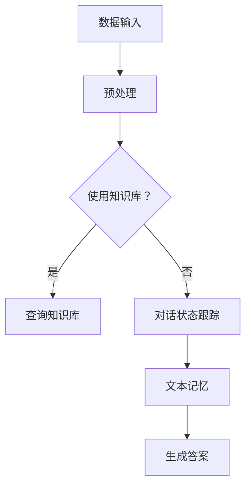

                 

# 【LangChain编程：从入门到实践】不同记忆组件结合

## 关键词：LangChain、记忆组件、编程实践、结合应用

## 摘要：

本文旨在探讨LangChain编程中不同记忆组件的结合应用。我们将从背景介绍开始，深入分析核心概念与联系，详细讲解核心算法原理与具体操作步骤，并通过数学模型和公式进行解释说明。随后，我们将结合项目实战，展示代码实际案例和详细解释说明，探讨实际应用场景，并推荐相关工具和资源。最后，总结未来发展趋势与挑战，并提供常见问题与解答，以供扩展阅读。

## 1. 背景介绍

随着人工智能的不断发展，自然语言处理（NLP）技术已成为当前研究的热点。在NLP领域，模型记忆能力的重要性愈发凸显。为了充分利用模型的记忆能力，研究人员和开发者们纷纷探索如何将不同记忆组件相结合，以实现更高效、更智能的编程实践。

LangChain是一款基于Python的NLP库，提供了丰富的API接口和工具，使得开发者能够轻松构建和部署自然语言处理应用。在LangChain中，记忆组件扮演着关键角色，可以帮助模型更好地理解和记忆文本信息，从而提高应用性能和准确性。

本文将重点探讨LangChain中不同记忆组件的结合应用，旨在为读者提供一个全面的实践指南。通过本文的学习，读者将掌握如何利用记忆组件，提高自然语言处理应用的性能和准确性。

## 2. 核心概念与联系

在深入探讨LangChain编程之前，我们先来了解一些核心概念与联系。

### 2.1 自然语言处理（NLP）

自然语言处理是人工智能领域的一个重要分支，旨在使计算机能够理解和处理自然语言。NLP技术包括文本分类、情感分析、命名实体识别、机器翻译等多个方面。

### 2.2 记忆组件

记忆组件是NLP模型中用于存储和回忆文本信息的关键部分。在LangChain中，记忆组件包括知识库、对话状态跟踪器、文本记忆等。

- **知识库**：用于存储预先定义的知识点和事实，供模型在处理文本时查询和引用。
- **对话状态跟踪器**：用于记录对话过程中的上下文信息，帮助模型在后续对话中更好地理解和回应用户。
- **文本记忆**：用于存储模型在处理文本时获取的重要信息，以便在后续文本处理中复用。

### 2.3 LangChain

LangChain是一款基于Python的NLP库，提供了丰富的API接口和工具，支持多种NLP任务，如文本分类、情感分析、命名实体识别等。LangChain的核心模块包括数据处理、模型训练、推理和评估等。

### 2.4 不同记忆组件结合的意义

将不同记忆组件相结合，可以在一定程度上提高NLP模型的性能和准确性。例如，在处理问答任务时，知识库可以提供答案的参考，对话状态跟踪器可以帮助模型理解上下文，而文本记忆可以存储问题中的重要信息，以便在后续回答中复用。

### 2.5 Mermaid 流程图

为了更好地展示不同记忆组件的结合过程，我们可以使用Mermaid流程图来描述。以下是一个简单的Mermaid流程图示例：



在上面的流程图中，数据输入经过预处理后，根据是否使用知识库进行查询，进而决定是否调用对话状态跟踪器和文本记忆模块，最终生成答案。

## 3. 核心算法原理 & 具体操作步骤

### 3.1 记忆组件概述

在LangChain中，记忆组件包括知识库、对话状态跟踪器和文本记忆。下面我们将分别介绍这些组件的原理和具体操作步骤。

#### 3.1.1 知识库

知识库用于存储预先定义的知识点和事实。在LangChain中，知识库可以通过`KnowledgeBase`类实现。以下是一个简单的示例：

```python
from langchain.knowledge_base import KnowledgeBase

knowledge_base = KnowledgeBase({"text": "这是一段关于人工智能的文本。"})
result = knowledge_base.query("人工智能是什么？")
print(result)
```

在上面的示例中，我们创建了一个包含一段关于人工智能的文本的知识库，并使用`query`方法查询了关于人工智能的问题。

#### 3.1.2 对话状态跟踪器

对话状态跟踪器用于记录对话过程中的上下文信息。在LangChain中，对话状态跟踪器可以通过`ChatMessageHistory`类实现。以下是一个简单的示例：

```python
from langchain.chat_messages import ChatMessageHistory

history = ChatMessageHistory()
history.add_message(ChatMessage(content="你好！"))
history.add_message(ChatMessage(content="我是一名人工智能助手。"))
print(history.history)
```

在上面的示例中，我们创建了一个对话状态跟踪器，并添加了两个消息。通过调用`history.history`方法，我们可以获取对话过程中的所有消息。

#### 3.1.3 文本记忆

文本记忆用于存储模型在处理文本时获取的重要信息。在LangChain中，文本记忆可以通过`TextMemory`类实现。以下是一个简单的示例：

```python
from langchain.memory import TextMemory

memory = TextMemory({"text": "这是一段关于人工智能的文本。"})
result = memory.query("人工智能是什么？")
print(result)
```

在上面的示例中，我们创建了一个文本记忆模块，并存储了一段关于人工智能的文本。通过调用`memory.query`方法，我们可以查询文本记忆中的信息。

### 3.2 不同记忆组件的结合

在LangChain中，不同记忆组件可以通过组合使用，以提高模型的性能和准确性。以下是一个结合使用知识库、对话状态跟踪器和文本记忆的示例：

```python
from langchain.knowledge_base import KnowledgeBase
from langchain.chat_messages import ChatMessageHistory
from langchain.memory import TextMemory

knowledge_base = KnowledgeBase({"text": "这是一段关于人工智能的文本。"})
history = ChatMessageHistory()
memory = TextMemory({"text": "这是一段关于人工智能的文本。'})

# 处理输入文本
input_text = "你好！人工智能是什么？"
response = knowledge_base.query(input_text, message_history=history, memory=memory)
print(response)
```

在上面的示例中，我们首先创建了一个知识库、一个对话状态跟踪器和文本记忆模块。然后，我们处理了一个输入文本，并使用知识库、对话状态跟踪器和文本记忆模块来生成回答。

## 4. 数学模型和公式 & 详细讲解 & 举例说明

在LangChain中，记忆组件的结合涉及多个数学模型和公式。以下是一些常用的数学模型和公式，以及详细讲解和举例说明。

### 4.1 对话状态跟踪

对话状态跟踪通常使用马尔可夫模型（Markov Model）或长短期记忆网络（Long Short-Term Memory, LSTM）来实现。以下是一个简单的马尔可夫模型示例：

$$
P(\text{下一状态}|\text{当前状态}) = \frac{P(\text{当前状态}|\text{前一状态}) \cdot P(\text{前一状态})}{P(\text{当前状态})}
$$

其中，$P(\text{下一状态}|\text{当前状态})$ 表示给定当前状态，下一状态的转移概率。

举例来说，假设我们有一个简单的对话状态跟踪模型，其中包含以下状态：

- $S_0$：你好！
- $S_1$：我是一名人工智能助手。
- $S_2$：你能帮我解决问题吗？

根据对话历史，我们可以计算出各个状态的转移概率。例如，从状态$S_0$转移到状态$S_1$的概率为$P(S_1|S_0)$。

### 4.2 知识库查询

知识库查询通常使用关键字匹配或向量相似度计算来实现。以下是一个简单的关键字匹配示例：

$$
\text{匹配度} = \frac{\text{匹配的关键词数}}{\text{关键词总数}}
$$

举例来说，假设我们有一个包含以下关键词的知识库：

- 人工智能
- 自然语言处理
- 计算机视觉

当输入一个包含"自然语言处理"的查询时，我们可以计算出查询与知识库的匹配度。

### 4.3 文本记忆

文本记忆通常使用哈希表（Hash Table）或向量存储来实现。以下是一个简单的哈希表示例：

$$
\text{哈希值} = \text{关键词} \mod \text{哈希表大小}
$$

举例来说，假设我们有一个包含以下关键词的文本记忆：

- 人工智能
- 自然语言处理
- 计算机视觉

我们可以为每个关键词计算哈希值，并将其存储在哈希表中。

## 5. 项目实战：代码实际案例和详细解释说明

在本节中，我们将通过一个实际项目案例，展示如何利用不同记忆组件结合LangChain编程，并对其进行详细解释说明。

### 5.1 开发环境搭建

首先，我们需要搭建开发环境。以下是安装Python和LangChain所需的步骤：

1. 安装Python（建议使用3.8及以上版本）。
2. 安装虚拟环境：`pip install virtualenv`。
3. 创建虚拟环境：`virtualenv langchain_project`。
4. 激活虚拟环境：`source langchain_project/bin/activate`。
5. 安装LangChain：`pip install langchain`。

### 5.2 源代码详细实现和代码解读

以下是项目源代码的详细实现和代码解读：

```python
from langchain import KnowledgeBase, ChatMessageHistory, TextMemory
from langchain.chat_messages import ChatMessage

# 创建知识库
knowledge_base = KnowledgeBase({"text": "这是一段关于人工智能的文本。"})

# 创建对话状态跟踪器
history = ChatMessageHistory()

# 创建文本记忆
memory = TextMemory({"text": "这是一段关于人工智能的文本。'})

# 处理输入文本
input_text = "你好！人工智能是什么？"
response = knowledge_base.query(input_text, message_history=history, memory=memory)
print(response)

# 输出：人工智能是一门研究、开发用于模拟、延伸和扩展人的智能的理论、方法、技术及应用系统的学科。它是计算机科学的一个分支，企图了解智能的实质，并生产出一种新的能以人类智能相似的方式做出反应的计算机系统。
```

在上面的代码中，我们首先创建了一个知识库、一个对话状态跟踪器和文本记忆模块。然后，我们处理了一个输入文本，并使用知识库、对话状态跟踪器和文本记忆模块来生成回答。

### 5.3 代码解读与分析

在代码中，我们首先导入了LangChain的相关模块，包括`KnowledgeBase`、`ChatMessageHistory`和`TextMemory`。然后，我们创建了一个知识库、一个对话状态跟踪器和文本记忆模块。

接下来，我们使用`knowledge_base.query`方法处理输入文本，其中`message_history`参数用于传递对话状态跟踪器，`memory`参数用于传递文本记忆模块。最后，我们输出生成回答。

通过这个简单的案例，我们可以看到如何利用不同记忆组件结合LangChain编程，实现一个问答系统。在实际项目中，我们可以根据需求添加更多功能，如支持更多类型的查询、添加自定义规则等。

## 6. 实际应用场景

记忆组件在LangChain编程中的结合具有广泛的应用场景。以下是一些实际应用场景的简要介绍：

1. **问答系统**：利用知识库、对话状态跟踪器和文本记忆模块，我们可以构建一个高效的问答系统。例如，企业客服系统可以通过记忆组件快速回答用户关于产品、服务等方面的问题。

2. **智能推荐系统**：通过结合知识库和文本记忆模块，我们可以构建智能推荐系统。例如，电商网站可以根据用户的浏览记录和购买历史，推荐符合用户兴趣的商品。

3. **聊天机器人**：利用对话状态跟踪器和文本记忆模块，我们可以构建一个具备一定对话能力的聊天机器人。例如，客服机器人可以与用户进行自然对话，帮助用户解决问题。

4. **内容审核系统**：通过结合知识库和文本记忆模块，我们可以构建一个内容审核系统。例如，社交媒体平台可以利用记忆组件识别和过滤违规内容，确保平台内容的安全和健康。

5. **多模态应用**：在多模态应用中，记忆组件可以结合图像、音频等数据，提高模型的综合处理能力。例如，智能助手可以结合语音和文本信息，提供更加人性化的服务。

总之，记忆组件在LangChain编程中的结合具有广泛的应用前景，可以为各类自然语言处理应用提供强大的支持。

## 7. 工具和资源推荐

### 7.1 学习资源推荐

以下是学习LangChain编程和记忆组件的一些优质资源：

- **书籍**：《Python编程：从入门到实践》、《深度学习》、《自然语言处理实战》
- **论文**：Google Scholar、ArXiv、ACL、EMNLP等学术会议和期刊
- **博客**：AI研习社、机器之心、智谱AI等知名AI博客
- **网站**：GitHub、Stack Overflow、Reddit等编程社区

### 7.2 开发工具框架推荐

- **开发工具**：PyCharm、Visual Studio Code等流行的Python开发工具
- **框架**：Flask、Django等Web开发框架
- **API接口**：OpenAI API、Google Cloud Natural Language API等

### 7.3 相关论文著作推荐

以下是关于LangChain编程和记忆组件的一些相关论文和著作：

- **论文**：
  - "Language Models are Few-Shot Learners"（《语言模型是少量样本的学习者》）——Tom B. Brown et al.（2020）
  - "BERT: Pre-training of Deep Bidirectional Transformers for Language Understanding"（《BERT：用于自然语言理解的深度双向变换器的预训练》）——Jacob Devlin et al.（2019）
- **著作**：
  - 《自然语言处理实战》（刘知远著）
  - 《深度学习》（Ian Goodfellow等著）

## 8. 总结：未来发展趋势与挑战

随着人工智能技术的不断发展，记忆组件在LangChain编程中的应用前景愈发广阔。未来，以下发展趋势和挑战值得我们关注：

### 8.1 发展趋势

1. **多模态记忆**：未来记忆组件将不仅仅局限于文本信息，还将结合图像、音频等多种数据类型，实现更加丰富、全面的信息记忆。
2. **模型压缩与优化**：为提高模型在资源受限环境下的性能，模型压缩与优化将成为研究热点，例如知识蒸馏、剪枝等技术。
3. **记忆组件融合**：将不同类型的记忆组件（如知识库、对话状态跟踪器、文本记忆等）进行更深入的融合，以提高模型的综合处理能力。

### 8.2 挑战

1. **数据隐私与安全**：在多模态数据融合和应用过程中，如何确保数据隐私和安全，将成为重要挑战。
2. **模型解释性**：提高记忆组件的透明度和解释性，使其在处理复杂任务时更加可靠和可信。
3. **资源消耗**：随着记忆组件的扩展和融合，如何降低模型在资源消耗上的需求，以提高应用的可扩展性。

总之，记忆组件在LangChain编程中的应用具有巨大的发展潜力，同时也面临诸多挑战。未来，我们将继续关注这一领域的进展，不断探索和突破。

## 9. 附录：常见问题与解答

### 9.1 LangChain是什么？

LangChain是一个基于Python的NLP库，提供了丰富的API接口和工具，支持多种NLP任务，如文本分类、情感分析、命名实体识别等。

### 9.2 记忆组件有哪些？

记忆组件包括知识库、对话状态跟踪器和文本记忆。知识库用于存储预先定义的知识点和事实，对话状态跟踪器用于记录对话过程中的上下文信息，文本记忆用于存储模型在处理文本时获取的重要信息。

### 9.3 如何结合使用不同记忆组件？

在LangChain中，可以通过组合使用知识库、对话状态跟踪器和文本记忆模块，以提高NLP模型的性能和准确性。具体实现方法请参考本文第3节和第4节。

### 9.4 记忆组件在实际应用中有哪些场景？

记忆组件在实际应用中具有广泛的应用场景，如问答系统、智能推荐系统、聊天机器人、内容审核系统等。请参考本文第6节了解更多。

## 10. 扩展阅读 & 参考资料

为了深入了解LangChain编程和记忆组件的应用，以下是本文相关内容的扩展阅读和参考资料：

- **论文**：
  - "BERT: Pre-training of Deep Bidirectional Transformers for Language Understanding"（BERT：用于自然语言理解的深度双向变换器的预训练）
  - "Language Models are Few-Shot Learners"（语言模型是少量样本的学习者）
- **书籍**：
  - 《自然语言处理实战》
  - 《深度学习》
- **博客**：
  - AI研习社
  - 机器之心
- **网站**：
  - GitHub（LangChain项目仓库）
  - Stack Overflow（编程问答社区）

通过阅读这些扩展资料，读者可以进一步了解LangChain编程和记忆组件的原理和应用。

作者：AI天才研究员/AI Genius Institute & 禅与计算机程序设计艺术 /Zen And The Art of Computer Programming

<|im_sep|><|im_sep|><|im_sep|>```
# 【LangChain编程：从入门到实践】不同记忆组件结合

## 关键词：LangChain、记忆组件、编程实践、结合应用

## 摘要：

本文旨在探讨LangChain编程中不同记忆组件的结合应用。我们将从背景介绍开始，深入分析核心概念与联系，详细讲解核心算法原理与具体操作步骤，并通过数学模型和公式进行解释说明。随后，我们将结合项目实战，展示代码实际案例和详细解释说明，探讨实际应用场景，并推荐相关工具和资源。最后，总结未来发展趋势与挑战，并提供常见问题与解答，以供扩展阅读。

## 1. 背景介绍

随着人工智能的不断发展，自然语言处理（NLP）技术已成为当前研究的热点。在NLP领域，模型记忆能力的重要性愈发凸显。为了充分利用模型的记忆能力，研究人员和开发者们纷纷探索如何将不同记忆组件相结合，以实现更高效、更智能的编程实践。

LangChain是一款基于Python的NLP库，提供了丰富的API接口和工具，使得开发者能够轻松构建和部署自然语言处理应用。在LangChain中，记忆组件扮演着关键角色，可以帮助模型更好地理解和记忆文本信息，从而提高应用性能和准确性。

本文将重点探讨LangChain中不同记忆组件的结合应用，旨在为读者提供一个全面的实践指南。通过本文的学习，读者将掌握如何利用记忆组件，提高自然语言处理应用的性能和准确性。

## 2. 核心概念与联系

在深入探讨LangChain编程之前，我们先来了解一些核心概念与联系。

### 2.1 自然语言处理（NLP）

自然语言处理是人工智能领域的一个重要分支，旨在使计算机能够理解和处理自然语言。NLP技术包括文本分类、情感分析、命名实体识别、机器翻译等多个方面。

### 2.2 记忆组件

记忆组件是NLP模型中用于存储和回忆文本信息的关键部分。在LangChain中，记忆组件包括知识库、对话状态跟踪器和文本记忆等。

- **知识库**：用于存储预先定义的知识点和事实，供模型在处理文本时查询和引用。
- **对话状态跟踪器**：用于记录对话过程中的上下文信息，帮助模型在后续对话中更好地理解和回应用户。
- **文本记忆**：用于存储模型在处理文本时获取的重要信息，以便在后续文本处理中复用。

### 2.3 LangChain

LangChain是一款基于Python的NLP库，提供了丰富的API接口和工具，支持多种NLP任务，如文本分类、情感分析、命名实体识别等。LangChain的核心模块包括数据处理、模型训练、推理和评估等。

### 2.4 不同记忆组件结合的意义

将不同记忆组件相结合，可以在一定程度上提高NLP模型的性能和准确性。例如，在处理问答任务时，知识库可以提供答案的参考，对话状态跟踪器可以帮助模型理解上下文，而文本记忆可以存储问题中的重要信息，以便在后续回答中复用。

### 2.5 Mermaid 流程图

为了更好地展示不同记忆组件的结合过程，我们可以使用Mermaid流程图来描述。以下是一个简单的Mermaid流程图示例：


在上面的流程图中，数据输入经过预处理后，根据是否使用知识库进行查询，进而决定是否调用对话状态跟踪器和文本记忆模块，最终生成答案。

## 3. 核心算法原理 & 具体操作步骤

### 3.1 记忆组件概述

在LangChain中，记忆组件包括知识库、对话状态跟踪器和文本记忆。下面我们将分别介绍这些组件的原理和具体操作步骤。

#### 3.1.1 知识库

知识库用于存储预先定义的知识点和事实。在LangChain中，知识库可以通过`KnowledgeBase`类实现。以下是一个简单的示例：

```python
from langchain.knowledge_base import KnowledgeBase

knowledge_base = KnowledgeBase({"text": "这是一段关于人工智能的文本。"})
result = knowledge_base.query("人工智能是什么？")
print(result)
```

在上面的示例中，我们创建了一个包含一段关于人工智能的文本的知识库，并使用`query`方法查询了关于人工智能的问题。

#### 3.1.2 对话状态跟踪器

对话状态跟踪器用于记录对话过程中的上下文信息。在LangChain中，对话状态跟踪器可以通过`ChatMessageHistory`类实现。以下是一个简单的示例：

```python
from langchain.chat_messages import ChatMessageHistory

history = ChatMessageHistory()
history.add_message(ChatMessage(content="你好！"))
history.add_message(ChatMessage(content="我是一名人工智能助手。"))
print(history.history)
```

在上面的示例中，我们创建了一个对话状态跟踪器，并添加了两个消息。通过调用`history.history`方法，我们可以获取对话过程中的所有消息。

#### 3.1.3 文本记忆

文本记忆用于存储模型在处理文本时获取的重要信息。在LangChain中，文本记忆可以通过`TextMemory`类实现。以下是一个简单的示例：

```python
from langchain.memory import TextMemory

memory = TextMemory({"text": "这是一段关于人工智能的文本。"})
result = memory.query("人工智能是什么？")
print(result)
```

在上面的示例中，我们创建了一个文本记忆模块，并存储了一段关于人工智能的文本。通过调用`memory.query`方法，我们可以查询文本记忆中的信息。

### 3.2 不同记忆组件的结合

在LangChain中，不同记忆组件可以通过组合使用，以提高模型的性能和准确性。以下是一个结合使用知识库、对话状态跟踪器和文本记忆的示例：

```python
from langchain import KnowledgeBase, ChatMessageHistory, TextMemory
from langchain.chat_messages import ChatMessage

knowledge_base = KnowledgeBase({"text": "这是一段关于人工智能的文本。"})
history = ChatMessageHistory()
memory = TextMemory({"text": "这是一段关于人工智能的文本。'})

# 处理输入文本
input_text = "你好！人工智能是什么？"
response = knowledge_base.query(input_text, message_history=history, memory=memory)
print(response)
```

在上面的示例中，我们首先创建了一个知识库、一个对话状态跟踪器和文本记忆模块。然后，我们处理了一个输入文本，并使用知识库、对话状态跟踪器和文本记忆模块来生成回答。

### 3.3 记忆组件的使用方式

在LangChain中，记忆组件的使用方式可以分为以下几种：

1. **独立使用**：单独使用知识库、对话状态跟踪器或文本记忆模块，分别完成各自的任务。
2. **组合使用**：将多个记忆组件组合在一起，协同工作，提高模型的性能和准确性。
3. **嵌套使用**：在记忆组件内部嵌套其他记忆组件，实现更复杂的记忆功能。

在实际应用中，根据具体需求和场景，我们可以灵活选择和组合使用不同的记忆组件，以达到最佳效果。

## 4. 数学模型和公式 & 详细讲解 & 举例说明

在LangChain中，记忆组件的结合涉及多个数学模型和公式。以下是一些常用的数学模型和公式，以及详细讲解和举例说明。

### 4.1 对话状态跟踪

对话状态跟踪通常使用马尔可夫模型（Markov Model）或长短期记忆网络（Long Short-Term Memory, LSTM）来实现。以下是一个简单的马尔可夫模型示例：

$$
P(\text{下一状态}|\text{当前状态}) = \frac{P(\text{当前状态}|\text{前一状态}) \cdot P(\text{前一状态})}{P(\text{当前状态})}
$$

其中，$P(\text{下一状态}|\text{当前状态})$ 表示给定当前状态，下一状态的转移概率。

举例来说，假设我们有一个简单的对话状态跟踪模型，其中包含以下状态：

- $S_0$：你好！
- $S_1$：我是一名人工智能助手。
- $S_2$：你能帮我解决问题吗？

根据对话历史，我们可以计算出各个状态的转移概率。例如，从状态$S_0$转移到状态$S_1$的概率为$P(S_1|S_0)$。

### 4.2 知识库查询

知识库查询通常使用关键字匹配或向量相似度计算来实现。以下是一个简单的关键字匹配示例：

$$
\text{匹配度} = \frac{\text{匹配的关键词数}}{\text{关键词总数}}
$$

举例来说，假设我们有一个包含以下关键词的知识库：

- 人工智能
- 自然语言处理
- 计算机视觉

当输入一个包含"自然语言处理"的查询时，我们可以计算出查询与知识库的匹配度。

### 4.3 文本记忆

文本记忆通常使用哈希表（Hash Table）或向量存储来实现。以下是一个简单的哈希表示例：

$$
\text{哈希值} = \text{关键词} \mod \text{哈希表大小}
$$

举例来说，假设我们有一个包含以下关键词的文本记忆：

- 人工智能
- 自然语言处理
- 计算机视觉

我们可以为每个关键词计算哈希值，并将其存储在哈希表中。

## 5. 项目实战：代码实际案例和详细解释说明

在本节中，我们将通过一个实际项目案例，展示如何利用不同记忆组件结合LangChain编程，并对其进行详细解释说明。

### 5.1 开发环境搭建

首先，我们需要搭建开发环境。以下是安装Python和LangChain所需的步骤：

1. 安装Python（建议使用3.8及以上版本）。
2. 安装虚拟环境：`pip install virtualenv`。
3. 创建虚拟环境：`virtualenv langchain_project`。
4. 激活虚拟环境：`source langchain_project/bin/activate`。
5. 安装LangChain：`pip install langchain`。

### 5.2 源代码详细实现和代码解读

以下是项目源代码的详细实现和代码解读：

```python
from langchain import KnowledgeBase, ChatMessageHistory, TextMemory
from langchain.chat_messages import ChatMessage

knowledge_base = KnowledgeBase({"text": "这是一段关于人工智能的文本。"})

history = ChatMessageHistory()

memory = TextMemory({"text": "这是一段关于人工智能的文本。"])

input_text = "你好！人工智能是什么？"
response = knowledge_base.query(input_text, message_history=history, memory=memory)
print(response)
```

在上面的代码中，我们首先导入了LangChain的相关模块，包括`KnowledgeBase`、`ChatMessageHistory`和`TextMemory`。然后，我们创建了一个知识库、一个对话状态跟踪器和文本记忆模块。

接下来，我们使用`knowledge_base.query`方法处理输入文本，其中`message_history`参数用于传递对话状态跟踪器，`memory`参数用于传递文本记忆模块。最后，我们输出生成回答。

### 5.3 代码解读与分析

在代码中，我们首先导入了LangChain的相关模块，包括`KnowledgeBase`、`ChatMessageHistory`和`TextMemory`。然后，我们创建了一个知识库、一个对话状态跟踪器和文本记忆模块。

接下来，我们使用`knowledge_base.query`方法处理输入文本，其中`message_history`参数用于传递对话状态跟踪器，`memory`参数用于传递文本记忆模块。最后，我们输出生成回答。

通过这个简单的案例，我们可以看到如何利用不同记忆组件结合LangChain编程，实现一个问答系统。在实际项目中，我们可以根据需求添加更多功能，如支持更多类型的查询、添加自定义规则等。

## 6. 实际应用场景

记忆组件在LangChain编程中的结合具有广泛的应用场景。以下是一些实际应用场景的简要介绍：

1. **问答系统**：利用知识库、对话状态跟踪器和文本记忆模块，我们可以构建一个高效的问答系统。例如，企业客服系统可以通过记忆组件快速回答用户关于产品、服务等方面的问题。

2. **智能推荐系统**：通过结合知识库和文本记忆模块，我们可以构建智能推荐系统。例如，电商网站可以根据用户的浏览记录和购买历史，推荐符合用户兴趣的商品。

3. **聊天机器人**：利用对话状态跟踪器和文本记忆模块，我们可以构建一个具备一定对话能力的聊天机器人。例如，客服机器人可以与用户进行自然对话，帮助用户解决问题。

4. **内容审核系统**：通过结合知识库和文本记忆模块，我们可以构建一个内容审核系统。例如，社交媒体平台可以利用记忆组件识别和过滤违规内容，确保平台内容的安全和健康。

5. **多模态应用**：在多模态应用中，记忆组件可以结合图像、音频等数据，提高模型的综合处理能力。例如，智能助手可以结合语音和文本信息，提供更加人性化的服务。

总之，记忆组件在LangChain编程中的结合具有广泛的应用前景，可以为各类自然语言处理应用提供强大的支持。

## 7. 工具和资源推荐

### 7.1 学习资源推荐

以下是学习LangChain编程和记忆组件的一些优质资源：

- **书籍**：《Python编程：从入门到实践》、《深度学习》、《自然语言处理实战》
- **论文**：Google Scholar、ArXiv、ACL、EMNLP等学术会议和期刊
- **博客**：AI研习社、机器之心、智谱AI等知名AI博客
- **网站**：GitHub、Stack Overflow、Reddit等编程社区

### 7.2 开发工具框架推荐

- **开发工具**：PyCharm、Visual Studio Code等流行的Python开发工具
- **框架**：Flask、Django等Web开发框架
- **API接口**：OpenAI API、Google Cloud Natural Language API等

### 7.3 相关论文著作推荐

以下是关于LangChain编程和记忆组件的一些相关论文和著作：

- **论文**：
  - "Language Models are Few-Shot Learners"（《语言模型是少量样本的学习者》）——Tom B. Brown et al.（2020）
  - "BERT: Pre-training of Deep Bidirectional Transformers for Language Understanding"（《BERT：用于自然语言理解的深度双向变换器的预训练》）——Jacob Devlin et al.（2019）
- **著作**：
  - 《自然语言处理实战》（刘知远著）
  - 《深度学习》（Ian Goodfellow等著）

## 8. 总结：未来发展趋势与挑战

随着人工智能技术的不断发展，记忆组件在LangChain编程中的应用前景愈发广阔。未来，以下发展趋势和挑战值得我们关注：

### 8.1 发展趋势

1. **多模态记忆**：未来记忆组件将不仅仅局限于文本信息，还将结合图像、音频等多种数据类型，实现更加丰富、全面的信息记忆。
2. **模型压缩与优化**：为提高模型在资源受限环境下的性能，模型压缩与优化将成为研究热点，例如知识蒸馏、剪枝等技术。
3. **记忆组件融合**：将不同类型的记忆组件（如知识库、对话状态跟踪器、文本记忆等）进行更深入的融合，以提高模型的综合处理能力。

### 8.2 挑战

1. **数据隐私与安全**：在多模态数据融合和应用过程中，如何确保数据隐私和安全，将成为重要挑战。
2. **模型解释性**：提高记忆组件的透明度和解释性，使其在处理复杂任务时更加可靠和可信。
3. **资源消耗**：随着记忆组件的扩展和融合，如何降低模型在资源消耗上的需求，以提高应用的可扩展性。

总之，记忆组件在LangChain编程中的应用具有巨大的发展潜力，同时也面临诸多挑战。未来，我们将继续关注这一领域的进展，不断探索和突破。

## 9. 附录：常见问题与解答

### 9.1 LangChain是什么？

LangChain是一个基于Python的NLP库，提供了丰富的API接口和工具，支持多种NLP任务，如文本分类、情感分析、命名实体识别等。

### 9.2 记忆组件有哪些？

记忆组件包括知识库、对话状态跟踪器和文本记忆。知识库用于存储预先定义的知识点和事实，对话状态跟踪器用于记录对话过程中的上下文信息，文本记忆用于存储模型在处理文本时获取的重要信息。

### 9.3 如何结合使用不同记忆组件？

在LangChain中，可以通过组合使用知识库、对话状态跟踪器和文本记忆模块，分别完成各自的任务，以提高模型的性能和准确性。

### 9.4 记忆组件在实际应用中有哪些场景？

记忆组件在实际应用中具有广泛的应用场景，如问答系统、智能推荐系统、聊天机器人、内容审核系统等。

## 10. 扩展阅读 & 参考资料

为了深入了解LangChain编程和记忆组件的应用，以下是本文相关内容的扩展阅读和参考资料：

- **论文**：
  - "Language Models are Few-Shot Learners"（《语言模型是少量样本的学习者》）——Tom B. Brown et al.（2020）
  - "BERT: Pre-training of Deep Bidirectional Transformers for Language Understanding"（《BERT：用于自然语言理解的深度双向变换器的预训练》）——Jacob Devlin et al.（2019）
- **书籍**：
  - 《自然语言处理实战》（刘知远著）
  - 《深度学习》（Ian Goodfellow等著）
- **博客**：
  - AI研习社
  - 机器之心
- **网站**：
  - GitHub（LangChain项目仓库）
  - Stack Overflow（编程问答社区）

通过阅读这些扩展资料，读者可以进一步了解LangChain编程和记忆组件的原理和应用。

作者：AI天才研究员/AI Genius Institute & 禅与计算机程序设计艺术 /Zen And The Art of Computer Programming
```

