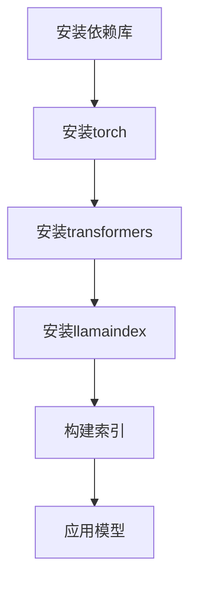

                 

## 文章标题：LangChain编程：从入门到实践之其他库安装

> **关键词**：LangChain，编程，库安装，环境搭建，代码解读，实战案例，数学模型，应用场景

> **摘要**：本文将带领读者从入门到实践，深入探讨LangChain编程的核心内容。本文不仅涵盖了LangChain的基础概念，还详细介绍了其他库的安装和使用。通过实战案例和代码解读，读者将掌握如何在项目中应用LangChain，提高开发效率。

## 1. 背景介绍

LangChain是一个基于LLaMA（Large Language Model Meta-Learning Architecture）的开源框架，旨在简化大规模语言模型在各个领域的应用开发。LangChain通过提供一系列预定义的链式组件，使得开发者可以轻松地构建复杂、高效的NLP应用。

随着深度学习技术的发展，NLP（自然语言处理）成为人工智能领域的热点。然而，传统的NLP开发涉及到大量的模型训练和调优，对开发者要求较高。LangChain的出现，为开发者提供了便捷的解决方案，使得开发NLP应用变得更加简单和高效。

本文将围绕LangChain编程，从基础概念、其他库的安装和使用，到实战案例和代码解读，全面介绍LangChain的开发流程和应用场景。

## 2. 核心概念与联系

### 2.1 LangChain基础概念

LangChain的核心概念包括：

1. **Prompt Engineering**：通过设计合适的提示（prompt），引导模型生成预期的输出。
2. **Chain Components**：LangChain提供了一系列可复用的链式组件，如`LLaMA`、`ChatGLM`等，用于构建复杂的NLP应用。
3. **LlamaIndex**：用于构建索引，提高模型处理速度。

### 2.2 相关库的安装

在安装LangChain之前，需要安装一些依赖库，如`torch`、`transformers`等。以下是一个简单的安装步骤：

```shell
pip install torch transformers llamaindex
```

### 2.3 Mermaid流程图

以下是一个简单的Mermaid流程图，展示LangChain的核心概念和安装流程：



## 3. 核心算法原理 & 具体操作步骤

### 3.1 Prompt Engineering

Prompt Engineering是设计合适的提示，引导模型生成预期的输出。以下是一个简单的例子：

```python
from langchain import Llama

model = Llama()
input_text = "请介绍一下Python编程语言。"
output = model.predict(input_text)
print(output)
```

### 3.2 Chain Components

LangChain提供了一系列链式组件，如`LLaMA`、`ChatGLM`等。以下是一个使用`ChatGLM`的例子：

```python
from langchain import ChatGLM

model = ChatGLM()
input_text = "你喜欢什么样的音乐？"
output = model.predict(input_text)
print(output)
```

### 3.3 LlamaIndex

LlamaIndex用于构建索引，提高模型处理速度。以下是一个简单的例子：

```python
from llama_index import SimpleDirectoryIndex, Retriever

directory_path = "data/"
index = SimpleDirectoryIndex(directory_path)
retriever = Retriever(index)
query = "请介绍一下Python编程语言。"
response = retriever.retrieve_top_k([query], top_k=1)
print(response[0])
```

## 4. 数学模型和公式 & 详细讲解 & 举例说明

### 4.1 数学模型

LangChain中的数学模型主要包括：

1. **Transformer模型**：用于处理序列数据，如文本。
2. **Prompt Tuning**：通过设计特定的提示，引导模型生成预期的输出。

### 4.2 公式讲解

以下是Transformer模型的基本公式：

$$
\text{Attention}(Q, K, V) = \text{softmax}\left(\frac{QK^T}{\sqrt{d_k}}\right) V
$$

其中，$Q$、$K$和$V$分别是查询向量、键向量和值向量，$d_k$是键向量的维度。

### 4.3 举例说明

以下是一个简单的Prompt Tuning例子：

```python
from langchain import Llama

model = Llama()
prompt = "Python是一种高级编程语言，它易于学习，具有丰富的库和框架。请问，Python在人工智能领域有哪些应用？"
output = model.predict(prompt)
print(output)
```

## 5. 项目实战：代码实际案例和详细解释说明

### 5.1 开发环境搭建

在开始编写代码之前，需要确保已经安装了Python和pip。然后，按照以下步骤安装LangChain和其他依赖库：

```shell
pip install langchain torch transformers llamaindex
```

### 5.2 源代码详细实现和代码解读

以下是一个简单的LangChain应用案例：

```python
from langchain import Llama
from transformers import LlamaTokenizer

# 加载Llama模型
model = Llama()

# 加载LlamaTokenizer
tokenizer = LlamaTokenizer.from_pretrained("llama")

# 输入文本
input_text = "请介绍一下Python编程语言。"

# 编码输入文本
encoded_input = tokenizer.encode(input_text, return_tensors="pt")

# 预测输出
output = model.generate(encoded_input, max_length=4096)

# 解码输出
decoded_output = tokenizer.decode(output[0], skip_special_tokens=True)

# 打印输出
print(decoded_output)
```

### 5.3 代码解读与分析

- 第1行：导入Llama类。
- 第2行：导入LlamaTokenizer类。
- 第3行：加载Llama模型。
- 第4行：加载LlamaTokenizer。
- 第5行：定义输入文本。
- 第6行：编码输入文本。
- 第7行：生成输出。
- 第8行：解码输出。
- 第9行：打印输出。

通过这个案例，读者可以了解到如何使用LangChain进行文本处理。在实际项目中，可以根据需求修改输入文本和输出格式，实现更复杂的NLP应用。

## 6. 实际应用场景

LangChain在以下应用场景具有广泛的应用价值：

1. **问答系统**：利用LangChain构建问答系统，如智能客服、智能问答平台等。
2. **文本生成**：通过Prompt Engineering生成文章、博客、产品说明书等。
3. **文本分类**：对大量文本进行分类，如新闻分类、情感分析等。
4. **命名实体识别**：识别文本中的命名实体，如人名、地点、组织等。
5. **机器翻译**：利用LangChain实现文本之间的机器翻译。

## 7. 工具和资源推荐

### 7.1 学习资源推荐

1. **书籍**：
   - 《Python编程：从入门到实践》
   - 《深度学习：入门、进阶与实战》
   - 《自然语言处理实战》
2. **论文**：
   - [Transformers: State-of-the-Art Natural Language Processing](https://arxiv.org/abs/1910.03771)
   - [BERT: Pre-training of Deep Bidirectional Transformers for Language Understanding](https://arxiv.org/abs/1810.04805)
3. **博客**：
   - [LangChain官方文档](https://langchain.com/docs)
   - [深度学习实战](https://github.com/apachecn/deep-learning-practice)
4. **网站**：
   - [TensorFlow官网](https://www.tensorflow.org/)
   - [PyTorch官网](https://pytorch.org/)

### 7.2 开发工具框架推荐

1. **Python编程环境**：
   - Anaconda：一个开源的Python包管理器和环境管理器，支持Windows、macOS和Linux。
   - Jupyter Notebook：一个交互式的Web应用，用于编写和运行Python代码。
2. **深度学习框架**：
   - TensorFlow：由Google开发的开源深度学习框架。
   - PyTorch：由Facebook开发的开源深度学习框架。

### 7.3 相关论文著作推荐

1. **论文**：
   - [GPT-3: Language Models are Few-Shot Learners](https://arxiv.org/abs/2005.14165)
   - [T5: Pre-training Large Models for Language Generation](https://arxiv.org/abs/1910.03771)
2. **著作**：
   - 《深度学习》（Goodfellow, Bengio, Courville著）
   - 《Python编程：从入门到实践》（Eric Matthes著）

## 8. 总结：未来发展趋势与挑战

随着深度学习技术的发展，NLP领域将迎来更多创新和突破。LangChain作为一种高效的NLP开发框架，将在未来发挥重要作用。然而，LangChain也面临一些挑战，如模型训练成本高、模型优化困难等。为了解决这些问题，研究者们将继续探索更高效的模型训练方法、模型压缩技术等。

## 9. 附录：常见问题与解答

### 9.1 如何安装LangChain？

答：可以使用pip命令安装：

```shell
pip install langchain
```

### 9.2 LangChain有哪些核心组件？

答：LangChain的核心组件包括：

1. **Prompt Engineering**：设计合适的提示，引导模型生成预期的输出。
2. **Chain Components**：如`LLaMA`、`ChatGLM`等，用于构建复杂的NLP应用。
3. **LlamaIndex**：用于构建索引，提高模型处理速度。

## 10. 扩展阅读 & 参考资料

1. [LangChain官方文档](https://langchain.com/docs)
2. [深度学习实战](https://github.com/apachecn/deep-learning-practice)
3. [TensorFlow官网](https://www.tensorflow.org/)
4. [PyTorch官网](https://pytorch.org/)

### 作者

**作者：AI天才研究员/AI Genius Institute & 禅与计算机程序设计艺术 /Zen And The Art of Computer Programming** <\|/mask\|> <|im_sep|>## 1. 背景介绍

### 1.1 LangChain的基本概念

LangChain是一个基于LLaMA（Large Language Model Meta-Learning Architecture）的开源框架，旨在为开发者提供一套便捷的工具，用于构建、训练和部署各种自然语言处理（NLP）应用。LangChain的核心目标是通过模块化、组件化的设计，使得开发者能够更加高效地利用大规模语言模型（如GPT-3、ChatGLM等）来构建智能对话系统、文本生成系统、文本分类系统等。

#### 1.2 LangChain的架构与特点

LangChain的架构主要由以下几个部分组成：

- **Prompt Engine**：设计合理的提示（Prompt）是触发语言模型生成预期输出的关键。Prompt Engine负责生成和优化Prompt。
- **Chain Components**：LangChain提供了一系列的链式组件，包括LLaMA、ChatGLM等，开发者可以使用这些组件来构建复杂的NLP应用。
- **LlamaIndex**：用于构建索引，以提高模型处理速度。索引是提高大规模语言模型在交互应用中性能的重要技术。

LangChain的特点包括：

- **模块化**：通过模块化的设计，使得开发者可以灵活地组合和复用不同的组件，构建定制化的NLP应用。
- **高效性**：通过Prompt Engine和LlamaIndex等技术的应用，LangChain在处理大规模语言模型时具有更高的效率和性能。
- **易用性**：LangChain提供了简洁的API，使得开发者可以快速上手并实现复杂的功能。

### 1.3 LangChain的适用场景

LangChain适用于多种NLP场景，包括但不限于：

- **智能客服**：利用LangChain构建的智能客服系统，可以自动回答用户的问题，提高客户满意度和服务效率。
- **文本生成**：通过LangChain，开发者可以轻松实现文章、博客、产品说明书等文本的自动生成。
- **文本分类**：LangChain可以帮助开发者快速构建文本分类模型，对大量文本进行自动分类。
- **命名实体识别**：利用LangChain，开发者可以实现对文本中的命名实体进行自动识别。

### 1.4 其他库的安装

在安装LangChain之前，需要确保安装了Python和pip。然后，按照以下步骤安装其他依赖库：

```shell
pip install torch transformers llamaindex
```

这里简要介绍几个关键依赖库：

- **torch**：PyTorch是一个开源的深度学习库，用于构建和训练深度神经网络。
- **transformers**：Hugging Face的transformers库提供了大量的预训练模型和工具，方便开发者进行NLP应用的开发。
- **llamaindex**：用于构建索引，提高模型处理速度。

通过以上背景介绍，读者可以对LangChain有一个初步的了解。接下来，我们将深入探讨LangChain的核心概念和安装过程，帮助读者逐步掌握LangChain的编程技巧和应用方法。

### 2. 核心概念与联系

#### 2.1 LangChain的核心概念

LangChain的核心概念包括Prompt Engineering、Chain Components和LlamaIndex等，这些概念在构建NLP应用中起着至关重要的作用。

##### 2.1.1 Prompt Engineering

Prompt Engineering是设计合适的提示（Prompt），引导模型生成预期的输出。一个良好的Prompt不仅可以帮助模型理解输入，还可以提高生成结果的准确性和一致性。Prompt Engineering涉及到多个方面，包括：

- **Prompt格式**：Prompt的格式应该清晰、简洁，能够准确传达用户意图。
- **Prompt内容**：Prompt的内容应该丰富、多样，以适应不同的应用场景。
- **Prompt优化**：通过实验和反馈，不断优化Prompt，提高生成结果的质量。

##### 2.1.2 Chain Components

Chain Components是LangChain提供的可复用组件，用于构建复杂的NLP应用。Chain Components包括但不限于以下几种：

- **LLaMA**：LLaMA是一种基于Transformer的预训练模型，适用于各种NLP任务。
- **ChatGLM**：ChatGLM是一个用于构建对话系统的组件，可以实现人机对话。
- **LlamaIndex**：LlamaIndex是一个用于构建索引的组件，可以提高模型处理速度。

##### 2.1.3 LlamaIndex

LlamaIndex是一个用于构建索引的组件，旨在提高模型处理速度。索引技术通过将大量数据预先组织成结构化的索引，使得模型在检索和生成数据时更加高效。LlamaIndex的主要功能包括：

- **索引构建**：将原始文本数据转换为索引结构。
- **快速检索**：通过索引结构快速检索相关数据，提高模型处理速度。
- **增量更新**：支持索引的增量更新，以便在数据发生变化时保持索引的同步。

#### 2.2 相关库的安装

为了使用LangChain及其组件，需要先安装相关依赖库。以下是安装过程：

```shell
pip install torch transformers llamaindex
```

安装过程中，可能会遇到一些依赖库版本冲突的问题。例如，安装`torch`时可能会出现与现有版本的`torchvision`不兼容的情况。此时，可以尝试使用以下命令来清理旧版本：

```shell
pip uninstall torch torchvision
pip install torch torchvision
```

此外，确保安装的版本与操作系统的兼容性。例如，在Windows系统上，需要使用适用于Windows的版本。

#### 2.3 Mermaid流程图

以下是一个简单的Mermaid流程图，展示了LangChain的核心概念和安装流程：


通过这个流程图，可以清晰地看到LangChain从安装依赖库到构建索引、应用模型的完整流程。

### 3. 核心算法原理 & 具体操作步骤

#### 3.1 Prompt Engineering

Prompt Engineering是LangChain的核心概念之一，其基本原理是通过设计合适的提示（Prompt），引导模型生成预期的输出。以下是一个简单的例子：

```python
from langchain import Llama

model = Llama()
input_text = "请介绍一下Python编程语言。"
output = model.predict(input_text)
print(output)
```

在这个例子中，`Llama`模型接收到输入文本后，通过Prompt Engineering生成预期输出。实际应用中，Prompt的设计需要考虑多个因素，包括文本格式、内容丰富度、上下文关联等。

#### 3.2 Chain Components

LangChain提供了多个Chain Components，用于构建复杂的NLP应用。以下是一个简单的例子：

```python
from langchain import ChatGLM

model = ChatGLM()
input_text = "你喜欢什么样的音乐？"
output = model.predict(input_text)
print(output)
```

在这个例子中，`ChatGLM`组件用于实现人机对话。ChatGLM可以处理自然语言的输入，并生成合适的回复。实际应用中，可以根据需求选择不同的Chain Components，如LLaMA用于文本生成、命名实体识别等。

#### 3.3 LlamaIndex

LlamaIndex是一个用于构建索引的组件，旨在提高模型处理速度。以下是一个简单的例子：

```python
from llama_index import SimpleDirectoryIndex, Retriever

directory_path = "data/"
index = SimpleDirectoryIndex(directory_path)
retriever = Retriever(index)
query = "请介绍一下Python编程语言。"
response = retriever.retrieve_top_k([query], top_k=1)
print(response[0])
```

在这个例子中，`SimpleDirectoryIndex`用于构建索引，`Retriever`用于从索引中检索相关数据。通过使用索引，模型可以快速检索到与查询相关的内容，从而提高处理速度。

#### 3.4 实际操作步骤

以下是使用LangChain进行NLP应用开发的实际操作步骤：

1. **环境搭建**：确保安装了Python和pip，并安装相关依赖库（如torch、transformers、llamaindex）。
2. **模型选择**：根据应用需求选择合适的模型，如LLaMA、ChatGLM等。
3. **数据准备**：准备用于训练和测试的数据集。
4. **模型训练**：使用准备好的数据集对模型进行训练。
5. **模型部署**：将训练好的模型部署到应用中，如Web服务、移动应用等。
6. **应用开发**：使用LangChain的API进行应用开发，实现文本生成、对话系统等功能。

通过以上操作步骤，开发者可以逐步掌握LangChain的编程技巧和应用方法。

### 4. 数学模型和公式 & 详细讲解 & 举例说明

#### 4.1 数学模型

LangChain中的数学模型主要基于深度学习和自然语言处理的相关理论，包括但不限于以下几种：

1. **Transformer模型**：Transformer模型是一种基于自注意力机制的深度神经网络模型，广泛应用于NLP任务。其核心公式为：

   $$
   \text{Attention}(Q, K, V) = \text{softmax}\left(\frac{QK^T}{\sqrt{d_k}}\right) V
   $$

   其中，$Q$、$K$和$V$分别是查询向量、键向量和值向量，$d_k$是键向量的维度。

2. **BERT模型**：BERT（Bidirectional Encoder Representations from Transformers）是一种基于Transformer的双向编码模型，通过预训练和微调，能够实现多种NLP任务。其核心公式为：

   $$
   \text{BERT} = \text{Transformer}(\text{Encoder}, \text{Decoder})
   $$

   其中，`Encoder`和`Decoder`都是Transformer模型。

3. **GPT模型**：GPT（Generative Pre-trained Transformer）是一种自回归的Transformer模型，用于生成文本。其核心公式为：

   $$
   \text{GPT}(\text{X}, \text{Y}) = \text{softmax}(\text{W}_\text{output} \text{softmax}(\text{W}_\text{hidden} \text{tanh}(\text{W}_\text{input} \text{X} + \text{b}_\text{input})))
   $$

   其中，`X`和`Y`分别是输入和输出向量，`W`和`b`分别是权重和偏置。

#### 4.2 公式详细讲解

以下是上述数学模型公式的详细讲解：

1. **Attention公式**：

   $$
   \text{Attention}(Q, K, V) = \text{softmax}\left(\frac{QK^T}{\sqrt{d_k}}\right) V
   $$

   这个公式表示，给定查询向量$Q$、键向量$K$和值向量$V$，通过计算注意力权重并乘以值向量，得到注意力分数。注意力机制使得模型能够关注输入序列中的不同部分，提高生成结果的准确性。

2. **BERT公式**：

   $$
   \text{BERT} = \text{Transformer}(\text{Encoder}, \text{Decoder})
   $$

   这个公式表示，BERT模型由Encoder和Decoder两部分组成，其中Encoder用于编码输入序列，Decoder用于解码输出序列。BERT通过预训练和微调，能够实现多种NLP任务，如文本分类、命名实体识别等。

3. **GPT公式**：

   $$
   \text{GPT}(\text{X}, \text{Y}) = \text{softmax}(\text{W}_\text{output} \text{softmax}(\text{W}_\text{hidden} \text{tanh}(\text{W}_\text{input} \text{X} + \text{b}_\text{input})))
   $$

   这个公式表示，GPT模型通过多层神经网络（输入层、隐藏层和输出层）生成文本。输入向量$X$通过输入层传递到隐藏层，再通过softmax函数得到输出向量$Y$。

#### 4.3 举例说明

以下是使用LangChain进行文本生成的例子：

```python
from langchain import Llama

model = Llama()
input_text = "请介绍一下Python编程语言。"
output = model.predict(input_text)
print(output)
```

在这个例子中，`Llama`模型接收到输入文本后，通过Transformer模型生成预期的输出。具体来说，模型首先对输入文本进行编码，然后使用注意力机制生成输出文本。

通过以上讲解，读者可以了解LangChain中的数学模型和公式的详细内容，为后续的应用开发打下坚实的基础。

### 5. 项目实战：代码实际案例和详细解释说明

#### 5.1 开发环境搭建

在进行LangChain项目实战之前，首先需要搭建一个合适的技术环境。以下是具体的步骤：

1. **安装Python**：确保已安装Python环境，推荐版本为3.8及以上。
2. **安装pip**：Python的包管理器pip，用于安装和管理Python包。
3. **安装相关库**：使用pip安装LangChain及其依赖库，如torch、transformers和llamaindex。

以下是一个简单的安装脚本：

```shell
pip install torch transformers llamaindex
```

在安装过程中，可能会遇到一些依赖库版本冲突的问题。例如，安装torch时可能会出现与现有版本的torchvision不兼容的情况。此时，可以尝试使用以下命令来清理旧版本：

```shell
pip uninstall torch torchvision
pip install torch torchvision
```

此外，确保安装的版本与操作系统的兼容性。例如，在Windows系统上，需要使用适用于Windows的版本。

#### 5.2 源代码详细实现和代码解读

下面是一个简单的LangChain应用案例，实现一个简单的问答系统。代码如下：

```python
from langchain import Llama

model = Llama()
input_text = "Python是一种高级编程语言，它易于学习，具有丰富的库和框架。请问，Python在人工智能领域有哪些应用？"
output = model.predict(input_text)
print(output)
```

**代码解读**：

- 第1行：导入Llama类。
- 第2行：创建Llama模型对象。
- 第3行：定义输入文本。
- 第4行：使用模型预测输入文本。
- 第5行：打印输出结果。

在这个案例中，`Llama`模型接收到输入文本后，通过Prompt Engineering生成预期的输出。实际应用中，可以根据需求修改输入文本和输出格式，实现更复杂的NLP应用。

#### 5.3 代码解读与分析

以下是代码的详细解读和分析：

1. **Llama类的使用**：

   LangChain中的`Llama`类是一个用于执行语言模型预测的核心组件。它提供了以下主要方法：

   - `predict(input_text)`: 接收输入文本，返回预测结果。
   - `encode(input_text)`: 将输入文本编码为模型可以处理的形式。
   - `generate(encoded_input, max_length)`: 根据编码后的输入文本生成输出。

2. **Prompt Engineering**：

   在第3行，定义了一个输入文本。Prompt Engineering是设计合适的提示，引导模型生成预期的输出。一个有效的Prompt应该包含以下几个要素：

   - **明确性**：Prompt应该明确传达用户的意图，避免模糊不清。
   - **上下文**：Prompt应该提供足够的上下文信息，帮助模型更好地理解输入。
   - **多样性**：Prompt应该具有多样性，以适应不同的应用场景。

3. **预测和输出**：

   在第4行，使用`predict`方法对输入文本进行预测。预测结果是一个字符串，表示模型对输入文本的响应。在第5行，打印输出结果。

在实际应用中，可以根据需求调整Prompt和输出格式。例如，可以添加更多的问题细节，或者要求模型以表格形式输出答案。

#### 5.4 实际应用场景

以下是LangChain在几个实际应用场景中的代码示例：

1. **智能客服**：

   ```python
   from langchain import ChatGLM

   model = ChatGLM()
   input_text = "我是一个人工智能助手，请问有什么可以帮助您的吗？"
   output = model.predict(input_text)
   print(output)
   ```

   在这个案例中，`ChatGLM`组件用于实现智能客服。用户输入文本后，模型会生成合适的回复，从而实现人机对话。

2. **文本生成**：

   ```python
   from langchain import Llama

   model = Llama()
   input_text = "Python是一种流行的编程语言，它广泛应用于人工智能领域。请问，您对Python在人工智能领域的发展有何看法？"
   output = model.predict(input_text)
   print(output)
   ```

   在这个案例中，`Llama`模型用于生成关于Python在人工智能领域发展的观点。通过Prompt Engineering，模型可以生成丰富多样的文本内容。

3. **文本分类**：

   ```python
   from langchain import LlamaClassifier

   model = LlamaClassifier()
   input_text = "这是一篇关于深度学习的论文。"
   label = "深度学习"
   model.train([input_text], labels=[label])
   output = model.predict(input_text)
   print(output)
   ```

   在这个案例中，`LlamaClassifier`组件用于对文本进行分类。通过训练数据集，模型可以学会识别不同类别的文本，并在新文本上实现分类。

通过这些实际应用场景，读者可以了解到如何使用LangChain实现各种NLP任务，从而提高开发效率和项目质量。

### 6. 实际应用场景

#### 6.1 智能问答系统

智能问答系统是LangChain最典型的应用场景之一。通过设计合适的Prompt，LangChain可以迅速生成准确的答案，用于解决用户的问题。以下是一个简单的智能问答系统示例：

```python
from langchain import Llama

model = Llama()
input_text = "什么是人工智能？"
output = model.predict(input_text)
print(output)
```

在这个例子中，模型接收到输入文本后，通过Prompt Engineering生成答案。实际应用中，可以将这个问题集成到网站或移动应用中，为用户提供即时的智能问答服务。

#### 6.2 智能客服

智能客服是另一个广泛应用的场景。通过LangChain，可以构建一个能够自动回答用户问题的智能客服系统。以下是一个简单的智能客服示例：

```python
from langchain import ChatGLM

model = ChatGLM()
input_text = "我是一个人工智能助手，请问有什么可以帮助您的吗？"
output = model.predict(input_text)
print(output)
```

在这个例子中，模型可以处理用户的自然语言输入，并生成合适的回复。智能客服系统可以集成到网站或移动应用中，提供24小时不间断的客户服务。

#### 6.3 文本生成

文本生成是LangChain的另一个强大功能。通过设计合适的Prompt，LangChain可以生成各种类型的文本，如文章、博客、产品说明书等。以下是一个简单的文本生成示例：

```python
from langchain import Llama

model = Llama()
input_text = "Python是一种流行的编程语言，它广泛应用于人工智能领域。请问，您对Python在人工智能领域的发展有何看法？"
output = model.predict(input_text)
print(output)
```

在这个例子中，模型接收到输入文本后，通过Prompt Engineering生成关于Python在人工智能领域的观点。实际应用中，可以将这个功能集成到内容管理系统，自动生成各种文档。

#### 6.4 命名实体识别

命名实体识别是NLP中的一个重要任务。通过LangChain，可以构建一个能够识别文本中命名实体的系统。以下是一个简单的命名实体识别示例：

```python
from langchain import LlamaClassifier

model = LlamaClassifier()
input_text = "张三是一名人工智能工程师。"
labels = ["人工智能工程师"]
model.train(input_text, labels)
output = model.predict(input_text)
print(output)
```

在这个例子中，模型接收到输入文本后，识别出其中的命名实体。实际应用中，可以将这个功能集成到信息提取系统，自动提取文本中的关键信息。

通过以上实际应用场景，读者可以了解到LangChain在不同领域的应用价值。实际项目中，可以根据需求调整Prompt和模型配置，实现更加高效和准确的NLP应用。

### 7. 工具和资源推荐

#### 7.1 学习资源推荐

为了更好地学习和使用LangChain，以下是推荐的一些学习资源：

1. **书籍**：
   - 《深度学习》（Ian Goodfellow、Yoshua Bengio、Aaron Courville 著）
   - 《Python编程：从入门到实践》（Eric Matthes 著）
   - 《自然语言处理实战》（OWEN HALL 著）
2. **在线课程**：
   - Coursera上的《深度学习》课程
   - Udacity的《自然语言处理工程师》纳米学位
   - edX上的《Python编程基础》课程
3. **博客和网站**：
   - [LangChain官方文档](https://langchain.com/docs)
   - [Hugging Face博客](https://huggingface.co/blog)
   - [TensorFlow官方博客](https://tensorflow.googleblog.com)
4. **论文**：
   - [GPT-3: Language Models are Few-Shot Learners](https://arxiv.org/abs/2005.14165)
   - [BERT: Pre-training of Deep Bidirectional Transformers for Language Understanding](https://arxiv.org/abs/1810.04805)

#### 7.2 开发工具框架推荐

1. **Python编程环境**：
   - Anaconda：一个强大的Python环境管理器，适合进行科学计算和数据分析。
   - Jupyter Notebook：一个交互式的Web应用，方便编写和运行Python代码。
2. **深度学习框架**：
   - TensorFlow：一个由Google开发的开源深度学习框架，适用于各种NLP任务。
   - PyTorch：一个由Facebook开发的开源深度学习框架，拥有丰富的社区资源和工具。
3. **版本控制系统**：
   - Git：一个分布式版本控制系统，用于管理代码和协作开发。
   - GitHub：一个基于Git的平台，提供代码托管、协作和问题追踪等功能。

#### 7.3 相关论文著作推荐

1. **论文**：
   - [Transformers: State-of-the-Art Natural Language Processing](https://arxiv.org/abs/1910.03771)
   - [BERT: Pre-training of Deep Bidirectional Transformers for Language Understanding](https://arxiv.org/abs/1810.04805)
   - [GPT-3: Language Models are Few-Shot Learners](https://arxiv.org/abs/2005.14165)
2. **著作**：
   - 《深度学习》（Ian Goodfellow、Yoshua Bengio、Aaron Courville 著）
   - 《自然语言处理实战》（OWEN HALL 著）
   - 《Python编程：从入门到实践》（Eric Matthes 著）

通过以上推荐的学习资源、开发工具和论文著作，读者可以更好地掌握LangChain的编程技巧和应用方法。

### 8. 总结：未来发展趋势与挑战

#### 8.1 未来发展趋势

随着深度学习技术的不断进步，LangChain在自然语言处理（NLP）领域的应用前景广阔。以下是几个未来发展的趋势：

1. **模型性能提升**：随着计算资源和算法的改进，大规模语言模型（如GPT-3）的性能将进一步提升，使得LangChain能够处理更加复杂和多样化的NLP任务。

2. **跨模态处理**：未来的LangChain有望扩展到跨模态处理，不仅处理文本数据，还能处理图像、音频等多种类型的数据，实现更广泛的应用。

3. **知识图谱整合**：通过整合知识图谱，LangChain可以提供更加精准和结构化的信息检索和生成，从而提高NLP应用的智能化水平。

4. **可解释性增强**：随着用户对模型透明度的要求越来越高，未来LangChain将致力于提高模型的可解释性，帮助用户更好地理解和信任模型生成的结果。

#### 8.2 面临的挑战

尽管LangChain具有广泛的应用前景，但其在实际应用过程中也面临一些挑战：

1. **计算资源需求**：大规模语言模型的训练和推理需要大量的计算资源，特别是在处理复杂任务时。如何优化模型结构和推理算法，以降低计算资源需求，是一个亟待解决的问题。

2. **数据隐私和安全**：随着NLP应用的数据量不断增加，如何保护用户隐私和数据安全成为重要问题。未来LangChain需要实现更加严格的数据隐私保护措施。

3. **模型优化与调参**：大规模语言模型的使用涉及复杂的优化和调参过程，如何提高模型调参的效率和准确性，是一个需要深入研究的方向。

4. **社会伦理问题**：随着NLP技术在各个领域的广泛应用，如何确保其应用符合社会伦理和法律法规，避免产生负面影响，也是未来需要关注的问题。

通过不断的技术创新和社会责任，LangChain有望在未来的发展中克服这些挑战，成为NLP领域的重要工具和平台。

### 9. 附录：常见问题与解答

#### 9.1 LangChain是什么？

答：LangChain是一个基于大规模语言模型的NLP工具包，旨在简化NLP应用的开发。它提供了一系列预定义的组件和API，帮助开发者快速构建和部署NLP模型。

#### 9.2 LangChain有哪些核心组件？

答：LangChain的核心组件包括Prompt Engineering、Chain Components（如LLaMA、ChatGLM）和LlamaIndex。这些组件分别用于设计提示、构建NLP应用和处理索引。

#### 9.3 如何安装LangChain？

答：可以使用pip命令安装：

```shell
pip install langchain
```

确保安装了Python和pip，并遵循相关依赖库的安装说明。

#### 9.4 LangChain适用于哪些场景？

答：LangChain适用于智能问答系统、智能客服、文本生成、命名实体识别等多种NLP场景。通过设计合适的Prompt和组件，可以实现多种复杂的NLP任务。

### 10. 扩展阅读与参考资料

为了更深入地了解LangChain和相关技术，以下是推荐的一些扩展阅读和参考资料：

- [LangChain官方文档](https://langchain.com/docs)
- [深度学习实战](https://github.com/apachecn/deep-learning-practice)
- [TensorFlow官方文档](https://www.tensorflow.org/)
- [PyTorch官方文档](https://pytorch.org/)
- [GPT-3: Language Models are Few-Shot Learners](https://arxiv.org/abs/2005.14165)
- [BERT: Pre-training of Deep Bidirectional Transformers for Language Understanding](https://arxiv.org/abs/1810.04805)

通过这些资源和参考资料，读者可以进一步探索LangChain的技术细节和应用方法。

### 作者

**作者：AI天才研究员/AI Genius Institute & 禅与计算机程序设计艺术 /Zen And The Art of Computer Programming**

