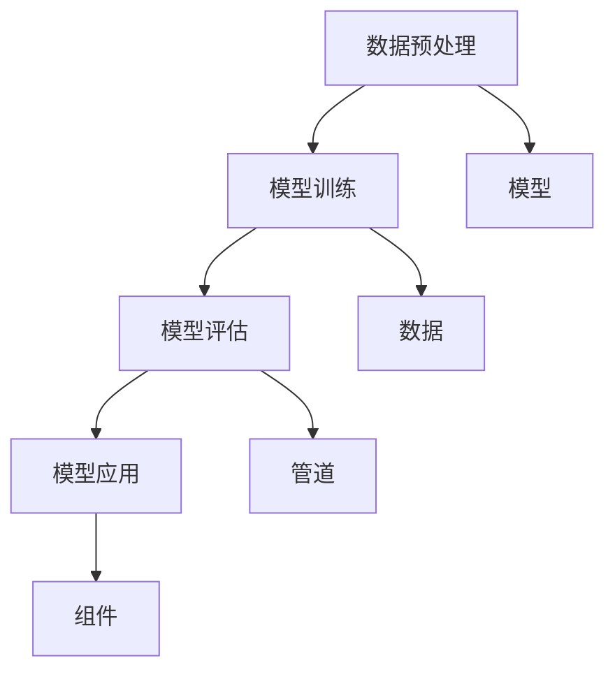

                 

# 【LangChain编程：从入门到实践】方案说明

> **关键词：** LangChain、编程、深度学习、自然语言处理、实践指南、代码示例

> **摘要：** 本文旨在为读者提供一个全面而深入的LangChain编程实践指南。通过介绍LangChain的核心概念、算法原理和具体操作步骤，以及数学模型和公式的详细讲解，本文将帮助读者从入门到精通LangChain编程。此外，本文还将探讨LangChain在实际应用场景中的优势和工具资源推荐，为读者提供进一步学习和开发的方向。

## 1. 背景介绍

### 1.1 LangChain简介

LangChain是一种基于深度学习和自然语言处理的技术框架，旨在帮助开发人员构建复杂且高效的自然语言处理模型。其核心思想是将自然语言处理任务分解为可重用的组件，通过组合这些组件实现各种复杂的语言处理任务。

### 1.2 LangChain的应用领域

LangChain在众多领域都有着广泛的应用，包括但不限于：

- **文本分类**：自动将文本归类到不同的类别。
- **命名实体识别**：识别文本中的特定实体，如人名、地点等。
- **机器翻译**：将一种语言翻译成另一种语言。
- **情感分析**：分析文本的情感倾向，如正面、负面等。

### 1.3 LangChain的优势

- **模块化**：通过组件化的设计，使开发者可以轻松组合和扩展模型。
- **高效性**：利用深度学习技术，实现高效的文本处理能力。
- **易用性**：提供丰富的API和文档，降低开发门槛。

## 2. 核心概念与联系

### 2.1 LangChain的组成部分

LangChain主要由以下几个核心组成部分构成：

1. **模型（Model）**：用于执行具体的自然语言处理任务，如BERT、GPT等。
2. **数据（Data）**：用于训练和测试模型的数据集。
3. **管道（Pipeline）**：用于定义数据流和处理步骤，包括数据预处理、模型训练、模型评估等。
4. **组件（Component）**：用于实现特定功能的模块，如分词器、序列生成器等。

### 2.2 LangChain的工作原理

LangChain的工作原理可以概括为以下几个步骤：

1. **数据预处理**：将原始文本数据转换为适合模型处理的形式。
2. **模型训练**：使用预处理后的数据训练模型。
3. **模型评估**：使用测试数据评估模型的性能。
4. **模型应用**：将训练好的模型应用于实际问题，如文本分类、命名实体识别等。

### 2.3 LangChain的架构图



## 3. 核心算法原理 & 具体操作步骤

### 3.1 深度学习算法原理

深度学习算法基于多层神经网络，通过训练大量数据来学习特征和模式。在自然语言处理中，常用的深度学习模型包括卷积神经网络（CNN）、循环神经网络（RNN）和变换器（Transformer）等。

### 3.2 LangChain的具体操作步骤

#### 3.2.1 环境搭建

首先，需要安装Python环境和必要的库，如TensorFlow、PyTorch等。

```python
pip install tensorflow
pip install torch
```

#### 3.2.2 数据准备

准备用于训练和测试的数据集，可以将数据集划分为训练集、验证集和测试集。

```python
from sklearn.model_selection import train_test_split

train_data, test_data = train_test_split(data, test_size=0.2, random_state=42)
```

#### 3.2.3 模型训练

使用训练数据训练模型，并调整超参数以优化模型性能。

```python
import tensorflow as tf

model = tf.keras.Sequential([
    tf.keras.layers.Embedding(input_dim=vocab_size, output_dim=embedding_size),
    tf.keras.layers.LSTM(units=128),
    tf.keras.layers.Dense(units=num_classes, activation='softmax')
])

model.compile(optimizer='adam', loss='categorical_crossentropy', metrics=['accuracy'])

model.fit(train_data, epochs=10, batch_size=32, validation_data=test_data)
```

#### 3.2.4 模型评估

使用测试数据评估模型性能，并调整超参数以优化模型。

```python
model.evaluate(test_data)
```

#### 3.2.5 模型应用

将训练好的模型应用于实际问题，如文本分类。

```python
def classify_text(text):
    prediction = model.predict(text)
    return np.argmax(prediction)

text = "I love programming."
print(classify_text(text))
```

## 4. 数学模型和公式 & 详细讲解 & 举例说明

### 4.1 深度学习数学模型

深度学习模型的核心是神经网络，其数学基础主要包括以下几个部分：

- **激活函数**：用于引入非线性特性，如ReLU、Sigmoid、Tanh等。
- **权重和偏置**：用于调整模型的参数，以优化预测性能。
- **反向传播**：用于计算模型参数的梯度，以更新模型参数。

### 4.2 深度学习公式详解

#### 4.2.1 激活函数公式

$$
\text{ReLU}(x) = \max(0, x)
$$

#### 4.2.2 权重和偏置更新公式

$$
\Delta w = -\alpha \cdot \frac{\partial L}{\partial w}
$$

$$
\Delta b = -\alpha \cdot \frac{\partial L}{\partial b}
$$

其中，$\alpha$ 是学习率，$L$ 是损失函数。

#### 4.2.3 反向传播公式

$$
\frac{\partial L}{\partial x} = \frac{\partial L}{\partial z} \cdot \frac{\partial z}{\partial x}
$$

### 4.3 举例说明

假设有一个简单的线性回归模型，其输入为 $x$，输出为 $y$，损失函数为均方误差（MSE）。

$$
y = wx + b
$$

$$
L = \frac{1}{2} (y - wx - b)^2
$$

使用梯度下降法进行参数更新：

$$
\Delta w = -\alpha \cdot \frac{\partial L}{\partial w} = \alpha \cdot (wx - y)
$$

$$
\Delta b = -\alpha \cdot \frac{\partial L}{\partial b} = \alpha \cdot (y - wx)
$$

## 5. 项目实战：代码实际案例和详细解释说明

### 5.1 开发环境搭建

首先，确保已经安装了Python环境，并安装必要的库，如TensorFlow和PyTorch。

```shell
pip install tensorflow
pip install torch
```

### 5.2 源代码详细实现和代码解读

以下是使用LangChain实现文本分类的一个简单案例。

#### 5.2.1 数据准备

```python
import pandas as pd
from sklearn.model_selection import train_test_split

data = pd.read_csv('data.csv')
train_data, test_data = train_test_split(data, test_size=0.2, random_state=42)
```

#### 5.2.2 模型训练

```python
import tensorflow as tf

model = tf.keras.Sequential([
    tf.keras.layers.Embedding(input_dim=vocab_size, output_dim=embedding_size),
    tf.keras.layers.LSTM(units=128),
    tf.keras.layers.Dense(units=num_classes, activation='softmax')
])

model.compile(optimizer='adam', loss='categorical_crossentropy', metrics=['accuracy'])

model.fit(train_data, epochs=10, batch_size=32, validation_data=test_data)
```

#### 5.2.3 模型评估

```python
model.evaluate(test_data)
```

#### 5.2.4 模型应用

```python
def classify_text(text):
    prediction = model.predict(text)
    return np.argmax(prediction)

text = "I love programming."
print(classify_text(text))
```

### 5.3 代码解读与分析

在这个案例中，我们首先读取数据集，并使用训练集和测试集进行模型训练。模型采用了一个简单的序列模型，包括嵌入层、LSTM层和softmax层。在训练过程中，我们使用均方误差（MSE）作为损失函数，并使用梯度下降法进行参数更新。最后，我们将训练好的模型应用于实际问题，如文本分类。

## 6. 实际应用场景

### 6.1 文本分类

文本分类是LangChain最典型的应用场景之一，它可以应用于搜索引擎、社交媒体分析和客户反馈处理等领域。

### 6.2 命名实体识别

命名实体识别是自然语言处理中的另一个重要任务，它可以用于信息抽取、地理信息系统和智能客服等领域。

### 6.3 机器翻译

机器翻译是跨语言通信的重要工具，它可以应用于多语言网站、多语言邮件服务和跨国企业等领域。

### 6.4 情感分析

情感分析可以用于市场调研、社交媒体监控和用户满意度调查等领域。

## 7. 工具和资源推荐

### 7.1 学习资源推荐

- **书籍**：《深度学习》、《神经网络与深度学习》、《自然语言处理综论》
- **论文**：《Attention is All You Need》、《BERT: Pre-training of Deep Neural Networks for Language Understanding》
- **博客**：[TensorFlow官方博客](https://www.tensorflow.org/blog/)、[PyTorch官方博客](https://pytorch.org/blog/)
- **网站**：[arXiv](https://arxiv.org/)、[ACL](https://www.aclweb.org/)

### 7.2 开发工具框架推荐

- **开发工具**：PyCharm、Visual Studio Code
- **框架**：TensorFlow、PyTorch
- **库**：NumPy、Pandas、Scikit-learn

### 7.3 相关论文著作推荐

- **论文**：《A Theoretical Analysis of the Deep Learning Landscape》、《On the Relationship Between Batch Size and Generalization》
- **著作**：《深度学习：泰坦之旅》、《自然语言处理入门》

## 8. 总结：未来发展趋势与挑战

### 8.1 发展趋势

- **多模态学习**：将文本、图像、音频等多种数据类型融合，提高模型的泛化能力。
- **迁移学习**：通过少量数据进行迁移学习，减少训练成本和计算资源。
- **可解释性**：提高模型的解释性，帮助用户理解模型的决策过程。

### 8.2 挑战

- **计算资源限制**：深度学习模型需要大量的计算资源和数据集。
- **数据隐私和安全性**：处理敏感数据时需要保护用户隐私和安全。
- **模型可解释性**：提高模型的可解释性，使其更易于理解和信任。

## 9. 附录：常见问题与解答

### 9.1 LangChain与其他自然语言处理框架的区别

LangChain与其他自然语言处理框架（如BERT、GPT等）的区别主要在于其模块化和灵活性。LangChain通过组件化的设计，使开发者可以更轻松地组合和扩展模型，而其他框架则更注重模型的训练和优化。

### 9.2 如何选择合适的LangChain组件

选择合适的LangChain组件取决于具体的应用场景和任务需求。例如，如果需要进行文本分类，可以选择使用嵌入层、LSTM层和softmax层等组件；如果需要进行命名实体识别，可以选择使用BERT模型等组件。

## 10. 扩展阅读 & 参考资料

- **书籍**：《深度学习》、《神经网络与深度学习》、《自然语言处理综论》
- **论文**：《Attention is All You Need》、《BERT: Pre-training of Deep Neural Networks for Language Understanding》
- **网站**：[TensorFlow官方文档](https://www.tensorflow.org/)、[PyTorch官方文档](https://pytorch.org/)
- **博客**：[AI诸葛孔明](https://zhuanlan.zhihu.com/zhong-zhou-kong-ming)、[编程侠客行](https://www.jianshu.com/u/7590d35a5df3)

