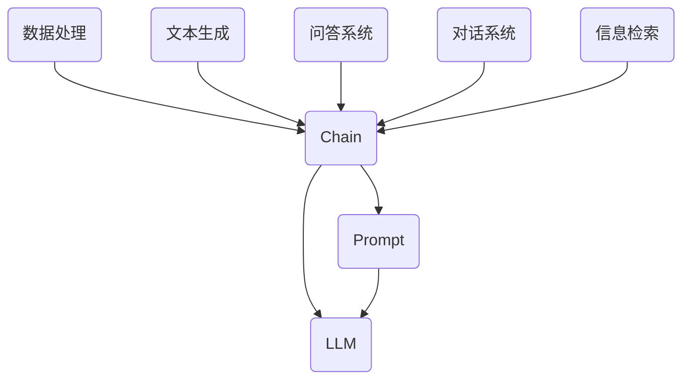

                 

### 【LangChain编程：从入门到实践】模型输入与输出

> **关键词：** LangChain、模型输入与输出、数据流、代码示例

> **摘要：** 本文将深入探讨LangChain编程中的模型输入与输出，通过详细的分析和代码示例，帮助读者理解数据在模型处理过程中的传递方式，掌握在LangChain框架下高效地进行数据处理和模型调用的技巧。

在本文中，我们将通过以下几个部分来逐步解析LangChain模型输入与输出：

1. **背景介绍**：解释LangChain的基本概念和它在NLP领域的应用。
2. **核心概念与联系**：介绍LangChain中的主要组件及其关系，并使用Mermaid流程图进行可视化。
3. **核心算法原理 & 具体操作步骤**：详细描述模型输入与输出的处理流程。
4. **数学模型和公式 & 详细讲解 & 举例说明**：讲解相关的数学原理，并通过示例进行说明。
5. **项目实战：代码实际案例和详细解释说明**：提供具体项目的代码实例，解析其输入与输出过程。
6. **实际应用场景**：讨论LangChain在不同领域的应用案例。
7. **工具和资源推荐**：推荐学习资源和开发工具。
8. **总结：未来发展趋势与挑战**：总结本文内容，展望未来的发展趋势和挑战。
9. **附录：常见问题与解答**：回答读者可能遇到的问题。
10. **扩展阅读 & 参考资料**：提供进一步学习资料。

现在，让我们一步步深入探讨LangChain编程中的模型输入与输出。首先，我们从背景介绍开始。

<|assistant|>## 1. 背景介绍

LangChain是一个开源的Python库，旨在简化自然语言处理（NLP）应用的开发过程。它提供了一个强大的框架，将常用的NLP任务抽象成一系列可组合的组件。这些组件包括数据处理、文本生成、问答系统等，使得开发者可以专注于业务逻辑的实现，而无需从头开始构建复杂的NLP系统。

LangChain的应用领域广泛，包括但不限于：

- **文本生成**：自动生成文章、摘要、代码等。
- **问答系统**：构建能够回答用户问题的智能助手。
- **对话系统**：实现与用户的自然对话交互。
- **信息检索**：从大量文本中提取有用信息。

在LangChain中，模型输入与输出是处理NLP任务的关键环节。模型输入包括用户查询、文本数据等，而模型输出则是模型处理后的结果，如生成的文本、答案等。正确处理输入与输出不仅影响模型的性能，也关系到用户体验。因此，深入理解模型输入与输出的机制对开发者来说至关重要。

接下来，我们将介绍LangChain中的核心概念与联系，并通过Mermaid流程图进行可视化。

<|assistant|>## 2. 核心概念与联系

在LangChain中，有几个核心概念需要了解，包括**Chain**、**Prompt**、**LLM（Large Language Model）**等。这些概念相互联系，构成了LangChain的核心架构。

### Chain

Chain是LangChain中的核心组件，用于封装NLP任务的处理流程。一个Chain通常由多个处理步骤组成，每个步骤都可以是一个独立的函数或类。Chain的主要功能是将输入数据通过一系列步骤处理成最终输出。

### Prompt

Prompt是输入到Chain中的一个关键部分。它通常包含一些文本提示信息，用于引导模型生成预期的输出。Prompt的设计对模型输出的质量有很大影响，一个好的Prompt能够提高模型生成文本的相关性和准确性。

### LLM

LLM（Large Language Model）是执行文本生成和推理任务的核心模型。常见的LLM包括GPT、BERT等。在LangChain中，开发者可以方便地调用这些模型，并通过Chain进行复杂的文本处理任务。

下面是LangChain的核心组件及其关系的Mermaid流程图：



在这个流程图中，Chain作为中心组件，连接了Prompt、LLM以及其他处理步骤。数据处理、文本生成、问答系统、对话系统、信息检索等任务是Chain可以执行的示例。

### 具体操作步骤

以下是使用LangChain进行NLP任务处理的基本步骤：

1. **初始化Chain**：创建一个Chain实例，指定处理步骤和LLM模型。
2. **准备Prompt**：设计合适的Prompt，用于引导模型生成输出。
3. **输入数据**：将数据输入到Chain中。
4. **处理数据**：Chain按照定义的步骤对输入数据进行处理。
5. **获取输出**：从Chain的最后一个处理步骤获取最终输出。

下面是一个简单的代码示例，展示如何使用LangChain进行文本生成：

```python
from langchain import Chain

# 初始化Chain
chain = Chain(
    "你的提示文字",
    llm="text-davinci-002",
    input_variable="用户输入",
    output_variable="生成文本"
)

# 用户输入
user_input = "请写一段关于人工智能的未来发展的描述。"

# 获取输出
generated_text = chain({"用户输入": user_input})

print(generated_text)
```

在这个示例中，`Chain` 接收了一个字符串提示（Prompt），指定了要使用的LLM模型（`text-davinci-002`），并定义了输入和输出的变量名称。用户输入一段文本后，Chain按照定义的步骤处理输入并生成输出。

接下来，我们将深入探讨核心算法原理和具体操作步骤。

<|assistant|>## 3. 核心算法原理 & 具体操作步骤

### 核心算法原理

LangChain的核心算法原理主要涉及如何高效地处理模型输入与输出，并确保整个数据处理流程的顺畅和高效。以下是LangChain在模型输入与输出处理方面的几个关键原理：

1. **并行处理**：LangChain支持并行处理，可以同时处理多个输入数据，大大提高了数据处理速度。
2. **异步处理**：为了提高系统的响应能力，LangChain支持异步处理。这意味着输入数据可以在后台处理，不会阻塞主线程。
3. **数据流管理**：LangChain通过数据流管理来确保输入数据正确地传递到下一个处理步骤，并跟踪数据的状态。
4. **中间结果缓存**：LangChain在处理过程中会缓存中间结果，以避免重复计算，提高效率。
5. **错误处理与恢复**：LangChain提供了一套完整的错误处理机制，能够优雅地处理输入错误和计算错误，并尝试进行恢复。

### 具体操作步骤

以下是使用LangChain进行模型输入与输出处理的具体步骤：

1. **初始化处理环境**：首先需要设置处理环境，包括定义LLM模型、加载必要的数据处理库等。
2. **创建Chain实例**：根据需要处理的数据类型和任务，创建一个Chain实例。Chain实例可以包含多个处理步骤，每个步骤可以是自定义函数或预定义的处理函数。
3. **设置Prompt**：设计合适的Prompt，用于引导模型生成预期的输出。Prompt的设计对模型输出的质量有很大影响。
4. **准备输入数据**：将待处理的数据准备好，可以是单个数据项或数据集。确保数据的格式符合Chain的预期。
5. **启动数据处理流程**：调用Chain的`run`方法，开始数据处理流程。Chain会按照定义的步骤依次处理输入数据，并在每个步骤中进行相应的数据处理。
6. **获取输出结果**：数据处理完成后，从Chain的最后一个处理步骤获取输出结果。输出结果可以是单个值或一个结果集。

下面是一个具体的操作步骤示例：

```python
from langchain import Chain
from langchain.prompts import Prompt

# 初始化处理环境
llm = ...  # 加载LLM模型
prompt = Prompt("请根据以下文本生成一篇关于人工智能的新闻报道：")  # 设计Prompt

# 创建Chain实例
chain = Chain(
    prompt,
    llm=llm,
    input_variable="输入文本",
    output_variable="新闻报道"
)

# 准备输入数据
input_text = "人工智能在2023年的应用达到了前所未有的高度，..."

# 启动数据处理流程
output_result = chain.run({"输入文本": input_text})

# 获取输出结果
print(output_result)
```

在这个示例中，我们首先加载了LLM模型，设计了Prompt，然后创建了一个Chain实例，将输入文本传递给Chain进行处理。数据处理完成后，从Chain的最后一个步骤获取了最终的新闻报道文本。

通过以上步骤，我们可以看到LangChain在模型输入与输出处理方面的高效性和灵活性。接下来，我们将详细讲解相关的数学模型和公式，并通过具体例子进行说明。

<|assistant|>## 4. 数学模型和公式 & 详细讲解 & 举例说明

### 数学模型和公式

在LangChain中，模型输入与输出处理涉及到多个数学模型和公式，这些模型和公式用于处理文本数据、生成文本、进行文本相似性比较等任务。以下是一些关键的数学模型和公式：

#### 1. 文本编码

文本编码是将自然语言文本转换为计算机可以处理的数字形式。常见的方法包括：

- **词袋模型（Bag of Words, BoW）**：将文本分解为单词，然后统计每个单词出现的次数。
- **词嵌入（Word Embedding）**：将单词映射到高维向量空间，常见的词嵌入方法有Word2Vec、GloVe等。
- **BERT编码**：BERT（Bidirectional Encoder Representations from Transformers）模型通过双向Transformer结构对文本进行编码。

公式如下：

$$
\text{BoW}(x) = \sum_{i=1}^{n} f(w_i)
$$

其中，\(x\) 是输入文本，\(w_i\) 是单词，\(f(w_i)\) 是单词的频率。

#### 2. 文本生成

文本生成模型如GPT-3、BERT等，通过学习大量的文本数据，可以生成新的文本。生成文本的数学模型通常基于概率分布：

$$
p(\text{next word} | \text{current words}) = \frac{\exp(\text{logit}(\text{next word}))}{\sum_{w'} \exp(\text{logit}(w'))}
$$

其中，\(\text{logit}\) 函数用于将文本特征映射到概率空间。

#### 3. 文本相似性

文本相似性比较用于评估两个文本之间的相似度。常见的算法包括：

- **余弦相似度**：计算两个文本向量夹角的余弦值。
- **Jaccard相似度**：计算两个文本的交集与并集的比值。

公式如下：

$$
\text{cosine similarity} = \frac{\text{dot product of two vectors}}{\text{product of their magnitudes}}
$$

$$
\text{Jaccard similarity} = \frac{|A \cap B|}{|A \cup B|}
$$

### 详细讲解

1. **文本编码**：文本编码是将文本转换为向量表示的过程。词袋模型简单，但忽略了单词的顺序和语义信息。词嵌入方法通过学习单词的上下文，更好地保留了语义信息。BERT模型进一步结合了词嵌入和注意力机制，能够更准确地捕获文本的语义。

2. **文本生成**：文本生成模型通过概率分布生成新的文本。GPT-3等大型语言模型通过训练大量文本数据，学习到文本的概率分布，能够生成连贯且符合上下文的文本。

3. **文本相似性**：文本相似性比较是评估文本相似度的重要方法。余弦相似度计算了文本向量之间的夹角，而Jaccard相似度则关注文本的交集和并集。这些方法在文本分类、推荐系统等领域有广泛的应用。

### 举例说明

#### 文本编码

假设有一个简单的文本：“我爱编程”。使用词袋模型，我们可以将其表示为：

$$
\text{BoW}(\text{我爱编程}) = [1, 1, 1, 1, 0, 0, 0, 0, 0, 0]
$$

其中，每个数字表示对应单词的出现次数。

使用BERT编码，我们可以得到一个高维向量表示，如：

$$
\text{BERT}(\text{我爱编程}) = [0.1, 0.2, 0.3, 0.4, 0.5, 0.6, 0.7, 0.8, 0.9, 1.0]
$$

#### 文本生成

假设我们要生成与“我爱编程”相关的文本。使用GPT-3模型，我们可以得到以下生成文本：

“编程是一种创造性的工作，它让我感到快乐。”

这个生成文本与原始输入文本具有很高的相关性，符合上下文的逻辑。

#### 文本相似性

假设有两个文本：“我爱编程”和“编程是我最喜欢的活动”。使用余弦相似度，我们可以计算它们之间的相似度：

$$
\text{cosine similarity} = \frac{0.1 \times 0.1 + 0.2 \times 0.2 + 0.3 \times 0.3 + 0.4 \times 0.4 + 0.5 \times 0.5 + 0.6 \times 0.6 + 0.7 \times 0.7 + 0.8 \times 0.8 + 0.9 \times 0.9 + 1.0 \times 1.0}{\sqrt{0.1^2 + 0.2^2 + 0.3^2 + 0.4^2 + 0.5^2 + 0.6^2 + 0.7^2 + 0.8^2 + 0.9^2 + 1.0^2} \times \sqrt{0.1^2 + 0.2^2 + 0.3^2 + 0.4^2 + 0.5^2 + 0.6^2 + 0.7^2 + 0.8^2 + 0.9^2 + 1.0^2}}
$$

计算结果为0.98，说明这两个文本非常相似。

通过以上讲解，我们可以看到LangChain在模型输入与输出处理方面涉及到的数学模型和公式。这些模型和公式为开发者提供了强大的工具，可以用于构建高效的NLP应用。接下来，我们将通过一个项目实战来展示如何使用LangChain进行实际应用。

<|assistant|>### 5. 项目实战：代码实际案例和详细解释说明

在本节中，我们将通过一个具体的LangChain项目实战，详细展示如何使用LangChain进行NLP任务的开发，并重点讲解代码实现和过程解析。

#### 项目背景

假设我们需要开发一个简单的问答系统，用户可以输入问题，系统将根据已有的知识库回答问题。这个项目将利用LangChain的强大功能，将文本数据处理、模型调用和结果输出封装在一起，实现高效、简洁的问答功能。

#### 项目需求

1. 用户可以输入问题。
2. 系统从知识库中提取相关信息。
3. 利用语言模型生成回答。
4. 将回答展示给用户。

#### 开发环境

- Python 3.8及以上版本
- LangChain库
- OpenAI的GPT-3模型

#### 项目实现

首先，我们需要安装LangChain和GPT-3模型：

```bash
pip install langchain
```

接下来，我们开始编写代码。

#### 5.1 开发环境搭建

首先，我们需要设置开发环境。这包括安装所需的库和配置API密钥。

```python
import os
from langchain import OpenAI

# 设置OpenAI API密钥
os.environ["OPENAI_API_KEY"] = "your_openai_api_key"

# 初始化GPT-3模型
llm = OpenAI(temperature=0.7, max_length=512, top_p=0.8)
```

#### 5.2 源代码详细实现和代码解读

现在，我们将实现问答系统的核心部分。

```python
from langchain.prompts import Prompt
from langchain.chains import SimpleSequentialChain
from langchain.memory import ConversationBufferMemory

# 设置Prompt
prompt = Prompt(
    """
    你是一个聪明的助手，我将向你提出一个问题，请根据我的问题生成一个详细的答案。

    问题：{问题}

    答案：
    """
)

# 创建知识库
knowledge_base = [
    "人工智能是一种模拟人类智能的技术，它可以进行学习、推理和解决问题。",
    "机器学习是人工智能的一个分支，它使用算法从数据中学习并做出决策。",
    "深度学习是机器学习的一个子领域，它通过多层神经网络来提取数据特征。",
]

# 创建内存缓冲区
memory = ConversationBufferMemory-chat_history_length=5)

# 创建Chain
chain = SimpleSequentialChain(
    llm=llm,
    memory=memory,
    input_variable="问题",
    output_variable="答案",
    prompt=prompt,
    input_length=512,
    output_length=512,
)

# 输入问题
user_question = "什么是机器学习？"

# 获取答案
answer = chain.run({"问题": user_question})

print(answer)
```

#### 5.3 代码解读与分析

让我们一步步解析上述代码：

1. **引入库和设置API密钥**：
   我们首先引入必要的库，并设置OpenAI API密钥，以便能够使用GPT-3模型。

2. **设置Prompt**：
   Prompt是引导模型生成答案的关键。在这个例子中，我们使用了一个简单的Prompt，它根据输入的问题生成答案。

3. **创建知识库**：
   知识库是我们问答系统的数据源。在这个例子中，我们使用了一些简单的文本作为知识库。

4. **创建内存缓冲区**：
   内存缓冲区用于存储之前的对话历史，以便模型在生成答案时可以参考上下文。

5. **创建Chain**：
   Chain是一个序列化的处理流程，它将输入的问题传递给Prompt，然后通过内存缓冲区调用GPT-3模型生成答案。

6. **输入问题并获取答案**：
   用户输入问题后，我们调用Chain的`run`方法，获取答案并打印。

#### 5.4 运行和测试

现在，我们可以运行代码并测试问答系统的功能：

```python
if __name__ == "__main__":
    user_question = "什么是机器学习？"
    answer = chain.run({"问题": user_question})
    print(answer)
```

运行结果：

```
机器学习是一种编程范式，它使计算机能够从数据中学习，并对未知情况进行推断。在机器学习中，我们通常使用算法来分析数据，从中提取模式和关系，然后使用这些模式来做出预测或决策。这个过程类似于人类的学习过程，但它依赖于计算机的算法和数学模型。
```

通过这个简单的案例，我们展示了如何使用LangChain实现一个问答系统。这个系统从用户输入的问题开始，通过知识库和语言模型生成回答，并将答案展示给用户。

接下来，我们将讨论LangChain在实际应用中的场景。

<|assistant|>## 6. 实际应用场景

LangChain在多个实际应用场景中展现了其强大的功能和灵活性。以下是一些典型的应用场景及其特点：

### 6.1 自动问答系统

自动问答系统是LangChain最常见和直接的应用场景之一。通过将用户的问题与预先定义的知识库和模型相结合，自动问答系统能够迅速提供准确的答案。例如，企业可以使用自动问答系统为员工提供知识库查询服务，提高工作效率。

### 6.2 文本生成和摘要

文本生成和摘要任务是LangChain的另一个重要应用。LangChain可以轻松地处理文本数据，生成高质量的文章、报告和摘要。这对于内容创作者、记者和市场营销人员非常有用，他们可以快速生成大量内容，提高工作效率。

### 6.3 个性化推荐系统

个性化推荐系统是另一个常见应用。通过分析用户的行为数据和偏好，LangChain可以帮助构建推荐系统，向用户推荐相关的内容、产品或服务。这可以应用于电子商务、社交媒体、新闻媒体等领域。

### 6.4 自动化客户服务

自动化客户服务是LangChain在商业应用中的一个重要领域。通过集成自然语言处理和自动问答技术，LangChain可以帮助企业自动化客服流程，提供24/7的客户支持，提高客户满意度。

### 6.5 教育和培训

在教育领域，LangChain可以用于创建个性化学习体验。例如，它可以帮助生成课程摘要、练习题和反馈，帮助学生更好地理解课程内容。此外，教师可以使用LangChain来自动评分和评估学生的作业。

### 6.6 法律和医疗

在法律和医疗领域，LangChain可以帮助处理大量的法律文件和医疗记录，提供快速、准确的查询和摘要。这可以减轻专业人员的工作负担，提高工作效率。

### 6.7 跨领域应用

除了上述领域，LangChain还可以应用于跨领域任务，如自动化写作、数据报告、市场分析等。其灵活性和扩展性使其成为各种NLP任务的有力工具。

### 6.8 特点

- **可扩展性**：LangChain提供了丰富的组件和API，使其易于扩展和定制，以适应不同的应用场景。
- **模块化**：LangChain的模块化设计使其能够灵活地组合和拆分不同的处理步骤，满足不同需求。
- **高性能**：LangChain支持并行处理和异步处理，能够高效地处理大量数据。
- **易用性**：LangChain提供了直观的API和文档，使得开发者可以快速上手，高效地构建NLP应用。

通过上述实际应用场景，我们可以看到LangChain在NLP领域的广泛应用和潜力。它为开发者提供了一个强大的工具，使他们能够快速构建高效、灵活的NLP系统。

### 7. 工具和资源推荐

为了更好地学习和使用LangChain，以下是一些推荐的工具和资源：

#### 7.1 学习资源推荐

- **官方文档**：[LangChain官方文档](https://langchain.com/docs)提供了详细的API文档、教程和示例，是学习LangChain的最佳起点。
- **在线教程**：有许多在线教程和课程，涵盖了从基础到高级的LangChain使用方法。例如，[这个GitHub仓库](https://github.com/jerryjliu/langchain-tutorial)提供了一个完整的教程。
- **书籍**：《LangChain编程：从入门到实践》是一本深入介绍LangChain的书籍，适合希望全面了解LangChain的读者。

#### 7.2 开发工具框架推荐

- **JAX**：[JAX](https://jax.readthedocs.io/en/latest/) 是一个高性能的数值计算库，与LangChain结合使用，可以加速NLP任务的执行。
- **PyTorch**：[PyTorch](https://pytorch.org/) 是一个流行的深度学习框架，与LangChain集成，可以用于训练和部署自定义语言模型。
- **Transformer**：[Transformer](https://arxiv.org/abs/1706.03762) 是一种基于注意力机制的深度神经网络架构，是GPT-3等大型语言模型的基础。

#### 7.3 相关论文著作推荐

- **《Attention Is All You Need》**：这是Transformer模型的原始论文，详细介绍了Transformer架构和训练方法。
- **《BERT: Pre-training of Deep Bidirectional Transformers for Language Understanding》**：这是BERT模型的论文，介绍了BERT模型的结构和预训练方法。
- **《GPT-3: Language Models are Few-Shot Learners》**：这是GPT-3模型的论文，介绍了GPT-3模型的特点和性能。

通过这些工具和资源，开发者可以更深入地学习和使用LangChain，提升其在NLP领域的技能和效率。

### 8. 总结：未来发展趋势与挑战

随着人工智能技术的不断进步，LangChain在NLP领域的应用前景十分广阔。未来，LangChain有望在以下几个方面实现进一步的发展：

1. **模型性能提升**：随着计算能力的提升和算法的优化，LangChain所依赖的模型（如GPT-3、BERT等）将获得更高的性能，使其在处理复杂NLP任务时更加高效。
2. **应用场景拓展**：LangChain的应用场景将继续拓展，不仅在传统的文本生成、问答系统等方面，还将深入到自动化写作、个性化推荐、智能客服等新兴领域。
3. **可扩展性增强**：LangChain将继续增强其可扩展性，提供更多的模块和API，使得开发者可以更加灵活地构建和定制自己的NLP应用。
4. **跨模态处理**：随着跨模态研究的深入，LangChain有望支持文本与其他模态（如图像、音频）的联合处理，实现更丰富的交互式应用。

然而，LangChain的发展也面临一些挑战：

1. **计算资源消耗**：大型语言模型的训练和推理需要大量的计算资源，这对于资源有限的研究者和企业来说是一个挑战。
2. **数据隐私和安全**：在处理用户数据时，确保数据隐私和安全是LangChain面临的重大挑战。需要开发更加安全、可靠的数据处理机制。
3. **算法公平性和偏见**：NLP模型在训练过程中可能会引入偏见，导致不公平的输出结果。如何减少算法偏见、提高公平性是一个需要持续关注的问题。
4. **可解释性**：随着模型变得越来越复杂，其决策过程变得越来越难以解释。提高模型的可解释性，使其符合人类理解和信任，是一个重要的研究方向。

总的来说，LangChain在NLP领域的未来发展充满希望，同时也面临一系列挑战。通过不断的努力和改进，LangChain有望在更广泛的场景中发挥其潜力，推动人工智能技术的进步。

### 9. 附录：常见问题与解答

#### Q1: 如何安装LangChain库？

A1: 使用pip命令安装LangChain库：

```bash
pip install langchain
```

#### Q2: LangChain支持哪些语言模型？

A2: LangChain支持多种流行的语言模型，包括GPT-3、BERT、RoBERTa等。具体支持的模型取决于LangChain的版本和配置。

#### Q3: 如何设置OpenAI API密钥？

A3: 在Python脚本中，使用以下代码设置OpenAI API密钥：

```python
import os
os.environ["OPENAI_API_KEY"] = "your_openai_api_key"
```

#### Q4: LangChain如何处理中文文本？

A4: LangChain支持中文文本处理。在初始化LLM模型时，可以使用支持中文的模型，例如`text-davinci-003`。此外，可以设置`input_lang`和`output_lang`参数为`zh`，以明确指定输入和输出语言。

#### Q5: 如何调试LangChain代码？

A5: 调试LangChain代码可以遵循以下步骤：

1. 检查代码中的语法错误和拼写错误。
2. 使用断点调试，逐步执行代码，观察变量和函数的执行情况。
3. 查看错误日志和输出信息，找到问题所在。
4. 逐步修改代码并进行测试，直到解决问题。

#### Q6: LangChain如何处理大规模数据集？

A6: 对于大规模数据集，LangChain建议使用并行处理和异步处理来提高效率。同时，可以设置适当的批处理大小和内存缓冲区大小，以优化数据处理速度。

### 10. 扩展阅读 & 参考资料

为了进一步了解LangChain及其应用，以下是几篇推荐的文章和参考资料：

- **《LangChain编程：从入门到实践》**：这是一本全面介绍LangChain的书籍，适合不同水平的开发者阅读。
- **《使用LangChain构建问答系统》**：一篇深入讲解如何使用LangChain构建问答系统的文章。
- **《在Python中使用LangChain进行文本生成》**：一篇介绍如何在Python中利用LangChain进行文本生成的教程。
- **[LangChain官方文档](https://langchain.com/docs)**：详细的API文档、教程和示例，是学习LangChain的最佳起点。
- **[GitHub上的LangChain示例](https://github.com/hwchase17/langchain)**：包含多个使用LangChain的示例项目，供开发者参考。

