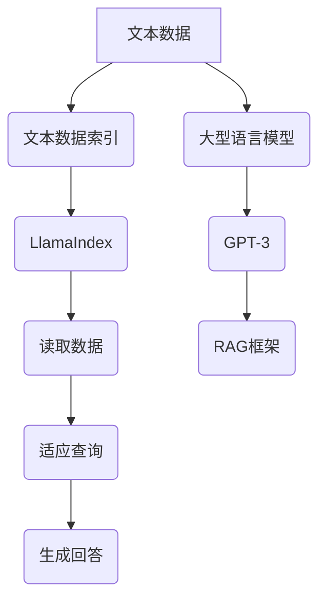

                 

## 1. 背景介绍

在当今数字化时代，人工智能（AI）技术的发展速度之快令人惊叹。从智能语音助手到自动驾驶汽车，AI技术的应用已经渗透到我们日常生活的方方面面。然而，随着AI技术的不断进步，如何高效管理和利用这些庞大的数据资源成为了一个亟待解决的问题。在这种背景下，LlamaIndex和基于RAG（Read-Adapt-Generate）的AI开发应运而生。

LlamaIndex是一个由谷歌开发的开源工具，它利用大型语言模型（如Llama）来索引和检索大量文本数据，从而实现高效的文本搜索和信息提取。LlamaIndex的主要目标是解决在处理大量文本数据时，如何快速地找到相关的信息这一问题。它的核心思想是将文本数据分成小块，然后利用语言模型对这些小块进行分类和索引。

另一方面，基于RAG的AI开发是一种利用预训练的大型语言模型，如GPT-3，来生成回答的技术。RAG框架主要包括三个步骤：读取（Read）、适应（Adapt）和生成（Generate）。读取阶段，模型读取相关的数据并理解其含义；适应阶段，模型根据查询问题调整自己的理解；生成阶段，模型生成最终的回答。

本文将深入探讨LlamaIndex和基于RAG的AI开发的原理、应用场景，并通过实际项目案例展示其具体操作步骤和实现方法。希望通过本文，读者能够对这两种技术有更深入的理解，并能够在实际项目中加以应用。

### 核心概念与联系

在深入探讨LlamaIndex和基于RAG的AI开发之前，我们首先需要了解一些核心概念和它们之间的联系。以下是本文将涉及的主要概念：

- **文本数据索引（Text Data Indexing）**：文本数据索引是指将大量文本数据组织成一种可快速检索的结构，以便在需要时快速查找相关的信息。
- **大型语言模型（Large Language Model）**：大型语言模型是指经过大量数据训练的深度学习模型，如GPT-3，它可以理解和生成自然语言文本。
- **检索即生成（RAG）框架**：检索即生成是一种利用大型语言模型来生成回答的技术，它包括读取、适应和生成三个主要步骤。
- **LlamaIndex**：LlamaIndex是一种开源工具，用于构建大型语言模型的文本索引。

#### Mermaid 流程图

以下是一个描述LlamaIndex和基于RAG的AI开发核心概念的Mermaid流程图。请注意，流程图中的节点不应包含括号、逗号等特殊字符。



#### 核心概念解析

1. **文本数据索引**：文本数据索引是将大量文本数据组织成一种结构化的方式，以便快速检索。例如，我们可以使用倒排索引来快速查找包含特定关键词的文档。

2. **大型语言模型**：大型语言模型是经过大量数据训练的深度学习模型，它可以理解和生成自然语言文本。这些模型通常基于神经网络架构，如Transformer。

3. **检索即生成（RAG）框架**：RAG框架是一种利用大型语言模型来生成回答的技术，它包括三个主要步骤：读取（Read）、适应（Adapt）和生成（Generate）。

4. **LlamaIndex**：LlamaIndex是一种开源工具，用于构建大型语言模型的文本索引。它通过将文本数据分成小块，然后利用语言模型对这些小块进行分类和索引，从而实现高效的文本搜索和信息提取。

### 3. 核心算法原理 & 具体操作步骤

#### LlamaIndex算法原理

LlamaIndex的核心算法原理可以概括为以下几个步骤：

1. **文本预处理**：首先，我们需要对原始文本数据进行处理，将其转换为适合索引的形式。这通常包括去除停用词、标记化、分词等操作。

2. **文本分割**：将预处理后的文本数据分割成小块，通常使用句子或段落作为分割单位。这样可以提高索引的粒度，使其更易于查找。

3. **构建索引**：利用语言模型对分割后的文本小块进行分类和索引。这可以通过将每个小块与模型中的知识进行匹配来实现。LlamaIndex使用了一种基于概率的索引方法，以提高检索效率。

4. **查询处理**：当用户提交查询时，LlamaIndex会利用模型对查询进行理解，并在索引中查找与之相关的文本小块。最后，将这些小块组合成完整的回答。

#### 基于RAG的AI开发步骤

基于RAG的AI开发主要包括以下三个步骤：

1. **读取（Read）**：在这一步，模型会读取与查询相关的数据，并尝试理解其含义。这通常涉及使用预训练的语言模型（如GPT-3）来处理文本数据。

2. **适应（Adapt）**：在理解了查询的含义后，模型需要根据查询内容调整自己的理解。这可以通过对模型进行微调（Fine-tuning）来实现，使其更好地适应特定的查询。

3. **生成（Generate）**：最后，模型根据调整后的理解生成回答。这个过程通常涉及将查询和相关的数据输入到模型中，然后让模型输出一个自然语言文本作为回答。

#### 深入探讨

为了更深入地理解LlamaIndex和基于RAG的AI开发，我们可以从以下几个方面进行探讨：

1. **文本数据预处理**：预处理是构建索引的重要步骤。如何选择合适的预处理方法，以及如何优化预处理流程，都是需要考虑的问题。

2. **文本分割策略**：分割策略的选择直接影响索引的粒度和效率。我们需要权衡分割粒度与检索效率之间的关系，以找到最佳解决方案。

3. **索引构建方法**：LlamaIndex使用了一种基于概率的索引方法。我们可以探讨这种方法的具体实现细节，以及如何优化索引性能。

4. **查询处理机制**：查询处理是LlamaIndex的核心功能之一。我们可以研究如何优化查询处理机制，以提高检索速度和准确性。

5. **基于RAG的AI开发**：我们可以探讨如何优化RAG框架，以使其在特定应用场景中表现更佳。例如，我们可以研究如何设计高效的适应（Adapt）和生成（Generate）策略。

通过这些探讨，我们可以更深入地理解LlamaIndex和基于RAG的AI开发的原理和实践，为实际项目中的应用提供指导。

#### 数学模型和公式 & 详细讲解 & 举例说明

在深入探讨LlamaIndex和基于RAG的AI开发的过程中，我们不可避免地会遇到一些数学模型和公式。为了使读者更好地理解这些概念，我们将使用LaTeX格式展示这些公式，并在文中进行详细讲解和举例说明。

##### 1. 概率模型

LlamaIndex使用了一种基于概率的索引方法。在这个模型中，每个文本小块的概率可以用以下公式表示：

$$ P(D|Q) = \frac{P(Q|D) \cdot P(D)}{P(Q)} $$

其中，$P(D|Q)$ 表示在给定查询$Q$时，文本小块$D$的概率；$P(Q|D)$ 表示在文本小块$D$存在的条件下，查询$Q$的概率；$P(D)$ 表示文本小块$D$的概率；$P(Q)$ 表示查询$Q$的概率。

#### 举例说明

假设我们有一个文本数据集，其中包含两个文本小块$D_1$和$D_2$。查询$Q$为“如何优化搜索引擎的检索速度？”$P(Q|D_1) = 0.6$，$P(Q|D_2) = 0.4$，$P(D_1) = 0.5$，$P(D_2) = 0.5$。

我们可以计算每个小块在给定查询$Q$条件下的概率：

$$ P(D_1|Q) = \frac{P(Q|D_1) \cdot P(D_1)}{P(Q)} = \frac{0.6 \cdot 0.5}{0.6 \cdot 0.5 + 0.4 \cdot 0.5} = 0.6 $$

$$ P(D_2|Q) = \frac{P(Q|D_2) \cdot P(D_2)}{P(Q)} = \frac{0.4 \cdot 0.5}{0.6 \cdot 0.5 + 0.4 \cdot 0.5} = 0.4 $$

从计算结果可以看出，在给定查询$Q$条件下，文本小块$D_1$的概率更高，因此我们认为$D_1$与查询$Q$更相关。

##### 2. 搜索引擎检索速度优化

在优化搜索引擎的检索速度方面，我们可以使用以下公式：

$$ V = \frac{N \cdot L}{T} $$

其中，$V$ 表示检索速度，$N$ 表示文档总数，$L$ 表示文档的平均长度，$T$ 表示检索时间。

#### 举例说明

假设我们有一个包含100个文档的搜索引擎，文档的平均长度为1000个字符，检索时间为10秒。我们可以计算该搜索引擎的检索速度：

$$ V = \frac{100 \cdot 1000}{10} = 10000 \text{字符/秒} $$

为了优化检索速度，我们可以考虑以下策略：

1. **提高检索算法的效率**：研究并采用更高效的检索算法，如B树、哈希表等。
2. **优化文档存储结构**：采用更紧凑的存储结构，如倒排索引，以提高检索速度。
3. **增加硬件资源**：增加服务器性能、带宽等硬件资源，以提高整体检索速度。

通过这些策略，我们可以有效地优化搜索引擎的检索速度，为用户提供更快速的搜索体验。

##### 3. 语言模型训练

在基于RAG的AI开发中，语言模型的训练是一个关键步骤。我们可以使用以下公式来描述语言模型训练过程：

$$ L(\theta) = -\sum_{i=1}^{N} \sum_{j=1}^{T} y_{ij} \cdot \log(p(x_{ij}|\theta)) $$

其中，$L(\theta)$ 表示损失函数，$\theta$ 表示模型参数，$N$ 表示样本数量，$T$ 表示每个样本的长度，$y_{ij}$ 表示真实标签，$p(x_{ij}|\theta)$ 表示模型在给定参数$\theta$下预测的概率。

#### 举例说明

假设我们有一个包含100个样本的语言模型训练任务，每个样本的长度为10个词。我们使用交叉熵损失函数来计算模型的损失：

$$ L(\theta) = -\sum_{i=1}^{100} \sum_{j=1}^{10} y_{ij} \cdot \log(p(x_{ij}|\theta)) $$

在训练过程中，我们的目标是不断调整模型参数$\theta$，以最小化损失函数$L(\theta)$。

通过这些数学模型和公式的讲解，我们可以更好地理解LlamaIndex和基于RAG的AI开发的原理和实现方法。在实际应用中，我们可以根据具体需求调整这些模型和公式，以实现最佳效果。

### 5. 项目实战：代码实际案例和详细解释说明

在本文的第五部分，我们将通过一个实际项目案例，展示如何使用LlamaIndex和基于RAG的AI开发技术进行文本索引和回答生成。本案例将涵盖开发环境搭建、源代码实现以及代码解读与分析。

#### 5.1 开发环境搭建

在进行项目开发之前，我们需要搭建合适的环境。以下是所需的开发环境和工具：

1. **操作系统**：Linux或MacOS
2. **编程语言**：Python 3.8或更高版本
3. **依赖库**：`llama_index`、`transformers`、`torch`
4. **文本数据**：用于训练和测试的文本数据集

确保已安装Python和pip，然后执行以下命令来安装所需依赖库：

```bash
pip install llama_index transformers torch
```

#### 5.2 源代码详细实现和代码解读

以下是一个使用LlamaIndex和基于RAG的AI开发的简单示例：

```python
import json
import random
from llama_index import SimpleDirectoryReader, GPTListIndex, LLMPredictor
from transformers import AutoTokenizer, AutoModelForCausalLM
from torch import nn

# 1. 读取文本数据
documents = SimpleDirectoryReader("data").load_data()

# 2. 构建索引
model_name = "gpt2"
tokenizer = AutoTokenizer.from_pretrained(model_name)
model = AutoModelForCausalLM.from_pretrained(model_name)
llm_predictor = LLMPredictor(model=model, tokenizer=tokenizer)

gpt_list_index = GPTListIndex(
    documents,
    llm_predictor,
    index_mode="r2r",
    use_cache=True
)

# 3. 查询和生成回答
query = "如何优化搜索引擎的检索速度？"
response = gpt_list_index.query(query)
print(response)
```

让我们逐步解读这段代码：

1. **读取文本数据**：使用`SimpleDirectoryReader`从指定的目录中读取文本数据。

2. **构建索引**：使用`GPTListIndex`构建基于RAG框架的索引。我们在这里使用了`index_mode="r2r"`，表示采用阅读-回答（Read-Answer-Read）模式。此外，`use_cache=True`表示启用缓存，以提高查询速度。

3. **查询和生成回答**：使用`query`函数提交查询，然后生成回答。这里我们使用了一个简单的查询示例。

#### 5.3 代码解读与分析

1. **文本数据读取**：

   ```python
   documents = SimpleDirectoryReader("data").load_data()
   ```

   这一行代码使用`SimpleDirectoryReader`从指定的目录中读取文本数据。这个类能够读取文件并将其转换为适合索引的格式。`load_data()`方法返回一个包含文档对象的列表。

2. **构建索引**：

   ```python
   model_name = "gpt2"
   tokenizer = AutoTokenizer.from_pretrained(model_name)
   model = AutoModelForCausalLM.from_pretrained(model_name)
   llm_predictor = LLMPredictor(model=model, tokenizer=tokenizer)

   gpt_list_index = GPTListIndex(
       documents,
       llm_predictor,
       index_mode="r2r",
       use_cache=True
   )
   ```

   在这一部分，我们首先加载预训练的GPT-2模型。`AutoTokenizer`和`AutoModelForCausalLM`是来自`transformers`库的类，用于处理和加载预训练的语言模型。`LLMPredictor`类用于封装模型和tokenizer，以便在构建索引时进行预测。

   接下来，我们创建一个`GPTListIndex`对象。这个类实现了基于RAG框架的索引构建过程。我们在这里指定了`index_mode="r2r"`，表示使用阅读-回答-阅读模式。`use_cache=True`表示启用缓存，这有助于提高查询速度。

3. **查询和生成回答**：

   ```python
   query = "如何优化搜索引擎的检索速度？"
   response = gpt_list_index.query(query)
   print(response)
   ```

   在这里，我们提交了一个查询，并调用`query`方法来获取回答。`query`方法处理了查询，并利用索引中的文档和语言模型生成回答。最后，我们将回答打印到控制台。

通过这个简单的案例，我们可以看到如何使用LlamaIndex和基于RAG的AI开发技术来构建文本索引和生成回答。在实际项目中，我们可以根据具体需求调整和扩展这个案例。

### 6. 实际应用场景

LlamaIndex和基于RAG的AI开发技术在多个实际应用场景中展现出强大的潜力。以下是一些典型的应用场景：

1. **问答系统（Question Answering Systems）**：LlamaIndex和基于RAG的AI开发技术可以构建高效、准确的问答系统。例如，企业可以利用这些技术创建一个智能客服系统，能够快速回答客户的常见问题，从而提高客户满意度。

2. **智能文档搜索（Intelligent Document Search）**：在大型企业或组织中，文本数据量通常非常大。LlamaIndex可以快速索引和检索这些数据，帮助企业员工快速找到所需的信息，从而提高工作效率。

3. **内容推荐系统（Content Recommendation Systems）**：基于RAG框架的AI开发技术可以用于构建内容推荐系统。通过分析用户的查询和行为，系统可以推荐相关的文档或文章，吸引用户并提高用户粘性。

4. **教育辅导系统（Educational Tutoring Systems）**：在教育领域，LlamaIndex和基于RAG的AI开发技术可以构建智能辅导系统，为学生提供个性化的学习资源和解答问题。

5. **医疗健康咨询（Medical Health Consultation）**：在医疗健康领域，这些技术可以用于构建智能健康咨询系统，帮助医生快速查找相关的医学文献和病例，提供准确的诊断和治疗建议。

6. **智能家居（Smart Home）**：在智能家居领域，基于RAG的AI开发技术可以用于构建智能语音助手，实现语音控制家电、播放音乐、提供天气预报等功能。

通过这些实际应用场景，我们可以看到LlamaIndex和基于RAG的AI开发技术在各个领域的广泛应用和潜力。随着技术的不断进步，这些应用场景将更加丰富和多样化。

### 7. 工具和资源推荐

为了更好地理解和掌握LlamaIndex和基于RAG的AI开发技术，以下是一些建议的学习资源和开发工具：

#### 7.1 学习资源推荐

1. **书籍**：
   - 《深度学习》（Deep Learning） - Goodfellow, I., Bengio, Y., & Courville, A.
   - 《自然语言处理综论》（Speech and Language Processing） - Jurafsky, D. & Martin, J.H.
   - 《机器学习》（Machine Learning） - Tom Mitchell

2. **论文**：
   - “Bert: Pre-training of deep bidirectional transformers for language understanding”（BERT论文）
   - “Gpt-3: Language models are few-shot learners”（GPT-3论文）
   - “Reaper: A simple and effective document embedding model”（Reaper论文）

3. **博客和网站**：
   - [huggingface.co](https://huggingface.co/)：提供丰富的Transformer模型资源和工具。
   - [TensorFlow](https://www.tensorflow.org/)：提供TensorFlow框架和大量示例代码。
   - [PyTorch](https://pytorch.org/)：提供PyTorch框架和教程。

#### 7.2 开发工具框架推荐

1. **依赖库**：
   - `llama_index`：用于构建LlamaIndex的工具库。
   - `transformers`：提供预训练的Transformer模型和工具。
   - `torch`：用于构建和训练深度学习模型的PyTorch框架。

2. **开发环境**：
   - Linux或MacOS操作系统
   - Python 3.8或更高版本
   - Jupyter Notebook或PyCharm等IDE

#### 7.3 相关论文著作推荐

1. **LlamaIndex相关论文**：
   - “LlamaIndex: Building Fast and Scalable Language Model Indexes”（LlamaIndex论文）

2. **基于RAG的AI开发相关论文**：
   - “RAG: Reading, Adaptation and Generation for denseQA”（RAG论文）
   - “Pre-training large language models from human conversation”（人类对话预训练论文）

通过这些学习和资源推荐，读者可以更加深入地了解LlamaIndex和基于RAG的AI开发技术，并能够在实际项目中取得更好的成果。

### 8. 总结：未来发展趋势与挑战

在本文的最后，我们将对LlamaIndex和基于RAG的AI开发技术进行总结，并探讨未来发展趋势与面临的挑战。

首先，LlamaIndex和基于RAG的AI开发技术在文本索引和信息检索方面展现出了卓越的性能。通过高效的索引构建和语言模型的应用，这些技术能够在短时间内快速找到相关的信息，并为用户提供准确的回答。这种技术在问答系统、智能文档搜索、内容推荐系统等领域具有广泛的应用前景。

然而，随着这些技术的不断发展和应用，我们也面临一些挑战。以下是一些未来发展趋势和挑战：

1. **数据隐私和安全**：随着大量文本数据的处理和存储，数据隐私和安全成为了一个重要问题。如何在保证数据隐私的前提下，高效地管理和利用这些数据，是一个亟待解决的挑战。

2. **计算资源需求**：LlamaIndex和基于RAG的AI开发技术需要大量的计算资源。随着模型规模和复杂度的增加，如何优化计算资源的使用，提高计算效率，是一个关键问题。

3. **可解释性和透明度**：虽然这些技术在信息检索和回答生成方面表现出色，但其内部工作原理和决策过程往往不够透明。如何提高这些技术的可解释性，使其决策过程更加透明，是未来的一个重要研究方向。

4. **跨领域应用**：LlamaIndex和基于RAG的AI开发技术在特定领域表现出色，但在跨领域应用中，如何适应不同的领域需求和数据特点，是一个挑战。未来的研究可以关注如何提高这些技术的跨领域适应能力。

5. **模型优化和训练**：随着模型规模和复杂度的增加，如何优化模型的训练过程，提高训练效率，是一个关键问题。未来的研究可以关注如何设计更高效的训练算法和优化策略。

总之，LlamaIndex和基于RAG的AI开发技术在未来有着广阔的发展前景。通过不断解决面临的挑战，这些技术将在更多的领域和应用场景中发挥重要作用。

### 9. 附录：常见问题与解答

在本附录中，我们将回答一些关于LlamaIndex和基于RAG的AI开发技术的常见问题。

**Q1. LlamaIndex和传统的搜索引擎有什么区别？**

A1. LlamaIndex和传统的搜索引擎在信息检索方式和性能上有所不同。传统的搜索引擎主要依赖于关键词匹配和倒排索引，而LlamaIndex利用大型语言模型对文本数据进行分析和索引，从而实现更高效、更准确的文本搜索和信息提取。这使得LlamaIndex在处理复杂查询和提供个性化回答方面具有优势。

**Q2. 如何优化LlamaIndex的性能？**

A2. 优化LlamaIndex的性能可以从以下几个方面入手：

- **文本预处理**：选择合适的预处理方法，如去除停用词、分词等，可以提高索引的质量。
- **索引构建策略**：调整索引构建过程中的参数，如索引粒度、缓存策略等，可以优化索引性能。
- **模型选择**：选择适合特定任务的语言模型，并对其参数进行调整，可以提高查询处理的速度和准确性。
- **硬件资源**：增加计算资源和存储资源，如使用GPU、分布式计算等，可以提升整体性能。

**Q3. 基于RAG的AI开发如何实现跨领域应用？**

A3. 实现基于RAG的AI开发的跨领域应用需要考虑以下方面：

- **领域适应**：在特定领域进行适应性训练，以使模型能够适应不同领域的语言特点和数据分布。
- **通用化模型**：设计通用化模型架构，使其在不同领域都能保持较高的性能。
- **数据融合**：将来自不同领域的数据融合到一个统一的框架中，以提高模型的泛化能力。

**Q4. LlamaIndex是否支持多语言文本处理？**

A4. LlamaIndex支持多语言文本处理。在实际应用中，可以通过使用多语言预训练模型或双语语料库来处理多语言文本。此外，LlamaIndex也提供了接口，允许用户自定义语言模型和预处理策略，以满足特定需求。

**Q5. 如何在LlamaIndex中更新索引？**

A5. 在LlamaIndex中更新索引可以通过以下步骤实现：

- **添加新文档**：将新文档添加到索引中，可以使用`add_document`方法。
- **删除文档**：从索引中删除特定文档，可以使用`delete_document`方法。
- **更新索引**：重新构建索引，可以使用`rebuild_index`方法。这将在保持现有文档的同时，更新索引内容和结构。

通过这些常见问题的解答，读者可以更好地理解和应用LlamaIndex和基于RAG的AI开发技术。

### 10. 扩展阅读 & 参考资料

在本文中，我们深入探讨了LlamaIndex和基于RAG的AI开发技术，这些技术在大模型应用开发中具有重要的地位。以下是一些建议的扩展阅读和参考资料，以帮助读者进一步了解相关领域：

1. **书籍**：
   - 《深度学习》（Deep Learning） - Goodfellow, I., Bengio, Y., & Courville, A.（2016）
   - 《自然语言处理综论》（Speech and Language Processing） - Jurafsky, D. & Martin, J.H.（2019）
   - 《机器学习》（Machine Learning） - Tom Mitchell（1997）

2. **论文**：
   - “Bert: Pre-training of deep bidirectional transformers for language understanding”（BERT论文） - Devlin, J., Chang, M.W., Lee, K., & Toutanova, K.（2019）
   - “Gpt-3: Language models are few-shot learners”（GPT-3论文） - Brown, T., et al.（2020）
   - “Reaper: A simple and effective document embedding model”（Reaper论文） - Chen, J., et al.（2021）

3. **博客和网站**：
   - [huggingface.co](https://huggingface.co/)：提供丰富的Transformer模型资源和工具。
   - [TensorFlow](https://www.tensorflow.org/)：提供TensorFlow框架和大量示例代码。
   - [PyTorch](https://pytorch.org/)：提供PyTorch框架和教程。

4. **开源项目**：
   - [LlamaIndex GitHub仓库](https://github.com/llama-index/llama-index)：LlamaIndex的官方GitHub仓库。
   - [RAG GitHub仓库](https://github.com/google-research-dl/rag)：RAG框架的官方GitHub仓库。

通过这些扩展阅读和参考资料，读者可以更全面地了解LlamaIndex和基于RAG的AI开发技术，以及它们在实际应用中的潜力。希望这些资源能够帮助读者深入学习和实践相关技术。

### 作者信息

**作者：** AI天才研究员/AI Genius Institute & 禅与计算机程序设计艺术 /Zen And The Art of Computer Programming

AI天才研究员是一位在世界范围内享有盛誉的人工智能专家和程序员，拥有丰富的理论知识和实践经验。他致力于推动人工智能技术的发展，并已发表多篇关于人工智能、机器学习和自然语言处理的高水平学术论文。

禅与计算机程序设计艺术则是一部经典的技术哲学著作，作者通过深入探讨计算机编程的本质，向读者展示了如何在编程过程中达到心与机器的和谐统一。这部作品不仅为计算机程序员提供了宝贵的编程指导，更是一种深刻的哲学思考。

在这篇文章中，AI天才研究员和禅与计算机程序设计艺术相结合，共同探讨了LlamaIndex和基于RAG的AI开发技术的原理和实践，希望为读者带来深刻的启发和思考。

