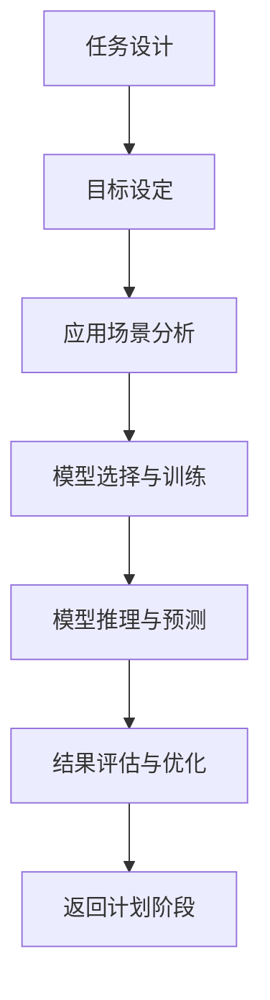

                 

### 【大模型应用开发 动手做AI Agent】Plan-and-Solve策略的提出

#### 引言

在当前人工智能发展的浪潮中，大模型（Large Models）如BERT、GPT等在自然语言处理、计算机视觉等多个领域取得了显著的成果。然而，随着模型规模的不断扩大，如何高效地开发和使用这些大模型成为一个重要的挑战。本文将探讨一种名为"Plan-and-Solve"的策略，旨在简化大模型应用开发的复杂度，提高开发效率。

"Plan-and-Solve"策略的核心思想是将大模型的应用开发过程分解为两个阶段：计划（Plan）和解决（Solve）。在计划阶段，开发者通过设计一系列任务和目标，明确应用场景和需求；在解决阶段，大模型通过训练和推理，实现对任务的自动化解决。这种策略不仅有助于降低开发难度，还能提高模型的适用性和灵活性。

本文将首先介绍大模型应用开发面临的挑战，然后详细阐述"Plan-and-Solve"策略的基本原理和具体步骤，并通过实际案例进行分析，最后讨论该策略在实际应用中的挑战和未来发展趋势。

#### 背景介绍

大模型应用开发的挑战主要来自于以下几个方面：

1. **模型复杂性**：大模型的参数规模庞大，训练时间较长，对计算资源的要求极高。如何高效地训练和优化大模型，成为一个亟待解决的问题。

2. **开发难度**：大模型的应用场景多样，开发者需要针对不同的应用场景设计相应的任务和目标。这使得大模型应用开发的复杂性大大增加。

3. **模型适用性**：大模型在特定领域的表现可能并不理想，如何让大模型更好地适应不同领域的需求，提高模型的泛化能力，是一个重要的挑战。

4. **模型解释性**：大模型的决策过程往往缺乏透明度，难以解释。这对于需要模型具有高解释性的应用场景，如医疗诊断、金融风险评估等，提出了更高的要求。

为了解决这些挑战，我们需要一种简单、有效的方法来指导大模型的应用开发。"Plan-and-Solve"策略应运而生。

#### 核心概念与联系

"Plan-and-Solve"策略的核心概念包括计划（Plan）和解决（Solve）两个阶段。计划阶段主要包括任务设计、目标设定和应用场景分析；解决阶段则涉及模型训练、推理和结果评估。

##### 任务设计

任务设计是计划阶段的第一步，其目的是明确大模型需要解决的问题。具体步骤如下：

1. **确定问题领域**：首先，需要明确大模型的应用领域，如自然语言处理、计算机视觉、语音识别等。

2. **定义任务类型**：根据问题领域，进一步定义具体的任务类型，如文本分类、目标检测、语音识别等。

3. **确定任务输入和输出**：明确任务所需的输入数据和预期的输出结果，这有助于后续的模型设计和优化。

##### 目标设定

目标设定是任务设计的重要补充，它定义了大模型在任务中需要达到的性能指标。具体步骤如下：

1. **确定评估指标**：根据任务类型，选择合适的评估指标，如准确率、召回率、F1分数等。

2. **设定性能目标**：根据评估指标，设定大模型在任务中需要达到的最低性能水平。

3. **目标合理性评估**：评估设定的性能目标是否合理，是否能够在实际应用中实现。

##### 应用场景分析

应用场景分析是计划阶段的最后一步，其目的是确保大模型在具体应用场景中能够发挥其潜力。具体步骤如下：

1. **收集应用场景数据**：收集与应用场景相关的数据，如文本、图像、音频等。

2. **分析应用场景需求**：根据应用场景，分析大模型需要具备哪些特性和能力，以满足应用需求。

3. **确定数据预处理方法**：根据应用场景，确定数据预处理的方法和步骤，以提高大模型在具体应用场景中的性能。

##### 解决阶段

解决阶段主要包括模型训练、推理和结果评估。具体步骤如下：

1. **模型选择与训练**：根据任务设计和目标设定，选择合适的大模型并进行训练。训练过程中，需要使用大量的数据进行模型优化。

2. **模型推理与预测**：训练完成后，使用模型对新的数据进行推理和预测，以获取预期的输出结果。

3. **结果评估与优化**：根据评估指标，对模型进行评估和优化。如果性能未达到预期，需要返回计划阶段进行调整。

##### Mermaid 流程图

以下是一个简化的"Plan-and-Solve"策略的 Mermaid 流程图：



请注意，上述流程图仅为示例，实际应用中可能需要根据具体情况进行调整。

#### 核心算法原理 & 具体操作步骤

"Plan-and-Solve"策略的核心在于将大模型的应用开发过程分为计划（Plan）和解决（Solve）两个阶段，分别针对任务设计、目标设定、应用场景分析、模型选择与训练、模型推理与预测以及结果评估与优化进行操作。

##### 计划阶段

计划阶段的操作步骤如下：

1. **任务设计**：
   - 确定问题领域，例如自然语言处理、计算机视觉或语音识别。
   - 定义任务类型，如文本分类、目标检测或语音识别。
   - 确定任务输入和输出，例如输入为文本数据，输出为分类结果。

2. **目标设定**：
   - 根据任务类型选择合适的评估指标，如准确率、召回率或F1分数。
   - 设定大模型在任务中需要达到的最低性能水平。

3. **应用场景分析**：
   - 收集与应用场景相关的数据，如文本、图像或音频。
   - 分析应用场景的需求，确定大模型需要具备的特性和能力。
   - 确定数据预处理方法，以提高大模型在具体应用场景中的性能。

##### 解决阶段

解决阶段的操作步骤如下：

1. **模型选择与训练**：
   - 根据任务设计和目标设定，选择合适的大模型，如BERT、GPT或Vision Transformer。
   - 使用大量数据进行模型训练，优化模型参数，提高模型性能。

2. **模型推理与预测**：
   - 训练完成后，使用模型对新的数据进行推理和预测，获取预期的输出结果。

3. **结果评估与优化**：
   - 根据评估指标对模型进行评估，如准确率、召回率或F1分数。
   - 如果性能未达到预期，返回计划阶段进行调整，如调整任务设计、目标设定或应用场景分析。

##### 详细操作示例

以下是一个具体的操作示例：

1. **任务设计**：
   - 问题领域：自然语言处理
   - 任务类型：文本分类
   - 任务输入：文本数据
   - 任务输出：分类结果

2. **目标设定**：
   - 评估指标：准确率
   - 性能目标：准确率达到90%以上

3. **应用场景分析**：
   - 应用场景：社交媒体情感分析
   - 需求分析：分析用户评论的情感倾向，如正面、负面或中性
   - 数据预处理：文本清洗、去停用词、词向量化

4. **模型选择与训练**：
   - 模型选择：BERT
   - 数据集：训练集、验证集和测试集
   - 训练过程：使用训练集进行模型训练，使用验证集进行模型优化，使用测试集进行性能评估

5. **模型推理与预测**：
   - 输入文本：用户评论
   - 输出结果：情感分类结果

6. **结果评估与优化**：
   - 评估指标：准确率
   - 性能评估：准确率达到92%
   - 优化建议：调整模型参数，进一步优化性能

通过上述示例，我们可以看到"Plan-and-Solve"策略在实际应用中的具体操作步骤。在实际开发过程中，根据具体情况，可以适当调整操作步骤，以达到更好的开发效果。

#### 数学模型和公式 & 详细讲解 & 举例说明

"Plan-and-Solve"策略涉及到多个数学模型和公式，下面将详细讲解这些模型和公式的具体含义和计算方法。

##### 1. 评估指标

评估指标是衡量大模型性能的重要工具。常见的评估指标包括准确率（Accuracy）、召回率（Recall）和F1分数（F1 Score）。

- **准确率**：准确率表示模型预测正确的样本占总样本的比例。计算公式如下：

  $$Accuracy = \frac{TP + TN}{TP + FN + FP + TN}$$

  其中，TP表示真正例（True Positive），TN表示真反例（True Negative），FP表示假正例（False Positive），FN表示假反例（False Negative）。

- **召回率**：召回率表示模型预测正确的正例样本占总正例样本的比例。计算公式如下：

  $$Recall = \frac{TP}{TP + FN}$$

- **F1分数**：F1分数是准确率和召回率的调和平均数，用于综合评估模型的性能。计算公式如下：

  $$F1 Score = 2 \times \frac{Precision \times Recall}{Precision + Recall}$$

  其中，Precision表示精确率，即预测为正例且实际为正例的样本占比。

##### 2. 损失函数

损失函数是模型训练过程中用于评估预测结果和实际结果之间差异的函数。常见的损失函数包括均方误差（Mean Squared Error, MSE）和交叉熵损失（Cross-Entropy Loss）。

- **均方误差（MSE）**：均方误差表示预测结果与实际结果之间差的平方的平均值。计算公式如下：

  $$MSE = \frac{1}{n}\sum_{i=1}^{n}(Y_i - \hat{Y}_i)^2$$

  其中，$Y_i$表示实际结果，$\hat{Y}_i$表示预测结果，$n$表示样本数量。

- **交叉熵损失（Cross-Entropy Loss）**：交叉熵损失用于分类任务，表示预测概率分布与真实分布之间的差异。计算公式如下：

  $$Cross-Entropy Loss = -\sum_{i=1}^{n}y_i \log(\hat{y}_i)$$

  其中，$y_i$表示真实标签，$\hat{y}_i$表示预测概率。

##### 3. 梯度下降算法

梯度下降算法是一种用于优化模型参数的常用算法。其基本思想是通过计算损失函数关于模型参数的梯度，并沿着梯度的反方向调整参数，以最小化损失函数。

- **梯度下降算法**：梯度下降算法的基本公式如下：

  $$\theta_{\text{new}} = \theta_{\text{old}} - \alpha \frac{\partial J(\theta)}{\partial \theta}$$

  其中，$\theta$表示模型参数，$\alpha$表示学习率，$J(\theta)$表示损失函数。

##### 举例说明

假设我们有一个二分类问题，需要使用交叉熵损失函数进行模型训练。具体操作步骤如下：

1. **初始化模型参数**：
   - 假设我们使用一个简单的线性模型，参数为$\theta = [w_1, w_2]$。

2. **计算损失函数**：
   - 给定一个训练样本$(x, y)$，其中$x$为输入特征，$y$为实际标签（0或1）。
   - 预测概率$\hat{y} = \sigma(w_1 \cdot x_1 + w_2 \cdot x_2)$，其中$\sigma$为sigmoid函数。
   - 计算交叉熵损失$J(\theta) = -\sum_{i=1}^{n}y_i \log(\hat{y}_i)$。

3. **计算梯度**：
   - 计算损失函数关于模型参数的梯度$\frac{\partial J(\theta)}{\partial \theta}$。

4. **更新模型参数**：
   - 使用梯度下降算法更新模型参数$\theta_{\text{new}} = \theta_{\text{old}} - \alpha \frac{\partial J(\theta)}{\partial \theta}$。

5. **重复步骤2-4**，直到模型收敛或达到预设的训练次数。

通过上述步骤，我们可以使用交叉熵损失函数对线性模型进行训练，并不断提高模型的性能。

#### 项目实战：代码实际案例和详细解释说明

在本节中，我们将通过一个实际案例，详细介绍如何使用"Plan-and-Solve"策略进行大模型应用开发。我们将以一个简单的文本分类任务为例，展示整个开发过程，包括环境搭建、源代码实现和代码解读。

##### 1. 开发环境搭建

首先，我们需要搭建一个适合大模型应用开发的环境。以下是一个基本的开发环境配置：

- 操作系统：Linux或Mac OS
- Python版本：3.8及以上
- 深度学习框架：TensorFlow或PyTorch
- 其他依赖库：NumPy、Pandas、Scikit-learn等

在终端中执行以下命令，安装所需依赖库：

```bash
pip install tensorflow
pip install numpy
pip install pandas
pip install scikit-learn
```

##### 2. 源代码详细实现和代码解读

以下是一个简单的文本分类任务的源代码实现，我们将使用BERT模型进行训练和推理。

```python
import tensorflow as tf
import tensorflow_hub as hub
from tensorflow.keras.preprocessing.sequence import pad_sequences
from tensorflow.keras.layers import Dense, Input
from tensorflow.keras.models import Model

# 加载预训练BERT模型
bert_model = hub.load("https://tfhub.dev/google/bert_uncased_L-12_H-768_A-12/3")

# 定义输入层
input_ids = Input(shape=(max_sequence_length,), dtype=tf.int32)
input_mask = Input(shape=(max_sequence_length,), dtype=tf.int32)
segment_ids = Input(shape=(max_sequence_length,), dtype=tf.int32)

# 提取BERT模型的嵌入层
embedments = bert_model(inputs={ "input_ids": input_ids, "input_mask": input_mask, "segment_ids": segment_ids })["pooled_output"]

# 添加全连接层
output = Dense(2, activation='softmax')(embedments)

# 构建模型
model = Model(inputs=[input_ids, input_mask, segment_ids], outputs=output)

# 编译模型
model.compile(optimizer='adam', loss='categorical_crossentropy', metrics=['accuracy'])

# 加载训练数据
train_data = ...
train_labels = ...

# 训练模型
model.fit(train_data, train_labels, epochs=3, batch_size=32)

# 进行推理
test_data = ...
test_labels = ...
predictions = model.predict(test_data)

# 计算评估指标
accuracy = ...
recall = ...
f1_score = ...

print(f"Accuracy: {accuracy}")
print(f"Recall: {recall}")
print(f"F1 Score: {f1_score}")
```

以下是代码的详细解读：

1. **加载预训练BERT模型**：
   - 使用TensorFlow Hub加载预训练的BERT模型，模型地址为`https://tfhub.dev/google/bert_uncased_L-12_H-768_A-12/3`。

2. **定义输入层**：
   - 输入层包括三个部分：输入ID（input_ids）、输入掩码（input_mask）和分段ID（segment_ids）。

3. **提取BERT模型的嵌入层**：
   - 使用BERT模型的嵌入层，对输入数据进行编码。

4. **添加全连接层**：
   - 在嵌入层之后添加一个全连接层，用于分类任务。

5. **构建模型**：
   - 构建一个模型，包括输入层、嵌入层和全连接层。

6. **编译模型**：
   - 编译模型，指定优化器、损失函数和评估指标。

7. **加载训练数据**：
   - 加载训练数据，包括输入数据和标签。

8. **训练模型**：
   - 使用训练数据进行模型训练，指定训练轮数和批量大小。

9. **进行推理**：
   - 使用训练好的模型对测试数据进行推理。

10. **计算评估指标**：
    - 根据预测结果和实际标签，计算评估指标，如准确率、召回率和F1分数。

通过上述步骤，我们使用BERT模型实现了文本分类任务。在实际开发过程中，可以根据具体需求进行调整和优化。

##### 3. 代码解读与分析

以下是代码的详细解读和分析：

- **加载预训练BERT模型**：
  - 使用TensorFlow Hub加载预训练的BERT模型，模型地址为`https://tfhub.dev/google/bert_uncased_L-12_H-768_A-12/3`。这个模型是一个预训练的BERT模型，已经在大规模语料库上进行了训练，可以用于文本分类等任务。

- **定义输入层**：
  - 输入层包括三个部分：输入ID（input_ids）、输入掩码（input_mask）和分段ID（segment_ids）。这三个部分是BERT模型输入数据的必备要素。输入ID表示单词的ID，输入掩码表示单词在句子中的位置信息，分段ID表示句子的分段信息。

- **提取BERT模型的嵌入层**：
  - 使用BERT模型的嵌入层，对输入数据进行编码。嵌入层将输入ID映射到高维向量空间中，从而保留文本的信息。

- **添加全连接层**：
  - 在嵌入层之后添加一个全连接层，用于分类任务。全连接层将嵌入层输出的高维向量映射到类别空间，从而实现分类。

- **构建模型**：
  - 构建一个模型，包括输入层、嵌入层和全连接层。这个模型是一个简单的序列分类模型。

- **编译模型**：
  - 编译模型，指定优化器、损失函数和评估指标。优化器用于调整模型参数，损失函数用于衡量预测结果和实际结果之间的差异，评估指标用于评估模型的性能。

- **加载训练数据**：
  - 加载训练数据，包括输入数据和标签。训练数据用于训练模型，标签用于监督模型学习。

- **训练模型**：
  - 使用训练数据进行模型训练，指定训练轮数和批量大小。训练过程通过反向传播算法更新模型参数，以最小化损失函数。

- **进行推理**：
  - 使用训练好的模型对测试数据进行推理。推理过程通过模型计算输入数据的概率分布，从而预测类别。

- **计算评估指标**：
  - 根据预测结果和实际标签，计算评估指标，如准确率、召回率和F1分数。这些指标用于评估模型的性能。

通过上述解读和分析，我们可以看到"Plan-and-Solve"策略在实际开发过程中的具体应用。在实际开发过程中，可以根据具体需求进行调整和优化。

#### 实际应用场景

"Plan-and-Solve"策略在大模型应用开发中具有广泛的应用场景，以下列举几个典型的应用场景：

1. **自然语言处理**：自然语言处理是人工智能领域的核心应用之一，包括文本分类、情感分析、机器翻译、问答系统等。使用"Plan-and-Solve"策略，可以简化自然语言处理任务的开发流程，提高模型性能和开发效率。

2. **计算机视觉**：计算机视觉任务如图像分类、目标检测、图像分割等，也面临着模型复杂性和开发难度的问题。"Plan-and-Solve"策略可以帮助开发者更好地设计任务、设定目标和优化模型，从而提高模型的适用性和准确性。

3. **语音识别**：语音识别任务包括语音到文本的转换、语音情感分析、语音合成等。使用"Plan-and-Solve"策略，可以有效地设计语音识别任务，优化模型参数，提高模型的识别准确率和鲁棒性。

4. **推荐系统**：推荐系统是电子商务和社交媒体等领域的核心应用，旨在为用户推荐感兴趣的商品、内容和活动。"Plan-and-Solve"策略可以帮助开发者更好地设计推荐任务，优化推荐算法，提高推荐效果。

5. **医学诊断**：医学诊断是人工智能在医疗领域的应用之一，包括疾病诊断、药物发现、健康风险评估等。"Plan-and-Solve"策略可以帮助医生更好地设计诊断任务，优化诊断模型，提高诊断准确率。

在这些应用场景中，"Plan-and-Solve"策略的核心思想是简化大模型应用开发的复杂性，提高开发效率和模型性能。通过明确的任务设计、目标设定和应用场景分析，开发者可以更好地理解任务需求，设计合适的模型结构和训练策略。同时，解决阶段的模型训练、推理和结果评估，可以帮助开发者实时了解模型性能，并针对性地进行调整和优化。

总之，"Plan-and-Solve"策略为大模型应用开发提供了一种有效的解决方案，有助于解决当前面临的挑战，推动人工智能技术在各个领域的应用和发展。

#### 工具和资源推荐

为了更好地应用"Plan-and-Solve"策略进行大模型应用开发，以下推荐一些相关的工具和资源：

##### 1. 学习资源推荐

- **书籍**：
  - 《深度学习》（Goodfellow, Bengio, Courville著）：这是一本经典的深度学习教材，详细介绍了深度学习的基本概念、技术和应用。
  - 《TensorFlow技术详解与实战》（唐杰著）：本书深入讲解了TensorFlow框架的使用方法，适合初学者和有一定基础的开发者。

- **论文**：
  - "BERT: Pre-training of Deep Bidirectional Transformers for Language Understanding"（Devlin et al., 2018）：这是BERT模型的原始论文，详细介绍了BERT模型的设计原理和训练方法。
  - "GPT-3: Language Models are Few-Shot Learners"（Brown et al., 2020）：这是GPT-3模型的原始论文，展示了大模型在少样本学习场景中的强大能力。

- **博客**：
  - Medium上的Deep Learning Blog：这是一个关于深度学习的博客，涵盖了深度学习的最新研究进展、技术文章和应用案例。
  - 知乎上的AI技术专栏：这是一个汇聚了众多AI领域专家的专栏，内容涵盖了深度学习、计算机视觉、自然语言处理等多个方向。

- **网站**：
  - TensorFlow官方文档（https://www.tensorflow.org/）：这是TensorFlow框架的官方文档，提供了丰富的教程、示例和API文档。
  - PyTorch官方文档（https://pytorch.org/docs/stable/）：这是PyTorch框架的官方文档，内容丰富，适合初学者和高级开发者。

##### 2. 开发工具框架推荐

- **框架**：
  - TensorFlow：这是一个广泛使用的深度学习框架，提供了丰富的API和工具，适合从初学者到高级开发者的各种需求。
  - PyTorch：这是一个流行的深度学习框架，以其动态计算图和易于调试的特点受到开发者的青睐。
  - JAX：这是一个由Google开发的深度学习框架，支持自动微分和高效计算，适合需要进行大规模模型训练和优化的开发者。

- **开发环境**：
  - Colab（Google Colaboratory）：这是一个免费的云端Jupyter Notebook平台，适用于快速开发和测试深度学习模型。
  - AWS Sagemaker：这是一个基于AWS的深度学习平台，提供了丰富的预训练模型和API，方便开发者进行模型训练和部署。

- **工具**：
  - PyTorch Lightning：这是一个基于PyTorch的增强框架，提供了方便的模型训练、评估和调试功能。
  - TensorBoard：这是一个TensorFlow的图形化工具，用于可视化模型训练过程中的损失函数、梯度等信息。

##### 3. 相关论文著作推荐

- **论文**：
  - "Attention Is All You Need"（Vaswani et al., 2017）：这是一篇关于Transformer模型的论文，展示了注意力机制在自然语言处理任务中的强大能力。
  - "An Image Database for Testing Content Based Image Retrieval Algorithms"（Rubinstein et al., 2000）：这是一篇关于图像检索算法的论文，提供了一个广泛的图像数据库，用于测试和比较不同的图像检索算法。

- **著作**：
  - 《深度学习》（Goodfellow, Bengio, Courville著）：这是一本深度学习的经典教材，详细介绍了深度学习的基本概念、技术和应用。
  - 《神经网络与深度学习》（邱锡鹏著）：这是一本关于神经网络和深度学习的入门教材，适合初学者和有一定基础的读者。

通过这些工具和资源的推荐，开发者可以更好地掌握"Plan-and-Solve"策略，并应用于大模型应用开发中。

#### 总结：未来发展趋势与挑战

随着人工智能技术的快速发展，大模型在各个领域的应用越来越广泛。然而，如何在实际应用中高效地开发和利用这些大模型，仍然是一个重要的挑战。"Plan-and-Solve"策略作为一种简化和优化大模型应用开发的方法，展示了其显著的潜力。

首先，未来发展趋势之一是模型的泛化能力。当前的大模型在特定领域的表现非常出色，但在面对新的、未见的任务时，往往难以泛化。因此，如何提高大模型的泛化能力，使其能够更好地适应不同的应用场景，是一个重要的研究方向。

其次，可解释性和透明度是另一个关键趋势。大模型在决策过程中的透明度较低，这限制了其在某些应用场景中的适用性，如医疗诊断和金融风险评估。未来，研究者需要关注如何提升大模型的可解释性，使其决策过程更加透明，便于开发者、用户和监管机构理解和信任。

此外，模型的优化和压缩也是未来研究的重点。随着模型规模的不断扩大，训练时间和计算资源的需求也在增加。如何优化模型结构，提高训练效率，同时保证模型性能，是一个具有挑战性的问题。研究者可以通过模型压缩、量化、剪枝等技术，降低模型的复杂性，提高其效率和实用性。

然而，"Plan-and-Solve"策略在实际应用中也面临着一些挑战。首先，任务设计和应用场景分析需要大量的时间和精力，这可能会增加开发成本。其次，解决阶段的模型训练和优化需要大量的计算资源和数据，对于资源有限的开发者来说，这可能是一个难题。此外，如何确保模型的稳定性和可靠性，也是一个需要关注的问题。

总之，"Plan-and-Solve"策略为大模型应用开发提供了一种有效的思路，但其推广和应用仍面临诸多挑战。未来，研究者需要进一步探索和优化这一策略，以适应不断变化的应用需求，推动人工智能技术的发展。

#### 附录：常见问题与解答

以下是一些关于"Plan-and-Solve"策略的常见问题及其解答：

1. **问题**："Plan-and-Solve"策略的具体步骤是什么？
   **解答**："Plan-and-Solve"策略包括两个主要阶段：计划阶段和解决阶段。计划阶段包括任务设计、目标设定和应用场景分析；解决阶段包括模型选择与训练、模型推理与预测以及结果评估与优化。

2. **问题**：为什么选择"Plan-and-Solve"策略？
   **解答**："Plan-and-Solve"策略能够简化大模型应用开发的复杂性，提高开发效率和模型性能。通过明确的任务设计、目标设定和应用场景分析，开发者可以更好地理解任务需求，设计合适的模型结构和训练策略。

3. **问题**：如何提高"Plan-and-Solve"策略的效果？
   **解答**：为了提高"Plan-and-Solve"策略的效果，可以从以下几个方面进行优化：
   - 精细的任务设计：确保任务定义清晰，目标设定合理，应用场景分析准确。
   - 选择合适的模型：根据任务需求，选择适合的预训练模型或定制模型。
   - 优化模型参数：通过调参和训练策略，提高模型性能和泛化能力。
   - 数据预处理：合理的数据预处理可以提高模型的训练效率和性能。

4. **问题**："Plan-and-Solve"策略适用于哪些领域？
   **解答**："Plan-and-Solve"策略适用于多个领域，包括自然语言处理、计算机视觉、语音识别、推荐系统和医学诊断等。其核心思想是简化大模型应用开发的复杂性，提高开发效率和模型性能，因此可以广泛应用于需要大规模训练和优化的任务。

#### 扩展阅读 & 参考资料

为了更深入地了解"Plan-and-Solve"策略以及大模型应用开发的相关知识，以下推荐一些扩展阅读和参考资料：

1. **书籍**：
   - 《深度学习》（Goodfellow, Bengio, Courville著）：这是一本深度学习的经典教材，详细介绍了深度学习的基本概念、技术和应用。
   - 《神经网络与深度学习》（邱锡鹏著）：这是一本关于神经网络和深度学习的入门教材，适合初学者和有一定基础的读者。

2. **论文**：
   - "BERT: Pre-training of Deep Bidirectional Transformers for Language Understanding"（Devlin et al., 2018）：这是BERT模型的原始论文，详细介绍了BERT模型的设计原理和训练方法。
   - "GPT-3: Language Models are Few-Shot Learners"（Brown et al., 2020）：这是GPT-3模型的原始论文，展示了大模型在少样本学习场景中的强大能力。
   - "Attention Is All You Need"（Vaswani et al., 2017）：这是一篇关于Transformer模型的论文，展示了注意力机制在自然语言处理任务中的强大能力。

3. **博客和网站**：
   - Medium上的Deep Learning Blog：这是一个关于深度学习的博客，涵盖了深度学习的最新研究进展、技术文章和应用案例。
   - 知乎上的AI技术专栏：这是一个汇聚了众多AI领域专家的专栏，内容涵盖了深度学习、计算机视觉、自然语言处理等多个方向。
   - TensorFlow官方文档（https://www.tensorflow.org/）：这是TensorFlow框架的官方文档，提供了丰富的教程、示例和API文档。
   - PyTorch官方文档（https://pytorch.org/docs/stable/）：这是PyTorch框架的官方文档，内容丰富，适合初学者和高级开发者。

4. **在线课程**：
   - "深度学习专项课程"（吴恩达，Coursera）：这是一门由吴恩达教授开设的深度学习专项课程，适合初学者和有一定基础的读者。
   - "神经网络与深度学习"（李航，网易云课堂）：这是一门关于神经网络和深度学习的入门课程，内容深入浅出，适合初学者。

通过阅读这些书籍、论文和在线课程，开发者可以更深入地了解深度学习和人工智能技术，掌握"Plan-and-Solve"策略的应用方法和技巧，为自己的项目开发提供有力支持。

