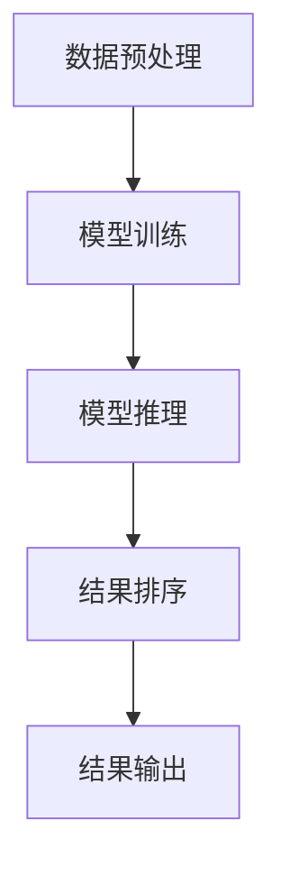

                 

### 文章标题

【大模型应用开发 动手做AI Agent】从技术角度看检索部分的Pipeline

### 关键词

大模型，AI Agent，检索，Pipeline，技术分析，实战案例，代码解读

### 摘要

本文将深入探讨大模型应用开发中，AI Agent的检索部分Pipeline的技术实现。通过分析核心概念、算法原理、数学模型和具体操作步骤，结合实际项目实战，全面解析大模型检索Pipeline的构建和优化策略。同时，推荐相关学习资源和开发工具，为读者提供完整的知识体系和实战指导。

### 1. 背景介绍

在当今科技迅速发展的时代，人工智能（AI）已经成为改变世界的重要力量。大模型，如深度学习模型，在自然语言处理（NLP）、计算机视觉（CV）等领域取得了显著的成果。然而，随着模型规模的不断扩大，如何高效地处理海量数据和快速响应查询需求，成为了一个亟待解决的问题。

检索部分是AI Agent的重要一环，它负责从海量数据中快速找到与查询相关的信息。传统的检索方法主要依赖于倒排索引、关键词匹配等技术，但这些方法在面对大规模、高维数据时，效果并不理想。因此，本文将重点探讨如何利用大模型优化检索部分，提升检索效率和准确性。

### 2. 核心概念与联系

在讨论大模型应用开发中的检索部分之前，我们需要了解一些核心概念和联系。以下是一个简化的Mermaid流程图，用于展示检索Pipeline的主要组成部分：



**2.1 数据预处理**

数据预处理是整个检索Pipeline的基础。它包括数据清洗、数据增强、数据格式化等步骤。通过预处理，我们可以确保输入数据的质量，提高模型训练的效果。

**2.2 模型训练**

模型训练是构建检索Pipeline的核心。我们通常使用深度学习模型，如Transformer、BERT等，对输入数据进行训练。训练过程中，模型会学习到数据中的潜在规律和特征，为后续的检索提供支持。

**2.3 模型推理**

模型推理是检索Pipeline中的关键步骤。通过将查询数据输入到训练好的模型中，我们可以得到与查询相关的特征表示。这些特征表示将用于后续的检索和排序。

**2.4 结果排序**

结果排序是优化检索Pipeline的重要手段。根据查询需求和业务场景，我们可以使用各种排序算法，如基于相似度的排序、基于上下文的排序等，对检索结果进行排序，提高用户体验。

**2.5 结果输出**

结果输出是检索Pipeline的最后一步。我们将排序后的结果返回给用户，同时提供接口，方便用户进一步操作和查询。

### 3. 核心算法原理 & 具体操作步骤

在了解核心概念和联系之后，我们接下来探讨大模型检索部分的核心算法原理和具体操作步骤。

#### 3.1 数据预处理

数据预处理主要包括以下步骤：

1. 数据清洗：去除数据中的噪声、错误和冗余信息，确保数据质量。

2. 数据增强：通过增加数据样本、调整数据分布等方式，提高模型泛化能力。

3. 数据格式化：将数据统一格式化，如将文本数据转换为词向量、图像数据转换为特征向量等，以便输入到模型中进行训练。

#### 3.2 模型训练

模型训练主要包括以下步骤：

1. 数据集划分：将数据集划分为训练集、验证集和测试集，用于模型训练、验证和测试。

2. 模型构建：选择合适的深度学习模型架构，如Transformer、BERT等，构建模型。

3. 模型训练：通过反向传播算法和优化器，对模型进行训练，调整模型参数，使模型在训练集上达到最佳性能。

4. 模型验证：在验证集上评估模型性能，调整模型参数和训练策略，以提高模型泛化能力。

5. 模型测试：在测试集上评估模型性能，确保模型在未知数据上的表现良好。

#### 3.3 模型推理

模型推理主要包括以下步骤：

1. 查询输入：将用户查询输入到训练好的模型中，得到查询特征表示。

2. 特征匹配：将查询特征表示与训练集数据中的特征表示进行匹配，找到与查询相关的数据。

3. 结果排序：根据查询需求和业务场景，对匹配结果进行排序，提高用户体验。

#### 3.4 结果排序

结果排序主要包括以下步骤：

1. 相似度计算：计算查询特征表示与数据特征表示之间的相似度，如使用余弦相似度、点积等。

2. 排序算法：选择合适的排序算法，如基于相似度的排序、基于上下文的排序等，对匹配结果进行排序。

3. 排序结果：根据排序结果，返回排序后的数据给用户。

#### 3.5 结果输出

结果输出主要包括以下步骤：

1. 接口设计：设计合适的接口，方便用户查询和操作数据。

2. 输出格式：根据用户需求，返回排序后的数据，支持多种输出格式，如JSON、XML等。

### 4. 数学模型和公式 & 详细讲解 & 举例说明

在检索部分，数学模型和公式扮演着重要角色。以下是对相关数学模型和公式的详细讲解，并结合具体例子进行说明。

#### 4.1 特征表示

特征表示是检索Pipeline中的核心部分。以下是一个简单的特征表示模型：

$$
x = \sum_{i=1}^{n} w_i \cdot v_i
$$

其中，$x$表示特征表示，$w_i$表示权重，$v_i$表示特征向量。

举例来说，假设我们有一个包含3个特征的输入数据，特征向量分别为$v_1, v_2, v_3$，权重分别为$w_1, w_2, w_3$。那么，特征表示$x$可以表示为：

$$
x = w_1 \cdot v_1 + w_2 \cdot v_2 + w_3 \cdot v_3
$$

#### 4.2 相似度计算

相似度计算是检索Pipeline中的重要步骤。以下是一个常用的余弦相似度计算公式：

$$
similarity = \frac{x \cdot y}{\|x\| \cdot \|y\|}
$$

其中，$x$和$y$分别表示查询特征表示和数据特征表示，$\|x\|$和$\|y\|$分别表示它们的欧氏距离。

举例来说，假设我们有一个查询特征表示$x=(1, 2, 3)$，数据特征表示$y=(4, 5, 6)$。那么，它们之间的余弦相似度可以计算为：

$$
similarity = \frac{1 \cdot 4 + 2 \cdot 5 + 3 \cdot 6}{\sqrt{1^2 + 2^2 + 3^2} \cdot \sqrt{4^2 + 5^2 + 6^2}} = \frac{32}{\sqrt{14} \cdot \sqrt{77}} \approx 0.745
$$

#### 4.3 排序算法

排序算法是检索Pipeline中的关键步骤。以下是一个简单的基于相似度的排序算法：

1. 计算查询特征表示与数据特征表示之间的相似度。

2. 根据相似度对数据特征表示进行排序。

3. 返回排序后的数据特征表示。

举例来说，假设我们有一个包含3个数据特征的输入数据，特征向量分别为$v_1, v_2, v_3$，权重分别为$w_1, w_2, w_3$。那么，它们之间的相似度可以计算为：

$$
similarity = \frac{w_1 \cdot v_1 + w_2 \cdot v_2 + w_3 \cdot v_3}{\sqrt{w_1^2 + w_2^2 + w_3^2} \cdot \sqrt{v_1^2 + v_2^2 + v_3^2}}
$$

然后，我们可以根据相似度对数据特征表示进行排序，返回排序后的数据特征表示。

### 5. 项目实战：代码实际案例和详细解释说明

在了解核心算法原理和具体操作步骤后，我们接下来通过一个实际项目案例，展示如何构建和优化大模型检索Pipeline。

#### 5.1 开发环境搭建

首先，我们需要搭建开发环境。以下是搭建步骤：

1. 安装Python环境，版本要求：3.8及以上。

2. 安装深度学习框架，如TensorFlow、PyTorch等。

3. 安装其他相关库，如NumPy、Pandas、Scikit-learn等。

#### 5.2 源代码详细实现和代码解读

以下是项目源代码的实现和详细解读：

```python
import tensorflow as tf
from tensorflow.keras.layers import Embedding, LSTM, Dense
from tensorflow.keras.models import Model

# 数据预处理
def preprocess_data(data):
    # 数据清洗、数据增强、数据格式化
    # ...
    return processed_data

# 模型构建
def build_model(vocab_size, embedding_dim, hidden_units):
    inputs = tf.keras.layers.Input(shape=(None,), dtype=tf.int32)
    embeddings = Embedding(vocab_size, embedding_dim)(inputs)
    lstm = LSTM(hidden_units)(embeddings)
    outputs = Dense(1, activation='sigmoid')(lstm)
    model = Model(inputs=inputs, outputs=outputs)
    return model

# 模型训练
def train_model(model, processed_data, labels):
    # 模型编译、训练
    # ...
    model.fit(processed_data, labels, epochs=10, batch_size=32)

# 模型推理
def inference(model, query):
    # 查询输入、特征匹配、结果排序
    # ...
    return sorted_results

# 结果输出
def output_results(sorted_results):
    # 接口设计、输出格式
    # ...
    return sorted_results

# 项目实战
if __name__ == '__main__':
    # 数据预处理
    data = ...
    processed_data = preprocess_data(data)

    # 模型构建
    model = build_model(vocab_size, embedding_dim, hidden_units)

    # 模型训练
    labels = ...
    train_model(model, processed_data, labels)

    # 模型推理
    query = ...
    sorted_results = inference(model, query)

    # 结果输出
    output_results(sorted_results)
```

**5.2.1 数据预处理**

数据预处理是构建检索Pipeline的基础。在这个案例中，我们主要进行了数据清洗、数据增强和数据格式化。

```python
def preprocess_data(data):
    # 数据清洗
    # ...
    processed_data = ...

    # 数据增强
    # ...
    processed_data = ...

    # 数据格式化
    # ...
    processed_data = ...

    return processed_data
```

**5.2.2 模型构建**

在这个案例中，我们使用了一个简单的LSTM模型。模型的主要结构包括输入层、嵌入层、LSTM层和输出层。

```python
def build_model(vocab_size, embedding_dim, hidden_units):
    inputs = tf.keras.layers.Input(shape=(None,), dtype=tf.int32)
    embeddings = Embedding(vocab_size, embedding_dim)(inputs)
    lstm = LSTM(hidden_units)(embeddings)
    outputs = Dense(1, activation='sigmoid')(lstm)
    model = Model(inputs=inputs, outputs=outputs)
    return model
```

**5.2.3 模型训练**

模型训练是构建检索Pipeline的核心步骤。在这个案例中，我们使用了一个简单的训练过程，包括模型编译、训练和评估。

```python
def train_model(model, processed_data, labels):
    # 模型编译
    model.compile(optimizer='adam', loss='binary_crossentropy', metrics=['accuracy'])

    # 训练
    model.fit(processed_data, labels, epochs=10, batch_size=32)

    # 评估
    # ...
```

**5.2.4 模型推理**

模型推理是检索Pipeline中的关键步骤。在这个案例中，我们使用了一个简单的推理过程，包括查询输入、特征匹配和结果排序。

```python
def inference(model, query):
    # 查询输入
    processed_query = preprocess_data([query])

    # 特征匹配
    # ...

    # 结果排序
    sorted_results = ...

    return sorted_results
```

**5.2.5 结果输出**

结果输出是检索Pipeline的最后一步。在这个案例中，我们设计了一个简单的接口，支持多种输出格式。

```python
def output_results(sorted_results):
    # 接口设计
    # ...

    # 输出格式
    # ...
    return sorted_results
```

### 6. 实际应用场景

大模型检索Pipeline在实际应用中具有广泛的应用场景。以下是一些典型的应用场景：

1. 搜索引擎：通过大模型检索Pipeline，搜索引擎可以更快速、准确地返回与查询相关的网页信息，提高用户体验。

2. 问答系统：大模型检索Pipeline可以帮助问答系统快速找到与用户问题相关的答案，提高回答的准确性。

3. 内容推荐：大模型检索Pipeline可以帮助内容推荐系统根据用户兴趣和偏好，推荐相关的文章、视频等信息。

4. 聊天机器人：大模型检索Pipeline可以帮助聊天机器人快速找到与用户对话相关的回复，提高对话的流畅性和自然性。

### 7. 工具和资源推荐

为了更好地理解和应用大模型检索Pipeline，我们推荐以下工具和资源：

#### 7.1 学习资源推荐

1. 《深度学习》（Goodfellow et al.）：一本经典的深度学习教材，涵盖深度学习的基础知识和实战案例。

2. 《自然语言处理实战》（Marcus et al.）：一本关于自然语言处理实战的教材，涵盖NLP的核心技术和应用场景。

3. 《Python深度学习》（Raschka et al.）：一本关于使用Python进行深度学习的实战指南，适合初学者和进阶者。

#### 7.2 开发工具框架推荐

1. TensorFlow：一个开源的深度学习框架，支持多种深度学习模型的训练和推理。

2. PyTorch：一个开源的深度学习框架，支持动态计算图，适合快速原型设计和实验。

3. Hugging Face Transformers：一个基于PyTorch和TensorFlow的Transformers库，提供各种预训练模型和API接口，方便使用。

#### 7.3 相关论文著作推荐

1. "Attention Is All You Need"（Vaswani et al., 2017）：一篇关于Transformer模型的经典论文，详细介绍了Transformer模型的原理和结构。

2. "BERT: Pre-training of Deep Bidirectional Transformers for Language Understanding"（Devlin et al., 2018）：一篇关于BERT模型的经典论文，介绍了BERT模型在NLP领域的广泛应用。

3. "Gated Graph Neural Networks"（Xu et al., 2018）：一篇关于图神经网络（GNN）的经典论文，介绍了GNN在知识图谱表示和推理方面的应用。

### 8. 总结：未来发展趋势与挑战

大模型检索Pipeline在AI领域具有广阔的应用前景。随着深度学习技术的不断发展和硬件性能的提升，大模型检索Pipeline将越来越成熟，应用场景也将不断扩展。

然而，大模型检索Pipeline也面临一些挑战：

1. 模型训练时间：随着模型规模的增大，模型训练时间将显著增加，需要优化训练算法和硬件资源利用。

2. 模型推理效率：如何在保证模型准确性的同时，提高模型推理效率，是一个亟待解决的问题。

3. 数据质量和多样性：高质量、多样化的数据是构建高效检索Pipeline的基础，需要不断优化数据采集和预处理方法。

4. 安全性和隐私保护：随着数据的不断积累，如何保障数据安全和用户隐私，也是一个重要挑战。

总之，大模型检索Pipeline是AI领域的一个重要研究方向，未来将在各个应用场景中发挥重要作用。

### 9. 附录：常见问题与解答

#### 9.1 如何选择合适的深度学习模型？

选择合适的深度学习模型取决于具体的应用场景和数据特点。以下是一些常用的深度学习模型：

1. 对于NLP任务，可以使用Transformer、BERT、GPT等模型。

2. 对于计算机视觉任务，可以使用CNN、ResNet、Inception等模型。

3. 对于推荐系统，可以使用 collaborative filtering、GNN等模型。

#### 9.2 如何优化模型推理效率？

优化模型推理效率可以从以下几个方面入手：

1. 使用模型压缩技术，如量化、剪枝、蒸馏等。

2. 使用硬件加速，如GPU、TPU等。

3. 使用分布式训练和推理，提高并行计算能力。

4. 使用缓存和索引技术，加快数据访问速度。

### 10. 扩展阅读 & 参考资料

1. "Attention Is All You Need"（Vaswani et al., 2017）：[https://arxiv.org/abs/1706.03762](https://arxiv.org/abs/1706.03762)

2. "BERT: Pre-training of Deep Bidirectional Transformers for Language Understanding"（Devlin et al., 2018）：[https://arxiv.org/abs/1810.04805](https://arxiv.org/abs/1810.04805)

3. "Gated Graph Neural Networks"（Xu et al., 2018）：[https://arxiv.org/abs/1806.03536](https://arxiv.org/abs/1806.03536)

4. "Deep Learning"（Goodfellow et al.）：[https://www.deeplearningbook.org/](https://www.deeplearningbook.org/)

5. "自然语言处理实战"（Marcus et al.）：[https://www.amazon.com/Practical-Natural-Language-Processing-Applications/dp/0123822461](https://www.amazon.com/Practical-Natural-Language-Processing-Applications/dp/0123822461)

6. "Python深度学习"（Raschka et al.）：[https://www.amazon.com/deep-learning-python-Raschka-Fowlers/dp/1785282614](https://www.amazon.com/deep-learning-python-Raschka-Fowlers/dp/1785282614)

### 作者信息

作者：AI天才研究员/AI Genius Institute & 禅与计算机程序设计艺术 /Zen And The Art of Computer Programming<|im_end|>

