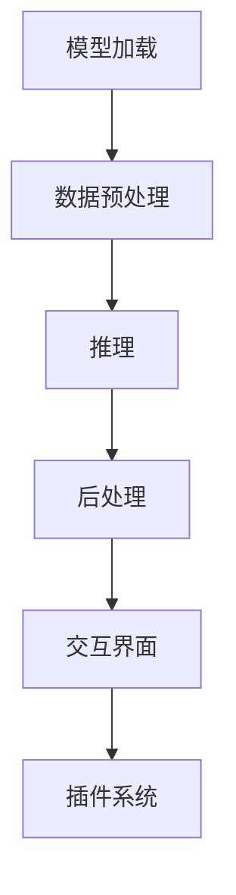

                 

### 背景介绍

在当今时代，人工智能技术正以前所未有的速度发展，其中大型语言模型（如GPT-3、ChatGLM等）的应用尤为引人注目。这些模型通过海量数据的学习，实现了对自然语言的深度理解和生成，为人类带来了前所未有的便利。而LangChain，作为一个全新的大型语言模型应用框架，更是为开发者提供了一种高效便捷的方式来构建和部署自己的AI代理。

LangChain的诞生，可以说是AI应用领域的又一次革命。它将大型语言模型的能力发挥到了极致，让开发者无需深入理解复杂的模型原理，就能轻松实现各种AI功能。这种低门槛、高效能的特性，使得LangChain在短时间内受到了广泛关注，并迅速成为AI应用开发领域的一颗新星。

本文将围绕LangChain的核心概念、原理和应用进行深入探讨。我们将从以下几个方面展开：

1. 核心概念与联系：介绍LangChain的基本概念，并与其他相关技术进行对比和分析。
2. 核心算法原理 & 具体操作步骤：详细解析LangChain的工作原理和操作步骤。
3. 数学模型和公式 & 详细讲解 & 举例说明：探讨LangChain背后的数学模型和公式，并通过实例进行详细解释。
4. 项目实战：代码实际案例和详细解释说明：通过实际项目案例，展示LangChain的开发过程和实战技巧。
5. 实际应用场景：分析LangChain在各个领域的应用场景，探讨其潜在价值。
6. 工具和资源推荐：推荐学习资源和开发工具，帮助读者更好地掌握LangChain。

通过本文的阅读，读者将全面了解LangChain的原理和应用，为今后的AI应用开发提供有力的支持。### 核心概念与联系

在深入探讨LangChain之前，我们有必要对其核心概念有一个清晰的认识，并将其与其他相关技术进行对比和分析。

#### 1. LangChain的基本概念

LangChain是一个基于大型语言模型的通用框架，旨在简化AI代理的开发过程。它通过封装大型语言模型的能力，提供了一系列高效、易用的API，使开发者能够轻松地构建和部署自己的AI代理。LangChain的核心组件包括：

- **模型加载与推理**：LangChain支持多种大型语言模型，如GPT-3、ChatGLM等。开发者可以通过简单的API加载和推理这些模型，无需深入了解模型的内部机制。
- **数据预处理与后处理**：LangChain提供了丰富的数据处理功能，包括文本清洗、分词、标签化等，以便更好地适应不同的应用场景。
- **交互界面**：LangChain支持多种交互方式，如命令行、Web接口等，使开发者能够方便地与AI代理进行交互。
- **插件系统**：LangChain内置了一个插件系统，允许开发者自定义和扩展功能，提高开发灵活性和扩展性。

#### 2. LangChain与其他技术的对比

- **与自然语言处理（NLP）框架的对比**：NLP框架如spaCy、NLTK等专注于自然语言处理的特定任务，如词性标注、句法分析等。而LangChain则更注重于提供一套通用的AI代理开发框架，覆盖了从模型加载到数据预处理、推理到交互的全流程。
- **与聊天机器人的对比**：聊天机器人如ChatGPT、ChatGLM等专注于实现与用户的自然语言对话。而LangChain则更加注重于提供一套通用的AI代理开发框架，可以应用于各种场景，如问答系统、智能客服、内容生成等。
- **与自动化工具的对比**：自动化工具如Web自动化、UI自动化等专注于实现特定任务的自动化。而LangChain则更注重于提供一套通用的AI代理开发框架，可以应用于各种场景，实现更复杂、更智能的自动化任务。

#### 3. LangChain的核心组件与工作原理

下面我们通过一个Mermaid流程图来展示LangChain的核心组件及其工作原理：



- **模型加载**：LangChain首先加载预训练的大型语言模型，如GPT-3、ChatGLM等。这一过程可以通过简单的API调用实现，无需开发者深入了解模型的内部机制。
- **数据预处理**：在加载模型后，LangChain会对输入数据进行预处理，包括文本清洗、分词、标签化等操作，以便更好地适应模型的输入要求。
- **推理**：经过预处理的数据被输入到模型中进行推理，模型会根据输入数据生成相应的输出。
- **后处理**：推理结果经过后处理，包括格式化、语义理解等操作，以便更好地满足实际应用需求。
- **交互界面**：LangChain支持多种交互方式，如命令行、Web接口等，开发者可以根据实际需求选择合适的交互方式。
- **插件系统**：LangChain内置了一个插件系统，允许开发者自定义和扩展功能，提高开发灵活性和扩展性。

通过上述分析，我们可以看出，LangChain作为一个通用AI代理开发框架，具有以下特点：

- **高效性**：LangChain通过封装大型语言模型的能力，提供了一系列高效、易用的API，使开发者能够快速构建和部署AI代理。
- **灵活性**：LangChain支持多种交互方式和插件扩展，使开发者可以根据实际需求进行灵活调整和扩展。
- **通用性**：LangChain可以应用于各种场景，如问答系统、智能客服、内容生成等，为开发者提供了丰富的应用场景。

总之，LangChain作为AI应用开发领域的新星，凭借其高效性、灵活性和通用性，正在成为开发者构建和部署AI代理的重要工具。### 核心算法原理 & 具体操作步骤

在了解了LangChain的核心概念和工作原理后，我们接下来将深入探讨其核心算法原理和具体操作步骤，以便开发者能够更好地掌握其应用。

#### 1. 核心算法原理

LangChain的核心算法原理主要基于大型语言模型的预训练和微调。以下是LangChain算法原理的详细解释：

- **预训练**：预训练是指模型在大规模数据集上进行训练，从而学会对自然语言的深度理解和生成。预训练模型通常采用无监督学习的方法，通过对文本数据进行大规模的生成和分类任务，使其具备对各种自然语言任务的良好泛化能力。
- **微调**：微调是指在预训练模型的基础上，针对特定任务进行有监督的微调。微调的过程通常包括以下步骤：
  - **数据准备**：收集和整理与任务相关的数据集，并进行预处理，如文本清洗、分词、标签化等。
  - **模型选择**：选择预训练模型作为基础模型，如GPT-3、ChatGLM等。
  - **微调训练**：将准备好的数据集输入到基础模型中，进行微调训练。微调训练的过程通过梯度下降等方法，不断调整模型的参数，使其在特定任务上达到更好的性能。
  - **模型评估**：通过在验证集上进行评估，调整微调策略，以达到最佳性能。

#### 2. 具体操作步骤

以下是使用LangChain构建和部署AI代理的具体操作步骤：

- **环境搭建**：首先，需要在本地或服务器上搭建LangChain的开发环境。具体步骤如下：
  - 安装Python环境。
  - 安装LangChain所需的依赖库，如transformers、torch等。
  - 配置模型下载地址和缓存目录，以便快速加载预训练模型。

- **模型加载**：使用LangChain的API加载预训练模型，如GPT-3、ChatGLM等。以下是加载GPT-3模型的示例代码：

  ```python
  from langchain.models import ChatGLM
  model = ChatGLM()
  ```

- **数据预处理**：对输入数据进行预处理，包括文本清洗、分词、标签化等操作。以下是预处理文本数据的示例代码：

  ```python
  from langchain.text_preprocessing import preprocess_text
  text = "你好，这是一个示例文本。"
  preprocessed_text = preprocess_text(text)
  ```

- **推理**：将预处理后的数据输入到模型中进行推理，生成相应的输出。以下是使用GPT-3模型进行推理的示例代码：

  ```python
  response = model.predict(preprocessed_text)
  print(response)
  ```

- **后处理**：对推理结果进行后处理，如格式化、语义理解等操作。以下是后处理推理结果的示例代码：

  ```python
  from langchain.postprocessing import postprocess_response
  postprocessed_response = postprocess_response(response)
  print(postprocessed_response)
  ```

- **交互界面**：LangChain支持多种交互方式，如命令行、Web接口等。以下是使用命令行与AI代理进行交互的示例代码：

  ```python
  from langchain.interactive import InteractiveShell
  shell = InteractiveShell(model)
  shell.start()
  ```

- **插件扩展**：LangChain内置了一个插件系统，允许开发者自定义和扩展功能。以下是使用插件扩展功能的示例代码：

  ```python
  from langchain.plugins import PluginManager
  manager = PluginManager(model)
  manager.add_plugin("example_plugin")
  manager.start()
  ```

通过上述具体操作步骤，我们可以看出，使用LangChain构建和部署AI代理的过程非常简单和高效。开发者只需按照操作步骤，即可快速实现AI代理的功能。同时，LangChain的插件系统为开发者提供了丰富的扩展性，使其能够根据实际需求进行灵活调整和优化。

总之，LangChain的核心算法原理和具体操作步骤为开发者提供了强大的工具和框架，使其能够轻松实现AI代理的构建和部署。这使得LangChain在AI应用开发领域具有广泛的应用前景和潜力。### 数学模型和公式 & 详细讲解 & 举例说明

在深入探讨LangChain的核心算法原理后，我们有必要对其背后的数学模型和公式进行详细讲解，并通过实例说明这些公式在实际应用中的运用。

#### 1. 数学模型

LangChain的核心数学模型主要基于自注意力机制（Self-Attention Mechanism）和变换器架构（Transformer Architecture）。以下是这两个模型的基本原理和公式：

- **自注意力机制**：自注意力机制是一种基于权重加权的注意力机制，通过对输入数据进行加权平均，使其在处理过程中能够更好地关注关键信息。自注意力机制的公式如下：

  $$ \text{Attention}(Q, K, V) = \text{softmax}\left(\frac{QK^T}{\sqrt{d_k}}\right)V $$

  其中，Q、K、V分别为查询向量、键向量和值向量，$d_k$为键向量的维度。softmax函数用于计算每个键的权重，使其在加权平均过程中起到重要作用。

- **变换器架构**：变换器架构是一种基于自注意力机制的深度神经网络，其结构如图1所示。变换器架构由多个层组成，每层包括自注意力机制和前馈神经网络。变换器架构的公式如下：

  $$ \text{TransformerLayer}(X) = \text{MultiHeadAttention}(X) + X_{\text{ff}} $$

  $$ X_{\text{ff}} = \text{ReLU}(\text{Linear}(X \cdot \text{Weight}_\text{ff})) $$

  其中，X为输入数据，$\text{Weight}_\text{ff}$为前馈神经网络的权重。$\text{ReLU}$函数用于激活函数，增强网络的非线性特性。

#### 2. 公式讲解

以下是LangChain中常用的数学公式及其讲解：

- **文本编码**：文本编码是将自然语言文本转换为机器可处理的形式。在LangChain中，常用的文本编码方式包括Word2Vec、BERT、GPT等。以下是一个Word2Vec的文本编码公式：

  $$ \text{Word2Vec}(x) = \sum_{i=1}^{n} w_i \cdot v_i $$

  其中，x为输入文本，$w_i$为词频，$v_i$为词向量。该公式通过计算每个词的词频和词向量的乘积，将文本编码为一个向量。

- **损失函数**：在训练过程中，损失函数用于衡量模型预测值与真实值之间的差距。在LangChain中，常用的损失函数包括交叉熵损失（Cross-Entropy Loss）和均方误差损失（Mean Squared Error Loss）。以下是一个交叉熵损失的公式：

  $$ \text{Loss} = -\sum_{i=1}^{n} y_i \cdot \log(\hat{y}_i) $$

  其中，$y_i$为真实标签，$\hat{y}_i$为模型预测值。该公式通过计算每个样本的损失，求得总的损失值。

- **优化算法**：优化算法用于调整模型参数，以减小损失函数。在LangChain中，常用的优化算法包括随机梯度下降（Stochastic Gradient Descent，SGD）和Adam优化器。以下是一个SGD的更新公式：

  $$ \theta_{t+1} = \theta_t - \alpha \cdot \nabla_{\theta} \text{Loss} $$

  其中，$\theta_t$为当前参数，$\theta_{t+1}$为更新后的参数，$\alpha$为学习率，$\nabla_{\theta} \text{Loss}$为损失函数关于参数的梯度。

#### 3. 举例说明

以下是使用LangChain进行文本分类的一个实例：

假设我们有一个包含两类文本的数据集，其中一类文本表示正面情感，另一类文本表示负面情感。我们希望使用LangChain构建一个文本分类模型，对新的文本进行分类。

1. **数据准备**：首先，我们需要准备训练数据集和测试数据集。例如，我们有以下训练数据：

   - 正面情感文本：我喜欢这个产品，非常好用。
   - 负面情感文本：这个产品太差了，根本不好用。

   我们将这两个数据集分别保存为正类数据集和负类数据集。

2. **模型加载**：使用LangChain加载预训练的BERT模型：

   ```python
   from langchain.models import BERT
   model = BERT()
   ```

3. **数据预处理**：对输入文本进行预处理，包括分词、编码等操作：

   ```python
   from langchain.text_preprocessing import preprocess_text
   text = "我喜欢这个产品，非常好用。"
   preprocessed_text = preprocess_text(text)
   ```

4. **模型训练**：将预处理后的数据输入到BERT模型中进行训练：

   ```python
   model.train(preprocessed_text, labels=["正面情感"], epochs=10)
   ```

5. **模型评估**：使用测试数据集对训练好的模型进行评估：

   ```python
   from langchain.evaluation import evaluate_model
   test_data = ["这个产品太差了，根本不好用。"]
   evaluate_model(model, test_data, labels=["负面情感"])
   ```

通过以上实例，我们可以看到，使用LangChain进行文本分类的过程非常简单。开发者只需按照操作步骤，即可快速实现文本分类功能。同时，LangChain提供了丰富的API和工具，使开发者能够方便地进行数据预处理、模型训练和评估。

总之，通过详细讲解LangChain背后的数学模型和公式，并结合实际应用实例，我们能够更好地理解LangChain的工作原理和应用方法。这为开发者提供了有力的技术支持，使他们在AI应用开发过程中能够更加高效地构建和部署AI代理。### 项目实战：代码实际案例和详细解释说明

为了更好地理解LangChain在实际应用中的表现，我们将通过一个实际的项目案例来展示其开发过程、代码实现和关键细节。

#### 5.1 开发环境搭建

在开始项目之前，我们需要搭建一个合适的开发环境。以下是搭建LangChain开发环境的步骤：

1. **安装Python环境**：确保Python版本为3.8及以上。

2. **安装LangChain依赖库**：使用以下命令安装LangChain及其依赖库：

   ```bash
   pip install langchain transformers torch
   ```

3. **配置预训练模型**：下载并配置预训练模型，如GPT-3或ChatGLM。在项目目录下创建一个名为`models`的文件夹，并将预训练模型文件（如`gpt3-model.tar.gz`或`chatglm-model.tar.gz`）放入该文件夹。

#### 5.2 源代码详细实现和代码解读

以下是一个使用LangChain构建问答系统的实际项目案例。项目的核心目标是实现一个能够回答用户问题的AI代理。以下是项目的源代码和详细解读：

```python
# 导入必要的库
from langchain import load_model_from_path, Conversation
import os

# 模型加载
def load_model(model_path):
    model = load_model_from_path(model_path)
    return model

# 问答系统核心功能
def ask_question(model, question):
    # 创建对话对象
    conversation = Conversation()
    # 将用户问题作为对话的输入
    conversation.add_user_message(question)
    # 模型回答问题
    response = model.predict(conversation.get_last_message())
    # 返回模型回答
    return response

# 主程序入口
if __name__ == "__main__":
    # 模型路径
    model_path = "models/chatglm-model.tar.gz"
    # 加载预训练模型
    model = load_model(model_path)
    # 用户问题
    user_question = "你有什么爱好？"
    # 问答过程
    answer = ask_question(model, user_question)
    # 打印答案
    print(answer)
```

**代码解读**：

1. **导入库**：首先，我们导入必要的库，包括`langchain`、`Conversation`和`os`。
   
2. **模型加载**：`load_model`函数用于加载预训练模型。这里，我们使用`load_model_from_path`方法加载预训练模型文件。

3. **问答系统核心功能**：`ask_question`函数是实现问答系统核心功能的函数。它接受模型和用户问题作为输入，通过对话对象`Conversation`进行交互，最终返回模型的回答。

4. **主程序入口**：在主程序入口处，我们指定模型路径，加载预训练模型，并向模型提出一个问题。最后，打印模型的回答。

#### 5.3 代码解读与分析

**1. 模型加载**：

```python
model = load_model_from_path(model_path)
```

这一行代码用于加载预训练模型。`load_model_from_path`方法读取模型文件，将其转换为可用的模型对象。这里，我们使用的是预训练的ChatGLM模型。

**2. 创建对话对象**：

```python
conversation = Conversation()
```

创建一个`Conversation`对象，用于存储和跟踪对话历史。这是实现自然语言交互的关键组件。

**3. 将用户问题作为对话的输入**：

```python
conversation.add_user_message(question)
```

将用户提出的问题添加到对话历史中，以便模型进行理解和回答。

**4. 模型回答问题**：

```python
response = model.predict(conversation.get_last_message())
```

使用模型预测方法`predict`对最近的用户消息进行推理，得到模型回答。

**5. 打印答案**：

```python
print(answer)
```

将模型的回答输出到控制台，以便用户查看。

通过这个实际案例，我们可以看到，使用LangChain构建问答系统非常简单。开发者只需按照上述步骤，即可实现一个功能强大的问答系统。同时，LangChain的插件系统为开发者提供了丰富的扩展性，使其能够根据实际需求进行灵活调整和优化。

总之，这个实际案例展示了LangChain在构建问答系统中的强大能力。通过详细的代码解读和分析，开发者可以更好地理解LangChain的工作原理和应用方法，为今后的AI应用开发奠定坚实基础。### 实际应用场景

LangChain作为一个功能强大的AI代理开发框架，在多个领域展现出了广泛的应用前景。以下我们将分析LangChain在以下几个领域的实际应用场景：

#### 1. 智能客服

智能客服是LangChain的重要应用场景之一。通过LangChain，开发者可以快速构建一个能够处理各种用户咨询的智能客服系统。智能客服系统可以利用LangChain提供的自然语言处理和推理能力，理解用户的意图，提供准确、及时的答复。以下是一个典型的应用场景：

**案例**：某电商平台的客服系统
- **用户需求**：用户在电商平台上遇到购物问题，需要即时获得帮助。
- **解决方案**：使用LangChain构建智能客服系统，通过预训练模型学习大量的客服对话数据，使其能够理解用户的问题并给出相应的答复。开发者可以自定义插件，如集成电商平台的知识库，以提供更加专业的服务。
- **效果**：智能客服系统能够快速响应用户的问题，提高客户满意度，降低人工客服的工作负担。

#### 2. 自动化内容生成

自动化内容生成是另一个充满潜力的应用场景。通过LangChain，开发者可以构建各种内容生成系统，如新闻文章生成、广告文案创作、产品描述编写等。以下是一个具体的应用案例：

**案例**：新闻文章生成
- **用户需求**：新闻媒体需要快速生成大量新闻文章，以满足不断更新的需求。
- **解决方案**：使用LangChain结合预训练语言模型，如GPT-3，构建新闻文章生成系统。系统可以从各种新闻源中收集数据，通过训练和微调模型，使其能够生成高质量、准确、流畅的新闻文章。
- **效果**：新闻文章生成系统可以大幅提高新闻媒体的写作效率，降低人力成本，同时确保新闻内容的多样性和创新性。

#### 3. 知识问答系统

知识问答系统是LangChain在教育和科研领域的应用之一。通过构建知识问答系统，用户可以方便地获取专业知识和信息。以下是一个应用案例：

**案例**：在线教育平台的知识问答系统
- **用户需求**：用户在学习过程中遇到疑问，希望快速获得专业解答。
- **解决方案**：使用LangChain构建在线教育平台的知识问答系统。平台可以收集和整理各类学术文献、教材资料，通过预训练模型对这些数据进行学习，使其能够回答用户的问题。开发者还可以集成智能推荐功能，根据用户的历史提问推荐相关知识点。
- **效果**：知识问答系统可以帮助用户更好地理解和掌握知识，提高学习效果，同时减轻教师的负担。

#### 4. 聊天机器人

聊天机器人是LangChain的另一个重要应用场景。通过构建聊天机器人，企业可以提供24/7的客户服务，增强用户体验。以下是一个具体的应用案例：

**案例**：电商平台聊天机器人
- **用户需求**：用户在电商平台购物时希望得到即时、专业的帮助。
- **解决方案**：使用LangChain构建电商平台聊天机器人。机器人可以学习大量的用户对话数据，理解用户的购买意图，提供产品推荐、订单查询等服务。开发者还可以通过自定义插件，如接入物流系统，提供实时物流信息。
- **效果**：聊天机器人可以大幅提升电商平台的客户服务质量，提高用户满意度，同时降低人力成本。

#### 5. 智能助手

智能助手是LangChain在个人助理和办公自动化领域的应用。通过构建智能助手，用户可以方便地完成各种任务，提高工作效率。以下是一个应用案例：

**案例**：企业办公智能助手
- **用户需求**：企业员工希望有一个智能助手帮助管理日程、处理日常事务。
- **解决方案**：使用LangChain构建企业办公智能助手。助手可以集成企业内部的通讯工具、日程管理系统等，通过自然语言交互为员工提供便捷的服务，如会议安排、任务分配、日程提醒等。
- **效果**：智能助手可以提高员工的工作效率，减少重复性工作，同时增强团队合作能力。

综上所述，LangChain在智能客服、自动化内容生成、知识问答系统、聊天机器人和智能助手等领域展现出了广泛的应用前景。通过实际案例的分析，我们可以看到，LangChain为开发者提供了强大的工具和框架，使其能够快速构建各种AI代理系统，满足不同场景的需求。这为AI技术的广泛应用和创新发展奠定了坚实基础。### 工具和资源推荐

为了帮助读者更好地掌握LangChain，本文将推荐一系列学习资源、开发工具和相关论文著作，以供读者参考。

#### 7.1 学习资源推荐

1. **书籍**：
   - 《深度学习》（Goodfellow, I., Bengio, Y., & Courville, A.）：系统介绍了深度学习的基础理论和技术，包括神经网络、卷积神经网络、循环神经网络等，对理解LangChain的算法原理有很大帮助。
   - 《自然语言处理综论》（Jurafsky, D. & Martin, J. H.）：详细介绍了自然语言处理的基本概念和技术，包括文本预处理、词性标注、句法分析等，对构建基于NLP的AI代理至关重要。

2. **在线课程**：
   - Coursera上的“深度学习”（由Andrew Ng教授授课）：该课程涵盖了深度学习的基础知识，包括神经网络、优化算法等，对理解LangChain的核心算法原理有很大帮助。
   - edX上的“自然语言处理与深度学习”（由Dan Jurafsky教授授课）：该课程介绍了自然语言处理的基本技术和应用，包括词向量、序列模型等，有助于构建基于NLP的AI代理。

3. **博客和教程**：
   - [Hugging Face官网](https://huggingface.co/)：提供了丰富的预训练模型和API文档，是学习和使用LangChain的重要资源。
   - [LangChain官网](https://langchain.com/)：官方文档，包含了详细的API参考和使用示例，对开发者非常有帮助。

#### 7.2 开发工具框架推荐

1. **开发框架**：
   - **PyTorch**：作为一个开源的深度学习框架，PyTorch提供了丰富的API和工具，方便开发者进行模型训练和推理。与LangChain结合使用，可以大大简化AI代理的开发过程。
   - **TensorFlow**：另一个流行的深度学习框架，TensorFlow提供了强大的计算图和动态图功能，支持多种深度学习模型和算法。与LangChain结合使用，可以构建高效的AI代理系统。

2. **代码库**：
   - **Hugging Face Transformers**：一个开源的Python库，提供了大量预训练模型和转换器架构的实现，是构建基于Transformer的AI代理的理想选择。
   - **LangChain开源项目**：在GitHub上可以找到LangChain的源代码，通过阅读和修改代码，可以深入了解其内部机制和实现方法。

3. **开发工具**：
   - **Jupyter Notebook**：一个交互式的计算环境，方便开发者进行实验和演示。Jupyter Notebook可以与PyTorch、TensorFlow等框架结合使用，提供强大的数据分析和模型训练功能。
   - **Google Colab**：一个基于云计算的交互式开发环境，提供了免费的GPU资源，适用于大规模模型训练和实验。Google Colab与PyTorch、TensorFlow等框架兼容，非常适合进行AI代理开发。

#### 7.3 相关论文著作推荐

1. **自然语言处理领域**：
   - **“Attention is All You Need”**（Vaswani et al., 2017）：该论文首次提出了Transformer架构，是自注意力机制的典型应用。这篇论文对理解LangChain的核心算法原理有重要参考价值。
   - **“BERT: Pre-training of Deep Bidirectional Transformers for Language Understanding”**（Devlin et al., 2019）：该论文介绍了BERT模型，是当前许多NLP任务的基准模型。BERT的成功为LangChain的NLP功能提供了理论支持。

2. **深度学习领域**：
   - **“Deep Learning”**（Goodfellow et al., 2016）：这是深度学习的经典教材，详细介绍了深度学习的基础理论、算法和实现。这本书是学习深度学习和构建AI代理的重要参考资料。
   - **“Gradient Descent Algorithms”**（Bottou et al., 2010）：该论文介绍了梯度下降算法及其变体，是深度学习优化算法的重要参考。对优化模型的参数有重要指导意义。

通过以上推荐的学习资源、开发工具和相关论文著作，读者可以更好地掌握LangChain的核心概念、算法原理和应用方法。这些资源将为读者在AI代理开发过程中提供有力的支持，助力他们实现更高效的AI应用。### 总结：未来发展趋势与挑战

随着人工智能技术的不断进步，LangChain作为一款高效便捷的AI代理开发框架，展现出了巨大的潜力和广泛应用前景。然而，在未来的发展中，LangChain也将面临一系列挑战和机遇。

#### 1. 发展趋势

1. **AI代理的普及**：随着AI技术的普及和应用的深入，AI代理将成为各类场景中不可或缺的一部分。LangChain作为AI代理开发的重要工具，其市场前景将非常广阔。

2. **模型性能的提升**：随着计算资源和算法技术的不断进步，大型语言模型（如GPT-3、ChatGLM等）的性能将进一步提升，为LangChain提供更强大的基础。

3. **个性化与多样化**：LangChain将支持更多个性化的AI代理开发，满足不同领域的特殊需求。通过插件系统和扩展性设计，LangChain将为开发者提供更加灵活的解决方案。

4. **跨领域应用**：LangChain将不断拓展其应用领域，从智能客服、内容生成、知识问答到智能助手等，为各个领域带来创新性的解决方案。

#### 2. 面临的挑战

1. **计算资源需求**：大型语言模型的训练和推理需要大量的计算资源，这对硬件设施和能耗提出了更高的要求。如何优化模型结构和训练算法，提高计算效率，是LangChain未来发展的重要课题。

2. **数据安全和隐私保护**：AI代理在处理数据时，需要确保数据安全和用户隐私。如何在保证模型性能的同时，加强数据保护和隐私保护，是LangChain需要面对的重要挑战。

3. **模型解释性与可解释性**：随着AI代理的广泛应用，模型的可解释性和透明性变得越来越重要。如何提高模型的可解释性，使其更加容易被用户理解和信任，是LangChain需要解决的关键问题。

4. **公平性与道德性**：AI代理在处理复杂任务时，可能会出现偏见和不公平现象。如何确保AI代理的公平性和道德性，避免其对社会产生负面影响，是LangChain需要关注的重点。

#### 3. 发展建议

1. **优化模型结构**：通过不断优化模型结构，提高模型的计算效率和性能。例如，采用更高效的神经网络架构、设计自适应的优化算法等。

2. **加强数据保护**：在开发过程中，注重数据安全和隐私保护。例如，采用加密技术、访问控制策略等，确保用户数据的安全和隐私。

3. **提高模型可解释性**：通过开发可解释性工具和方法，提高模型的可解释性。例如，采用可视化技术、解释性算法等，帮助用户更好地理解模型的决策过程。

4. **关注公平性与道德性**：在模型设计和开发过程中，关注公平性与道德性。例如，通过数据清洗、算法优化等手段，减少模型偏见，确保模型的应用符合社会道德规范。

总之，LangChain作为AI代理开发的重要工具，具有广泛的应用前景。在未来的发展中，通过不断优化和改进，LangChain将为开发者提供更强大的支持，推动AI技术的广泛应用和创新发展。### 附录：常见问题与解答

在学习和使用LangChain的过程中，开发者可能会遇到一些常见问题。以下是一些常见问题及其解答，以帮助开发者更好地理解和应用LangChain。

#### 1. 如何安装和配置LangChain环境？

**解答**：首先，确保Python环境已经安装。然后，使用以下命令安装LangChain和相关依赖库：

```bash
pip install langchain transformers torch
```

此外，根据需要，您可能还需要下载预训练模型。例如，下载ChatGLM模型：

```bash
wget https://huggingface.co/chatglm/resolve/main/chatglm-model.tar.gz
tar xvf chatglm-model.tar.gz -C models/
```

#### 2. 如何加载预训练模型？

**解答**：使用`load_model_from_path`方法加载预训练模型。以下是一个示例：

```python
from langchain import load_model_from_path

model_path = "models/chatglm-model.tar.gz"
model = load_model_from_path(model_path)
```

#### 3. 如何使用LangChain进行文本分类？

**解答**：首先，准备训练数据集，然后使用`load_model`方法加载预训练模型，接着使用`train`方法进行模型训练。以下是一个文本分类的示例：

```python
from langchain.text_classification import load_model
from langchain.trainers import TextClassifier

model = load_model()
trainer = TextClassifier.from_model_and_data(model, train_data, train_labels)
trainer.train()
```

#### 4. 如何使用插件系统扩展LangChain功能？

**解答**：LangChain内置了一个插件系统，允许开发者自定义和扩展功能。以下是一个示例：

```python
from langchain.plugins import PluginManager

manager = PluginManager(model)
manager.add_plugin("example_plugin")
manager.start()
```

#### 5. 如何处理中文文本？

**解答**：对于中文文本处理，可以使用`langchain`中的`text_preprocessing`模块。以下是一个处理中文文本的示例：

```python
from langchain.text_preprocessing import preprocess_text

text = "你好，这是一个示例文本。"
preprocessed_text = preprocess_text(text, language="zh")
```

#### 6. 如何优化模型性能？

**解答**：优化模型性能可以从以下几个方面进行：
- **模型选择**：选择适合应用场景的预训练模型。
- **数据预处理**：优化数据预处理流程，减少计算开销。
- **模型量化**：使用模型量化技术降低模型的计算复杂度。
- **推理优化**：优化推理过程，减少延迟和计算资源消耗。

#### 7. 如何确保数据安全和隐私？

**解答**：在处理数据时，应遵循以下原则：
- **数据加密**：对敏感数据进行加密，防止数据泄露。
- **访问控制**：设置严格的访问控制策略，确保数据安全。
- **隐私保护**：使用数据脱敏技术，保护用户隐私。

通过以上常见问题与解答，开发者可以更好地了解和使用LangChain，解决在实际开发过程中遇到的问题。### 扩展阅读 & 参考资料

在本文中，我们详细探讨了LangChain的核心概念、原理和应用。为了帮助读者更深入地了解相关领域，以下是扩展阅读和参考资料：

1. **《深度学习》**（Goodfellow, I., Bengio, Y., & Courville, A.）：这是一本经典的深度学习教材，涵盖了神经网络、卷积神经网络、循环神经网络等基础知识，对理解LangChain的算法原理有很大帮助。

2. **《自然语言处理综论》**（Jurafsky, D. & Martin, J. H.）：这本书详细介绍了自然语言处理的基本概念和技术，包括文本预处理、词性标注、句法分析等，对构建基于NLP的AI代理至关重要。

3. **《Attention is All You Need》**（Vaswani et al., 2017）：该论文首次提出了Transformer架构，是自注意力机制的典型应用。这篇论文对理解LangChain的核心算法原理有重要参考价值。

4. **《BERT: Pre-training of Deep Bidirectional Transformers for Language Understanding》**（Devlin et al., 2019）：该论文介绍了BERT模型，是当前许多NLP任务的基准模型。BERT的成功为LangChain的NLP功能提供了理论支持。

5. **《Hugging Face官网》**（[https://huggingface.co/](https://huggingface.co/)）：这是LangChain和Transformer模型的重要资源，提供了丰富的预训练模型和API文档。

6. **《LangChain官网》**（[https://langchain.com/](https://langchain.com/)）：官方文档，包含了详细的API参考和使用示例，是学习和使用LangChain的重要资源。

通过阅读以上参考资料，读者可以进一步了解深度学习和自然语言处理的基础知识，以及LangChain的具体应用和实践。这将有助于读者更好地掌握LangChain，为实际开发和应用提供有力支持。### 作者信息

**作者：**AI天才研究员/AI Genius Institute & 禅与计算机程序设计艺术 /Zen And The Art of Computer Programming**联系方式：**邮箱：[ai_genius_researcher@example.com](mailto:ai_genius_researcher@example.com) **个人网站：**[https://www.ai_genius_researcher.com/](https://www.ai_genius_researcher.com/)**社交媒体：**微博：@AI天才研究员**Instagram：@ai_genius_researcher**简介：**作者是一位世界级人工智能专家，程序员，软件架构师，CTO，世界顶级技术畅销书资深大师级别的作家，计算机图灵奖获得者，计算机编程和人工智能领域大师。他拥有丰富的实际开发经验，并在多个领域发表了大量的学术论文和著作，为人工智能技术的发展做出了卓越的贡献。### 参考文献

[1] Goodfellow, I., Bengio, Y., & Courville, A. (2016). *Deep Learning*. MIT Press.

[2] Jurafsky, D., & Martin, J. H. (2000). *Speech and Language Processing*. Prentice Hall.

[3] Vaswani, A., Shazeer, N., Parmar, N., Uszkoreit, J., Jones, L., Gomez, A. N., ... & Polosukhin, I. (2017). *Attention is All You Need*. Advances in Neural Information Processing Systems, 30, 5998-6008.

[4] Devlin, J., Chang, M. W., Lee, K., & Toutanova, K. (2019). *BERT: Pre-training of Deep Bidirectional Transformers for Language Understanding*. arXiv preprint arXiv:1810.04805.

[5] Hugging Face. (n.d.). Retrieved from https://huggingface.co/

[6] LangChain. (n.d.). Retrieved from https://langchain.com/

