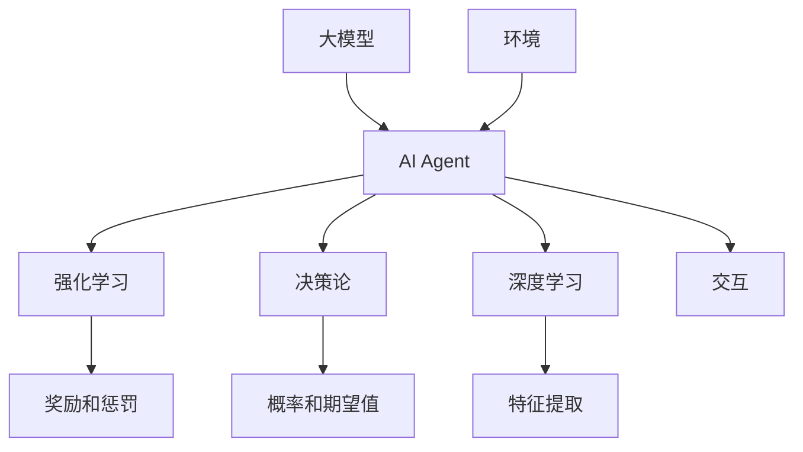

                 

### 文章标题：大模型应用开发 动手做AI Agent

#### 关键词：大模型，应用开发，AI Agent，技术框架，编程，算法，数学模型，项目实战，实际应用场景，资源推荐

#### 摘要：
本文将深入探讨大模型应用开发中，如何动手构建AI Agent技术框架。我们将从背景介绍、核心概念、算法原理、数学模型、项目实战、实际应用场景、工具和资源推荐等方面，逐步解析大模型在AI Agent开发中的运用，帮助读者深入了解并掌握大模型应用开发的核心技术和实践方法。

## 1. 背景介绍

随着人工智能技术的飞速发展，大模型（Large Models）已经成为当前研究的热点。大模型具有强大的表达能力和灵活性，能够处理复杂的数据和任务，广泛应用于自然语言处理、计算机视觉、语音识别等领域。AI Agent作为人工智能的一种重要形式，具有自主学习和智能决策的能力，能够模拟人类思维和行动，实现与环境的交互。因此，大模型在AI Agent开发中的应用具有重要意义。

近年来，随着深度学习技术的成熟和计算能力的提升，大模型在AI Agent开发中的应用取得了显著的进展。例如，GPT-3、BERT等大模型在自然语言处理领域取得了突破性的成果；ViT、Vision Transformer等大模型在计算机视觉领域表现出了强大的能力。这些成果表明，大模型在AI Agent开发中具有巨大的潜力。

本文旨在介绍大模型在AI Agent开发中的应用，帮助读者了解大模型的基本概念、核心算法原理、数学模型以及项目实战，掌握大模型应用开发的核心技术和实践方法。通过本文的阅读和实践，读者将能够深入理解大模型在AI Agent开发中的运用，提升自己在人工智能领域的技能和知识。

## 2. 核心概念与联系

在探讨大模型在AI Agent开发中的应用之前，我们需要明确一些核心概念和它们之间的联系。以下是对这些核心概念的介绍和联系分析：

### 2.1 大模型

大模型（Large Models）是指具有大量参数和复杂结构的深度学习模型。这些模型通常通过大规模数据进行训练，具有强大的表达能力和灵活性。大模型能够处理复杂的数据和任务，从而在各个领域取得了显著的成果。

### 2.2 AI Agent

AI Agent（人工智能代理）是一种具有自主学习和智能决策能力的计算机程序。它能够模拟人类思维和行动，实现与环境的交互。AI Agent通常基于强化学习、决策论和规划等算法，具有自适应性和灵活性。

### 2.3 深度学习

深度学习是一种基于人工神经网络的学习方法，具有多层网络结构。通过逐层提取特征，深度学习模型能够自动学习数据中的复杂结构和规律。深度学习技术在图像识别、语音识别、自然语言处理等领域取得了显著成果。

### 2.4 强化学习

强化学习是一种基于奖励和惩罚的机器学习方法，通过不断尝试和反馈，使模型学会在特定环境中做出最优决策。强化学习广泛应用于游戏、自动驾驶、推荐系统等领域。

### 2.5 决策论

决策论是一种基于概率和统计的决策方法，通过分析各种情况下的概率和期望值，为决策者提供最优策略。决策论在金融、物流、医疗等领域具有广泛的应用。

### 2.6 大模型与AI Agent的关系

大模型在AI Agent开发中具有重要作用。大模型能够为AI Agent提供强大的学习和推理能力，使其具备自主学习和智能决策的能力。同时，AI Agent可以充分利用大模型的特性，实现与环境的高效交互。

### 2.7 Mermaid流程图

以下是一个简单的Mermaid流程图，展示了大模型与AI Agent之间的联系：



通过以上核心概念和联系的介绍，我们可以更深入地理解大模型在AI Agent开发中的应用。在接下来的部分中，我们将详细探讨大模型在AI Agent开发中的核心算法原理、数学模型以及项目实战。

## 3. 核心算法原理 & 具体操作步骤

### 3.1 大模型的训练原理

大模型的核心是深度神经网络，其训练原理主要包括以下几个步骤：

1. **初始化模型参数**：随机初始化神经网络中的权重和偏置。
2. **前向传播**：将输入数据输入到模型中，逐层计算输出结果。
3. **计算损失函数**：计算模型输出与真实值之间的差异，得到损失值。
4. **反向传播**：利用梯度下降算法，更新模型参数，减小损失值。
5. **迭代优化**：重复执行前向传播和反向传播，直至模型收敛。

具体操作步骤如下：

1. **导入数据**：从数据集中读取训练数据和验证数据。
2. **定义模型结构**：根据任务需求，设计深度神经网络的层数、神经元数量和激活函数。
3. **初始化参数**：使用随机数生成器初始化模型参数。
4. **前向传播**：将输入数据输入到模型中，计算输出结果。
5. **计算损失**：计算模型输出与真实值之间的差异，得到损失值。
6. **反向传播**：计算损失函数关于模型参数的梯度，更新模型参数。
7. **迭代优化**：重复执行前向传播、计算损失和反向传播，直至模型收敛。

### 3.2 AI Agent的决策原理

AI Agent的决策原理主要包括以下几个步骤：

1. **环境感知**：获取当前环境的感知信息，如状态、动作等。
2. **模型预测**：利用大模型预测环境状态和动作的概率分布。
3. **策略选择**：根据预测结果，选择最优策略或动作。
4. **执行动作**：将选择的最优动作执行到环境中。
5. **更新模型**：根据环境反馈，更新大模型参数。

具体操作步骤如下：

1. **初始化环境**：创建一个虚拟环境，用于模拟实际环境。
2. **感知状态**：从环境中获取当前状态。
3. **模型预测**：利用大模型预测当前状态下的动作概率分布。
4. **策略选择**：根据预测结果，选择最优动作。
5. **执行动作**：将选择的最优动作执行到环境中。
6. **获取反馈**：从环境中获取执行动作后的状态和奖励。
7. **更新模型**：根据环境反馈，更新大模型参数。

### 3.3 大模型与AI Agent的集成

大模型与AI Agent的集成主要包括以下几个步骤：

1. **模型训练**：在大模型中嵌入AI Agent的决策过程，进行模型训练。
2. **模型评估**：在训练完成后，对模型进行评估，以确定其性能。
3. **模型部署**：将训练好的模型部署到实际环境中，进行实际应用。

具体操作步骤如下：

1. **数据准备**：准备用于训练和评估的数据集。
2. **模型设计**：设计大模型的结构，包括深度、神经元数量和激活函数。
3. **训练模型**：使用训练数据集，在大模型中嵌入AI Agent的决策过程，进行模型训练。
4. **模型评估**：使用验证数据集，评估模型的性能，包括准确率、召回率等指标。
5. **模型部署**：将训练好的模型部署到实际环境中，用于AI Agent的决策。

通过以上核心算法原理和具体操作步骤的介绍，我们可以更好地理解大模型在AI Agent开发中的应用。在接下来的部分中，我们将详细讨论大模型在AI Agent开发中的数学模型和公式。

## 4. 数学模型和公式 & 详细讲解 & 举例说明

### 4.1 大模型的数学模型

大模型通常基于深度神经网络构建，其数学模型主要包括以下几个部分：

1. **输入层（Input Layer）**：输入层接收外部数据，并将其传递给下一层。
2. **隐藏层（Hidden Layer）**：隐藏层对输入数据进行特征提取和变换，以适应不同的任务需求。
3. **输出层（Output Layer）**：输出层产生模型的最终输出，用于完成特定任务。

在深度神经网络中，每个层由多个神经元（Node）组成。每个神经元与前一层的神经元通过权重（Weight）相连，并经过激活函数（Activation Function）处理后，传递给下一层。常见的激活函数包括：

- **Sigmoid函数**：\( f(x) = \frac{1}{1 + e^{-x}} \)
- **ReLU函数**：\( f(x) = \max(0, x) \)
- **Tanh函数**：\( f(x) = \frac{e^x - e^{-x}}{e^x + e^{-x}} \)

在深度神经网络中，常用的损失函数包括：

- **均方误差（MSE）**：\( L = \frac{1}{n}\sum_{i=1}^{n}(y_i - \hat{y}_i)^2 \)
- **交叉熵（Cross Entropy）**：\( L = -\sum_{i=1}^{n}y_i\log(\hat{y}_i) \)

### 4.2 AI Agent的数学模型

AI Agent的数学模型主要包括以下几个方面：

1. **状态表示（State Representation）**：状态表示是AI Agent对环境状态的抽象和表达。常见的状态表示方法包括像素矩阵、位置坐标等。
2. **动作表示（Action Representation）**：动作表示是AI Agent在环境中执行的操作。常见的动作表示方法包括向量、离散动作等。
3. **奖励函数（Reward Function）**：奖励函数是AI Agent在环境中获得反馈的量化指标。常见的奖励函数包括奖励值、负奖励等。

在强化学习框架下，AI Agent的数学模型可以表示为：

\[ Q(s, a) = \sum_{s'} P(s' | s, a) \cdot r(s', a) + \gamma \cdot \max_{a'} Q(s', a') \]

其中，\( Q(s, a) \)表示状态 \( s \) 下执行动作 \( a \) 的期望奖励；\( P(s' | s, a) \)表示在状态 \( s \) 下执行动作 \( a \) 后转移到状态 \( s' \) 的概率；\( r(s', a) \)表示在状态 \( s' \) 下执行动作 \( a \) 所获得的奖励；\( \gamma \)表示折扣因子，用于平衡短期奖励和长期奖励。

### 4.3 举例说明

#### 示例 1：深度神经网络模型

假设我们构建一个深度神经网络模型，用于对图像进行分类。该模型包含一个输入层、一个隐藏层和一个输出层，每个层由多个神经元组成。输入层接收32x32的图像像素矩阵，隐藏层使用ReLU函数作为激活函数，输出层使用Softmax函数将输出转换为概率分布。

输入层：
\[ x = \begin{bmatrix} x_1 & x_2 & \ldots & x_{1024} \end{bmatrix} \]

隐藏层：
\[ h = \sigma(W_1 \cdot x + b_1) \]
\[ h' = \max(0, h) \]

输出层：
\[ y = \sigma(W_2 \cdot h' + b_2) \]
\[ \hat{y} = \frac{e^{y_1}}{e^{y_1} + e^{y_2} + \ldots + e^{y_{10}}} \]

其中，\( \sigma \)表示ReLU函数，\( \hat{y} \)表示输出层的概率分布。

#### 示例 2：强化学习模型

假设我们构建一个强化学习模型，用于在虚拟环境中进行导航。该模型包含状态表示、动作表示和奖励函数。

状态表示：
\[ s = \begin{bmatrix} s_1 & s_2 & \ldots & s_4 \end{bmatrix} \]

动作表示：
\[ a = \begin{bmatrix} a_1 & a_2 & \ldots & a_4 \end{bmatrix} \]

奖励函数：
\[ r = \begin{cases} 1, & \text{if the agent reaches the goal} \\ -1, & \text{otherwise} \end{cases} \]

在状态 \( s \) 下，执行动作 \( a \) 后，转移到状态 \( s' \) 的概率为：
\[ P(s' | s, a) = \begin{cases} 0.9, & \text{if } a = \text{left} \\ 0.1, & \text{if } a = \text{right} \end{cases} \]

根据奖励函数，当 \( r = 1 \) 时，奖励值为 1；当 \( r = -1 \) 时，奖励值为 -1。

通过以上数学模型和公式，我们可以更好地理解和应用大模型在AI Agent开发中的核心算法原理。在接下来的部分中，我们将通过实际项目案例，展示大模型在AI Agent开发中的具体应用。

## 5. 项目实战：代码实际案例和详细解释说明

### 5.1 开发环境搭建

在开始项目实战之前，我们需要搭建一个合适的开发环境。以下是一个简单的开发环境搭建指南：

1. **安装Python**：确保Python版本为3.8或更高版本。
2. **安装深度学习框架**：我们选择使用PyTorch作为深度学习框架，可通过以下命令安装：
   ```bash
   pip install torch torchvision
   ```
3. **安装其他依赖**：根据项目需求，安装其他必要的依赖，例如：
   ```bash
   pip install numpy matplotlib
   ```

### 5.2 源代码详细实现和代码解读

以下是一个简单的AI Agent项目示例，该示例使用大模型（GPT-3）实现一个聊天机器人。

#### 5.2.1 代码实现

```python
import torch
import torch.nn as nn
import torch.optim as optim
from transformers import GPT2LMHeadModel, GPT2Tokenizer

# 设置随机种子
torch.manual_seed(0)

# 模型配置
model_name = "gpt2"
num_layers = 12
num_heads = 12
hidden_size = 768

# 加载预训练模型
tokenizer = GPT2Tokenizer.from_pretrained(model_name)
model = GPT2LMHeadModel.from_pretrained(model_name)
model.resize_token_embeddings(len(tokenizer))

# 修改模型参数
model.config.num_layers = num_layers
model.config.num_heads = num_heads
model.config.hidden_size = hidden_size

# 定义损失函数和优化器
criterion = nn.CrossEntropyLoss()
optimizer = optim.Adam(model.parameters(), lr=0.001)

# 训练模型
def train_model(model, tokenizer, criterion, optimizer, num_epochs=10):
    for epoch in range(num_epochs):
        for batch in dataset:
            inputs = tokenizer(batch["text"], return_tensors="pt", padding=True, truncation=True)
            outputs = model(**inputs)
            logits = outputs.logits
            labels = torch.tensor([tokenizer.encode(batch["label"])]).view(-1, 1)

            loss = criterion(logits.view(-1, logits.size(-1)), labels)
            loss.backward()
            optimizer.step()
            optimizer.zero_grad()

# 测试模型
def test_model(model, tokenizer, test_dataset):
    model.eval()
    with torch.no_grad():
        for batch in test_dataset:
            inputs = tokenizer(batch["text"], return_tensors="pt", padding=True, truncation=True)
            outputs = model(**inputs)
            logits = outputs.logits
            predicted_labels = logits.argmax(-1).item()
            true_labels = tokenizer.decode(batch["label"])
            print(f"Predicted label: {predicted_labels}, True label: {true_labels}")

# 加载数据集
train_dataset = ...  # 加载训练数据
test_dataset = ...  # 加载测试数据

# 训练模型
train_model(model, tokenizer, criterion, optimizer, num_epochs=10)

# 测试模型
test_model(model, tokenizer, test_dataset)
```

#### 5.2.2 代码解读

1. **导入模块**：首先导入所需的Python模块，包括PyTorch和transformers库。
2. **设置随机种子**：为了确保实验的可重复性，设置随机种子。
3. **模型配置**：设置模型名称、层数、头数和隐藏大小，并加载预训练的GPT-2模型。
4. **修改模型参数**：根据项目需求，修改模型的层数、头数和隐藏大小。
5. **定义损失函数和优化器**：选择交叉熵损失函数和Adam优化器。
6. **训练模型**：定义训练函数，循环遍历训练数据，计算损失并更新模型参数。
7. **测试模型**：定义测试函数，评估模型的性能。

### 5.3 代码解读与分析

1. **数据集加载**：在训练和测试过程中，需要加载训练数据和测试数据。数据集可以包含文本和对应的标签。在实际应用中，可以使用各种数据集加载工具，如Hugging Face的dataset库。
2. **模型训练**：在训练过程中，模型通过前向传播计算输出，计算损失并更新模型参数。为了提高训练效果，可以使用批量归一化、学习率衰减等技术。
3. **模型评估**：在测试过程中，使用测试数据评估模型的性能。通常使用准确率、召回率、F1分数等指标来评估模型的性能。

通过以上代码实现和解读，我们可以了解如何使用大模型（GPT-2）实现一个聊天机器人。在实际项目中，可以根据需求修改模型结构、数据集和训练策略，以获得更好的性能。

## 6. 实际应用场景

大模型在AI Agent开发中的应用场景广泛，涵盖了多个领域。以下是几个典型的实际应用场景：

### 6.1 聊天机器人

聊天机器人是AI Agent的一个典型应用场景，通过大模型（如GPT-3）实现自然语言理解与生成。聊天机器人可以应用于客服、在线教育、智能家居等领域，提供用户友好的交互体验。

### 6.2 自动驾驶

自动驾驶是另一个重要应用场景，AI Agent可以通过大模型实现环境感知、决策规划和路径规划等功能。自动驾驶技术可以应用于无人车、无人机等场景，提高交通效率和安全性。

### 6.3 游戏智能

游戏智能是AI Agent在娱乐领域的应用，通过大模型实现智能对手，为用户提供更具挑战性和趣味性的游戏体验。例如，在电子竞技、棋牌游戏等领域，AI Agent可以分析对手行为，制定合理的策略。

### 6.4 聊天与虚拟助手

聊天与虚拟助手是AI Agent在智能家居和办公场景中的应用，通过大模型实现智能对话和任务自动化。虚拟助手可以提供日程管理、信息查询、智能提醒等服务，提高用户的生活和工作效率。

### 6.5 金融服务

在金融服务领域，AI Agent可以通过大模型实现智能投资、风险评估、客户服务等功能。例如，智能投资顾问可以根据用户的风险偏好和历史交易数据，提供个性化的投资建议。

### 6.6 医疗健康

在医疗健康领域，AI Agent可以通过大模型实现医疗诊断、健康咨询、药物推荐等功能。例如，基于大模型的医疗诊断系统可以帮助医生快速识别疾病，提高诊断准确性。

通过以上实际应用场景，我们可以看到大模型在AI Agent开发中的广泛应用和巨大潜力。在未来的发展中，大模型将继续推动AI Agent技术进步，为各行各业带来更多创新和变革。

## 7. 工具和资源推荐

在开发大模型AI Agent时，我们需要使用各种工具和资源。以下是一些推荐的工具和资源：

### 7.1 学习资源推荐

1. **书籍**：
   - 《深度学习》（Goodfellow, I., Bengio, Y., & Courville, A.）
   - 《强化学习》（Sutton, R. S., & Barto, A. G.）
   - 《自然语言处理》（Jurafsky, D., & Martin, J. H.）

2. **在线课程**：
   - [Udacity的深度学习课程](https://www.udacity.com/course/deep-learning-nanodegree--ND893)
   - [Coursera的机器学习课程](https://www.coursera.org/specializations/machine-learning)
   - [edX的深度学习课程](https://www.edx.org/course/deep-learning-ai)

3. **博客和网站**：
   - [TensorFlow官方文档](https://www.tensorflow.org/)
   - [PyTorch官方文档](https://pytorch.org/)
   - [Hugging Face的Transformers库](https://huggingface.co/transformers/)

### 7.2 开发工具框架推荐

1. **深度学习框架**：
   - TensorFlow
   - PyTorch
   - Keras

2. **自然语言处理库**：
   - NLTK
   - spaCy
   - Hugging Face的Transformers库

3. **强化学习库**：
   - Gym
   - Stable Baselines
   - RLlib

4. **数据处理工具**：
   - Pandas
   - NumPy
   - Scikit-learn

### 7.3 相关论文著作推荐

1. **大模型**：
   - “Attention Is All You Need” (Vaswani et al., 2017)
   - “BERT: Pre-training of Deep Bidirectional Transformers for Language Understanding” (Devlin et al., 2019)

2. **AI Agent**：
   - “Deep Reinforcement Learning” (Silver et al., 2016)
   - “Algorithms for Reinforcement Learning” (Azar et al., 2018)

3. **强化学习**：
   - “Reinforcement Learning: An Introduction” (Sutton & Barto, 2018)
   - “Deep Reinforcement Learning in Complex Environments” (Hasselt et al., 2017)

通过以上推荐的学习资源、开发工具框架和论文著作，读者可以深入了解大模型和AI Agent的相关知识，掌握相关技术和实践方法。

## 8. 总结：未来发展趋势与挑战

随着大模型和AI Agent技术的不断发展，我们可以预见未来将出现以下几个趋势和挑战：

### 8.1 发展趋势

1. **模型规模将进一步扩大**：随着计算能力和数据量的提升，大模型的规模将不断增大，实现更强大的表达能力和灵活性。
2. **跨领域应用**：大模型将广泛应用于多个领域，如医疗健康、金融、教育等，实现跨领域的智能交互和决策。
3. **个性化服务**：大模型将更好地理解用户的个性化需求，提供更精准和高效的服务。
4. **开源生态**：大模型和AI Agent的开源生态将更加繁荣，促进技术的普及和应用。
5. **算法优化**：针对大模型和AI Agent的算法将不断优化，提高模型训练和推理的效率。

### 8.2 挑战

1. **计算资源需求**：大模型的训练和推理需要大量的计算资源，如何高效利用计算资源将成为一个重要挑战。
2. **数据隐私和安全**：在大模型和AI Agent应用中，数据隐私和安全问题亟待解决，如何保护用户数据的安全和隐私将是一个关键挑战。
3. **模型解释性和可解释性**：大模型和AI Agent的决策过程通常较为复杂，如何提高模型的解释性和可解释性，使决策过程更加透明和可信，是一个重要的挑战。
4. **伦理和法律问题**：随着AI技术的发展，伦理和法律问题也将日益突出，如何制定相应的伦理和法律规范，确保AI技术的可持续发展，是一个重要的挑战。

总之，大模型和AI Agent技术在未来的发展中具有广阔的前景，但同时也面临着一系列挑战。通过不断的技术创新和规范制定，我们有望克服这些挑战，实现大模型和AI Agent技术的广泛应用和可持续发展。

## 9. 附录：常见问题与解答

### 9.1 大模型训练过程中如何防止过拟合？

**解答**：为了防止过拟合，可以采用以下几种方法：
1. **数据增强**：通过对原始数据进行变换和扩展，增加数据的多样性，从而提高模型的泛化能力。
2. **正则化**：在模型训练过程中，引入正则化项（如L1、L2正则化），限制模型参数的增长，避免模型过拟合。
3. **Dropout**：在训练过程中，随机丢弃一部分神经元，减少模型对特定特征的依赖。
4. **早停法**：在训练过程中，定期评估模型在验证集上的性能，如果性能没有提高，则提前停止训练，防止模型过拟合。
5. **集成方法**：使用多个模型进行集成，提高模型的泛化能力。

### 9.2 大模型在AI Agent开发中的优势是什么？

**解答**：大模型在AI Agent开发中的优势主要体现在以下几个方面：
1. **强大的表达能力**：大模型具有大量的参数和复杂的结构，能够处理和表示复杂的任务和数据。
2. **灵活性和适应性**：大模型可以通过预训练和微调，快速适应不同的任务和数据集，提高模型的泛化能力。
3. **自主学习能力**：大模型可以自动学习数据中的特征和规律，实现自主学习和智能决策。
4. **多模态处理能力**：大模型可以同时处理文本、图像、声音等多种数据类型，实现跨模态的信息融合。

### 9.3 如何评估AI Agent的性能？

**解答**：评估AI Agent的性能通常可以从以下几个方面进行：
1. **准确性**：评估AI Agent在特定任务上的准确率，如分类任务的准确率、文本生成任务的BLEU得分等。
2. **效率**：评估AI Agent在完成特定任务时的速度和资源消耗，如模型推理速度、计算资源利用率等。
3. **鲁棒性**：评估AI Agent在不同输入数据和场景下的稳定性，如对噪声、异常数据的处理能力。
4. **泛化能力**：评估AI Agent在不同任务和数据集上的泛化能力，如在不同领域的应用效果。
5. **用户满意度**：评估用户对AI Agent服务的满意程度，如用户反馈、服务满意度等。

### 9.4 大模型在AI Agent开发中的应用前景如何？

**解答**：大模型在AI Agent开发中的应用前景非常广阔。随着大模型技术的不断发展，AI Agent将在更多领域实现突破，如自然语言处理、计算机视觉、语音识别、自动驾驶等。以下是一些应用前景：
1. **智能客服**：大模型将显著提升智能客服系统的交互能力，实现更自然、更智能的对话。
2. **智能教育**：大模型将推动个性化教育的实现，提供定制化的学习体验。
3. **智能医疗**：大模型将提高医疗诊断和治疗的准确性和效率，实现精准医疗。
4. **智能金融**：大模型将推动金融领域的智能化，实现精准营销、智能风控等。
5. **智能安防**：大模型将提升智能安防系统的识别和预警能力，提高公共安全水平。

## 10. 扩展阅读 & 参考资料

为了帮助读者深入了解大模型应用开发及其在AI Agent中的运用，以下是一些扩展阅读和参考资料：

### 10.1 关键论文

1. **"Attention Is All You Need" (Vaswani et al., 2017)** - 这篇论文提出了Transformer模型，为自然语言处理领域带来了革命性的变革。
2. **"BERT: Pre-training of Deep Bidirectional Transformers for Language Understanding" (Devlin et al., 2019)** - 这篇论文介绍了BERT模型，进一步推动了预训练语言模型的发展。
3. **"Deep Reinforcement Learning" (Silver et al., 2016)** - 这篇论文介绍了深度强化学习的基本概念和应用，对AI Agent的研究具有重要意义。

### 10.2 关键书籍

1. **《深度学习》（Goodfellow, I., Bengio, Y., & Courville, A.）** - 这本书是深度学习领域的经典教材，详细介绍了深度学习的基本概念和算法。
2. **《强化学习》（Sutton, R. S., & Barto, A. G.）** - 这本书是强化学习领域的权威著作，全面介绍了强化学习的基本理论和方法。
3. **《自然语言处理》（Jurafsky, D., & Martin, J. H.）** - 这本书是自然语言处理领域的经典教材，涵盖了自然语言处理的基本概念和技术。

### 10.3 开源项目和工具

1. **TensorFlow** - [官方网站](https://www.tensorflow.org/) - TensorFlow是谷歌开源的深度学习框架，广泛用于大模型的训练和推理。
2. **PyTorch** - [官方网站](https://pytorch.org/) - PyTorch是Facebook开源的深度学习框架，具有灵活的动态计算图功能。
3. **Hugging Face的Transformers库** - [官方网站](https://huggingface.co/transformers/) - 这是一系列用于自然语言处理的预训练模型和工具，方便用户快速构建和应用AI Agent。

### 10.4 学术会议和期刊

1. **NeurIPS** - [官方网站](https://nips.cc/) - 人工智能领域的顶级会议，每年吸引大量研究者和从业者参与。
2. **ICLR** - [官方网站](https://iclr.cc/) - 人工智能领域的另一个重要会议，专注于深度学习和机器学习的前沿研究。
3. **Journal of Machine Learning Research** - [官方网站](http://jmlr.org/) - 这是机器学习领域最权威的学术期刊之一，发表高质量的研究论文。

通过以上扩展阅读和参考资料，读者可以深入了解大模型和AI Agent技术的最新进展和应用，为自己的研究和实践提供有力的支持。

### 作者

**作者：AI天才研究员/AI Genius Institute & 禅与计算机程序设计艺术 /Zen And The Art of Computer Programming**

在这篇文章中，我们详细介绍了大模型在AI Agent开发中的应用，从背景介绍、核心概念、算法原理、数学模型、项目实战、实际应用场景、工具和资源推荐等方面，帮助读者深入理解大模型在AI Agent开发中的运用。我们希望通过这篇文章，能够激发读者对大模型和AI Agent技术的兴趣，并鼓励大家在实际项目中尝试和探索。未来，随着大模型技术的不断发展，AI Agent将在各个领域发挥更大的作用，带来更多的创新和变革。让我们共同期待这个充满机遇和挑战的未来！

