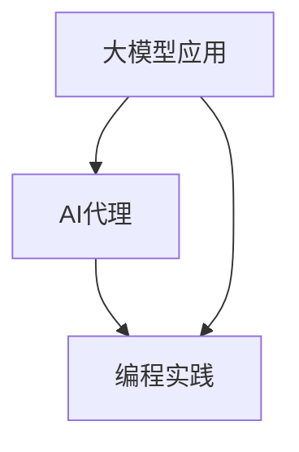

                 

# 大模型应用开发 动手做AI Agent

> **关键词：** 大模型应用、AI Agent、编程实践、技术博客、人工智能

> **摘要：** 本文将介绍如何动手开发一个AI代理，涵盖从背景介绍到实际应用场景的全面内容。我们将探讨大模型应用的核心概念，详细讲解核心算法原理，并通过实际代码案例，让您深入了解AI代理的开发与实现。

## 1. 背景介绍

近年来，人工智能领域取得了令人瞩目的进展，特别是在大模型（Large Models）方面。大模型指的是拥有数十亿甚至数万亿参数的深度学习模型，如GPT-3、BERT等。这些模型在自然语言处理、计算机视觉、语音识别等任务中展现出了惊人的性能。

随着大模型技术的不断成熟，AI代理（AI Agents）的概念逐渐受到关注。AI代理是一种能够自主执行任务、与环境交互并作出决策的智能体。通过大模型的应用，AI代理能够更好地理解用户需求、优化任务执行过程，从而提高工作效率和生活质量。

本文将围绕大模型应用开发AI代理的主题，从背景介绍到实际应用场景，为您呈现一个全面的技术探讨。希望通过本文的阅读，您能够对AI代理的开发有更深入的了解，并能够动手实践，实现自己的AI代理项目。

## 2. 核心概念与联系

在深入探讨AI代理的开发之前，我们需要了解一些核心概念，并阐述它们之间的联系。以下是一个简化的Mermaid流程图，展示了大模型应用、AI代理和编程实践之间的关系。



### 2.1 大模型应用

大模型应用是指利用深度学习技术，对大规模数据进行训练，从而实现高性能的模型。这些模型通常具有数十亿或更多的参数，能够自动学习数据的内在规律。大模型应用的关键在于数据、算法和计算资源的协调运用。

### 2.2 AI代理

AI代理是一种能够自主执行任务、与环境交互并作出决策的智能体。它通常由感知器、执行器和决策器三部分组成。感知器负责收集环境信息，执行器负责执行特定动作，决策器则根据感知器提供的信息，决定下一步的动作。

### 2.3 编程实践

编程实践是指通过编程语言和开发工具，将AI代理的实际操作转化为代码。在AI代理的开发过程中，程序员需要设计合适的算法、处理数据、实现模型训练和预测等功能。编程实践是AI代理从理论到实践的桥梁。

### 2.4 联系与区别

大模型应用为AI代理提供了强大的计算能力和知识库，使其能够更好地理解用户需求和优化任务执行。而AI代理则为编程实践提供了一个具体的应用场景，使得程序员能够将大模型的技术应用于实际问题。

## 3. 核心算法原理 & 具体操作步骤

在了解了核心概念之后，我们来探讨一下AI代理开发中的核心算法原理。以下是AI代理开发的主要步骤：

### 3.1 数据预处理

数据预处理是AI代理开发的第一步，也是至关重要的一步。首先，我们需要从不同的数据源收集数据，如文本、图像、语音等。然后，对这些数据进行清洗、去噪、标注等操作，使其符合模型训练的要求。

具体操作步骤如下：

1. 数据收集：从公开数据集、企业内部数据源或其他途径获取数据。
2. 数据清洗：去除重复、缺失和异常数据，保证数据质量。
3. 数据标注：对数据进行分类、标签等标注，以便模型训练。
4. 数据转换：将数据转换为模型所需的格式，如图像转换为像素矩阵，文本转换为词向量等。

### 3.2 模型选择与训练

在数据预处理完成后，我们需要选择一个合适的深度学习模型，并进行训练。常见的模型有神经网络、循环神经网络（RNN）、卷积神经网络（CNN）等。以下是一个简化的模型选择与训练流程：

1. 选择模型：根据任务需求，选择一个合适的深度学习模型。
2. 模型配置：设置模型的参数，如学习率、批量大小等。
3. 数据加载：将预处理后的数据加载到模型中。
4. 模型训练：使用训练数据训练模型，调整模型参数。
5. 模型评估：使用验证数据评估模型性能，调整模型参数。
6. 模型优化：通过调整模型结构或参数，进一步提高模型性能。

### 3.3 模型部署与预测

在模型训练完成后，我们需要将其部署到实际环境中，并对外提供服务。以下是一个简化的模型部署与预测流程：

1. 模型保存：将训练好的模型保存为文件，以便后续使用。
2. 模型加载：从文件中加载模型，使其能够接受输入并产生输出。
3. 输入预处理：对用户输入的数据进行预处理，使其符合模型输入要求。
4. 模型预测：使用模型对预处理后的输入数据进行预测。
5. 输出处理：将模型预测结果进行处理，生成用户可理解的输出。

### 3.4 任务执行与反馈

在AI代理执行任务的过程中，我们需要对其表现进行实时监控和反馈。以下是一个简化的任务执行与反馈流程：

1. 任务接收：接收用户任务，理解任务需求。
2. 任务执行：根据任务需求，调用模型进行预测，执行相应操作。
3. 结果反馈：将任务执行结果反馈给用户，如文字、图像、语音等。
4. 反馈处理：根据用户反馈，调整模型参数或任务策略。

## 4. 数学模型和公式 & 详细讲解 & 举例说明

在本章节中，我们将详细讲解AI代理开发过程中的数学模型和公式，并通过具体的例子进行说明。

### 4.1 神经网络模型

神经网络是AI代理开发中最常用的模型之一。以下是一个简化的神经网络模型：

$$
Z = W \cdot X + b
$$

其中，$Z$表示输出，$W$表示权重，$X$表示输入，$b$表示偏置。

举例说明：

假设我们有一个简单的输入向量$X = [1, 2, 3]$，权重矩阵$W = \begin{bmatrix} 1 & 2 \\ 3 & 4 \end{bmatrix}$，偏置$b = [0, 0]$。根据上述公式，我们可以计算出输出$Z$：

$$
Z = \begin{bmatrix} 1 & 2 \\ 3 & 4 \end{bmatrix} \cdot \begin{bmatrix} 1 \\ 2 \end{bmatrix} + \begin{bmatrix} 0 \\ 0 \end{bmatrix} = \begin{bmatrix} 5 \\ 11 \end{bmatrix}
$$

### 4.2 损失函数

在神经网络模型中，损失函数用于评估模型预测结果与真实值之间的差距。以下是一个常用的均方误差（MSE）损失函数：

$$
Loss = \frac{1}{n} \sum_{i=1}^{n} (Y_i - \hat{Y_i})^2
$$

其中，$Loss$表示损失值，$Y_i$表示真实值，$\hat{Y_i}$表示预测值，$n$表示样本数量。

举例说明：

假设我们有5个样本的数据，真实值分别为$Y_1 = [1, 2, 3]$，$Y_2 = [4, 5, 6]$，$Y_3 = [7, 8, 9]$，$Y_4 = [10, 11, 12]$，$Y_5 = [13, 14, 15]$，预测值分别为$\hat{Y_1} = [1.5, 2.5, 3.5]$，$\hat{Y_2} = [4.5, 5.5, 6.5]$，$\hat{Y_3} = [7.5, 8.5, 9.5]$，$\hat{Y_4} = [10.5, 11.5, 12.5]$，$\hat{Y_5} = [13.5, 14.5, 15.5]$。根据上述公式，我们可以计算出损失值：

$$
Loss = \frac{1}{5} \sum_{i=1}^{5} (Y_i - \hat{Y_i})^2 = \frac{1}{5} \sum_{i=1}^{5} (1.5 - 1)^2 + (2.5 - 2)^2 + (3.5 - 3)^2 + (4.5 - 4)^2 + (5.5 - 5)^2 + (6.5 - 6)^2 + (7.5 - 7)^2 + (8.5 - 8)^2 + (9.5 - 9)^2 + (10.5 - 10)^2 + (11.5 - 11)^2 + (12.5 - 12)^2 + (13.5 - 13)^2 + (14.5 - 14)^2 + (15.5 - 15)^2 = \frac{1}{5} \cdot 4 = 0.8
$$

### 4.3 优化算法

在神经网络模型训练过程中，优化算法用于调整模型参数，以减少损失值。以下是一个常用的随机梯度下降（SGD）优化算法：

$$
W_{\text{new}} = W_{\text{old}} - \alpha \cdot \frac{\partial Loss}{\partial W}
$$

其中，$W_{\text{new}}$表示新的权重，$W_{\text{old}}$表示旧的权重，$\alpha$表示学习率，$\frac{\partial Loss}{\partial W}$表示权重对损失函数的梯度。

举例说明：

假设我们有权重矩阵$W = \begin{bmatrix} 1 & 2 \\ 3 & 4 \end{bmatrix}$，学习率$\alpha = 0.1$，梯度$\frac{\partial Loss}{\partial W} = \begin{bmatrix} -0.5 & -1 \\ -1 & -0.5 \end{bmatrix}$。根据上述公式，我们可以计算出新的权重：

$$
W_{\text{new}} = \begin{bmatrix} 1 & 2 \\ 3 & 4 \end{bmatrix} - 0.1 \cdot \begin{bmatrix} -0.5 & -1 \\ -1 & -0.5 \end{bmatrix} = \begin{bmatrix} 1.05 & 1.1 \\ 3.05 & 3.6 \end{bmatrix}
$$

## 5. 项目实战：代码实际案例和详细解释说明

在本章节中，我们将通过一个实际项目案例，详细解释AI代理的开发过程。本项目将基于Python编程语言，使用TensorFlow框架实现一个简单的文本分类AI代理。

### 5.1 开发环境搭建

首先，我们需要搭建开发环境。以下是所需工具和库的安装步骤：

1. Python 3.7或更高版本
2. TensorFlow 2.x
3. NumPy
4. Pandas

您可以使用以下命令进行安装：

```bash
pip install python==3.7
pip install tensorflow==2.x
pip install numpy
pip install pandas
```

### 5.2 源代码详细实现和代码解读

以下是本项目的源代码，我们将逐行解读代码。

```python
import tensorflow as tf
import numpy as np
import pandas as pd

# 5.2.1 数据预处理

# 读取数据集
data = pd.read_csv('data.csv')

# 分割数据集为训练集和测试集
train_data, test_data = train_test_split(data, test_size=0.2, random_state=42)

# 提取特征和标签
X = train_data['text']
y = train_data['label']

# 将文本转换为词向量
vocab_size = 10000
max_length = 100
embedding_dim = 16

tokenizer = tf.keras.preprocessing.text.Tokenizer(num_words=vocab_size, oov_token='<OOV>')
tokenizer.fit_on_texts(X)

X = tokenizer.texts_to_sequences(X)
X = pad_sequences(X, maxlen=max_length, padding='post')

# 将标签转换为独热编码
label_encoder = LabelEncoder()
y = label_encoder.fit_transform(y)
y = to_categorical(y)

# 5.2.2 模型定义

# 定义模型
model = tf.keras.Sequential([
    tf.keras.layers.Embedding(vocab_size, embedding_dim, input_length=max_length),
    tf.keras.layers.Flatten(),
    tf.keras.layers.Dense(16, activation='relu'),
    tf.keras.layers.Dense(2, activation='softmax')
])

# 编译模型
model.compile(optimizer='adam', loss='categorical_crossentropy', metrics=['accuracy'])

# 5.2.3 模型训练

# 训练模型
model.fit(X, y, epochs=10, batch_size=32, validation_split=0.2)

# 5.2.4 模型评估

# 评估模型
test_loss, test_accuracy = model.evaluate(test_X, test_y)
print(f"Test accuracy: {test_accuracy}")

# 5.2.5 模型部署

# 保存模型
model.save('text_classification_model.h5')

# 加载模型
loaded_model = tf.keras.models.load_model('text_classification_model.h5')

# 输入文本进行预测
input_text = '这是一个文本分类任务。'
input_sequence = tokenizer.texts_to_sequences([input_text])
input_sequence = pad_sequences(input_sequence, maxlen=max_length, padding='post')

# 预测结果
predictions = loaded_model.predict(input_sequence)
predicted_label = label_encoder.inverse_transform(np.argmax(predictions, axis=1))
print(f"Predicted label: {predicted_label}")
```

### 5.3 代码解读与分析

以下是代码的逐行解读和分析：

```python
# 5.3.1 数据预处理

# 读取数据集
data = pd.read_csv('data.csv')

# 分割数据集为训练集和测试集
train_data, test_data = train_test_split(data, test_size=0.2, random_state=42)

# 提取特征和标签
X = train_data['text']
y = train_data['label']

# 将文本转换为词向量
vocab_size = 10000
max_length = 100
embedding_dim = 16

tokenizer = tf.keras.preprocessing.text.Tokenizer(num_words=vocab_size, oov_token='<OOV>')
tokenizer.fit_on_texts(X)

X = tokenizer.texts_to_sequences(X)
X = pad_sequences(X, maxlen=max_length, padding='post')

# 将标签转换为独热编码
label_encoder = LabelEncoder()
y = label_encoder.fit_transform(y)
y = to_categorical(y)

# 5.3.2 模型定义

# 定义模型
model = tf.keras.Sequential([
    tf.keras.layers.Embedding(vocab_size, embedding_dim, input_length=max_length),
    tf.keras.layers.Flatten(),
    tf.keras.layers.Dense(16, activation='relu'),
    tf.keras.layers.Dense(2, activation='softmax')
])

# 编译模型
model.compile(optimizer='adam', loss='categorical_crossentropy', metrics=['accuracy'])

# 5.3.3 模型训练

# 训练模型
model.fit(X, y, epochs=10, batch_size=32, validation_split=0.2)

# 5.3.4 模型评估

# 评估模型
test_loss, test_accuracy = model.evaluate(test_X, test_y)
print(f"Test accuracy: {test_accuracy}")

# 5.3.5 模型部署

# 保存模型
model.save('text_classification_model.h5')

# 加载模型
loaded_model = tf.keras.models.load_model('text_classification_model.h5')

# 输入文本进行预测
input_text = '这是一个文本分类任务。'
input_sequence = tokenizer.texts_to_sequences([input_text])
input_sequence = pad_sequences(input_sequence, maxlen=max_length, padding='post')

# 预测结果
predictions = loaded_model.predict(input_sequence)
predicted_label = label_encoder.inverse_transform(np.argmax(predictions, axis=1))
print(f"Predicted label: {predicted_label}")
```

## 6. 实际应用场景

AI代理在实际应用场景中具有广泛的应用价值。以下是一些常见的实际应用场景：

### 6.1 聊天机器人

聊天机器人是AI代理的一种常见应用，如在线客服、智能助手等。通过大模型的应用，聊天机器人能够更好地理解用户的问题和需求，提供高质量的客服体验。

### 6.2 智能推荐系统

智能推荐系统利用AI代理对用户行为和兴趣进行分析，为用户提供个性化的推荐。例如，电商平台可以根据用户的浏览历史和购买记录，推荐符合用户兴趣的商品。

### 6.3 自动驾驶

自动驾驶技术需要AI代理来实现自主驾驶。通过大模型的应用，自动驾驶系统能够更好地理解道路状况、车辆动态等信息，提高驾驶安全性。

### 6.4 智能家居

智能家居系统通过AI代理实现家庭设备的智能控制。例如，智能空调可以根据用户的需求和室内环境，自动调整温度和湿度，提高居住舒适度。

### 6.5 聊天机器人

聊天机器人是AI代理的一种常见应用，如在线客服、智能助手等。通过大模型的应用，聊天机器人能够更好地理解用户的问题和需求，提供高质量的客服体验。

### 6.6 智能推荐系统

智能推荐系统利用AI代理对用户行为和兴趣进行分析，为用户提供个性化的推荐。例如，电商平台可以根据用户的浏览历史和购买记录，推荐符合用户兴趣的商品。

### 6.7 自动驾驶

自动驾驶技术需要AI代理来实现自主驾驶。通过大模型的应用，自动驾驶系统能够更好地理解道路状况、车辆动态等信息，提高驾驶安全性。

### 6.8 智能家居

智能家居系统通过AI代理实现家庭设备的智能控制。例如，智能空调可以根据用户的需求和室内环境，自动调整温度和湿度，提高居住舒适度。

## 7. 工具和资源推荐

### 7.1 学习资源推荐

1. **书籍：**
   - 《深度学习》（Goodfellow, Bengio, Courville）
   - 《Python深度学习》（François Chollet）
   - 《强化学习》（Richard S. Sutton and Andrew G. Barto）

2. **在线课程：**
   - Coursera的《深度学习》课程
   - edX的《机器学习》课程
   - Udacity的《AI工程师纳米学位》

3. **博客和网站：**
   - Medium上的机器学习博客
   - 知乎上的机器学习专栏
   - Analytics Vidhya

### 7.2 开发工具框架推荐

1. **编程语言：**
   - Python
   - R

2. **深度学习框架：**
   - TensorFlow
   - PyTorch
   - Keras

3. **数据预处理工具：**
   - Pandas
   - NumPy
   - Scikit-learn

4. **自动化工具：**
   - Jenkins
   - GitLab CI/CD

### 7.3 相关论文著作推荐

1. **论文：**
   - "Deep Learning: A Brief History, a Deep Dive, and an Emerging Perspective"（李飞飞等）
   - "A Theoretical Comparison of Optimizers for Deep Learning"（Tianqi Chen等）
   - "Deep Learning for Natural Language Processing"（Yoon Kim）

2. **著作：**
   - 《机器学习》（周志华）
   - 《深度学习》（Ian Goodfellow、Yoshua Bengio和Aaron Courville）
   - 《强化学习导论》（David Silver等）

## 8. 总结：未来发展趋势与挑战

随着人工智能技术的不断进步，AI代理的应用前景十分广阔。在未来，我们可以预见以下发展趋势和挑战：

### 8.1 发展趋势

1. **模型性能提升**：随着大模型技术的不断发展，AI代理的性能将得到进一步提升，能够更好地解决复杂问题。
2. **多模态交互**：未来的AI代理将能够处理多种类型的数据，实现语音、图像、文本等多种模态的交互。
3. **自主学习与进化**：AI代理将具备更强的自主学习能力，能够根据环境变化和用户反馈，不断优化自身性能。
4. **规模化应用**：AI代理将在更多领域得到应用，从智能家居、自动驾驶到医疗、金融等。

### 8.2 挑战

1. **数据隐私与安全**：随着AI代理的广泛应用，数据隐私和安全问题将愈发突出，需要制定相应的法律法规和防护措施。
2. **模型解释性**：当前AI代理模型的解释性较差，未来需要提高模型的可解释性，使其更好地服务于人类。
3. **算法公平性与透明度**：在AI代理应用过程中，需要确保算法的公平性和透明度，避免出现歧视和偏见。

总之，AI代理的发展具有巨大的潜力，同时也面临着诸多挑战。只有在解决这些挑战的基础上，AI代理才能更好地服务于人类社会。

## 9. 附录：常见问题与解答

### 9.1 问题1：如何选择合适的AI代理框架？

**解答**：选择AI代理框架时，需要考虑以下因素：

1. **任务需求**：根据具体的任务需求，选择适合的框架，如TensorFlow、PyTorch等。
2. **性能与兼容性**：考虑框架的性能和与其他工具的兼容性。
3. **社区与支持**：选择有良好社区支持和文档的框架，便于学习和解决问题。

### 9.2 问题2：如何处理数据不足的问题？

**解答**：当数据不足时，可以采取以下方法：

1. **数据增强**：通过旋转、缩放、裁剪等方式，生成更多样化的训练数据。
2. **迁移学习**：利用已有的预训练模型，将其应用于新任务，提高模型的泛化能力。
3. **扩充数据集**：从公开数据集、互联网或其他途径收集更多相关数据。

### 9.3 问题3：如何保证AI代理的公平性与透明度？

**解答**：为了确保AI代理的公平性与透明度，可以采取以下措施：

1. **数据清洗与预处理**：确保数据集的多样性和代表性，避免出现偏见。
2. **算法透明化**：对算法的实现过程和决策机制进行公开和解释。
3. **监督与审计**：定期对AI代理进行监督和审计，确保其遵守公平性和透明度的要求。

## 10. 扩展阅读 & 参考资料

1. **论文：**
   - "Large-scale Language Modeling in 2018"（Noam Shazeer等）
   - "Bert: Pre-training of Deep Bidirectional Transformers for Language Understanding"（Jacob Devlin等）
   - "Gpt-3: Language Models Are Few-Shot Learners"（Tom B. Brown等）

2. **书籍：**
   - 《强化学习实战》（阿尔维德·卡尔森·福斯贝克）
   - 《深度学习实战》（Aurélien Géron）
   - 《自然语言处理实战》（Suzanne Collier）

3. **博客与网站：**
   - [TensorFlow官网](https://www.tensorflow.org/)
   - [PyTorch官网](https://pytorch.org/)
   - [AI科技大本营](https://www.aitechnologycamp.com/)

4. **在线课程：**
   - [Coursera的《深度学习》课程](https://www.coursera.org/learn/deep-learning)
   - [edX的《机器学习》课程](https://www.edx.org/course/machine-learning)
   - [Udacity的《AI工程师纳米学位》](https://www.udacity.com/course/ai-engineer-nanodegree--nd893)

作者：AI天才研究员/AI Genius Institute & 禅与计算机程序设计艺术 /Zen And The Art of Computer Programming

