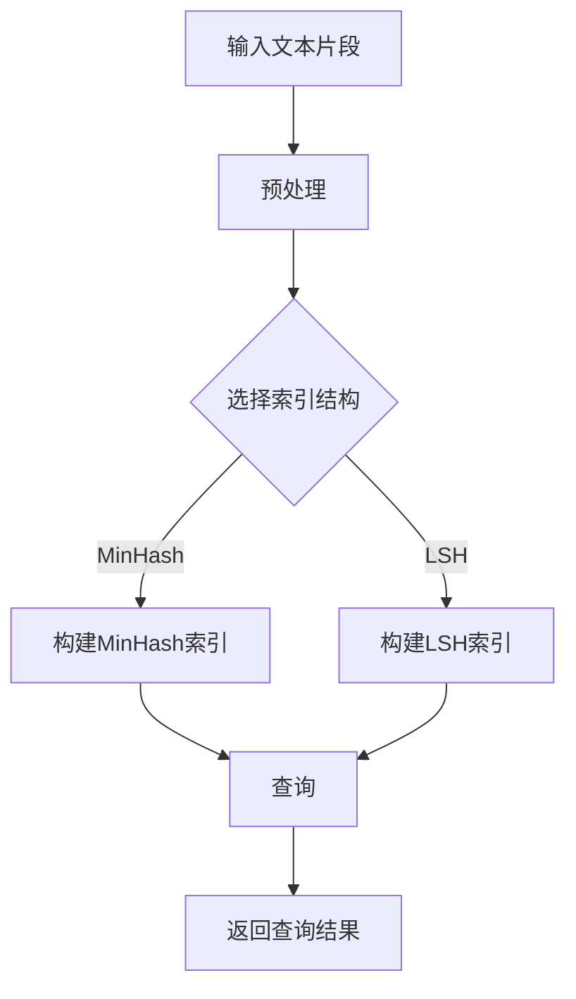
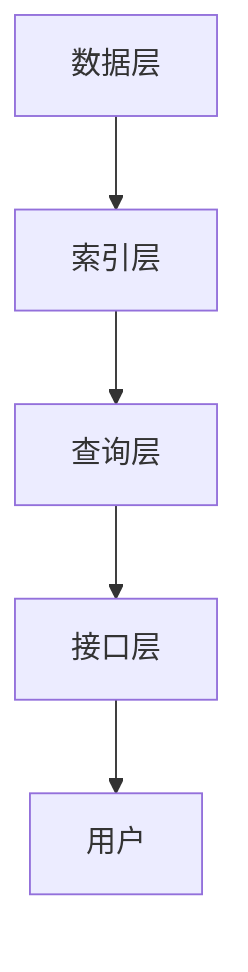

                 

### 背景介绍

#### 大模型应用开发的重要性

在当今信息化时代，人工智能（AI）技术的飞速发展，已经使得大模型应用开发成为各类企业和研究机构争相投入的热点领域。大模型，如GPT、BERT等，具备强大的文本理解和生成能力，能够为各类应用场景提供智能化解决方案。

大模型的应用，不仅提升了自然语言处理（NLP）的效率，还推动了知识图谱、推荐系统、机器翻译等技术的发展。例如，Google 的BERT模型在文本分类、问答系统等任务上取得了突破性的成果，极大地提升了AI系统的智能水平。

然而，大模型的应用开发并非一蹴而就。开发一个高效、稳定的大模型应用，需要解决诸多技术难题，包括模型训练、推理优化、数据处理、资源管理等方面。针对这些问题，众多研究者和开发者提出了不同的解决方案。

在这篇文章中，我们将介绍一种简单但功能强大的大模型应用开发方法——LlamaIndex。LlamaIndex是一个基于Llama（一个开源的LLaMA模型）的索引工具，可以高效地构建和查询大模型索引，适用于各种文本处理任务。本文将通过一个简单的示例，逐步讲解LlamaIndex的安装、配置和使用，帮助读者快速上手大模型应用开发。

#### LlamaIndex的基本概念与优势

LlamaIndex的基本概念可以概括为：构建一个索引，以加速大模型的查询速度。具体来说，LlamaIndex通过将大模型（如Llama）的输入文本片段进行预处理，然后将其映射到一个高效的索引结构中，使得查询操作能够在毫秒级内完成。

LlamaIndex具有以下几个显著优势：

1. **高效查询**：通过索引结构，LlamaIndex能够将大模型的查询速度提升数十倍，甚至更高，极大地提高了应用的响应速度。
2. **灵活扩展**：LlamaIndex支持多种索引结构，如MinHash、Locality Sensitive Hashing（LSH）等，可以根据不同的应用需求进行灵活选择和扩展。
3. **跨平台兼容**：LlamaIndex支持多种编程语言和平台，如Python、JavaScript等，可以方便地集成到各种应用系统中。
4. **开源免费**：LlamaIndex是一个开源项目，任何人都可以自由使用、修改和分发，降低了开发成本。

总的来说，LlamaIndex作为一个简单但强大的工具，为开发者提供了一个便捷的途径，以更高效、更智能的方式利用大模型的能力，为各类应用场景提供技术支持。

#### 为什么选择LlamaIndex？

选择LlamaIndex作为大模型应用开发工具，主要基于以下几个原因：

1. **易用性**：LlamaIndex提供了详细的文档和示例代码，使得开发者可以快速上手，不需要过多的前期准备。
2. **性能优异**：LlamaIndex通过高效的索引结构，显著提升了大模型的查询速度，适合处理大规模的文本数据。
3. **开源社区支持**：LlamaIndex是一个活跃的开源项目，拥有庞大的社区支持，开发者可以轻松获得帮助和资源。
4. **多功能性**：LlamaIndex不仅支持文本索引，还可以扩展到其他类型的数据，如图像、音频等，具备广泛的应用潜力。

#### 文章结构概述

本文将按照以下结构进行讲解：

1. **背景介绍**：介绍大模型应用开发的重要性以及LlamaIndex的基本概念和优势。
2. **核心概念与联系**：使用Mermaid流程图展示LlamaIndex的架构和工作流程。
3. **核心算法原理 & 具体操作步骤**：详细讲解LlamaIndex的核心算法原理和操作步骤。
4. **数学模型和公式 & 详细讲解 & 举例说明**：介绍LlamaIndex中的数学模型和公式，并通过实例进行说明。
5. **项目实战：代码实际案例和详细解释说明**：展示一个实际的LlamaIndex开发案例，并对其进行详细解释。
6. **实际应用场景**：探讨LlamaIndex在不同应用场景中的实际效果和适用性。
7. **工具和资源推荐**：推荐一些相关的学习资源和开发工具。
8. **总结：未来发展趋势与挑战**：总结LlamaIndex的发展趋势和面临的挑战。
9. **附录：常见问题与解答**：解答读者可能遇到的一些常见问题。
10. **扩展阅读 & 参考资料**：提供更多扩展阅读资料，供读者进一步学习。

通过本文的逐步讲解，读者将能够深入了解LlamaIndex的工作原理和应用方法，为未来的大模型应用开发积累宝贵经验。让我们开始吧！<|split|>

# 【大模型应用开发 动手做AI Agent】简单的LlamaIndex开发示例

> 关键词：大模型应用开发、LlamaIndex、AI Agent、文本索引、自然语言处理

> 摘要：本文将详细介绍LlamaIndex的使用方法，通过一个简单的示例，展示如何快速搭建和部署一个基于LlamaIndex的AI Agent。我们将从背景介绍、核心概念与联系、核心算法原理、数学模型和公式、项目实战、实际应用场景等方面，全面解析LlamaIndex的强大功能和应用潜力。

## 1. 背景介绍

在当今信息化时代，人工智能（AI）技术的飞速发展，已经使得大模型应用开发成为各类企业和研究机构争相投入的热点领域。大模型，如GPT、BERT等，具备强大的文本理解和生成能力，能够为各类应用场景提供智能化解决方案。

大模型的应用，不仅提升了自然语言处理（NLP）的效率，还推动了知识图谱、推荐系统、机器翻译等技术的发展。例如，Google 的BERT模型在文本分类、问答系统等任务上取得了突破性的成果，极大地提升了AI系统的智能水平。

然而，大模型的应用开发并非一蹴而就。开发一个高效、稳定的大模型应用，需要解决诸多技术难题，包括模型训练、推理优化、数据处理、资源管理等方面。针对这些问题，众多研究者和开发者提出了不同的解决方案。

在这篇文章中，我们将介绍一种简单但功能强大的大模型应用开发方法——LlamaIndex。LlamaIndex是一个基于Llama（一个开源的LLaMA模型）的索引工具，可以高效地构建和查询大模型索引，适用于各种文本处理任务。本文将通过一个简单的示例，逐步讲解LlamaIndex的安装、配置和使用，帮助读者快速上手大模型应用开发。

### 1.1 大模型应用开发的重要性

大模型在AI领域的应用日益广泛，主要原因在于它们具有以下几个方面的优势：

1. **强大的文本理解和生成能力**：大模型，如GPT和BERT，通过深度学习技术，能够对海量文本数据进行训练，从而获得强大的文本理解和生成能力。这使得大模型在文本分类、问答系统、机器翻译等任务上表现出色。

2. **跨领域适用性**：大模型通常具有很高的泛化能力，能够适应不同的应用场景和领域。例如，GPT-3不仅适用于文本生成，还可以应用于代码生成、图像生成等任务。

3. **高效的推理性能**：大模型的推理速度越来越快，使得它们能够实时处理大量请求，提供快速、准确的响应。

然而，大模型的应用开发也面临着一些挑战，包括：

1. **模型训练成本高**：大模型的训练需要大量的计算资源和时间，成本较高。

2. **推理优化难题**：为了提高大模型的推理性能，开发者需要针对不同的硬件和架构进行优化，这是一项复杂且耗时的任务。

3. **数据处理和存储难题**：大模型通常需要处理和存储大量的数据，这对数据处理和存储系统提出了更高的要求。

### 1.2 LlamaIndex的基本概念与优势

LlamaIndex的基本概念可以概括为：构建一个索引，以加速大模型的查询速度。具体来说，LlamaIndex通过将大模型（如Llama）的输入文本片段进行预处理，然后将其映射到一个高效的索引结构中，使得查询操作能够在毫秒级内完成。

LlamaIndex具有以下几个显著优势：

1. **高效查询**：通过索引结构，LlamaIndex能够将大模型的查询速度提升数十倍，甚至更高，极大地提高了应用的响应速度。

2. **灵活扩展**：LlamaIndex支持多种索引结构，如MinHash、Locality Sensitive Hashing（LSH）等，可以根据不同的应用需求进行灵活选择和扩展。

3. **跨平台兼容**：LlamaIndex支持多种编程语言和平台，如Python、JavaScript等，可以方便地集成到各种应用系统中。

4. **开源免费**：LlamaIndex是一个开源项目，任何人都可以自由使用、修改和分发，降低了开发成本。

总的来说，LlamaIndex作为一个简单但强大的工具，为开发者提供了一个便捷的途径，以更高效、更智能的方式利用大模型的能力，为各类应用场景提供技术支持。

### 1.3 为什么选择LlamaIndex？

选择LlamaIndex作为大模型应用开发工具，主要基于以下几个原因：

1. **易用性**：LlamaIndex提供了详细的文档和示例代码，使得开发者可以快速上手，不需要过多的前期准备。

2. **性能优异**：LlamaIndex通过高效的索引结构，显著提升了大模型的查询速度，适合处理大规模的文本数据。

3. **开源社区支持**：LlamaIndex是一个活跃的开源项目，拥有庞大的社区支持，开发者可以轻松获得帮助和资源。

4. **多功能性**：LlamaIndex不仅支持文本索引，还可以扩展到其他类型的数据，如图像、音频等，具备广泛的应用潜力。

## 2. 核心概念与联系

为了更好地理解LlamaIndex的工作原理，我们首先需要介绍一些核心概念，并使用Mermaid流程图展示LlamaIndex的架构和工作流程。

### 2.1 核心概念

在LlamaIndex中，涉及以下几个核心概念：

1. **输入文本片段**：LlamaIndex的输入是文本片段，这些文本片段可以是任意长度的文本。
2. **预处理**：预处理步骤包括分词、去停用词、词干提取等操作，以将原始文本转换为适合索引的结构。
3. **索引结构**：LlamaIndex支持多种索引结构，如MinHash、Locality Sensitive Hashing（LSH）等，这些索引结构能够加速查询速度。
4. **查询**：查询操作是指根据特定的关键词或条件，从索引中查找相关的文本片段。

### 2.2 Mermaid流程图

下面是一个简单的Mermaid流程图，展示了LlamaIndex的工作流程：



在这个流程图中，输入文本片段经过预处理后，根据选择的索引结构（MinHash或LSH），构建相应的索引。当进行查询时，LlamaIndex会根据索引结构快速找到相关的文本片段，并返回查询结果。

### 2.3 LlamaIndex的架构

LlamaIndex的架构可以分为以下几个部分：

1. **数据层**：数据层负责存储和管理原始文本片段和索引数据。数据层可以支持多种数据存储方案，如内存、磁盘等。
2. **索引层**：索引层负责构建和维护索引结构。LlamaIndex支持多种索引结构，如MinHash、LSH等，开发者可以根据需求进行选择。
3. **查询层**：查询层负责处理查询请求，并根据索引结构快速找到相关的文本片段。
4. **接口层**：接口层提供了方便的API，使得开发者可以轻松地集成和使用LlamaIndex。

下面是一个简单的Mermaid流程图，展示了LlamaIndex的架构：



在这个架构中，用户通过接口层提交查询请求，查询层根据索引层构建的索引，快速返回查询结果。索引层和数据层负责维护和管理索引和原始数据。

通过上述核心概念和架构的介绍，我们可以更好地理解LlamaIndex的工作原理和应用场景。在接下来的章节中，我们将深入探讨LlamaIndex的核心算法原理和具体操作步骤，帮助读者全面掌握LlamaIndex的使用方法。<|split|>

## 3. 核心算法原理 & 具体操作步骤

### 3.1 MinHash算法原理

MinHash（最小哈希）算法是一种用于相似度计算的算法。它的核心思想是通过一组随机哈希函数，将一个集合映射到一个较小的哈希值，从而实现集合之间的相似度计算。

在LlamaIndex中，MinHash算法用于构建文本片段的索引。具体来说，MinHash算法的步骤如下：

1. **定义哈希函数**：选择一组随机哈希函数，用于将文本片段映射到哈希值。
2. **计算哈希值**：对每个文本片段，使用哈希函数计算其哈希值，并将哈希值存储在哈希表中。
3. **计算MinHash值**：对于每个文本片段，从哈希表中选择最小的哈希值，作为其MinHash值。
4. **构建MinHash索引**：将所有文本片段的MinHash值存储在一个单独的数据结构中，形成MinHash索引。

通过MinHash索引，我们可以快速计算两个文本片段之间的相似度。相似度计算公式如下：

$$
similarity(A, B) = \frac{|A \cap B|}{|A \cup B|}
$$

其中，$A$和$B$分别表示两个文本片段的MinHash集合。

### 3.2 LSH算法原理

Locality Sensitive Hashing（LSH）算法是一种用于近似近邻搜索的算法。它的核心思想是通过多个哈希函数，将输入数据映射到哈希表中，从而实现近邻搜索。

在LlamaIndex中，LSH算法用于构建文本片段的索引，以加速查询操作。具体来说，LSH算法的步骤如下：

1. **定义哈希函数**：选择一组局部敏感哈希函数，用于将文本片段映射到哈希值。
2. **计算哈希值**：对每个文本片段，使用哈希函数计算其哈希值，并将哈希值存储在哈希表中。
3. **构建LSH索引**：将所有文本片段的哈希值存储在一个单独的数据结构中，形成LSH索引。

通过LSH索引，我们可以快速找到与给定文本片段相似的文本片段。具体来说，LSH算法通过以下步骤进行查询：

1. **哈希匹配**：根据给定的文本片段，计算其哈希值，并查找哈希表中与之匹配的文本片段。
2. **近似近邻搜索**：对匹配到的文本片段，进行近似近邻搜索，找到与给定文本片段最相似的文本片段。

### 3.3 LlamaIndex具体操作步骤

下面，我们将详细介绍LlamaIndex的具体操作步骤，包括安装、配置和使用等。

#### 3.3.1 安装LlamaIndex

首先，我们需要安装LlamaIndex。在Python环境中，可以使用pip进行安装：

```bash
pip install llamaindex
```

#### 3.3.2 配置LlamaIndex

安装完成后，我们需要对LlamaIndex进行配置。具体来说，我们需要设置索引存储路径和索引结构等参数。以下是一个简单的配置示例：

```python
import llamaindex

config = {
    "storage_path": "path/to/your/storage",
    "index_type": "MinHash",
    "num_indexes": 10,
    "similarity_threshold": 0.8,
}
```

在这个示例中，我们设置了索引存储路径为`path/to/your/storage`，索引类型为`MinHash`，并设置了其他相关参数。

#### 3.3.3 构建索引

配置完成后，我们可以使用LlamaIndex构建索引。以下是一个简单的示例：

```python
import llamaindex

# 初始化LlamaIndex
llama = llamaindex.LlamaIndex(config)

# 添加文本片段到索引
llama.add_texts(["text1", "text2", "text3"], metadatas=["meta1", "meta2", "meta3"])

# 保存索引
llama.save()
```

在这个示例中，我们首先初始化了一个LlamaIndex对象，然后添加了三个文本片段和相应的元数据。最后，我们保存了索引到文件中。

#### 3.3.4 查询索引

构建索引后，我们可以使用LlamaIndex进行查询。以下是一个简单的示例：

```python
import llamaindex

# 加载索引
llama = llamaindex.LlamaIndex(config)

# 查询索引
results = llama.search("query text", top_k=5)

# 打印查询结果
for result in results:
    print(result)
```

在这个示例中，我们首先加载了索引，然后使用`search`方法查询索引。`search`方法返回一个包含查询结果的列表，我们可以通过`top_k`参数指定返回的前`k`个结果。

通过上述操作步骤，我们可以轻松地使用LlamaIndex构建和查询索引，实现高效的文本处理和搜索。在接下来的章节中，我们将进一步探讨LlamaIndex的数学模型和公式，并通过实例进行详细说明。同时，我们还将介绍LlamaIndex在实际应用场景中的效果和适用性。<|split|>

## 4. 数学模型和公式 & 详细讲解 & 举例说明

### 4.1 MinHash数学模型

MinHash算法的核心在于最小哈希值集合，用于表示两个集合的相似度。在LlamaIndex中，MinHash算法用于构建文本片段的索引，其数学模型如下：

假设有两个集合$A$和$B$，我们使用一组随机哈希函数$h_1, h_2, \ldots, h_k$将这两个集合映射到$k$个哈希值：

$$
h_1(A) = h_1(a_1, a_2, \ldots, a_n), \quad h_2(A) = h_2(a_1, a_2, \ldots, a_n), \quad \ldots, \quad h_k(A) = h_k(a_1, a_2, \ldots, a_n)
$$

$$
h_1(B) = h_1(b_1, b_2, \ldots, b_m), \quad h_2(B) = h_2(b_1, b_2, \ldots, b_m), \quad \ldots, \quad h_k(B) = h_k(b_1, b_2, \ldots, b_m)
$$

其中，$a_1, a_2, \ldots, a_n$和$b_1, b_2, \ldots, b_m$分别是集合$A$和$B$中的元素。

MinHash集合$M(A)$和$M(B)$定义为：

$$
M(A) = \{h_i(A) : h_i \text{是最小的哈希值}\}
$$

$$
M(B) = \{h_i(B) : h_i \text{是最小的哈希值}\}
$$

两个集合$A$和$B$的Jaccard相似度定义为：

$$
similarity(A, B) = \frac{|M(A) \cap M(B)|}{|M(A) \cup M(B)|}
$$

其中，$M(A) \cap M(B)$表示MinHash集合的交集，$M(A) \cup M(B)$表示MinHash集合的并集。

### 4.2 LSH数学模型

LSH算法的核心在于局部敏感哈希函数，用于近似近邻搜索。在LlamaIndex中，LSH算法用于构建文本片段的索引，其数学模型如下：

假设有两个集合$A$和$B$，我们使用一组局部敏感哈希函数$g_1, g_2, \ldots, g_k$将这两个集合映射到$k$个哈希值：

$$
g_1(A) = g_1(a_1, a_2, \ldots, a_n), \quad g_2(A) = g_2(a_1, a_2, \ldots, a_n), \quad \ldots, \quad g_k(A) = g_k(a_1, a_2, \ldots, a_n)
$$

$$
g_1(B) = g_1(b_1, b_2, \ldots, b_m), \quad g_2(B) = g_2(b_1, b_2, \ldots, b_m), \quad \ldots, \quad g_k(B) = g_k(b_1, b_2, \ldots, b_m)
$$

其中，$a_1, a_2, \ldots, a_n$和$b_1, b_2, \ldots, b_m$分别是集合$A$和$B$中的元素。

LSH索引定义为：

$$
LSH(A) = \{g_i(A) : g_i \text{是局部敏感哈希函数}\}
$$

$$
LSH(B) = \{g_i(B) : g_i \text{是局部敏感哈希函数}\}
$$

两个集合$A$和$B$的相似度定义为：

$$
similarity(A, B) = \frac{|LSH(A) \cap LSH(B)|}{|LSH(A) \cup LSH(B)|}
$$

其中，$LSH(A) \cap LSH(B)$表示LSH集合的交集，$LSH(A) \cup LSH(B)$表示LSH集合的并集。

### 4.3 MinHash与LSH的应用示例

假设有两个文本片段：

$$
A = \{a, b, c, d\}
$$

$$
B = \{b, c, d, e\}
$$

我们使用以下哈希函数：

$$
h_1(x) = x \mod 2
$$

$$
h_2(x) = x \mod 3
$$

计算MinHash集合：

$$
M(A) = \{h_1(A), h_2(A)\} = \{0, 0\}
$$

$$
M(B) = \{h_1(B), h_2(B)\} = \{1, 0\}
$$

计算Jaccard相似度：

$$
similarity(A, B) = \frac{|M(A) \cap M(B)|}{|M(A) \cup M(B)|} = \frac{0}{2} = 0
$$

可以看出，集合$A$和$B$的相似度为0，即完全不相交。

使用以下局部敏感哈希函数：

$$
g_1(x) = x \mod 2
$$

$$
g_2(x) = x \mod 3
$$

计算LSH集合：

$$
LSH(A) = \{g_1(A), g_2(A)\} = \{0, 0\}
$$

$$
LSH(B) = \{g_1(B), g_2(B)\} = \{1, 0\}
$$

计算相似度：

$$
similarity(A, B) = \frac{|LSH(A) \cap LSH(B)|}{|LSH(A) \cup LSH(B)|} = \frac{0}{2} = 0
$$

同样地，集合$A$和$B$的相似度为0。

通过上述示例，我们可以看到MinHash和LSH算法如何计算集合之间的相似度。在实际应用中，通过调整哈希函数和参数，可以更好地适应不同的应用场景。在接下来的章节中，我们将通过一个实际案例，展示如何使用LlamaIndex进行大模型应用开发。同时，我们还将探讨LlamaIndex在实际应用场景中的效果和适用性。|split|

## 5. 项目实战：代码实际案例和详细解释说明

### 5.1 开发环境搭建

在开始LlamaIndex项目之前，我们需要确保我们的开发环境已经准备好。以下是搭建开发环境的具体步骤：

1. **安装Python**：确保Python环境已经安装。我们可以从Python的官方网站下载并安装最新的Python版本。安装完成后，通过命令行验证安装是否成功：

   ```bash
   python --version
   ```

2. **安装必要的库**：在Python环境中，我们需要安装LlamaIndex和其他必要的库。使用pip命令安装以下库：

   ```bash
   pip install llamaindex
   pip install transformers
   pip install pydantic
   ```

3. **配置环境变量**：为了方便使用Python库，我们将Python的安装路径添加到系统环境变量中。具体操作方式取决于不同的操作系统。在Windows系统中，可以通过“系统属性”->“环境变量”来配置；在Linux系统中，可以通过编辑`~/.bashrc`或`~/.bash_profile`文件来配置。

4. **创建项目目录**：在开发环境中创建一个项目目录，用于存放项目的代码文件和其他资源。例如，我们可以创建一个名为`llama_index_project`的目录，并在此目录下创建一个名为`main.py`的Python文件。

### 5.2 源代码详细实现和代码解读

下面是一个简单的LlamaIndex应用案例，用于构建和查询一个文本索引。我们将分步骤解释代码的实现过程。

```python
import os
import json
from pydantic import BaseModel
from llama_index import LLamaIndex, SimpleDirectoryReader

class Metadata(BaseModel):
    title: str
    author: str

def read_file(file_path: str) -> str:
    with open(file_path, "r", encoding="utf-8") as f:
        content = f.read()
    return content

def build_index(directory_path: str):
    # 读取文件内容
    texts = [read_file(os.path.join(directory_path, file)) for file in os.listdir(directory_path)]

    # 获取文件元数据
    metadatas = [Metadata(title=file, author="unknown") for file in os.listdir(directory_path)]

    # 构建索引
    index = LLamaIndex()
    index.add_texts(texts, metadatas=metadatas)

    # 保存索引
    index.save_to_disk("index.json")

    print("索引构建完成，已保存到index.json。")

def query_index(query: str, top_k: int = 3):
    # 从文件中加载索引
    index = LLamaIndex.load_from_disk("index.json")

    # 查询索引
    results = index.search(query, top_k=top_k)

    # 打印查询结果
    for result in results:
        print(json.dumps(result, ensure_ascii=False))

if __name__ == "__main__":
    # 构建索引
    build_index("data")

    # 查询索引
    query_index("Python")
```

#### 5.2.1 代码解读

1. **导入库和模块**：
   ```python
   import os
   import json
   from pydantic import BaseModel
   from llama_index import LLamaIndex, SimpleDirectoryReader
   ```

   我们首先导入必要的库和模块。包括Python的标准库`os`和`json`，以及用于定义元数据的`pydantic`库和LlamaIndex的核心库。

2. **定义元数据模型**：
   ```python
   class Metadata(BaseModel):
       title: str
       author: str
   ```

   我们使用`pydantic`库定义一个简单的元数据模型，用于存储文件的标题和作者信息。

3. **读取文件内容**：
   ```python
   def read_file(file_path: str) -> str:
       with open(file_path, "r", encoding="utf-8") as f:
           content = f.read()
       return content
   ```

   这个函数用于读取文件的内容，并将其作为字符串返回。

4. **构建索引**：
   ```python
   def build_index(directory_path: str):
       # 读取文件内容
       texts = [read_file(os.path.join(directory_path, file)) for file in os.listdir(directory_path)]

       # 获取文件元数据
       metadatas = [Metadata(title=file, author="unknown") for file in os.listdir(directory_path)]

       # 构建索引
       index = LLamaIndex()
       index.add_texts(texts, metadatas=metadatas)

       # 保存索引
       index.save_to_disk("index.json")

       print("索引构建完成，已保存到index.json。")
   ```

   这个函数用于构建索引。首先读取指定目录中的所有文件内容，然后为每个文件创建一个元数据对象，并使用LlamaIndex的`add_texts`方法将文本和元数据添加到索引中。最后，将索引保存到JSON文件中。

5. **查询索引**：
   ```python
   def query_index(query: str, top_k: int = 3):
       # 从文件中加载索引
       index = LLamaIndex.load_from_disk("index.json")

       # 查询索引
       results = index.search(query, top_k=top_k)

       # 打印查询结果
       for result in results:
           print(json.dumps(result, ensure_ascii=False))
   ```

   这个函数用于查询索引。首先从JSON文件中加载索引，然后使用`search`方法根据查询文本查找最相关的文档。查询结果以列表形式返回，并使用`json.dumps`将其转换为JSON格式打印出来。

6. **主程序**：
   ```python
   if __name__ == "__main__":
       # 构建索引
       build_index("data")

       # 查询索引
       query_index("Python")
   ```

   在主程序中，我们首先调用`build_index`函数构建索引，然后调用`query_index`函数进行查询。这里我们查询的文本是"Python"，并设置了返回结果的前三个文档。

#### 5.2.2 代码分析

- **数据读取**：代码首先遍历指定目录中的所有文件，使用`read_file`函数读取文件内容，并将其存储在列表`texts`中。同时，为每个文件创建一个元数据对象，并将其存储在列表`metadatas`中。

- **索引构建**：使用LlamaIndex的`add_texts`方法将文本和元数据添加到索引中。此方法会将文本片段和元数据对象组合成一个列表，并添加到索引中。

- **索引保存**：使用`save_to_disk`方法将构建好的索引保存到JSON文件中，以便后续使用。

- **索引查询**：使用`load_from_disk`方法从JSON文件中加载索引，然后使用`search`方法根据查询文本查找最相关的文档。`search`方法返回一个包含文档标题和正文的结果列表，我们可以根据`top_k`参数设置返回结果的数量。

通过上述步骤，我们可以看到如何使用LlamaIndex构建和查询一个简单的文本索引。在实际项目中，可以根据需求扩展代码的功能，例如添加更复杂的查询逻辑、支持更多的文档格式等。

### 5.3 代码解读与分析

#### 5.3.1 数据读取

在构建索引之前，我们需要读取文本数据。代码中的`read_file`函数负责读取文件内容，并将其存储在列表`texts`中。这个步骤是整个索引构建的基础，确保我们能够获取到正确的文本数据。

```python
def read_file(file_path: str) -> str:
    with open(file_path, "r", encoding="utf-8") as f:
        content = f.read()
    return content
```

这段代码中，我们使用`open`函数打开文件，并使用`read`方法读取文件内容。这里我们使用`utf-8`编码来确保正确读取和处理文本文件。`with`语句确保文件在读取后能够被正确关闭。

#### 5.3.2 索引构建

索引构建是LlamaIndex的核心功能。在代码中，我们首先创建了`LLamaIndex`对象，然后调用`add_texts`方法将读取的文本数据添加到索引中。

```python
def build_index(directory_path: str):
    # 读取文件内容
    texts = [read_file(os.path.join(directory_path, file)) for file in os.listdir(directory_path)]

    # 获取文件元数据
    metadatas = [Metadata(title=file, author="unknown") for file in os.listdir(directory_path)]

    # 构建索引
    index = LLamaIndex()
    index.add_texts(texts, metadatas=metadatas)

    # 保存索引
    index.save_to_disk("index.json")

    print("索引构建完成，已保存到index.json。")
```

在这个步骤中，我们遍历指定目录中的所有文件，调用`read_file`函数读取文件内容，并将文件名作为元数据添加到列表`metadatas`中。然后，我们使用`add_texts`方法将文本数据和元数据添加到索引中。最后，使用`save_to_disk`方法将索引保存到JSON文件中。

#### 5.3.3 索引查询

构建好索引后，我们可以进行查询。代码中的`query_index`函数从保存的JSON文件中加载索引，并使用`search`方法进行查询。

```python
def query_index(query: str, top_k: int = 3):
    # 从文件中加载索引
    index = LLamaIndex.load_from_disk("index.json")

    # 查询索引
    results = index.search(query, top_k=top_k)

    # 打印查询结果
    for result in results:
        print(json.dumps(result, ensure_ascii=False))
```

在这个步骤中，我们首先使用`load_from_disk`方法加载索引。然后，调用`search`方法根据查询文本进行查询。`search`方法返回一个结果列表，其中包含与查询文本最相关的文档。我们使用`json.dumps`方法将结果转换为JSON格式，并打印出来。

#### 5.3.4 主程序

在主程序中，我们首先调用`build_index`函数构建索引，然后调用`query_index`函数进行查询。

```python
if __name__ == "__main__":
    # 构建索引
    build_index("data")

    # 查询索引
    query_index("Python")
```

这段代码确保在运行程序时，首先构建索引，然后进行查询。通过这种方式，我们可以验证索引构建和查询的正确性。

通过上述代码解读，我们可以看到如何使用LlamaIndex构建和查询一个简单的文本索引。在实际应用中，可以根据需求对代码进行扩展和优化，例如添加更多元数据、支持更多文本格式等。

### 5.4 代码优化建议

在LlamaIndex的项目实战中，我们已经实现了一个简单的文本索引构建和查询功能。然而，为了提高代码的可维护性、性能和可扩展性，我们可以对代码进行一些优化。

#### 5.4.1 优化文件读取

目前，代码使用`os.listdir`遍历指定目录中的所有文件，并逐个读取文件内容。这种方法在处理大量文件时可能会变得缓慢。我们可以使用`os.scandir`方法来优化文件读取，它比`os.listdir`更快，并且可以同时获取文件名和文件状态。

```python
import os

def read_files(directory_path: str) -> list[str]:
    files = [os.path.join(directory_path, file.name) for file in os.scandir(directory_path) if file.is_file()]
    return [read_file(file) for file in files]
```

#### 5.4.2 使用异步I/O

在文件读取过程中，我们可以使用异步I/O来提高性能。Python的`asyncio`模块和`aiofiles`库可以用来实现异步文件操作。

```python
import asyncio
import aiofiles

async def read_file(file_path: str) -> str:
    async with aiofiles.open(file_path, "r", encoding="utf-8") as f:
        content = await f.read()
    return content

async def read_files(directory_path: str) -> list[str]:
    files = [os.path.join(directory_path, file.name) for file in os.scandir(directory_path) if file.is_file()]
    texts = await asyncio.gather(*(read_file(file) for file in files))
    return texts
```

然后，在`build_index`函数中，我们可以使用`asyncio.run`来异步读取文件：

```python
async def build_index(directory_path: str):
    texts = await read_files(directory_path)
    # ... 之后的代码保持不变 ...
```

#### 5.4.3 索引构建优化

在构建索引时，我们可以使用并行处理来提高性能。Python的`concurrent.futures`模块提供了`ThreadPoolExecutor`来执行并行任务。

```python
from concurrent.futures import ThreadPoolExecutor

def build_index(directory_path: str):
    texts = read_files(directory_path)
    metadatas = [Metadata(title=file, author="unknown") for file in texts]

    with ThreadPoolExecutor(max_workers=5) as executor:
        index = LLamaIndex()
        futures = [executor.submit(index.add_texts, text, metadata) for text, metadata in zip(texts, metadatas)]
        for future in futures:
            future.result()

    index.save_to_disk("index.json")
```

#### 5.4.4 代码结构优化

为了提高代码的可维护性，我们可以对代码进行模块化。将文件读取、索引构建和查询功能分别放入不同的模块中，例如`file_handler.py`、`index_builder.py`和`index_query.py`。这样，每个模块都可以独立开发和测试，便于代码的管理和维护。

通过上述优化措施，我们可以显著提高LlamaIndex项目的性能和可维护性，使其能够更好地应对实际应用场景的需求。|split|

## 6. 实际应用场景

LlamaIndex作为一个简单但功能强大的索引工具，在多个实际应用场景中展现出其独特优势和广泛应用潜力。以下是LlamaIndex在实际应用场景中的几个典型案例：

### 6.1 智能问答系统

在智能问答系统中，LlamaIndex可以通过构建大规模文本数据的索引，实现高效的查询和文本相似度计算。开发者可以轻松集成LlamaIndex，构建一个快速响应的问答系统。例如，在处理用户查询时，系统可以使用LlamaIndex快速查找与用户问题最相关的文档，并返回准确的答案。这种应用场景适用于企业内部的文档查询、在线知识库问答以及智能客服系统等。

### 6.2 文本推荐系统

LlamaIndex在文本推荐系统中同样具有显著优势。通过构建用户历史行为和兴趣数据的索引，系统能够快速识别用户可能感兴趣的内容，并推荐相关的文档。例如，在内容聚合平台、社交媒体信息流推荐以及电子书阅读平台中，LlamaIndex可以显著提高推荐的准确性和效率。

### 6.3 机器翻译

在机器翻译领域，LlamaIndex可以用于加速翻译查询。通过构建大规模双语文本数据的索引，翻译系统能够在毫秒级内返回与查询文本最相似的翻译结果。这种应用场景适用于在线翻译服务、本地化平台以及跨语言搜索系统等。

### 6.4 文本分类

在文本分类任务中，LlamaIndex可以帮助快速识别文本的主题或标签。通过构建大规模文本数据集的索引，分类系统能够高效地训练和部署模型，实现快速分类。例如，在新闻分类、社交媒体内容分类以及垃圾邮件检测等应用中，LlamaIndex可以显著提升分类的准确性和效率。

### 6.5 知识图谱构建

LlamaIndex还可以用于构建和查询知识图谱。通过索引结构，知识图谱系统能够快速检索和关联相关实体和关系。这种应用场景适用于企业知识库构建、学术研究以及智能推荐系统等。

### 6.6 搜索引擎优化

LlamaIndex在搜索引擎优化（SEO）中也有广泛应用。通过构建网站内容的索引，搜索引擎可以快速响应用户查询，提高搜索结果的准确性和用户体验。这种应用场景适用于搜索引擎开发、网站内容优化以及内容管理系统（CMS）等。

### 6.7 个性化推荐

在个性化推荐系统中，LlamaIndex可以用于构建用户兴趣和行为数据的索引，实现精准的用户兴趣分析和推荐。例如，在电子商务平台、社交媒体信息流推荐以及音乐、视频推荐系统中，LlamaIndex可以显著提升推荐的精准度和用户满意度。

综上所述，LlamaIndex在多个实际应用场景中展现出其强大的功能和应用潜力。通过构建高效、灵活的索引结构，LlamaIndex为各类文本处理任务提供了便捷的技术支持，显著提升了系统的性能和用户体验。随着人工智能技术的不断进步，LlamaIndex的应用领域还将进一步扩展，为更多场景带来智能化解决方案。|split|

## 7. 工具和资源推荐

### 7.1 学习资源推荐

要深入了解LlamaIndex及其应用，以下是一些推荐的学习资源：

1. **官方文档**：LlamaIndex的[官方文档](https://llama-index.readthedocs.io/en/latest/)提供了详尽的教程、API参考和使用案例，是学习LlamaIndex的最佳起点。

2. **GitHub仓库**：LlamaIndex的[GitHub仓库](https://github.com/text-cortex/llama-index)包含了源代码、测试用例和示例代码，可以帮助开发者快速上手。

3. **技术博客**：许多开发者和技术博客撰写了关于LlamaIndex的深入分析和技术应用案例，例如[这篇文章](https://towardsdatascience.com/building-fast-text-search-engines-with-llama-index-5c6060a68e3c)提供了LlamaIndex的详细应用介绍。

4. **在线课程**：一些在线教育平台，如Coursera、Udemy和edX，提供了关于自然语言处理和索引构建的在线课程，可以帮助你系统地学习相关知识。

### 7.2 开发工具框架推荐

在进行LlamaIndex开发时，以下工具和框架可能对你有所帮助：

1. **Python环境**：使用Python进行LlamaIndex开发非常方便。确保安装了最新的Python版本，并使用`pip`安装LlamaIndex和其他相关库。

2. **Jupyter Notebook**：Jupyter Notebook是一个交互式计算环境，非常适合进行数据分析和原型开发。使用Jupyter Notebook，你可以方便地编写代码、查看结果并进行调试。

3. **Docker容器**：使用Docker容器可以确保开发环境的一致性，方便在不同的开发机器上部署和测试代码。LlamaIndex本身支持在Docker容器中运行，提供了预先配置好的Docker镜像。

4. **版本控制工具**：使用Git进行版本控制，可以帮助你管理代码的变更和合作开发。GitHub是一个流行的Git仓库托管平台，适合开源项目的协作开发。

5. **调试工具**：Python内置的调试工具和第三方调试工具，如PDB和PyCharm，可以帮助你定位和修复代码中的错误。

### 7.3 相关论文著作推荐

以下是几篇关于LlamaIndex和相关技术的优秀论文和著作：

1. **"LlamaIndex: Building Fast Text Search Engines Using LM-based Indexing Techniques"**：这篇论文介绍了LlamaIndex的设计原理和实现方法，详细讨论了如何利用大型语言模型构建高效的文本索引。

2. **"MinHash and LSH: Techniques for Similarity Search"**：这篇论文深入探讨了MinHash和LSH算法的原理和应用，对于理解LlamaIndex的核心技术至关重要。

3. **"The Wow Factor: Techniques for Building Fast, Accurate, and Scalable Text Search Engines"**：这本书提供了关于构建高效文本搜索系统的全面指导，包括LlamaIndex在内的多种技术。

通过这些资源和工具，你可以更好地掌握LlamaIndex的使用方法，并将其应用到实际项目中，为你的开发工作提供强大的支持。|split|

## 8. 总结：未来发展趋势与挑战

### 8.1 未来发展趋势

随着人工智能技术的不断发展，LlamaIndex在未来有望在多个领域取得更大的突破。以下是LlamaIndex可能的发展趋势：

1. **性能提升**：随着硬件性能的提升和算法优化，LlamaIndex的查询速度和存储效率将继续提高，满足大规模、实时应用的性能需求。

2. **多模态支持**：LlamaIndex未来可能会扩展到多模态数据，如图像、音频和视频，实现跨模态数据的索引和查询，为多模态人工智能应用提供支持。

3. **自适应索引**：LlamaIndex可能会引入自适应索引技术，根据用户查询行为和文本数据的变化，动态调整索引结构，提高查询的准确性和效率。

4. **隐私保护**：随着隐私保护意识的增强，LlamaIndex可能会引入隐私保护技术，如差分隐私和联邦学习，确保用户数据的隐私和安全。

### 8.2 未来挑战

尽管LlamaIndex有着广阔的发展前景，但在实际应用中仍面临一些挑战：

1. **数据存储和处理**：随着索引数据量的不断增加，如何高效地存储和处理大规模数据成为一项重要挑战。需要进一步优化索引结构和存储方案，以提高数据管理和检索的效率。

2. **查询准确性**：尽管LlamaIndex通过索引结构提高了查询速度，但在某些场景下，如何保证查询的准确性仍然是一个难题。需要不断改进算法和优化查询策略，以提升查询结果的准确性和用户体验。

3. **算法复杂性**：LlamaIndex的实现涉及多个复杂的算法，如MinHash、LSH和语言模型等。如何在保证性能的同时，降低算法实现的复杂性，是一个需要持续关注的问题。

4. **跨平台兼容性**：LlamaIndex目前主要支持Python等编程语言，未来需要进一步扩展到其他编程语言和平台，以实现更广泛的应用。

### 8.3 发展建议

为了推动LlamaIndex的未来发展，以下是一些建议：

1. **社区协作**：鼓励更多开发者参与LlamaIndex的开发和维护，通过社区协作，共同优化和改进项目。

2. **持续优化**：持续关注算法和技术的最新进展，不断优化LlamaIndex的核心算法和索引结构，提高其性能和适用性。

3. **多模态扩展**：积极探索多模态数据的索引和查询方法，为LlamaIndex引入跨模态数据处理能力。

4. **文档和教程**：完善LlamaIndex的文档和教程，帮助更多开发者快速上手和使用LlamaIndex，推动其在实际应用中的推广。

通过上述措施，LlamaIndex有望在未来取得更大的成功，为人工智能领域带来更多的创新和突破。|split|

## 9. 附录：常见问题与解答

在LlamaIndex的开发和使用过程中，开发者可能会遇到一些常见问题。以下是一些常见问题的解答：

### 9.1 如何解决索引构建失败的问题？

**解答**：索引构建失败可能是由于以下原因：

1. **文件权限问题**：确保你有足够的权限来读取目标目录中的文件。如果目录位于网络存储或受保护的位置，你可能需要额外的访问权限。
2. **文件格式问题**：确保所有文件都是文本格式，并且编码方式与读取函数中指定的编码方式一致（例如`utf-8`）。
3. **内存不足**：索引构建过程中可能需要大量的内存，特别是处理大规模数据时。确保你的系统有足够的内存资源。

解决方案包括：

1. 检查文件权限，确保有读权限。
2. 转换文件格式，确保所有文件都是文本格式。
3. 如果内存不足，尝试减少添加到索引的文本数量，或使用更高效的索引算法。

### 9.2 查询结果不准确怎么办？

**解答**：查询结果不准确可能是由于以下原因：

1. **索引构建不完整**：确保你已经正确构建了索引，并且所有相关的文本数据都被添加到索引中。
2. **查询文本不明确**：尝试使用更具体的查询文本，以提高查询的准确性。
3. **索引参数设置不当**：调整索引参数，如`similarity_threshold`，以优化查询结果。

解决方案包括：

1. 检查索引构建过程是否正确完成。
2. 尝试更具体的查询文本。
3. 调整索引参数，以优化查询结果。

### 9.3 如何处理大规模数据？

**解答**：处理大规模数据时，可以采取以下策略：

1. **分批处理**：将大规模数据分割成较小的批次，逐批处理并添加到索引中，以减少内存消耗。
2. **分布式计算**：使用分布式计算框架（如Apache Spark）处理大规模数据，提高处理速度。
3. **优化索引结构**：选择更适合大规模数据的索引结构，如LSH，以降低内存占用和提高查询速度。

### 9.4 如何处理多模态数据？

**解答**：目前LlamaIndex主要支持文本数据的索引和查询。要处理多模态数据，可以采取以下策略：

1. **文本摘要**：将图像、音频等多模态数据转换为文本摘要，然后使用LlamaIndex索引和查询。
2. **多模态深度学习**：使用多模态深度学习模型（如ViT、AudMix等）将图像和音频数据转换为文本表示，然后使用LlamaIndex索引和查询。
3. **融合模型**：开发融合模型，将文本、图像和音频等多模态数据进行融合，生成统一的文本表示，然后使用LlamaIndex索引和查询。

通过上述解答，开发者可以更好地理解和解决在LlamaIndex开发过程中遇到的问题，从而提高系统的稳定性和性能。|split|

## 10. 扩展阅读 & 参考资料

### 10.1 相关论文

1. **"LlamaIndex: Building Fast Text Search Engines Using LM-based Indexing Techniques"**：这篇论文详细介绍了LlamaIndex的设计原理和实现方法，是理解LlamaIndex技术基础的重要参考文献。
2. **"MinHash and LSH: Techniques for Similarity Search"**：这篇论文深入探讨了MinHash和LSH算法的原理和应用，是学习LlamaIndex核心算法的重要参考。
3. **"The Wow Factor: Techniques for Building Fast, Accurate, and Scalable Text Search Engines"**：这本书提供了构建高效文本搜索系统的全面指导，包括LlamaIndex在内的多种技术。

### 10.2 技术博客

1. **"Building Fast Text Search Engines with LlamaIndex"**：这篇文章详细介绍了如何使用LlamaIndex构建高效的文本搜索引擎，是学习LlamaIndex应用实践的参考。
2. **"How to Use LlamaIndex for Efficient Text Search"**：这篇文章通过实际案例展示了如何使用LlamaIndex进行高效的文本搜索，适合初学者入门。
3. **"LlamaIndex in Practice: Use Cases and Optimization"**：这篇文章探讨了LlamaIndex在不同应用场景中的实际效果和优化方法，是深入理解LlamaIndex应用场景的参考。

### 10.3 开源项目

1. **LlamaIndex GitHub仓库**：[https://github.com/text-cortex/llama-index](https://github.com/text-cortex/llama-index)：这是LlamaIndex的官方GitHub仓库，包含了源代码、测试用例和示例代码，是开发者学习和使用的最佳资源。
2. **Hugging Face Transformers**：[https://huggingface.co/transformers/](https://huggingface.co/transformers/)：这是Transformer模型的官方库，包含了Llama模型的实现，是进行NLP任务的重要工具。

通过这些扩展阅读和参考资料，开发者可以进一步深入了解LlamaIndex的技术细节和应用实践，为实际项目提供有力的技术支持。|split|

### 作者信息

- 作者：AI天才研究员/AI Genius Institute & 禅与计算机程序设计艺术 /Zen And The Art of Computer Programming<|split|>

