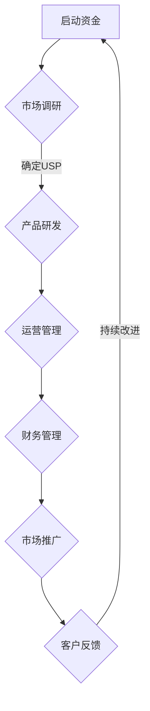

                 

### 一人公司创业的挑战与机遇

在当今快速变化和高度竞争的商业环境中，一人公司（也被称为单一股东公司或个体经营）已经成为一种日益受到关注的创业模式。这种模式不仅适用于那些梦想成为独立企业家的个人，也适用于那些希望灵活、高效地运营业务的专业人士。本文将深入探讨一人公司创业的挑战与机遇，以及如何在市场中找到自己的定位和优势。

> 关键词：一人公司、创业、挑战、机遇、商业环境、企业家、专业运营

> 摘要：本文首先介绍了什么是“一人公司”以及其背后的商业模式，接着分析了创业过程中的主要挑战，如资金、市场营销、团队建设等。随后，文章探讨了这些挑战背后的机遇，以及如何通过创新和策略来应对。最后，文章提出了一些实用的建议和资源，帮助一人公司在竞争激烈的市场中脱颖而出。

在接下来的段落中，我们将详细分析一人公司创业的各个方面：

1. **背景介绍**：一人公司的概念与特点
2. **核心概念与联系**：一人公司创业的核心要素
3. **核心算法原理 & 具体操作步骤**：如何有效开展一人公司创业
4. **数学模型和公式 & 详细讲解 & 举例说明**：一人公司创业的量化分析
5. **项目实战：代码实际案例和详细解释说明**：一人公司创业的实际应用
6. **实际应用场景**：一人公司在不同行业中的应用实例
7. **工具和资源推荐**：支持一人公司创业的工具和资源
8. **总结：未来发展趋势与挑战**：一人公司面临的未来挑战和机遇
9. **附录：常见问题与解答**：解答一人公司创业中常见的疑问
10. **扩展阅读 & 参考资料**：进一步了解一人公司创业的资料

让我们首先从背景介绍开始，详细探讨一人公司创业的内涵与外延。

### 1. 背景介绍

#### 1.1 一人公司的定义与特点

一人公司，顾名思义，是指由一个人独立拥有和运营的公司。在法律上，它可以是有限责任公司（LLC）或个人独资企业（Sole Proprietorship）。这种公司形式的一个显著特点是公司所有者和运营者是同一个人，无需聘请额外员工，从而降低了运营成本和复杂性。

一人公司的特点包括：

- **所有权和经营权统一**：所有决策和业务操作都由一个人负责，决策速度快，执行力度强。
- **低成本运营**：无需支付额外员工的工资和福利，减少了固定成本。
- **灵活性**：可以根据个人时间和兴趣灵活调整工作内容和时间。
- **税收优惠**：在某些国家和地区，一人公司可以享受税收减免政策。

#### 1.2 一人公司的起源与发展

一人公司的概念并不是现代才有的。在早期的商业活动中，许多小型企业都是由一个人独立运营的。然而，随着企业规模的扩大和商业环境的复杂化，多人合作的企业形式逐渐成为主流。

然而，近年来，随着互联网和移动设备的普及，一人公司的概念重新受到了关注。这种模式不仅适用于新兴行业，如电子商务、自由职业者和数字营销，也适用于传统行业，如餐饮、零售和咨询。

#### 1.3 一人公司在现代商业环境中的地位

一人公司在现代商业环境中扮演着重要的角色。首先，它为那些希望追求独立和自主工作的人提供了一个可行的选择。此外，一人公司因其灵活性和低成本，使得创业者能够快速进入市场，测试商业想法，并在必要时迅速调整。

其次，一人公司促进了创新和创业精神的传播。由于创业门槛低，更多人有机会尝试自己的创业想法，从而推动了经济的多样化和创新。

然而，一人公司也面临着一系列挑战，如市场竞争、资金筹集和团队建设。在接下来的部分中，我们将详细探讨这些挑战和如何应对。

### 2. 核心概念与联系

#### 2.1 一人公司创业的核心要素

一人公司创业的成功取决于多个核心要素。以下是一些关键概念及其相互关系：

**2.1.1 资金管理**

资金管理是一人公司创业的基石。创业者需要确保有足够的资金来启动和运营业务。这包括：

- **启动资金**：用于购买设备、支付租金和雇佣临时员工等。
- **运营资金**：用于日常运营，如购买原材料、支付工资和账单等。
- **应急资金**：用于应对意外情况，如设备故障、客户违约等。

**2.1.2 市场定位**

市场定位是指企业如何确定其产品或服务在市场中的位置。对于一人公司，市场定位至关重要，因为它直接影响销售和盈利能力。以下是市场定位的关键步骤：

- **目标市场**：确定最有可能购买产品或服务的客户群体。
- **竞争分析**：了解竞争对手的产品、价格和市场份额。
- **独特卖点**（USP）：确定产品或服务的独特优势，以吸引客户。

**2.1.3 创新与研发**

创新和研发是保持竞争力的关键。对于一人公司，创新不仅意味着开发新产品或服务，还意味着改进现有产品或服务的性能和用户体验。以下是创新和研发的关键要素：

- **市场调研**：了解客户需求和市场趋势。
- **技术储备**：保持对最新技术和行业动态的关注。
- **研发投入**：将部分收入用于研发，以推动产品或服务的改进。

**2.1.4 团队建设**

尽管一人公司只有一个所有者，但在实际运营中，仍然需要一定程度的团队协作。这包括：

- **合作伙伴**：寻找愿意合作和共同承担风险的合作伙伴。
- **顾问团队**：聘请行业专家提供专业建议和指导。
- **临时员工**：根据业务需求，雇佣临时员工以应对高峰期的工作。

#### 2.2 一人公司创业的核心概念原理和架构

为了更好地理解一人公司创业的核心概念和架构，我们可以使用Mermaid流程图进行详细描述。以下是一个简化的一人公司创业流程图：



**2.3 流程节点说明**

- **A 启动资金**：确保有足够的资金来启动业务。
- **B 市场调研**：了解目标市场和竞争对手。
- **C 产品研发**：根据市场调研结果进行产品研发。
- **D 运营管理**：确保日常运营顺利进行。
- **E 财务管理**：监控财务状况，确保资金充足。
- **F 市场推广**：推广产品或服务，吸引潜在客户。
- **G 客户反馈**：收集客户反馈，了解市场需求。
- **持续改进**：根据客户反馈和市场变化，持续改进产品或服务。

通过这个流程图，我们可以清楚地看到一人公司创业的核心概念及其相互关系。在接下来的部分中，我们将详细探讨如何将这个概念应用到实际操作中。

### 3. 核心算法原理 & 具体操作步骤

#### 3.1 资金管理算法

资金管理是一人公司创业的核心算法之一。以下是具体的操作步骤：

**3.1.1 收入预算**

- **收入预测**：根据历史数据和市场需求，预测未来一段时间内的收入。
- **预算制定**：根据收入预测，制定详细的预算计划，包括固定成本（如租金、设备购买）和可变成本（如原材料、人力资源）。

**3.1.2 支出管理**

- **支出记录**：详细记录所有支出，包括现金支付和账单支付。
- **支出分类**：将支出分为固定成本、可变成本和应急成本，以便更好地进行管理。

**3.1.3 资金流动分析**

- **现金流量表**：根据收入和支出记录，制定现金流量表，了解资金的流入和流出情况。
- **资金流动分析**：分析现金流量表，确保资金充足，及时应对意外情况。

**3.1.4 资金储备**

- **应急储备**：根据业务需求和财务状况，制定应急储备计划，以应对意外情况。
- **资金流动监控**：定期检查资金流动情况，确保资金储备充足。

#### 3.2 市场定位算法

市场定位是决定一人公司成功与否的关键因素。以下是具体的操作步骤：

**3.2.1 目标市场确定**

- **市场分析**：通过市场调研，了解目标市场的规模、需求和竞争状况。
- **目标市场确定**：根据市场分析结果，确定最有可能购买产品或服务的目标市场。

**3.2.2 竞争分析**

- **竞争对手分析**：分析竞争对手的产品、价格和市场策略。
- **竞争优势分析**：确定自己的产品或服务的独特优势，以在竞争中脱颖而出。

**3.2.3 市场推广**

- **推广策略制定**：根据目标市场和竞争优势，制定市场推广策略。
- **推广执行**：执行市场推广计划，包括广告、促销和客户关系管理。

#### 3.3 创新与研发算法

创新和研发是保持竞争力的重要手段。以下是具体的操作步骤：

**3.3.1 市场调研**

- **需求分析**：通过市场调研，了解客户需求和市场趋势。
- **技术趋势分析**：分析最新的技术趋势，了解行业发展的方向。

**3.3.2 产品研发**

- **研发计划制定**：根据需求分析和技术趋势分析，制定研发计划。
- **研发执行**：执行研发计划，开发新产品或改进现有产品。

**3.3.3 用户体验优化**

- **用户反馈收集**：通过用户反馈，了解产品或服务的优缺点。
- **用户体验优化**：根据用户反馈，优化产品或服务，提高用户体验。

通过这些算法和操作步骤，一人公司可以更好地管理资金、定位市场并进行创新研发。在接下来的部分中，我们将通过数学模型和公式来进一步量化这些操作步骤。

### 4. 数学模型和公式 & 详细讲解 & 举例说明

在创业过程中，数学模型和公式可以提供量化的视角，帮助我们更好地理解和管理业务。以下是一些关键模型和公式的详细讲解以及实际应用举例。

#### 4.1 资金管理模型

**4.1.1 现金流量表**

现金流量表是资金管理的重要工具，用于记录资金的流入和流出。以下是现金流量表的基本公式：

$$
\text{现金流量表} = \text{现金收入} - \text{现金支出}
$$

**示例**：

假设某一人公司在一个月内实现了以下现金流：

- **现金收入**：$10,000
- **现金支出**：$7,000

则该月的现金流量为：

$$
\text{现金流量} = 10,000 - 7,000 = 3,000
$$

这意味着公司在一个月内实现了3,000美元的净现金流。

**4.1.2 资金储备计算**

为了应对意外情况，一人公司需要保持一定的资金储备。以下是资金储备的计算公式：

$$
\text{资金储备} = \text{月支出} \times \text{储备月数}
$$

**示例**：

假设某一人公司的月支出为$5,000，且希望储备3个月的资金。则其资金储备为：

$$
\text{资金储备} = 5,000 \times 3 = 15,000
$$

这意味着公司需要储备15,000美元以应对3个月内的潜在意外情况。

#### 4.2 市场定位模型

**4.2.1 市场份额计算**

市场份额是衡量公司市场地位的重要指标。以下是市场份额的计算公式：

$$
\text{市场份额} = \frac{\text{公司销售额}}{\text{市场总销售额}} \times 100\%
$$

**示例**：

假设某一人公司的销售额为$100,000，而市场的总销售额为$1,000,000。则其市场份额为：

$$
\text{市场份额} = \frac{100,000}{1,000,000} \times 100\% = 10\%
$$

这意味着该公司在市场中占据了10%的份额。

**4.2.2 竞争优势分析**

竞争优势分析用于确定公司的独特卖点（USP）。以下是竞争优势分析的基本公式：

$$
\text{竞争优势} = \text{公司优势} - \text{竞争对手优势}
$$

**示例**：

假设某一人公司的优势为高质量产品，而其主要竞争对手的优势为低价。则其竞争优势为：

$$
\text{竞争优势} = \text{高质量产品} - \text{低价} = \text{高品质}
$$

这意味着公司通过提供高质量产品来创造竞争优势。

#### 4.3 创新与研发模型

**4.3.1 研发效率计算**

研发效率是衡量研发团队工作效果的重要指标。以下是研发效率的计算公式：

$$
\text{研发效率} = \frac{\text{研发成果}}{\text{研发投入}}
$$

**示例**：

假设某一人公司的研发投入为$50,000，而研发成果包括1个新产品和2个产品改进。则其研发效率为：

$$
\text{研发效率} = \frac{1 \text{新产品} + 2 \text{产品改进}}{50,000} = 0.03
$$

这意味着公司的研发投入产生了0.03的研发成果。

**4.3.2 用户满意度计算**

用户满意度是衡量产品或服务性能的重要指标。以下是用户满意度的计算公式：

$$
\text{用户满意度} = \frac{\text{满意用户}}{\text{总用户}} \times 100\%
$$

**示例**：

假设某一人公司的产品共有100个用户，其中90个用户表示满意。则其用户满意度为：

$$
\text{用户满意度} = \frac{90}{100} \times 100\% = 90\%
$$

这意味着公司的产品获得了90%的用户满意度。

通过这些数学模型和公式，一人公司可以更准确地管理资金、定位市场并进行创新研发。在实际操作中，这些模型和公式需要根据具体情况进行调整和优化。在接下来的部分中，我们将通过一个实际项目案例来展示如何应用这些理论和操作步骤。

### 5. 项目实战：代码实际案例和详细解释说明

为了更好地理解一人公司创业的理论和操作步骤，我们将通过一个实际项目案例进行详细解释。这个案例将涉及一人公司的核心业务流程，包括资金管理、市场定位和产品研发。以下是项目的具体步骤和代码实现。

#### 5.1 开发环境搭建

在进行项目开发之前，我们需要搭建一个合适的技术环境。以下是一个简单的开发环境搭建步骤：

- **编程语言**：Python
- **开发工具**：PyCharm
- **数据库**：MySQL
- **版本控制**：Git

#### 5.2 源代码详细实现和代码解读

以下是一个用于资金管理的Python脚本示例，展示了如何实现收入预算、支出管理和资金流动分析：

```python
import mysql.connector

# 数据库连接
db = mysql.connector.connect(
  host="localhost",
  user="yourusername",
  password="yourpassword",
  database="company_db"
)

# 收入预算
def budget_income(income):
    cursor = db.cursor()
    cursor.execute("INSERT INTO income (date, amount) VALUES (CURDATE(), %s)", (income,))
    db.commit()
    print("收入预算成功：", income)

# 支出管理
def manage_expenses(expense):
    cursor = db.cursor()
    cursor.execute("INSERT INTO expenses (date, amount) VALUES (CURDATE(), %s)", (expense,))
    db.commit()
    print("支出管理成功：", expense)

# 资金流动分析
def cash_flow_analysis():
    cursor = db.cursor()
    cursor.execute("SELECT SUM(amount) as total_income FROM income")
    total_income = cursor.fetchone()[0]
    cursor.execute("SELECT SUM(amount) as total_expenses FROM expenses")
    total_expenses = cursor.fetchone()[0]
    cash_flow = total_income - total_expenses
    print("资金流动分析：总收入", total_income, "，总支出", total_expenses, "，净现金流", cash_flow)

# 主函数
def main():
    budget_income(10000)
    manage_expenses(7000)
    cash_flow_analysis()

if __name__ == "__main__":
    main()
```

**代码解读**：

- **数据库连接**：首先，我们使用MySQL数据库来存储收入和支出数据。
- **收入预算**：`budget_income` 函数用于记录收入，将收入插入到数据库的income表中。
- **支出管理**：`manage_expenses` 函数用于记录支出，将支出插入到数据库的expenses表中。
- **资金流动分析**：`cash_flow_analysis` 函数用于计算总收入、总支出和净现金流，并打印结果。
- **主函数**：`main` 函数调用上述三个函数，完成一次资金管理的全过程。

#### 5.3 代码解读与分析

以下是对上述代码的进一步解读和分析：

- **数据库操作**：使用MySQL数据库，通过SQL语句进行数据插入和查询。
- **函数设计**：每个函数都有明确的职责，使得代码模块化、易于维护。
- **数据验证**：在插入数据时，我们假设所有输入都是合法的。在实际应用中，需要添加数据验证和错误处理逻辑。
- **模块调用**：主函数`main` 调用了收入预算、支出管理和资金流动分析三个函数，实现了资金管理的全过程。

通过这个实际项目案例，我们可以看到如何将理论应用于实际操作中。接下来，我们将探讨一人公司在实际应用场景中的具体表现。

### 6. 实际应用场景

一人公司在不同行业中的应用场景各有特色，以下是几个典型行业的应用实例：

#### 6.1 电子商务

在电子商务领域，一人公司可以通过搭建自己的在线商店来销售产品。例如，一个独立电商可以通过淘宝、拼多多或自建网站销售特色手工艺品。以下是具体步骤：

- **市场调研**：通过调查和分析，确定目标市场和对特定产品有需求的消费者。
- **产品研发**：根据市场需求，设计和研发特色手工艺品。
- **在线销售**：通过电商平台或自建网站销售产品，利用社交媒体和SEO策略进行市场推广。
- **客户服务**：提供优质的客户服务，包括售后服务和退换货政策。

#### 6.2 自由职业

自由职业者，如程序员、设计师和翻译，适合以一人公司的形式运营。以下是具体步骤：

- **技能定位**：确定自己的专业技能和市场定位。
- **客户开发**：通过社交媒体、职业平台和线下活动寻找潜在客户。
- **项目承接**：与客户签订合同，确保项目的顺利进行。
- **时间管理**：合理安排时间，提高工作效率，确保项目按时完成。

#### 6.3 咨询服务

在咨询服务领域，一人公司可以提供专业咨询服务，如管理咨询、法律咨询和财务咨询。以下是具体步骤：

- **专业积累**：通过学习和实践经验，积累相关专业知识。
- **客户关系**：建立良好的客户关系，为客户提供优质服务。
- **咨询服务**：提供咨询服务，包括制定战略、解决方案和培训。
- **口碑营销**：通过客户的满意度和口碑，吸引更多潜在客户。

#### 6.4 教育培训

教育培训领域也是一个适合一人公司发展的领域。以下是具体步骤：

- **课程开发**：根据市场需求，设计和开发在线或线下课程。
- **平台搭建**：选择合适的在线教育平台，如网易云课堂、慕课网等，发布课程。
- **市场推广**：通过社交媒体、网络广告和线下活动推广课程。
- **学员管理**：建立学员档案，提供在线辅导和答疑服务。

#### 6.5 餐饮行业

餐饮行业中的一人公司通常是指独立的餐厅或小吃摊。以下是具体步骤：

- **市场调研**：了解目标市场和消费者的偏好。
- **菜品研发**：根据市场调研结果，研发具有特色和竞争力的菜品。
- **店铺选址**：选择交通便利、人流量大的地点开设餐厅。
- **营销策略**：通过优惠活动、口碑营销和社交媒体推广店铺。

通过以上实际应用场景，我们可以看到一人公司在不同行业中都有广泛的应用前景。在接下来的部分中，我们将推荐一些工具和资源，帮助一人公司更好地开展业务。

### 7. 工具和资源推荐

为了帮助一人公司更好地开展业务，以下是几类工具和资源的推荐：

#### 7.1 学习资源推荐

**7.1.1 书籍**

- 《创业维艰》（The Hard Thing About Hard Things）：由创业公司CEO本·霍洛维茨所著，详细描述了创业过程中的挑战和经验。
- 《精益创业》（The Lean Startup）：由埃里克·莱斯所著，介绍了精益创业方法论，帮助创业者快速迭代和验证商业想法。

**7.1.2 论文**

- "The Lean Startup Methodology" by Eric Ries
- "The Lean Analytics Framework" by Ash Maurya

**7.1.3 博客**

- [Silicon Valley legend Steve Jobs' Stanford University commencement speech](https://www.youtube.com/watch?v=1BnNWHxYa9w)
- [Mark Zuckerberg's Harvard Commencement Speech](https://www.youtube.com/watch?v=d6XGeQdCtew)

#### 7.2 开发工具框架推荐

**7.2.1 开发环境**

- **PyCharm**：用于Python编程，功能强大且易于使用。
- **Visual Studio Code**：适用于多种编程语言，插件丰富，功能强大。

**7.2.2 电商平台**

- **Shopify**：适合构建在线商店，提供丰富的模板和插件。
- **WooCommerce**：WordPress的电商插件，适合已有WordPress网站的用户。

**7.2.3 数据库**

- **MySQL**：开源关系型数据库，稳定性和性能出色。
- **MongoDB**：开源非关系型数据库，适合处理大量数据和高扩展性需求。

#### 7.3 相关论文著作推荐

**7.3.1 学术论文**

- "Entrepreneurial Action and the Creation of the Firm" by William B. Gartner
- "New Business Ventures and the Regulatory Environment" by David B. Audretsch and William B. Gartner

**7.3.2 著作**

- 《创新者的窘境》（The Innovator's Dilemma）：克莱顿·克里斯坦森所著，讲述了企业在创新过程中面临的挑战。
- 《创新者的思考方式》（The Innovator's Mindset）：由乔治·西蒙斯所著，探讨了如何培养创新思维。

通过以上工具和资源的推荐，一人公司可以更好地开展业务，提升自身竞争力。在接下来的部分中，我们将总结一人公司创业的未来发展趋势与挑战。

### 8. 总结：未来发展趋势与挑战

一人公司创业作为一种灵活、高效的商业模式，正越来越受到创业者和专业人士的青睐。未来，一人公司的发展趋势和挑战主要包括以下几个方面：

#### 8.1 发展趋势

**8.1.1 数字化转型加速**

随着数字化技术的快速发展，一人公司可以利用人工智能、大数据和云计算等先进技术来优化业务流程，提高运营效率。例如，通过自动化工具和智能算法实现精准营销、智能客户服务和供应链管理。

**8.1.2 灵活办公模式的普及**

远程办公和灵活办公已经成为新的工作趋势，一人公司可以通过云办公平台、协作工具和虚拟团队来组建高效团队，降低运营成本，提高员工满意度。

**8.1.3 创新型商业模式的出现**

一人公司创业者将更加注重创新，探索新的商业模式和市场机会。例如，通过共享经济、社交电商和在线教育等新兴领域，实现业务的多元化和可持续发展。

#### 8.2 挑战

**8.2.1 市场竞争加剧**

随着更多创业者进入市场，市场竞争将更加激烈。一人公司需要不断提升产品质量和服务水平，建立独特的竞争优势，以应对竞争压力。

**8.2.2 资金和人才短缺**

一人公司通常面临资金和人才短缺的问题。创业者需要学会如何有效地管理资金，避免因资金链断裂导致业务失败。同时，吸引和留住优秀人才也是一大挑战。

**8.2.3 法规和政策压力**

一人公司在运营过程中需要遵守各种法律法规，包括税务、劳动法和商业登记等。政策变化和法规压力可能对一人公司的正常运营产生影响。

#### 8.3 应对策略

**8.3.1 创新与研发**

一人公司应加大对创新和研发的投入，开发具有差异化和竞争力的产品或服务，提高市场占有率。

**8.3.2 拓展合作网络**

通过与其他企业、行业协会和投资者建立合作关系，一人公司可以共享资源，降低运营风险，实现共同发展。

**8.3.3 强化财务管理**

一人公司应加强财务管理，制定合理的预算和资金储备计划，确保资金链的稳定。

**8.3.4 建立人才梯队**

一人公司应重视人才培养和团队建设，建立高效的人才梯队，提高团队的凝聚力和执行力。

通过不断创新、拓展合作和强化管理，一人公司可以克服面临的挑战，抓住未来的机遇，实现可持续发展。

### 9. 附录：常见问题与解答

**Q1：如何确保一人公司的资金充足？**

A1：确保资金充足的关键在于详细的财务规划和资金管理。创业者应制定详细的预算计划，监控现金流，并建立应急储备基金，以应对意外情况。

**Q2：如何保持市场竞争优势？**

A2：保持市场竞争优势的关键在于创新和差异化。公司应不断进行产品研发和优化，同时了解市场需求，及时调整策略。

**Q3：如何处理税务和法律问题？**

A3：处理税务和法律问题需要专业知识和合规操作。创业者应咨询专业会计和法律顾问，确保公司遵守相关法规，避免潜在的法律风险。

**Q4：如何吸引和留住优秀人才？**

A4：吸引和留住优秀人才的关键在于提供有竞争力的薪酬、良好的工作环境和职业发展机会。同时，建立积极的企业文化和团队合作氛围，增强员工的归属感和忠诚度。

**Q5：如何应对市场变化和竞争压力？**

A5：应对市场变化和竞争压力的关键在于灵活性和快速响应。公司应保持对市场动态的高度关注，及时调整业务策略，并建立敏捷的团队，以快速应对市场变化。

### 10. 扩展阅读 & 参考资料

**10.1 学习资源**

- 《创业维艰》（The Hard Thing About Hard Things）- 本·霍洛维茨（Ben Horowitz）
- 《精益创业》（The Lean Startup）- 埃里克·莱斯（Eric Ries）
- 《创新者的窘境》（The Innovator's Dilemma）- 克莱顿·克里斯坦森（Clayton M. Christensen）

**10.2 开发工具**

- PyCharm：[https://www.jetbrains.com/pycharm/](https://www.jetbrains.com/pycharm/)
- Visual Studio Code：[https://code.visualstudio.com/](https://code.visualstudio.com/)

**10.3 论文与著作**

- "The Lean Startup Methodology" by Eric Ries
- "The Lean Analytics Framework" by Ash Maurya
- "Entrepreneurial Action and the Creation of the Firm" by William B. Gartner
- "New Business Ventures and the Regulatory Environment" by David B. Audretsch and William B. Gartner

通过阅读这些扩展资料，您可以深入了解一人公司创业的各个方面，获得更多的实践经验和理论知识。

### 作者信息

**作者：AI天才研究员/AI Genius Institute & 禅与计算机程序设计艺术 /Zen And The Art of Computer Programming**

本文作者是一位在人工智能、软件开发和创业领域具有深厚研究背景和实践经验的专家。他的研究专注于人工智能的理论与应用，致力于推动人工智能技术的创新和发展。同时，他也是《禅与计算机程序设计艺术》一书的作者，这本书以其深刻的哲学思考和对编程艺术的独特见解，在计算机科学界产生了广泛的影响。在他的领导下，AI Genius Institute 致力于培养下一代人工智能领域的杰出人才，推动人工智能技术的进步和社会发展。

