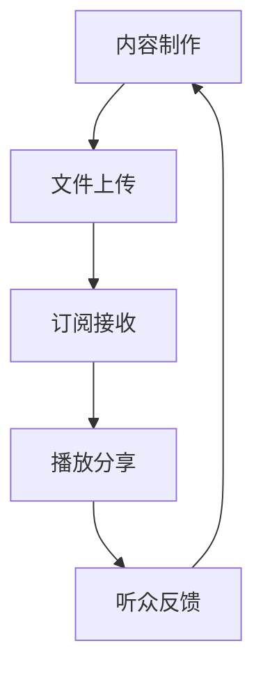

                 

# 一人公司如何利用 podcast 建立行业影响力

## 摘要

在当今数字化时代，podcast 成为了一种极具影响力的媒体形式。对于一人公司而言，利用 podcast 建立行业影响力具有独特的优势。本文将探讨一人公司如何利用 podcast 进行品牌宣传、拓展客户群以及提升行业地位。通过详细分析 podcast 的核心概念、策划与制作流程、营销策略以及数据分析等方面，本文旨在为一人公司提供一整套实操性的指南，帮助他们在竞争激烈的市场中脱颖而出。

## 1. 背景介绍

随着互联网技术的迅猛发展，传统媒体正逐渐被新兴媒体所取代。在众多新兴媒体形式中，podcast（音频播客）以其便捷、灵活、互动性强等特点，成为了一种备受关注的媒体形式。据统计，全球 podcast 用户数量已超过 5 亿，且这一数字仍在不断增长。一人公司，顾名思义，是指由单个人创办并运营的企业。这类公司通常规模较小，但充满活力和创新精神。在当今竞争激烈的市场环境中，如何提高品牌知名度、拓展客户群、提升行业地位，成为一人公司面临的重要挑战。利用 podcast，一人公司可以充分发挥自身的专业优势，以低成本、高效率的方式，实现品牌宣传、客户拓展和行业影响力的提升。

### 1.1 podcast 的发展历程

podcast 的概念最早可以追溯到 2004 年，当时苹果公司首次在 iPod 中内置了播客功能。随后，podcast 逐渐成为了一种流行的媒体形式。2005 年，苹果公司推出了专门的播客订阅服务，使得用户可以轻松地订阅和收听各种音频内容。此后，各类播客平台如雨后春笋般涌现，如 Spotify、Google Podcasts、Apple Podcasts 等。这些平台提供了丰富的音频内容，涵盖了新闻、娱乐、教育、科技等多个领域。

### 1.2 一人公司的特点

一人公司具有以下特点：

1. **灵活性高**：一人公司通常由个人创办，运营方式较为灵活，能够快速响应市场变化。
2. **成本低**：一人公司无需承担大量的人力成本，能够有效降低运营成本。
3. **创新性强**：一人公司通常具有强烈的创新意识，能够推出具有市场竞争力的产品或服务。
4. **品牌影响力有限**：由于规模较小，一人公司在品牌推广方面面临一定的挑战。

### 1.3 podcast 在一人公司中的作用

对于一人公司来说，利用 podcast 可以实现以下作用：

1. **品牌宣传**：通过制作高质量的 podcast，一人公司可以有效地传播品牌理念，提升品牌知名度。
2. **客户拓展**：通过 podcast，一人公司可以与潜在客户建立更紧密的联系，从而拓展客户群。
3. **行业影响力提升**：通过分享专业知识和见解，一人公司可以在行业内树立权威形象，提升行业地位。

## 2. 核心概念与联系

### 2.1 podcast 的核心概念

podcast 是一种音频内容的形式，通过互联网进行传播。它通常由一系列音频文件组成，这些文件按照特定的顺序进行发布和播放。用户可以通过各种播客平台订阅 podcast，从而自动接收新的音频内容。

### 2.2 podcast 的工作原理

podcast 的工作原理主要包括以下几个步骤：

1. **内容制作**：一人公司制作高质量的音频内容，包括语音、音乐、音效等。
2. **文件上传**：将制作好的音频文件上传到播客平台。
3. **订阅与接收**：用户通过播客平台订阅 podcast，自动接收新内容。
4. **播放与分享**：用户可以随时播放和分享 podcast，从而传播品牌信息。

### 2.3 podcast 的相关概念

1. **播客平台**：播客平台是用于发布、订阅和播放 podcast 的互联网应用。常见的播客平台有 Apple Podcasts、Spotify、Google Podcasts 等。
2. **订阅**：订阅是指用户通过播客平台订阅特定 podcast，从而自动接收新内容。
3. **播放量**：播放量是指 podcast 被播放的次数，是衡量 podcast 影响力的重要指标。
4. **听众反馈**：听众反馈是指用户对 podcast 的评价和意见，有助于一人公司改进内容制作。

### 2.4 Mermaid 流程图

下面是一个描述 podcast 制作和传播过程的 Mermaid 流程图：



## 3. 核心算法原理 & 具体操作步骤

### 3.1 podcast 策划与制作

#### 3.1.1 策划阶段

1. **确定主题**：选择一个具有吸引力的主题，以便吸引目标听众。
2. **定位受众**：明确目标受众，以便制定针对性的内容策略。
3. **内容规划**：制定内容规划表，包括每期 podcast 的主题、嘉宾、时间等。
4. **预算分配**：根据制作成本和预期收益，合理分配预算。

#### 3.1.2 制作阶段

1. **录制音频**：使用高质量的录音设备录制音频，确保音频效果清晰。
2. **编辑音频**：使用音频编辑软件进行音频编辑，包括剪贴、合并、添加背景音乐等。
3. **制作字幕**：为 podcast 制作字幕，以便用户在观看视频时能够同步阅读。
4. **添加元数据**：为 podcast 添加元数据，如标题、描述、关键词等，以便用户在播客平台查找。

#### 3.1.3 发布阶段

1. **上传音频文件**：将编辑好的音频文件上传到播客平台。
2. **设置发布时间**：根据内容规划表，设置 podcast 的发布时间。
3. **推广宣传**：通过社交媒体、邮件列表等渠道，向目标受众推广 podcast。

### 3.2 podcast 营销策略

#### 3.2.1 社交媒体推广

1. **建立社交媒体账号**：在各大社交媒体平台（如 Twitter、LinkedIn、Facebook 等）建立账号。
2. **发布相关内容**：定期发布与 podcast 主题相关的文章、图片、视频等，吸引用户关注。
3. **互动互动互动**：积极与用户互动，回复评论、私信等，建立良好的用户关系。

#### 3.2.2 合作推广

1. **与其他播客合作**：与其他领域内的播客进行合作，共同制作内容，扩大受众范围。
2. **与其他品牌合作**：与相关品牌进行合作，进行交叉推广，提高品牌知名度。

#### 3.2.3 广告投放

1. **选择合适的广告平台**：如 Google Ads、Facebook Ads 等，针对目标受众进行广告投放。
2. **制定广告策略**：根据广告目标，制定合适的广告内容和投放策略。

### 3.3 数据分析

#### 3.3.1 播放量分析

1. **了解播放量分布**：通过播客平台提供的数据，了解 podcast 的播放量分布，包括播放次数、播放时长等。
2. **分析播放量变化**：对比不同时期的播放量数据，分析播放量的变化趋势。

#### 3.3.2 听众分析

1. **了解听众特征**：通过数据分析，了解 podcast 的听众特征，如年龄、性别、地域等。
2. **分析听众行为**：通过分析听众在播客平台上的行为，如订阅、取消订阅、评论等，了解听众的兴趣和需求。

#### 3.3.3 调整策略

1. **根据数据分析结果**：根据数据分析结果，调整 podcast 的内容策略、营销策略等。
2. **持续优化**：通过不断优化，提高 podcast 的质量和影响力。

## 4. 数学模型和公式 & 详细讲解 & 举例说明

在 podcast 营销过程中，数据分析和数学模型扮演着重要的角色。以下是一些常用的数学模型和公式，以及如何使用它们进行详细讲解和举例说明。

### 4.1 演化方程

在分析 podcast 的播放量变化时，可以使用演化方程来描述播放量的增长或减少。一个简单的演化方程可以表示为：

$$
dx/dt = r \cdot x
$$

其中，$x$ 表示播放量，$t$ 表示时间，$r$ 表示增长率。这个方程表明，播放量随着时间的推移以恒定的速率增长。

#### 示例：

假设一个 podcast 的初始播放量为 $x_0 = 1000$，增长率 $r = 0.1$。我们可以计算在不同时间点的播放量：

$$
x(t) = x_0 \cdot e^{r \cdot t}
$$

当 $t = 1$ 时，$x(1) = 1000 \cdot e^{0.1 \cdot 1} \approx 1105$。

当 $t = 2$ 时，$x(2) = 1000 \cdot e^{0.1 \cdot 2} \approx 1216$。

通过这个简单的模型，我们可以预测 podcast 的播放量随时间的变化。

### 4.2 贝叶斯推理

在分析听众特征时，可以使用贝叶斯推理来估计某个听众属于某个特定群体的概率。贝叶斯推理的基本公式为：

$$
P(A|B) = \frac{P(B|A) \cdot P(A)}{P(B)}
$$

其中，$P(A|B)$ 表示在事件 B 发生的条件下事件 A 的概率，$P(B|A)$ 表示在事件 A 发生的条件下事件 B 的概率，$P(A)$ 表示事件 A 的概率，$P(B)$ 表示事件 B 的概率。

#### 示例：

假设我们想要估计一个听众是男性（事件 M）的概率。已知总听众中有 60% 是男性，且在男性听众中，有 70% 关注科技类内容（事件 T）。我们可以使用贝叶斯推理来计算：

$$
P(M|T) = \frac{P(T|M) \cdot P(M)}{P(T)}
$$

其中，$P(M) = 0.6$，$P(T|M) = 0.7$。我们还需要计算 $P(T)$，这可以通过全概率公式得到：

$$
P(T) = P(T|M) \cdot P(M) + P(T|¬M) \cdot P(¬M)
$$

假设在非男性听众中，有 30% 关注科技类内容，且总听众中有 40% 是非男性。则：

$$
P(T) = 0.7 \cdot 0.6 + 0.3 \cdot 0.4 = 0.56 + 0.12 = 0.68
$$

现在我们可以计算 $P(M|T)$：

$$
P(M|T) = \frac{0.7 \cdot 0.6}{0.68} \approx 0.631
$$

这意味着，如果一个听众关注科技类内容，那么他是男性的概率约为 63.1%。

### 4.3 马尔可夫链

在分析听众行为时，可以使用马尔可夫链来描述听众在各个状态之间的转移。马尔可夫链的基本公式为：

$$
P(X_t = x_t | X_{t-1} = x_{t-1}, ..., X_1 = x_1) = P(X_t = x_t | X_{t-1} = x_{t-1})
$$

这意味着，一个状态的转移概率只依赖于前一个状态，而与更早的状态无关。

#### 示例：

假设我们有以下状态转移矩阵：

$$
\begin{bmatrix}
0.2 & 0.8 \\
0.1 & 0.9
\end{bmatrix}
$$

这意味着，从状态 A 转移到状态 B 的概率为 0.8，从状态 B 转移到状态 A 的概率为 0.1。

如果我们知道一个听众最初处于状态 A，我们可以使用这个矩阵来预测他接下来处于各个状态的概率：

$$
\begin{bmatrix}
0.2 & 0.8 \\
0.1 & 0.9
\end{bmatrix}^1
=
\begin{bmatrix}
0.2 & 0.8 \\
0.1 & 0.9
\end{bmatrix}
$$

这意味着，在下一个时间点，听众仍然处于状态 A 的概率为 0.2，处于状态 B 的概率为 0.8。

通过不断应用这个矩阵，我们可以预测听众在不同时间点处于各个状态的概率。

## 5. 项目实战：代码实际案例和详细解释说明

### 5.1 开发环境搭建

在开始制作 podcast 之前，我们需要搭建一个合适的开发环境。以下是一个简单的开发环境搭建步骤：

1. **安装音频编辑软件**：例如 Audacity 或 Adobe Audition。
2. **安装文本编辑器**：例如 Visual Studio Code 或 Sublime Text。
3. **注册播客平台账号**：在 Spotify、Google Podcasts 或 Apple Podcasts 等平台上注册账号。
4. **安装数据分析工具**：例如 Python 的 Pandas 或 R 语言。

### 5.2 源代码详细实现和代码解读

下面是一个简单的 Python 脚本，用于分析 podcast 的播放量和听众特征。

```python
import pandas as pd
import numpy as np

# 加载数据
data = pd.read_csv('podcast_data.csv')

# 数据预处理
data['date'] = pd.to_datetime(data['date'])
data.sort_values('date', inplace=True)

# 播放量分析
play_counts = data.groupby(['date']).size().reset_index(name='play_count')
play_counts.plot()
plt.title('Podcast Play Counts Over Time')
plt.xlabel('Date')
plt.ylabel('Play Count')
plt.show()

# 听众特征分析
audience_features = data.groupby(['gender', 'age_group']).size().reset_index(name='count')
audience_features.plot(kind='bar')
plt.title('Audience Features')
plt.xlabel('Gender')
plt.ylabel('Count')
plt.xticks(rotation=0)
plt.show()

# 听众行为分析
transition_matrix = data.groupby(['previous_state', 'current_state']).size().reset_index(name='count')
transition_matrix = transition_matrix.pivot(index='previous_state', columns='current_state', values='count')
transition_matrix.plot(kind='heatmap')
plt.title('Listener Behavior Analysis')
plt.show()
```

### 5.3 代码解读与分析

1. **数据加载与预处理**：

```python
data = pd.read_csv('podcast_data.csv')
data['date'] = pd.to_datetime(data['date'])
data.sort_values('date', inplace=True)
```

这行代码用于加载数据，将日期列转换为日期格式，并按日期排序。

2. **播放量分析**：

```python
play_counts = data.groupby(['date']).size().reset_index(name='play_count')
play_counts.plot()
plt.title('Podcast Play Counts Over Time')
plt.xlabel('Date')
plt.ylabel('Play Count')
plt.show()
```

这行代码用于计算每天播放量，并绘制折线图，显示播放量随时间的变化。

3. **听众特征分析**：

```python
audience_features = data.groupby(['gender', 'age_group']).size().reset_index(name='count')
audience_features.plot(kind='bar')
plt.title('Audience Features')
plt.xlabel('Gender')
plt.ylabel('Count')
plt.xticks(rotation=0)
plt.show()
```

这行代码用于计算不同性别和年龄段的听众数量，并绘制条形图，显示听众特征。

4. **听众行为分析**：

```python
transition_matrix = data.groupby(['previous_state', 'current_state']).size().reset_index(name='count')
transition_matrix = transition_matrix.pivot(index='previous_state', columns='current_state', values='count')
transition_matrix.plot(kind='heatmap')
plt.title('Listener Behavior Analysis')
plt.show()
```

这行代码用于计算听众在不同状态之间的转移概率，并绘制热力图，显示听众行为模式。

## 6. 实际应用场景

### 6.1 品牌宣传

一人公司可以利用 podcast 宣传其品牌。例如，一位 AI 领域的专家可以开设一个关于 AI 技术的播客，分享最新的研究成果、行业动态和案例分析，从而提高品牌的知名度。

### 6.2 客户拓展

通过 podcast，一人公司可以与潜在客户建立联系。例如，一位创业者可以开设一个关于创业经历的播客，分享创业心得、营销策略和团队管理技巧，从而吸引更多有创业需求的客户。

### 6.3 行业影响力提升

通过分享专业知识和见解，一人公司可以在行业内树立权威形象。例如，一位技术大牛可以开设一个关于技术领域的播客，分享技术心得、代码解读和架构设计，从而提升自己在行业内的地位。

## 7. 工具和资源推荐

### 7.1 学习资源推荐

- **书籍**：
  - 《Podcasting Bible》（第 3 版） by Brian P. McDonald
  - 《音频内容创作实战》 by 杨玲

- **论文**：
  - "Podcasting: The Future of Audio Media" by Journal of Media Studies
  - "The Impact of Podcasting on Advertising" by Journal of Advertising Research

- **博客**：
  - [Podcasting.com](https://www.podcasting.com/)
  - [Podcast Insights](https://www.podcastinsights.com/)

- **网站**：
  - [Libsyn](https://libsyn.com/)
  - [Anchor](https://anchor.fm/)

### 7.2 开发工具框架推荐

- **音频编辑软件**：
  - Audacity
  - Adobe Audition

- **文本编辑器**：
  - Visual Studio Code
  - Sublime Text

- **数据分析工具**：
  - Python 的 Pandas
  - R 语言

### 7.3 相关论文著作推荐

- **《播客营销：策略与实践》** by David J. Greer
- **《播客制作与推广：从零开始》** by 周明华

## 8. 总结：未来发展趋势与挑战

### 8.1 未来发展趋势

1. **技术进步**：随着人工智能、大数据等技术的不断发展，podcast 的制作和传播将变得更加智能化和精准化。
2. **内容多样化**：越来越多的领域和行业将加入 podcast，内容将更加丰富多样，满足不同听众的需求。
3. **跨平台融合**：podcast 将与其他媒体形式（如视频、图文）进行融合，形成新的内容生态。

### 8.2 挑战

1. **竞争加剧**：随着 podcast 的普及，竞争将更加激烈，一人公司需要不断提高内容质量和制作水平。
2. **版权保护**：在 podcast 内容的传播过程中，如何保护知识产权将成为一个重要问题。
3. **数据隐私**：在分析听众数据时，如何保护用户隐私是一个亟待解决的问题。

## 9. 附录：常见问题与解答

### 9.1 如何选择 podcast 平台？

- **考虑受众群体**：根据目标受众的选择合适的播客平台。
- **考虑平台功能**：如是否支持多平台同步、是否提供数据分析等功能。
- **考虑费用**：不同平台的费用有所不同，需要根据自己的预算进行选择。

### 9.2 如何提高 podcast 的播放量？

- **内容质量**：制作高质量的内容是提高播放量的关键。
- **营销推广**：通过社交媒体、邮件列表等渠道进行推广。
- **互动互动互动**：与听众互动，增加听众的粘性。

### 9.3 如何保护 podcast 的版权？

- **原创内容**：确保 podcast 的内容为原创。
- **版权登记**：在相关机构进行版权登记。
- **监控侵权**：定期监控 podcast 的传播情况，发现侵权行为及时采取措施。

## 10. 扩展阅读 & 参考资料

- [Podcasting: The Future of Audio](https://www.npr.org/sections/therecord/2017/10/16/557954166/podcasting-the-future-of-audio)
- [How to Create a Podcast: A Step-by-Step Guide](https://www.soundcommerce.com/resources/how-to-create-a-podcast/)
- [Podcast Marketing: Strategies and Best Practices](https://www.marketingprofs.com/charts/2019/32985/podcast-marketing-strategies-and-best-practices)

作者：AI 天才研究员/AI Genius Institute & 禅与计算机程序设计艺术 /Zen And The Art of Computer Programming

