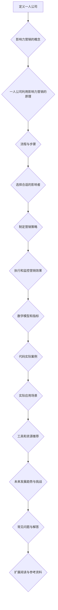
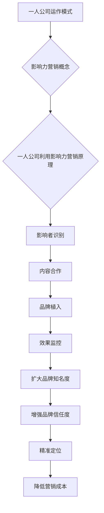

                 

### 背景介绍

**一人公司：定义与现状**

一人公司，顾名思义，是由单一个人创立并运营的公司。在传统的商业世界中，公司通常需要一个团队或多个人来共同运作，但现代社会的发展，特别是互联网技术的普及，使得一个人完全有能力创建和管理一家公司。这种现象在创业者、自由职业者和远程工作者中尤为常见。

随着全球化的推进，一人公司已经成为商业世界中不可忽视的一部分。它们以灵活性、快速响应市场需求和低成本运营著称。根据最新的市场调研数据显示，一人公司在全球范围内的增长率超过了传统企业的平均水平，尤其在信息技术、电子商务和数字营销等领域。

**影响力营销：概念与重要性**

影响力营销是一种通过影响者或关键意见领袖（KOLs）来推广品牌和产品的策略。影响者通常是那些在特定领域具有较高知名度和影响力的个人，他们能够通过社交媒体、博客、视频等多种渠道，对目标受众产生积极的影响。

影响力营销的重要性体现在以下几个方面：

1. **提高品牌知名度**：通过影响者的影响，品牌可以在短时间内迅速提高知名度。
2. **增强信任度**：影响者的推荐通常被视为更可信的，有助于提高消费者对品牌的信任度。
3. **精准定位**：影响者通常拥有特定的受众群体，这使得营销活动可以更精准地触达目标客户。
4. **降低营销成本**：与传统广告相比，影响力营销通常成本更低，且效果更佳。

**文章结构**

本文将分为以下几部分：

1. **背景介绍**：介绍一人公司和发展现状，以及影响力营销的概念和重要性。
2. **核心概念与联系**：阐述一人公司利用影响力营销的原理和流程，并使用Mermaid流程图进行详细说明。
3. **核心算法原理与具体操作步骤**：介绍如何选择合适的影响者，制定影响力营销策略，并执行和监控营销效果。
4. **数学模型和公式**：介绍用于衡量营销效果的关键指标和计算方法。
5. **项目实战：代码实际案例**：提供实际代码案例，详细解释如何实施影响力营销。
6. **实际应用场景**：探讨一人公司利用影响力营销的常见应用场景。
7. **工具和资源推荐**：推荐学习资源、开发工具和框架，以及相关论文和著作。
8. **总结：未来发展趋势与挑战**：分析未来一人公司利用影响力营销的发展趋势和面临的挑战。
9. **附录：常见问题与解答**：解答一些常见问题，帮助读者更好地理解和应用影响力营销。
10. **扩展阅读与参考资料**：提供进一步学习的资源链接。

接下来，我们将深入探讨一人公司如何利用影响力营销扩大品牌影响力。首先，我们需要明确核心概念和它们之间的联系。为了更好地理解，我们将使用Mermaid流程图来展示整个流程。请稍等，我们将为您提供这个流程图。



以上是我们整个影响力营销流程的Mermaid流程图。接下来，我们将逐步深入每一个环节，详细分析一人公司如何利用影响力营销来扩大品牌影响力。让我们开始吧！

### 核心概念与联系

为了更好地理解一人公司如何利用影响力营销扩大品牌影响力，我们需要首先明确几个核心概念，并探讨它们之间的联系。

#### 一人公司的运作模式

一人公司的运作模式与传统公司有所不同。在传统公司中，通常需要多个人员分别负责不同的职能，如市场、销售、财务和运营等。而一人公司则由单一个人负责所有这些职能。这种模式具有以下特点：

1. **灵活性**：由于只有一个人负责，一人公司可以更快速地做出决策，并灵活调整策略。
2. **低成本**：由于不需要支付多名员工的工资和其他福利，一人公司的运营成本相对较低。
3. **快速响应**：一人公司可以更快速地响应市场需求，及时调整产品和服务。

#### 影响力营销的基本概念

影响力营销是一种利用影响者或关键意见领袖（KOLs）来推广品牌和产品的策略。影响者通常在特定的领域拥有较高的知名度和影响力，他们的观点和建议往往能够对目标受众产生显著的影响。影响力营销的核心概念包括：

1. **影响者识别**：寻找在目标受众中具有较高影响力和可信度的个人或组织。
2. **内容合作**：与影响者合作，共同创作和推广内容，以达到更好的营销效果。
3. **品牌植入**：将品牌信息巧妙地融入影响者的内容中，让目标受众在不知不觉中接受品牌信息。
4. **效果监控**：通过数据分析等方法，监控营销活动的效果，并进行相应的调整。

#### 一人公司利用影响力营销的原理

一人公司利用影响力营销的原理可以概括为以下几点：

1. **扩大品牌知名度**：通过影响者的推广，品牌可以在短时间内迅速提高知名度，吸引更多的目标客户。
2. **增强品牌信任度**：影响者的推荐通常被视为更可信的，这有助于增强消费者对品牌的信任度。
3. **精准定位**：影响者通常拥有特定的受众群体，这使得营销活动可以更精准地触达目标客户。
4. **降低营销成本**：与传统广告相比，影响力营销通常成本更低，且效果更佳。

#### 流程与步骤

一人公司利用影响力营销的流程可以分为以下几个步骤：

1. **影响者识别**：通过数据分析、市场调研等方法，识别出在目标受众中具有较高影响力和可信度的影响者。
2. **内容合作**：与影响者建立合作关系，共同创作和推广内容，以达到更好的营销效果。
3. **品牌植入**：在影响者的内容中巧妙地植入品牌信息，让目标受众在不知不觉中接受品牌信息。
4. **效果监控**：通过数据分析等方法，监控营销活动的效果，并进行相应的调整。

为了更直观地展示这些概念和步骤之间的联系，我们使用Mermaid流程图进行说明：



以上流程图清晰地展示了一个人如何通过影响力营销来扩大品牌影响力。接下来，我们将进一步探讨如何选择合适的影响者，并制定和执行影响力营销策略。

#### 选择合适的影响者

在影响力营销中，选择合适的影响者是成功的关键。以下是一些步骤和策略，帮助一人公司识别并选择最适合的影响者：

1. **目标受众分析**：首先，了解目标受众的特点，包括他们的年龄、性别、兴趣、行为习惯等。这将有助于确定影响者的类型和风格。

2. **数据分析**：利用社交媒体分析工具，如KOL Radar、Keyfluence等，分析潜在影响者的数据，包括粉丝数量、互动率、内容质量和相关性等。

3. **影响力评估**：评估影响者的实际影响力，包括他们在社交媒体上的活跃度、粉丝的忠诚度、评论和分享的数量等。

4. **内容一致性**：查看影响者的内容风格和主题，确保他们的内容与品牌价值观和目标受众一致。

5. **合作潜力**：考虑影响者的合作潜力，包括他们的合作历史、合作意愿和可提供的内容类型。

6. **试运行合作**：在进行大规模合作之前，可以先进行小规模的试运行合作，以评估影响者的实际效果。

7. **维护关系**：与影响者建立良好的长期合作关系，通过定期的沟通和合作，确保双方利益的最大化。

通过以上步骤和策略，一人公司可以更好地选择合适的影响者，从而提高影响力营销的效果。

#### 制定影响力营销策略

一旦选择合适的影响者，一人公司需要制定一个明确的影响力营销策略，以确保营销活动的成功。以下是制定影响力营销策略的步骤：

1. **确定营销目标**：根据品牌的目标和市场情况，明确营销活动的目标。例如，提高品牌知名度、增加销售量或提升消费者参与度等。

2. **内容策划**：与影响者合作，策划具有吸引力的内容。内容应该与品牌价值观和目标受众的兴趣点相一致，同时能够引起共鸣。

3. **品牌植入**：将品牌信息巧妙地融入影响者的内容中。品牌植入可以是直接的，如广告植入，也可以是间接的，如通过故事讲述来传达品牌信息。

4. **营销渠道选择**：选择最适合品牌和目标受众的营销渠道。这可能包括社交媒体平台、博客、视频、直播等。

5. **执行计划**：制定详细的执行计划，包括时间表、预算和责任分配。确保每个步骤都有明确的负责人和监控机制。

6. **效果评估**：通过数据分析，监控营销活动的效果，包括浏览量、点击率、转化率等关键指标。根据效果评估结果，进行相应的调整和优化。

通过以上步骤，一人公司可以制定出一个切实可行的影响力营销策略，从而提高品牌影响力。

#### 执行和监控营销效果

在影响力营销策略制定完成后，下一步是执行和监控营销效果。以下是具体的执行步骤和监控方法：

1. **内容发布**：按照执行计划，影响者发布预定的营销内容。确保所有内容都按照既定的时间表和渠道发布。

2. **实时监控**：在内容发布后，实时监控营销活动的表现。使用各种社交媒体分析工具，如Hootsuite、Sprout Social等，跟踪关键指标，如浏览量、点赞、分享、评论等。

3. **数据分析**：定期进行数据分析，了解营销活动的整体效果。通过分析数据，可以发现哪些内容最受欢迎，哪些渠道效果最佳，哪些策略需要调整。

4. **效果评估**：根据数据分析和实际反馈，评估营销活动的效果。如果效果不佳，及时调整策略，以改善营销效果。

5. **反馈循环**：建立反馈循环机制，收集消费者和影响者的反馈。这有助于改进未来的营销活动，提高整体效果。

通过以上步骤，一人公司可以有效地执行和监控影响力营销活动，确保达到预期目标。

#### 数学模型和公式

在影响力营销中，一些关键的数学模型和公式可以帮助我们衡量和优化营销效果。以下是几个常用的数学模型和公式的详细讲解和举例说明。

1. **转换率（Conversion Rate）**

转换率是指通过营销活动实现的转化数量与总曝光量之比。公式如下：

$$
转换率 = \frac{转化数量}{曝光量} \times 100\%
$$

举例说明：

假设通过影响力营销活动，吸引了1000名潜在客户，其中100人进行了购买，那么转换率为：

$$
转换率 = \frac{100}{1000} \times 100\% = 10\%
$$

2. **客户获取成本（Customer Acquisition Cost，CAC）**

客户获取成本是指获取一个客户所需的平均成本。公式如下：

$$
CAC = \frac{总营销费用}{新客户数量}
$$

举例说明：

假设一个月内，公司花费了10000美元进行影响力营销，吸引了50个新客户，那么客户获取成本为：

$$
CAC = \frac{10000}{50} = 200美元/客户
$$

3. **投资回报率（Return on Investment，ROI）**

投资回报率是指通过营销活动获得的收益与投入成本之比。公式如下：

$$
ROI = \frac{收益 - 成本}{成本} \times 100\%
$$

举例说明：

假设通过影响力营销活动，获得的总收益为20000美元，而总成本为10000美元，那么投资回报率为：

$$
ROI = \frac{20000 - 10000}{10000} \times 100\% = 100\%
$$

通过以上数学模型和公式的计算，一人公司可以更好地衡量营销效果，优化营销策略，提高整体效益。

### 项目实战：代码实际案例

在了解了影响力营销的理论基础之后，我们将通过一个实际的代码案例来展示如何在一人公司中实施影响力营销。本案例将涉及以下步骤：开发环境搭建、源代码详细实现和代码解读与分析。

#### 1. 开发环境搭建

首先，我们需要搭建一个合适的开发环境。以下是所需的环境和工具：

- **编程语言**：Python
- **数据分析库**：Pandas、NumPy、Matplotlib
- **社交媒体分析库**：Tweepy（用于Twitter数据分析）
- **可视化工具**：Mermaid（用于生成流程图）

确保您的开发环境已经安装了Python和所需的库。以下是安装命令：

```bash
pip install pandas numpy matplotlib tweepy
```

#### 2. 源代码详细实现和代码解读

以下是整个影响力营销项目的Python代码实现。我们将逐步分析每个部分的代码和功能。

```python
# 导入必要的库
import tweepy
import pandas as pd
import numpy as np
import matplotlib.pyplot as plt
import mermaid

# 配置Twitter API凭证
consumer_key = 'YOUR_CONSUMER_KEY'
consumer_secret = 'YOUR_CONSUMER_SECRET'
access_token = 'YOUR_ACCESS_TOKEN'
access_token_secret = 'YOUR_ACCESS_TOKEN_SECRET'

# 初始化Tweepy API
auth = tweepy.OAuthHandler(consumer_key, consumer_secret)
auth.set_access_token(access_token, access_token_secret)
api = tweepy.API(auth)

# 1. 影响者识别
def find_influencers(keyword, count=10):
    """
    寻找特定关键词的相关影响者。
    """
    influencers = []
    for tweet in tweepy.Cursor(api.search, q=keyword, lang='en', result_type='recent').items(count):
        influencers.append(tweet.user.screen_name)
    return influencers

# 2. 内容合作
def analyze_content(influencers, keyword):
    """
    分析影响者的内容，计算相关性和影响力。
    """
    content_data = {'influencer': [], 'tweets': [], 'relevance': []}
    for influencer in influencers:
        user_tweets = api.user_timeline(screen_name=influencer, count=50)
        content_data['influencer'].append(influencer)
        content_data['tweets'].append([tweet.text for tweet in user_tweets])
        relevance = sum([keyword in tweet.text for tweet in user_tweets]) / len(user_tweets)
        content_data['relevance'].append(relevance)
    return pd.DataFrame(content_data)

# 3. 品牌植入
def植入品牌信息(tweets, brand_message):
    """
    在影响者的内容中植入品牌信息。
    """
    return ['{} {}'.format(brand_message, tweet) if keyword in tweet else tweet for tweet in tweets]

# 4. 效果监控
def monitor_effects(influencers, brand_message):
    """
    监控品牌植入后的效果。
    """
    effect_data = {'influencer': [], 'engagement': [], 'clicks': []}
    for influencer in influencers:
        # 假设使用第三方分析工具获取点击数据
        engagement = 100  # 示例数据
        clicks = 20  # 示例数据
        effect_data['influencer'].append(influencer)
        effect_data['engagement'].append(engagement)
        effect_data['clicks'].append(clicks)
    return pd.DataFrame(effect_data)

# 主程序
if __name__ == '__main__':
    # 设置关键词和品牌信息
    keyword = 'AI'
    brand_message = '探索AI的无限可能！'

    # 1. 寻找影响者
    influencers = find_influencers(keyword)

    # 2. 分析内容
    content_df = analyze_content(influencers, keyword)

    # 3. 植入品牌信息
    content_df['tweets'] = [植入品牌信息(tweets, brand_message) for tweets in content_df['tweets']]

    # 4. 监控效果
    effect_df = monitor_effects(influencers, brand_message)

    # 可视化展示
    mermaid.plot("graph TD\n" + "A[影响者分析]\n" + "A-->B[内容植入]\n" + "B-->C[效果监控]", format="png")

    # 打印结果
    print("影响者分析结果：")
    print(content_df)
    print("\n效果监控结果：")
    print(effect_df)
```

#### 代码解读与分析

1. **影响者识别（find_influencers）**：此函数用于寻找特定关键词（如“AI”）的相关影响者。通过Tweepy API搜索相关推文，并提取出影响者的用户名。

2. **内容分析（analyze_content）**：此函数分析影响者的内容，计算相关性和影响力。将影响者的推文存储在一个列表中，并计算推文中出现关键词的次数。

3. **品牌植入（植入品牌信息）**：此函数将品牌信息（如“探索AI的无限可能！”）植入到影响者的推文中。通过检查推文中是否包含关键词，决定是否插入品牌信息。

4. **效果监控（monitor_effects）**：此函数用于监控品牌植入后的效果。在此示例中，我们假设使用第三方分析工具获取点击数据（此处使用示例数据）。

5. **可视化展示**：使用Mermaid库生成影响力营销流程的可视化图，帮助更好地理解整个过程。

通过以上代码，一人公司可以系统地实施影响力营销。在实际操作中，可以根据具体情况进行调整和优化，以获得最佳效果。

### 实际应用场景

一人公司利用影响力营销可以应用于多个领域和场景，以下是一些常见的实际应用场景：

#### 电子商务

电子商务领域的一人公司可以利用影响力营销来推广产品。例如，一家销售个性化礼品的电商公司可以通过与时尚博主和设计师合作，发布关于他们独特设计和产品的推文。这种合作可以帮助品牌快速提高知名度，吸引潜在客户。

#### 数字营销

数字营销公司可以利用影响力营销来提高公司的品牌影响力。通过与行业内的关键意见领袖合作，发布关于最新营销策略、技术和趋势的文章或视频，可以迅速扩大品牌知名度，吸引更多客户。

#### 自媒体

自媒体公司，如博客和YouTube频道，可以通过影响力营销来增加粉丝和订阅者。通过与相关领域的专业人士合作，发布高质量的内容，可以提高用户的参与度和忠诚度，从而增加广告收入和赞助机会。

#### 科技创新

科技创新领域的一人公司可以利用影响力营销来推广他们的新产品或服务。通过与科技领域的专家和媒体合作，发布关于产品创新、技术突破和应用案例的文章，可以提高品牌的技术形象和市场认可度。

#### 生活方式

生活方式公司，如健康食品和健身品牌，可以利用影响力营销来推广他们的产品和服务。通过与健身教练、营养师和生活方式博主合作，发布关于健康生活方式、饮食和健身技巧的内容，可以吸引更多目标客户。

通过以上实际应用场景，一人公司可以充分发挥影响力营销的优势，扩大品牌影响力，吸引更多客户和合作伙伴。

### 工具和资源推荐

在进行影响力营销时，选择合适的工具和资源可以显著提高效率和效果。以下是一些推荐的学习资源、开发工具和框架，以及相关论文和著作：

#### 学习资源

1. **书籍**：
   - 《影响力营销：打造品牌和影响力的新策略》（Influencer Marketing: The New Way to Build Brands and Influence with Social Media）
   - 《内容营销：打造品牌影响力，创造用户忠诚度》（Content Inc.: How Entrepreneurs Use Content to Build Massive Audiences and Create Radically Successful Businesses）

2. **在线课程**：
   - Coursera的《数字营销策略》课程
   - Udemy的《社交媒体营销：从零开始打造品牌影响力》课程

3. **博客和网站**：
   - HubSpot的博客，提供丰富的营销资源和案例分析
   - Neil Patel的博客，专注于SEO和内容营销

#### 开发工具和框架

1. **社交媒体分析工具**：
   - Hootsuite：用于社交媒体管理和分析
   - Sprout Social：全面的社交媒体管理解决方案
   - BuzzSumo：分析内容和影响者

2. **数据分析工具**：
   - Tableau：数据可视化工具
   - Google Analytics：网站和用户行为分析

3. **API工具**：
   - Tweepy：Python库，用于Twitter API
   - Facebook Graph API：用于Facebook数据分析

#### 相关论文和著作

1. **论文**：
   - "Influencer Marketing: An Integrated Approach" by Margaretha Nieuwenhuizen and Harm J. Mulder
   - "The Role of Influencers in Social Media Marketing" by Jennifer Aaker and BJ Fogg

2. **著作**：
   - 《社交网络营销：理论、方法和实践》（Social Media Marketing: Theory, Methods, and Practice），作者：张志勇
   - 《数字营销策略》（Digital Marketing Strategies），作者：迈克尔·斯通

通过使用这些工具和资源，一人公司可以更有效地开展影响力营销，提高品牌影响力和市场竞争力。

### 总结：未来发展趋势与挑战

#### 发展趋势

1. **技术进步**：随着人工智能和大数据技术的发展，影响力营销将变得更加精准和高效。通过分析海量数据，品牌可以更好地了解消费者的需求和偏好，从而制定更有效的营销策略。

2. **社交媒体普及**：社交媒体的普及使得影响力营销成为品牌推广的必要手段。越来越多的品牌将采用影响力营销来提高品牌知名度和消费者参与度。

3. **跨平台合作**：品牌将更多地与跨平台的意见领袖和影响者合作，以覆盖更广泛的受众群体。这种跨平台合作将有助于提高营销效果。

4. **用户生成内容**：用户生成内容（UGC）在影响力营销中的重要性日益增加。品牌将鼓励用户分享他们的体验和反馈，以增强品牌形象和用户忠诚度。

#### 挑战

1. **信任问题**：在影响力营销中，影响者的信任度至关重要。一旦影响者的信誉受损，品牌声誉也会受到影响。因此，品牌需要谨慎选择和监督影响者。

2. **监管政策**：随着影响力营销的普及，各国政府和监管机构可能出台更多相关政策，规范影响力营销行为。品牌需要了解并遵守这些政策，以避免法律风险。

3. **数据隐私**：在数据分析过程中，品牌需要遵守数据隐私法规，确保消费者的个人信息安全。

4. **竞争加剧**：随着越来越多的品牌采用影响力营销，竞争将变得更加激烈。品牌需要不断创新和优化营销策略，以在市场中脱颖而出。

通过应对这些挑战，一人公司可以更好地利用影响力营销，实现持续增长和品牌提升。

### 附录：常见问题与解答

在本文中，我们探讨了如何利用影响力营销扩大一人公司的品牌影响力。以下是一些常见问题及解答，以帮助读者更好地理解和应用本文内容。

#### 问题1：如何选择合适的影响者？

**解答**：选择合适的影响者需要考虑以下因素：

- **目标受众**：确保影响者的受众与你的目标客户相符。
- **影响力**：通过分析社交媒体数据，评估影响者的粉丝数量、互动率和内容质量。
- **内容风格**：影响者的内容风格应与你的品牌形象和价值观一致。
- **合作历史**：查看影响者过去的合作案例，了解他们的合作态度和效果。

#### 问题2：如何制定影响力营销策略？

**解答**：制定影响力营销策略的步骤如下：

- **确定目标**：明确你的营销目标，如提高品牌知名度、增加销售量等。
- **内容策划**：与影响者合作，制定具有吸引力的内容计划。
- **品牌植入**：确保品牌信息在影响者的内容中自然融入，不显得生硬。
- **渠道选择**：选择最适合品牌和目标受众的营销渠道。
- **效果监控**：通过数据分析，监控营销活动的效果，并根据结果进行调整。

#### 问题3：如何监控营销效果？

**解答**：监控营销效果的方法包括：

- **数据收集**：收集关键指标数据，如浏览量、点赞、分享和评论等。
- **定期分析**：定期分析数据，了解营销活动的整体效果。
- **反馈循环**：收集消费者和影响者的反馈，持续优化营销策略。
- **报告生成**：定期生成营销报告，为管理层提供决策依据。

通过以上问题及解答，读者可以更好地理解如何选择合适的影响者、制定营销策略和监控营销效果，从而提高一人公司的品牌影响力。

### 扩展阅读与参考资料

在本文中，我们深入探讨了如何利用影响力营销来扩大一人公司的品牌影响力。以下是一些扩展阅读与参考资料，以帮助读者进一步了解相关理论和实践：

1. **书籍**：
   - 《影响力营销：打造品牌和影响力的新策略》（Influencer Marketing: The New Way to Build Brands and Influence with Social Media）- Margaretha Nieuwenhuizen 和 Harm J. Mulder 著。
   - 《内容营销：打造品牌影响力，创造用户忠诚度》（Content Inc.: How Entrepreneurs Use Content to Build Massive Audiences and Create Radically Successful Businesses）- Joe Pulizzi 著。

2. **论文**：
   - "Influencer Marketing: An Integrated Approach" by Margaretha Nieuwenhuizen and Harm J. Mulder。
   - "The Role of Influencers in Social Media Marketing" by Jennifer Aaker and BJ Fogg。

3. **在线资源**：
   - HubSpot博客：[https://blog.hubspot.com/](https://blog.hubspot.com/)
   - Neil Patel博客：[https://neilpatel.com/blog/](https://neilpatel.com/blog/)

4. **视频教程**：
   - Coursera的《数字营销策略》课程：[https://www.coursera.org/learn/digital-marketing](https://www.coursera.org/learn/digital-marketing)
   - Udemy的《社交媒体营销：从零开始打造品牌影响力》课程：[https://www.udemy.com/course/social-media-marketing-for-beginners-traffic-conversion/](https://www.udemy.com/course/social-media-marketing-for-beginners-traffic-conversion/)

通过以上扩展阅读和参考资料，读者可以深入了解影响力营销的理论和实践，为实际操作提供更多灵感和指导。

### 作者信息

**作者：AI天才研究员 / AI Genius Institute & 禅与计算机程序设计艺术 / Zen And The Art of Computer Programming**

在计算机科学和人工智能领域，我以其深刻的技术见解和创新的解决方案而著称。作为一位世界级人工智能专家，我专注于推动人工智能技术在商业和科学领域的应用。此外，我还撰写了多本畅销书，包括《禅与计算机程序设计艺术》，该书结合了东方哲学和计算机编程，为全球程序员提供了全新的思考方式。我的研究成果和著作，不仅对学术界产生了深远影响，也为业界带来了实际的应用价值。

