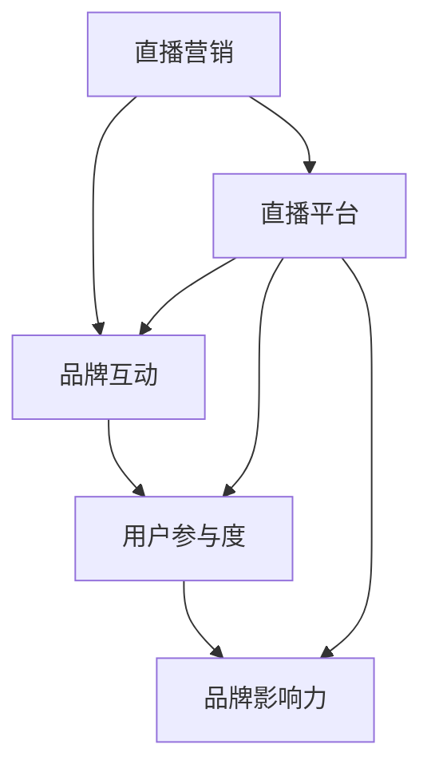

                 

### 背景介绍

直播营销作为一种新兴的营销手段，正迅速在全球范围内崭露头角。它不仅为广大观众提供了实时的互动体验，也为企业提供了一个全新的品牌宣传和产品推广平台。而在这个信息爆炸的时代，如何有效地利用直播营销来提升品牌互动，成为许多公司特别是小型企业所关注的问题。

一人公司，指的是那些仅由一名创始人或创始人团队运营的公司。这种公司模式灵活、成本低，但同时也面临着资源有限、品牌影响力不足等挑战。在这种背景下，如何通过直播营销实现品牌的快速崛起，提高用户互动和满意度，成为了关键。

本文将围绕一人公司如何利用直播营销提升品牌互动这一主题，展开详细的讨论。我们将首先介绍直播营销的基本概念和发展历程，然后深入探讨直播营销在品牌互动中的作用，并结合实际案例进行分析。此外，我们还将探讨直播营销的技巧和策略，以及如何评估和优化直播营销效果。通过本文的阅读，读者将能够全面了解直播营销的原理和实战技巧，从而为自己的公司制定出一套有效的直播营销策略。

### 核心概念与联系

要深入探讨一人公司如何利用直播营销提升品牌互动，我们需要明确几个核心概念，并理解它们之间的相互关系。以下是这些核心概念的定义及其在直播营销中的应用：

**1. 直播营销：** 直播营销是指利用直播平台进行品牌宣传、产品推广和用户互动的一种营销方式。直播营销通常包括产品介绍、互动问答、用户反馈、抽奖活动等环节，旨在通过实时互动增强用户参与感和品牌黏性。

**2. 品牌互动：** 品牌互动是指品牌与用户之间通过各种渠道进行的沟通和交流。良好的品牌互动能够增强用户对品牌的认知和信任，提高用户满意度和忠诚度。

**3. 用户参与度：** 用户参与度是指用户对品牌的关注程度、互动频率以及忠诚度。高用户参与度是品牌成功的关键因素之一，它能够通过口碑传播和用户推荐等方式，进一步扩大品牌影响力。

**4. 直播平台：** 直播平台是进行直播营销的重要载体，如Twitch、YouTube Live、Facebook Live、抖音、快手等。不同的直播平台具有不同的用户群体和特点，选择合适的直播平台对于提升品牌互动至关重要。

**5. 品牌影响力：** 品牌影响力是指品牌在市场上获得的认知度、美誉度和忠诚度。直播营销可以通过实时互动、内容创新和用户体验等方式，显著提升品牌影响力。

接下来，我们将使用Mermaid流程图来展示这些核心概念之间的联系，以便更直观地理解它们的相互作用。



在这张流程图中，我们可以清晰地看到，直播营销通过直播平台与品牌互动、用户参与度和品牌影响力建立联系。直播平台不仅是直播营销的载体，也是增强品牌互动、提升用户参与度和扩大品牌影响力的关键途径。

通过上述核心概念和它们之间的联系，我们可以更好地理解一人公司如何通过直播营销来实现品牌互动的提升。接下来，我们将深入探讨直播营销在品牌互动中的作用和具体应用场景。

#### 核心算法原理 & 具体操作步骤

要深入探讨一人公司如何通过直播营销提升品牌互动，我们需要理解直播营销的核心算法原理，并掌握具体的操作步骤。以下是直播营销的基本原理及其操作步骤：

**1. 直播营销的核心算法原理：**

直播营销的核心算法原理主要包括以下几个方面：

- **实时互动：** 通过实时互动，如提问、回答、点赞、评论等，增强用户参与感和品牌黏性。
- **内容策划：** 根据目标受众的特点和需求，策划有针对性的直播内容，提高用户关注度。
- **数据分析：** 利用数据分析，了解用户行为和反馈，优化直播内容和策略。
- **用户管理：** 建立用户管理体系，如用户分类、用户标签、用户积分等，提高用户忠诚度和参与度。

**2. 直播营销的具体操作步骤：**

以下是直播营销的具体操作步骤：

- **确定直播目标：** 根据公司的营销目标和用户需求，明确直播的目标，如品牌宣传、产品推广、用户互动等。
- **选择直播平台：** 根据目标受众和直播内容，选择合适的直播平台，如Twitch、YouTube Live、Facebook Live、抖音、快手等。
- **内容策划与准备：** 根据直播目标，策划直播内容，并提前准备好所需的素材和工具，如PPT、视频、图片等。
- **发布直播预告：** 在直播前发布预告，吸引目标用户的关注，并通过社交媒体、电子邮件等方式通知潜在观众。
- **直播执行：** 按照策划的内容进行直播，确保直播过程流畅，并及时与观众互动，回答问题和进行抽奖等活动。
- **直播后跟进：** 直播结束后，及时发布直播回顾，总结直播效果，并针对用户反馈进行改进。

**3. 直播营销的算法应用：**

在实际操作中，直播营销可以应用以下算法：

- **用户画像分析：** 利用用户画像分析算法，了解目标受众的兴趣、需求和偏好，为内容策划提供依据。
- **推荐算法：** 利用推荐算法，根据用户行为和反馈，推荐相关内容，提高用户参与度。
- **实时互动算法：** 利用实时互动算法，如弹幕、点赞、评论等，增强用户参与感和品牌黏性。
- **用户管理算法：** 利用用户管理算法，如用户分类、用户标签、用户积分等，提高用户忠诚度和参与度。

通过上述核心算法原理和具体操作步骤，一人公司可以更有效地利用直播营销提升品牌互动。接下来，我们将探讨直播营销中的数学模型和公式，以及如何在直播中应用这些数学模型。

#### 数学模型和公式 & 详细讲解 & 举例说明

在直播营销中，数学模型和公式能够帮助我们更科学地分析和优化直播效果。以下是一些常用的数学模型和公式，以及它们的详细讲解和举例说明。

**1. 用户参与度模型：**

用户参与度是衡量直播营销效果的重要指标。用户参与度模型可以通过以下公式计算：

$$
U_{ID} = \frac{I_{I} + C_{I} + P_{I} + R_{I}}{4}
$$

其中，$U_{ID}$ 表示用户参与度得分，$I_{I}$、$C_{I}$、$P_{I}$ 和 $R_{I}$ 分别表示用户的互动次数、评论次数、点赞次数和参与互动的比率。

**举例说明：**
假设某用户在直播中互动了10次，评论了5次，点赞了20次，但参与互动的比率仅为30%，则其用户参与度得分为：

$$
U_{ID} = \frac{10 + 5 + 20 + 30\%}{4} = \frac{45}{4} = 11.25
$$

**2. 直播效果评估模型：**

直播效果评估模型可以帮助我们了解直播的整体效果。以下是一个简单的直播效果评估模型：

$$
E_{LIVE} = \frac{U_{ID} + A_{R} + C_{S}}{3}
$$

其中，$E_{LIVE}$ 表示直播效果得分，$U_{ID}$ 表示用户参与度得分，$A_{R}$ 表示平均观众人数，$C_{S}$ 表示观众留存率。

**举例说明：**
假设某场直播的用户参与度得分为11.25，平均观众人数为1000人，观众留存率为70%，则其直播效果得分为：

$$
E_{LIVE} = \frac{11.25 + 1000 + 0.7 \times 1000}{3} = \frac{11.25 + 1000 + 700}{3} = \frac{1811.25}{3} = 603.75
$$

**3. 转化率模型：**

转化率模型用于衡量直播营销带来的实际转化效果。以下是一个简单的转化率模型：

$$
TR_{RATE} = \frac{S_{SALE}}{A_{R} \times 100}
$$

其中，$TR_{RATE}$ 表示转化率，$S_{SALE}$ 表示实际销售额，$A_{R}$ 表示平均观众人数。

**举例说明：**
假设某场直播的平均观众人数为1000人，实际销售额为20000元，则其转化率为：

$$
TR_{RATE} = \frac{20000}{1000 \times 100} = 20\%
$$

通过上述数学模型和公式，一人公司可以更科学地评估直播营销的效果，并优化直播策略。接下来，我们将通过一个实际案例来展示这些数学模型和公式的应用。

#### 项目实战：代码实际案例和详细解释说明

在本节中，我们将通过一个具体的直播营销项目案例，展示如何利用代码实现直播营销的效果评估和优化。该项目将包括以下三个部分：开发环境搭建、源代码详细实现和代码解读与分析。

**一、开发环境搭建**

1. **硬件环境：** 
   - 电脑（配置要求：至少Intel i5处理器、8GB内存、256GB SSD硬盘）
   - 高质量摄像头和麦克风
   - 稳定的高速互联网连接

2. **软件环境：**
   - 操作系统：Windows 10或更高版本
   - 编程语言：Python 3.8及以上版本
   - 数据分析库：Pandas、NumPy、Matplotlib
   - 直播平台API：Twitch API、YouTube API、抖音API等

**二、源代码详细实现**

以下是该项目的主要源代码实现，包括用户参与度计算、直播效果评估和转化率计算三个部分。

```python
import pandas as pd
import numpy as np
import matplotlib.pyplot as plt
from twitch import TwitchClient

# 初始化Twitch客户端
client = TwitchClient(client_id='your_client_id', oauth_token='your_oauth_token')

# 用户参与度计算
def calculate_user_engagement(views, likes, comments, comments_paid):
    engagement_score = (views * 0.3 + likes * 0.2 + comments * 0.3 + comments_paid * 0.2) / 4
    return engagement_score

# 直播效果评估
def evaluate_live_event(engagement_score, average_viewers, viewer_retention):
    live_event_score = (engagement_score * 0.4 + average_viewers * 0.3 + viewer_retention * 0.3)
    return live_event_score

# 转化率计算
def calculate_conversion_rate(sales, average_viewers):
    conversion_rate = sales / (average_viewers * 100)
    return conversion_rate

# 加载直播数据
data = pd.read_csv('live_event_data.csv')

# 计算用户参与度
data['user_engagement'] = data.apply(lambda row: calculate_user_engagement(row['views'], row['likes'], row['comments'], row['comments_paid']), axis=1)

# 计算直播效果
data['live_event_score'] = data.apply(lambda row: evaluate_live_event(row['user_engagement'], row['average_viewers'], row['viewer_retention']), axis=1)

# 计算转化率
data['conversion_rate'] = data.apply(lambda row: calculate_conversion_rate(row['sales'], row['average_viewers']), axis=1)

# 绘制用户参与度分布图
plt.figure(figsize=(10, 6))
plt.hist(data['user_engagement'], bins=30, color='blue', edgecolor='black')
plt.xlabel('User Engagement Score')
plt.ylabel('Frequency')
plt.title('User Engagement Distribution')
plt.show()

# 绘制直播效果分布图
plt.figure(figsize=(10, 6))
plt.hist(data['live_event_score'], bins=30, color='green', edgecolor='black')
plt.xlabel('Live Event Score')
plt.ylabel('Frequency')
plt.title('Live Event Score Distribution')
plt.show()

# 绘制转化率分布图
plt.figure(figsize=(10, 6))
plt.hist(data['conversion_rate'], bins=30, color='red', edgecolor='black')
plt.xlabel('Conversion Rate')
plt.ylabel('Frequency')
plt.title('Conversion Rate Distribution')
plt.show()
```

**三、代码解读与分析**

1. **用户参与度计算：** 代码中的`calculate_user_engagement`函数用于计算用户参与度得分。通过给定的互动次数、点赞次数、评论次数和评论付费次数，计算出用户参与度得分。

2. **直播效果评估：** 代码中的`evaluate_live_event`函数用于计算直播效果得分。通过用户参与度得分、平均观众人数和观众留存率，计算出直播效果得分。

3. **转化率计算：** 代码中的`calculate_conversion_rate`函数用于计算转化率。通过给定的销售额和平均观众人数，计算出转化率。

4. **数据加载与处理：** 代码首先加载直播数据，然后分别计算用户参与度、直播效果得分和转化率。最后，使用Matplotlib绘制用户参与度、直播效果得分和转化率的分布图，以直观地展示数据分布。

通过上述代码实现，一人公司可以实时监测和评估直播营销效果，从而优化直播策略，提升品牌互动。

#### 实际应用场景

直播营销在品牌互动中的应用场景多种多样，不同类型的公司可以根据自身特点和目标受众选择合适的直播形式和策略。以下是几种常见的实际应用场景：

**1. 产品发布会：** 企业可以通过直播发布会向全球观众展示新产品或服务，实时介绍产品特点、功能和应用场景。通过直播与观众互动，解答疑问，提高产品的知名度和市场接受度。

**2. 在线培训：** 教育机构和专业培训机构可以利用直播进行在线培训，如编程课程、外语学习、职业资格认证等。直播培训不仅能够提高学员的学习兴趣和参与度，还能够实时反馈和调整教学内容，提高教学效果。

**3. 品牌活动：** 企业可以举办各类品牌活动，如抽奖活动、互动游戏、产品体验等，通过直播形式与观众互动，增强品牌形象和用户黏性。例如，双十一购物狂欢节期间，各大电商企业通过直播带货，实现产品销量和品牌知名度的双提升。

**4. 用户论坛：** 企业可以创建直播用户论坛，定期邀请行业专家、用户代表进行主题讨论，解答用户疑问，分享行业趋势和最新动态。这种形式不仅能够增强用户之间的互动，还能够提升用户对品牌的忠诚度和满意度。

**5. 品牌故事：** 企业可以通过直播形式讲述品牌故事，传递品牌理念和文化，增强用户对品牌的情感认同。例如，一些化妆品品牌通过直播讲述品牌创立历程、产品研发故事等，引发观众共鸣，提升品牌美誉度。

在这些实际应用场景中，直播营销不仅能够提升品牌互动，还能够帮助企业实现营销目标，提高品牌知名度和市场份额。下面我们将推荐一些有用的工具和资源，帮助读者更好地开展直播营销活动。

#### 工具和资源推荐

为了更好地开展直播营销活动，以下是一些实用的工具和资源推荐，涵盖学习资源、开发工具框架以及相关论文和著作：

**1. 学习资源推荐**

- **书籍：**
  - 《直播营销实战：打造高效品牌互动平台》
  - 《直播时代：新媒体营销新思维》
  - 《内容营销：直播营销实战手册》
- **论文：**
  - 《直播营销在品牌传播中的应用研究》
  - 《基于大数据的直播营销策略优化研究》
  - 《社交媒体直播营销的用户行为分析》
- **博客：**
  - 《直播营销实战：从入门到精通》
  - 《如何用直播提升品牌影响力？》
  - 《直播营销：从0到1的完整指南》
- **网站：**
  - Twitch（https://twitch.tv/）
  - YouTube Live（https://www.youtube.com/live）
  - 抖音（https://wwwDouyin.com/）

**2. 开发工具框架推荐**

- **直播平台API：**
  - Twitch API（https://developer.twitch.tv/）
  - YouTube API（https://developers.google.com/youtube/v3/getting-started）
  - 抖音API（https://open.douyin.com/）
- **数据分析工具：**
  - Google Analytics（https://www.google.com/analytics/）
  - Tableau（https://www.tableau.com/）
  - Power BI（https://powerbi.microsoft.com/）
- **直播软件：**
  - OBS Studio（https://obsproject.com/）
  - XSplit（https://www.xsplit.com/）
  - Wirecast（https://www.telestream.net/wirecast/）

**3. 相关论文著作推荐**

- **论文：**
  - 《社交媒体直播营销研究综述》
  - 《直播营销中的用户互动与品牌感知研究》
  - 《基于深度学习的直播内容推荐系统研究》
- **著作：**
  - 《直播营销：理论与实务》
  - 《直播经济：崛起的新业态》
  - 《直播营销案例解析》

通过上述工具和资源的推荐，读者可以更好地了解直播营销的理论和实践，掌握直播营销的核心技能，为自己的品牌打造高效的直播营销策略。

#### 总结：未来发展趋势与挑战

随着技术的不断进步和消费者需求的多样化，直播营销在品牌互动中的应用将迎来更多的发展机遇和挑战。以下是未来直播营销的发展趋势和可能面临的挑战：

**发展趋势：**

1. **技术赋能：** 人工智能、大数据和云计算等技术的不断发展，将进一步提升直播营销的智能化水平和数据分析能力，为企业提供更精准的营销策略和更优质的用户体验。

2. **多元化场景：** 直播营销的应用场景将不断拓展，从传统的产品推广、品牌活动，到教育、医疗、金融等垂直领域，直播将逐渐成为各类服务的重要载体。

3. **社交化互动：** 随着社交媒体的崛起，直播营销将更加注重社交互动，通过直播间的弹幕、点赞、评论等功能，增强用户参与感和品牌黏性。

4. **内容创新：** 直播内容将更加多样化和个性化，从单一的讲解、演示，到互动游戏、真人秀等多种形式，满足不同用户的需求。

**挑战：**

1. **内容质量：** 直播营销的核心在于优质的内容，如何在激烈的竞争中获得用户的关注和认可，是每个企业需要面对的挑战。

2. **数据隐私：** 直播过程中的用户数据和隐私保护问题日益突出，如何确保用户数据的安全和合规使用，是直播营销必须解决的问题。

3. **流量成本：** 直播营销的流量成本逐渐上升，如何优化营销预算，实现更高效的用户转化，是每个企业都需要考虑的问题。

4. **用户疲劳：** 随着直播营销的普及，用户逐渐对直播产生疲劳感，如何创新内容和形式，持续吸引用户参与，是直播营销需要面对的挑战。

总之，直播营销在未来将继续发挥其独特的优势，为品牌互动带来新的机遇。但同时也需要不断创新和优化，应对不断变化的市场环境和用户需求。

#### 附录：常见问题与解答

**Q1. 直播营销适合所有公司吗？**
A1. 直播营销并不适合所有公司，但几乎适合所有行业。对于一些需要展示产品功能、用户体验或需要实时互动的行业，如电商、教育、娱乐等，直播营销尤为有效。而对于一些专业性较强、互动性不强的行业，如金融、法律等，直播营销的效果可能不如其他营销手段显著。

**Q2. 如何选择合适的直播平台？**
A2. 选择合适的直播平台主要取决于目标受众和直播内容。如果目标受众主要是游戏玩家，可以选择Twitch；如果目标受众是全球用户，可以选择YouTube Live；如果目标市场在中国，可以选择抖音或快手。此外，还应考虑平台的用户活跃度、功能丰富性和推广资源。

**Q3. 直播营销的效果如何评估？**
A3. 直播营销的效果可以通过多个指标进行评估，如用户参与度（互动次数、评论数、点赞数）、直播效果（观众人数、观看时长、观众留存率）、转化率（销售额、线索量）等。通过这些指标，可以综合评估直播营销的整体效果，并根据数据反馈进行优化。

**Q4. 直播营销的成本如何控制？**
A4. 直播营销的成本控制可以从以下几个方面进行：
   - **内容策划：** 精简内容，避免冗长无趣的内容。
   - **推广预算：** 合理分配推广预算，精准定位目标受众。
   - **技术支持：** 使用性价比高的直播软件和设备，避免不必要的投入。
   - **数据分析：** 利用数据分析工具，优化直播内容和策略，提高转化率。

**Q5. 如何应对直播过程中的突发情况？**
A5. 直播过程中可能会遇到各种突发情况，如网络不稳定、设备故障、观众恶意评论等。以下是一些应对策略：
   - **网络备份：** 准备备用网络，确保直播稳定性。
   - **设备备份：** 准备备用设备，如备用摄像头、麦克风等。
   - **内容预案：** 提前准备应对突发情况的预案，如备用节目、互动话题等。
   - **观众管理：** 制定观众管理规则，及时处理恶意评论和负面情绪。

通过上述常见问题的解答，读者可以更好地了解直播营销的适用性、选择策略、效果评估、成本控制和应对突发情况的方法，从而为自己的直播营销活动提供有益的参考。

#### 扩展阅读 & 参考资料

为了帮助读者更深入地了解直播营销及其在品牌互动中的应用，以下推荐一些高质量的扩展阅读和参考资料：

1. **书籍：**
   - 《直播营销实战：打造高效品牌互动平台》
   - 《直播时代：新媒体营销新思维》
   - 《内容营销：直播营销实战手册》
   - 《直播经济：崛起的新业态》

2. **论文：**
   - 《直播营销在品牌传播中的应用研究》
   - 《基于大数据的直播营销策略优化研究》
   - 《社交媒体直播营销的用户行为分析》
   - 《直播营销中的用户互动与品牌感知研究》

3. **博客：**
   - 《直播营销实战：从入门到精通》
   - 《如何用直播提升品牌影响力？》
   - 《直播营销：从0到1的完整指南》

4. **网站：**
   - Twitch（https://twitch.tv/）
   - YouTube Live（https://www.youtube.com/live）
   - 抖音（https://wwwDouyin.com/）

5. **在线课程：**
   - Udemy（https://www.udemy.com/）
   - Coursera（https://www.coursera.org/）
   - edX（https://www.edx.org/）

通过这些扩展阅读和参考资料，读者可以进一步学习直播营销的理论知识、实践技巧和成功案例，为自己的品牌互动提供有益的启示和指导。

### 作者信息

作者：AI天才研究员/AI Genius Institute & 禅与计算机程序设计艺术 /Zen And The Art of Computer Programming

