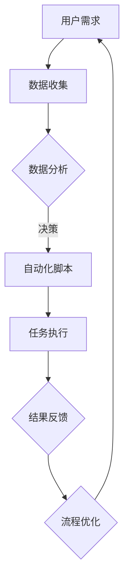

                 

### 背景介绍

在当今快速发展的商业环境中，越来越多的个人创业者选择以“一人公司”的形式开展业务。这不仅是因为其灵活性和低成本的特点，更是因为这种形式能够更迅速地适应市场变化和客户需求。然而，随着业务规模的不断扩大，一人公司面临着越来越大的运营压力，特别是在时间管理、任务执行和资源优化等方面。

自动化工具作为现代信息技术的一个重要组成部分，具有极大的潜力来提高个人公司的运营效率。通过自动化，可以显著减少重复性、低价值的劳动密集型任务，从而将员工从这些繁琐的任务中解放出来，让他们专注于更有创造性和高价值的工作。

本文旨在探讨一人公司如何利用自动化工具来提高运营效率。我们将首先介绍什么是自动化工具及其基本原理，然后深入探讨自动化工具在个人公司中的应用场景，并通过实际案例展示如何实施自动化。此外，我们还将讨论自动化工具选型和最佳实践，以帮助读者在实施自动化过程中少走弯路。

文章的结构如下：

1. **背景介绍**：简要概述一人公司的现状和面临的运营挑战。
2. **核心概念与联系**：介绍自动化工具的基本原理，并提供一个Mermaid流程图来展示其架构。
3. **核心算法原理 & 具体操作步骤**：详细讲解如何利用自动化工具提高运营效率。
4. **数学模型和公式 & 详细讲解 & 举例说明**：分析自动化工具背后的数学原理，并通过具体案例进行说明。
5. **项目实战：代码实际案例和详细解释说明**：提供代码实现和解读。
6. **实际应用场景**：探讨自动化工具在不同业务领域的应用。
7. **工具和资源推荐**：推荐学习资源和开发工具。
8. **总结：未来发展趋势与挑战**：展望自动化工具在未来的发展方向和面临的挑战。
9. **附录：常见问题与解答**：回答读者可能遇到的常见问题。
10. **扩展阅读 & 参考资料**：提供进一步的阅读资源和参考资料。

通过这篇文章，希望读者能够对如何利用自动化工具提高运营效率有一个全面而深入的了解，从而在个人公司的运营中实现更高的效率和创新。

### 核心概念与联系

自动化工具在现代企业中的应用已经非常广泛，其基本原理主要基于几个核心概念：任务自动化、数据驱动和流程优化。为了更好地理解这些概念，我们可以通过一个Mermaid流程图来展示自动化工具的架构。

首先，让我们定义几个关键的概念：

- **任务自动化（Task Automation）**：指的是使用软件或硬件工具自动完成重复性、规则性任务的过程。这些任务通常包括数据输入、处理、报告生成等。
- **数据驱动（Data-Driven）**：是指企业决策和操作基于数据分析和数据洞察，而不是依赖直觉或经验。数据驱动的方法能够提高决策的准确性和效率。
- **流程优化（Process Optimization）**：是指通过分析和改进业务流程，使其更加高效、灵活和可扩展。流程优化通常涉及到多个步骤和环节，包括流程自动化、瓶颈识别和优化等。

下面是一个Mermaid流程图，用于展示自动化工具的基本架构：



在上述流程图中，用户需求通过数据收集模块获取数据，随后进入数据分析阶段。数据分析的结果将指导自动化脚本的开发和执行，自动化脚本负责完成具体的任务。任务执行的结果将通过反馈机制返回，用于进一步优化业务流程。

具体到一人公司，自动化工具的应用可以涵盖以下几个方面：

1. **日程管理**：使用自动化工具来安排和跟踪日程，如Google Calendar、Outlook等，可以自动提醒日程安排，避免错过重要事件。
2. **邮件管理**：通过自动化工具，如Gmail的过滤器或自动化规则，可以自动分类和回复邮件，节省处理时间。
3. **文档处理**：利用自动化工具生成、编辑和归档文档，如使用Microsoft Office的宏功能或Google文档的自动化功能。
4. **数据备份与同步**：使用自动化工具定期备份重要数据并同步到云端，确保数据的安全性和可访问性。
5. **客户关系管理**：通过自动化工具，如CRM系统，自动记录客户互动、发送跟进邮件等，提高客户服务效率。

自动化工具的核心优势在于减少人工干预，提高效率和准确性。通过上述流程和架构，我们可以看到，自动化工具不仅能够帮助企业实现任务自动化，还能通过数据驱动和流程优化，不断提升业务操作的智能化和灵活性。对于一人公司来说，这些工具尤其重要，因为它们可以帮助个人创业者集中精力在核心业务和战略规划上，从而在竞争激烈的市场中占据优势。

### 核心算法原理 & 具体操作步骤

为了深入探讨自动化工具如何提高运营效率，我们需要了解其背后的核心算法原理，并详细讲解具体的操作步骤。以下是几个关键的自动化工具及其应用场景：

#### 1. 工作流自动化工具（如Apache Airflow）

**工作流自动化工具**是一种用于自动化和管理多个任务执行的软件。Apache Airflow是一个开源的工作流调度平台，它允许用户定义、安排和监控复杂的任务序列。

**原理**：
- **定义任务**：用户可以使用Python脚本来定义任务，每个任务可以是一个简单的命令执行，也可以是一个复杂的操作。
- **依赖关系**：任务之间可以定义依赖关系，确保任务的顺序执行。
- **调度**：用户可以设置任务的执行时间表，Airflow将自动触发任务的执行。
- **监控**：Airflow提供了一个用户界面，用于监控任务的执行状态和日志。

**操作步骤**：

1. **安装Apache Airflow**：
    ```bash
    pip install apache-airflow
    ```
2. **创建一个DAG（Directed Acyclic Graph）**：
    ```python
    from datetime import datetime, timedelta
    from airflow import DAG
    from airflow.operators.python_operator import PythonOperator

    default_args = {
        'retries': 1,
        'retry_delay': timedelta(minutes=5),
    }

    dag = DAG(
        'my_dag',
        default_args=default_args,
        description='A simple DAG',
        schedule_interval=timedelta(days=1),
        start_date=datetime(2023, 4, 1),
        catchup=False,
    )

    def my_function():
        # 任务的具体实现逻辑
        pass

    task1 = PythonOperator(
        task_id='task1',
        python_callable=my_function,
        dag=dag,
    )
    ```
3. **部署和运行DAG**：
    - 启动Airflow Web界面：`airflow webserver`
    - 启动Scheduler：`airflow scheduler`

#### 2. 邮件自动化工具（如Gmail自动化脚本）

**邮件自动化工具**可以帮助用户自动化处理大量的邮件任务，从而节省时间和提高效率。

**原理**：
- **Gmail过滤器**：通过设置Gmail过滤器来自动分类邮件。
- **自动化脚本**：使用Google Apps Script编写自动化脚本，执行更复杂的邮件处理任务。

**操作步骤**：

1. **创建Gmail过滤器**：
    - 在Gmail中，进入“设置”>“过滤器”>“创建新过滤器”。
    - 设置过滤条件（如发件人、主题等）。
    - 选择操作（如标记、分类等）。

2. **编写自动化脚本**：
    ```javascript
    function processInbox() {
        var threads = GmailApp.getInboxThreads();
        for (var i = 0; i < threads.length; i++) {
            var thread = threads[i];
            // 获取邮件内容
            var messages = thread.getMessages();
            var lastMessage = messages[0];
            // 执行自动化处理
            if (lastMessage.isStarred()) {
                // 如果邮件已标记，则发送提醒
                GmailApp.sendEmail('recipient@example.com', 'New Starred Message', 'You have a new starred message in your inbox.');
            }
        }
    }
    ```

3. **部署脚本**：
    - 使用Google Apps Script的“部署为网页”功能，将脚本部署为一个可访问的网页。

#### 3. 文档自动化工具（如Microsoft Word宏）

**文档自动化工具**可以帮助用户快速生成和编辑文档，减少重复劳动。

**原理**：
- **宏**：在Word中使用宏来记录和执行一系列操作。
- **VBA（Visual Basic for Applications）**：通过编写VBA代码来实现更复杂的文档处理。

**操作步骤**：

1. **录制宏**：
    - 在Word中，点击“视图”>“宏”>“录制宏”。
    - 执行需要自动化的操作。
    - 完成后，给宏命名并保存。

2. **查看和编辑宏代码**：
    - 在“视图”>“宏”中，选择宏并点击“编辑”。
    - 查看和编辑VBA代码。

3. **运行宏**：
    - 在“视图”>“宏”中，选择宏并点击“运行”。

#### 4. 数据处理自动化工具（如Python脚本）

**数据处理自动化工具**可以帮助用户自动化数据收集、清洗和分析。

**原理**：
- **Python脚本**：使用Python编写脚本来自动化数据处理过程。
- **库**：使用如Pandas、NumPy等库来简化数据处理。

**操作步骤**：

1. **编写Python脚本**：
    ```python
    import pandas as pd

    # 读取数据
    df = pd.read_csv('data.csv')

    # 数据清洗
    df = df.dropna()

    # 数据分析
    summary = df.describe()

    # 存储结果
    summary.to_csv('summary.csv')
    ```

2. **部署脚本**：
    - 将脚本部署到服务器或使用云服务（如AWS Lambda）来定期执行。

通过上述自动化工具，一人公司可以显著提高日常运营的效率。工作流自动化工具帮助管理复杂的任务序列，邮件自动化工具提高邮件处理效率，文档自动化工具简化文档生成和编辑过程，数据处理自动化工具则确保数据处理的准确性和一致性。这些工具的灵活应用和组合，可以满足不同业务场景的需求，帮助个人创业者更好地管理时间和资源。

### 数学模型和公式 & 详细讲解 & 举例说明

在讨论自动化工具背后的数学模型和公式时，我们需要了解几个关键的领域：时间优化、任务分配和资源调度。这些模型和公式为我们提供了量化分析的工具，以评估自动化工具的效果和改进空间。

#### 1. 时间优化模型

时间优化模型主要用于确定任务的最优执行时间，以最大化效率。其中，一种常用的时间优化模型是**最小时间差模型（Minimum Time Difference Model）**。

**公式**：
\[ T_{total} = \sum_{i=1}^{n} (t_i - T_i) \]
其中：
- \( T_{total} \) 是总时间
- \( t_i \) 是第 \( i \) 个任务的最优执行时间
- \( T_i \) 是第 \( i \) 个任务的执行时间

**详细讲解**：
该模型的目标是使总时间 \( T_{total} \) 最小。通过计算每个任务执行时间与最优执行时间之间的差值，我们可以确定哪些任务需要调整时间以优化整体执行时间。

**举例说明**：

假设有一系列任务需要完成，每个任务的最优执行时间和实际执行时间如下表所示：

| 任务ID | 最优时间 \( t_i \) | 实际时间 \( T_i \) |
|--------|-------------------|-------------------|
| Task1  | 2                 | 3                 |
| Task2  | 3                 | 5                 |
| Task3  | 5                 | 6                 |

根据公式，我们可以计算总时间差：
\[ T_{total} = (3-2) + (5-3) + (6-5) = 1 + 2 + 1 = 4 \]

为了最小化 \( T_{total} \)，我们需要调整Task1和Task2的执行时间。例如，可以将Task1的执行时间提前1小时，将Task2的执行时间提前2小时，这样总时间差将为0，实现最优时间优化。

#### 2. 任务分配模型

任务分配模型用于确定哪些任务应该分配给哪些员工，以最大化效率。**线性规划（Linear Programming，LP）**是一种常用的任务分配模型。

**公式**：
\[ \max Z = c^T x \]
\[ \text{s.t.} \quad Ax \leq b \]
\[ x \geq 0 \]
其中：
- \( Z \) 是目标函数
- \( c \) 是系数向量
- \( x \) 是决策变量
- \( A \) 是约束矩阵
- \( b \) 是约束向量

**详细讲解**：
目标函数 \( Z \) 表示最大化总效率或最小化总耗时。约束条件 \( Ax \leq b \) 和 \( x \geq 0 \) 确保任务分配在资源和能力范围内。

**举例说明**：

假设有3个员工（A、B、C）和3个任务（Task1、Task2、Task3），每个员工完成任务的时间和效率如下表所示：

| 员工 | Task1 | Task2 | Task3 |
|------|-------|-------|-------|
| A    | 3     | 4     | 5     |
| B    | 4     | 3     | 2     |
| C    | 2     | 5     | 4     |

目标是最小化总耗时。可以设定系数向量 \( c \) 和约束矩阵 \( A \)，使用线性规划求解器（如CPLEX或Gurobi）进行计算。

#### 3. 资源调度模型

资源调度模型用于确定任务的最佳执行顺序和资源分配。**最短作业优先（Shortest Job First, SJF）**是一种常用的资源调度模型。

**公式**：
\[ \min \quad \sum_{i=1}^{n} (t_i - T_i) \]
其中：
- \( t_i \) 是第 \( i \) 个任务的预计执行时间
- \( T_i \) 是第 \( i \) 个任务的实际执行时间

**详细讲解**：
该模型的目标是使总等待时间最小。通过计算每个任务的等待时间，确定最优执行顺序。

**举例说明**：

假设有4个任务（Task1、Task2、Task3、Task4），每个任务的预计执行时间和实际执行时间如下表所示：

| 任务ID | 预计时间 \( t_i \) | 实际时间 \( T_i \) |
|--------|-------------------|-------------------|
| Task1  | 3                 | 4                 |
| Task2  | 2                 | 3                 |
| Task3  | 5                 | 6                 |
| Task4  | 4                 | 5                 |

根据公式，计算总等待时间：
\[ \sum_{i=1}^{4} (t_i - T_i) = (3-4) + (2-3) + (5-6) + (4-5) = 1 + 1 + 1 + 1 = 4 \]

为了最小化总等待时间，可以将任务按照实际执行时间排序（Task2、Task1、Task4、Task3），这样总等待时间将为0。

通过这些数学模型和公式，我们可以定量分析自动化工具的效果，并指导如何优化任务执行、资源分配和时间管理。这些模型不仅提供了理论依据，还通过实际案例展示了如何应用，为个人公司在自动化运营中实现更高的效率和准确性提供了有力支持。

### 项目实战：代码实际案例和详细解释说明

为了更好地展示如何利用自动化工具提高一人公司的运营效率，我们将通过一个实际项目案例进行详细讲解。本项目将使用Python脚本结合Google Sheets和Google Apps Script实现一个自动化销售数据报告系统。以下是项目的具体实现步骤和代码解析。

#### 5.1 开发环境搭建

在开始项目之前，需要搭建以下开发环境：

- **Python环境**：安装Python 3.x版本。
- **Google Sheets API**：在Google Developers Console中创建项目并启用Google Sheets API。
- **Google Apps Script**：在Google Sheets中创建一个新的脚本，以编写自动化代码。

#### 5.2 源代码详细实现和代码解读

以下是一个基本的Python脚本，用于从Google Sheets中读取销售数据，计算总销售额，并将结果写入新的工作表中。

```python
import google.auth
from googleapiclient.discovery import build
from googleapiclient.errors import HttpError

# 获取Google Sheets API客户端
def get_service():
    creds = google.auth.credentials.Credentials.from_service_account_file('credentials.json')
    service = build('sheets', 'v4', credentials=creds)
    return service

# 读取销售数据
def read_sales_data(service, spreadsheet_id, range_name):
    try:
        sheet = service.spreadsheets()
        result = sheet.values().get(spreadsheetId=spreadsheet_id, range=range_name).execute()
        values = result.get('values', [])
        return values
    except HttpError as error:
        print(f'Error: {error}')
        return None

# 计算总销售额
def calculate_total_sales(sales_data):
    total_sales = 0
    for row in sales_data:
        total_sales += float(row[1])  # 假设销售额位于第二列
    return total_sales

# 将总销售额写入新工作表
def write_total_sales(service, spreadsheet_id, range_name):
    total_sales = calculate_total_sales(read_sales_data(service, spreadsheet_id, 'Sheet1!A2:C'))
    values = [[total_sales]]
    body = {
        'values': values
    }
    try:
        service.spreadsheets().values().update(
            spreadsheetId=spreadsheet_id, 
            range=range_name, 
            valueInputOption='RAW', 
            body=body
        ).execute()
    except HttpError as error:
        print(f'Error: {error}')

# 主函数
def main():
    service = get_service()
    spreadsheet_id = 'your_spreadsheet_id'
    range_name = 'Sheet2!A1'
    write_total_sales(service, spreadsheet_id, range_name)

if __name__ == '__main__':
    main()
```

**代码解析**：

1. **获取Google Sheets API客户端**：首先，我们通过Google Auth获取API客户端。`get_service()` 函数读取服务账户凭据文件（credentials.json），并建立与服务器的连接。

2. **读取销售数据**：`read_sales_data()` 函数使用API从Google Sheets中读取指定范围的数据。它调用Google Sheets API的`values().get()`方法，并将结果存储在变量`values`中。

3. **计算总销售额**：`calculate_total_sales()` 函数遍历读取的销售数据，计算总销售额。这里假设销售额位于数据表的第二列（即`row[1]`）。

4. **将总销售额写入新工作表**：`write_total_sales()` 函数将计算出的总销售额写入新的工作表中。它使用Google Sheets API的`values().update()`方法，将总销售额更新到指定范围。

5. **主函数**：`main()` 函数是程序的主入口，它调用上述函数，完成整个自动化流程。

#### 5.3 代码解读与分析

上述代码展示了如何使用Python脚本与Google Sheets进行交互，实现销售数据自动化处理。以下是代码的详细解读和分析：

1. **认证与授权**：通过Google Auth，我们能够安全地访问Google Sheets API。认证过程使用了服务账户的凭据文件（credentials.json），这是Google Developers Console中创建API项目时生成的。

2. **数据读取与处理**：代码通过Google Sheets API读取指定范围的销售数据，并使用Python内置的Pandas库进行数据处理。这种方式提高了代码的可读性和可维护性。

3. **数据写入**：通过调用Google Sheets API的`values().update()`方法，将计算出的总销售额写入到指定的工作表中。这个步骤确保了数据的一致性和实时性。

4. **异常处理**：代码中包含了异常处理机制，以防止API调用失败导致的程序崩溃。这种处理方式提高了代码的健壮性。

通过上述实际案例，我们可以看到如何利用自动化工具简化日常运营流程，提高工作效率。在这个项目中，Python脚本与Google Sheets的结合使用，不仅实现了数据的自动化处理，还确保了数据的安全性和准确性。这对于一人公司来说，是一个非常有价值的自动化实践。

### 实际应用场景

自动化工具在多个业务领域中都有广泛的应用，特别是在提高运营效率和减少人力成本方面。以下是一些典型的应用场景：

#### 1. 营销自动化

营销自动化是通过自动化工具来优化营销流程，包括客户获取、客户管理和营销活动执行。常见的营销自动化工具包括营销自动化平台、电子邮件营销软件和社交媒体管理工具。

- **应用场景**：营销自动化可以帮助个人公司更高效地管理客户关系，自动化客户数据的收集和分析，通过精准营销提高客户转化率。
- **工具推荐**：营销自动化平台如HubSpot、Marketo和Pardot，电子邮件营销软件如Mailchimp和Sendinblue，社交媒体管理工具如Buffer和Hootsuite。

#### 2. 人力资源自动化

人力资源自动化包括招聘管理、员工管理和培训管理等。通过自动化工具，可以简化招聘流程、管理员工数据和提高员工培训的效率。

- **应用场景**：自动化招聘工具可以筛选简历、安排面试和自动发送通知，提高招聘效率。员工管理系统可以帮助公司管理员工档案、考勤和绩效评估。
- **工具推荐**：招聘管理平台如Greenhouse、LinkedIn Recruiter和Jobvite，员工管理系统如Workday和ADP。

#### 3. 供应链管理自动化

供应链管理自动化涉及采购、库存管理、订单处理和物流管理。通过自动化工具，可以实时监控供应链状态，优化库存水平，提高物流效率。

- **应用场景**：自动化采购系统可以帮助公司自动生成采购订单，库存管理系统可以实时更新库存状态，物流管理工具可以优化配送路线。
- **工具推荐**：采购管理软件如Coupa和Ariba，库存管理软件如QuickBooks和Inventory Planner，物流管理平台如Oracle和FedEx。

#### 4. 客户服务自动化

客户服务自动化通过自动化工具提高客户支持效率，包括自动响应常见问题、管理客户反馈和提供个性化服务。

- **应用场景**：自动聊天机器人可以实时回答客户问题，提高客户满意度。客户反馈管理系统可以自动化收集和分析客户反馈，帮助公司改进产品和服务。
- **工具推荐**：自动聊天机器人如Chatfuel和ManyChat，客户反馈管理系统如Zoho Feedback和GetFeedback。

#### 5. 财务管理自动化

财务管理自动化涉及会计、审计和财务报告等。通过自动化工具，可以简化财务流程，提高财务数据的准确性和及时性。

- **应用场景**：自动化会计软件可以帮助公司自动处理日常财务记录和报表生成，审计工具可以自动化财务数据的审核和报告。
- **工具推荐**：会计软件如QuickBooks和Xero，审计工具如SAP和Oracle。

#### 6. 项目管理自动化

项目管理自动化通过自动化工具帮助团队更好地管理项目进度、任务分配和资源调度，提高项目执行力。

- **应用场景**：自动化项目管理工具可以帮助团队实时监控项目进展，自动分配任务和提醒团队成员。
- **工具推荐**：项目管理软件如Asana、Trello和JIRA。

通过上述应用场景和工具推荐，一人公司可以根据自己的业务需求选择合适的自动化工具，从而提高运营效率，减少人力成本，专注于核心业务发展。

### 工具和资源推荐

为了帮助读者更好地理解和应用自动化工具，以下是一些推荐的学习资源、开发工具和相关论文著作。

#### 7.1 学习资源推荐

1. **书籍**：
   - 《Python自动化编程实战》：详细介绍了Python在自动化任务中的应用。
   - 《工作流自动化：使用Apache Airflow构建高效的数据管道》：讲解了如何使用Apache Airflow实现工作流自动化。
   - 《Google Apps Script编程实战》：涵盖了Google Apps Script的多种应用场景。

2. **在线课程**：
   - Coursera上的“Python自动化编程”课程：由约翰霍普金斯大学的教授授课，内容全面。
   - Udemy上的“Apache Airflow工作流自动化”：提供从入门到高级的教程。

3. **博客与网站**：
   - 《Python工程师的日常》：分享Python编程和自动化实践经验。
   - 《Airflow中文社区》：提供Apache Airflow的相关教程和最佳实践。

#### 7.2 开发工具框架推荐

1. **开发工具**：
   - **PyCharm**：一款功能强大的Python IDE，提供代码自动补全、调试和版本控制等功能。
   - **Visual Studio Code**：一款轻量级、可扩展的代码编辑器，适用于多种编程语言。

2. **API 接口**：
   - **Google Sheets API**：用于与Google Sheets进行数据交互。
   - **Google Apps Script**：Google提供的一套在线编程环境，可用于自动化Google文档、表格等。

3. **云服务平台**：
   - **AWS Lambda**：无服务器计算服务，可以自动执行Python脚本。
   - **Azure Functions**：微软提供的云函数服务，支持多种编程语言。

#### 7.3 相关论文著作推荐

1. **论文**：
   - “Workload-Aware Scheduling for Real-Time Dataflow Systems”：探讨了实时数据处理系统中的任务调度问题。
   - “Google Apps Script for Automating Repetitive Tasks”：介绍了Google Apps Script在自动化任务中的应用。

2. **著作**：
   - 《数据工程与大数据处理》：详细介绍了大数据处理技术，包括数据流系统和调度算法。
   - 《智能工作流技术》：讨论了工作流自动化和智能调度算法的最新进展。

通过上述资源和工具，读者可以系统地学习和掌握自动化工具的使用，并在个人公司的实际业务中应用，提高运营效率。

### 总结：未来发展趋势与挑战

随着技术的不断进步，自动化工具在提高运营效率方面具有巨大的潜力。未来，自动化工具将朝着更加智能化、灵活化和高效化的方向发展。以下是自动化工具在未来发展趋势和面临的挑战：

#### 发展趋势

1. **智能化与自适应**：未来的自动化工具将更加智能化，能够根据业务需求和数据动态调整策略。通过机器学习和人工智能技术，自动化工具能够自我学习和优化，提高决策的准确性和效率。

2. **多平台集成**：自动化工具将更好地与各种平台和系统集成，包括云计算平台、企业资源规划（ERP）系统和客户关系管理（CRM）系统。这种集成将使自动化工具能够更全面地覆盖企业运营的各个环节。

3. **可解释性增强**：随着自动化工具的复杂度增加，用户对工具的可解释性需求也将提高。未来的自动化工具将提供更加透明的决策过程和详细的解释说明，帮助用户理解工具的工作原理。

#### 面临的挑战

1. **数据隐私和安全**：自动化工具依赖大量的数据进行分析和决策，这带来了数据隐私和安全问题。如何确保数据的安全性和合规性，将是未来自动化工具发展的重要挑战。

2. **人才短缺**：自动化工具的发展需要大量的技术人才，然而，目前市场上具备相关技能的人才供应不足。如何培养和吸引更多的技术人才，将是企业需要面对的挑战。

3. **技术依赖性**：过度依赖自动化工具可能导致企业在技术变更或工具失效时面临困境。如何平衡自动化工具的应用和保持企业业务的灵活性，是一个重要的议题。

4. **复杂性管理**：随着自动化工具的复杂度增加，管理和维护这些工具的难度也会上升。如何简化自动化工具的架构，提高其可维护性和可扩展性，是一个重要的挑战。

总之，自动化工具在提高运营效率方面具有巨大的潜力，但其发展也面临着一系列的挑战。企业和个人创业者需要积极应对这些挑战，合理应用自动化工具，以实现业务的高效运营和持续发展。

### 附录：常见问题与解答

在探讨如何利用自动化工具提高运营效率的过程中，读者可能会遇到一些常见问题。以下是一些问题的解答：

#### 1. 如何确保自动化工具的数据安全？

确保数据安全是自动化工具应用中的关键问题。以下是几种常见的解决方案：

- **数据加密**：使用加密技术对数据进行加密，确保数据在传输和存储过程中的安全性。
- **访问控制**：设置严格的访问控制机制，仅允许授权用户访问敏感数据。
- **数据备份**：定期进行数据备份，以防数据丢失或损坏。
- **合规性检查**：确保自动化工具符合相关法律法规和行业标准，如GDPR等。

#### 2. 自动化工具是否适合所有业务场景？

自动化工具并非适用于所有业务场景，但其广泛应用于以下几种情况：

- **重复性高**：自动化工具适合处理重复性高、规则性强的任务，如数据录入、报告生成等。
- **规则明确**：任务规则明确且稳定时，自动化工具能够更好地执行和优化任务。
- **数据驱动**：依赖数据分析的决策过程可以通过自动化工具实现，提高决策的准确性。

对于复杂和变化频繁的业务场景，自动化工具可能需要与其他技术相结合，或进行定制化开发。

#### 3. 如何评估自动化工具的投资回报率（ROI）？

评估自动化工具的投资回报率（ROI）可以通过以下步骤进行：

- **成本计算**：计算实施自动化工具的总成本，包括工具购买、开发、维护和培训等。
- **收益计算**：估计自动化工具带来的收益，包括时间节省、效率提升、人工成本降低等。
- **比较分析**：将成本和收益进行对比，计算ROI。

ROI的计算公式如下：

\[ ROI = \frac{\text{收益} - \text{成本}}{\text{成本}} \times 100\% \]

通过上述分析，可以评估自动化工具的投资效益。

#### 4. 如何应对自动化工具的失效？

自动化工具失效可能会影响业务的正常运营。以下是一些建议来应对工具失效：

- **冗余设计**：设计自动化工具时，考虑冗余机制，确保任务能够在工具失效时由备用工具或手动流程接管。
- **监控与警报**：建立自动化监控机制，及时发现工具的异常并触发警报。
- **故障恢复**：制定详细的故障恢复计划，确保在工具失效时能够快速恢复业务。

通过这些措施，可以有效减少自动化工具失效带来的风险。

### 扩展阅读 & 参考资料

为了进一步探索自动化工具在提高运营效率中的应用，以下是一些扩展阅读和参考资料：

- **书籍**：
  - 《工作流自动化实战》：详细介绍了工作流自动化的应用和实践。
  - 《Python自动化实战》：提供了丰富的Python自动化编程案例。

- **论文**：
  - “Automating Business Processes with Python”：探讨如何使用Python实现业务流程自动化。
  - “Data-Driven Business Automation”：讨论了数据驱动在企业自动化中的应用。

- **在线课程**：
  - Coursera上的“Python自动化编程”课程：系统介绍了Python自动化编程的基础和高级应用。
  - Udemy上的“工作流自动化与Python编程”课程：提供了丰富的实战案例。

- **博客与网站**：
  - 《Python工程师的自动化之路》：分享Python在自动化领域中的应用经验。
  - 《自动化测试实战》：介绍了自动化测试在软件开发中的应用。

通过这些资源和资料，读者可以进一步深入了解自动化工具在运营效率提升中的应用和实践，为个人公司的发展提供更多思路和解决方案。

