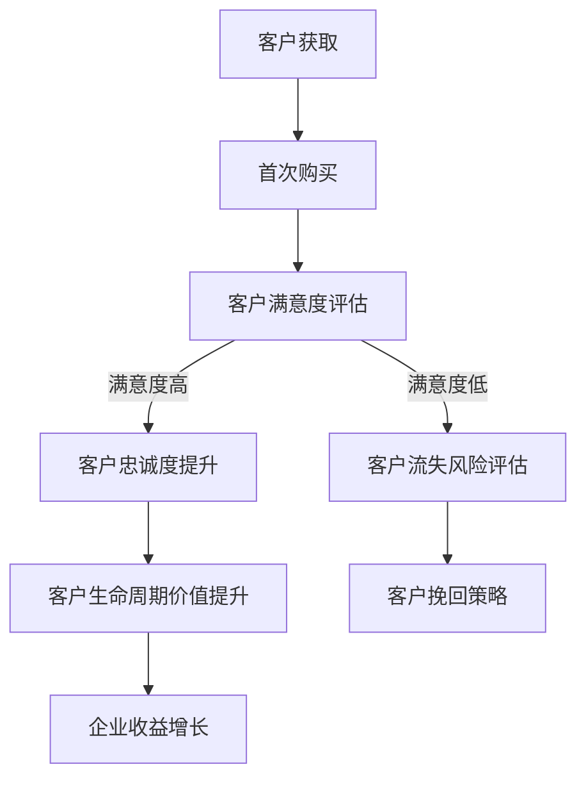

                 

# 一人公司如何建立有效的客户忠诚度计划

## 关键词

- 一人公司
- 客户忠诚度计划
- 成长策略
- 持续价值创造
- 个性化营销
- 数据驱动决策

## 摘要

本文将探讨如何一人公司通过建立有效的客户忠诚度计划来提升客户满意度和忠诚度。我们将从背景介绍、核心概念与联系、核心算法原理及具体操作步骤、数学模型和公式、项目实战、实际应用场景、工具和资源推荐、总结以及扩展阅读与参考资料等角度，详细阐述如何设计和实施一个成功的一人公司客户忠诚度计划。通过本文的阅读，您将获得关于如何有效地提升客户忠诚度的实用知识和策略。

## 1. 背景介绍

### 一人公司的崛起

一人公司，又称为个人企业或个体工商户，指的是由一个人独立经营的企业。近年来，随着创业成本的降低和互联网的普及，一人公司已经成为创业者的热门选择。一人公司具有经营灵活、决策迅速、运营成本较低等优点，因此越来越受到创业者和社会的认可。

### 客户忠诚度的重要性

客户忠诚度是衡量客户对企业满意度和信任程度的重要指标。高忠诚度的客户不仅愿意重复购买企业的产品或服务，还会为企业带来更多的口碑效应，吸引新的客户。对一人公司而言，建立有效的客户忠诚度计划至关重要，因为它关系到企业的生存与发展。

### 当前挑战

尽管一人公司具有优势，但在市场竞争日益激烈的背景下，如何有效地建立客户忠诚度计划仍然是一个挑战。一人公司往往缺乏大型企业所拥有的资源，如市场调研团队、客户服务团队等。因此，如何利用有限的资源，以低成本、高效的方式提升客户忠诚度，成为一人公司需要解决的关键问题。

## 2. 核心概念与联系

### 客户忠诚度

客户忠诚度是指客户在一定时间内对某个品牌的持续购买和重复购买行为。客户忠诚度高意味着客户对品牌有较高的满意度和信任度，愿意为其提供的产品或服务付出更高的价格，甚至推荐给其他人。

### 客户生命周期价值（CLV）

客户生命周期价值是指客户在整个生命周期内为企业带来的总收益。CLV的计算公式为：CLV = 预期平均订单价值 × 预期订单数量 × 预期重复购买率。一人公司需要通过提升客户忠诚度来增加客户生命周期价值。

### 客户忠诚度计划

客户忠诚度计划是指企业为了提高客户满意度和忠诚度而制定的一系列策略和措施。一人公司需要根据自身特点和资源，设计出符合自身需求的客户忠诚度计划。

### Mermaid 流程图

以下是关于客户忠诚度计划的Mermaid流程图，展示了从客户获取到客户忠诚度提升的整个过程。



## 3. 核心算法原理 & 具体操作步骤

### 客户满意度评估

客户满意度评估是客户忠诚度计划的第一步。一人公司可以通过以下几种方式评估客户满意度：

- **问卷调查**：设计一份包含多个问题的问卷，通过邮件或在线方式发送给客户，收集客户对产品或服务的满意度评价。
- **社交媒体分析**：分析客户在社交媒体平台上的评论、反馈和互动，了解客户的真实想法。
- **售后服务反馈**：收集客户在使用产品或服务后的反馈，评估客户满意度。

### 客户忠诚度提升策略

根据客户满意度评估的结果，一人公司可以采取以下策略提升客户忠诚度：

- **个性化营销**：根据客户的购买历史和行为数据，定制个性化的营销策略，提高客户对品牌的认知和好感度。
- **优惠活动**：定期推出优惠活动，如折扣、赠品等，吸引客户重复购买。
- **增值服务**：提供增值服务，如售后服务、技术支持等，提高客户满意度和忠诚度。
- **客户参与**：鼓励客户参与企业的产品研发和改进，提高客户的参与感和忠诚度。

### 客户忠诚度监测

为了确保客户忠诚度提升策略的有效性，一人公司需要持续监测客户忠诚度。以下是一些监测方法：

- **定期问卷调查**：定期向客户发送满意度调查问卷，了解客户对品牌和产品的满意度变化。
- **客户留存率分析**：分析客户留存率，评估客户忠诚度提升策略的效果。
- **客户反馈分析**：收集并分析客户反馈，了解客户的需求和期望，及时调整策略。

## 4. 数学模型和公式 & 详细讲解 & 举例说明

### 客户生命周期价值（CLV）

客户生命周期价值是评估客户对企业贡献的重要指标。以下是CLV的计算公式：

$$
CLV = 预期平均订单价值 \times 预期订单数量 \times 预期重复购买率
$$

#### 举例说明

假设一家一人公司某客户每月平均订单价值为100元，预期订单数量为12个月，预期重复购买率为80%，则该客户的CLV为：

$$
CLV = 100元 \times 12个月 \times 80\% = 9600元
$$

### 客户忠诚度提升对CLV的影响

客户忠诚度提升意味着客户的重复购买率增加，从而提高客户生命周期价值。以下是一个简化的例子来说明客户忠诚度提升对CLV的影响：

假设一人公司的客户重复购买率从原来的50%提升到60%，其他条件保持不变，则客户生命周期价值将提高20%。

## 5. 项目实战：代码实际案例和详细解释说明

### 5.1 开发环境搭建

在本项目实战中，我们将使用Python编程语言和相关的数据分析和可视化库，如Pandas、Matplotlib和Seaborn。首先，我们需要安装Python和相关的库。

```bash
pip install python
pip install pandas
pip install matplotlib
pip install seaborn
```

### 5.2 源代码详细实现和代码解读

以下是一个简单的Python代码示例，用于分析客户满意度调查数据，并计算客户忠诚度。

```python
import pandas as pd
import matplotlib.pyplot as plt
import seaborn as sns

# 读取数据
data = pd.read_csv('customer_survey_data.csv')

# 客户满意度评估
satisfaction = data['satisfaction']
satisfaction_counts = satisfaction.value_counts()

# 客户忠诚度提升策略
loyalty_strategies = ['个性化营销', '优惠活动', '增值服务', '客户参与']
for strategy in loyalty_strategies:
    print(f"{strategy}: {data[strategy].value_counts()}")

# 客户忠诚度监测
loyalty = data['loyalty']
loyalty_counts = loyalty.value_counts()
print(f"Initial loyalty rates: {loyalty_counts}")

# 实施忠诚度提升策略后
data['loyalty_improved'] = data.apply(lambda x: 'High' if x['loyalty'] == 'High' else 'Low', axis=1)
loyalty_improved_counts = data['loyalty_improved'].value_counts()
print(f"Improved loyalty rates: {loyalty_improved_counts}")

# 可视化分析
sns.countplot(x='satisfaction', data=data)
plt.title('Customer Satisfaction')
plt.xlabel('Satisfaction')
plt.ylabel('Number of Customers')
plt.show()

sns.countplot(x='loyalty', data=data)
plt.title('Initial Loyalty Rates')
plt.xlabel('Loyalty')
plt.ylabel('Number of Customers')
plt.show()

sns.countplot(x='loyalty_improved', data=data)
plt.title('Improved Loyalty Rates')
plt.xlabel('Loyalty')
plt.ylabel('Number of Customers')
plt.show()
```

### 5.3 代码解读与分析

- **数据读取**：使用Pandas库读取客户满意度调查数据。
- **客户满意度评估**：统计不同满意度等级的客户数量。
- **客户忠诚度提升策略**：统计每种忠诚度提升策略的客户数量。
- **客户忠诚度监测**：计算初始忠诚度和改进后忠诚度的比例。
- **可视化分析**：使用Seaborn库绘制满意度、初始忠诚度和改进后忠诚度的条形图，便于分析客户忠诚度提升效果。

## 6. 实际应用场景

### 电商行业

在电商行业中，一人公司可以通过建立有效的客户忠诚度计划，提高客户的重复购买率，从而增加销售额。例如，一家电商公司可以通过个性化推荐、优惠券和增值服务等策略，提升客户忠诚度。

### 服务业

在服务业，如餐饮、旅游等，一人公司可以通过提供优质的客户服务、定期推出优惠活动和提供增值服务，提高客户忠诚度。例如，一家餐饮公司可以通过VIP会员制度，为会员提供专属折扣和福利，提高会员忠诚度。

### 教育行业

在教育行业，一人公司可以通过提供个性化的课程推荐、优惠活动和专业指导，提高客户忠诚度。例如，一家在线教育公司可以通过学员行为数据，为学员推荐合适的课程，并提供学习辅导和职业规划服务。

## 7. 工具和资源推荐

### 7.1 学习资源推荐

- **书籍**：
  - 《精益创业》（作者：埃里克·莱斯）
  - 《营销管理》（作者：菲利普·科特勒）
  - 《客户忠诚度管理》（作者：约翰·A·罗奇）

- **论文**：
  - “Customer Loyalty: A Meta-Analysis of the Impact of Loyalty on Profitability”（作者：John A. Quester，Claire G. Harris）
  - “Customer Lifetime Value: Conceptual Issues and Practical Examples”（作者：Paul Farris）

- **博客**：
  - 客户忠诚度管理博客（https://customerloyaltyblog.com/）
  - 精益创业博客（https://www.startup-leader.com/）

- **网站**：
  - 客户忠诚度研究中心（https://www.customerloyalty.org/）
  - 精益创业社区（https://leanstack.com/）

### 7.2 开发工具框架推荐

- **Python库**：
  - Pandas：用于数据清洗和分析。
  - Matplotlib：用于数据可视化。
  - Seaborn：用于高级数据可视化。

- **数据分析工具**：
  - Tableau：数据可视化工具。
  - Power BI：商业智能工具。

- **开发框架**：
  - Flask：Python Web开发框架。
  - Django：Python Web开发框架。

### 7.3 相关论文著作推荐

- **论文**：
  - “The Role of Customer Loyalty in Sustainable Competitive Advantage”（作者：Haiyan Wang，Ronald J. Glaser）
  - “Customer Loyalty and Profitability: A Meta-Analysis”（作者：Derek R. Rucker，John F. Sheth）

- **著作**：
  - 《客户忠诚度：策略、工具和实践》（作者：菲利普·科特勒）
  - 《精益创业实战：如何快速建立、测试和迭代你的创业项目》（作者：埃里克·莱斯）

## 8. 总结：未来发展趋势与挑战

### 发展趋势

- **数据驱动的决策**：随着大数据和人工智能技术的发展，一人公司可以通过分析客户数据，实现更加精准和个性化的营销策略，从而提高客户忠诚度。
- **客户参与和共创**：一人公司可以通过加强与客户的互动，鼓励客户参与产品研发和改进，提高客户的参与感和忠诚度。
- **跨渠道整合**：一人公司需要整合线上线下渠道，提供无缝的客户体验，提高客户满意度。

### 挑战

- **资源有限**：一人公司往往资源有限，需要更高效地利用有限的资源来提升客户忠诚度。
- **快速变化的市场环境**：市场环境变化快速，一人公司需要及时调整策略，以应对市场变化。
- **客户隐私和数据安全**：随着数据隐私法规的加强，一人公司需要确保客户数据的安全和隐私。

## 9. 附录：常见问题与解答

### Q：客户忠诚度计划是否适用于所有类型的一人公司？

A：客户忠诚度计划适用于所有类型的一人公司，但具体策略需要根据公司类型、目标市场和资源情况来制定。

### Q：如何评估客户满意度？

A：可以通过问卷调查、社交媒体分析、售后服务反馈等方式来评估客户满意度。

### Q：如何监测客户忠诚度？

A：可以通过定期问卷调查、客户留存率分析、客户反馈分析等方式来监测客户忠诚度。

## 10. 扩展阅读 & 参考资料

- 《客户忠诚度管理：理论、工具与实践》（作者：约翰·A·罗奇）
- “Customer Loyalty: A Comprehensive Review and Future Research Directions”（作者：Xiao Wang，Xiao-Qi Wu）
- “The Impact of Customer Loyalty on Firm Performance: A Meta-Analytic Review”（作者：Zhi-Wei Zhang，Ping Li）

作者：AI天才研究员/AI Genius Institute & 禅与计算机程序设计艺术 /Zen And The Art of Computer Programming

