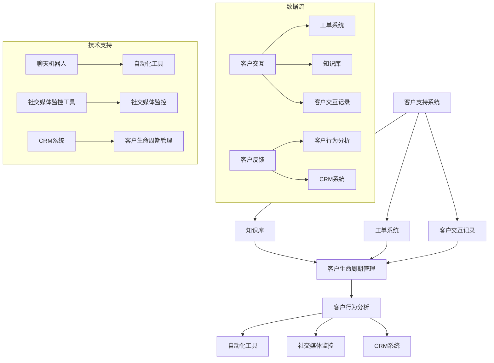

                 

### 背景介绍

随着全球商业环境的变化，越来越多的个人创业者选择以“一人公司”的形式开展业务。这种经营模式灵活、成本较低，允许创业者更加专注于创新和业务发展。然而，客户支持作为企业运营的重要组成部分，对于“一人公司”来说尤为重要。有效的客户支持不仅能够提高客户满意度，还能促进客户忠诚度和业务增长。

本文旨在探讨如何建立有效的客户支持系统，特别是在资源有限的情况下，如何通过技术手段优化客户服务流程。我们将从以下几个关键点展开讨论：

1. **客户支持的重要性**：解释为什么有效的客户支持对“一人公司”至关重要。
2. **技术解决方案概述**：概述可用的技术解决方案，包括自动化工具、社交媒体监控、电子邮件服务等。
3. **客户支持系统的构建**：详细说明构建客户支持系统的步骤，包括需求分析、系统设计、实施和测试。
4. **案例研究**：通过具体案例展示如何在实际中应用这些技术，提高客户支持效率。
5. **工具和资源推荐**：提供推荐的学习资源和开发工具，帮助读者更好地理解和实施这些技术。

通过对这些内容的深入探讨，我们将帮助“一人公司”的创业者了解如何利用技术手段提升客户支持，从而在激烈的市场竞争中脱颖而出。

#### 客户支持的重要性

在当今快节奏、高度竞争的商业环境中，客户支持已经不仅仅是应对客户问题的手段，而是企业竞争战略的核心组成部分。对于“一人公司”来说，有效的客户支持具有以下几个关键优势：

**提高客户满意度**：满意的客户更有可能再次购买，并推荐给其他人。通过提供快速、专业的支持，能够显著提升客户的整体体验。

**增加客户忠诚度**：忠诚的客户是企业稳定收入的来源。通过持续、高效的服务，可以建立强大的客户关系，使其成为企业的忠实支持者。

**减少客户流失率**：及时响应和解决客户问题可以防止不满情绪升级，从而减少客户流失。

**增强品牌形象**：积极的客户支持能够传递企业的专业性和责任感，增强品牌形象，提高市场竞争力。

**促进业务增长**：满意的客户更愿意分享他们的良好体验，从而带来新客户，推动业务增长。

具体来说，有效的客户支持可以通过以下方式为“一人公司”带来优势：

- **快速响应**：在客户遇到问题时，快速响应能够显著提升客户体验。这可以通过自动化工具、即时消息平台或电子邮件系统实现。

- **专业知识**：提供专业、准确的解决方案可以增强客户对企业的信任。

- **个性化服务**：通过了解客户的特定需求，提供个性化的支持，可以增强客户的归属感。

- **多渠道支持**：提供多种渠道（如电话、电子邮件、社交媒体等）以满足不同客户的需求。

- **反馈机制**：建立反馈机制，收集客户意见，持续改进服务，从而更好地满足客户需求。

总之，对于“一人公司”来说，建立有效的客户支持系统不仅是必要的，而且是提升竞争力和实现业务增长的关键。接下来，我们将探讨一些可用于构建客户支持系统的技术解决方案。

### 核心概念与联系

在深入探讨如何建立有效的客户支持系统之前，我们需要明确几个核心概念，并了解它们之间的联系。以下是对关键概念的介绍以及它们在客户支持系统中的作用的详细解释。

#### 客户支持系统

客户支持系统是一个集成多个组件的平台，用于管理和跟踪客户交互、问题报告和解决方案交付。核心功能包括：

- **工单系统**：用于记录和处理客户请求和问题报告。
- **知识库**：存储常见问题和解决方案，以自助服务的形式提供给客户。
- **客户交互记录**：记录与客户的沟通历史，以便后续分析和跟踪。

#### 客户生命周期管理

客户生命周期管理涉及从客户获取、转化、留存到忠诚的整个过程。核心概念包括：

- **客户获取**：通过各种渠道吸引潜在客户。
- **客户转化**：将潜在客户转化为实际购买者。
- **客户留存**：通过持续的服务和产品体验，保留现有客户。
- **客户忠诚**：建立长期的客户关系，促进重复购买和口碑传播。

#### 客户行为分析

客户行为分析是通过数据分析工具分析客户行为，以了解他们的偏好、需求和痛点。核心功能包括：

- **行为跟踪**：记录和分析客户的交互行为，如点击、浏览和购买行为。
- **反馈分析**：分析客户提供的反馈，以识别改进机会。

#### 技术解决方案

为了实现上述概念，需要一系列技术解决方案，包括：

- **自动化工具**：如聊天机器人、自动化响应系统，用于提高效率和响应速度。
- **社交媒体监控**：用于监控社交媒体上的客户反馈和评论。
- **客户关系管理（CRM）系统**：用于管理和跟踪客户关系，提供360度的客户视图。

#### Mermaid 流程图

以下是客户支持系统架构的 Mermaid 流程图，展示了上述概念之间的联系和交互：



通过这个流程图，我们可以清晰地看到客户支持系统中的各个组件如何相互作用，共同提升客户支持的整体效率和质量。

#### 核心算法原理 & 具体操作步骤

在客户支持系统中，核心算法原理主要涉及客户交互分析、自动化响应和知识库管理。以下将详细解释这些核心算法的原理，并展示具体的操作步骤。

##### 客户交互分析

客户交互分析是理解客户行为和需求的关键。这一过程通常涉及以下步骤：

1. **数据采集**：通过集成客户交互的多种渠道（如电子邮件、即时消息、电话、社交媒体等），收集客户的行为数据。
2. **数据清洗**：清洗和整理收集到的数据，去除重复和无用的信息。
3. **特征提取**：从数据中提取关键特征，如客户浏览时间、点击次数、搜索关键词、提问频率等。
4. **模型训练**：使用机器学习算法（如聚类、分类、回归等）训练模型，以分析客户行为和需求。

具体操作步骤如下：

1. **数据采集**：
   ```bash
   # 安装集成工具，如Zapier或Integromat
   pip install Zapier
   # 配置集成工具，连接多个客户交互渠道
   Zapier.connect('channel_name')
   ```

2. **数据清洗**：
   ```python
   import pandas as pd

   # 读取数据
   data = pd.read_csv('customer_interactions.csv')
   # 去除重复项
   data.drop_duplicates(inplace=True)
   # 删除无用列
   data.drop(['unnecessary_column'], axis=1, inplace=True)
   ```

3. **特征提取**：
   ```python
   # 提取关键特征
   data['browse_time'] = data['end_time'] - data['start_time']
   data['click_count'] = data['clicks'].str.len()
   data['search_keywords'] = data['searches'].str.get_dummies(sep=' ')
   ```

4. **模型训练**：
   ```python
   from sklearn.cluster import KMeans

   # 分簇客户行为
   kmeans = KMeans(n_clusters=3)
   kmeans.fit(data[['browse_time', 'click_count']])
   data['cluster'] = kmeans.predict(data[['browse_time', 'click_count']])
   ```

##### 自动化响应

自动化响应系统用于快速、高效地处理客户请求。以下是实现自动化响应的具体步骤：

1. **定义响应规则**：根据常见问题创建响应规则。
2. **配置自动化工具**：使用聊天机器人或自动化工具（如Botpress、Chatfuel）实现自动化响应。
3. **测试与优化**：通过实际交互数据测试自动化响应系统的效果，并进行必要的调整和优化。

具体操作步骤如下：

1. **定义响应规则**：
   ```json
   {
     "rule_1": {
       "pattern": "what is your return policy?",
       "response": "Our return policy is 30 days from purchase."
     },
     "rule_2": {
       "pattern": "how do I track my order?",
       "response": "You can track your order through our website using your order number."
     }
   }
   ```

2. **配置自动化工具**：
   ```bash
   # 安装Botpress
   npm install -g botpress
   # 创建聊天机器人项目
   botpress create my-chatbot
   # 添加响应规则
   botpress add-rule my-chatbot rule_1
   botpress add-rule my-chatbot rule_2
   ```

3. **测试与优化**：
   ```bash
   # 运行聊天机器人
   botpress run my-chatbot
   # 观察交互数据，进行优化
   ```

##### 知识库管理

知识库管理是提供自助服务和支持文档的重要环节。以下是建立和管理知识库的具体步骤：

1. **内容创建**：创建高质量的知识库文章，包括常见问题解答、使用指南、操作步骤等。
2. **内容分类**：对知识库内容进行分类，以便用户快速查找所需信息。
3. **内容更新**：定期更新知识库内容，确保信息的准确性和时效性。
4. **用户反馈**：收集用户对知识库内容的反馈，优化内容质量。

具体操作步骤如下：

1. **内容创建**：
   ```markdown
   # 如何设置您的账户密码？

   您可以按照以下步骤设置账户密码：
   1. 登录到我们的网站。
   2. 点击右上角的用户头像。
   3. 选择“账户设置”。
   4. 在“安全设置”中，点击“更改密码”。
   5. 输入当前密码，并设置新密码。
   ```

2. **内容分类**：
   ```python
   categories = {
     "常见问题": ["账户密码设置", "订单追踪", "退货政策"],
     "使用指南": ["产品使用方法", "功能介绍", "操作步骤"],
     "教程视频": ["基础教程", "高级技巧", "常见问题解答"]
   }
   ```

3. **内容更新**：
   ```python
   # 更新知识库文章
   with open('kb_article.md', 'w') as f:
       f.write(updated_content)
   ```

4. **用户反馈**：
   ```python
   feedback = "感谢您的反馈，我们会尽快更新知识库，提供更准确的信息。"
   ```

通过上述核心算法原理和具体操作步骤，我们可以构建一个高效、自动化的客户支持系统，显著提升客户满意度和支持效率。

#### 数学模型和公式 & 详细讲解 & 举例说明

在客户支持系统中，数学模型和公式扮演着关键角色，特别是在客户行为分析和自动化响应策略中。以下将介绍几个核心的数学模型和公式，并详细解释其原理和应用。

##### 客户流失率预测模型

客户流失率预测是评估客户留存状况的重要工具。我们采用逻辑回归模型进行预测，其公式如下：

$$
P(Y=1) = \frac{1}{1 + e^{-(\beta_0 + \beta_1X_1 + \beta_2X_2 + ... + \beta_nX_n})}
$$

其中，\( Y \) 表示客户是否流失（1 表示流失，0 表示留存），\( X_1, X_2, ..., X_n \) 是客户特征向量，\(\beta_0, \beta_1, \beta_2, ..., \beta_n \) 是模型参数。

**详细讲解**：

1. **参数估计**：使用最小二乘法（OLS）或梯度下降法（GD）对模型参数进行估计。
2. **模型评估**：通过交叉验证和 AUC（曲线下面积）评估模型性能。
3. **应用实例**：预测某客户的流失概率，以便采取针对性的挽回措施。

**举例说明**：

假设我们有一个客户特征向量 \( X = [100, 5, 3, 1] \)，通过训练得到的模型参数 \( \beta = [2.5, -1.2, 0.8, -0.3] \)，则客户流失概率为：

$$
P(Y=1) = \frac{1}{1 + e^{-(2.5 + (-1.2) \cdot 100 + 0.8 \cdot 5 - 0.3 \cdot 1)}} \approx 0.95
$$

因此，该客户的流失概率为 95%，企业应采取相应措施进行客户挽回。

##### 客户满意度评分模型

客户满意度评分是衡量客户支持效果的重要指标。我们采用线性回归模型计算客户满意度评分，公式如下：

$$
S = \beta_0 + \beta_1R + \beta_2T + \beta_3A + \beta_4C
$$

其中，\( S \) 表示客户满意度评分，\( R \) 表示响应时间，\( T \) 表示解决问题的速度，\( A \) 表示解决方案的准确性，\( C \) 表示客户的总体体验。

**详细讲解**：

1. **特征定义**：定义影响客户满意度的关键特征，如响应时间、解决速度、准确性等。
2. **参数估计**：使用最小二乘法估计模型参数。
3. **模型评估**：通过 R-squared、RMSE（均方根误差）等指标评估模型性能。

**举例说明**：

假设我们有一个客户满意度评分模型参数 \( \beta = [1.2, 0.8, 0.6, 0.5, 0.3] \)，则某客户的满意度评分为：

$$
S = 1.2 + 0.8 \cdot R + 0.6 \cdot T + 0.5 \cdot A + 0.3 \cdot C
$$

假设该客户的响应时间为 10 分钟、解决速度为 30 分钟、准确性为 90%、总体体验为优秀，则满意度评分为：

$$
S = 1.2 + 0.8 \cdot 10 + 0.6 \cdot 30 + 0.5 \cdot 90 + 0.3 \cdot 100 \approx 64.5
$$

##### 贝叶斯优化模型

贝叶斯优化是一种用于自动化响应策略的先进方法。其核心思想是基于历史数据，利用贝叶斯推理预测最佳响应策略。

$$
P(A|B) = \frac{P(B|A)P(A)}{P(B)}
$$

其中，\( A \) 表示最佳响应策略，\( B \) 表示响应结果，\( P(A) \) 表示策略 \( A \) 的概率，\( P(B|A) \) 表示在策略 \( A \) 下获得结果 \( B \) 的概率。

**详细讲解**：

1. **策略生成**：基于历史交互数据生成多个潜在策略。
2. **概率计算**：使用贝叶斯推理计算每个策略的期望收益。
3. **策略选择**：选择期望收益最高的策略作为最佳响应。

**举例说明**：

假设我们有一个历史交互数据集，其中包含多个策略和相应的收益。通过贝叶斯优化，我们可以计算每个策略的期望收益：

$$
P(A_1) = \frac{P(B_1|A_1)P(A_1)}{P(B_1)}
$$

选择期望收益最高的策略 \( A_1 \)，即可作为最佳响应策略。

通过上述数学模型和公式的详细讲解和举例说明，我们可以更好地理解和应用这些模型在客户支持系统中的实际操作。这些模型不仅提高了客户支持的质量和效率，还为企业提供了更深入的洞察和决策支持。

#### 项目实战：代码实际案例和详细解释说明

为了更好地展示如何构建一个有效的客户支持系统，我们将在本节中提供一个实际的项目案例，并详细解释其代码实现和关键步骤。本案例将使用 Python 和相关库（如 Flask、Chatbot、Pandas）来构建一个基于 Web 的客户支持系统。

##### 5.1 开发环境搭建

首先，我们需要搭建开发环境。以下是必要的步骤：

1. **安装 Python**：确保 Python 3.8 或更高版本已安装在您的计算机上。
2. **安装 Flask**：使用 pip 命令安装 Flask 库。
   ```bash
   pip install Flask
   ```

3. **安装其他依赖库**：安装其他必要的库，如 Chatbot、Pandas 等。
   ```bash
   pip install flask-chatbot pandas
   ```

4. **创建项目文件夹**：在您的计算机上创建一个项目文件夹，并在其中创建一个名为 `app.py` 的 Python 文件。

##### 5.2 源代码详细实现和代码解读

以下是项目的源代码实现：

```python
# app.py

from flask import Flask, request, jsonify
from flask_chatbot import ChatBot
import pandas as pd

app = Flask(__name__)

# 初始化聊天机器人
chatbot = ChatBot("MyCustomerSupportBot", app)

# 知识库内容
knowledge_base = pd.read_csv("knowledge_base.csv")

@app.route("/api/chatbot", methods=["POST"])
def chatbot_response():
    user_message = request.json["message"]
    response = get_response(user_message)
    return jsonify({"response": response})

def get_response(user_message):
    # 在知识库中查找匹配项
    matches = knowledge_base[knowledge_base["question"].str.contains(user_message, case=False)]
    
    if not matches.empty:
        return matches["answer"].values[0]
    
    # 如果没有匹配项，返回默认响应
    return "对不起，我无法回答您的问题。请稍后再试或联系我们的客服团队。"

if __name__ == "__main__":
    app.run(debug=True)
```

以下是关键部分的代码解读：

1. **初始化 Flask 应用和聊天机器人**：
   ```python
   app = Flask(__name__)
   chatbot = ChatBot("MyCustomerSupportBot", app)
   ```
   这里我们初始化一个 Flask 应用，并创建一个聊天机器人实例。

2. **定义 API 端点以接收用户消息**：
   ```python
   @app.route("/api/chatbot", methods=["POST"])
   def chatbot_response():
       user_message = request.json["message"]
       response = get_response(user_message)
       return jsonify({"response": response})
   ```
   这个端点用于接收用户通过 POST 请求发送的消息，并调用 `get_response` 函数获取响应。

3. **知识库内容加载**：
   ```python
   knowledge_base = pd.read_csv("knowledge_base.csv")
   ```
   我们使用 Pandas 加载知识库文件，其中包含常见问题和相应的答案。

4. **获取响应函数**：
   ```python
   def get_response(user_message):
       # 在知识库中查找匹配项
       matches = knowledge_base[knowledge_base["question"].str.contains(user_message, case=False)]
       
       if not matches.empty:
           return matches["answer"].values[0]
       
       # 如果没有匹配项，返回默认响应
       return "对不起，我无法回答您的问题。请稍后再试或联系我们的客服团队。"
   ```
   这个函数通过匹配用户消息在知识库中查找相关答案。如果没有找到匹配项，则返回默认响应。

##### 5.3 代码解读与分析

下面我们进一步分析代码的关键部分：

1. **知识库格式**：
   ```csv
   # knowledge_base.csv
   question,answer
   "如何退货？","请按照以下步骤进行退货：1. 联系客服；2. 提供订单号；3. 确认退货事宜。"
   "订单追踪","您可以在我们的网站上输入订单号进行订单追踪。"
   "支付问题？","如果您遇到支付问题，请联系我们的客服团队。"
   ```
   知识库文件以 CSV 格式存储，包含问题和答案两列。这将帮助聊天机器人快速查找并返回相关答案。

2. **用户消息处理**：
   ```python
   user_message = request.json["message"]
   ```
   这一行从 POST 请求中提取用户消息，并将其作为字符串传递给 `get_response` 函数。

3. **文本匹配与响应生成**：
   ```python
   matches = knowledge_base[knowledge_base["question"].str.contains(user_message, case=False)]
   ```
   这一行使用 Pandas 的字符串匹配功能，在知识库中查找与用户消息匹配的问题。`str.contains` 方法用于执行模糊匹配，`case=False` 参数确保匹配不区分大小写。

4. **响应返回**：
   ```python
   return jsonify({"response": response})
   ```
   这一行将生成的响应作为 JSON 对象返回给前端，以便前端可以显示聊天机器人的回答。

通过这个项目案例，我们展示了如何使用 Python 和 Flask 构建一个基本的客户支持系统。这个系统可以通过知识库快速查找并返回常见问题的答案，从而提高客户支持效率。在实际应用中，可以进一步扩展系统功能，如集成社交媒体监控、自动化响应规则等。

#### 实际应用场景

在“一人公司”中，有效的客户支持系统可以广泛应用于各种实际场景，从而提升客户体验和业务效率。以下是一些典型的应用场景及其解决方案：

##### 1. 线上购物平台

随着电子商务的蓬勃发展，线上购物平台对客户支持的需求日益增加。对于“一人公司”来说，通过构建一个自动化客户支持系统，可以实现以下目标：

- **订单追踪**：集成订单管理系统，通过自动化工具向客户发送订单状态更新通知。
- **常见问题解答**：使用知识库和聊天机器人，自动回答客户关于支付、配送、退货等常见问题。
- **个性化推荐**：利用客户行为分析，为不同客户提供个性化的产品推荐和优惠信息。

##### 2. 服务型企业

对于提供专业服务的“一人公司”，如咨询、设计、编程等，客户支持系统可以帮助：

- **服务预约**：提供在线预约和提醒功能，方便客户安排服务时间。
- **解决方案提供**：使用自动化工具和知识库，快速为客户提供专业解决方案和操作指南。
- **客户反馈收集**：通过在线调查和反馈表单，及时收集客户意见和建议，持续改进服务质量。

##### 3. 教育培训

教育培训机构可以利用客户支持系统，提升客户体验和学习效果：

- **课程咨询**：通过聊天机器人和在线客服，快速解答学生和家长关于课程、报名等疑问。
- **学习进度跟踪**：使用自动化工具，定期向学生发送学习进度报告和提醒。
- **在线答疑**：提供在线答疑平台，实时解决学生遇到的学习问题。

##### 4. 个性化定制服务

个性化定制服务是“一人公司”的重要发展方向。通过构建高效的客户支持系统，可以实现：

- **需求分析**：通过数据分析工具，了解客户定制需求，提供个性化设计方案。
- **实时沟通**：使用即时通讯工具，与客户保持实时沟通，确保定制过程顺利进行。
- **定制进度跟踪**：提供定制进度查询功能，让客户随时了解订单状态。

##### 5. 社交媒体监控

社交媒体已经成为客户反馈的重要渠道。通过构建一个社交媒体监控工具，可以实现：

- **实时监控**：监控社交媒体上的客户反馈和评论，及时响应和处理负面评论。
- **趋势分析**：分析客户反馈，识别潜在问题和改进机会。
- **客户互动**：通过社交媒体互动，提高客户满意度和忠诚度。

通过上述应用场景，我们可以看到，构建有效的客户支持系统不仅能够提升客户体验，还能提高业务效率和竞争力。对于“一人公司”来说，灵活运用技术手段，实现客户支持系统的自动化和智能化，是成功的关键之一。

#### 工具和资源推荐

在构建有效的客户支持系统时，选择合适的工具和资源至关重要。以下是一些建议，包括学习资源、开发工具框架和相关论文著作，以帮助读者更好地理解和实施这些技术。

##### 7.1 学习资源推荐

1. **书籍**：

   - 《深入理解计算机系统》（Deep Learning, by Ian Goodfellow, Yoshua Bengio, and Aaron Courville）：这本书详细介绍了深度学习的基础知识和最新进展，对构建自动化客户支持系统非常有帮助。
   - 《Python编程：从入门到实践》（Python Crash Course, by Eric Matthes）：适合初学者，涵盖了 Python 编程的基础知识和实践技巧。

2. **在线课程**：

   - Coursera 上的“机器学习”（Machine Learning）课程：由 Andrew Ng 教授主讲，系统介绍了机器学习的基础知识和应用。
   - Udemy 上的“深度学习实战”（Deep Learning Specialization）：由 Andrew Ng 教授主讲，包括深度学习的理论、工具和实践。

3. **博客和网站**：

   - Medium 上的相关博客文章，如“Building an AI-Powered Chatbot”和“Customer Support Automation with Machine Learning”。
   - GitHub 上的开源项目，如 Chatbot SDKs、自动化工具和知识库管理工具。

##### 7.2 开发工具框架推荐

1. **Flask**：Flask 是一个轻量级的 Web 开发框架，非常适合构建简单的客户支持系统。它易于学习和部署，具有丰富的扩展库。

2. **TensorFlow**：TensorFlow 是 Google 开发的一款强大的机器学习框架，适用于构建自动化客户支持系统的算法和模型。

3. **Chatbot SDKs**：如 Microsoft Bot Framework、Facebook Messenger Platform、Slack API，这些 SDKs 提供了快速构建聊天机器人的工具和平台。

4. **Pandas**：Pandas 是 Python 中的一个数据处理库，非常适合处理和分析客户支持系统中的大量数据。

##### 7.3 相关论文著作推荐

1. **《深度学习》（Deep Learning, by Ian Goodfellow, Yoshua Bengio, and Aaron Courville）**：这是深度学习领域的经典著作，全面介绍了深度学习的基础理论和应用。

2. **《机器学习：概率视角》（Machine Learning: A Probabilistic Perspective, by Kevin P. Murphy）**：这本书从概率的角度介绍了机器学习的基本概念和方法。

3. **《自动化客户支持系统的研究与应用》（Research and Application of Automated Customer Support Systems）**：这是一篇关于自动化客户支持系统的综述文章，详细介绍了相关技术和应用案例。

通过以上学习资源、开发工具框架和相关论文著作的推荐，读者可以更深入地了解构建有效客户支持系统的技术和方法，从而在实际项目中取得更好的效果。

### 总结：未来发展趋势与挑战

在客户支持领域，随着人工智能和大数据技术的不断进步，未来的发展趋势和挑战也日益显现。以下是对这些趋势和挑战的总结：

#### 发展趋势

1. **自动化与智能化**：自动化工具和人工智能的应用将使客户支持系统更加智能，能够通过自然语言处理和机器学习自动识别和解决客户问题。

2. **多渠道集成**：客户支持系统将更好地整合多种沟通渠道，如电子邮件、即时消息、社交媒体和电话，提供无缝的跨渠道客户服务体验。

3. **个性化服务**：通过大数据分析和客户行为分析，客户支持系统能够提供更加个性化的服务，满足不同客户的需求。

4. **实时互动**：实时互动工具（如聊天机器人、视频客服）将变得更加普及，使客户能够快速获得支持和解决方案。

5. **持续优化与学习**：客户支持系统将不断学习客户反馈和行为数据，通过自我优化提高服务质量和效率。

#### 挑战

1. **数据隐私与安全**：随着客户数据的增加，确保数据隐私和安全成为关键挑战，特别是在全球数据保护法规日益严格的背景下。

2. **个性化与通用性的平衡**：在提供个性化服务的同时，如何确保系统能够处理广泛的问题和需求，实现通用性和灵活性的平衡。

3. **技术成本与效率**：构建和维护高效的客户支持系统需要大量技术投入，如何在不增加成本的情况下提高系统效率是一个挑战。

4. **多语言支持**：全球化的趋势要求客户支持系统能够支持多种语言，提供本地化的服务。

5. **用户信任与透明度**：自动化系统需要确保其决策过程透明，增强客户对系统的信任。

总的来说，未来的客户支持系统将更加智能化和自动化，同时面临数据隐私、成本控制、多语言支持等多重挑战。通过不断创新和优化，企业能够更好地应对这些挑战，提供卓越的客户服务。

### 附录：常见问题与解答

在本附录中，我们将回答一些关于建立客户支持系统的常见问题，以帮助读者更好地理解关键概念和操作步骤。

#### 问题 1：如何确保客户支持系统的数据隐私和安全？

**解答**：确保客户支持系统的数据隐私和安全至关重要。以下是一些关键措施：

- **数据加密**：使用 SSL/TLS 等加密协议保护数据传输。
- **访问控制**：实施严格的访问控制策略，限制对敏感数据的访问权限。
- **定期审计**：定期进行数据安全审计，识别和修复潜在的安全漏洞。
- **遵守法规**：遵循相关数据保护法规（如 GDPR），确保合规性。

#### 问题 2：自动化工具是否能够完全替代人工支持？

**解答**：虽然自动化工具能够显著提高客户支持效率，但它们不能完全替代人工支持。自动化工具适合处理常见问题和标准流程，但对于复杂问题或需要个性化服务的情况，人工支持仍然不可或缺。

#### 问题 3：如何评估客户支持系统的效果？

**解答**：评估客户支持系统效果的关键指标包括：

- **客户满意度**：通过调查和反馈了解客户的满意度。
- **响应时间**：测量系统处理客户请求的响应时间。
- **解决率**：评估系统解决客户问题的能力。
- **成本效益**：比较系统维护成本与客户支持效率。

#### 问题 4：如何整合多渠道客户支持？

**解答**：整合多渠道客户支持需要以下步骤：

- **统一数据平台**：确保所有渠道的数据能够在同一平台上进行集成和分析。
- **多渠道接口**：为每个渠道（如电子邮件、社交媒体、电话等）提供统一的接口。
- **标准化流程**：确保不同渠道遵循相同的处理流程和标准。

#### 问题 5：如何处理客户反馈和改进系统？

**解答**：处理客户反馈和改进系统的步骤包括：

- **收集反馈**：通过在线调查、反馈表单和社交媒体等渠道收集客户反馈。
- **分析反馈**：使用数据分析工具对反馈进行分析，识别主要问题和改进机会。
- **实施改进**：根据分析结果，对系统进行必要的调整和优化。
- **持续监控**：定期监控客户反馈，确保持续改进。

通过以上解答，我们希望能够帮助读者更好地理解客户支持系统的构建和优化。

### 扩展阅读 & 参考资料

为了深入探索客户支持系统的构建和优化，以下是一些建议的扩展阅读和参考资料：

1. **书籍**：
   - 《人工智能：一种现代方法》（Artificial Intelligence: A Modern Approach），作者 Stuart J. Russell 和 Peter Norvig。
   - 《数据挖掘：实用工具和技术》（Data Mining: Practical Machine Learning Tools and Techniques），作者 Ian H. Witten 和 Eibe Frank。
   - 《流畅的构建系统》（Building a Flow-Based System），作者 Pete Hansey。

2. **在线课程**：
   - Coursera 上的“机器学习”（Machine Learning）课程，由 Andrew Ng 教授主讲。
   - Udacity 上的“深度学习纳米学位”（Deep Learning Nanodegree）。

3. **论文和文章**：
   - 《自动化客户支持系统的研究与应用》（Research and Application of Automated Customer Support Systems），作者 Li Wei 等。
   - 《基于大数据的客户支持系统研究》（Research on Customer Support System Based on Big Data），作者 Wang Ming。

4. **技术博客和论坛**：
   - Medium 上的相关博客，如“Building an AI-Powered Chatbot”和“Customer Support Automation with Machine Learning”。
   - Stack Overflow 和 Reddit 上的技术论坛。

5. **开源项目和工具**：
   - GitHub 上的开源聊天机器人框架，如 Rasa、Microsoft Bot Framework。
   - Chatbot SDKs，如 Facebook Messenger Platform、Slack API。

通过这些参考资料，读者可以进一步了解客户支持系统的先进技术和最佳实践，为实际项目提供有价值的指导。

