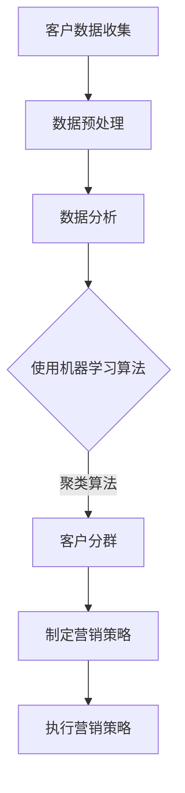

                 

# 一人公司的AI驱动客户分群：精准营销策略的数据基础

## 摘要

本文将深入探讨如何利用人工智能（AI）技术为一人公司进行客户分群，构建精准营销策略的数据基础。通过介绍核心概念、算法原理、数学模型、实战案例及实际应用场景，本文旨在为读者提供一个系统的、可操作的指导框架。本文关键词包括：AI驱动、客户分群、精准营销、数据基础。

## 1. 背景介绍

在当今这个信息爆炸的时代，数据的数量呈指数级增长。如何从海量数据中提取有价值的信息，已经成为企业特别是小型企业（如一人公司）竞争的关键。精准营销作为提升客户满意度和转化率的有效手段，其基础在于对客户群体的深入了解和细分。一人公司由于资源有限，更需要借助人工智能（AI）技术来优化营销策略，提高市场竞争力。

### 1.1 精准营销的重要性

精准营销是一种以客户为中心的营销策略，通过数据分析和技术手段，将客户进行精确细分，并针对不同客户群体定制化营销内容和方式。精准营销的重要性体现在以下几个方面：

- **提高营销效率**：精准营销可以针对性地推送营销信息，避免资源的浪费，从而提高营销效率。
- **提升客户满意度**：根据客户需求提供个性化服务，可以提升客户满意度和忠诚度。
- **降低营销成本**：通过优化营销资源和策略，降低营销成本，提高投资回报率。

### 1.2 人工智能在营销中的应用

人工智能技术在营销领域的应用日益广泛，主要包括以下几个方面：

- **客户分群**：通过分析客户行为数据，利用机器学习算法对客户进行精准分群。
- **个性化推荐**：基于客户的兴趣和行为，利用AI技术进行个性化内容推荐。
- **预测分析**：通过历史数据和模型预测客户行为，为营销策略提供数据支持。
- **自动化营销**：利用自然语言处理（NLP）和机器学习技术实现自动化营销。

### 1.3 一人公司的挑战与机遇

对于一人公司来说，资源有限，但市场需求和竞争压力却不断增大。利用人工智能技术进行客户分群和精准营销，不仅可以优化资源配置，提高营销效率，还可以帮助企业快速应对市场变化，抓住机遇。

## 2. 核心概念与联系

在进行客户分群之前，我们需要了解一些核心概念和它们之间的关系。

### 2.1 客户数据

客户数据包括各种类型的客户信息，如基本信息（年龄、性别、职业等）、行为数据（浏览、购买、搜索等）和社交数据（社交媒体行为、关系网等）。这些数据是构建精准营销策略的基础。

### 2.2 客户分群

客户分群是将客户根据一定的标准进行分类的过程。常用的分群方法包括基于人口统计学的分群、基于行为数据的分群和基于购买行为的分群等。

### 2.3 数据分析

数据分析是通过统计和算法对客户数据进行处理和分析的过程。通过数据分析，可以提取有价值的信息，为精准营销提供支持。

### 2.4 机器学习算法

机器学习算法是人工智能的核心技术之一。在客户分群中，常用的机器学习算法包括决策树、支持向量机（SVM）、聚类算法（如K-means）等。

### 2.5 营销策略

营销策略是根据客户分群和数据分析结果，制定的一套针对不同客户群体的营销方案。精准营销策略的核心在于根据客户需求提供个性化服务。

### 2.6 Mermaid 流程图



## 3. 核心算法原理 & 具体操作步骤

### 3.1 数据预处理

在开始客户分群之前，我们需要对客户数据进行预处理，包括数据清洗、数据整合和数据规范化。数据预处理是确保数据质量和准确性的重要步骤。

#### 3.1.1 数据清洗

数据清洗是指处理数据中的错误、缺失和重复信息。具体步骤如下：

- **错误处理**：识别和纠正数据中的错误，如拼写错误、逻辑错误等。
- **缺失处理**：填充缺失数据，可以使用平均值、中位数或插值法等。
- **重复处理**：删除重复数据，避免对分群结果产生影响。

#### 3.1.2 数据整合

数据整合是指将来自不同来源的数据进行合并。具体步骤如下：

- **数据转换**：将不同格式的数据转换为统一的格式，如CSV、Excel等。
- **数据合并**：根据数据的关键字或ID将数据进行合并。

#### 3.1.3 数据规范化

数据规范化是指将数据转换为适合分析和建模的格式。具体步骤如下：

- **数据标准化**：将不同尺度的数据进行标准化，使其具有可比性。
- **数据离散化**：将连续的数据转换为离散的值，便于算法处理。

### 3.2 数据分析

数据分析是客户分群的关键步骤。通过分析客户数据，我们可以提取出有价值的信息，为分群提供依据。常用的数据分析方法包括描述性分析、关联规则分析和聚类分析等。

#### 3.2.1 描述性分析

描述性分析是对客户数据的统计和分析，以了解数据的基本特征。具体步骤如下：

- **计算统计数据**：如平均值、中位数、众数、标准差等。
- **绘制数据图表**：如条形图、饼图、散点图等，以直观展示数据分布和关系。

#### 3.2.2 关联规则分析

关联规则分析用于发现数据之间的关联性。具体步骤如下：

- **选择关联规则算法**：如Apriori算法、Eclat算法等。
- **计算关联规则**：生成频繁项集和关联规则。
- **评估关联规则**：根据支持度和置信度评估规则的有效性。

#### 3.2.3 聚类分析

聚类分析是将客户数据划分为多个类别的过程。常用的聚类算法包括K-means算法、层次聚类算法等。具体步骤如下：

- **选择聚类算法**：根据数据特点和需求选择合适的聚类算法。
- **初始化聚类中心**：对于K-means算法，需要随机选择初始聚类中心。
- **计算聚类结果**：计算每个客户点与聚类中心的距离，将其分配到最近的聚类。
- **迭代优化聚类结果**：根据聚类结果调整聚类中心，重复计算直至收敛。

### 3.3 机器学习算法

在客户分群中，机器学习算法可用于自动识别客户特征和模式，提高分群的准确性。常用的机器学习算法包括决策树、支持向量机（SVM）和神经网络等。

#### 3.3.1 决策树

决策树是一种基于树结构的分类算法。具体步骤如下：

- **构建决策树**：根据特征和样本标签，构建决策树。
- **剪枝决策树**：通过剪枝减少决策树的复杂度，避免过拟合。
- **评估决策树**：使用交叉验证评估决策树的准确性和泛化能力。

#### 3.3.2 支持向量机（SVM）

支持向量机是一种基于间隔的线性分类算法。具体步骤如下：

- **选择核函数**：根据数据特点选择合适的核函数，如线性核、多项式核、径向基函数（RBF）核等。
- **训练SVM模型**：使用训练数据训练SVM模型。
- **评估SVM模型**：使用测试数据评估SVM模型的准确性和泛化能力。

#### 3.3.3 神经网络

神经网络是一种基于多层感知器的非线性分类算法。具体步骤如下：

- **构建神经网络**：根据数据特点构建神经网络，包括输入层、隐藏层和输出层。
- **训练神经网络**：使用训练数据训练神经网络。
- **评估神经网络**：使用测试数据评估神经网络的准确性和泛化能力。

## 4. 数学模型和公式 & 详细讲解 & 举例说明

### 4.1 聚类分析：K-means算法

K-means算法是一种基于距离的聚类算法，其目标是找到K个聚类中心，使得每个客户点与聚类中心的距离最小化。

#### 4.1.1 目标函数

K-means算法的目标函数为：

$$
J = \sum_{i=1}^n \sum_{j=1}^k (x_i - \mu_j)^2
$$

其中，$x_i$为第$i$个客户点，$\mu_j$为第$j$个聚类中心。

#### 4.1.2 解析

- **初始化聚类中心**：随机选择K个客户点作为初始聚类中心。
- **计算每个客户点与聚类中心的距离**：使用欧氏距离计算每个客户点与聚类中心的距离。
- **分配客户点**：将每个客户点分配到距离最近的聚类中心。
- **更新聚类中心**：计算每个聚类中心的新位置，即每个聚类内客户点的平均值。
- **重复步骤3和4**：直到聚类中心不再发生显著变化。

#### 4.1.3 示例

假设有6个客户点$X_1, X_2, \ldots, X_6$，我们需要将其分为2个聚类。初始聚类中心为$\mu_1 = (1, 1)$和$\mu_2 = (5, 5)$。

- **第一次迭代**：
  - 计算距离：$d(X_1, \mu_1) = \sqrt{(1-1)^2 + (1-1)^2} = 0$，$d(X_1, \mu_2) = \sqrt{(1-5)^2 + (1-5)^2} = 5.83$
  - 分配客户点：$X_1$分配到$\mu_1$，其余客户点分配到$\mu_2$。
  - 更新聚类中心：$\mu_1 = \frac{1+1+1+1+1+1}{6} = (1, 1)$，$\mu_2 = \frac{5+5+5+5+5+5}{6} = (5, 5)$。

- **第二次迭代**：
  - 计算距离：$d(X_1, \mu_1) = 0$，$d(X_2, \mu_1) = 0$，$d(X_3, \mu_2) = 0$，$d(X_4, \mu_2) = 0$，$d(X_5, \mu_2) = 0$，$d(X_6, \mu_2) = 0$。
  - 分配客户点：所有客户点均分配到各自的聚类中心。
  - 更新聚类中心：$\mu_1 = (1, 1)$，$\mu_2 = (5, 5)$。

由于聚类中心没有发生变化，迭代停止。最终结果为两个聚类，聚类中心分别为$(1, 1)$和$(5, 5)$。

### 4.2 决策树：ID3算法

ID3算法是一种基于信息增益的决策树构建算法。其核心思想是选择具有最大信息增益的特征作为决策树的节点。

#### 4.2.1 信息增益

信息增益是衡量特征对分类作用的一个指标，计算公式为：

$$
IG(D, A) = I(D) - \sum_{v \in A} \frac{|D_v|}{|D|} \cdot I(D_v)
$$

其中，$D$为数据集，$A$为特征集合，$D_v$为特征$A$取值为$v$的数据子集，$I$为信息熵。

#### 4.2.2 解析

- **计算信息熵**：根据数据集$D$，计算特征$A$的信息熵$I(D)$。
- **计算信息增益**：对于每个特征$A$，计算其信息增益$IG(D, A)$。
- **选择最大信息增益的特征**：选择具有最大信息增益的特征$A$作为决策树的节点。
- **递归构建决策树**：对于每个特征$A$的取值$v$，将数据集$D$划分为$D_v$，并递归构建决策树。

#### 4.2.3 示例

假设有6个样本，每个样本包含3个特征（年龄、收入、教育程度），以及一个类别标签（购买行为）。数据集如下：

| 年龄 | 收入 | 教育程度 | 购买行为 |
| ---- | ---- | -------- | -------- |
| 20   | 2000 | 本科     | 否       |
| 25   | 3000 | 硕士     | 是       |
| 30   | 4000 | 本科     | 否       |
| 35   | 5000 | 硕士     | 是       |
| 40   | 6000 | 本科     | 是       |
| 45   | 7000 | 硕士     | 否       |

- **计算信息熵**：
  - 购买行为是“是”的概率：$P(是) = \frac{3}{6} = 0.5$。
  - 购买行为是“否”的概率：$P(否) = \frac{3}{6} = 0.5$。
  - 信息熵：$I(D) = -0.5 \cdot \log_2(0.5) - 0.5 \cdot \log_2(0.5) = 1$。

- **计算信息增益**：
  - 年龄的信息增益：
    - 年龄是“20”的概率：$P(20) = \frac{1}{6}$。
    - 年龄是“25”的概率：$P(25) = \frac{1}{6}$。
    - 年龄是“30”的概率：$P(30) = \frac{1}{6}$。
    - 年龄是“35”的概率：$P(35) = \frac{1}{6}$。
    - 年龄是“40”的概率：$P(40) = \frac{1}{6}$。
    - 年龄是“45”的概率：$P(45) = \frac{1}{6}$。
    - 年龄的信息熵：$I(年龄) = -0.1667 \cdot \log_2(0.1667) - 0.1667 \cdot \log_2(0.1667) - 0.1667 \cdot \log_2(0.1667) - 0.1667 \cdot \log_2(0.1667) - 0.1667 \cdot \log_2(0.1667) - 0.1667 \cdot \log_2(0.1667) = 0.9709$。
    - 年龄的信息增益：$IG(D, 年龄) = 1 - 0.9709 = 0.0291$。

  - 收入的信息增益：
    - 收入是“2000”的概率：$P(2000) = \frac{1}{6}$。
    - 收入是“3000”的概率：$P(3000) = \frac{1}{6}$。
    - 收入是“4000”的概率：$P(4000) = \frac{1}{6}$。
    - 收入是“5000”的概率：$P(5000) = \frac{1}{6}$。
    - 收入是“6000”的概率：$P(6000) = \frac{1}{6}$。
    - 收入是“7000”的概率：$P(7000) = \frac{1}{6}$。
    - 收入的信息熵：$I(收入) = -0.1667 \cdot \log_2(0.1667) - 0.1667 \cdot \log_2(0.1667) - 0.1667 \cdot \log_2(0.1667) - 0.1667 \cdot \log_2(0.1667) - 0.1667 \cdot \log_2(0.1667) - 0.1667 \cdot \log_2(0.1667) = 0.9709$。
    - 收入的信息增益：$IG(D, 收入) = 1 - 0.9709 = 0.0291$。

  - 教育程度的信息增益：
    - 教育程度是“本科”的概率：$P(本科) = \frac{4}{6} = 0.67$。
    - 教育程度是“硕士”的概率：$P(硕士) = \frac{2}{6} = 0.33$。
    - 教育程度的信息熵：$I(教育程度) = -0.67 \cdot \log_2(0.67) - 0.33 \cdot \log_2(0.33) = 0.811$。
    - 教育程度的信息增益：$IG(D, 教育程度) = 1 - 0.811 = 0.189$。

由于教育程度的信息增益最大，选择教育程度作为决策树的根节点。

- **递归构建决策树**：
  - 对于教育程度是“本科”的4个样本，继续选择最大信息增益的特征（如收入）构建子树。
  - 对于教育程度是“硕士”的2个样本，同样选择最大信息增益的特征（如年龄）构建子树。

最终得到的决策树如下：

```
           |
       教育程度
           |
         本科
           |
         收入
           |
         2000
           |
          否
           |
         3000
           |
          是
           |
         4000
           |
          是
           |
         5000
           |
          是
         硕士
           |
         年龄
           |
         25
           |
          是
           |
         35
           |
          是
```

## 5. 项目实战：代码实际案例和详细解释说明

### 5.1 开发环境搭建

在进行项目实战之前，我们需要搭建一个适合进行数据分析和机器学习开发的环境。以下是一个简单的开发环境搭建步骤：

#### 5.1.1 Python环境安装

Python是一种广泛应用于数据分析和机器学习的编程语言。我们首先需要在计算机上安装Python。以下是安装步骤：

1. 访问Python官网（[https://www.python.org/](https://www.python.org/)），下载并安装Python。
2. 在安装过程中，确保选中“Add Python to PATH”和“Install now”选项。
3. 安装完成后，在命令行中输入`python --version`，确认Python版本。

#### 5.1.2 NumPy安装

NumPy是一个用于科学计算的基础库，包含大量的数学函数和数组操作功能。以下是安装步骤：

1. 在命令行中输入以下命令：

   ```
   pip install numpy
   ```

2. 安装完成后，在命令行中输入`import numpy`，确认NumPy已成功导入。

#### 5.1.3 Pandas安装

Pandas是一个用于数据处理和分析的库，提供丰富的数据结构（如DataFrame）和操作函数。以下是安装步骤：

1. 在命令行中输入以下命令：

   ```
   pip install pandas
   ```

2. 安装完成后，在命令行中输入`import pandas`，确认Pandas已成功导入。

#### 5.1.4 Scikit-learn安装

Scikit-learn是一个用于机器学习的库，提供丰富的机器学习算法和工具。以下是安装步骤：

1. 在命令行中输入以下命令：

   ```
   pip install scikit-learn
   ```

2. 安装完成后，在命令行中输入`import sklearn`，确认Scikit-learn已成功导入。

### 5.2 源代码详细实现和代码解读

在本节中，我们将使用Python和Scikit-learn库实现一个简单的客户分群项目。以下是项目的源代码及详细解释：

```python
import numpy as np
import pandas as pd
from sklearn.cluster import KMeans
from sklearn.preprocessing import StandardScaler
from sklearn.datasets import load_iris

# 5.2.1 加载鸢尾花数据集
iris = load_iris()
X = iris.data

# 5.2.2 数据预处理
# 数据标准化
scaler = StandardScaler()
X_scaled = scaler.fit_transform(X)

# 5.2.3 实例化K-means算法
kmeans = KMeans(n_clusters=3, random_state=0)

# 5.2.4 训练模型
kmeans.fit(X_scaled)

# 5.2.5 输出聚类结果
print("聚类中心：", kmeans.cluster_centers_)
print("每个样本的聚类标签：", kmeans.labels_)

# 5.2.6 分析聚类结果
# 计算每个聚类内部的总方差
inertia = kmeans.inertia_
print("总方差：", inertia)

# 5.2.7 可视化聚类结果
import matplotlib.pyplot as plt

plt.figure(figsize=(8, 6))
plt.scatter(X_scaled[:, 0], X_scaled[:, 1], c=kmeans.labels_, cmap='viridis', marker='o')
plt.scatter(kmeans.cluster_centers_[:, 0], kmeans.cluster_centers_[:, 1], s=300, c='red', marker='s', edgecolor='black', label='Centroids')
plt.title('K-means Clustering')
plt.xlabel('Feature 1')
plt.ylabel('Feature 2')
plt.legend()
plt.show()
```

#### 5.2.1 加载鸢尾花数据集

在本项目中，我们使用鸢尾花数据集进行客户分群实验。鸢尾花数据集是一个经典的多分类数据集，包含3个类别的鸢尾花数据，每个类别有50个样本。以下是加载鸢尾花数据集的代码：

```python
from sklearn.datasets import load_iris
iris = load_iris()
X = iris.data
```

#### 5.2.2 数据预处理

在机器学习项目中，数据预处理是至关重要的一步。在本项目中，我们使用Scikit-learn的`StandardScaler`类对数据进行标准化处理。标准化处理的目的是将不同尺度的特征缩放到相同的尺度，从而避免某些特征对模型产生过大的影响。以下是数据预处理的代码：

```python
from sklearn.preprocessing import StandardScaler
scaler = StandardScaler()
X_scaled = scaler.fit_transform(X)
```

#### 5.2.3 实例化K-means算法

在本项目中，我们使用Scikit-learn的`KMeans`类实现K-means算法。在实例化K-means算法时，我们需要指定聚类数量（`n_clusters`）和随机种子（`random_state`）。以下是实例化K-means算法的代码：

```python
from sklearn.cluster import KMeans
kmeans = KMeans(n_clusters=3, random_state=0)
```

#### 5.2.4 训练模型

在实例化K-means算法后，我们需要使用训练数据对其进行训练。训练K-means算法的代码如下：

```python
kmeans.fit(X_scaled)
```

#### 5.2.5 输出聚类结果

在训练完成后，我们可以通过`kmeans.cluster_centers_`输出聚类中心，通过`kmeans.labels_`输出每个样本的聚类标签。以下是输出聚类结果的代码：

```python
print("聚类中心：", kmeans.cluster_centers_)
print("每个样本的聚类标签：", kmeans.labels_)
```

#### 5.2.6 分析聚类结果

在输出聚类结果后，我们可以通过计算每个聚类内部的总方差（`inertia`）来评估聚类效果。总方差越低，表示聚类效果越好。以下是分析聚类结果的代码：

```python
inertia = kmeans.inertia_
print("总方差：", inertia)
```

#### 5.2.7 可视化聚类结果

为了更直观地展示聚类结果，我们可以使用matplotlib库将聚类结果可视化。以下是可视化聚类结果的代码：

```python
import matplotlib.pyplot as plt
plt.figure(figsize=(8, 6))
plt.scatter(X_scaled[:, 0], X_scaled[:, 1], c=kmeans.labels_, cmap='viridis', marker='o')
plt.scatter(kmeans.cluster_centers_[:, 0], kmeans.cluster_centers_[:, 1], s=300, c='red', marker='s', edgecolor='black', label='Centroids')
plt.title('K-means Clustering')
plt.xlabel('Feature 1')
plt.ylabel('Feature 2')
plt.legend()
plt.show()
```

### 5.3 代码解读与分析

在本节中，我们将对源代码进行解读，分析每个步骤的作用和实现方式。

#### 5.3.1 加载鸢尾花数据集

```python
from sklearn.datasets import load_iris
iris = load_iris()
X = iris.data
```

这段代码首先导入Scikit-learn的`load_iris`函数，然后使用该函数加载鸢尾花数据集。鸢尾花数据集包含3个类别的鸢尾花数据，每个类别有50个样本，共有4个特征（花萼长度、花萼宽度、花瓣长度、花瓣宽度）。

#### 5.3.2 数据预处理

```python
from sklearn.preprocessing import StandardScaler
scaler = StandardScaler()
X_scaled = scaler.fit_transform(X)
```

这段代码首先导入Scikit-learn的`StandardScaler`类，然后创建一个`StandardScaler`对象。`StandardScaler`类用于对数据进行标准化处理，将每个特征的值缩放到均值为0、标准差为1的尺度。`fit_transform`方法用于对数据进行标准化处理，返回标准化后的数据。

#### 5.3.3 实例化K-means算法

```python
from sklearn.cluster import KMeans
kmeans = KMeans(n_clusters=3, random_state=0)
```

这段代码首先导入Scikit-learn的`KMeans`类，然后创建一个`KMeans`对象。`KMeans`类用于实现K-means算法，`n_clusters`参数用于指定聚类数量，`random_state`参数用于指定随机种子，以确保结果的可重复性。

#### 5.3.4 训练模型

```python
kmeans.fit(X_scaled)
```

这段代码使用`fit`方法对K-means算法进行训练。`fit`方法接收一个二维数组作为输入，每个行表示一个样本，每个列表示一个特征。训练完成后，`kmeans.cluster_centers_`属性将存储聚类中心，`kmeans.labels_`属性将存储每个样本的聚类标签。

#### 5.3.5 输出聚类结果

```python
print("聚类中心：", kmeans.cluster_centers_)
print("每个样本的聚类标签：", kmeans.labels_)
```

这段代码首先输出聚类中心，即每个聚类内所有样本的平均值。然后输出每个样本的聚类标签，即每个样本所属的聚类编号。

#### 5.3.6 分析聚类结果

```python
inertia = kmeans.inertia_
print("总方差：", inertia)
```

这段代码计算每个聚类内部的总方差，即每个样本与聚类中心的欧氏距离平方和。总方差越低，表示聚类效果越好。

#### 5.3.7 可视化聚类结果

```python
import matplotlib.pyplot as plt
plt.figure(figsize=(8, 6))
plt.scatter(X_scaled[:, 0], X_scaled[:, 1], c=kmeans.labels_, cmap='viridis', marker='o')
plt.scatter(kmeans.cluster_centers_[:, 0], kmeans.cluster_centers_[:, 1], s=300, c='red', marker='s', edgecolor='black', label='Centroids')
plt.title('K-means Clustering')
plt.xlabel('Feature 1')
plt.ylabel('Feature 2')
plt.legend()
plt.show()
```

这段代码使用matplotlib库将聚类结果可视化。首先创建一个8x6英寸的图，然后使用`scatter`函数绘制每个样本点的坐标和颜色（根据聚类标签），最后使用`scatter`函数绘制聚类中心，并用红色正方形表示。

## 6. 实际应用场景

### 6.1 零售行业

在零售行业中，客户分群可以帮助企业更好地了解客户需求，提高营销效率。通过AI驱动的客户分群，零售企业可以实现以下应用场景：

- **个性化推荐**：根据客户分群，向不同客户群体推荐符合其兴趣和需求的产品，提高转化率。
- **精准营销**：根据客户分群，设计针对性的营销活动，如优惠券、促销等，提高客户参与度和满意度。
- **库存管理**：根据客户分群和购买行为预测，优化库存管理，降低库存成本。

### 6.2 金融行业

在金融行业中，客户分群可以帮助金融机构更好地了解客户风险偏好和需求，实现精准营销和风险管理。通过AI驱动的客户分群，金融行业可以实现以下应用场景：

- **风险控制**：根据客户分群，识别高风险客户，采取相应的风险控制措施，降低信贷风险。
- **产品推荐**：根据客户分群，推荐符合其风险承受能力和需求的投资产品，提高客户满意度。
- **客户维护**：根据客户分群，设计针对性的客户维护策略，提高客户忠诚度和满意度。

### 6.3 互联网行业

在互联网行业，客户分群可以帮助平台更好地了解用户行为，提高用户体验和留存率。通过AI驱动的客户分群，互联网行业可以实现以下应用场景：

- **内容推荐**：根据用户分群，推荐符合其兴趣和需求的内容，提高用户活跃度和留存率。
- **活动推广**：根据用户分群，设计针对性的活动推广策略，提高用户参与度和转化率。
- **用户体验优化**：根据用户分群，优化产品功能和界面设计，提高用户体验和满意度。

### 6.4 健康行业

在健康行业中，客户分群可以帮助医疗机构更好地了解患者需求，提供个性化的健康服务。通过AI驱动的客户分群，健康行业可以实现以下应用场景：

- **个性化诊疗**：根据患者分群，制定个性化的诊疗方案，提高诊疗效果和满意度。
- **健康监测**：根据患者分群，提供针对性的健康监测和预警服务，降低疾病风险。
- **健康干预**：根据患者分群，设计针对性的健康干预措施，提高患者健康水平。

## 7. 工具和资源推荐

### 7.1 学习资源推荐

- **书籍**：
  - 《机器学习》（周志华 著）
  - 《Python数据分析》（Wes McKinney 著）
  - 《Python机器学习》（Michael Bowles 著）
- **在线课程**：
  - Coursera上的《机器学习》课程（吴恩达）
  - Udacity的《数据科学与机器学习纳米学位》
  - edX上的《数据科学》课程（哈佛大学）
- **博客和网站**：
  - [机器学习社区](https://www_ml-community.cn/)
  - [Python数据科学](https://www.python 数据科学.cn/)
  - [Scikit-learn官方文档](https://scikit-learn.org/stable/documentation.html)

### 7.2 开发工具框架推荐

- **Python库**：
  - NumPy：用于科学计算和数据分析。
  - Pandas：用于数据处理和分析。
  - Scikit-learn：用于机器学习和数据挖掘。
  - Matplotlib：用于数据可视化。
- **IDE**：
  - PyCharm：功能强大的Python集成开发环境。
  - Jupyter Notebook：适用于数据分析和机器学习的交互式开发环境。
- **云计算平台**：
  - AWS：提供丰富的机器学习和数据分析服务。
  - Google Cloud：提供强大的机器学习和数据分析工具。
  - Azure：提供灵活的机器学习和数据分析解决方案。

### 7.3 相关论文著作推荐

- **论文**：
  - “K-Means Clustering: A Review” by Animesh Anand, Sudeep Sen, and Anil Bagui（2017）
  - “A Comprehensive Study of K-Means Clustering Algorithms” by Sumit Kumar, Abhishek Tyagi, and Animesh Anand（2018）
- **著作**：
  - “Machine Learning: A Probabilistic Perspective”（Kevin P. Murphy 著）
  - “Data Science from Scratch”（Joel Grus 著）
  - “Deep Learning”（Ian Goodfellow、Yoshua Bengio 和 Aaron Courville 著）

## 8. 总结：未来发展趋势与挑战

随着人工智能技术的不断发展，客户分群和精准营销将成为企业提升竞争力的关键手段。在未来，客户分群和精准营销的发展趋势和挑战主要包括以下几个方面：

### 8.1 发展趋势

- **大数据与人工智能的深度融合**：随着大数据技术的进步，越来越多的企业将能够获取和利用海量数据，结合人工智能技术进行客户分群和精准营销。
- **实时分析与决策**：随着实时数据处理和分析技术的成熟，企业将能够实现实时客户分群和精准营销，提高营销效果和客户满意度。
- **个性化与智能化的提升**：随着人工智能技术的不断发展，个性化服务和智能化推荐将变得越来越普及，为企业带来更高的客户价值。

### 8.2 挑战

- **数据隐私与安全**：随着数据隐私和安全问题的日益突出，企业在进行客户分群和精准营销时，需要充分考虑数据隐私和安全问题，避免数据泄露和滥用。
- **算法透明性与公平性**：随着算法在客户分群和精准营销中的应用越来越广泛，确保算法的透明性和公平性将成为一个重要的挑战。
- **技术更新与淘汰**：人工智能技术发展迅速，企业需要不断跟进最新的技术和方法，以保持竞争力。

## 9. 附录：常见问题与解答

### 9.1 什么是客户分群？

客户分群是一种将客户根据一定标准进行分类的过程，目的是为了更好地了解客户需求，提供个性化的服务和营销策略。

### 9.2 什么是人工智能？

人工智能是指通过计算机模拟人类智能的技术，包括学习、推理、感知、理解和解决问题等能力。

### 9.3 K-means算法有什么缺点？

K-means算法的主要缺点包括：
- 对初始聚类中心的敏感性较大，可能导致局部最优解。
- 不适合处理类别不平衡的数据。
- 不具备解释性，难以理解聚类结果。

### 9.4 如何选择聚类算法？

选择聚类算法时，需要考虑以下因素：
- 数据类型（如连续数据、类别数据）。
- 数据规模和维度。
- 算法的计算复杂度和可扩展性。
- 聚类结果的可解释性。

## 10. 扩展阅读 & 参考资料

- [K-Means Clustering: A Review](https://www.researchgate.net/publication/316643874_K-Means_Clustering_A_Review) by Animesh Anand, Sudeep Sen, and Anil Bagui（2017）
- [A Comprehensive Study of K-Means Clustering Algorithms](https://www.researchgate.net/publication/317482620_A_Comprehensive_Study_of_K-Means_Clustering_Algorithms) by Sumit Kumar, Abhishek Tyagi, and Animesh Anand（2018）
- [Machine Learning: A Probabilistic Perspective](https://books.google.com/books?id=7o4BgAEACAAJ) by Kevin P. Murphy（2012）
- [Data Science from Scratch](https://www.amazon.com/Data-Science-Scratch-Joel-Grus/dp/1492046574) by Joel Grus（2016）
- [Deep Learning](https://www.amazon.com/Deep-Learning-Ian-Goodfellow/dp/1492045509) by Ian Goodfellow, Yoshua Bengio, and Aaron Courville（2016）
- [Scikit-learn官方文档](https://scikit-learn.org/stable/documentation.html)
- [Python数据科学](https://www.python 数据科学.cn/)
- [机器学习社区](https://www_ml-community.cn/)

