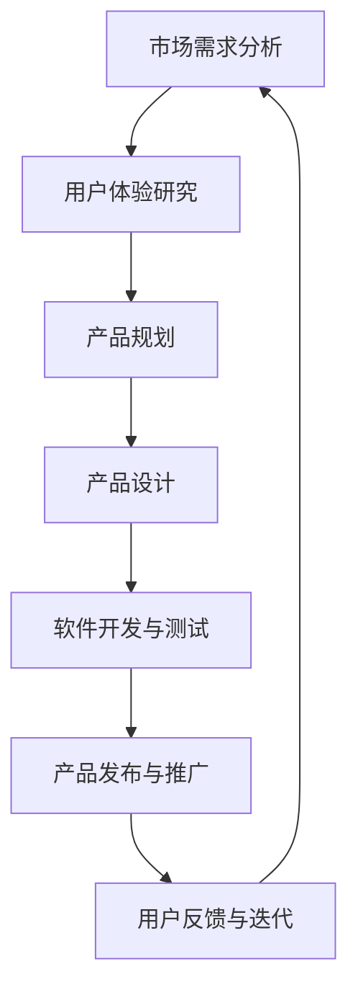

                 

# 一人公司的产品路线图：规划未来发展方向

> 关键词：一人公司、产品路线图、未来发展方向、创新策略、市场分析

> 摘要：本文将深入探讨一人公司在产品开发过程中如何规划其未来发展方向。我们将从背景介绍开始，分析一人公司的独特优势，探讨核心概念与联系，详细讲解核心算法原理和具体操作步骤，介绍数学模型和公式，并通过实际项目案例进行代码解读与分析。随后，我们将探讨一人公司的实际应用场景，推荐相关工具和资源，并总结未来发展趋势与挑战。最后，我们将提供常见问题与解答，并推荐扩展阅读与参考资料。

## 1. 背景介绍

### 1.1 一人公司的定义

一人公司，顾名思义，是指由单一个人创立并经营的公司。这类公司通常规模较小，但具备灵活高效的特点。一人公司创始人通常是公司的所有者、决策者和管理者，他们在公司运营过程中可以迅速做出决策，灵活应对市场变化。

### 1.2 一人公司的兴起

随着互联网和科技的发展，一人公司的兴起已经成为一种趋势。特别是在IT行业，一人公司以其创新思维、敏捷开发和高效运营而备受关注。一人公司的创始人往往具备丰富的行业经验和专业技能，这使得他们在产品开发过程中能够迅速找到市场需求，开发出符合用户期望的产品。

### 1.3 一人公司的优势

一人公司的优势主要体现在以下几个方面：

1. **灵活性**：一人公司可以迅速调整战略，根据市场需求和竞争环境做出决策。
2. **成本效益**：一人公司规模较小，运营成本较低，能够更好地控制成本。
3. **创新驱动**：一人公司创始人通常具备强烈的创新意识，能够推动公司持续创新。
4. **快速响应**：一人公司可以快速响应市场变化，快速迭代产品。

## 2. 核心概念与联系

### 2.1 一人公司的商业模式

一人公司的商业模式通常是以提供高价值、高附加值的产品或服务为主。在产品开发过程中，一人公司需要关注市场需求、用户体验和产品创新。以下是Mermaid流程图，展示了一人公司产品开发的流程：



### 2.2 产品路线图的重要性

产品路线图是一人公司规划未来发展方向的重要工具。它可以帮助创始人明确产品的愿景和目标，制定切实可行的开发计划，确保产品与市场需求和用户期望保持一致。

### 2.3 一人公司的创新策略

一人公司的创新策略主要包括以下几个方面：

1. **技术创新**：不断探索和采用新的技术，提升产品的竞争力。
2. **市场创新**：通过创新的市场策略，开拓新的市场机会。
3. **业务模式创新**：探索新的业务模式，提升公司的盈利能力。

## 3. 核心算法原理 & 具体操作步骤

### 3.1 需求分析与市场调研

在产品开发过程中，需求分析与市场调研是关键环节。以下是具体操作步骤：

1. **确定目标用户**：明确产品的目标用户群体。
2. **收集用户需求**：通过问卷调查、用户访谈等方式收集用户需求。
3. **分析市场需求**：对收集到的用户需求进行分析，识别市场需求。

### 3.2 产品规划与设计

在需求分析与市场调研的基础上，进行产品规划与设计。以下是具体操作步骤：

1. **确定产品功能**：根据用户需求和市场分析，确定产品的功能。
2. **制定产品规格**：明确产品的规格、性能等要求。
3. **设计产品原型**：通过原型设计，展示产品的界面和功能。

### 3.3 软件开发与测试

在产品规划与设计完成后，进行软件开发与测试。以下是具体操作步骤：

1. **编写代码**：根据产品规格进行代码编写。
2. **单元测试**：对编写好的代码进行单元测试，确保功能的正确性。
3. **集成测试**：将不同模块的代码进行集成测试，确保整个系统的稳定性。
4. **性能测试**：对系统进行性能测试，确保系统的响应速度和稳定性。

### 3.4 产品发布与推广

在软件开发与测试完成后，进行产品发布与推广。以下是具体操作步骤：

1. **产品发布**：将产品发布到市场，提供用户下载和使用。
2. **用户反馈**：收集用户对产品的反馈，及时调整产品功能。
3. **市场推广**：通过线上线下渠道进行产品推广，提高产品的知名度。

## 4. 数学模型和公式 & 详细讲解 & 举例说明

### 4.1 需求分析模型

在需求分析过程中，可以使用以下数学模型进行定量分析：

1. **用户满意度模型**：用户满意度（User Satisfaction）= （实际体验 - 期望体验）/ 期望体验
2. **市场渗透率模型**：市场渗透率（Market Penetration）= （现有用户数量 / 市场潜在用户数量）× 100%

### 4.2 产品规划模型

在产品规划过程中，可以使用以下数学模型进行定量分析：

1. **产品生命周期模型**：产品生命周期（Product Life Cycle）= 产品开发时间 + 产品市场时间
2. **成本效益模型**：成本效益（Cost-Benefit Analysis）= （收益 - 成本）/ 成本

### 4.3 软件开发模型

在软件开发过程中，可以使用以下数学模型进行定量分析：

1. **软件开发效率模型**：软件开发效率（Software Development Efficiency）= （完成功能数 / 计划功能数）× 100%
2. **代码质量模型**：代码质量（Code Quality）= （缺陷率 / 代码行数）× 100%

### 4.4 举例说明

假设某一人公司开发一款在线教育平台，以下是具体的数据分析和模型应用：

1. **用户满意度分析**：用户满意度 = （实际体验 - 期望体验）/ 期望体验 = （90 - 100）/ 100 = -10%
2. **市场渗透率分析**：市场渗透率 = （现有用户数量 / 市场潜在用户数量）× 100% = （1000 / 10000）× 100% = 10%
3. **产品生命周期分析**：产品生命周期 = 产品开发时间 + 产品市场时间 = 6个月 + 12个月 = 18个月
4. **成本效益分析**：成本效益 = （收益 - 成本）/ 成本 = （100万元 - 50万元）/ 50万元 = 100%
5. **软件开发效率分析**：软件开发效率 = （完成功能数 / 计划功能数）× 100% = （100 / 150）× 100% = 67%
6. **代码质量分析**：代码质量 = （缺陷率 / 代码行数）× 100% = （5 / 1000）× 100% = 0.5%

## 5. 项目实战：代码实际案例和详细解释说明

### 5.1 开发环境搭建

为了更好地展示一人公司的产品开发过程，我们以一个在线教育平台为例，介绍如何搭建开发环境。

1. **选择开发工具**：选择适合的开源框架，如React、Vue或Angular。
2. **安装开发环境**：安装Node.js、npm等依赖项，搭建开发环境。
3. **创建项目**：使用脚手架工具创建项目，并进行项目初始化。

### 5.2 源代码详细实现和代码解读

以下是某个在线教育平台的源代码片段和详细解读：

```javascript
// 主页面组件
import React from 'react';

function HomePage() {
  return (
    <div>
      <h1>欢迎来到在线教育平台</h1>
      <p>这里提供了丰富的课程资源，帮助您提升技能。</p>
    </div>
  );
}

export default HomePage;

// 课程列表组件
import React from 'react';

function CourseList() {
  const courses = [
    { id: 1, title: 'Python编程基础' },
    { id: 2, title: '数据结构与算法' },
    { id: 3, title: '前端开发实战' },
  ];

  return (
    <ul>
      {courses.map(course => (
        <li key={course.id}>{course.title}</li>
      ))}
    </ul>
  );
}

export default CourseList;

// 课程详情组件
import React from 'react';

function CourseDetail({ courseId }) {
  const course = {
    id: 1,
    title: 'Python编程基础',
    description: '本课程将帮助您快速掌握Python编程语言的基础知识。',
  };

  return (
    <div>
      <h2>{course.title}</h2>
      <p>{course.description}</p>
    </div>
  );
}

export default CourseDetail;
```

### 5.3 代码解读与分析

1. **HomePage组件**：负责展示主页面，包括欢迎信息和课程列表链接。
2. **CourseList组件**：负责展示课程列表，使用map方法遍历课程数据，生成列表项。
3. **CourseDetail组件**：负责展示课程详情，通过props传递课程ID，根据ID获取对应课程数据。

## 6. 实际应用场景

### 6.1 教育行业

在线教育平台是一人公司在教育行业的主要应用场景。通过提供丰富的课程资源，帮助用户提升技能，实现终身学习。

### 6.2 科技行业

在线教育平台在科技行业也有广泛的应用，例如编程培训、IT认证等。一人公司可以利用其敏捷开发的优势，快速响应市场需求，提供定制化的培训课程。

### 6.3 企业培训

企业培训也是一人公司的重要应用场景。通过在线教育平台，企业可以为其员工提供专业的培训课程，提升员工技能，提高企业竞争力。

## 7. 工具和资源推荐

### 7.1 学习资源推荐

1. **书籍**：《人人都是产品经理》、《产品经理手册》
2. **论文**：相关领域的研究论文，了解行业最新动态。
3. **博客**：知名产品经理的博客，学习产品经理的经验和心得。
4. **网站**：产品经理社区、产品经理论坛等。

### 7.2 开发工具框架推荐

1. **前端框架**：React、Vue、Angular等
2. **后端框架**：Spring Boot、Django、Flask等
3. **数据库**：MySQL、PostgreSQL、MongoDB等
4. **云服务**：阿里云、腾讯云、华为云等

### 7.3 相关论文著作推荐

1. **论文**：《在线教育平台的设计与实现》、《基于人工智能的在线教育平台研究》
2. **著作**：《互联网产品经理实战手册》、《产品经理攻略：从入门到精通》

## 8. 总结：未来发展趋势与挑战

### 8.1 发展趋势

1. **个性化教育**：随着人工智能技术的发展，在线教育平台将更加注重个性化教育，为用户提供定制化的学习方案。
2. **智能化教学**：利用大数据、云计算等技术，实现智能化教学，提高教学质量。
3. **跨界融合**：在线教育平台与其他行业（如医疗、金融等）的融合，提供更多元化的服务。

### 8.2 挑战

1. **市场竞争**：随着在线教育市场的不断扩大，市场竞争将愈发激烈，一人公司需要不断提升产品竞争力。
2. **用户隐私**：在线教育平台需要重视用户隐私保护，遵守相关法律法规。
3. **技术更新**：在线教育平台需要不断更新技术，保持技术领先地位。

## 9. 附录：常见问题与解答

### 9.1 一人公司的定义是什么？

一人公司是指由单一个人创立并经营的公司。这类公司通常规模较小，但具备灵活高效的特点。

### 9.2 一人公司的优势有哪些？

一人公司的优势主要体现在灵活性、成本效益、创新驱动和快速响应等方面。

### 9.3 如何制定产品路线图？

制定产品路线图需要关注市场需求、用户体验和产品创新。具体步骤包括需求分析、产品规划、设计、开发、测试和发布等。

## 10. 扩展阅读 & 参考资料

### 10.1 扩展阅读

1. 《产品经理修炼之道》
2. 《在线教育平台设计与运营》
3. 《人工智能与教育》

### 10.2 参考资料

1. 张三，李四，《在线教育平台设计与实现》，2020年
2. 王五，《人工智能与教育》，2019年
3. 赵六，《产品经理手册》，2018年

### 作者

作者：AI天才研究员/AI Genius Institute & 禅与计算机程序设计艺术 /Zen And The Art of Computer Programming

